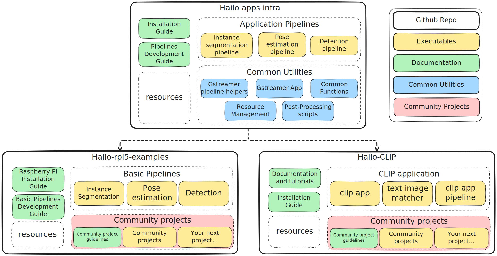

# Directory Content: .

## Directory Structure

```
.
├── .git
│   ├── branches
│   ├── hooks
│   │   ├── applypatch-msg.sample
│   │   ├── commit-msg.sample
│   │   ├── fsmonitor-watchman.sample
│   │   ├── post-update.sample
│   │   ├── pre-applypatch.sample
│   │   ├── pre-commit.sample
│   │   ├── pre-merge-commit.sample
│   │   ├── pre-push.sample
│   │   ├── pre-rebase.sample
│   │   ├── pre-receive.sample
│   │   ├── prepare-commit-msg.sample
│   │   ├── push-to-checkout.sample
│   │   └── update.sample
│   ├── info
│   │   └── exclude
│   ├── logs
│   │   ├── refs
│   │   │   ├── heads
│   │   │   │   ├── CSG-174
│   │   │   │   └── main
│   │   │   └── remotes
│   │   │       └── origin
│   │   │           └── HEAD
│   │   └── HEAD
│   ├── objects
│   │   ├── info
│   │   └── pack
│   │       ├── pack-c9f5d3eb9d35ddedb7d721ecdb680089efbdf7e7.idx
│   │       └── pack-c9f5d3eb9d35ddedb7d721ecdb680089efbdf7e7.pack
│   ├── refs
│   │   ├── heads
│   │   │   ├── CSG-174
│   │   │   └── main
│   │   ├── remotes
│   │   │   └── origin
│   │   │       └── HEAD
│   │   └── tags
│   ├── HEAD
│   ├── config
│   ├── description
│   ├── index
│   └── packed-refs
├── .pytest_cache
│   ├── v
│   │   └── cache
│   │       ├── lastfailed
│   │       ├── nodeids
│   │       └── stepwise
│   ├── .gitignore
│   ├── CACHEDIR.TAG
│   └── README.md
├── build.release
│   ├── cpp
│   │   ├── libdepth_postprocess.so.p
│   │   │   └── depth_estimation.cpp.o
│   │   ├── libremove_labels.so.p
│   │   │   └── remove_labels.cpp.o
│   │   ├── libyolo_hailortpp_postprocess.so.p
│   │   │   └── yolo_hailortpp.cpp.o
│   │   ├── libyolov5seg_postprocess.so.p
│   │   │   └── yolov5seg.cpp.o
│   │   ├── libyolov8pose_postprocess.so.p
│   │   │   └── yolov8pose_postprocess.cpp.o
│   │   ├── libdepth_postprocess.so
│   │   ├── libremove_labels.so
│   │   ├── libyolo_hailortpp_postprocess.so
│   │   ├── libyolov5seg_postprocess.so
│   │   └── libyolov8pose_postprocess.so
│   ├── meson-info
│   │   ├── intro-benchmarks.json
│   │   ├── intro-buildoptions.json
│   │   ├── intro-buildsystem_files.json
│   │   ├── intro-dependencies.json
│   │   ├── intro-install_plan.json
│   │   ├── intro-installed.json
│   │   ├── intro-projectinfo.json
│   │   ├── intro-targets.json
│   │   ├── intro-tests.json
│   │   └── meson-info.json
│   ├── meson-logs
│   │   ├── install-log.txt
│   │   └── meson-log.txt
│   ├── meson-private
│   │   ├── build.dat
│   │   ├── cmd_line.txt
│   │   ├── coredata.dat
│   │   ├── coredata.dat.prev
│   │   ├── install.dat
│   │   ├── meson.lock
│   │   ├── meson_benchmark_setup.dat
│   │   ├── meson_test_setup.dat
│   │   ├── sanitycheckc.c
│   │   ├── sanitycheckc.exe
│   │   ├── sanitycheckcpp.cc
│   │   └── sanitycheckcpp.exe
│   ├── .gitignore
│   ├── .hgignore
│   ├── .ninja_deps
│   ├── .ninja_log
│   ├── build.ninja
│   └── compile_commands.json
├── cpp
│   ├── __pycache__
│   │   └── __init__.cpython-311.pyc
│   ├── __init__.py
│   ├── depth_estimation.cpp
│   ├── depth_estimation.hpp
│   ├── hailo_nms_decode.hpp
│   ├── mask_decoding.hpp
│   ├── meson.build
│   ├── remove_labels.cpp
│   ├── remove_labels.hpp
│   ├── yolo_hailortpp.cpp
│   ├── yolo_hailortpp.hpp
│   ├── yolov5seg.cpp
│   ├── yolov5seg.hpp
│   ├── yolov8pose_postprocess.cpp
│   └── yolov8pose_postprocess.hpp
├── doc
│   ├── images
│   │   ├── github_applications_infrastructure.png
│   │   └── hailo_examples_code_structure.svg
│   └── development_guide.md
├── hailo_apps_infra
│   ├── __pycache__
│   │   └── __init__.cpython-311.pyc
│   ├── common
│   │   ├── __pycache__
│   │   │   ├── __init__.cpython-311.pyc
│   │   │   ├── get_usb_camera.cpython-311.pyc
│   │   │   ├── hailo_rpi_common.cpython-311.pyc
│   │   │   └── test_utils.cpython-311-pytest-8.3.5.pyc
│   │   ├── __init__.py
│   │   ├── get_usb_camera.py
│   │   ├── hailo_rpi_common.py
│   │   └── test_utils.py
│   ├── config
│   │   ├── config.yaml
│   │   └── resources_config.yaml
│   ├── core
│   │   ├── __pycache__
│   │   │   ├── __init__.cpython-311.pyc
│   │   │   ├── depth_pipeline.cpython-311.pyc
│   │   │   ├── detection_pipeline.cpython-311.pyc
│   │   │   ├── detection_pipeline_simple.cpython-311.pyc
│   │   │   ├── instance_segmentation_pipeline.cpython-311.pyc
│   │   │   └── pose_estimation_pipeline.cpython-311.pyc
│   │   ├── __init__.py
│   │   ├── depth_pipeline.py
│   │   ├── detection_pipeline.py
│   │   ├── detection_pipeline_simple.py
│   │   ├── instance_segmentation_pipeline.py
│   │   └── pose_estimation_pipeline.py
│   ├── gstreamer
│   │   ├── __pycache__
│   │   │   ├── __init__.cpython-311.pyc
│   │   │   ├── gstreamer_app.cpython-311.pyc
│   │   │   └── gstreamer_helper_pipelines.cpython-311.pyc
│   │   ├── __init__.py
│   │   ├── gstreamer_app.py
│   │   └── gstreamer_helper_pipelines.py
│   ├── installation
│   │   ├── __pycache__
│   │   │   ├── __init__.cpython-311.pyc
│   │   │   ├── compile_cpp.cpython-311.pyc
│   │   │   ├── download_resources.cpython-311.pyc
│   │   │   ├── install.cpython-311.pyc
│   │   │   ├── post_install.cpython-311.pyc
│   │   │   ├── set_env.cpython-311.pyc
│   │   │   └── validate_config.cpython-311.pyc
│   │   ├── __init__.py
│   │   ├── compile_cpp.py
│   │   ├── download_resources.py
│   │   ├── install.py
│   │   ├── post_install.py
│   │   ├── set_env.py
│   │   └── validate_config.py
│   ├── .env
│   ├── __init__.py
│   ├── classes_MyProject.png
│   └── packages_MyProject.png
├── hailo_apps_infra.egg-info
│   ├── PKG-INFO
│   ├── SOURCES.txt
│   ├── dependency_links.txt
│   ├── entry_points.txt
│   └── top_level.txt
├── infra-venv
│   ├── bin
│   │   ├── Activate.ps1
│   │   ├── activate
│   │   ├── activate.csh
│   │   ├── activate.fish
│   │   ├── f2py
│   │   ├── get-usb-camera
│   │   ├── pip
│   │   ├── pip3
│   │   ├── pip3.11
│   │   ├── python
│   │   ├── python3
│   │   ├── python3.11
│   │   └── wheel
│   ├── include
│   │   └── python3.11
│   ├── lib
│   │   └── python3.11
│   │       └── site-packages
│   │           ├── _distutils_hack
│   │           │   ├── __pycache__
│   │           │   │   ├── __init__.cpython-311.pyc
│   │           │   │   └── override.cpython-311.pyc
│   │           │   ├── __init__.py
│   │           │   └── override.py
│   │           ├── cv2
│   │           │   ├── Error
│   │           │   │   └── __init__.pyi
│   │           │   ├── __pycache__
│   │           │   │   ├── __init__.cpython-311.pyc
│   │           │   │   ├── config-3.cpython-311.pyc
│   │           │   │   ├── config.cpython-311.pyc
│   │           │   │   ├── load_config_py2.cpython-311.pyc
│   │           │   │   ├── load_config_py3.cpython-311.pyc
│   │           │   │   └── version.cpython-311.pyc
│   │           │   ├── aruco
│   │           │   │   └── __init__.pyi
│   │           │   ├── barcode
│   │           │   │   └── __init__.pyi
│   │           │   ├── cuda
│   │           │   │   └── __init__.pyi
│   │           │   ├── data
│   │           │   │   ├── __pycache__
│   │           │   │   │   └── __init__.cpython-311.pyc
│   │           │   │   ├── __init__.py
│   │           │   │   ├── haarcascade_eye.xml
│   │           │   │   ├── haarcascade_eye_tree_eyeglasses.xml
│   │           │   │   ├── haarcascade_frontalcatface.xml
│   │           │   │   ├── haarcascade_frontalcatface_extended.xml
│   │           │   │   ├── haarcascade_frontalface_alt.xml
│   │           │   │   ├── haarcascade_frontalface_alt2.xml
│   │           │   │   ├── haarcascade_frontalface_alt_tree.xml
│   │           │   │   ├── haarcascade_frontalface_default.xml
│   │           │   │   ├── haarcascade_fullbody.xml
│   │           │   │   ├── haarcascade_lefteye_2splits.xml
│   │           │   │   ├── haarcascade_license_plate_rus_16stages.xml
│   │           │   │   ├── haarcascade_lowerbody.xml
│   │           │   │   ├── haarcascade_profileface.xml
│   │           │   │   ├── haarcascade_righteye_2splits.xml
│   │           │   │   ├── haarcascade_russian_plate_number.xml
│   │           │   │   ├── haarcascade_smile.xml
│   │           │   │   └── haarcascade_upperbody.xml
│   │           │   ├── detail
│   │           │   │   └── __init__.pyi
│   │           │   ├── dnn
│   │           │   │   └── __init__.pyi
│   │           │   ├── fisheye
│   │           │   │   └── __init__.pyi
│   │           │   ├── flann
│   │           │   │   └── __init__.pyi
│   │           │   ├── gapi
│   │           │   │   ├── __pycache__
│   │           │   │   │   └── __init__.cpython-311.pyc
│   │           │   │   ├── core
│   │           │   │   │   ├── cpu
│   │           │   │   │   │   └── __init__.pyi
│   │           │   │   │   ├── fluid
│   │           │   │   │   │   └── __init__.pyi
│   │           │   │   │   ├── ocl
│   │           │   │   │   │   └── __init__.pyi
│   │           │   │   │   └── __init__.pyi
│   │           │   │   ├── ie
│   │           │   │   │   ├── detail
│   │           │   │   │   │   └── __init__.pyi
│   │           │   │   │   └── __init__.pyi
│   │           │   │   ├── imgproc
│   │           │   │   │   ├── fluid
│   │           │   │   │   │   └── __init__.pyi
│   │           │   │   │   └── __init__.pyi
│   │           │   │   ├── oak
│   │           │   │   │   └── __init__.pyi
│   │           │   │   ├── onnx
│   │           │   │   │   ├── ep
│   │           │   │   │   │   └── __init__.pyi
│   │           │   │   │   └── __init__.pyi
│   │           │   │   ├── ot
│   │           │   │   │   ├── cpu
│   │           │   │   │   │   └── __init__.pyi
│   │           │   │   │   └── __init__.pyi
│   │           │   │   ├── ov
│   │           │   │   │   └── __init__.pyi
│   │           │   │   ├── own
│   │           │   │   │   ├── detail
│   │           │   │   │   │   └── __init__.pyi
│   │           │   │   │   └── __init__.pyi
│   │           │   │   ├── render
│   │           │   │   │   ├── ocv
│   │           │   │   │   │   └── __init__.pyi
│   │           │   │   │   └── __init__.pyi
│   │           │   │   ├── streaming
│   │           │   │   │   └── __init__.pyi
│   │           │   │   ├── video
│   │           │   │   │   └── __init__.pyi
│   │           │   │   ├── wip
│   │           │   │   │   ├── draw
│   │           │   │   │   │   └── __init__.pyi
│   │           │   │   │   ├── gst
│   │           │   │   │   │   └── __init__.pyi
│   │           │   │   │   ├── onevpl
│   │           │   │   │   │   └── __init__.pyi
│   │           │   │   │   └── __init__.pyi
│   │           │   │   ├── __init__.py
│   │           │   │   └── __init__.pyi
│   │           │   ├── ipp
│   │           │   │   └── __init__.pyi
│   │           │   ├── mat_wrapper
│   │           │   │   ├── __pycache__
│   │           │   │   │   └── __init__.cpython-311.pyc
│   │           │   │   └── __init__.py
│   │           │   ├── misc
│   │           │   │   ├── __pycache__
│   │           │   │   │   ├── __init__.cpython-311.pyc
│   │           │   │   │   └── version.cpython-311.pyc
│   │           │   │   ├── __init__.py
│   │           │   │   └── version.py
│   │           │   ├── ml
│   │           │   │   └── __init__.pyi
│   │           │   ├── ocl
│   │           │   │   └── __init__.pyi
│   │           │   ├── ogl
│   │           │   │   └── __init__.pyi
│   │           │   ├── parallel
│   │           │   │   └── __init__.pyi
│   │           │   ├── qt
│   │           │   │   ├── fonts
│   │           │   │   │   ├── DejaVuSans-Bold.ttf
│   │           │   │   │   ├── DejaVuSans-BoldOblique.ttf
│   │           │   │   │   ├── DejaVuSans-ExtraLight.ttf
│   │           │   │   │   ├── DejaVuSans-Oblique.ttf
│   │           │   │   │   ├── DejaVuSans.ttf
│   │           │   │   │   ├── DejaVuSansCondensed-Bold.ttf
│   │           │   │   │   ├── DejaVuSansCondensed-BoldOblique.ttf
│   │           │   │   │   ├── DejaVuSansCondensed-Oblique.ttf
│   │           │   │   │   └── DejaVuSansCondensed.ttf
│   │           │   │   └── plugins
│   │           │   │       └── platforms
│   │           │   │           └── libqxcb.so
│   │           │   ├── samples
│   │           │   │   └── __init__.pyi
│   │           │   ├── segmentation
│   │           │   │   └── __init__.pyi
│   │           │   ├── typing
│   │           │   │   ├── __pycache__
│   │           │   │   │   └── __init__.cpython-311.pyc
│   │           │   │   └── __init__.py
│   │           │   ├── utils
│   │           │   │   ├── __pycache__
│   │           │   │   │   └── __init__.cpython-311.pyc
│   │           │   │   ├── fs
│   │           │   │   │   └── __init__.pyi
│   │           │   │   ├── nested
│   │           │   │   │   └── __init__.pyi
│   │           │   │   ├── __init__.py
│   │           │   │   └── __init__.pyi
│   │           │   ├── videoio_registry
│   │           │   │   └── __init__.pyi
│   │           │   ├── LICENSE-3RD-PARTY.txt
│   │           │   ├── LICENSE.txt
│   │           │   ├── __init__.py
│   │           │   ├── __init__.pyi
│   │           │   ├── config-3.py
│   │           │   ├── config.py
│   │           │   ├── cv2.abi3.so
│   │           │   ├── load_config_py2.py
│   │           │   ├── load_config_py3.py
│   │           │   ├── py.typed
│   │           │   └── version.py
│   │           ├── numpy
│   │           │   ├── __pycache__
│   │           │   │   ├── __config__.cpython-311.pyc
│   │           │   │   ├── __init__.cpython-311.pyc
│   │           │   │   ├── _distributor_init.cpython-311.pyc
│   │           │   │   ├── _globals.cpython-311.pyc
│   │           │   │   ├── _pytesttester.cpython-311.pyc
│   │           │   │   ├── conftest.cpython-311.pyc
│   │           │   │   ├── ctypeslib.cpython-311.pyc
│   │           │   │   ├── dtypes.cpython-311.pyc
│   │           │   │   ├── exceptions.cpython-311.pyc
│   │           │   │   ├── matlib.cpython-311.pyc
│   │           │   │   └── version.cpython-311.pyc
│   │           │   ├── _core
│   │           │   │   ├── __pycache__
│   │           │   │   │   ├── __init__.cpython-311.pyc
│   │           │   │   │   ├── _dtype.cpython-311.pyc
│   │           │   │   │   ├── _dtype_ctypes.cpython-311.pyc
│   │           │   │   │   ├── _internal.cpython-311.pyc
│   │           │   │   │   ├── _multiarray_umath.cpython-311.pyc
│   │           │   │   │   ├── multiarray.cpython-311.pyc
│   │           │   │   │   └── umath.cpython-311.pyc
│   │           │   │   ├── __init__.py
│   │           │   │   ├── __init__.pyi
│   │           │   │   ├── _dtype.py
│   │           │   │   ├── _dtype_ctypes.py
│   │           │   │   ├── _internal.py
│   │           │   │   ├── _multiarray_umath.py
│   │           │   │   ├── multiarray.py
│   │           │   │   └── umath.py
│   │           │   ├── _pyinstaller
│   │           │   │   ├── __pycache__
│   │           │   │   │   ├── __init__.cpython-311.pyc
│   │           │   │   │   ├── hook-numpy.cpython-311.pyc
│   │           │   │   │   ├── pyinstaller-smoke.cpython-311.pyc
│   │           │   │   │   └── test_pyinstaller.cpython-311.pyc
│   │           │   │   ├── __init__.py
│   │           │   │   ├── hook-numpy.py
│   │           │   │   ├── pyinstaller-smoke.py
│   │           │   │   └── test_pyinstaller.py
│   │           │   ├── _typing
│   │           │   │   ├── __pycache__
│   │           │   │   │   ├── __init__.cpython-311.pyc
│   │           │   │   │   ├── _add_docstring.cpython-311.pyc
│   │           │   │   │   ├── _array_like.cpython-311.pyc
│   │           │   │   │   ├── _char_codes.cpython-311.pyc
│   │           │   │   │   ├── _dtype_like.cpython-311.pyc
│   │           │   │   │   ├── _extended_precision.cpython-311.pyc
│   │           │   │   │   ├── _nbit.cpython-311.pyc
│   │           │   │   │   ├── _nested_sequence.cpython-311.pyc
│   │           │   │   │   ├── _scalars.cpython-311.pyc
│   │           │   │   │   ├── _shape.cpython-311.pyc
│   │           │   │   │   └── setup.cpython-311.pyc
│   │           │   │   ├── __init__.py
│   │           │   │   ├── _add_docstring.py
│   │           │   │   ├── _array_like.py
│   │           │   │   ├── _callable.pyi
│   │           │   │   ├── _char_codes.py
│   │           │   │   ├── _dtype_like.py
│   │           │   │   ├── _extended_precision.py
│   │           │   │   ├── _nbit.py
│   │           │   │   ├── _nested_sequence.py
│   │           │   │   ├── _scalars.py
│   │           │   │   ├── _shape.py
│   │           │   │   ├── _ufunc.pyi
│   │           │   │   └── setup.py
│   │           │   ├── _utils
│   │           │   │   ├── __pycache__
│   │           │   │   │   ├── __init__.cpython-311.pyc
│   │           │   │   │   ├── _convertions.cpython-311.pyc
│   │           │   │   │   ├── _inspect.cpython-311.pyc
│   │           │   │   │   └── _pep440.cpython-311.pyc
│   │           │   │   ├── __init__.py
│   │           │   │   ├── _convertions.py
│   │           │   │   ├── _inspect.py
│   │           │   │   └── _pep440.py
│   │           │   ├── array_api
│   │           │   │   ├── __pycache__
│   │           │   │   │   ├── __init__.cpython-311.pyc
│   │           │   │   │   ├── _array_object.cpython-311.pyc
│   │           │   │   │   ├── _constants.cpython-311.pyc
│   │           │   │   │   ├── _creation_functions.cpython-311.pyc
│   │           │   │   │   ├── _data_type_functions.cpython-311.pyc
│   │           │   │   │   ├── _dtypes.cpython-311.pyc
│   │           │   │   │   ├── _elementwise_functions.cpython-311.pyc
│   │           │   │   │   ├── _indexing_functions.cpython-311.pyc
│   │           │   │   │   ├── _manipulation_functions.cpython-311.pyc
│   │           │   │   │   ├── _searching_functions.cpython-311.pyc
│   │           │   │   │   ├── _set_functions.cpython-311.pyc
│   │           │   │   │   ├── _sorting_functions.cpython-311.pyc
│   │           │   │   │   ├── _statistical_functions.cpython-311.pyc
│   │           │   │   │   ├── _typing.cpython-311.pyc
│   │           │   │   │   ├── _utility_functions.cpython-311.pyc
│   │           │   │   │   ├── linalg.cpython-311.pyc
│   │           │   │   │   └── setup.cpython-311.pyc
│   │           │   │   ├── tests
│   │           │   │   │   ├── __pycache__
│   │           │   │   │   │   ├── __init__.cpython-311.pyc
│   │           │   │   │   │   ├── test_array_object.cpython-311.pyc
│   │           │   │   │   │   ├── test_creation_functions.cpython-311.pyc
│   │           │   │   │   │   ├── test_data_type_functions.cpython-311.pyc
│   │           │   │   │   │   ├── test_elementwise_functions.cpython-311.pyc
│   │           │   │   │   │   ├── test_indexing_functions.cpython-311.pyc
│   │           │   │   │   │   ├── test_manipulation_functions.cpython-311.pyc
│   │           │   │   │   │   ├── test_set_functions.cpython-311.pyc
│   │           │   │   │   │   ├── test_sorting_functions.cpython-311.pyc
│   │           │   │   │   │   └── test_validation.cpython-311.pyc
│   │           │   │   │   ├── __init__.py
│   │           │   │   │   ├── test_array_object.py
│   │           │   │   │   ├── test_creation_functions.py
│   │           │   │   │   ├── test_data_type_functions.py
│   │           │   │   │   ├── test_elementwise_functions.py
│   │           │   │   │   ├── test_indexing_functions.py
│   │           │   │   │   ├── test_manipulation_functions.py
│   │           │   │   │   ├── test_set_functions.py
│   │           │   │   │   ├── test_sorting_functions.py
│   │           │   │   │   └── test_validation.py
│   │           │   │   ├── __init__.py
│   │           │   │   ├── _array_object.py
│   │           │   │   ├── _constants.py
│   │           │   │   ├── _creation_functions.py
│   │           │   │   ├── _data_type_functions.py
│   │           │   │   ├── _dtypes.py
│   │           │   │   ├── _elementwise_functions.py
│   │           │   │   ├── _indexing_functions.py
│   │           │   │   ├── _manipulation_functions.py
│   │           │   │   ├── _searching_functions.py
│   │           │   │   ├── _set_functions.py
│   │           │   │   ├── _sorting_functions.py
│   │           │   │   ├── _statistical_functions.py
│   │           │   │   ├── _typing.py
│   │           │   │   ├── _utility_functions.py
│   │           │   │   ├── linalg.py
│   │           │   │   └── setup.py
│   │           │   ├── compat
│   │           │   │   ├── __pycache__
│   │           │   │   │   ├── __init__.cpython-311.pyc
│   │           │   │   │   ├── py3k.cpython-311.pyc
│   │           │   │   │   └── setup.cpython-311.pyc
│   │           │   │   ├── tests
│   │           │   │   │   ├── __pycache__
│   │           │   │   │   │   ├── __init__.cpython-311.pyc
│   │           │   │   │   │   └── test_compat.cpython-311.pyc
│   │           │   │   │   ├── __init__.py
│   │           │   │   │   └── test_compat.py
│   │           │   │   ├── __init__.py
│   │           │   │   ├── py3k.py
│   │           │   │   └── setup.py
│   │           │   ├── core
│   │           │   │   ├── __pycache__
│   │           │   │   │   ├── __init__.cpython-311.pyc
│   │           │   │   │   ├── _add_newdocs.cpython-311.pyc
│   │           │   │   │   ├── _add_newdocs_scalars.cpython-311.pyc
│   │           │   │   │   ├── _asarray.cpython-311.pyc
│   │           │   │   │   ├── _dtype.cpython-311.pyc
│   │           │   │   │   ├── _dtype_ctypes.cpython-311.pyc
│   │           │   │   │   ├── _exceptions.cpython-311.pyc
│   │           │   │   │   ├── _internal.cpython-311.pyc
│   │           │   │   │   ├── _machar.cpython-311.pyc
│   │           │   │   │   ├── _methods.cpython-311.pyc
│   │           │   │   │   ├── _string_helpers.cpython-311.pyc
│   │           │   │   │   ├── _type_aliases.cpython-311.pyc
│   │           │   │   │   ├── _ufunc_config.cpython-311.pyc
│   │           │   │   │   ├── arrayprint.cpython-311.pyc
│   │           │   │   │   ├── cversions.cpython-311.pyc
│   │           │   │   │   ├── defchararray.cpython-311.pyc
│   │           │   │   │   ├── einsumfunc.cpython-311.pyc
│   │           │   │   │   ├── fromnumeric.cpython-311.pyc
│   │           │   │   │   ├── function_base.cpython-311.pyc
│   │           │   │   │   ├── getlimits.cpython-311.pyc
│   │           │   │   │   ├── memmap.cpython-311.pyc
│   │           │   │   │   ├── multiarray.cpython-311.pyc
│   │           │   │   │   ├── numeric.cpython-311.pyc
│   │           │   │   │   ├── numerictypes.cpython-311.pyc
│   │           │   │   │   ├── overrides.cpython-311.pyc
│   │           │   │   │   ├── records.cpython-311.pyc
│   │           │   │   │   ├── shape_base.cpython-311.pyc
│   │           │   │   │   ├── umath.cpython-311.pyc
│   │           │   │   │   └── umath_tests.cpython-311.pyc
│   │           │   │   ├── include
│   │           │   │   │   └── numpy
│   │           │   │   │       ├── random
│   │           │   │   │       │   ├── LICENSE.txt
│   │           │   │   │       │   ├── bitgen.h
│   │           │   │   │       │   ├── distributions.h
│   │           │   │   │       │   └── libdivide.h
│   │           │   │   │       ├── __multiarray_api.c
│   │           │   │   │       ├── __multiarray_api.h
│   │           │   │   │       ├── __ufunc_api.c
│   │           │   │   │       ├── __ufunc_api.h
│   │           │   │   │       ├── _dtype_api.h
│   │           │   │   │       ├── _neighborhood_iterator_imp.h
│   │           │   │   │       ├── _numpyconfig.h
│   │           │   │   │       ├── arrayobject.h
│   │           │   │   │       ├── arrayscalars.h
│   │           │   │   │       ├── experimental_dtype_api.h
│   │           │   │   │       ├── halffloat.h
│   │           │   │   │       ├── ndarrayobject.h
│   │           │   │   │       ├── ndarraytypes.h
│   │           │   │   │       ├── noprefix.h
│   │           │   │   │       ├── npy_1_7_deprecated_api.h
│   │           │   │   │       ├── npy_3kcompat.h
│   │           │   │   │       ├── npy_common.h
│   │           │   │   │       ├── npy_cpu.h
│   │           │   │   │       ├── npy_endian.h
│   │           │   │   │       ├── npy_interrupt.h
│   │           │   │   │       ├── npy_math.h
│   │           │   │   │       ├── npy_no_deprecated_api.h
│   │           │   │   │       ├── npy_os.h
│   │           │   │   │       ├── numpyconfig.h
│   │           │   │   │       ├── old_defines.h
│   │           │   │   │       ├── ufuncobject.h
│   │           │   │   │       └── utils.h
│   │           │   │   ├── lib
│   │           │   │   │   ├── npy-pkg-config
│   │           │   │   │   │   ├── mlib.ini
│   │           │   │   │   │   └── npymath.ini
│   │           │   │   │   └── libnpymath.a
│   │           │   │   ├── tests
│   │           │   │   │   ├── __pycache__
│   │           │   │   │   │   ├── __init__.cpython-311.pyc
│   │           │   │   │   │   ├── _locales.cpython-311.pyc
│   │           │   │   │   │   ├── test__exceptions.cpython-311.pyc
│   │           │   │   │   │   ├── test_abc.cpython-311.pyc
│   │           │   │   │   │   ├── test_api.cpython-311.pyc
│   │           │   │   │   │   ├── test_argparse.cpython-311.pyc
│   │           │   │   │   │   ├── test_array_coercion.cpython-311.pyc
│   │           │   │   │   │   ├── test_array_interface.cpython-311.pyc
│   │           │   │   │   │   ├── test_arraymethod.cpython-311.pyc
│   │           │   │   │   │   ├── test_arrayprint.cpython-311.pyc
│   │           │   │   │   │   ├── test_casting_floatingpoint_errors.cpython-311.pyc
│   │           │   │   │   │   ├── test_casting_unittests.cpython-311.pyc
│   │           │   │   │   │   ├── test_conversion_utils.cpython-311.pyc
│   │           │   │   │   │   ├── test_cpu_dispatcher.cpython-311.pyc
│   │           │   │   │   │   ├── test_cpu_features.cpython-311.pyc
│   │           │   │   │   │   ├── test_custom_dtypes.cpython-311.pyc
│   │           │   │   │   │   ├── test_cython.cpython-311.pyc
│   │           │   │   │   │   ├── test_datetime.cpython-311.pyc
│   │           │   │   │   │   ├── test_defchararray.cpython-311.pyc
│   │           │   │   │   │   ├── test_deprecations.cpython-311.pyc
│   │           │   │   │   │   ├── test_dlpack.cpython-311.pyc
│   │           │   │   │   │   ├── test_dtype.cpython-311.pyc
│   │           │   │   │   │   ├── test_einsum.cpython-311.pyc
│   │           │   │   │   │   ├── test_errstate.cpython-311.pyc
│   │           │   │   │   │   ├── test_extint128.cpython-311.pyc
│   │           │   │   │   │   ├── test_function_base.cpython-311.pyc
│   │           │   │   │   │   ├── test_getlimits.cpython-311.pyc
│   │           │   │   │   │   ├── test_half.cpython-311.pyc
│   │           │   │   │   │   ├── test_hashtable.cpython-311.pyc
│   │           │   │   │   │   ├── test_indexerrors.cpython-311.pyc
│   │           │   │   │   │   ├── test_indexing.cpython-311.pyc
│   │           │   │   │   │   ├── test_item_selection.cpython-311.pyc
│   │           │   │   │   │   ├── test_limited_api.cpython-311.pyc
│   │           │   │   │   │   ├── test_longdouble.cpython-311.pyc
│   │           │   │   │   │   ├── test_machar.cpython-311.pyc
│   │           │   │   │   │   ├── test_mem_overlap.cpython-311.pyc
│   │           │   │   │   │   ├── test_mem_policy.cpython-311.pyc
│   │           │   │   │   │   ├── test_memmap.cpython-311.pyc
│   │           │   │   │   │   ├── test_multiarray.cpython-311.pyc
│   │           │   │   │   │   ├── test_nditer.cpython-311.pyc
│   │           │   │   │   │   ├── test_nep50_promotions.cpython-311.pyc
│   │           │   │   │   │   ├── test_numeric.cpython-311.pyc
│   │           │   │   │   │   ├── test_numerictypes.cpython-311.pyc
│   │           │   │   │   │   ├── test_numpy_2_0_compat.cpython-311.pyc
│   │           │   │   │   │   ├── test_overrides.cpython-311.pyc
│   │           │   │   │   │   ├── test_print.cpython-311.pyc
│   │           │   │   │   │   ├── test_protocols.cpython-311.pyc
│   │           │   │   │   │   ├── test_records.cpython-311.pyc
│   │           │   │   │   │   ├── test_regression.cpython-311.pyc
│   │           │   │   │   │   ├── test_scalar_ctors.cpython-311.pyc
│   │           │   │   │   │   ├── test_scalar_methods.cpython-311.pyc
│   │           │   │   │   │   ├── test_scalarbuffer.cpython-311.pyc
│   │           │   │   │   │   ├── test_scalarinherit.cpython-311.pyc
│   │           │   │   │   │   ├── test_scalarmath.cpython-311.pyc
│   │           │   │   │   │   ├── test_scalarprint.cpython-311.pyc
│   │           │   │   │   │   ├── test_shape_base.cpython-311.pyc
│   │           │   │   │   │   ├── test_simd.cpython-311.pyc
│   │           │   │   │   │   ├── test_simd_module.cpython-311.pyc
│   │           │   │   │   │   ├── test_strings.cpython-311.pyc
│   │           │   │   │   │   ├── test_ufunc.cpython-311.pyc
│   │           │   │   │   │   ├── test_umath.cpython-311.pyc
│   │           │   │   │   │   ├── test_umath_accuracy.cpython-311.pyc
│   │           │   │   │   │   ├── test_umath_complex.cpython-311.pyc
│   │           │   │   │   │   └── test_unicode.cpython-311.pyc
│   │           │   │   │   ├── data
│   │           │   │   │   │   ├── astype_copy.pkl
│   │           │   │   │   │   ├── generate_umath_validation_data.cpp
│   │           │   │   │   │   ├── numpy_2_0_array.pkl
│   │           │   │   │   │   ├── recarray_from_file.fits
│   │           │   │   │   │   ├── umath-validation-set-README.txt
│   │           │   │   │   │   ├── umath-validation-set-arccos.csv
│   │           │   │   │   │   ├── umath-validation-set-arccosh.csv
│   │           │   │   │   │   ├── umath-validation-set-arcsin.csv
│   │           │   │   │   │   ├── umath-validation-set-arcsinh.csv
│   │           │   │   │   │   ├── umath-validation-set-arctan.csv
│   │           │   │   │   │   ├── umath-validation-set-arctanh.csv
│   │           │   │   │   │   ├── umath-validation-set-cbrt.csv
│   │           │   │   │   │   ├── umath-validation-set-cos.csv
│   │           │   │   │   │   ├── umath-validation-set-cosh.csv
│   │           │   │   │   │   ├── umath-validation-set-exp.csv
│   │           │   │   │   │   ├── umath-validation-set-exp2.csv
│   │           │   │   │   │   ├── umath-validation-set-expm1.csv
│   │           │   │   │   │   ├── umath-validation-set-log.csv
│   │           │   │   │   │   ├── umath-validation-set-log10.csv
│   │           │   │   │   │   ├── umath-validation-set-log1p.csv
│   │           │   │   │   │   ├── umath-validation-set-log2.csv
│   │           │   │   │   │   ├── umath-validation-set-sin.csv
│   │           │   │   │   │   ├── umath-validation-set-sinh.csv
│   │           │   │   │   │   ├── umath-validation-set-tan.csv
│   │           │   │   │   │   └── umath-validation-set-tanh.csv
│   │           │   │   │   ├── examples
│   │           │   │   │   │   ├── cython
│   │           │   │   │   │   │   ├── __pycache__
│   │           │   │   │   │   │   │   └── setup.cpython-311.pyc
│   │           │   │   │   │   │   ├── checks.pyx
│   │           │   │   │   │   │   ├── meson.build
│   │           │   │   │   │   │   └── setup.py
│   │           │   │   │   │   └── limited_api
│   │           │   │   │   │       ├── __pycache__
│   │           │   │   │   │       │   └── setup.cpython-311.pyc
│   │           │   │   │   │       ├── limited_api.c
│   │           │   │   │   │       └── setup.py
│   │           │   │   │   ├── __init__.py
│   │           │   │   │   ├── _locales.py
│   │           │   │   │   ├── test__exceptions.py
│   │           │   │   │   ├── test_abc.py
│   │           │   │   │   ├── test_api.py
│   │           │   │   │   ├── test_argparse.py
│   │           │   │   │   ├── test_array_coercion.py
│   │           │   │   │   ├── test_array_interface.py
│   │           │   │   │   ├── test_arraymethod.py
│   │           │   │   │   ├── test_arrayprint.py
│   │           │   │   │   ├── test_casting_floatingpoint_errors.py
│   │           │   │   │   ├── test_casting_unittests.py
│   │           │   │   │   ├── test_conversion_utils.py
│   │           │   │   │   ├── test_cpu_dispatcher.py
│   │           │   │   │   ├── test_cpu_features.py
│   │           │   │   │   ├── test_custom_dtypes.py
│   │           │   │   │   ├── test_cython.py
│   │           │   │   │   ├── test_datetime.py
│   │           │   │   │   ├── test_defchararray.py
│   │           │   │   │   ├── test_deprecations.py
│   │           │   │   │   ├── test_dlpack.py
│   │           │   │   │   ├── test_dtype.py
│   │           │   │   │   ├── test_einsum.py
│   │           │   │   │   ├── test_errstate.py
│   │           │   │   │   ├── test_extint128.py
│   │           │   │   │   ├── test_function_base.py
│   │           │   │   │   ├── test_getlimits.py
│   │           │   │   │   ├── test_half.py
│   │           │   │   │   ├── test_hashtable.py
│   │           │   │   │   ├── test_indexerrors.py
│   │           │   │   │   ├── test_indexing.py
│   │           │   │   │   ├── test_item_selection.py
│   │           │   │   │   ├── test_limited_api.py
│   │           │   │   │   ├── test_longdouble.py
│   │           │   │   │   ├── test_machar.py
│   │           │   │   │   ├── test_mem_overlap.py
│   │           │   │   │   ├── test_mem_policy.py
│   │           │   │   │   ├── test_memmap.py
│   │           │   │   │   ├── test_multiarray.py
│   │           │   │   │   ├── test_nditer.py
│   │           │   │   │   ├── test_nep50_promotions.py
│   │           │   │   │   ├── test_numeric.py
│   │           │   │   │   ├── test_numerictypes.py
│   │           │   │   │   ├── test_numpy_2_0_compat.py
│   │           │   │   │   ├── test_overrides.py
│   │           │   │   │   ├── test_print.py
│   │           │   │   │   ├── test_protocols.py
│   │           │   │   │   ├── test_records.py
│   │           │   │   │   ├── test_regression.py
│   │           │   │   │   ├── test_scalar_ctors.py
│   │           │   │   │   ├── test_scalar_methods.py
│   │           │   │   │   ├── test_scalarbuffer.py
│   │           │   │   │   ├── test_scalarinherit.py
│   │           │   │   │   ├── test_scalarmath.py
│   │           │   │   │   ├── test_scalarprint.py
│   │           │   │   │   ├── test_shape_base.py
│   │           │   │   │   ├── test_simd.py
│   │           │   │   │   ├── test_simd_module.py
│   │           │   │   │   ├── test_strings.py
│   │           │   │   │   ├── test_ufunc.py
│   │           │   │   │   ├── test_umath.py
│   │           │   │   │   ├── test_umath_accuracy.py
│   │           │   │   │   ├── test_umath_complex.py
│   │           │   │   │   └── test_unicode.py
│   │           │   │   ├── __init__.py
│   │           │   │   ├── __init__.pyi
│   │           │   │   ├── _add_newdocs.py
│   │           │   │   ├── _add_newdocs_scalars.py
│   │           │   │   ├── _asarray.py
│   │           │   │   ├── _asarray.pyi
│   │           │   │   ├── _dtype.py
│   │           │   │   ├── _dtype_ctypes.py
│   │           │   │   ├── _exceptions.py
│   │           │   │   ├── _internal.py
│   │           │   │   ├── _internal.pyi
│   │           │   │   ├── _machar.py
│   │           │   │   ├── _methods.py
│   │           │   │   ├── _multiarray_tests.cpython-311-aarch64-linux-gnu.so
│   │           │   │   ├── _multiarray_umath.cpython-311-aarch64-linux-gnu.so
│   │           │   │   ├── _operand_flag_tests.cpython-311-aarch64-linux-gnu.so
│   │           │   │   ├── _rational_tests.cpython-311-aarch64-linux-gnu.so
│   │           │   │   ├── _simd.cpython-311-aarch64-linux-gnu.so
│   │           │   │   ├── _string_helpers.py
│   │           │   │   ├── _struct_ufunc_tests.cpython-311-aarch64-linux-gnu.so
│   │           │   │   ├── _type_aliases.py
│   │           │   │   ├── _type_aliases.pyi
│   │           │   │   ├── _ufunc_config.py
│   │           │   │   ├── _ufunc_config.pyi
│   │           │   │   ├── _umath_tests.cpython-311-aarch64-linux-gnu.so
│   │           │   │   ├── arrayprint.py
│   │           │   │   ├── arrayprint.pyi
│   │           │   │   ├── cversions.py
│   │           │   │   ├── defchararray.py
│   │           │   │   ├── defchararray.pyi
│   │           │   │   ├── einsumfunc.py
│   │           │   │   ├── einsumfunc.pyi
│   │           │   │   ├── fromnumeric.py
│   │           │   │   ├── fromnumeric.pyi
│   │           │   │   ├── function_base.py
│   │           │   │   ├── function_base.pyi
│   │           │   │   ├── getlimits.py
│   │           │   │   ├── getlimits.pyi
│   │           │   │   ├── memmap.py
│   │           │   │   ├── memmap.pyi
│   │           │   │   ├── multiarray.py
│   │           │   │   ├── multiarray.pyi
│   │           │   │   ├── numeric.py
│   │           │   │   ├── numeric.pyi
│   │           │   │   ├── numerictypes.py
│   │           │   │   ├── numerictypes.pyi
│   │           │   │   ├── overrides.py
│   │           │   │   ├── records.py
│   │           │   │   ├── records.pyi
│   │           │   │   ├── shape_base.py
│   │           │   │   ├── shape_base.pyi
│   │           │   │   ├── umath.py
│   │           │   │   └── umath_tests.py
│   │           │   ├── distutils
│   │           │   │   ├── __pycache__
│   │           │   │   │   ├── __init__.cpython-311.pyc
│   │           │   │   │   ├── _shell_utils.cpython-311.pyc
│   │           │   │   │   ├── armccompiler.cpython-311.pyc
│   │           │   │   │   ├── ccompiler.cpython-311.pyc
│   │           │   │   │   ├── ccompiler_opt.cpython-311.pyc
│   │           │   │   │   ├── conv_template.cpython-311.pyc
│   │           │   │   │   ├── core.cpython-311.pyc
│   │           │   │   │   ├── cpuinfo.cpython-311.pyc
│   │           │   │   │   ├── exec_command.cpython-311.pyc
│   │           │   │   │   ├── extension.cpython-311.pyc
│   │           │   │   │   ├── from_template.cpython-311.pyc
│   │           │   │   │   ├── fujitsuccompiler.cpython-311.pyc
│   │           │   │   │   ├── intelccompiler.cpython-311.pyc
│   │           │   │   │   ├── lib2def.cpython-311.pyc
│   │           │   │   │   ├── line_endings.cpython-311.pyc
│   │           │   │   │   ├── log.cpython-311.pyc
│   │           │   │   │   ├── mingw32ccompiler.cpython-311.pyc
│   │           │   │   │   ├── misc_util.cpython-311.pyc
│   │           │   │   │   ├── msvc9compiler.cpython-311.pyc
│   │           │   │   │   ├── msvccompiler.cpython-311.pyc
│   │           │   │   │   ├── npy_pkg_config.cpython-311.pyc
│   │           │   │   │   ├── numpy_distribution.cpython-311.pyc
│   │           │   │   │   ├── pathccompiler.cpython-311.pyc
│   │           │   │   │   ├── setup.cpython-311.pyc
│   │           │   │   │   ├── system_info.cpython-311.pyc
│   │           │   │   │   └── unixccompiler.cpython-311.pyc
│   │           │   │   ├── checks
│   │           │   │   │   ├── cpu_asimd.c
│   │           │   │   │   ├── cpu_asimddp.c
│   │           │   │   │   ├── cpu_asimdfhm.c
│   │           │   │   │   ├── cpu_asimdhp.c
│   │           │   │   │   ├── cpu_avx.c
│   │           │   │   │   ├── cpu_avx2.c
│   │           │   │   │   ├── cpu_avx512_clx.c
│   │           │   │   │   ├── cpu_avx512_cnl.c
│   │           │   │   │   ├── cpu_avx512_icl.c
│   │           │   │   │   ├── cpu_avx512_knl.c
│   │           │   │   │   ├── cpu_avx512_knm.c
│   │           │   │   │   ├── cpu_avx512_skx.c
│   │           │   │   │   ├── cpu_avx512_spr.c
│   │           │   │   │   ├── cpu_avx512cd.c
│   │           │   │   │   ├── cpu_avx512f.c
│   │           │   │   │   ├── cpu_f16c.c
│   │           │   │   │   ├── cpu_fma3.c
│   │           │   │   │   ├── cpu_fma4.c
│   │           │   │   │   ├── cpu_neon.c
│   │           │   │   │   ├── cpu_neon_fp16.c
│   │           │   │   │   ├── cpu_neon_vfpv4.c
│   │           │   │   │   ├── cpu_popcnt.c
│   │           │   │   │   ├── cpu_sse.c
│   │           │   │   │   ├── cpu_sse2.c
│   │           │   │   │   ├── cpu_sse3.c
│   │           │   │   │   ├── cpu_sse41.c
│   │           │   │   │   ├── cpu_sse42.c
│   │           │   │   │   ├── cpu_ssse3.c
│   │           │   │   │   ├── cpu_vsx.c
│   │           │   │   │   ├── cpu_vsx2.c
│   │           │   │   │   ├── cpu_vsx3.c
│   │           │   │   │   ├── cpu_vsx4.c
│   │           │   │   │   ├── cpu_vx.c
│   │           │   │   │   ├── cpu_vxe.c
│   │           │   │   │   ├── cpu_vxe2.c
│   │           │   │   │   ├── cpu_xop.c
│   │           │   │   │   ├── extra_avx512bw_mask.c
│   │           │   │   │   ├── extra_avx512dq_mask.c
│   │           │   │   │   ├── extra_avx512f_reduce.c
│   │           │   │   │   ├── extra_vsx3_half_double.c
│   │           │   │   │   ├── extra_vsx4_mma.c
│   │           │   │   │   ├── extra_vsx_asm.c
│   │           │   │   │   └── test_flags.c
│   │           │   │   ├── command
│   │           │   │   │   ├── __pycache__
│   │           │   │   │   │   ├── __init__.cpython-311.pyc
│   │           │   │   │   │   ├── autodist.cpython-311.pyc
│   │           │   │   │   │   ├── bdist_rpm.cpython-311.pyc
│   │           │   │   │   │   ├── build.cpython-311.pyc
│   │           │   │   │   │   ├── build_clib.cpython-311.pyc
│   │           │   │   │   │   ├── build_ext.cpython-311.pyc
│   │           │   │   │   │   ├── build_py.cpython-311.pyc
│   │           │   │   │   │   ├── build_scripts.cpython-311.pyc
│   │           │   │   │   │   ├── build_src.cpython-311.pyc
│   │           │   │   │   │   ├── config.cpython-311.pyc
│   │           │   │   │   │   ├── config_compiler.cpython-311.pyc
│   │           │   │   │   │   ├── develop.cpython-311.pyc
│   │           │   │   │   │   ├── egg_info.cpython-311.pyc
│   │           │   │   │   │   ├── install.cpython-311.pyc
│   │           │   │   │   │   ├── install_clib.cpython-311.pyc
│   │           │   │   │   │   ├── install_data.cpython-311.pyc
│   │           │   │   │   │   ├── install_headers.cpython-311.pyc
│   │           │   │   │   │   └── sdist.cpython-311.pyc
│   │           │   │   │   ├── __init__.py
│   │           │   │   │   ├── autodist.py
│   │           │   │   │   ├── bdist_rpm.py
│   │           │   │   │   ├── build.py
│   │           │   │   │   ├── build_clib.py
│   │           │   │   │   ├── build_ext.py
│   │           │   │   │   ├── build_py.py
│   │           │   │   │   ├── build_scripts.py
│   │           │   │   │   ├── build_src.py
│   │           │   │   │   ├── config.py
│   │           │   │   │   ├── config_compiler.py
│   │           │   │   │   ├── develop.py
│   │           │   │   │   ├── egg_info.py
│   │           │   │   │   ├── install.py
│   │           │   │   │   ├── install_clib.py
│   │           │   │   │   ├── install_data.py
│   │           │   │   │   ├── install_headers.py
│   │           │   │   │   └── sdist.py
│   │           │   │   ├── fcompiler
│   │           │   │   │   ├── __pycache__
│   │           │   │   │   │   ├── __init__.cpython-311.pyc
│   │           │   │   │   │   ├── absoft.cpython-311.pyc
│   │           │   │   │   │   ├── arm.cpython-311.pyc
│   │           │   │   │   │   ├── compaq.cpython-311.pyc
│   │           │   │   │   │   ├── environment.cpython-311.pyc
│   │           │   │   │   │   ├── fujitsu.cpython-311.pyc
│   │           │   │   │   │   ├── g95.cpython-311.pyc
│   │           │   │   │   │   ├── gnu.cpython-311.pyc
│   │           │   │   │   │   ├── hpux.cpython-311.pyc
│   │           │   │   │   │   ├── ibm.cpython-311.pyc
│   │           │   │   │   │   ├── intel.cpython-311.pyc
│   │           │   │   │   │   ├── lahey.cpython-311.pyc
│   │           │   │   │   │   ├── mips.cpython-311.pyc
│   │           │   │   │   │   ├── nag.cpython-311.pyc
│   │           │   │   │   │   ├── none.cpython-311.pyc
│   │           │   │   │   │   ├── nv.cpython-311.pyc
│   │           │   │   │   │   ├── pathf95.cpython-311.pyc
│   │           │   │   │   │   ├── pg.cpython-311.pyc
│   │           │   │   │   │   ├── sun.cpython-311.pyc
│   │           │   │   │   │   └── vast.cpython-311.pyc
│   │           │   │   │   ├── __init__.py
│   │           │   │   │   ├── absoft.py
│   │           │   │   │   ├── arm.py
│   │           │   │   │   ├── compaq.py
│   │           │   │   │   ├── environment.py
│   │           │   │   │   ├── fujitsu.py
│   │           │   │   │   ├── g95.py
│   │           │   │   │   ├── gnu.py
│   │           │   │   │   ├── hpux.py
│   │           │   │   │   ├── ibm.py
│   │           │   │   │   ├── intel.py
│   │           │   │   │   ├── lahey.py
│   │           │   │   │   ├── mips.py
│   │           │   │   │   ├── nag.py
│   │           │   │   │   ├── none.py
│   │           │   │   │   ├── nv.py
│   │           │   │   │   ├── pathf95.py
│   │           │   │   │   ├── pg.py
│   │           │   │   │   ├── sun.py
│   │           │   │   │   └── vast.py
│   │           │   │   ├── mingw
│   │           │   │   │   └── gfortran_vs2003_hack.c
│   │           │   │   ├── tests
│   │           │   │   │   ├── __pycache__
│   │           │   │   │   │   ├── __init__.cpython-311.pyc
│   │           │   │   │   │   ├── test_build_ext.cpython-311.pyc
│   │           │   │   │   │   ├── test_ccompiler_opt.cpython-311.pyc
│   │           │   │   │   │   ├── test_ccompiler_opt_conf.cpython-311.pyc
│   │           │   │   │   │   ├── test_exec_command.cpython-311.pyc
│   │           │   │   │   │   ├── test_fcompiler.cpython-311.pyc
│   │           │   │   │   │   ├── test_fcompiler_gnu.cpython-311.pyc
│   │           │   │   │   │   ├── test_fcompiler_intel.cpython-311.pyc
│   │           │   │   │   │   ├── test_fcompiler_nagfor.cpython-311.pyc
│   │           │   │   │   │   ├── test_from_template.cpython-311.pyc
│   │           │   │   │   │   ├── test_log.cpython-311.pyc
│   │           │   │   │   │   ├── test_mingw32ccompiler.cpython-311.pyc
│   │           │   │   │   │   ├── test_misc_util.cpython-311.pyc
│   │           │   │   │   │   ├── test_npy_pkg_config.cpython-311.pyc
│   │           │   │   │   │   ├── test_shell_utils.cpython-311.pyc
│   │           │   │   │   │   └── test_system_info.cpython-311.pyc
│   │           │   │   │   ├── __init__.py
│   │           │   │   │   ├── test_build_ext.py
│   │           │   │   │   ├── test_ccompiler_opt.py
│   │           │   │   │   ├── test_ccompiler_opt_conf.py
│   │           │   │   │   ├── test_exec_command.py
│   │           │   │   │   ├── test_fcompiler.py
│   │           │   │   │   ├── test_fcompiler_gnu.py
│   │           │   │   │   ├── test_fcompiler_intel.py
│   │           │   │   │   ├── test_fcompiler_nagfor.py
│   │           │   │   │   ├── test_from_template.py
│   │           │   │   │   ├── test_log.py
│   │           │   │   │   ├── test_mingw32ccompiler.py
│   │           │   │   │   ├── test_misc_util.py
│   │           │   │   │   ├── test_npy_pkg_config.py
│   │           │   │   │   ├── test_shell_utils.py
│   │           │   │   │   └── test_system_info.py
│   │           │   │   ├── __init__.py
│   │           │   │   ├── __init__.pyi
│   │           │   │   ├── _shell_utils.py
│   │           │   │   ├── armccompiler.py
│   │           │   │   ├── ccompiler.py
│   │           │   │   ├── ccompiler_opt.py
│   │           │   │   ├── conv_template.py
│   │           │   │   ├── core.py
│   │           │   │   ├── cpuinfo.py
│   │           │   │   ├── exec_command.py
│   │           │   │   ├── extension.py
│   │           │   │   ├── from_template.py
│   │           │   │   ├── fujitsuccompiler.py
│   │           │   │   ├── intelccompiler.py
│   │           │   │   ├── lib2def.py
│   │           │   │   ├── line_endings.py
│   │           │   │   ├── log.py
│   │           │   │   ├── mingw32ccompiler.py
│   │           │   │   ├── misc_util.py
│   │           │   │   ├── msvc9compiler.py
│   │           │   │   ├── msvccompiler.py
│   │           │   │   ├── npy_pkg_config.py
│   │           │   │   ├── numpy_distribution.py
│   │           │   │   ├── pathccompiler.py
│   │           │   │   ├── setup.py
│   │           │   │   ├── system_info.py
│   │           │   │   └── unixccompiler.py
│   │           │   ├── doc
│   │           │   │   ├── __pycache__
│   │           │   │   │   ├── __init__.cpython-311.pyc
│   │           │   │   │   ├── constants.cpython-311.pyc
│   │           │   │   │   └── ufuncs.cpython-311.pyc
│   │           │   │   ├── __init__.py
│   │           │   │   ├── constants.py
│   │           │   │   └── ufuncs.py
│   │           │   ├── f2py
│   │           │   │   ├── __pycache__
│   │           │   │   │   ├── __init__.cpython-311.pyc
│   │           │   │   │   ├── __main__.cpython-311.pyc
│   │           │   │   │   ├── __version__.cpython-311.pyc
│   │           │   │   │   ├── _isocbind.cpython-311.pyc
│   │           │   │   │   ├── _src_pyf.cpython-311.pyc
│   │           │   │   │   ├── auxfuncs.cpython-311.pyc
│   │           │   │   │   ├── capi_maps.cpython-311.pyc
│   │           │   │   │   ├── cb_rules.cpython-311.pyc
│   │           │   │   │   ├── cfuncs.cpython-311.pyc
│   │           │   │   │   ├── common_rules.cpython-311.pyc
│   │           │   │   │   ├── crackfortran.cpython-311.pyc
│   │           │   │   │   ├── diagnose.cpython-311.pyc
│   │           │   │   │   ├── f2py2e.cpython-311.pyc
│   │           │   │   │   ├── f90mod_rules.cpython-311.pyc
│   │           │   │   │   ├── func2subr.cpython-311.pyc
│   │           │   │   │   ├── rules.cpython-311.pyc
│   │           │   │   │   ├── setup.cpython-311.pyc
│   │           │   │   │   ├── symbolic.cpython-311.pyc
│   │           │   │   │   └── use_rules.cpython-311.pyc
│   │           │   │   ├── _backends
│   │           │   │   │   ├── __pycache__
│   │           │   │   │   │   ├── __init__.cpython-311.pyc
│   │           │   │   │   │   ├── _backend.cpython-311.pyc
│   │           │   │   │   │   ├── _distutils.cpython-311.pyc
│   │           │   │   │   │   └── _meson.cpython-311.pyc
│   │           │   │   │   ├── __init__.py
│   │           │   │   │   ├── _backend.py
│   │           │   │   │   ├── _distutils.py
│   │           │   │   │   ├── _meson.py
│   │           │   │   │   └── meson.build.template
│   │           │   │   ├── src
│   │           │   │   │   ├── fortranobject.c
│   │           │   │   │   └── fortranobject.h
│   │           │   │   ├── tests
│   │           │   │   │   ├── __pycache__
│   │           │   │   │   │   ├── __init__.cpython-311.pyc
│   │           │   │   │   │   ├── test_abstract_interface.cpython-311.pyc
│   │           │   │   │   │   ├── test_array_from_pyobj.cpython-311.pyc
│   │           │   │   │   │   ├── test_assumed_shape.cpython-311.pyc
│   │           │   │   │   │   ├── test_block_docstring.cpython-311.pyc
│   │           │   │   │   │   ├── test_callback.cpython-311.pyc
│   │           │   │   │   │   ├── test_character.cpython-311.pyc
│   │           │   │   │   │   ├── test_common.cpython-311.pyc
│   │           │   │   │   │   ├── test_compile_function.cpython-311.pyc
│   │           │   │   │   │   ├── test_crackfortran.cpython-311.pyc
│   │           │   │   │   │   ├── test_data.cpython-311.pyc
│   │           │   │   │   │   ├── test_docs.cpython-311.pyc
│   │           │   │   │   │   ├── test_f2cmap.cpython-311.pyc
│   │           │   │   │   │   ├── test_f2py2e.cpython-311.pyc
│   │           │   │   │   │   ├── test_isoc.cpython-311.pyc
│   │           │   │   │   │   ├── test_kind.cpython-311.pyc
│   │           │   │   │   │   ├── test_mixed.cpython-311.pyc
│   │           │   │   │   │   ├── test_module_doc.cpython-311.pyc
│   │           │   │   │   │   ├── test_parameter.cpython-311.pyc
│   │           │   │   │   │   ├── test_pyf_src.cpython-311.pyc
│   │           │   │   │   │   ├── test_quoted_character.cpython-311.pyc
│   │           │   │   │   │   ├── test_regression.cpython-311.pyc
│   │           │   │   │   │   ├── test_return_character.cpython-311.pyc
│   │           │   │   │   │   ├── test_return_complex.cpython-311.pyc
│   │           │   │   │   │   ├── test_return_integer.cpython-311.pyc
│   │           │   │   │   │   ├── test_return_logical.cpython-311.pyc
│   │           │   │   │   │   ├── test_return_real.cpython-311.pyc
│   │           │   │   │   │   ├── test_semicolon_split.cpython-311.pyc
│   │           │   │   │   │   ├── test_size.cpython-311.pyc
│   │           │   │   │   │   ├── test_string.cpython-311.pyc
│   │           │   │   │   │   ├── test_symbolic.cpython-311.pyc
│   │           │   │   │   │   ├── test_value_attrspec.cpython-311.pyc
│   │           │   │   │   │   └── util.cpython-311.pyc
│   │           │   │   │   ├── src
│   │           │   │   │   │   ├── abstract_interface
│   │           │   │   │   │   │   ├── foo.f90
│   │           │   │   │   │   │   └── gh18403_mod.f90
│   │           │   │   │   │   ├── array_from_pyobj
│   │           │   │   │   │   │   └── wrapmodule.c
│   │           │   │   │   │   ├── assumed_shape
│   │           │   │   │   │   │   ├── .f2py_f2cmap
│   │           │   │   │   │   │   ├── foo_free.f90
│   │           │   │   │   │   │   ├── foo_mod.f90
│   │           │   │   │   │   │   ├── foo_use.f90
│   │           │   │   │   │   │   └── precision.f90
│   │           │   │   │   │   ├── block_docstring
│   │           │   │   │   │   │   └── foo.f
│   │           │   │   │   │   ├── callback
│   │           │   │   │   │   │   ├── foo.f
│   │           │   │   │   │   │   ├── gh17797.f90
│   │           │   │   │   │   │   ├── gh18335.f90
│   │           │   │   │   │   │   ├── gh25211.f
│   │           │   │   │   │   │   └── gh25211.pyf
│   │           │   │   │   │   ├── cli
│   │           │   │   │   │   │   ├── gh_22819.pyf
│   │           │   │   │   │   │   ├── hi77.f
│   │           │   │   │   │   │   └── hiworld.f90
│   │           │   │   │   │   ├── common
│   │           │   │   │   │   │   ├── block.f
│   │           │   │   │   │   │   └── gh19161.f90
│   │           │   │   │   │   ├── crackfortran
│   │           │   │   │   │   │   ├── accesstype.f90
│   │           │   │   │   │   │   ├── data_common.f
│   │           │   │   │   │   │   ├── data_multiplier.f
│   │           │   │   │   │   │   ├── data_stmts.f90
│   │           │   │   │   │   │   ├── data_with_comments.f
│   │           │   │   │   │   │   ├── foo_deps.f90
│   │           │   │   │   │   │   ├── gh15035.f
│   │           │   │   │   │   │   ├── gh17859.f
│   │           │   │   │   │   │   ├── gh22648.pyf
│   │           │   │   │   │   │   ├── gh23533.f
│   │           │   │   │   │   │   ├── gh23598.f90
│   │           │   │   │   │   │   ├── gh23598Warn.f90
│   │           │   │   │   │   │   ├── gh23879.f90
│   │           │   │   │   │   │   ├── gh2848.f90
│   │           │   │   │   │   │   ├── operators.f90
│   │           │   │   │   │   │   ├── privatemod.f90
│   │           │   │   │   │   │   ├── publicmod.f90
│   │           │   │   │   │   │   ├── pubprivmod.f90
│   │           │   │   │   │   │   └── unicode_comment.f90
│   │           │   │   │   │   ├── f2cmap
│   │           │   │   │   │   │   ├── .f2py_f2cmap
│   │           │   │   │   │   │   └── isoFortranEnvMap.f90
│   │           │   │   │   │   ├── isocintrin
│   │           │   │   │   │   │   └── isoCtests.f90
│   │           │   │   │   │   ├── kind
│   │           │   │   │   │   │   └── foo.f90
│   │           │   │   │   │   ├── mixed
│   │           │   │   │   │   │   ├── foo.f
│   │           │   │   │   │   │   ├── foo_fixed.f90
│   │           │   │   │   │   │   └── foo_free.f90
│   │           │   │   │   │   ├── module_data
│   │           │   │   │   │   │   ├── mod.mod
│   │           │   │   │   │   │   └── module_data_docstring.f90
│   │           │   │   │   │   ├── negative_bounds
│   │           │   │   │   │   │   └── issue_20853.f90
│   │           │   │   │   │   ├── parameter
│   │           │   │   │   │   │   ├── constant_both.f90
│   │           │   │   │   │   │   ├── constant_compound.f90
│   │           │   │   │   │   │   ├── constant_integer.f90
│   │           │   │   │   │   │   ├── constant_non_compound.f90
│   │           │   │   │   │   │   └── constant_real.f90
│   │           │   │   │   │   ├── quoted_character
│   │           │   │   │   │   │   └── foo.f
│   │           │   │   │   │   ├── regression
│   │           │   │   │   │   │   ├── gh25337
│   │           │   │   │   │   │   │   ├── data.f90
│   │           │   │   │   │   │   │   └── use_data.f90
│   │           │   │   │   │   │   └── inout.f90
│   │           │   │   │   │   ├── return_character
│   │           │   │   │   │   │   ├── foo77.f
│   │           │   │   │   │   │   └── foo90.f90
│   │           │   │   │   │   ├── return_complex
│   │           │   │   │   │   │   ├── foo77.f
│   │           │   │   │   │   │   └── foo90.f90
│   │           │   │   │   │   ├── return_integer
│   │           │   │   │   │   │   ├── foo77.f
│   │           │   │   │   │   │   └── foo90.f90
│   │           │   │   │   │   ├── return_logical
│   │           │   │   │   │   │   ├── foo77.f
│   │           │   │   │   │   │   └── foo90.f90
│   │           │   │   │   │   ├── return_real
│   │           │   │   │   │   │   ├── foo77.f
│   │           │   │   │   │   │   └── foo90.f90
│   │           │   │   │   │   ├── size
│   │           │   │   │   │   │   └── foo.f90
│   │           │   │   │   │   ├── string
│   │           │   │   │   │   │   ├── char.f90
│   │           │   │   │   │   │   ├── fixed_string.f90
│   │           │   │   │   │   │   ├── gh24008.f
│   │           │   │   │   │   │   ├── gh24662.f90
│   │           │   │   │   │   │   ├── gh25286.f90
│   │           │   │   │   │   │   ├── gh25286.pyf
│   │           │   │   │   │   │   ├── gh25286_bc.pyf
│   │           │   │   │   │   │   ├── scalar_string.f90
│   │           │   │   │   │   │   └── string.f
│   │           │   │   │   │   └── value_attrspec
│   │           │   │   │   │       └── gh21665.f90
│   │           │   │   │   ├── __init__.py
│   │           │   │   │   ├── test_abstract_interface.py
│   │           │   │   │   ├── test_array_from_pyobj.py
│   │           │   │   │   ├── test_assumed_shape.py
│   │           │   │   │   ├── test_block_docstring.py
│   │           │   │   │   ├── test_callback.py
│   │           │   │   │   ├── test_character.py
│   │           │   │   │   ├── test_common.py
│   │           │   │   │   ├── test_compile_function.py
│   │           │   │   │   ├── test_crackfortran.py
│   │           │   │   │   ├── test_data.py
│   │           │   │   │   ├── test_docs.py
│   │           │   │   │   ├── test_f2cmap.py
│   │           │   │   │   ├── test_f2py2e.py
│   │           │   │   │   ├── test_isoc.py
│   │           │   │   │   ├── test_kind.py
│   │           │   │   │   ├── test_mixed.py
│   │           │   │   │   ├── test_module_doc.py
│   │           │   │   │   ├── test_parameter.py
│   │           │   │   │   ├── test_pyf_src.py
│   │           │   │   │   ├── test_quoted_character.py
│   │           │   │   │   ├── test_regression.py
│   │           │   │   │   ├── test_return_character.py
│   │           │   │   │   ├── test_return_complex.py
│   │           │   │   │   ├── test_return_integer.py
│   │           │   │   │   ├── test_return_logical.py
│   │           │   │   │   ├── test_return_real.py
│   │           │   │   │   ├── test_semicolon_split.py
│   │           │   │   │   ├── test_size.py
│   │           │   │   │   ├── test_string.py
│   │           │   │   │   ├── test_symbolic.py
│   │           │   │   │   ├── test_value_attrspec.py
│   │           │   │   │   └── util.py
│   │           │   │   ├── __init__.py
│   │           │   │   ├── __init__.pyi
│   │           │   │   ├── __main__.py
│   │           │   │   ├── __version__.py
│   │           │   │   ├── _isocbind.py
│   │           │   │   ├── _src_pyf.py
│   │           │   │   ├── auxfuncs.py
│   │           │   │   ├── capi_maps.py
│   │           │   │   ├── cb_rules.py
│   │           │   │   ├── cfuncs.py
│   │           │   │   ├── common_rules.py
│   │           │   │   ├── crackfortran.py
│   │           │   │   ├── diagnose.py
│   │           │   │   ├── f2py2e.py
│   │           │   │   ├── f90mod_rules.py
│   │           │   │   ├── func2subr.py
│   │           │   │   ├── rules.py
│   │           │   │   ├── setup.cfg
│   │           │   │   ├── setup.py
│   │           │   │   ├── symbolic.py
│   │           │   │   └── use_rules.py
│   │           │   ├── fft
│   │           │   │   ├── __pycache__
│   │           │   │   │   ├── __init__.cpython-311.pyc
│   │           │   │   │   ├── _pocketfft.cpython-311.pyc
│   │           │   │   │   └── helper.cpython-311.pyc
│   │           │   │   ├── tests
│   │           │   │   │   ├── __pycache__
│   │           │   │   │   │   ├── __init__.cpython-311.pyc
│   │           │   │   │   │   ├── test_helper.cpython-311.pyc
│   │           │   │   │   │   └── test_pocketfft.cpython-311.pyc
│   │           │   │   │   ├── __init__.py
│   │           │   │   │   ├── test_helper.py
│   │           │   │   │   └── test_pocketfft.py
│   │           │   │   ├── __init__.py
│   │           │   │   ├── __init__.pyi
│   │           │   │   ├── _pocketfft.py
│   │           │   │   ├── _pocketfft.pyi
│   │           │   │   ├── _pocketfft_internal.cpython-311-aarch64-linux-gnu.so
│   │           │   │   ├── helper.py
│   │           │   │   └── helper.pyi
│   │           │   ├── lib
│   │           │   │   ├── __pycache__
│   │           │   │   │   ├── __init__.cpython-311.pyc
│   │           │   │   │   ├── _datasource.cpython-311.pyc
│   │           │   │   │   ├── _iotools.cpython-311.pyc
│   │           │   │   │   ├── _version.cpython-311.pyc
│   │           │   │   │   ├── arraypad.cpython-311.pyc
│   │           │   │   │   ├── arraysetops.cpython-311.pyc
│   │           │   │   │   ├── arrayterator.cpython-311.pyc
│   │           │   │   │   ├── format.cpython-311.pyc
│   │           │   │   │   ├── function_base.cpython-311.pyc
│   │           │   │   │   ├── histograms.cpython-311.pyc
│   │           │   │   │   ├── index_tricks.cpython-311.pyc
│   │           │   │   │   ├── mixins.cpython-311.pyc
│   │           │   │   │   ├── nanfunctions.cpython-311.pyc
│   │           │   │   │   ├── npyio.cpython-311.pyc
│   │           │   │   │   ├── polynomial.cpython-311.pyc
│   │           │   │   │   ├── recfunctions.cpython-311.pyc
│   │           │   │   │   ├── scimath.cpython-311.pyc
│   │           │   │   │   ├── setup.cpython-311.pyc
│   │           │   │   │   ├── shape_base.cpython-311.pyc
│   │           │   │   │   ├── stride_tricks.cpython-311.pyc
│   │           │   │   │   ├── twodim_base.cpython-311.pyc
│   │           │   │   │   ├── type_check.cpython-311.pyc
│   │           │   │   │   ├── ufunclike.cpython-311.pyc
│   │           │   │   │   ├── user_array.cpython-311.pyc
│   │           │   │   │   └── utils.cpython-311.pyc
│   │           │   │   ├── tests
│   │           │   │   │   ├── __pycache__
│   │           │   │   │   │   ├── __init__.cpython-311.pyc
│   │           │   │   │   │   ├── test__datasource.cpython-311.pyc
│   │           │   │   │   │   ├── test__iotools.cpython-311.pyc
│   │           │   │   │   │   ├── test__version.cpython-311.pyc
│   │           │   │   │   │   ├── test_arraypad.cpython-311.pyc
│   │           │   │   │   │   ├── test_arraysetops.cpython-311.pyc
│   │           │   │   │   │   ├── test_arrayterator.cpython-311.pyc
│   │           │   │   │   │   ├── test_financial_expired.cpython-311.pyc
│   │           │   │   │   │   ├── test_format.cpython-311.pyc
│   │           │   │   │   │   ├── test_function_base.cpython-311.pyc
│   │           │   │   │   │   ├── test_histograms.cpython-311.pyc
│   │           │   │   │   │   ├── test_index_tricks.cpython-311.pyc
│   │           │   │   │   │   ├── test_io.cpython-311.pyc
│   │           │   │   │   │   ├── test_loadtxt.cpython-311.pyc
│   │           │   │   │   │   ├── test_mixins.cpython-311.pyc
│   │           │   │   │   │   ├── test_nanfunctions.cpython-311.pyc
│   │           │   │   │   │   ├── test_packbits.cpython-311.pyc
│   │           │   │   │   │   ├── test_polynomial.cpython-311.pyc
│   │           │   │   │   │   ├── test_recfunctions.cpython-311.pyc
│   │           │   │   │   │   ├── test_regression.cpython-311.pyc
│   │           │   │   │   │   ├── test_shape_base.cpython-311.pyc
│   │           │   │   │   │   ├── test_stride_tricks.cpython-311.pyc
│   │           │   │   │   │   ├── test_twodim_base.cpython-311.pyc
│   │           │   │   │   │   ├── test_type_check.cpython-311.pyc
│   │           │   │   │   │   ├── test_ufunclike.cpython-311.pyc
│   │           │   │   │   │   └── test_utils.cpython-311.pyc
│   │           │   │   │   ├── data
│   │           │   │   │   │   ├── py2-objarr.npy
│   │           │   │   │   │   ├── py2-objarr.npz
│   │           │   │   │   │   ├── py3-objarr.npy
│   │           │   │   │   │   ├── py3-objarr.npz
│   │           │   │   │   │   ├── python3.npy
│   │           │   │   │   │   └── win64python2.npy
│   │           │   │   │   ├── __init__.py
│   │           │   │   │   ├── test__datasource.py
│   │           │   │   │   ├── test__iotools.py
│   │           │   │   │   ├── test__version.py
│   │           │   │   │   ├── test_arraypad.py
│   │           │   │   │   ├── test_arraysetops.py
│   │           │   │   │   ├── test_arrayterator.py
│   │           │   │   │   ├── test_financial_expired.py
│   │           │   │   │   ├── test_format.py
│   │           │   │   │   ├── test_function_base.py
│   │           │   │   │   ├── test_histograms.py
│   │           │   │   │   ├── test_index_tricks.py
│   │           │   │   │   ├── test_io.py
│   │           │   │   │   ├── test_loadtxt.py
│   │           │   │   │   ├── test_mixins.py
│   │           │   │   │   ├── test_nanfunctions.py
│   │           │   │   │   ├── test_packbits.py
│   │           │   │   │   ├── test_polynomial.py
│   │           │   │   │   ├── test_recfunctions.py
│   │           │   │   │   ├── test_regression.py
│   │           │   │   │   ├── test_shape_base.py
│   │           │   │   │   ├── test_stride_tricks.py
│   │           │   │   │   ├── test_twodim_base.py
│   │           │   │   │   ├── test_type_check.py
│   │           │   │   │   ├── test_ufunclike.py
│   │           │   │   │   └── test_utils.py
│   │           │   │   ├── __init__.py
│   │           │   │   ├── __init__.pyi
│   │           │   │   ├── _datasource.py
│   │           │   │   ├── _iotools.py
│   │           │   │   ├── _version.py
│   │           │   │   ├── _version.pyi
│   │           │   │   ├── arraypad.py
│   │           │   │   ├── arraypad.pyi
│   │           │   │   ├── arraysetops.py
│   │           │   │   ├── arraysetops.pyi
│   │           │   │   ├── arrayterator.py
│   │           │   │   ├── arrayterator.pyi
│   │           │   │   ├── format.py
│   │           │   │   ├── format.pyi
│   │           │   │   ├── function_base.py
│   │           │   │   ├── function_base.pyi
│   │           │   │   ├── histograms.py
│   │           │   │   ├── histograms.pyi
│   │           │   │   ├── index_tricks.py
│   │           │   │   ├── index_tricks.pyi
│   │           │   │   ├── mixins.py
│   │           │   │   ├── mixins.pyi
│   │           │   │   ├── nanfunctions.py
│   │           │   │   ├── nanfunctions.pyi
│   │           │   │   ├── npyio.py
│   │           │   │   ├── npyio.pyi
│   │           │   │   ├── polynomial.py
│   │           │   │   ├── polynomial.pyi
│   │           │   │   ├── recfunctions.py
│   │           │   │   ├── scimath.py
│   │           │   │   ├── scimath.pyi
│   │           │   │   ├── setup.py
│   │           │   │   ├── shape_base.py
│   │           │   │   ├── shape_base.pyi
│   │           │   │   ├── stride_tricks.py
│   │           │   │   ├── stride_tricks.pyi
│   │           │   │   ├── twodim_base.py
│   │           │   │   ├── twodim_base.pyi
│   │           │   │   ├── type_check.py
│   │           │   │   ├── type_check.pyi
│   │           │   │   ├── ufunclike.py
│   │           │   │   ├── ufunclike.pyi
│   │           │   │   ├── user_array.py
│   │           │   │   ├── utils.py
│   │           │   │   └── utils.pyi
│   │           │   ├── linalg
│   │           │   │   ├── __pycache__
│   │           │   │   │   ├── __init__.cpython-311.pyc
│   │           │   │   │   └── linalg.cpython-311.pyc
│   │           │   │   ├── tests
│   │           │   │   │   ├── __pycache__
│   │           │   │   │   │   ├── __init__.cpython-311.pyc
│   │           │   │   │   │   ├── test_deprecations.cpython-311.pyc
│   │           │   │   │   │   ├── test_linalg.cpython-311.pyc
│   │           │   │   │   │   └── test_regression.cpython-311.pyc
│   │           │   │   │   ├── __init__.py
│   │           │   │   │   ├── test_deprecations.py
│   │           │   │   │   ├── test_linalg.py
│   │           │   │   │   └── test_regression.py
│   │           │   │   ├── __init__.py
│   │           │   │   ├── __init__.pyi
│   │           │   │   ├── _umath_linalg.cpython-311-aarch64-linux-gnu.so
│   │           │   │   ├── lapack_lite.cpython-311-aarch64-linux-gnu.so
│   │           │   │   ├── linalg.py
│   │           │   │   └── linalg.pyi
│   │           │   ├── ma
│   │           │   │   ├── __pycache__
│   │           │   │   │   ├── __init__.cpython-311.pyc
│   │           │   │   │   ├── core.cpython-311.pyc
│   │           │   │   │   ├── extras.cpython-311.pyc
│   │           │   │   │   ├── mrecords.cpython-311.pyc
│   │           │   │   │   ├── setup.cpython-311.pyc
│   │           │   │   │   ├── testutils.cpython-311.pyc
│   │           │   │   │   └── timer_comparison.cpython-311.pyc
│   │           │   │   ├── tests
│   │           │   │   │   ├── __pycache__
│   │           │   │   │   │   ├── __init__.cpython-311.pyc
│   │           │   │   │   │   ├── test_core.cpython-311.pyc
│   │           │   │   │   │   ├── test_deprecations.cpython-311.pyc
│   │           │   │   │   │   ├── test_extras.cpython-311.pyc
│   │           │   │   │   │   ├── test_mrecords.cpython-311.pyc
│   │           │   │   │   │   ├── test_old_ma.cpython-311.pyc
│   │           │   │   │   │   ├── test_regression.cpython-311.pyc
│   │           │   │   │   │   └── test_subclassing.cpython-311.pyc
│   │           │   │   │   ├── __init__.py
│   │           │   │   │   ├── test_core.py
│   │           │   │   │   ├── test_deprecations.py
│   │           │   │   │   ├── test_extras.py
│   │           │   │   │   ├── test_mrecords.py
│   │           │   │   │   ├── test_old_ma.py
│   │           │   │   │   ├── test_regression.py
│   │           │   │   │   └── test_subclassing.py
│   │           │   │   ├── API_CHANGES.txt
│   │           │   │   ├── LICENSE
│   │           │   │   ├── README.rst
│   │           │   │   ├── __init__.py
│   │           │   │   ├── __init__.pyi
│   │           │   │   ├── core.py
│   │           │   │   ├── core.pyi
│   │           │   │   ├── extras.py
│   │           │   │   ├── extras.pyi
│   │           │   │   ├── mrecords.py
│   │           │   │   ├── mrecords.pyi
│   │           │   │   ├── setup.py
│   │           │   │   ├── testutils.py
│   │           │   │   └── timer_comparison.py
│   │           │   ├── matrixlib
│   │           │   │   ├── __pycache__
│   │           │   │   │   ├── __init__.cpython-311.pyc
│   │           │   │   │   ├── defmatrix.cpython-311.pyc
│   │           │   │   │   └── setup.cpython-311.pyc
│   │           │   │   ├── tests
│   │           │   │   │   ├── __pycache__
│   │           │   │   │   │   ├── __init__.cpython-311.pyc
│   │           │   │   │   │   ├── test_defmatrix.cpython-311.pyc
│   │           │   │   │   │   ├── test_interaction.cpython-311.pyc
│   │           │   │   │   │   ├── test_masked_matrix.cpython-311.pyc
│   │           │   │   │   │   ├── test_matrix_linalg.cpython-311.pyc
│   │           │   │   │   │   ├── test_multiarray.cpython-311.pyc
│   │           │   │   │   │   ├── test_numeric.cpython-311.pyc
│   │           │   │   │   │   └── test_regression.cpython-311.pyc
│   │           │   │   │   ├── __init__.py
│   │           │   │   │   ├── test_defmatrix.py
│   │           │   │   │   ├── test_interaction.py
│   │           │   │   │   ├── test_masked_matrix.py
│   │           │   │   │   ├── test_matrix_linalg.py
│   │           │   │   │   ├── test_multiarray.py
│   │           │   │   │   ├── test_numeric.py
│   │           │   │   │   └── test_regression.py
│   │           │   │   ├── __init__.py
│   │           │   │   ├── __init__.pyi
│   │           │   │   ├── defmatrix.py
│   │           │   │   ├── defmatrix.pyi
│   │           │   │   └── setup.py
│   │           │   ├── polynomial
│   │           │   │   ├── __pycache__
│   │           │   │   │   ├── __init__.cpython-311.pyc
│   │           │   │   │   ├── _polybase.cpython-311.pyc
│   │           │   │   │   ├── chebyshev.cpython-311.pyc
│   │           │   │   │   ├── hermite.cpython-311.pyc
│   │           │   │   │   ├── hermite_e.cpython-311.pyc
│   │           │   │   │   ├── laguerre.cpython-311.pyc
│   │           │   │   │   ├── legendre.cpython-311.pyc
│   │           │   │   │   ├── polynomial.cpython-311.pyc
│   │           │   │   │   ├── polyutils.cpython-311.pyc
│   │           │   │   │   └── setup.cpython-311.pyc
│   │           │   │   ├── tests
│   │           │   │   │   ├── __pycache__
│   │           │   │   │   │   ├── __init__.cpython-311.pyc
│   │           │   │   │   │   ├── test_chebyshev.cpython-311.pyc
│   │           │   │   │   │   ├── test_classes.cpython-311.pyc
│   │           │   │   │   │   ├── test_hermite.cpython-311.pyc
│   │           │   │   │   │   ├── test_hermite_e.cpython-311.pyc
│   │           │   │   │   │   ├── test_laguerre.cpython-311.pyc
│   │           │   │   │   │   ├── test_legendre.cpython-311.pyc
│   │           │   │   │   │   ├── test_polynomial.cpython-311.pyc
│   │           │   │   │   │   ├── test_polyutils.cpython-311.pyc
│   │           │   │   │   │   ├── test_printing.cpython-311.pyc
│   │           │   │   │   │   └── test_symbol.cpython-311.pyc
│   │           │   │   │   ├── __init__.py
│   │           │   │   │   ├── test_chebyshev.py
│   │           │   │   │   ├── test_classes.py
│   │           │   │   │   ├── test_hermite.py
│   │           │   │   │   ├── test_hermite_e.py
│   │           │   │   │   ├── test_laguerre.py
│   │           │   │   │   ├── test_legendre.py
│   │           │   │   │   ├── test_polynomial.py
│   │           │   │   │   ├── test_polyutils.py
│   │           │   │   │   ├── test_printing.py
│   │           │   │   │   └── test_symbol.py
│   │           │   │   ├── __init__.py
│   │           │   │   ├── __init__.pyi
│   │           │   │   ├── _polybase.py
│   │           │   │   ├── _polybase.pyi
│   │           │   │   ├── chebyshev.py
│   │           │   │   ├── chebyshev.pyi
│   │           │   │   ├── hermite.py
│   │           │   │   ├── hermite.pyi
│   │           │   │   ├── hermite_e.py
│   │           │   │   ├── hermite_e.pyi
│   │           │   │   ├── laguerre.py
│   │           │   │   ├── laguerre.pyi
│   │           │   │   ├── legendre.py
│   │           │   │   ├── legendre.pyi
│   │           │   │   ├── polynomial.py
│   │           │   │   ├── polynomial.pyi
│   │           │   │   ├── polyutils.py
│   │           │   │   ├── polyutils.pyi
│   │           │   │   └── setup.py
│   │           │   ├── random
│   │           │   │   ├── __pycache__
│   │           │   │   │   ├── __init__.cpython-311.pyc
│   │           │   │   │   └── _pickle.cpython-311.pyc
│   │           │   │   ├── _examples
│   │           │   │   │   ├── cffi
│   │           │   │   │   │   ├── __pycache__
│   │           │   │   │   │   │   ├── extending.cpython-311.pyc
│   │           │   │   │   │   │   └── parse.cpython-311.pyc
│   │           │   │   │   │   ├── extending.py
│   │           │   │   │   │   └── parse.py
│   │           │   │   │   ├── cython
│   │           │   │   │   │   ├── extending.pyx
│   │           │   │   │   │   ├── extending_distributions.pyx
│   │           │   │   │   │   └── meson.build
│   │           │   │   │   └── numba
│   │           │   │   │       ├── __pycache__
│   │           │   │   │       │   ├── extending.cpython-311.pyc
│   │           │   │   │       │   └── extending_distributions.cpython-311.pyc
│   │           │   │   │       ├── extending.py
│   │           │   │   │       └── extending_distributions.py
│   │           │   │   ├── lib
│   │           │   │   │   └── libnpyrandom.a
│   │           │   │   ├── tests
│   │           │   │   │   ├── __pycache__
│   │           │   │   │   │   ├── __init__.cpython-311.pyc
│   │           │   │   │   │   ├── test_direct.cpython-311.pyc
│   │           │   │   │   │   ├── test_extending.cpython-311.pyc
│   │           │   │   │   │   ├── test_generator_mt19937.cpython-311.pyc
│   │           │   │   │   │   ├── test_generator_mt19937_regressions.cpython-311.pyc
│   │           │   │   │   │   ├── test_random.cpython-311.pyc
│   │           │   │   │   │   ├── test_randomstate.cpython-311.pyc
│   │           │   │   │   │   ├── test_randomstate_regression.cpython-311.pyc
│   │           │   │   │   │   ├── test_regression.cpython-311.pyc
│   │           │   │   │   │   ├── test_seed_sequence.cpython-311.pyc
│   │           │   │   │   │   └── test_smoke.cpython-311.pyc
│   │           │   │   │   ├── data
│   │           │   │   │   │   ├── __pycache__
│   │           │   │   │   │   │   └── __init__.cpython-311.pyc
│   │           │   │   │   │   ├── __init__.py
│   │           │   │   │   │   ├── mt19937-testset-1.csv
│   │           │   │   │   │   ├── mt19937-testset-2.csv
│   │           │   │   │   │   ├── pcg64-testset-1.csv
│   │           │   │   │   │   ├── pcg64-testset-2.csv
│   │           │   │   │   │   ├── pcg64dxsm-testset-1.csv
│   │           │   │   │   │   ├── pcg64dxsm-testset-2.csv
│   │           │   │   │   │   ├── philox-testset-1.csv
│   │           │   │   │   │   ├── philox-testset-2.csv
│   │           │   │   │   │   ├── sfc64-testset-1.csv
│   │           │   │   │   │   └── sfc64-testset-2.csv
│   │           │   │   │   ├── __init__.py
│   │           │   │   │   ├── test_direct.py
│   │           │   │   │   ├── test_extending.py
│   │           │   │   │   ├── test_generator_mt19937.py
│   │           │   │   │   ├── test_generator_mt19937_regressions.py
│   │           │   │   │   ├── test_random.py
│   │           │   │   │   ├── test_randomstate.py
│   │           │   │   │   ├── test_randomstate_regression.py
│   │           │   │   │   ├── test_regression.py
│   │           │   │   │   ├── test_seed_sequence.py
│   │           │   │   │   └── test_smoke.py
│   │           │   │   ├── LICENSE.md
│   │           │   │   ├── __init__.pxd
│   │           │   │   ├── __init__.py
│   │           │   │   ├── __init__.pyi
│   │           │   │   ├── _bounded_integers.cpython-311-aarch64-linux-gnu.so
│   │           │   │   ├── _bounded_integers.pxd
│   │           │   │   ├── _common.cpython-311-aarch64-linux-gnu.so
│   │           │   │   ├── _common.pxd
│   │           │   │   ├── _generator.cpython-311-aarch64-linux-gnu.so
│   │           │   │   ├── _generator.pyi
│   │           │   │   ├── _mt19937.cpython-311-aarch64-linux-gnu.so
│   │           │   │   ├── _mt19937.pyi
│   │           │   │   ├── _pcg64.cpython-311-aarch64-linux-gnu.so
│   │           │   │   ├── _pcg64.pyi
│   │           │   │   ├── _philox.cpython-311-aarch64-linux-gnu.so
│   │           │   │   ├── _philox.pyi
│   │           │   │   ├── _pickle.py
│   │           │   │   ├── _sfc64.cpython-311-aarch64-linux-gnu.so
│   │           │   │   ├── _sfc64.pyi
│   │           │   │   ├── bit_generator.cpython-311-aarch64-linux-gnu.so
│   │           │   │   ├── bit_generator.pxd
│   │           │   │   ├── bit_generator.pyi
│   │           │   │   ├── c_distributions.pxd
│   │           │   │   ├── mtrand.cpython-311-aarch64-linux-gnu.so
│   │           │   │   └── mtrand.pyi
│   │           │   ├── testing
│   │           │   │   ├── __pycache__
│   │           │   │   │   ├── __init__.cpython-311.pyc
│   │           │   │   │   ├── overrides.cpython-311.pyc
│   │           │   │   │   ├── print_coercion_tables.cpython-311.pyc
│   │           │   │   │   └── setup.cpython-311.pyc
│   │           │   │   ├── _private
│   │           │   │   │   ├── __pycache__
│   │           │   │   │   │   ├── __init__.cpython-311.pyc
│   │           │   │   │   │   ├── extbuild.cpython-311.pyc
│   │           │   │   │   │   └── utils.cpython-311.pyc
│   │           │   │   │   ├── __init__.py
│   │           │   │   │   ├── extbuild.py
│   │           │   │   │   ├── utils.py
│   │           │   │   │   └── utils.pyi
│   │           │   │   ├── tests
│   │           │   │   │   ├── __pycache__
│   │           │   │   │   │   ├── __init__.cpython-311.pyc
│   │           │   │   │   │   └── test_utils.cpython-311.pyc
│   │           │   │   │   ├── __init__.py
│   │           │   │   │   └── test_utils.py
│   │           │   │   ├── __init__.py
│   │           │   │   ├── __init__.pyi
│   │           │   │   ├── overrides.py
│   │           │   │   ├── print_coercion_tables.py
│   │           │   │   └── setup.py
│   │           │   ├── tests
│   │           │   │   ├── __pycache__
│   │           │   │   │   ├── __init__.cpython-311.pyc
│   │           │   │   │   ├── test__all__.cpython-311.pyc
│   │           │   │   │   ├── test_ctypeslib.cpython-311.pyc
│   │           │   │   │   ├── test_lazyloading.cpython-311.pyc
│   │           │   │   │   ├── test_matlib.cpython-311.pyc
│   │           │   │   │   ├── test_numpy_config.cpython-311.pyc
│   │           │   │   │   ├── test_numpy_version.cpython-311.pyc
│   │           │   │   │   ├── test_public_api.cpython-311.pyc
│   │           │   │   │   ├── test_reloading.cpython-311.pyc
│   │           │   │   │   ├── test_scripts.cpython-311.pyc
│   │           │   │   │   └── test_warnings.cpython-311.pyc
│   │           │   │   ├── __init__.py
│   │           │   │   ├── test__all__.py
│   │           │   │   ├── test_ctypeslib.py
│   │           │   │   ├── test_lazyloading.py
│   │           │   │   ├── test_matlib.py
│   │           │   │   ├── test_numpy_config.py
│   │           │   │   ├── test_numpy_version.py
│   │           │   │   ├── test_public_api.py
│   │           │   │   ├── test_reloading.py
│   │           │   │   ├── test_scripts.py
│   │           │   │   └── test_warnings.py
│   │           │   ├── typing
│   │           │   │   ├── __pycache__
│   │           │   │   │   ├── __init__.cpython-311.pyc
│   │           │   │   │   ├── mypy_plugin.cpython-311.pyc
│   │           │   │   │   └── setup.cpython-311.pyc
│   │           │   │   ├── tests
│   │           │   │   │   ├── __pycache__
│   │           │   │   │   │   ├── __init__.cpython-311.pyc
│   │           │   │   │   │   ├── test_isfile.cpython-311.pyc
│   │           │   │   │   │   ├── test_runtime.cpython-311.pyc
│   │           │   │   │   │   └── test_typing.cpython-311.pyc
│   │           │   │   │   ├── data
│   │           │   │   │   │   ├── fail
│   │           │   │   │   │   │   ├── arithmetic.pyi
│   │           │   │   │   │   │   ├── array_constructors.pyi
│   │           │   │   │   │   │   ├── array_like.pyi
│   │           │   │   │   │   │   ├── array_pad.pyi
│   │           │   │   │   │   │   ├── arrayprint.pyi
│   │           │   │   │   │   │   ├── arrayterator.pyi
│   │           │   │   │   │   │   ├── bitwise_ops.pyi
│   │           │   │   │   │   │   ├── char.pyi
│   │           │   │   │   │   │   ├── chararray.pyi
│   │           │   │   │   │   │   ├── comparisons.pyi
│   │           │   │   │   │   │   ├── constants.pyi
│   │           │   │   │   │   │   ├── datasource.pyi
│   │           │   │   │   │   │   ├── dtype.pyi
│   │           │   │   │   │   │   ├── einsumfunc.pyi
│   │           │   │   │   │   │   ├── false_positives.pyi
│   │           │   │   │   │   │   ├── flatiter.pyi
│   │           │   │   │   │   │   ├── fromnumeric.pyi
│   │           │   │   │   │   │   ├── histograms.pyi
│   │           │   │   │   │   │   ├── index_tricks.pyi
│   │           │   │   │   │   │   ├── lib_function_base.pyi
│   │           │   │   │   │   │   ├── lib_polynomial.pyi
│   │           │   │   │   │   │   ├── lib_utils.pyi
│   │           │   │   │   │   │   ├── lib_version.pyi
│   │           │   │   │   │   │   ├── linalg.pyi
│   │           │   │   │   │   │   ├── memmap.pyi
│   │           │   │   │   │   │   ├── modules.pyi
│   │           │   │   │   │   │   ├── multiarray.pyi
│   │           │   │   │   │   │   ├── ndarray.pyi
│   │           │   │   │   │   │   ├── ndarray_misc.pyi
│   │           │   │   │   │   │   ├── nditer.pyi
│   │           │   │   │   │   │   ├── nested_sequence.pyi
│   │           │   │   │   │   │   ├── npyio.pyi
│   │           │   │   │   │   │   ├── numerictypes.pyi
│   │           │   │   │   │   │   ├── random.pyi
│   │           │   │   │   │   │   ├── rec.pyi
│   │           │   │   │   │   │   ├── scalars.pyi
│   │           │   │   │   │   │   ├── shape_base.pyi
│   │           │   │   │   │   │   ├── stride_tricks.pyi
│   │           │   │   │   │   │   ├── testing.pyi
│   │           │   │   │   │   │   ├── twodim_base.pyi
│   │           │   │   │   │   │   ├── type_check.pyi
│   │           │   │   │   │   │   ├── ufunc_config.pyi
│   │           │   │   │   │   │   ├── ufunclike.pyi
│   │           │   │   │   │   │   ├── ufuncs.pyi
│   │           │   │   │   │   │   └── warnings_and_errors.pyi
│   │           │   │   │   │   ├── misc
│   │           │   │   │   │   │   └── extended_precision.pyi
│   │           │   │   │   │   ├── pass
│   │           │   │   │   │   │   ├── __pycache__
│   │           │   │   │   │   │   │   ├── arithmetic.cpython-311.pyc
│   │           │   │   │   │   │   │   ├── array_constructors.cpython-311.pyc
│   │           │   │   │   │   │   │   ├── array_like.cpython-311.pyc
│   │           │   │   │   │   │   │   ├── arrayprint.cpython-311.pyc
│   │           │   │   │   │   │   │   ├── arrayterator.cpython-311.pyc
│   │           │   │   │   │   │   │   ├── bitwise_ops.cpython-311.pyc
│   │           │   │   │   │   │   │   ├── comparisons.cpython-311.pyc
│   │           │   │   │   │   │   │   ├── dtype.cpython-311.pyc
│   │           │   │   │   │   │   │   ├── einsumfunc.cpython-311.pyc
│   │           │   │   │   │   │   │   ├── flatiter.cpython-311.pyc
│   │           │   │   │   │   │   │   ├── fromnumeric.cpython-311.pyc
│   │           │   │   │   │   │   │   ├── index_tricks.cpython-311.pyc
│   │           │   │   │   │   │   │   ├── lib_utils.cpython-311.pyc
│   │           │   │   │   │   │   │   ├── lib_version.cpython-311.pyc
│   │           │   │   │   │   │   │   ├── literal.cpython-311.pyc
│   │           │   │   │   │   │   │   ├── mod.cpython-311.pyc
│   │           │   │   │   │   │   │   ├── modules.cpython-311.pyc
│   │           │   │   │   │   │   │   ├── multiarray.cpython-311.pyc
│   │           │   │   │   │   │   │   ├── ndarray_conversion.cpython-311.pyc
│   │           │   │   │   │   │   │   ├── ndarray_misc.cpython-311.pyc
│   │           │   │   │   │   │   │   ├── ndarray_shape_manipulation.cpython-311.pyc
│   │           │   │   │   │   │   │   ├── numeric.cpython-311.pyc
│   │           │   │   │   │   │   │   ├── numerictypes.cpython-311.pyc
│   │           │   │   │   │   │   │   ├── random.cpython-311.pyc
│   │           │   │   │   │   │   │   ├── scalars.cpython-311.pyc
│   │           │   │   │   │   │   │   ├── simple.cpython-311.pyc
│   │           │   │   │   │   │   │   ├── simple_py3.cpython-311.pyc
│   │           │   │   │   │   │   │   ├── ufunc_config.cpython-311.pyc
│   │           │   │   │   │   │   │   ├── ufunclike.cpython-311.pyc
│   │           │   │   │   │   │   │   ├── ufuncs.cpython-311.pyc
│   │           │   │   │   │   │   │   └── warnings_and_errors.cpython-311.pyc
│   │           │   │   │   │   │   ├── arithmetic.py
│   │           │   │   │   │   │   ├── array_constructors.py
│   │           │   │   │   │   │   ├── array_like.py
│   │           │   │   │   │   │   ├── arrayprint.py
│   │           │   │   │   │   │   ├── arrayterator.py
│   │           │   │   │   │   │   ├── bitwise_ops.py
│   │           │   │   │   │   │   ├── comparisons.py
│   │           │   │   │   │   │   ├── dtype.py
│   │           │   │   │   │   │   ├── einsumfunc.py
│   │           │   │   │   │   │   ├── flatiter.py
│   │           │   │   │   │   │   ├── fromnumeric.py
│   │           │   │   │   │   │   ├── index_tricks.py
│   │           │   │   │   │   │   ├── lib_utils.py
│   │           │   │   │   │   │   ├── lib_version.py
│   │           │   │   │   │   │   ├── literal.py
│   │           │   │   │   │   │   ├── mod.py
│   │           │   │   │   │   │   ├── modules.py
│   │           │   │   │   │   │   ├── multiarray.py
│   │           │   │   │   │   │   ├── ndarray_conversion.py
│   │           │   │   │   │   │   ├── ndarray_misc.py
│   │           │   │   │   │   │   ├── ndarray_shape_manipulation.py
│   │           │   │   │   │   │   ├── numeric.py
│   │           │   │   │   │   │   ├── numerictypes.py
│   │           │   │   │   │   │   ├── random.py
│   │           │   │   │   │   │   ├── scalars.py
│   │           │   │   │   │   │   ├── simple.py
│   │           │   │   │   │   │   ├── simple_py3.py
│   │           │   │   │   │   │   ├── ufunc_config.py
│   │           │   │   │   │   │   ├── ufunclike.py
│   │           │   │   │   │   │   ├── ufuncs.py
│   │           │   │   │   │   │   └── warnings_and_errors.py
│   │           │   │   │   │   ├── reveal
│   │           │   │   │   │   │   ├── arithmetic.pyi
│   │           │   │   │   │   │   ├── array_constructors.pyi
│   │           │   │   │   │   │   ├── arraypad.pyi
│   │           │   │   │   │   │   ├── arrayprint.pyi
│   │           │   │   │   │   │   ├── arraysetops.pyi
│   │           │   │   │   │   │   ├── arrayterator.pyi
│   │           │   │   │   │   │   ├── bitwise_ops.pyi
│   │           │   │   │   │   │   ├── char.pyi
│   │           │   │   │   │   │   ├── chararray.pyi
│   │           │   │   │   │   │   ├── comparisons.pyi
│   │           │   │   │   │   │   ├── constants.pyi
│   │           │   │   │   │   │   ├── ctypeslib.pyi
│   │           │   │   │   │   │   ├── datasource.pyi
│   │           │   │   │   │   │   ├── dtype.pyi
│   │           │   │   │   │   │   ├── einsumfunc.pyi
│   │           │   │   │   │   │   ├── emath.pyi
│   │           │   │   │   │   │   ├── false_positives.pyi
│   │           │   │   │   │   │   ├── fft.pyi
│   │           │   │   │   │   │   ├── flatiter.pyi
│   │           │   │   │   │   │   ├── fromnumeric.pyi
│   │           │   │   │   │   │   ├── getlimits.pyi
│   │           │   │   │   │   │   ├── histograms.pyi
│   │           │   │   │   │   │   ├── index_tricks.pyi
│   │           │   │   │   │   │   ├── lib_function_base.pyi
│   │           │   │   │   │   │   ├── lib_polynomial.pyi
│   │           │   │   │   │   │   ├── lib_utils.pyi
│   │           │   │   │   │   │   ├── lib_version.pyi
│   │           │   │   │   │   │   ├── linalg.pyi
│   │           │   │   │   │   │   ├── matrix.pyi
│   │           │   │   │   │   │   ├── memmap.pyi
│   │           │   │   │   │   │   ├── mod.pyi
│   │           │   │   │   │   │   ├── modules.pyi
│   │           │   │   │   │   │   ├── multiarray.pyi
│   │           │   │   │   │   │   ├── nbit_base_example.pyi
│   │           │   │   │   │   │   ├── ndarray_conversion.pyi
│   │           │   │   │   │   │   ├── ndarray_misc.pyi
│   │           │   │   │   │   │   ├── ndarray_shape_manipulation.pyi
│   │           │   │   │   │   │   ├── nditer.pyi
│   │           │   │   │   │   │   ├── nested_sequence.pyi
│   │           │   │   │   │   │   ├── npyio.pyi
│   │           │   │   │   │   │   ├── numeric.pyi
│   │           │   │   │   │   │   ├── numerictypes.pyi
│   │           │   │   │   │   │   ├── random.pyi
│   │           │   │   │   │   │   ├── rec.pyi
│   │           │   │   │   │   │   ├── scalars.pyi
│   │           │   │   │   │   │   ├── shape_base.pyi
│   │           │   │   │   │   │   ├── stride_tricks.pyi
│   │           │   │   │   │   │   ├── testing.pyi
│   │           │   │   │   │   │   ├── twodim_base.pyi
│   │           │   │   │   │   │   ├── type_check.pyi
│   │           │   │   │   │   │   ├── ufunc_config.pyi
│   │           │   │   │   │   │   ├── ufunclike.pyi
│   │           │   │   │   │   │   ├── ufuncs.pyi
│   │           │   │   │   │   │   └── warnings_and_errors.pyi
│   │           │   │   │   │   └── mypy.ini
│   │           │   │   │   ├── __init__.py
│   │           │   │   │   ├── test_isfile.py
│   │           │   │   │   ├── test_runtime.py
│   │           │   │   │   └── test_typing.py
│   │           │   │   ├── __init__.py
│   │           │   │   ├── mypy_plugin.py
│   │           │   │   └── setup.py
│   │           │   ├── __config__.py
│   │           │   ├── __init__.cython-30.pxd
│   │           │   ├── __init__.pxd
│   │           │   ├── __init__.py
│   │           │   ├── __init__.pyi
│   │           │   ├── _distributor_init.py
│   │           │   ├── _globals.py
│   │           │   ├── _pytesttester.py
│   │           │   ├── _pytesttester.pyi
│   │           │   ├── conftest.py
│   │           │   ├── ctypeslib.py
│   │           │   ├── ctypeslib.pyi
│   │           │   ├── dtypes.py
│   │           │   ├── dtypes.pyi
│   │           │   ├── exceptions.py
│   │           │   ├── exceptions.pyi
│   │           │   ├── matlib.py
│   │           │   ├── py.typed
│   │           │   └── version.py
│   │           ├── numpy-1.26.4.dist-info
│   │           │   ├── INSTALLER
│   │           │   ├── LICENSE.txt
│   │           │   ├── METADATA
│   │           │   ├── RECORD
│   │           │   ├── REQUESTED
│   │           │   ├── WHEEL
│   │           │   └── entry_points.txt
│   │           ├── numpy.libs
│   │           │   ├── libgfortran-daac5196.so.5.0.0
│   │           │   └── libopenblas64_p-r0-17488984.3.23.dev.so
│   │           ├── opencv_python-4.11.0.86.dist-info
│   │           │   ├── INSTALLER
│   │           │   ├── LICENSE-3RD-PARTY.txt
│   │           │   ├── LICENSE.txt
│   │           │   ├── METADATA
│   │           │   ├── RECORD
│   │           │   ├── REQUESTED
│   │           │   ├── WHEEL
│   │           │   └── top_level.txt
│   │           ├── opencv_python.libs
│   │           │   ├── libQt5Core-104e39d9.so.5.15.16
│   │           │   ├── libQt5Gui-4373c2bb.so.5.15.16
│   │           │   ├── libQt5Test-9a114c6a.so.5.15.16
│   │           │   ├── libQt5Widgets-42fd29df.so.5.15.16
│   │           │   ├── libQt5XcbQpa-e326a422.so.5.15.16
│   │           │   ├── libX11-xcb-a0297738.so.1.0.0
│   │           │   ├── libXau-21870672.so.6.0.0
│   │           │   ├── libavcodec-2e98a126.so.59.37.100
│   │           │   ├── libavformat-ef9e8359.so.59.27.100
│   │           │   ├── libavutil-2dc4740f.so.57.28.100
│   │           │   ├── libcrypto-baab61cc.so.1.1
│   │           │   ├── libgfortran-8634ef04.so.3.0.0
│   │           │   ├── libopenblas-r0-8966572e.3.3.so
│   │           │   ├── libpng16-0090a4c3.so.16.44.0
│   │           │   ├── libssl-b9692d76.so.1.1
│   │           │   ├── libswresample-da2ce214.so.4.7.100
│   │           │   ├── libswscale-e52af062.so.6.7.100
│   │           │   ├── libvpx-452e9ff6.so.9.1.0
│   │           │   ├── libxcb-icccm-05fb8c7f.so.4.0.0
│   │           │   ├── libxcb-image-75825d2e.so.0.0.0
│   │           │   ├── libxcb-keysyms-73cd270d.so.1.0.0
│   │           │   ├── libxcb-randr-e1606dfc.so.0.1.0
│   │           │   ├── libxcb-render-76b15fe5.so.0.0.0
│   │           │   ├── libxcb-render-util-486ef3ee.so.0.0.0
│   │           │   ├── libxcb-shape-e8fe4bc4.so.0.0.0
│   │           │   ├── libxcb-shm-cad72500.so.0.0.0
│   │           │   ├── libxcb-sync-dc271c48.so.1.0.0
│   │           │   ├── libxcb-util-c74d156a.so.1.0.0
│   │           │   ├── libxcb-xfixes-f4cf71d4.so.0.0.0
│   │           │   ├── libxcb-xinerama-6372573d.so.0.0.0
│   │           │   ├── libxcb-xkb-e2f6f9de.so.1.0.0
│   │           │   ├── libxkbcommon-e272a37d.so.0.0.0
│   │           │   └── libxkbcommon-x11-b76c7d31.so.0.0.0
│   │           ├── pip
│   │           │   ├── __pycache__
│   │           │   │   ├── __init__.cpython-311.pyc
│   │           │   │   ├── __main__.cpython-311.pyc
│   │           │   │   └── __pip-runner__.cpython-311.pyc
│   │           │   ├── _internal
│   │           │   │   ├── __pycache__
│   │           │   │   │   ├── __init__.cpython-311.pyc
│   │           │   │   │   ├── build_env.cpython-311.pyc
│   │           │   │   │   ├── cache.cpython-311.pyc
│   │           │   │   │   ├── configuration.cpython-311.pyc
│   │           │   │   │   ├── exceptions.cpython-311.pyc
│   │           │   │   │   ├── main.cpython-311.pyc
│   │           │   │   │   ├── pyproject.cpython-311.pyc
│   │           │   │   │   ├── self_outdated_check.cpython-311.pyc
│   │           │   │   │   └── wheel_builder.cpython-311.pyc
│   │           │   │   ├── cli
│   │           │   │   │   ├── __pycache__
│   │           │   │   │   │   ├── __init__.cpython-311.pyc
│   │           │   │   │   │   ├── autocompletion.cpython-311.pyc
│   │           │   │   │   │   ├── base_command.cpython-311.pyc
│   │           │   │   │   │   ├── cmdoptions.cpython-311.pyc
│   │           │   │   │   │   ├── command_context.cpython-311.pyc
│   │           │   │   │   │   ├── index_command.cpython-311.pyc
│   │           │   │   │   │   ├── main.cpython-311.pyc
│   │           │   │   │   │   ├── main_parser.cpython-311.pyc
│   │           │   │   │   │   ├── parser.cpython-311.pyc
│   │           │   │   │   │   ├── progress_bars.cpython-311.pyc
│   │           │   │   │   │   ├── req_command.cpython-311.pyc
│   │           │   │   │   │   ├── spinners.cpython-311.pyc
│   │           │   │   │   │   └── status_codes.cpython-311.pyc
│   │           │   │   │   ├── __init__.py
│   │           │   │   │   ├── autocompletion.py
│   │           │   │   │   ├── base_command.py
│   │           │   │   │   ├── cmdoptions.py
│   │           │   │   │   ├── command_context.py
│   │           │   │   │   ├── index_command.py
│   │           │   │   │   ├── main.py
│   │           │   │   │   ├── main_parser.py
│   │           │   │   │   ├── parser.py
│   │           │   │   │   ├── progress_bars.py
│   │           │   │   │   ├── req_command.py
│   │           │   │   │   ├── spinners.py
│   │           │   │   │   └── status_codes.py
│   │           │   │   ├── commands
│   │           │   │   │   ├── __pycache__
│   │           │   │   │   │   ├── __init__.cpython-311.pyc
│   │           │   │   │   │   ├── cache.cpython-311.pyc
│   │           │   │   │   │   ├── check.cpython-311.pyc
│   │           │   │   │   │   ├── completion.cpython-311.pyc
│   │           │   │   │   │   ├── configuration.cpython-311.pyc
│   │           │   │   │   │   ├── debug.cpython-311.pyc
│   │           │   │   │   │   ├── download.cpython-311.pyc
│   │           │   │   │   │   ├── freeze.cpython-311.pyc
│   │           │   │   │   │   ├── hash.cpython-311.pyc
│   │           │   │   │   │   ├── help.cpython-311.pyc
│   │           │   │   │   │   ├── index.cpython-311.pyc
│   │           │   │   │   │   ├── inspect.cpython-311.pyc
│   │           │   │   │   │   ├── install.cpython-311.pyc
│   │           │   │   │   │   ├── list.cpython-311.pyc
│   │           │   │   │   │   ├── search.cpython-311.pyc
│   │           │   │   │   │   ├── show.cpython-311.pyc
│   │           │   │   │   │   ├── uninstall.cpython-311.pyc
│   │           │   │   │   │   └── wheel.cpython-311.pyc
│   │           │   │   │   ├── __init__.py
│   │           │   │   │   ├── cache.py
│   │           │   │   │   ├── check.py
│   │           │   │   │   ├── completion.py
│   │           │   │   │   ├── configuration.py
│   │           │   │   │   ├── debug.py
│   │           │   │   │   ├── download.py
│   │           │   │   │   ├── freeze.py
│   │           │   │   │   ├── hash.py
│   │           │   │   │   ├── help.py
│   │           │   │   │   ├── index.py
│   │           │   │   │   ├── inspect.py
│   │           │   │   │   ├── install.py
│   │           │   │   │   ├── list.py
│   │           │   │   │   ├── search.py
│   │           │   │   │   ├── show.py
│   │           │   │   │   ├── uninstall.py
│   │           │   │   │   └── wheel.py
│   │           │   │   ├── distributions
│   │           │   │   │   ├── __pycache__
│   │           │   │   │   │   ├── __init__.cpython-311.pyc
│   │           │   │   │   │   ├── base.cpython-311.pyc
│   │           │   │   │   │   ├── installed.cpython-311.pyc
│   │           │   │   │   │   ├── sdist.cpython-311.pyc
│   │           │   │   │   │   └── wheel.cpython-311.pyc
│   │           │   │   │   ├── __init__.py
│   │           │   │   │   ├── base.py
│   │           │   │   │   ├── installed.py
│   │           │   │   │   ├── sdist.py
│   │           │   │   │   └── wheel.py
│   │           │   │   ├── index
│   │           │   │   │   ├── __pycache__
│   │           │   │   │   │   ├── __init__.cpython-311.pyc
│   │           │   │   │   │   ├── collector.cpython-311.pyc
│   │           │   │   │   │   ├── package_finder.cpython-311.pyc
│   │           │   │   │   │   └── sources.cpython-311.pyc
│   │           │   │   │   ├── __init__.py
│   │           │   │   │   ├── collector.py
│   │           │   │   │   ├── package_finder.py
│   │           │   │   │   └── sources.py
│   │           │   │   ├── locations
│   │           │   │   │   ├── __pycache__
│   │           │   │   │   │   ├── __init__.cpython-311.pyc
│   │           │   │   │   │   ├── _distutils.cpython-311.pyc
│   │           │   │   │   │   ├── _sysconfig.cpython-311.pyc
│   │           │   │   │   │   └── base.cpython-311.pyc
│   │           │   │   │   ├── __init__.py
│   │           │   │   │   ├── _distutils.py
│   │           │   │   │   ├── _sysconfig.py
│   │           │   │   │   └── base.py
│   │           │   │   ├── metadata
│   │           │   │   │   ├── __pycache__
│   │           │   │   │   │   ├── __init__.cpython-311.pyc
│   │           │   │   │   │   ├── _json.cpython-311.pyc
│   │           │   │   │   │   ├── base.cpython-311.pyc
│   │           │   │   │   │   └── pkg_resources.cpython-311.pyc
│   │           │   │   │   ├── importlib
│   │           │   │   │   │   ├── __pycache__
│   │           │   │   │   │   │   ├── __init__.cpython-311.pyc
│   │           │   │   │   │   │   ├── _compat.cpython-311.pyc
│   │           │   │   │   │   │   ├── _dists.cpython-311.pyc
│   │           │   │   │   │   │   └── _envs.cpython-311.pyc
│   │           │   │   │   │   ├── __init__.py
│   │           │   │   │   │   ├── _compat.py
│   │           │   │   │   │   ├── _dists.py
│   │           │   │   │   │   └── _envs.py
│   │           │   │   │   ├── __init__.py
│   │           │   │   │   ├── _json.py
│   │           │   │   │   ├── base.py
│   │           │   │   │   └── pkg_resources.py
│   │           │   │   ├── models
│   │           │   │   │   ├── __pycache__
│   │           │   │   │   │   ├── __init__.cpython-311.pyc
│   │           │   │   │   │   ├── candidate.cpython-311.pyc
│   │           │   │   │   │   ├── direct_url.cpython-311.pyc
│   │           │   │   │   │   ├── format_control.cpython-311.pyc
│   │           │   │   │   │   ├── index.cpython-311.pyc
│   │           │   │   │   │   ├── installation_report.cpython-311.pyc
│   │           │   │   │   │   ├── link.cpython-311.pyc
│   │           │   │   │   │   ├── scheme.cpython-311.pyc
│   │           │   │   │   │   ├── search_scope.cpython-311.pyc
│   │           │   │   │   │   ├── selection_prefs.cpython-311.pyc
│   │           │   │   │   │   ├── target_python.cpython-311.pyc
│   │           │   │   │   │   └── wheel.cpython-311.pyc
│   │           │   │   │   ├── __init__.py
│   │           │   │   │   ├── candidate.py
│   │           │   │   │   ├── direct_url.py
│   │           │   │   │   ├── format_control.py
│   │           │   │   │   ├── index.py
│   │           │   │   │   ├── installation_report.py
│   │           │   │   │   ├── link.py
│   │           │   │   │   ├── scheme.py
│   │           │   │   │   ├── search_scope.py
│   │           │   │   │   ├── selection_prefs.py
│   │           │   │   │   ├── target_python.py
│   │           │   │   │   └── wheel.py
│   │           │   │   ├── network
│   │           │   │   │   ├── __pycache__
│   │           │   │   │   │   ├── __init__.cpython-311.pyc
│   │           │   │   │   │   ├── auth.cpython-311.pyc
│   │           │   │   │   │   ├── cache.cpython-311.pyc
│   │           │   │   │   │   ├── download.cpython-311.pyc
│   │           │   │   │   │   ├── lazy_wheel.cpython-311.pyc
│   │           │   │   │   │   ├── session.cpython-311.pyc
│   │           │   │   │   │   ├── utils.cpython-311.pyc
│   │           │   │   │   │   └── xmlrpc.cpython-311.pyc
│   │           │   │   │   ├── __init__.py
│   │           │   │   │   ├── auth.py
│   │           │   │   │   ├── cache.py
│   │           │   │   │   ├── download.py
│   │           │   │   │   ├── lazy_wheel.py
│   │           │   │   │   ├── session.py
│   │           │   │   │   ├── utils.py
│   │           │   │   │   └── xmlrpc.py
│   │           │   │   ├── operations
│   │           │   │   │   ├── __pycache__
│   │           │   │   │   │   ├── __init__.cpython-311.pyc
│   │           │   │   │   │   ├── check.cpython-311.pyc
│   │           │   │   │   │   ├── freeze.cpython-311.pyc
│   │           │   │   │   │   └── prepare.cpython-311.pyc
│   │           │   │   │   ├── build
│   │           │   │   │   │   ├── __pycache__
│   │           │   │   │   │   │   ├── __init__.cpython-311.pyc
│   │           │   │   │   │   │   ├── build_tracker.cpython-311.pyc
│   │           │   │   │   │   │   ├── metadata.cpython-311.pyc
│   │           │   │   │   │   │   ├── metadata_editable.cpython-311.pyc
│   │           │   │   │   │   │   ├── metadata_legacy.cpython-311.pyc
│   │           │   │   │   │   │   ├── wheel.cpython-311.pyc
│   │           │   │   │   │   │   ├── wheel_editable.cpython-311.pyc
│   │           │   │   │   │   │   └── wheel_legacy.cpython-311.pyc
│   │           │   │   │   │   ├── __init__.py
│   │           │   │   │   │   ├── build_tracker.py
│   │           │   │   │   │   ├── metadata.py
│   │           │   │   │   │   ├── metadata_editable.py
│   │           │   │   │   │   ├── metadata_legacy.py
│   │           │   │   │   │   ├── wheel.py
│   │           │   │   │   │   ├── wheel_editable.py
│   │           │   │   │   │   └── wheel_legacy.py
│   │           │   │   │   ├── install
│   │           │   │   │   │   ├── __pycache__
│   │           │   │   │   │   │   ├── __init__.cpython-311.pyc
│   │           │   │   │   │   │   ├── editable_legacy.cpython-311.pyc
│   │           │   │   │   │   │   └── wheel.cpython-311.pyc
│   │           │   │   │   │   ├── __init__.py
│   │           │   │   │   │   ├── editable_legacy.py
│   │           │   │   │   │   └── wheel.py
│   │           │   │   │   ├── __init__.py
│   │           │   │   │   ├── check.py
│   │           │   │   │   ├── freeze.py
│   │           │   │   │   └── prepare.py
│   │           │   │   ├── req
│   │           │   │   │   ├── __pycache__
│   │           │   │   │   │   ├── __init__.cpython-311.pyc
│   │           │   │   │   │   ├── constructors.cpython-311.pyc
│   │           │   │   │   │   ├── req_file.cpython-311.pyc
│   │           │   │   │   │   ├── req_install.cpython-311.pyc
│   │           │   │   │   │   ├── req_set.cpython-311.pyc
│   │           │   │   │   │   └── req_uninstall.cpython-311.pyc
│   │           │   │   │   ├── __init__.py
│   │           │   │   │   ├── constructors.py
│   │           │   │   │   ├── req_file.py
│   │           │   │   │   ├── req_install.py
│   │           │   │   │   ├── req_set.py
│   │           │   │   │   └── req_uninstall.py
│   │           │   │   ├── resolution
│   │           │   │   │   ├── __pycache__
│   │           │   │   │   │   ├── __init__.cpython-311.pyc
│   │           │   │   │   │   └── base.cpython-311.pyc
│   │           │   │   │   ├── legacy
│   │           │   │   │   │   ├── __pycache__
│   │           │   │   │   │   │   ├── __init__.cpython-311.pyc
│   │           │   │   │   │   │   └── resolver.cpython-311.pyc
│   │           │   │   │   │   ├── __init__.py
│   │           │   │   │   │   └── resolver.py
│   │           │   │   │   ├── resolvelib
│   │           │   │   │   │   ├── __pycache__
│   │           │   │   │   │   │   ├── __init__.cpython-311.pyc
│   │           │   │   │   │   │   ├── base.cpython-311.pyc
│   │           │   │   │   │   │   ├── candidates.cpython-311.pyc
│   │           │   │   │   │   │   ├── factory.cpython-311.pyc
│   │           │   │   │   │   │   ├── found_candidates.cpython-311.pyc
│   │           │   │   │   │   │   ├── provider.cpython-311.pyc
│   │           │   │   │   │   │   ├── reporter.cpython-311.pyc
│   │           │   │   │   │   │   ├── requirements.cpython-311.pyc
│   │           │   │   │   │   │   └── resolver.cpython-311.pyc
│   │           │   │   │   │   ├── __init__.py
│   │           │   │   │   │   ├── base.py
│   │           │   │   │   │   ├── candidates.py
│   │           │   │   │   │   ├── factory.py
│   │           │   │   │   │   ├── found_candidates.py
│   │           │   │   │   │   ├── provider.py
│   │           │   │   │   │   ├── reporter.py
│   │           │   │   │   │   ├── requirements.py
│   │           │   │   │   │   └── resolver.py
│   │           │   │   │   ├── __init__.py
│   │           │   │   │   └── base.py
│   │           │   │   ├── utils
│   │           │   │   │   ├── __pycache__
│   │           │   │   │   │   ├── __init__.cpython-311.pyc
│   │           │   │   │   │   ├── _jaraco_text.cpython-311.pyc
│   │           │   │   │   │   ├── _log.cpython-311.pyc
│   │           │   │   │   │   ├── appdirs.cpython-311.pyc
│   │           │   │   │   │   ├── compat.cpython-311.pyc
│   │           │   │   │   │   ├── compatibility_tags.cpython-311.pyc
│   │           │   │   │   │   ├── datetime.cpython-311.pyc
│   │           │   │   │   │   ├── deprecation.cpython-311.pyc
│   │           │   │   │   │   ├── direct_url_helpers.cpython-311.pyc
│   │           │   │   │   │   ├── egg_link.cpython-311.pyc
│   │           │   │   │   │   ├── entrypoints.cpython-311.pyc
│   │           │   │   │   │   ├── filesystem.cpython-311.pyc
│   │           │   │   │   │   ├── filetypes.cpython-311.pyc
│   │           │   │   │   │   ├── glibc.cpython-311.pyc
│   │           │   │   │   │   ├── hashes.cpython-311.pyc
│   │           │   │   │   │   ├── logging.cpython-311.pyc
│   │           │   │   │   │   ├── misc.cpython-311.pyc
│   │           │   │   │   │   ├── packaging.cpython-311.pyc
│   │           │   │   │   │   ├── retry.cpython-311.pyc
│   │           │   │   │   │   ├── setuptools_build.cpython-311.pyc
│   │           │   │   │   │   ├── subprocess.cpython-311.pyc
│   │           │   │   │   │   ├── temp_dir.cpython-311.pyc
│   │           │   │   │   │   ├── unpacking.cpython-311.pyc
│   │           │   │   │   │   ├── urls.cpython-311.pyc
│   │           │   │   │   │   ├── virtualenv.cpython-311.pyc
│   │           │   │   │   │   └── wheel.cpython-311.pyc
│   │           │   │   │   ├── __init__.py
│   │           │   │   │   ├── _jaraco_text.py
│   │           │   │   │   ├── _log.py
│   │           │   │   │   ├── appdirs.py
│   │           │   │   │   ├── compat.py
│   │           │   │   │   ├── compatibility_tags.py
│   │           │   │   │   ├── datetime.py
│   │           │   │   │   ├── deprecation.py
│   │           │   │   │   ├── direct_url_helpers.py
│   │           │   │   │   ├── egg_link.py
│   │           │   │   │   ├── entrypoints.py
│   │           │   │   │   ├── filesystem.py
│   │           │   │   │   ├── filetypes.py
│   │           │   │   │   ├── glibc.py
│   │           │   │   │   ├── hashes.py
│   │           │   │   │   ├── logging.py
│   │           │   │   │   ├── misc.py
│   │           │   │   │   ├── packaging.py
│   │           │   │   │   ├── retry.py
│   │           │   │   │   ├── setuptools_build.py
│   │           │   │   │   ├── subprocess.py
│   │           │   │   │   ├── temp_dir.py
│   │           │   │   │   ├── unpacking.py
│   │           │   │   │   ├── urls.py
│   │           │   │   │   ├── virtualenv.py
│   │           │   │   │   └── wheel.py
│   │           │   │   ├── vcs
│   │           │   │   │   ├── __pycache__
│   │           │   │   │   │   ├── __init__.cpython-311.pyc
│   │           │   │   │   │   ├── bazaar.cpython-311.pyc
│   │           │   │   │   │   ├── git.cpython-311.pyc
│   │           │   │   │   │   ├── mercurial.cpython-311.pyc
│   │           │   │   │   │   ├── subversion.cpython-311.pyc
│   │           │   │   │   │   └── versioncontrol.cpython-311.pyc
│   │           │   │   │   ├── __init__.py
│   │           │   │   │   ├── bazaar.py
│   │           │   │   │   ├── git.py
│   │           │   │   │   ├── mercurial.py
│   │           │   │   │   ├── subversion.py
│   │           │   │   │   └── versioncontrol.py
│   │           │   │   ├── __init__.py
│   │           │   │   ├── build_env.py
│   │           │   │   ├── cache.py
│   │           │   │   ├── configuration.py
│   │           │   │   ├── exceptions.py
│   │           │   │   ├── main.py
│   │           │   │   ├── pyproject.py
│   │           │   │   ├── self_outdated_check.py
│   │           │   │   └── wheel_builder.py
│   │           │   ├── _vendor
│   │           │   │   ├── __pycache__
│   │           │   │   │   ├── __init__.cpython-311.pyc
│   │           │   │   │   └── typing_extensions.cpython-311.pyc
│   │           │   │   ├── cachecontrol
│   │           │   │   │   ├── __pycache__
│   │           │   │   │   │   ├── __init__.cpython-311.pyc
│   │           │   │   │   │   ├── _cmd.cpython-311.pyc
│   │           │   │   │   │   ├── adapter.cpython-311.pyc
│   │           │   │   │   │   ├── cache.cpython-311.pyc
│   │           │   │   │   │   ├── controller.cpython-311.pyc
│   │           │   │   │   │   ├── filewrapper.cpython-311.pyc
│   │           │   │   │   │   ├── heuristics.cpython-311.pyc
│   │           │   │   │   │   ├── serialize.cpython-311.pyc
│   │           │   │   │   │   └── wrapper.cpython-311.pyc
│   │           │   │   │   ├── caches
│   │           │   │   │   │   ├── __pycache__
│   │           │   │   │   │   │   ├── __init__.cpython-311.pyc
│   │           │   │   │   │   │   ├── file_cache.cpython-311.pyc
│   │           │   │   │   │   │   └── redis_cache.cpython-311.pyc
│   │           │   │   │   │   ├── __init__.py
│   │           │   │   │   │   ├── file_cache.py
│   │           │   │   │   │   └── redis_cache.py
│   │           │   │   │   ├── __init__.py
│   │           │   │   │   ├── _cmd.py
│   │           │   │   │   ├── adapter.py
│   │           │   │   │   ├── cache.py
│   │           │   │   │   ├── controller.py
│   │           │   │   │   ├── filewrapper.py
│   │           │   │   │   ├── heuristics.py
│   │           │   │   │   ├── py.typed
│   │           │   │   │   ├── serialize.py
│   │           │   │   │   └── wrapper.py
│   │           │   │   ├── certifi
│   │           │   │   │   ├── __pycache__
│   │           │   │   │   │   ├── __init__.cpython-311.pyc
│   │           │   │   │   │   ├── __main__.cpython-311.pyc
│   │           │   │   │   │   └── core.cpython-311.pyc
│   │           │   │   │   ├── __init__.py
│   │           │   │   │   ├── __main__.py
│   │           │   │   │   ├── cacert.pem
│   │           │   │   │   ├── core.py
│   │           │   │   │   └── py.typed
│   │           │   │   ├── distlib
│   │           │   │   │   ├── __pycache__
│   │           │   │   │   │   ├── __init__.cpython-311.pyc
│   │           │   │   │   │   ├── compat.cpython-311.pyc
│   │           │   │   │   │   ├── database.cpython-311.pyc
│   │           │   │   │   │   ├── index.cpython-311.pyc
│   │           │   │   │   │   ├── locators.cpython-311.pyc
│   │           │   │   │   │   ├── manifest.cpython-311.pyc
│   │           │   │   │   │   ├── markers.cpython-311.pyc
│   │           │   │   │   │   ├── metadata.cpython-311.pyc
│   │           │   │   │   │   ├── resources.cpython-311.pyc
│   │           │   │   │   │   ├── scripts.cpython-311.pyc
│   │           │   │   │   │   ├── util.cpython-311.pyc
│   │           │   │   │   │   ├── version.cpython-311.pyc
│   │           │   │   │   │   └── wheel.cpython-311.pyc
│   │           │   │   │   ├── __init__.py
│   │           │   │   │   ├── compat.py
│   │           │   │   │   ├── database.py
│   │           │   │   │   ├── index.py
│   │           │   │   │   ├── locators.py
│   │           │   │   │   ├── manifest.py
│   │           │   │   │   ├── markers.py
│   │           │   │   │   ├── metadata.py
│   │           │   │   │   ├── resources.py
│   │           │   │   │   ├── scripts.py
│   │           │   │   │   ├── t32.exe
│   │           │   │   │   ├── t64-arm.exe
│   │           │   │   │   ├── t64.exe
│   │           │   │   │   ├── util.py
│   │           │   │   │   ├── version.py
│   │           │   │   │   ├── w32.exe
│   │           │   │   │   ├── w64-arm.exe
│   │           │   │   │   ├── w64.exe
│   │           │   │   │   └── wheel.py
│   │           │   │   ├── distro
│   │           │   │   │   ├── __pycache__
│   │           │   │   │   │   ├── __init__.cpython-311.pyc
│   │           │   │   │   │   ├── __main__.cpython-311.pyc
│   │           │   │   │   │   └── distro.cpython-311.pyc
│   │           │   │   │   ├── __init__.py
│   │           │   │   │   ├── __main__.py
│   │           │   │   │   ├── distro.py
│   │           │   │   │   └── py.typed
│   │           │   │   ├── idna
│   │           │   │   │   ├── __pycache__
│   │           │   │   │   │   ├── __init__.cpython-311.pyc
│   │           │   │   │   │   ├── codec.cpython-311.pyc
│   │           │   │   │   │   ├── compat.cpython-311.pyc
│   │           │   │   │   │   ├── core.cpython-311.pyc
│   │           │   │   │   │   ├── idnadata.cpython-311.pyc
│   │           │   │   │   │   ├── intranges.cpython-311.pyc
│   │           │   │   │   │   ├── package_data.cpython-311.pyc
│   │           │   │   │   │   └── uts46data.cpython-311.pyc
│   │           │   │   │   ├── __init__.py
│   │           │   │   │   ├── codec.py
│   │           │   │   │   ├── compat.py
│   │           │   │   │   ├── core.py
│   │           │   │   │   ├── idnadata.py
│   │           │   │   │   ├── intranges.py
│   │           │   │   │   ├── package_data.py
│   │           │   │   │   ├── py.typed
│   │           │   │   │   └── uts46data.py
│   │           │   │   ├── msgpack
│   │           │   │   │   ├── __pycache__
│   │           │   │   │   │   ├── __init__.cpython-311.pyc
│   │           │   │   │   │   ├── exceptions.cpython-311.pyc
│   │           │   │   │   │   ├── ext.cpython-311.pyc
│   │           │   │   │   │   └── fallback.cpython-311.pyc
│   │           │   │   │   ├── __init__.py
│   │           │   │   │   ├── exceptions.py
│   │           │   │   │   ├── ext.py
│   │           │   │   │   └── fallback.py
│   │           │   │   ├── packaging
│   │           │   │   │   ├── __pycache__
│   │           │   │   │   │   ├── __init__.cpython-311.pyc
│   │           │   │   │   │   ├── _elffile.cpython-311.pyc
│   │           │   │   │   │   ├── _manylinux.cpython-311.pyc
│   │           │   │   │   │   ├── _musllinux.cpython-311.pyc
│   │           │   │   │   │   ├── _parser.cpython-311.pyc
│   │           │   │   │   │   ├── _structures.cpython-311.pyc
│   │           │   │   │   │   ├── _tokenizer.cpython-311.pyc
│   │           │   │   │   │   ├── markers.cpython-311.pyc
│   │           │   │   │   │   ├── metadata.cpython-311.pyc
│   │           │   │   │   │   ├── requirements.cpython-311.pyc
│   │           │   │   │   │   ├── specifiers.cpython-311.pyc
│   │           │   │   │   │   ├── tags.cpython-311.pyc
│   │           │   │   │   │   ├── utils.cpython-311.pyc
│   │           │   │   │   │   └── version.cpython-311.pyc
│   │           │   │   │   ├── licenses
│   │           │   │   │   │   ├── __pycache__
│   │           │   │   │   │   │   ├── __init__.cpython-311.pyc
│   │           │   │   │   │   │   └── _spdx.cpython-311.pyc
│   │           │   │   │   │   ├── __init__.py
│   │           │   │   │   │   └── _spdx.py
│   │           │   │   │   ├── __init__.py
│   │           │   │   │   ├── _elffile.py
│   │           │   │   │   ├── _manylinux.py
│   │           │   │   │   ├── _musllinux.py
│   │           │   │   │   ├── _parser.py
│   │           │   │   │   ├── _structures.py
│   │           │   │   │   ├── _tokenizer.py
│   │           │   │   │   ├── markers.py
│   │           │   │   │   ├── metadata.py
│   │           │   │   │   ├── py.typed
│   │           │   │   │   ├── requirements.py
│   │           │   │   │   ├── specifiers.py
│   │           │   │   │   ├── tags.py
│   │           │   │   │   ├── utils.py
│   │           │   │   │   └── version.py
│   │           │   │   ├── pkg_resources
│   │           │   │   │   ├── __pycache__
│   │           │   │   │   │   └── __init__.cpython-311.pyc
│   │           │   │   │   └── __init__.py
│   │           │   │   ├── platformdirs
│   │           │   │   │   ├── __pycache__
│   │           │   │   │   │   ├── __init__.cpython-311.pyc
│   │           │   │   │   │   ├── __main__.cpython-311.pyc
│   │           │   │   │   │   ├── android.cpython-311.pyc
│   │           │   │   │   │   ├── api.cpython-311.pyc
│   │           │   │   │   │   ├── macos.cpython-311.pyc
│   │           │   │   │   │   ├── unix.cpython-311.pyc
│   │           │   │   │   │   ├── version.cpython-311.pyc
│   │           │   │   │   │   └── windows.cpython-311.pyc
│   │           │   │   │   ├── __init__.py
│   │           │   │   │   ├── __main__.py
│   │           │   │   │   ├── android.py
│   │           │   │   │   ├── api.py
│   │           │   │   │   ├── macos.py
│   │           │   │   │   ├── py.typed
│   │           │   │   │   ├── unix.py
│   │           │   │   │   ├── version.py
│   │           │   │   │   └── windows.py
│   │           │   │   ├── pygments
│   │           │   │   │   ├── __pycache__
│   │           │   │   │   │   ├── __init__.cpython-311.pyc
│   │           │   │   │   │   ├── __main__.cpython-311.pyc
│   │           │   │   │   │   ├── cmdline.cpython-311.pyc
│   │           │   │   │   │   ├── console.cpython-311.pyc
│   │           │   │   │   │   ├── filter.cpython-311.pyc
│   │           │   │   │   │   ├── formatter.cpython-311.pyc
│   │           │   │   │   │   ├── lexer.cpython-311.pyc
│   │           │   │   │   │   ├── modeline.cpython-311.pyc
│   │           │   │   │   │   ├── plugin.cpython-311.pyc
│   │           │   │   │   │   ├── regexopt.cpython-311.pyc
│   │           │   │   │   │   ├── scanner.cpython-311.pyc
│   │           │   │   │   │   ├── sphinxext.cpython-311.pyc
│   │           │   │   │   │   ├── style.cpython-311.pyc
│   │           │   │   │   │   ├── token.cpython-311.pyc
│   │           │   │   │   │   ├── unistring.cpython-311.pyc
│   │           │   │   │   │   └── util.cpython-311.pyc
│   │           │   │   │   ├── filters
│   │           │   │   │   │   ├── __pycache__
│   │           │   │   │   │   │   └── __init__.cpython-311.pyc
│   │           │   │   │   │   └── __init__.py
│   │           │   │   │   ├── formatters
│   │           │   │   │   │   ├── __pycache__
│   │           │   │   │   │   │   ├── __init__.cpython-311.pyc
│   │           │   │   │   │   │   ├── _mapping.cpython-311.pyc
│   │           │   │   │   │   │   ├── bbcode.cpython-311.pyc
│   │           │   │   │   │   │   ├── groff.cpython-311.pyc
│   │           │   │   │   │   │   ├── html.cpython-311.pyc
│   │           │   │   │   │   │   ├── img.cpython-311.pyc
│   │           │   │   │   │   │   ├── irc.cpython-311.pyc
│   │           │   │   │   │   │   ├── latex.cpython-311.pyc
│   │           │   │   │   │   │   ├── other.cpython-311.pyc
│   │           │   │   │   │   │   ├── pangomarkup.cpython-311.pyc
│   │           │   │   │   │   │   ├── rtf.cpython-311.pyc
│   │           │   │   │   │   │   ├── svg.cpython-311.pyc
│   │           │   │   │   │   │   ├── terminal.cpython-311.pyc
│   │           │   │   │   │   │   └── terminal256.cpython-311.pyc
│   │           │   │   │   │   ├── __init__.py
│   │           │   │   │   │   ├── _mapping.py
│   │           │   │   │   │   ├── bbcode.py
│   │           │   │   │   │   ├── groff.py
│   │           │   │   │   │   ├── html.py
│   │           │   │   │   │   ├── img.py
│   │           │   │   │   │   ├── irc.py
│   │           │   │   │   │   ├── latex.py
│   │           │   │   │   │   ├── other.py
│   │           │   │   │   │   ├── pangomarkup.py
│   │           │   │   │   │   ├── rtf.py
│   │           │   │   │   │   ├── svg.py
│   │           │   │   │   │   ├── terminal.py
│   │           │   │   │   │   └── terminal256.py
│   │           │   │   │   ├── lexers
│   │           │   │   │   │   ├── __pycache__
│   │           │   │   │   │   │   ├── __init__.cpython-311.pyc
│   │           │   │   │   │   │   ├── _mapping.cpython-311.pyc
│   │           │   │   │   │   │   └── python.cpython-311.pyc
│   │           │   │   │   │   ├── __init__.py
│   │           │   │   │   │   ├── _mapping.py
│   │           │   │   │   │   └── python.py
│   │           │   │   │   ├── styles
│   │           │   │   │   │   ├── __pycache__
│   │           │   │   │   │   │   ├── __init__.cpython-311.pyc
│   │           │   │   │   │   │   └── _mapping.cpython-311.pyc
│   │           │   │   │   │   ├── __init__.py
│   │           │   │   │   │   └── _mapping.py
│   │           │   │   │   ├── __init__.py
│   │           │   │   │   ├── __main__.py
│   │           │   │   │   ├── cmdline.py
│   │           │   │   │   ├── console.py
│   │           │   │   │   ├── filter.py
│   │           │   │   │   ├── formatter.py
│   │           │   │   │   ├── lexer.py
│   │           │   │   │   ├── modeline.py
│   │           │   │   │   ├── plugin.py
│   │           │   │   │   ├── regexopt.py
│   │           │   │   │   ├── scanner.py
│   │           │   │   │   ├── sphinxext.py
│   │           │   │   │   ├── style.py
│   │           │   │   │   ├── token.py
│   │           │   │   │   ├── unistring.py
│   │           │   │   │   └── util.py
│   │           │   │   ├── pyproject_hooks
│   │           │   │   │   ├── __pycache__
│   │           │   │   │   │   ├── __init__.cpython-311.pyc
│   │           │   │   │   │   └── _impl.cpython-311.pyc
│   │           │   │   │   ├── _in_process
│   │           │   │   │   │   ├── __pycache__
│   │           │   │   │   │   │   ├── __init__.cpython-311.pyc
│   │           │   │   │   │   │   └── _in_process.cpython-311.pyc
│   │           │   │   │   │   ├── __init__.py
│   │           │   │   │   │   └── _in_process.py
│   │           │   │   │   ├── __init__.py
│   │           │   │   │   ├── _impl.py
│   │           │   │   │   └── py.typed
│   │           │   │   ├── requests
│   │           │   │   │   ├── __pycache__
│   │           │   │   │   │   ├── __init__.cpython-311.pyc
│   │           │   │   │   │   ├── __version__.cpython-311.pyc
│   │           │   │   │   │   ├── _internal_utils.cpython-311.pyc
│   │           │   │   │   │   ├── adapters.cpython-311.pyc
│   │           │   │   │   │   ├── api.cpython-311.pyc
│   │           │   │   │   │   ├── auth.cpython-311.pyc
│   │           │   │   │   │   ├── certs.cpython-311.pyc
│   │           │   │   │   │   ├── compat.cpython-311.pyc
│   │           │   │   │   │   ├── cookies.cpython-311.pyc
│   │           │   │   │   │   ├── exceptions.cpython-311.pyc
│   │           │   │   │   │   ├── help.cpython-311.pyc
│   │           │   │   │   │   ├── hooks.cpython-311.pyc
│   │           │   │   │   │   ├── models.cpython-311.pyc
│   │           │   │   │   │   ├── packages.cpython-311.pyc
│   │           │   │   │   │   ├── sessions.cpython-311.pyc
│   │           │   │   │   │   ├── status_codes.cpython-311.pyc
│   │           │   │   │   │   ├── structures.cpython-311.pyc
│   │           │   │   │   │   └── utils.cpython-311.pyc
│   │           │   │   │   ├── __init__.py
│   │           │   │   │   ├── __version__.py
│   │           │   │   │   ├── _internal_utils.py
│   │           │   │   │   ├── adapters.py
│   │           │   │   │   ├── api.py
│   │           │   │   │   ├── auth.py
│   │           │   │   │   ├── certs.py
│   │           │   │   │   ├── compat.py
│   │           │   │   │   ├── cookies.py
│   │           │   │   │   ├── exceptions.py
│   │           │   │   │   ├── help.py
│   │           │   │   │   ├── hooks.py
│   │           │   │   │   ├── models.py
│   │           │   │   │   ├── packages.py
│   │           │   │   │   ├── sessions.py
│   │           │   │   │   ├── status_codes.py
│   │           │   │   │   ├── structures.py
│   │           │   │   │   └── utils.py
│   │           │   │   ├── resolvelib
│   │           │   │   │   ├── __pycache__
│   │           │   │   │   │   ├── __init__.cpython-311.pyc
│   │           │   │   │   │   ├── providers.cpython-311.pyc
│   │           │   │   │   │   ├── reporters.cpython-311.pyc
│   │           │   │   │   │   ├── resolvers.cpython-311.pyc
│   │           │   │   │   │   └── structs.cpython-311.pyc
│   │           │   │   │   ├── compat
│   │           │   │   │   │   ├── __pycache__
│   │           │   │   │   │   │   ├── __init__.cpython-311.pyc
│   │           │   │   │   │   │   └── collections_abc.cpython-311.pyc
│   │           │   │   │   │   ├── __init__.py
│   │           │   │   │   │   └── collections_abc.py
│   │           │   │   │   ├── __init__.py
│   │           │   │   │   ├── providers.py
│   │           │   │   │   ├── py.typed
│   │           │   │   │   ├── reporters.py
│   │           │   │   │   ├── resolvers.py
│   │           │   │   │   └── structs.py
│   │           │   │   ├── rich
│   │           │   │   │   ├── __pycache__
│   │           │   │   │   │   ├── __init__.cpython-311.pyc
│   │           │   │   │   │   ├── __main__.cpython-311.pyc
│   │           │   │   │   │   ├── _cell_widths.cpython-311.pyc
│   │           │   │   │   │   ├── _emoji_codes.cpython-311.pyc
│   │           │   │   │   │   ├── _emoji_replace.cpython-311.pyc
│   │           │   │   │   │   ├── _export_format.cpython-311.pyc
│   │           │   │   │   │   ├── _extension.cpython-311.pyc
│   │           │   │   │   │   ├── _fileno.cpython-311.pyc
│   │           │   │   │   │   ├── _inspect.cpython-311.pyc
│   │           │   │   │   │   ├── _log_render.cpython-311.pyc
│   │           │   │   │   │   ├── _loop.cpython-311.pyc
│   │           │   │   │   │   ├── _null_file.cpython-311.pyc
│   │           │   │   │   │   ├── _palettes.cpython-311.pyc
│   │           │   │   │   │   ├── _pick.cpython-311.pyc
│   │           │   │   │   │   ├── _ratio.cpython-311.pyc
│   │           │   │   │   │   ├── _spinners.cpython-311.pyc
│   │           │   │   │   │   ├── _stack.cpython-311.pyc
│   │           │   │   │   │   ├── _timer.cpython-311.pyc
│   │           │   │   │   │   ├── _win32_console.cpython-311.pyc
│   │           │   │   │   │   ├── _windows.cpython-311.pyc
│   │           │   │   │   │   ├── _windows_renderer.cpython-311.pyc
│   │           │   │   │   │   ├── _wrap.cpython-311.pyc
│   │           │   │   │   │   ├── abc.cpython-311.pyc
│   │           │   │   │   │   ├── align.cpython-311.pyc
│   │           │   │   │   │   ├── ansi.cpython-311.pyc
│   │           │   │   │   │   ├── bar.cpython-311.pyc
│   │           │   │   │   │   ├── box.cpython-311.pyc
│   │           │   │   │   │   ├── cells.cpython-311.pyc
│   │           │   │   │   │   ├── color.cpython-311.pyc
│   │           │   │   │   │   ├── color_triplet.cpython-311.pyc
│   │           │   │   │   │   ├── columns.cpython-311.pyc
│   │           │   │   │   │   ├── console.cpython-311.pyc
│   │           │   │   │   │   ├── constrain.cpython-311.pyc
│   │           │   │   │   │   ├── containers.cpython-311.pyc
│   │           │   │   │   │   ├── control.cpython-311.pyc
│   │           │   │   │   │   ├── default_styles.cpython-311.pyc
│   │           │   │   │   │   ├── diagnose.cpython-311.pyc
│   │           │   │   │   │   ├── emoji.cpython-311.pyc
│   │           │   │   │   │   ├── errors.cpython-311.pyc
│   │           │   │   │   │   ├── file_proxy.cpython-311.pyc
│   │           │   │   │   │   ├── filesize.cpython-311.pyc
│   │           │   │   │   │   ├── highlighter.cpython-311.pyc
│   │           │   │   │   │   ├── json.cpython-311.pyc
│   │           │   │   │   │   ├── jupyter.cpython-311.pyc
│   │           │   │   │   │   ├── layout.cpython-311.pyc
│   │           │   │   │   │   ├── live.cpython-311.pyc
│   │           │   │   │   │   ├── live_render.cpython-311.pyc
│   │           │   │   │   │   ├── logging.cpython-311.pyc
│   │           │   │   │   │   ├── markup.cpython-311.pyc
│   │           │   │   │   │   ├── measure.cpython-311.pyc
│   │           │   │   │   │   ├── padding.cpython-311.pyc
│   │           │   │   │   │   ├── pager.cpython-311.pyc
│   │           │   │   │   │   ├── palette.cpython-311.pyc
│   │           │   │   │   │   ├── panel.cpython-311.pyc
│   │           │   │   │   │   ├── pretty.cpython-311.pyc
│   │           │   │   │   │   ├── progress.cpython-311.pyc
│   │           │   │   │   │   ├── progress_bar.cpython-311.pyc
│   │           │   │   │   │   ├── prompt.cpython-311.pyc
│   │           │   │   │   │   ├── protocol.cpython-311.pyc
│   │           │   │   │   │   ├── region.cpython-311.pyc
│   │           │   │   │   │   ├── repr.cpython-311.pyc
│   │           │   │   │   │   ├── rule.cpython-311.pyc
│   │           │   │   │   │   ├── scope.cpython-311.pyc
│   │           │   │   │   │   ├── screen.cpython-311.pyc
│   │           │   │   │   │   ├── segment.cpython-311.pyc
│   │           │   │   │   │   ├── spinner.cpython-311.pyc
│   │           │   │   │   │   ├── status.cpython-311.pyc
│   │           │   │   │   │   ├── style.cpython-311.pyc
│   │           │   │   │   │   ├── styled.cpython-311.pyc
│   │           │   │   │   │   ├── syntax.cpython-311.pyc
│   │           │   │   │   │   ├── table.cpython-311.pyc
│   │           │   │   │   │   ├── terminal_theme.cpython-311.pyc
│   │           │   │   │   │   ├── text.cpython-311.pyc
│   │           │   │   │   │   ├── theme.cpython-311.pyc
│   │           │   │   │   │   ├── themes.cpython-311.pyc
│   │           │   │   │   │   ├── traceback.cpython-311.pyc
│   │           │   │   │   │   └── tree.cpython-311.pyc
│   │           │   │   │   ├── __init__.py
│   │           │   │   │   ├── __main__.py
│   │           │   │   │   ├── _cell_widths.py
│   │           │   │   │   ├── _emoji_codes.py
│   │           │   │   │   ├── _emoji_replace.py
│   │           │   │   │   ├── _export_format.py
│   │           │   │   │   ├── _extension.py
│   │           │   │   │   ├── _fileno.py
│   │           │   │   │   ├── _inspect.py
│   │           │   │   │   ├── _log_render.py
│   │           │   │   │   ├── _loop.py
│   │           │   │   │   ├── _null_file.py
│   │           │   │   │   ├── _palettes.py
│   │           │   │   │   ├── _pick.py
│   │           │   │   │   ├── _ratio.py
│   │           │   │   │   ├── _spinners.py
│   │           │   │   │   ├── _stack.py
│   │           │   │   │   ├── _timer.py
│   │           │   │   │   ├── _win32_console.py
│   │           │   │   │   ├── _windows.py
│   │           │   │   │   ├── _windows_renderer.py
│   │           │   │   │   ├── _wrap.py
│   │           │   │   │   ├── abc.py
│   │           │   │   │   ├── align.py
│   │           │   │   │   ├── ansi.py
│   │           │   │   │   ├── bar.py
│   │           │   │   │   ├── box.py
│   │           │   │   │   ├── cells.py
│   │           │   │   │   ├── color.py
│   │           │   │   │   ├── color_triplet.py
│   │           │   │   │   ├── columns.py
│   │           │   │   │   ├── console.py
│   │           │   │   │   ├── constrain.py
│   │           │   │   │   ├── containers.py
│   │           │   │   │   ├── control.py
│   │           │   │   │   ├── default_styles.py
│   │           │   │   │   ├── diagnose.py
│   │           │   │   │   ├── emoji.py
│   │           │   │   │   ├── errors.py
│   │           │   │   │   ├── file_proxy.py
│   │           │   │   │   ├── filesize.py
│   │           │   │   │   ├── highlighter.py
│   │           │   │   │   ├── json.py
│   │           │   │   │   ├── jupyter.py
│   │           │   │   │   ├── layout.py
│   │           │   │   │   ├── live.py
│   │           │   │   │   ├── live_render.py
│   │           │   │   │   ├── logging.py
│   │           │   │   │   ├── markup.py
│   │           │   │   │   ├── measure.py
│   │           │   │   │   ├── padding.py
│   │           │   │   │   ├── pager.py
│   │           │   │   │   ├── palette.py
│   │           │   │   │   ├── panel.py
│   │           │   │   │   ├── pretty.py
│   │           │   │   │   ├── progress.py
│   │           │   │   │   ├── progress_bar.py
│   │           │   │   │   ├── prompt.py
│   │           │   │   │   ├── protocol.py
│   │           │   │   │   ├── py.typed
│   │           │   │   │   ├── region.py
│   │           │   │   │   ├── repr.py
│   │           │   │   │   ├── rule.py
│   │           │   │   │   ├── scope.py
│   │           │   │   │   ├── screen.py
│   │           │   │   │   ├── segment.py
│   │           │   │   │   ├── spinner.py
│   │           │   │   │   ├── status.py
│   │           │   │   │   ├── style.py
│   │           │   │   │   ├── styled.py
│   │           │   │   │   ├── syntax.py
│   │           │   │   │   ├── table.py
│   │           │   │   │   ├── terminal_theme.py
│   │           │   │   │   ├── text.py
│   │           │   │   │   ├── theme.py
│   │           │   │   │   ├── themes.py
│   │           │   │   │   ├── traceback.py
│   │           │   │   │   └── tree.py
│   │           │   │   ├── tomli
│   │           │   │   │   ├── __pycache__
│   │           │   │   │   │   ├── __init__.cpython-311.pyc
│   │           │   │   │   │   ├── _parser.cpython-311.pyc
│   │           │   │   │   │   ├── _re.cpython-311.pyc
│   │           │   │   │   │   └── _types.cpython-311.pyc
│   │           │   │   │   ├── __init__.py
│   │           │   │   │   ├── _parser.py
│   │           │   │   │   ├── _re.py
│   │           │   │   │   ├── _types.py
│   │           │   │   │   └── py.typed
│   │           │   │   ├── truststore
│   │           │   │   │   ├── __pycache__
│   │           │   │   │   │   ├── __init__.cpython-311.pyc
│   │           │   │   │   │   ├── _api.cpython-311.pyc
│   │           │   │   │   │   ├── _macos.cpython-311.pyc
│   │           │   │   │   │   ├── _openssl.cpython-311.pyc
│   │           │   │   │   │   ├── _ssl_constants.cpython-311.pyc
│   │           │   │   │   │   └── _windows.cpython-311.pyc
│   │           │   │   │   ├── __init__.py
│   │           │   │   │   ├── _api.py
│   │           │   │   │   ├── _macos.py
│   │           │   │   │   ├── _openssl.py
│   │           │   │   │   ├── _ssl_constants.py
│   │           │   │   │   ├── _windows.py
│   │           │   │   │   └── py.typed
│   │           │   │   ├── urllib3
│   │           │   │   │   ├── __pycache__
│   │           │   │   │   │   ├── __init__.cpython-311.pyc
│   │           │   │   │   │   ├── _collections.cpython-311.pyc
│   │           │   │   │   │   ├── _version.cpython-311.pyc
│   │           │   │   │   │   ├── connection.cpython-311.pyc
│   │           │   │   │   │   ├── connectionpool.cpython-311.pyc
│   │           │   │   │   │   ├── exceptions.cpython-311.pyc
│   │           │   │   │   │   ├── fields.cpython-311.pyc
│   │           │   │   │   │   ├── filepost.cpython-311.pyc
│   │           │   │   │   │   ├── poolmanager.cpython-311.pyc
│   │           │   │   │   │   ├── request.cpython-311.pyc
│   │           │   │   │   │   └── response.cpython-311.pyc
│   │           │   │   │   ├── contrib
│   │           │   │   │   │   ├── __pycache__
│   │           │   │   │   │   │   ├── __init__.cpython-311.pyc
│   │           │   │   │   │   │   ├── _appengine_environ.cpython-311.pyc
│   │           │   │   │   │   │   ├── appengine.cpython-311.pyc
│   │           │   │   │   │   │   ├── ntlmpool.cpython-311.pyc
│   │           │   │   │   │   │   ├── pyopenssl.cpython-311.pyc
│   │           │   │   │   │   │   ├── securetransport.cpython-311.pyc
│   │           │   │   │   │   │   └── socks.cpython-311.pyc
│   │           │   │   │   │   ├── _securetransport
│   │           │   │   │   │   │   ├── __pycache__
│   │           │   │   │   │   │   │   ├── __init__.cpython-311.pyc
│   │           │   │   │   │   │   │   ├── bindings.cpython-311.pyc
│   │           │   │   │   │   │   │   └── low_level.cpython-311.pyc
│   │           │   │   │   │   │   ├── __init__.py
│   │           │   │   │   │   │   ├── bindings.py
│   │           │   │   │   │   │   └── low_level.py
│   │           │   │   │   │   ├── __init__.py
│   │           │   │   │   │   ├── _appengine_environ.py
│   │           │   │   │   │   ├── appengine.py
│   │           │   │   │   │   ├── ntlmpool.py
│   │           │   │   │   │   ├── pyopenssl.py
│   │           │   │   │   │   ├── securetransport.py
│   │           │   │   │   │   └── socks.py
│   │           │   │   │   ├── packages
│   │           │   │   │   │   ├── __pycache__
│   │           │   │   │   │   │   ├── __init__.cpython-311.pyc
│   │           │   │   │   │   │   └── six.cpython-311.pyc
│   │           │   │   │   │   ├── backports
│   │           │   │   │   │   │   ├── __pycache__
│   │           │   │   │   │   │   │   ├── __init__.cpython-311.pyc
│   │           │   │   │   │   │   │   ├── makefile.cpython-311.pyc
│   │           │   │   │   │   │   │   └── weakref_finalize.cpython-311.pyc
│   │           │   │   │   │   │   ├── __init__.py
│   │           │   │   │   │   │   ├── makefile.py
│   │           │   │   │   │   │   └── weakref_finalize.py
│   │           │   │   │   │   ├── __init__.py
│   │           │   │   │   │   └── six.py
│   │           │   │   │   ├── util
│   │           │   │   │   │   ├── __pycache__
│   │           │   │   │   │   │   ├── __init__.cpython-311.pyc
│   │           │   │   │   │   │   ├── connection.cpython-311.pyc
│   │           │   │   │   │   │   ├── proxy.cpython-311.pyc
│   │           │   │   │   │   │   ├── queue.cpython-311.pyc
│   │           │   │   │   │   │   ├── request.cpython-311.pyc
│   │           │   │   │   │   │   ├── response.cpython-311.pyc
│   │           │   │   │   │   │   ├── retry.cpython-311.pyc
│   │           │   │   │   │   │   ├── ssl_.cpython-311.pyc
│   │           │   │   │   │   │   ├── ssl_match_hostname.cpython-311.pyc
│   │           │   │   │   │   │   ├── ssltransport.cpython-311.pyc
│   │           │   │   │   │   │   ├── timeout.cpython-311.pyc
│   │           │   │   │   │   │   ├── url.cpython-311.pyc
│   │           │   │   │   │   │   └── wait.cpython-311.pyc
│   │           │   │   │   │   ├── __init__.py
│   │           │   │   │   │   ├── connection.py
│   │           │   │   │   │   ├── proxy.py
│   │           │   │   │   │   ├── queue.py
│   │           │   │   │   │   ├── request.py
│   │           │   │   │   │   ├── response.py
│   │           │   │   │   │   ├── retry.py
│   │           │   │   │   │   ├── ssl_.py
│   │           │   │   │   │   ├── ssl_match_hostname.py
│   │           │   │   │   │   ├── ssltransport.py
│   │           │   │   │   │   ├── timeout.py
│   │           │   │   │   │   ├── url.py
│   │           │   │   │   │   └── wait.py
│   │           │   │   │   ├── __init__.py
│   │           │   │   │   ├── _collections.py
│   │           │   │   │   ├── _version.py
│   │           │   │   │   ├── connection.py
│   │           │   │   │   ├── connectionpool.py
│   │           │   │   │   ├── exceptions.py
│   │           │   │   │   ├── fields.py
│   │           │   │   │   ├── filepost.py
│   │           │   │   │   ├── poolmanager.py
│   │           │   │   │   ├── request.py
│   │           │   │   │   └── response.py
│   │           │   │   ├── __init__.py
│   │           │   │   ├── typing_extensions.py
│   │           │   │   └── vendor.txt
│   │           │   ├── __init__.py
│   │           │   ├── __main__.py
│   │           │   ├── __pip-runner__.py
│   │           │   └── py.typed
│   │           ├── pip-25.0.1.dist-info
│   │           │   ├── AUTHORS.txt
│   │           │   ├── INSTALLER
│   │           │   ├── LICENSE.txt
│   │           │   ├── METADATA
│   │           │   ├── RECORD
│   │           │   ├── REQUESTED
│   │           │   ├── WHEEL
│   │           │   ├── entry_points.txt
│   │           │   └── top_level.txt
│   │           ├── pkg_resources
│   │           │   ├── __pycache__
│   │           │   │   └── __init__.cpython-311.pyc
│   │           │   ├── tests
│   │           │   │   ├── __pycache__
│   │           │   │   │   ├── __init__.cpython-311.pyc
│   │           │   │   │   ├── test_find_distributions.cpython-311.pyc
│   │           │   │   │   ├── test_integration_zope_interface.cpython-311.pyc
│   │           │   │   │   ├── test_markers.cpython-311.pyc
│   │           │   │   │   ├── test_pkg_resources.cpython-311.pyc
│   │           │   │   │   ├── test_resources.cpython-311.pyc
│   │           │   │   │   └── test_working_set.cpython-311.pyc
│   │           │   │   ├── data
│   │           │   │   │   ├── my-test-package-source
│   │           │   │   │   │   ├── __pycache__
│   │           │   │   │   │   │   └── setup.cpython-311.pyc
│   │           │   │   │   │   ├── setup.cfg
│   │           │   │   │   │   └── setup.py
│   │           │   │   │   ├── my-test-package-zip
│   │           │   │   │   │   └── my-test-package.zip
│   │           │   │   │   ├── my-test-package_unpacked-egg
│   │           │   │   │   │   └── my_test_package-1.0-py3.7.egg
│   │           │   │   │   │       └── EGG-INFO
│   │           │   │   │   │           ├── PKG-INFO
│   │           │   │   │   │           ├── SOURCES.txt
│   │           │   │   │   │           ├── dependency_links.txt
│   │           │   │   │   │           ├── top_level.txt
│   │           │   │   │   │           └── zip-safe
│   │           │   │   │   └── my-test-package_zipped-egg
│   │           │   │   │       └── my_test_package-1.0-py3.7.egg
│   │           │   │   ├── __init__.py
│   │           │   │   ├── test_find_distributions.py
│   │           │   │   ├── test_integration_zope_interface.py
│   │           │   │   ├── test_markers.py
│   │           │   │   ├── test_pkg_resources.py
│   │           │   │   ├── test_resources.py
│   │           │   │   └── test_working_set.py
│   │           │   ├── __init__.py
│   │           │   ├── api_tests.txt
│   │           │   └── py.typed
│   │           ├── setproctitle
│   │           │   ├── __pycache__
│   │           │   │   └── __init__.cpython-311.pyc
│   │           │   ├── __init__.py
│   │           │   ├── _setproctitle.cpython-311-aarch64-linux-gnu.so
│   │           │   └── py.typed
│   │           ├── setproctitle-1.3.5.dist-info
│   │           │   ├── INSTALLER
│   │           │   ├── METADATA
│   │           │   ├── RECORD
│   │           │   ├── REQUESTED
│   │           │   ├── WHEEL
│   │           │   └── top_level.txt
│   │           ├── setuptools
│   │           │   ├── __pycache__
│   │           │   │   ├── __init__.cpython-311.pyc
│   │           │   │   ├── _core_metadata.cpython-311.pyc
│   │           │   │   ├── _entry_points.cpython-311.pyc
│   │           │   │   ├── _imp.cpython-311.pyc
│   │           │   │   ├── _importlib.cpython-311.pyc
│   │           │   │   ├── _itertools.cpython-311.pyc
│   │           │   │   ├── _normalization.cpython-311.pyc
│   │           │   │   ├── _path.cpython-311.pyc
│   │           │   │   ├── _reqs.cpython-311.pyc
│   │           │   │   ├── _shutil.cpython-311.pyc
│   │           │   │   ├── _static.cpython-311.pyc
│   │           │   │   ├── archive_util.cpython-311.pyc
│   │           │   │   ├── build_meta.cpython-311.pyc
│   │           │   │   ├── depends.cpython-311.pyc
│   │           │   │   ├── discovery.cpython-311.pyc
│   │           │   │   ├── dist.cpython-311.pyc
│   │           │   │   ├── errors.cpython-311.pyc
│   │           │   │   ├── extension.cpython-311.pyc
│   │           │   │   ├── glob.cpython-311.pyc
│   │           │   │   ├── installer.cpython-311.pyc
│   │           │   │   ├── launch.cpython-311.pyc
│   │           │   │   ├── logging.cpython-311.pyc
│   │           │   │   ├── modified.cpython-311.pyc
│   │           │   │   ├── monkey.cpython-311.pyc
│   │           │   │   ├── msvc.cpython-311.pyc
│   │           │   │   ├── namespaces.cpython-311.pyc
│   │           │   │   ├── package_index.cpython-311.pyc
│   │           │   │   ├── sandbox.cpython-311.pyc
│   │           │   │   ├── unicode_utils.cpython-311.pyc
│   │           │   │   ├── version.cpython-311.pyc
│   │           │   │   ├── warnings.cpython-311.pyc
│   │           │   │   ├── wheel.cpython-311.pyc
│   │           │   │   └── windows_support.cpython-311.pyc
│   │           │   ├── _distutils
│   │           │   │   ├── __pycache__
│   │           │   │   │   ├── __init__.cpython-311.pyc
│   │           │   │   │   ├── _log.cpython-311.pyc
│   │           │   │   │   ├── _macos_compat.cpython-311.pyc
│   │           │   │   │   ├── _modified.cpython-311.pyc
│   │           │   │   │   ├── _msvccompiler.cpython-311.pyc
│   │           │   │   │   ├── archive_util.cpython-311.pyc
│   │           │   │   │   ├── ccompiler.cpython-311.pyc
│   │           │   │   │   ├── cmd.cpython-311.pyc
│   │           │   │   │   ├── core.cpython-311.pyc
│   │           │   │   │   ├── cygwinccompiler.cpython-311.pyc
│   │           │   │   │   ├── debug.cpython-311.pyc
│   │           │   │   │   ├── dep_util.cpython-311.pyc
│   │           │   │   │   ├── dir_util.cpython-311.pyc
│   │           │   │   │   ├── dist.cpython-311.pyc
│   │           │   │   │   ├── errors.cpython-311.pyc
│   │           │   │   │   ├── extension.cpython-311.pyc
│   │           │   │   │   ├── fancy_getopt.cpython-311.pyc
│   │           │   │   │   ├── file_util.cpython-311.pyc
│   │           │   │   │   ├── filelist.cpython-311.pyc
│   │           │   │   │   ├── log.cpython-311.pyc
│   │           │   │   │   ├── spawn.cpython-311.pyc
│   │           │   │   │   ├── sysconfig.cpython-311.pyc
│   │           │   │   │   ├── text_file.cpython-311.pyc
│   │           │   │   │   ├── unixccompiler.cpython-311.pyc
│   │           │   │   │   ├── util.cpython-311.pyc
│   │           │   │   │   ├── version.cpython-311.pyc
│   │           │   │   │   ├── versionpredicate.cpython-311.pyc
│   │           │   │   │   └── zosccompiler.cpython-311.pyc
│   │           │   │   ├── command
│   │           │   │   │   ├── __pycache__
│   │           │   │   │   │   ├── __init__.cpython-311.pyc
│   │           │   │   │   │   ├── _framework_compat.cpython-311.pyc
│   │           │   │   │   │   ├── bdist.cpython-311.pyc
│   │           │   │   │   │   ├── bdist_dumb.cpython-311.pyc
│   │           │   │   │   │   ├── bdist_rpm.cpython-311.pyc
│   │           │   │   │   │   ├── build.cpython-311.pyc
│   │           │   │   │   │   ├── build_clib.cpython-311.pyc
│   │           │   │   │   │   ├── build_ext.cpython-311.pyc
│   │           │   │   │   │   ├── build_py.cpython-311.pyc
│   │           │   │   │   │   ├── build_scripts.cpython-311.pyc
│   │           │   │   │   │   ├── check.cpython-311.pyc
│   │           │   │   │   │   ├── clean.cpython-311.pyc
│   │           │   │   │   │   ├── config.cpython-311.pyc
│   │           │   │   │   │   ├── install.cpython-311.pyc
│   │           │   │   │   │   ├── install_data.cpython-311.pyc
│   │           │   │   │   │   ├── install_egg_info.cpython-311.pyc
│   │           │   │   │   │   ├── install_headers.cpython-311.pyc
│   │           │   │   │   │   ├── install_lib.cpython-311.pyc
│   │           │   │   │   │   ├── install_scripts.cpython-311.pyc
│   │           │   │   │   │   └── sdist.cpython-311.pyc
│   │           │   │   │   ├── __init__.py
│   │           │   │   │   ├── _framework_compat.py
│   │           │   │   │   ├── bdist.py
│   │           │   │   │   ├── bdist_dumb.py
│   │           │   │   │   ├── bdist_rpm.py
│   │           │   │   │   ├── build.py
│   │           │   │   │   ├── build_clib.py
│   │           │   │   │   ├── build_ext.py
│   │           │   │   │   ├── build_py.py
│   │           │   │   │   ├── build_scripts.py
│   │           │   │   │   ├── check.py
│   │           │   │   │   ├── clean.py
│   │           │   │   │   ├── config.py
│   │           │   │   │   ├── install.py
│   │           │   │   │   ├── install_data.py
│   │           │   │   │   ├── install_egg_info.py
│   │           │   │   │   ├── install_headers.py
│   │           │   │   │   ├── install_lib.py
│   │           │   │   │   ├── install_scripts.py
│   │           │   │   │   └── sdist.py
│   │           │   │   ├── compat
│   │           │   │   │   ├── __pycache__
│   │           │   │   │   │   ├── __init__.cpython-311.pyc
│   │           │   │   │   │   ├── numpy.cpython-311.pyc
│   │           │   │   │   │   └── py39.cpython-311.pyc
│   │           │   │   │   ├── __init__.py
│   │           │   │   │   ├── numpy.py
│   │           │   │   │   └── py39.py
│   │           │   │   ├── compilers
│   │           │   │   │   └── C
│   │           │   │   │       ├── __pycache__
│   │           │   │   │       │   ├── base.cpython-311.pyc
│   │           │   │   │       │   ├── cygwin.cpython-311.pyc
│   │           │   │   │       │   ├── errors.cpython-311.pyc
│   │           │   │   │       │   ├── msvc.cpython-311.pyc
│   │           │   │   │       │   ├── unix.cpython-311.pyc
│   │           │   │   │       │   └── zos.cpython-311.pyc
│   │           │   │   │       ├── tests
│   │           │   │   │       │   ├── __pycache__
│   │           │   │   │       │   │   ├── test_base.cpython-311.pyc
│   │           │   │   │       │   │   ├── test_cygwin.cpython-311.pyc
│   │           │   │   │       │   │   ├── test_mingw.cpython-311.pyc
│   │           │   │   │       │   │   ├── test_msvc.cpython-311.pyc
│   │           │   │   │       │   │   └── test_unix.cpython-311.pyc
│   │           │   │   │       │   ├── test_base.py
│   │           │   │   │       │   ├── test_cygwin.py
│   │           │   │   │       │   ├── test_mingw.py
│   │           │   │   │       │   ├── test_msvc.py
│   │           │   │   │       │   └── test_unix.py
│   │           │   │   │       ├── base.py
│   │           │   │   │       ├── cygwin.py
│   │           │   │   │       ├── errors.py
│   │           │   │   │       ├── msvc.py
│   │           │   │   │       ├── unix.py
│   │           │   │   │       └── zos.py
│   │           │   │   ├── tests
│   │           │   │   │   ├── __pycache__
│   │           │   │   │   │   ├── __init__.cpython-311.pyc
│   │           │   │   │   │   ├── support.cpython-311.pyc
│   │           │   │   │   │   ├── test_archive_util.cpython-311.pyc
│   │           │   │   │   │   ├── test_bdist.cpython-311.pyc
│   │           │   │   │   │   ├── test_bdist_dumb.cpython-311.pyc
│   │           │   │   │   │   ├── test_bdist_rpm.cpython-311.pyc
│   │           │   │   │   │   ├── test_build.cpython-311.pyc
│   │           │   │   │   │   ├── test_build_clib.cpython-311.pyc
│   │           │   │   │   │   ├── test_build_ext.cpython-311.pyc
│   │           │   │   │   │   ├── test_build_py.cpython-311.pyc
│   │           │   │   │   │   ├── test_build_scripts.cpython-311.pyc
│   │           │   │   │   │   ├── test_check.cpython-311.pyc
│   │           │   │   │   │   ├── test_clean.cpython-311.pyc
│   │           │   │   │   │   ├── test_cmd.cpython-311.pyc
│   │           │   │   │   │   ├── test_config_cmd.cpython-311.pyc
│   │           │   │   │   │   ├── test_core.cpython-311.pyc
│   │           │   │   │   │   ├── test_dir_util.cpython-311.pyc
│   │           │   │   │   │   ├── test_dist.cpython-311.pyc
│   │           │   │   │   │   ├── test_extension.cpython-311.pyc
│   │           │   │   │   │   ├── test_file_util.cpython-311.pyc
│   │           │   │   │   │   ├── test_filelist.cpython-311.pyc
│   │           │   │   │   │   ├── test_install.cpython-311.pyc
│   │           │   │   │   │   ├── test_install_data.cpython-311.pyc
│   │           │   │   │   │   ├── test_install_headers.cpython-311.pyc
│   │           │   │   │   │   ├── test_install_lib.cpython-311.pyc
│   │           │   │   │   │   ├── test_install_scripts.cpython-311.pyc
│   │           │   │   │   │   ├── test_log.cpython-311.pyc
│   │           │   │   │   │   ├── test_modified.cpython-311.pyc
│   │           │   │   │   │   ├── test_sdist.cpython-311.pyc
│   │           │   │   │   │   ├── test_spawn.cpython-311.pyc
│   │           │   │   │   │   ├── test_sysconfig.cpython-311.pyc
│   │           │   │   │   │   ├── test_text_file.cpython-311.pyc
│   │           │   │   │   │   ├── test_util.cpython-311.pyc
│   │           │   │   │   │   ├── test_version.cpython-311.pyc
│   │           │   │   │   │   ├── test_versionpredicate.cpython-311.pyc
│   │           │   │   │   │   └── unix_compat.cpython-311.pyc
│   │           │   │   │   ├── compat
│   │           │   │   │   │   ├── __pycache__
│   │           │   │   │   │   │   ├── __init__.cpython-311.pyc
│   │           │   │   │   │   │   └── py39.cpython-311.pyc
│   │           │   │   │   │   ├── __init__.py
│   │           │   │   │   │   └── py39.py
│   │           │   │   │   ├── __init__.py
│   │           │   │   │   ├── support.py
│   │           │   │   │   ├── test_archive_util.py
│   │           │   │   │   ├── test_bdist.py
│   │           │   │   │   ├── test_bdist_dumb.py
│   │           │   │   │   ├── test_bdist_rpm.py
│   │           │   │   │   ├── test_build.py
│   │           │   │   │   ├── test_build_clib.py
│   │           │   │   │   ├── test_build_ext.py
│   │           │   │   │   ├── test_build_py.py
│   │           │   │   │   ├── test_build_scripts.py
│   │           │   │   │   ├── test_check.py
│   │           │   │   │   ├── test_clean.py
│   │           │   │   │   ├── test_cmd.py
│   │           │   │   │   ├── test_config_cmd.py
│   │           │   │   │   ├── test_core.py
│   │           │   │   │   ├── test_dir_util.py
│   │           │   │   │   ├── test_dist.py
│   │           │   │   │   ├── test_extension.py
│   │           │   │   │   ├── test_file_util.py
│   │           │   │   │   ├── test_filelist.py
│   │           │   │   │   ├── test_install.py
│   │           │   │   │   ├── test_install_data.py
│   │           │   │   │   ├── test_install_headers.py
│   │           │   │   │   ├── test_install_lib.py
│   │           │   │   │   ├── test_install_scripts.py
│   │           │   │   │   ├── test_log.py
│   │           │   │   │   ├── test_modified.py
│   │           │   │   │   ├── test_sdist.py
│   │           │   │   │   ├── test_spawn.py
│   │           │   │   │   ├── test_sysconfig.py
│   │           │   │   │   ├── test_text_file.py
│   │           │   │   │   ├── test_util.py
│   │           │   │   │   ├── test_version.py
│   │           │   │   │   ├── test_versionpredicate.py
│   │           │   │   │   └── unix_compat.py
│   │           │   │   ├── __init__.py
│   │           │   │   ├── _log.py
│   │           │   │   ├── _macos_compat.py
│   │           │   │   ├── _modified.py
│   │           │   │   ├── _msvccompiler.py
│   │           │   │   ├── archive_util.py
│   │           │   │   ├── ccompiler.py
│   │           │   │   ├── cmd.py
│   │           │   │   ├── core.py
│   │           │   │   ├── cygwinccompiler.py
│   │           │   │   ├── debug.py
│   │           │   │   ├── dep_util.py
│   │           │   │   ├── dir_util.py
│   │           │   │   ├── dist.py
│   │           │   │   ├── errors.py
│   │           │   │   ├── extension.py
│   │           │   │   ├── fancy_getopt.py
│   │           │   │   ├── file_util.py
│   │           │   │   ├── filelist.py
│   │           │   │   ├── log.py
│   │           │   │   ├── spawn.py
│   │           │   │   ├── sysconfig.py
│   │           │   │   ├── text_file.py
│   │           │   │   ├── unixccompiler.py
│   │           │   │   ├── util.py
│   │           │   │   ├── version.py
│   │           │   │   ├── versionpredicate.py
│   │           │   │   └── zosccompiler.py
│   │           │   ├── _vendor
│   │           │   │   ├── __pycache__
│   │           │   │   │   └── typing_extensions.cpython-311.pyc
│   │           │   │   ├── autocommand
│   │           │   │   │   ├── __pycache__
│   │           │   │   │   │   ├── __init__.cpython-311.pyc
│   │           │   │   │   │   ├── autoasync.cpython-311.pyc
│   │           │   │   │   │   ├── autocommand.cpython-311.pyc
│   │           │   │   │   │   ├── automain.cpython-311.pyc
│   │           │   │   │   │   ├── autoparse.cpython-311.pyc
│   │           │   │   │   │   └── errors.cpython-311.pyc
│   │           │   │   │   ├── __init__.py
│   │           │   │   │   ├── autoasync.py
│   │           │   │   │   ├── autocommand.py
│   │           │   │   │   ├── automain.py
│   │           │   │   │   ├── autoparse.py
│   │           │   │   │   └── errors.py
│   │           │   │   ├── autocommand-2.2.2.dist-info
│   │           │   │   │   ├── INSTALLER
│   │           │   │   │   ├── LICENSE
│   │           │   │   │   ├── METADATA
│   │           │   │   │   ├── RECORD
│   │           │   │   │   ├── WHEEL
│   │           │   │   │   └── top_level.txt
│   │           │   │   ├── backports
│   │           │   │   │   ├── __pycache__
│   │           │   │   │   │   └── __init__.cpython-311.pyc
│   │           │   │   │   ├── tarfile
│   │           │   │   │   │   ├── __pycache__
│   │           │   │   │   │   │   ├── __init__.cpython-311.pyc
│   │           │   │   │   │   │   └── __main__.cpython-311.pyc
│   │           │   │   │   │   ├── compat
│   │           │   │   │   │   │   ├── __pycache__
│   │           │   │   │   │   │   │   ├── __init__.cpython-311.pyc
│   │           │   │   │   │   │   │   └── py38.cpython-311.pyc
│   │           │   │   │   │   │   ├── __init__.py
│   │           │   │   │   │   │   └── py38.py
│   │           │   │   │   │   ├── __init__.py
│   │           │   │   │   │   └── __main__.py
│   │           │   │   │   └── __init__.py
│   │           │   │   ├── backports.tarfile-1.2.0.dist-info
│   │           │   │   │   ├── INSTALLER
│   │           │   │   │   ├── LICENSE
│   │           │   │   │   ├── METADATA
│   │           │   │   │   ├── RECORD
│   │           │   │   │   ├── REQUESTED
│   │           │   │   │   ├── WHEEL
│   │           │   │   │   └── top_level.txt
│   │           │   │   ├── importlib_metadata
│   │           │   │   │   ├── __pycache__
│   │           │   │   │   │   ├── __init__.cpython-311.pyc
│   │           │   │   │   │   ├── _adapters.cpython-311.pyc
│   │           │   │   │   │   ├── _collections.cpython-311.pyc
│   │           │   │   │   │   ├── _compat.cpython-311.pyc
│   │           │   │   │   │   ├── _functools.cpython-311.pyc
│   │           │   │   │   │   ├── _itertools.cpython-311.pyc
│   │           │   │   │   │   ├── _meta.cpython-311.pyc
│   │           │   │   │   │   ├── _text.cpython-311.pyc
│   │           │   │   │   │   └── diagnose.cpython-311.pyc
│   │           │   │   │   ├── compat
│   │           │   │   │   │   ├── __pycache__
│   │           │   │   │   │   │   ├── __init__.cpython-311.pyc
│   │           │   │   │   │   │   ├── py311.cpython-311.pyc
│   │           │   │   │   │   │   └── py39.cpython-311.pyc
│   │           │   │   │   │   ├── __init__.py
│   │           │   │   │   │   ├── py311.py
│   │           │   │   │   │   └── py39.py
│   │           │   │   │   ├── __init__.py
│   │           │   │   │   ├── _adapters.py
│   │           │   │   │   ├── _collections.py
│   │           │   │   │   ├── _compat.py
│   │           │   │   │   ├── _functools.py
│   │           │   │   │   ├── _itertools.py
│   │           │   │   │   ├── _meta.py
│   │           │   │   │   ├── _text.py
│   │           │   │   │   ├── diagnose.py
│   │           │   │   │   └── py.typed
│   │           │   │   ├── importlib_metadata-8.0.0.dist-info
│   │           │   │   │   ├── INSTALLER
│   │           │   │   │   ├── LICENSE
│   │           │   │   │   ├── METADATA
│   │           │   │   │   ├── RECORD
│   │           │   │   │   ├── REQUESTED
│   │           │   │   │   ├── WHEEL
│   │           │   │   │   └── top_level.txt
│   │           │   │   ├── inflect
│   │           │   │   │   ├── __pycache__
│   │           │   │   │   │   └── __init__.cpython-311.pyc
│   │           │   │   │   ├── compat
│   │           │   │   │   │   ├── __pycache__
│   │           │   │   │   │   │   ├── __init__.cpython-311.pyc
│   │           │   │   │   │   │   └── py38.cpython-311.pyc
│   │           │   │   │   │   ├── __init__.py
│   │           │   │   │   │   └── py38.py
│   │           │   │   │   ├── __init__.py
│   │           │   │   │   └── py.typed
│   │           │   │   ├── inflect-7.3.1.dist-info
│   │           │   │   │   ├── INSTALLER
│   │           │   │   │   ├── LICENSE
│   │           │   │   │   ├── METADATA
│   │           │   │   │   ├── RECORD
│   │           │   │   │   ├── WHEEL
│   │           │   │   │   └── top_level.txt
│   │           │   │   ├── jaraco
│   │           │   │   │   ├── __pycache__
│   │           │   │   │   │   └── context.cpython-311.pyc
│   │           │   │   │   ├── collections
│   │           │   │   │   │   ├── __pycache__
│   │           │   │   │   │   │   └── __init__.cpython-311.pyc
│   │           │   │   │   │   ├── __init__.py
│   │           │   │   │   │   └── py.typed
│   │           │   │   │   ├── functools
│   │           │   │   │   │   ├── __pycache__
│   │           │   │   │   │   │   └── __init__.cpython-311.pyc
│   │           │   │   │   │   ├── __init__.py
│   │           │   │   │   │   ├── __init__.pyi
│   │           │   │   │   │   └── py.typed
│   │           │   │   │   ├── text
│   │           │   │   │   │   ├── __pycache__
│   │           │   │   │   │   │   ├── __init__.cpython-311.pyc
│   │           │   │   │   │   │   ├── layouts.cpython-311.pyc
│   │           │   │   │   │   │   ├── show-newlines.cpython-311.pyc
│   │           │   │   │   │   │   ├── strip-prefix.cpython-311.pyc
│   │           │   │   │   │   │   ├── to-dvorak.cpython-311.pyc
│   │           │   │   │   │   │   └── to-qwerty.cpython-311.pyc
│   │           │   │   │   │   ├── Lorem ipsum.txt
│   │           │   │   │   │   ├── __init__.py
│   │           │   │   │   │   ├── layouts.py
│   │           │   │   │   │   ├── show-newlines.py
│   │           │   │   │   │   ├── strip-prefix.py
│   │           │   │   │   │   ├── to-dvorak.py
│   │           │   │   │   │   └── to-qwerty.py
│   │           │   │   │   └── context.py
│   │           │   │   ├── jaraco.collections-5.1.0.dist-info
│   │           │   │   │   ├── INSTALLER
│   │           │   │   │   ├── LICENSE
│   │           │   │   │   ├── METADATA
│   │           │   │   │   ├── RECORD
│   │           │   │   │   ├── REQUESTED
│   │           │   │   │   ├── WHEEL
│   │           │   │   │   └── top_level.txt
│   │           │   │   ├── jaraco.context-5.3.0.dist-info
│   │           │   │   │   ├── INSTALLER
│   │           │   │   │   ├── LICENSE
│   │           │   │   │   ├── METADATA
│   │           │   │   │   ├── RECORD
│   │           │   │   │   ├── WHEEL
│   │           │   │   │   └── top_level.txt
│   │           │   │   ├── jaraco.functools-4.0.1.dist-info
│   │           │   │   │   ├── INSTALLER
│   │           │   │   │   ├── LICENSE
│   │           │   │   │   ├── METADATA
│   │           │   │   │   ├── RECORD
│   │           │   │   │   ├── WHEEL
│   │           │   │   │   └── top_level.txt
│   │           │   │   ├── jaraco.text-3.12.1.dist-info
│   │           │   │   │   ├── INSTALLER
│   │           │   │   │   ├── LICENSE
│   │           │   │   │   ├── METADATA
│   │           │   │   │   ├── RECORD
│   │           │   │   │   ├── REQUESTED
│   │           │   │   │   ├── WHEEL
│   │           │   │   │   └── top_level.txt
│   │           │   │   ├── more_itertools
│   │           │   │   │   ├── __pycache__
│   │           │   │   │   │   ├── __init__.cpython-311.pyc
│   │           │   │   │   │   ├── more.cpython-311.pyc
│   │           │   │   │   │   └── recipes.cpython-311.pyc
│   │           │   │   │   ├── __init__.py
│   │           │   │   │   ├── __init__.pyi
│   │           │   │   │   ├── more.py
│   │           │   │   │   ├── more.pyi
│   │           │   │   │   ├── py.typed
│   │           │   │   │   ├── recipes.py
│   │           │   │   │   └── recipes.pyi
│   │           │   │   ├── more_itertools-10.3.0.dist-info
│   │           │   │   │   ├── INSTALLER
│   │           │   │   │   ├── LICENSE
│   │           │   │   │   ├── METADATA
│   │           │   │   │   ├── RECORD
│   │           │   │   │   ├── REQUESTED
│   │           │   │   │   └── WHEEL
│   │           │   │   ├── packaging
│   │           │   │   │   ├── __pycache__
│   │           │   │   │   │   ├── __init__.cpython-311.pyc
│   │           │   │   │   │   ├── _elffile.cpython-311.pyc
│   │           │   │   │   │   ├── _manylinux.cpython-311.pyc
│   │           │   │   │   │   ├── _musllinux.cpython-311.pyc
│   │           │   │   │   │   ├── _parser.cpython-311.pyc
│   │           │   │   │   │   ├── _structures.cpython-311.pyc
│   │           │   │   │   │   ├── _tokenizer.cpython-311.pyc
│   │           │   │   │   │   ├── markers.cpython-311.pyc
│   │           │   │   │   │   ├── metadata.cpython-311.pyc
│   │           │   │   │   │   ├── requirements.cpython-311.pyc
│   │           │   │   │   │   ├── specifiers.cpython-311.pyc
│   │           │   │   │   │   ├── tags.cpython-311.pyc
│   │           │   │   │   │   ├── utils.cpython-311.pyc
│   │           │   │   │   │   └── version.cpython-311.pyc
│   │           │   │   │   ├── licenses
│   │           │   │   │   │   ├── __pycache__
│   │           │   │   │   │   │   ├── __init__.cpython-311.pyc
│   │           │   │   │   │   │   └── _spdx.cpython-311.pyc
│   │           │   │   │   │   ├── __init__.py
│   │           │   │   │   │   └── _spdx.py
│   │           │   │   │   ├── __init__.py
│   │           │   │   │   ├── _elffile.py
│   │           │   │   │   ├── _manylinux.py
│   │           │   │   │   ├── _musllinux.py
│   │           │   │   │   ├── _parser.py
│   │           │   │   │   ├── _structures.py
│   │           │   │   │   ├── _tokenizer.py
│   │           │   │   │   ├── markers.py
│   │           │   │   │   ├── metadata.py
│   │           │   │   │   ├── py.typed
│   │           │   │   │   ├── requirements.py
│   │           │   │   │   ├── specifiers.py
│   │           │   │   │   ├── tags.py
│   │           │   │   │   ├── utils.py
│   │           │   │   │   └── version.py
│   │           │   │   ├── packaging-24.2.dist-info
│   │           │   │   │   ├── INSTALLER
│   │           │   │   │   ├── LICENSE
│   │           │   │   │   ├── LICENSE.APACHE
│   │           │   │   │   ├── LICENSE.BSD
│   │           │   │   │   ├── METADATA
│   │           │   │   │   ├── RECORD
│   │           │   │   │   ├── REQUESTED
│   │           │   │   │   └── WHEEL
│   │           │   │   ├── platformdirs
│   │           │   │   │   ├── __pycache__
│   │           │   │   │   │   ├── __init__.cpython-311.pyc
│   │           │   │   │   │   ├── __main__.cpython-311.pyc
│   │           │   │   │   │   ├── android.cpython-311.pyc
│   │           │   │   │   │   ├── api.cpython-311.pyc
│   │           │   │   │   │   ├── macos.cpython-311.pyc
│   │           │   │   │   │   ├── unix.cpython-311.pyc
│   │           │   │   │   │   ├── version.cpython-311.pyc
│   │           │   │   │   │   └── windows.cpython-311.pyc
│   │           │   │   │   ├── __init__.py
│   │           │   │   │   ├── __main__.py
│   │           │   │   │   ├── android.py
│   │           │   │   │   ├── api.py
│   │           │   │   │   ├── macos.py
│   │           │   │   │   ├── py.typed
│   │           │   │   │   ├── unix.py
│   │           │   │   │   ├── version.py
│   │           │   │   │   └── windows.py
│   │           │   │   ├── platformdirs-4.2.2.dist-info
│   │           │   │   │   ├── licenses
│   │           │   │   │   │   └── LICENSE
│   │           │   │   │   ├── INSTALLER
│   │           │   │   │   ├── METADATA
│   │           │   │   │   ├── RECORD
│   │           │   │   │   ├── REQUESTED
│   │           │   │   │   └── WHEEL
│   │           │   │   ├── tomli
│   │           │   │   │   ├── __pycache__
│   │           │   │   │   │   ├── __init__.cpython-311.pyc
│   │           │   │   │   │   ├── _parser.cpython-311.pyc
│   │           │   │   │   │   ├── _re.cpython-311.pyc
│   │           │   │   │   │   └── _types.cpython-311.pyc
│   │           │   │   │   ├── __init__.py
│   │           │   │   │   ├── _parser.py
│   │           │   │   │   ├── _re.py
│   │           │   │   │   ├── _types.py
│   │           │   │   │   └── py.typed
│   │           │   │   ├── tomli-2.0.1.dist-info
│   │           │   │   │   ├── INSTALLER
│   │           │   │   │   ├── LICENSE
│   │           │   │   │   ├── METADATA
│   │           │   │   │   ├── RECORD
│   │           │   │   │   ├── REQUESTED
│   │           │   │   │   └── WHEEL
│   │           │   │   ├── typeguard
│   │           │   │   │   ├── __pycache__
│   │           │   │   │   │   ├── __init__.cpython-311.pyc
│   │           │   │   │   │   ├── _checkers.cpython-311.pyc
│   │           │   │   │   │   ├── _config.cpython-311.pyc
│   │           │   │   │   │   ├── _decorators.cpython-311.pyc
│   │           │   │   │   │   ├── _exceptions.cpython-311.pyc
│   │           │   │   │   │   ├── _functions.cpython-311.pyc
│   │           │   │   │   │   ├── _importhook.cpython-311.pyc
│   │           │   │   │   │   ├── _memo.cpython-311.pyc
│   │           │   │   │   │   ├── _pytest_plugin.cpython-311.pyc
│   │           │   │   │   │   ├── _suppression.cpython-311.pyc
│   │           │   │   │   │   ├── _transformer.cpython-311.pyc
│   │           │   │   │   │   ├── _union_transformer.cpython-311.pyc
│   │           │   │   │   │   └── _utils.cpython-311.pyc
│   │           │   │   │   ├── __init__.py
│   │           │   │   │   ├── _checkers.py
│   │           │   │   │   ├── _config.py
│   │           │   │   │   ├── _decorators.py
│   │           │   │   │   ├── _exceptions.py
│   │           │   │   │   ├── _functions.py
│   │           │   │   │   ├── _importhook.py
│   │           │   │   │   ├── _memo.py
│   │           │   │   │   ├── _pytest_plugin.py
│   │           │   │   │   ├── _suppression.py
│   │           │   │   │   ├── _transformer.py
│   │           │   │   │   ├── _union_transformer.py
│   │           │   │   │   ├── _utils.py
│   │           │   │   │   └── py.typed
│   │           │   │   ├── typeguard-4.3.0.dist-info
│   │           │   │   │   ├── INSTALLER
│   │           │   │   │   ├── LICENSE
│   │           │   │   │   ├── METADATA
│   │           │   │   │   ├── RECORD
│   │           │   │   │   ├── WHEEL
│   │           │   │   │   ├── entry_points.txt
│   │           │   │   │   └── top_level.txt
│   │           │   │   ├── typing_extensions-4.12.2.dist-info
│   │           │   │   │   ├── INSTALLER
│   │           │   │   │   ├── LICENSE
│   │           │   │   │   ├── METADATA
│   │           │   │   │   ├── RECORD
│   │           │   │   │   └── WHEEL
│   │           │   │   ├── wheel
│   │           │   │   │   ├── __pycache__
│   │           │   │   │   │   ├── __init__.cpython-311.pyc
│   │           │   │   │   │   ├── __main__.cpython-311.pyc
│   │           │   │   │   │   ├── _bdist_wheel.cpython-311.pyc
│   │           │   │   │   │   ├── _setuptools_logging.cpython-311.pyc
│   │           │   │   │   │   ├── bdist_wheel.cpython-311.pyc
│   │           │   │   │   │   ├── macosx_libfile.cpython-311.pyc
│   │           │   │   │   │   ├── metadata.cpython-311.pyc
│   │           │   │   │   │   ├── util.cpython-311.pyc
│   │           │   │   │   │   └── wheelfile.cpython-311.pyc
│   │           │   │   │   ├── cli
│   │           │   │   │   │   ├── __pycache__
│   │           │   │   │   │   │   ├── __init__.cpython-311.pyc
│   │           │   │   │   │   │   ├── convert.cpython-311.pyc
│   │           │   │   │   │   │   ├── pack.cpython-311.pyc
│   │           │   │   │   │   │   ├── tags.cpython-311.pyc
│   │           │   │   │   │   │   └── unpack.cpython-311.pyc
│   │           │   │   │   │   ├── __init__.py
│   │           │   │   │   │   ├── convert.py
│   │           │   │   │   │   ├── pack.py
│   │           │   │   │   │   ├── tags.py
│   │           │   │   │   │   └── unpack.py
│   │           │   │   │   ├── vendored
│   │           │   │   │   │   ├── __pycache__
│   │           │   │   │   │   │   └── __init__.cpython-311.pyc
│   │           │   │   │   │   ├── packaging
│   │           │   │   │   │   │   ├── __pycache__
│   │           │   │   │   │   │   │   ├── __init__.cpython-311.pyc
│   │           │   │   │   │   │   │   ├── _elffile.cpython-311.pyc
│   │           │   │   │   │   │   │   ├── _manylinux.cpython-311.pyc
│   │           │   │   │   │   │   │   ├── _musllinux.cpython-311.pyc
│   │           │   │   │   │   │   │   ├── _parser.cpython-311.pyc
│   │           │   │   │   │   │   │   ├── _structures.cpython-311.pyc
│   │           │   │   │   │   │   │   ├── _tokenizer.cpython-311.pyc
│   │           │   │   │   │   │   │   ├── markers.cpython-311.pyc
│   │           │   │   │   │   │   │   ├── requirements.cpython-311.pyc
│   │           │   │   │   │   │   │   ├── specifiers.cpython-311.pyc
│   │           │   │   │   │   │   │   ├── tags.cpython-311.pyc
│   │           │   │   │   │   │   │   ├── utils.cpython-311.pyc
│   │           │   │   │   │   │   │   └── version.cpython-311.pyc
│   │           │   │   │   │   │   ├── LICENSE
│   │           │   │   │   │   │   ├── LICENSE.APACHE
│   │           │   │   │   │   │   ├── LICENSE.BSD
│   │           │   │   │   │   │   ├── __init__.py
│   │           │   │   │   │   │   ├── _elffile.py
│   │           │   │   │   │   │   ├── _manylinux.py
│   │           │   │   │   │   │   ├── _musllinux.py
│   │           │   │   │   │   │   ├── _parser.py
│   │           │   │   │   │   │   ├── _structures.py
│   │           │   │   │   │   │   ├── _tokenizer.py
│   │           │   │   │   │   │   ├── markers.py
│   │           │   │   │   │   │   ├── requirements.py
│   │           │   │   │   │   │   ├── specifiers.py
│   │           │   │   │   │   │   ├── tags.py
│   │           │   │   │   │   │   ├── utils.py
│   │           │   │   │   │   │   └── version.py
│   │           │   │   │   │   ├── __init__.py
│   │           │   │   │   │   └── vendor.txt
│   │           │   │   │   ├── __init__.py
│   │           │   │   │   ├── __main__.py
│   │           │   │   │   ├── _bdist_wheel.py
│   │           │   │   │   ├── _setuptools_logging.py
│   │           │   │   │   ├── bdist_wheel.py
│   │           │   │   │   ├── macosx_libfile.py
│   │           │   │   │   ├── metadata.py
│   │           │   │   │   ├── util.py
│   │           │   │   │   └── wheelfile.py
│   │           │   │   ├── wheel-0.45.1.dist-info
│   │           │   │   │   ├── INSTALLER
│   │           │   │   │   ├── LICENSE.txt
│   │           │   │   │   ├── METADATA
│   │           │   │   │   ├── RECORD
│   │           │   │   │   ├── REQUESTED
│   │           │   │   │   ├── WHEEL
│   │           │   │   │   └── entry_points.txt
│   │           │   │   ├── zipp
│   │           │   │   │   ├── __pycache__
│   │           │   │   │   │   ├── __init__.cpython-311.pyc
│   │           │   │   │   │   └── glob.cpython-311.pyc
│   │           │   │   │   ├── compat
│   │           │   │   │   │   ├── __pycache__
│   │           │   │   │   │   │   ├── __init__.cpython-311.pyc
│   │           │   │   │   │   │   └── py310.cpython-311.pyc
│   │           │   │   │   │   ├── __init__.py
│   │           │   │   │   │   └── py310.py
│   │           │   │   │   ├── __init__.py
│   │           │   │   │   └── glob.py
│   │           │   │   ├── zipp-3.19.2.dist-info
│   │           │   │   │   ├── INSTALLER
│   │           │   │   │   ├── LICENSE
│   │           │   │   │   ├── METADATA
│   │           │   │   │   ├── RECORD
│   │           │   │   │   ├── REQUESTED
│   │           │   │   │   ├── WHEEL
│   │           │   │   │   └── top_level.txt
│   │           │   │   └── typing_extensions.py
│   │           │   ├── command
│   │           │   │   ├── __pycache__
│   │           │   │   │   ├── __init__.cpython-311.pyc
│   │           │   │   │   ├── _requirestxt.cpython-311.pyc
│   │           │   │   │   ├── alias.cpython-311.pyc
│   │           │   │   │   ├── bdist_egg.cpython-311.pyc
│   │           │   │   │   ├── bdist_rpm.cpython-311.pyc
│   │           │   │   │   ├── bdist_wheel.cpython-311.pyc
│   │           │   │   │   ├── build.cpython-311.pyc
│   │           │   │   │   ├── build_clib.cpython-311.pyc
│   │           │   │   │   ├── build_ext.cpython-311.pyc
│   │           │   │   │   ├── build_py.cpython-311.pyc
│   │           │   │   │   ├── develop.cpython-311.pyc
│   │           │   │   │   ├── dist_info.cpython-311.pyc
│   │           │   │   │   ├── easy_install.cpython-311.pyc
│   │           │   │   │   ├── editable_wheel.cpython-311.pyc
│   │           │   │   │   ├── egg_info.cpython-311.pyc
│   │           │   │   │   ├── install.cpython-311.pyc
│   │           │   │   │   ├── install_egg_info.cpython-311.pyc
│   │           │   │   │   ├── install_lib.cpython-311.pyc
│   │           │   │   │   ├── install_scripts.cpython-311.pyc
│   │           │   │   │   ├── rotate.cpython-311.pyc
│   │           │   │   │   ├── saveopts.cpython-311.pyc
│   │           │   │   │   ├── sdist.cpython-311.pyc
│   │           │   │   │   ├── setopt.cpython-311.pyc
│   │           │   │   │   └── test.cpython-311.pyc
│   │           │   │   ├── __init__.py
│   │           │   │   ├── _requirestxt.py
│   │           │   │   ├── alias.py
│   │           │   │   ├── bdist_egg.py
│   │           │   │   ├── bdist_rpm.py
│   │           │   │   ├── bdist_wheel.py
│   │           │   │   ├── build.py
│   │           │   │   ├── build_clib.py
│   │           │   │   ├── build_ext.py
│   │           │   │   ├── build_py.py
│   │           │   │   ├── develop.py
│   │           │   │   ├── dist_info.py
│   │           │   │   ├── easy_install.py
│   │           │   │   ├── editable_wheel.py
│   │           │   │   ├── egg_info.py
│   │           │   │   ├── install.py
│   │           │   │   ├── install_egg_info.py
│   │           │   │   ├── install_lib.py
│   │           │   │   ├── install_scripts.py
│   │           │   │   ├── launcher manifest.xml
│   │           │   │   ├── rotate.py
│   │           │   │   ├── saveopts.py
│   │           │   │   ├── sdist.py
│   │           │   │   ├── setopt.py
│   │           │   │   └── test.py
│   │           │   ├── compat
│   │           │   │   ├── __pycache__
│   │           │   │   │   ├── __init__.cpython-311.pyc
│   │           │   │   │   ├── py310.cpython-311.pyc
│   │           │   │   │   ├── py311.cpython-311.pyc
│   │           │   │   │   ├── py312.cpython-311.pyc
│   │           │   │   │   └── py39.cpython-311.pyc
│   │           │   │   ├── __init__.py
│   │           │   │   ├── py310.py
│   │           │   │   ├── py311.py
│   │           │   │   ├── py312.py
│   │           │   │   └── py39.py
│   │           │   ├── config
│   │           │   │   ├── __pycache__
│   │           │   │   │   ├── __init__.cpython-311.pyc
│   │           │   │   │   ├── _apply_pyprojecttoml.cpython-311.pyc
│   │           │   │   │   ├── expand.cpython-311.pyc
│   │           │   │   │   ├── pyprojecttoml.cpython-311.pyc
│   │           │   │   │   └── setupcfg.cpython-311.pyc
│   │           │   │   ├── _validate_pyproject
│   │           │   │   │   ├── __pycache__
│   │           │   │   │   │   ├── __init__.cpython-311.pyc
│   │           │   │   │   │   ├── error_reporting.cpython-311.pyc
│   │           │   │   │   │   ├── extra_validations.cpython-311.pyc
│   │           │   │   │   │   ├── fastjsonschema_exceptions.cpython-311.pyc
│   │           │   │   │   │   ├── fastjsonschema_validations.cpython-311.pyc
│   │           │   │   │   │   └── formats.cpython-311.pyc
│   │           │   │   │   ├── NOTICE
│   │           │   │   │   ├── __init__.py
│   │           │   │   │   ├── error_reporting.py
│   │           │   │   │   ├── extra_validations.py
│   │           │   │   │   ├── fastjsonschema_exceptions.py
│   │           │   │   │   ├── fastjsonschema_validations.py
│   │           │   │   │   └── formats.py
│   │           │   │   ├── NOTICE
│   │           │   │   ├── __init__.py
│   │           │   │   ├── _apply_pyprojecttoml.py
│   │           │   │   ├── distutils.schema.json
│   │           │   │   ├── expand.py
│   │           │   │   ├── pyprojecttoml.py
│   │           │   │   ├── setupcfg.py
│   │           │   │   └── setuptools.schema.json
│   │           │   ├── tests
│   │           │   │   ├── __pycache__
│   │           │   │   │   ├── __init__.cpython-311.pyc
│   │           │   │   │   ├── contexts.cpython-311.pyc
│   │           │   │   │   ├── environment.cpython-311.pyc
│   │           │   │   │   ├── fixtures.cpython-311.pyc
│   │           │   │   │   ├── mod_with_constant.cpython-311.pyc
│   │           │   │   │   ├── namespaces.cpython-311.pyc
│   │           │   │   │   ├── script-with-bom.cpython-311.pyc
│   │           │   │   │   ├── server.cpython-311.pyc
│   │           │   │   │   ├── test_archive_util.cpython-311.pyc
│   │           │   │   │   ├── test_bdist_deprecations.cpython-311.pyc
│   │           │   │   │   ├── test_bdist_egg.cpython-311.pyc
│   │           │   │   │   ├── test_bdist_wheel.cpython-311.pyc
│   │           │   │   │   ├── test_build.cpython-311.pyc
│   │           │   │   │   ├── test_build_clib.cpython-311.pyc
│   │           │   │   │   ├── test_build_ext.cpython-311.pyc
│   │           │   │   │   ├── test_build_meta.cpython-311.pyc
│   │           │   │   │   ├── test_build_py.cpython-311.pyc
│   │           │   │   │   ├── test_config_discovery.cpython-311.pyc
│   │           │   │   │   ├── test_core_metadata.cpython-311.pyc
│   │           │   │   │   ├── test_depends.cpython-311.pyc
│   │           │   │   │   ├── test_develop.cpython-311.pyc
│   │           │   │   │   ├── test_dist.cpython-311.pyc
│   │           │   │   │   ├── test_dist_info.cpython-311.pyc
│   │           │   │   │   ├── test_distutils_adoption.cpython-311.pyc
│   │           │   │   │   ├── test_easy_install.cpython-311.pyc
│   │           │   │   │   ├── test_editable_install.cpython-311.pyc
│   │           │   │   │   ├── test_egg_info.cpython-311.pyc
│   │           │   │   │   ├── test_extern.cpython-311.pyc
│   │           │   │   │   ├── test_find_packages.cpython-311.pyc
│   │           │   │   │   ├── test_find_py_modules.cpython-311.pyc
│   │           │   │   │   ├── test_glob.cpython-311.pyc
│   │           │   │   │   ├── test_install_scripts.cpython-311.pyc
│   │           │   │   │   ├── test_logging.cpython-311.pyc
│   │           │   │   │   ├── test_manifest.cpython-311.pyc
│   │           │   │   │   ├── test_namespaces.cpython-311.pyc
│   │           │   │   │   ├── test_packageindex.cpython-311.pyc
│   │           │   │   │   ├── test_sandbox.cpython-311.pyc
│   │           │   │   │   ├── test_sdist.cpython-311.pyc
│   │           │   │   │   ├── test_setopt.cpython-311.pyc
│   │           │   │   │   ├── test_setuptools.cpython-311.pyc
│   │           │   │   │   ├── test_shutil_wrapper.cpython-311.pyc
│   │           │   │   │   ├── test_unicode_utils.cpython-311.pyc
│   │           │   │   │   ├── test_virtualenv.cpython-311.pyc
│   │           │   │   │   ├── test_warnings.cpython-311.pyc
│   │           │   │   │   ├── test_wheel.cpython-311.pyc
│   │           │   │   │   ├── test_windows_wrappers.cpython-311.pyc
│   │           │   │   │   ├── text.cpython-311.pyc
│   │           │   │   │   └── textwrap.cpython-311.pyc
│   │           │   │   ├── compat
│   │           │   │   │   ├── __pycache__
│   │           │   │   │   │   ├── __init__.cpython-311.pyc
│   │           │   │   │   │   └── py39.cpython-311.pyc
│   │           │   │   │   ├── __init__.py
│   │           │   │   │   └── py39.py
│   │           │   │   ├── config
│   │           │   │   │   ├── __pycache__
│   │           │   │   │   │   ├── __init__.cpython-311.pyc
│   │           │   │   │   │   ├── test_apply_pyprojecttoml.cpython-311.pyc
│   │           │   │   │   │   ├── test_expand.cpython-311.pyc
│   │           │   │   │   │   ├── test_pyprojecttoml.cpython-311.pyc
│   │           │   │   │   │   ├── test_pyprojecttoml_dynamic_deps.cpython-311.pyc
│   │           │   │   │   │   └── test_setupcfg.cpython-311.pyc
│   │           │   │   │   ├── downloads
│   │           │   │   │   │   ├── __pycache__
│   │           │   │   │   │   │   ├── __init__.cpython-311.pyc
│   │           │   │   │   │   │   └── preload.cpython-311.pyc
│   │           │   │   │   │   ├── __init__.py
│   │           │   │   │   │   └── preload.py
│   │           │   │   │   ├── __init__.py
│   │           │   │   │   ├── setupcfg_examples.txt
│   │           │   │   │   ├── test_apply_pyprojecttoml.py
│   │           │   │   │   ├── test_expand.py
│   │           │   │   │   ├── test_pyprojecttoml.py
│   │           │   │   │   ├── test_pyprojecttoml_dynamic_deps.py
│   │           │   │   │   └── test_setupcfg.py
│   │           │   │   ├── indexes
│   │           │   │   │   └── test_links_priority
│   │           │   │   │       ├── simple
│   │           │   │   │       │   └── foobar
│   │           │   │   │       │       └── index.html
│   │           │   │   │       └── external.html
│   │           │   │   ├── integration
│   │           │   │   │   ├── __pycache__
│   │           │   │   │   │   ├── __init__.cpython-311.pyc
│   │           │   │   │   │   ├── helpers.cpython-311.pyc
│   │           │   │   │   │   └── test_pip_install_sdist.cpython-311.pyc
│   │           │   │   │   ├── __init__.py
│   │           │   │   │   ├── helpers.py
│   │           │   │   │   └── test_pip_install_sdist.py
│   │           │   │   ├── __init__.py
│   │           │   │   ├── contexts.py
│   │           │   │   ├── environment.py
│   │           │   │   ├── fixtures.py
│   │           │   │   ├── mod_with_constant.py
│   │           │   │   ├── namespaces.py
│   │           │   │   ├── script-with-bom.py
│   │           │   │   ├── server.py
│   │           │   │   ├── test_archive_util.py
│   │           │   │   ├── test_bdist_deprecations.py
│   │           │   │   ├── test_bdist_egg.py
│   │           │   │   ├── test_bdist_wheel.py
│   │           │   │   ├── test_build.py
│   │           │   │   ├── test_build_clib.py
│   │           │   │   ├── test_build_ext.py
│   │           │   │   ├── test_build_meta.py
│   │           │   │   ├── test_build_py.py
│   │           │   │   ├── test_config_discovery.py
│   │           │   │   ├── test_core_metadata.py
│   │           │   │   ├── test_depends.py
│   │           │   │   ├── test_develop.py
│   │           │   │   ├── test_dist.py
│   │           │   │   ├── test_dist_info.py
│   │           │   │   ├── test_distutils_adoption.py
│   │           │   │   ├── test_easy_install.py
│   │           │   │   ├── test_editable_install.py
│   │           │   │   ├── test_egg_info.py
│   │           │   │   ├── test_extern.py
│   │           │   │   ├── test_find_packages.py
│   │           │   │   ├── test_find_py_modules.py
│   │           │   │   ├── test_glob.py
│   │           │   │   ├── test_install_scripts.py
│   │           │   │   ├── test_logging.py
│   │           │   │   ├── test_manifest.py
│   │           │   │   ├── test_namespaces.py
│   │           │   │   ├── test_packageindex.py
│   │           │   │   ├── test_sandbox.py
│   │           │   │   ├── test_sdist.py
│   │           │   │   ├── test_setopt.py
│   │           │   │   ├── test_setuptools.py
│   │           │   │   ├── test_shutil_wrapper.py
│   │           │   │   ├── test_unicode_utils.py
│   │           │   │   ├── test_virtualenv.py
│   │           │   │   ├── test_warnings.py
│   │           │   │   ├── test_wheel.py
│   │           │   │   ├── test_windows_wrappers.py
│   │           │   │   ├── text.py
│   │           │   │   └── textwrap.py
│   │           │   ├── __init__.py
│   │           │   ├── _core_metadata.py
│   │           │   ├── _entry_points.py
│   │           │   ├── _imp.py
│   │           │   ├── _importlib.py
│   │           │   ├── _itertools.py
│   │           │   ├── _normalization.py
│   │           │   ├── _path.py
│   │           │   ├── _reqs.py
│   │           │   ├── _shutil.py
│   │           │   ├── _static.py
│   │           │   ├── archive_util.py
│   │           │   ├── build_meta.py
│   │           │   ├── cli-32.exe
│   │           │   ├── cli-64.exe
│   │           │   ├── cli-arm64.exe
│   │           │   ├── cli.exe
│   │           │   ├── depends.py
│   │           │   ├── discovery.py
│   │           │   ├── dist.py
│   │           │   ├── errors.py
│   │           │   ├── extension.py
│   │           │   ├── glob.py
│   │           │   ├── gui-32.exe
│   │           │   ├── gui-64.exe
│   │           │   ├── gui-arm64.exe
│   │           │   ├── gui.exe
│   │           │   ├── installer.py
│   │           │   ├── launch.py
│   │           │   ├── logging.py
│   │           │   ├── modified.py
│   │           │   ├── monkey.py
│   │           │   ├── msvc.py
│   │           │   ├── namespaces.py
│   │           │   ├── package_index.py
│   │           │   ├── sandbox.py
│   │           │   ├── script (dev).tmpl
│   │           │   ├── script.tmpl
│   │           │   ├── unicode_utils.py
│   │           │   ├── version.py
│   │           │   ├── warnings.py
│   │           │   ├── wheel.py
│   │           │   └── windows_support.py
│   │           ├── setuptools-78.1.0.dist-info
│   │           │   ├── licenses
│   │           │   │   └── LICENSE
│   │           │   ├── INSTALLER
│   │           │   ├── METADATA
│   │           │   ├── RECORD
│   │           │   ├── REQUESTED
│   │           │   ├── WHEEL
│   │           │   ├── entry_points.txt
│   │           │   └── top_level.txt
│   │           ├── wheel
│   │           │   ├── __pycache__
│   │           │   │   ├── __init__.cpython-311.pyc
│   │           │   │   ├── __main__.cpython-311.pyc
│   │           │   │   ├── _bdist_wheel.cpython-311.pyc
│   │           │   │   ├── _setuptools_logging.cpython-311.pyc
│   │           │   │   ├── bdist_wheel.cpython-311.pyc
│   │           │   │   ├── macosx_libfile.cpython-311.pyc
│   │           │   │   ├── metadata.cpython-311.pyc
│   │           │   │   ├── util.cpython-311.pyc
│   │           │   │   └── wheelfile.cpython-311.pyc
│   │           │   ├── cli
│   │           │   │   ├── __pycache__
│   │           │   │   │   ├── __init__.cpython-311.pyc
│   │           │   │   │   ├── convert.cpython-311.pyc
│   │           │   │   │   ├── pack.cpython-311.pyc
│   │           │   │   │   ├── tags.cpython-311.pyc
│   │           │   │   │   └── unpack.cpython-311.pyc
│   │           │   │   ├── __init__.py
│   │           │   │   ├── convert.py
│   │           │   │   ├── pack.py
│   │           │   │   ├── tags.py
│   │           │   │   └── unpack.py
│   │           │   ├── vendored
│   │           │   │   ├── __pycache__
│   │           │   │   │   └── __init__.cpython-311.pyc
│   │           │   │   ├── packaging
│   │           │   │   │   ├── __pycache__
│   │           │   │   │   │   ├── __init__.cpython-311.pyc
│   │           │   │   │   │   ├── _elffile.cpython-311.pyc
│   │           │   │   │   │   ├── _manylinux.cpython-311.pyc
│   │           │   │   │   │   ├── _musllinux.cpython-311.pyc
│   │           │   │   │   │   ├── _parser.cpython-311.pyc
│   │           │   │   │   │   ├── _structures.cpython-311.pyc
│   │           │   │   │   │   ├── _tokenizer.cpython-311.pyc
│   │           │   │   │   │   ├── markers.cpython-311.pyc
│   │           │   │   │   │   ├── requirements.cpython-311.pyc
│   │           │   │   │   │   ├── specifiers.cpython-311.pyc
│   │           │   │   │   │   ├── tags.cpython-311.pyc
│   │           │   │   │   │   ├── utils.cpython-311.pyc
│   │           │   │   │   │   └── version.cpython-311.pyc
│   │           │   │   │   ├── LICENSE
│   │           │   │   │   ├── LICENSE.APACHE
│   │           │   │   │   ├── LICENSE.BSD
│   │           │   │   │   ├── __init__.py
│   │           │   │   │   ├── _elffile.py
│   │           │   │   │   ├── _manylinux.py
│   │           │   │   │   ├── _musllinux.py
│   │           │   │   │   ├── _parser.py
│   │           │   │   │   ├── _structures.py
│   │           │   │   │   ├── _tokenizer.py
│   │           │   │   │   ├── markers.py
│   │           │   │   │   ├── requirements.py
│   │           │   │   │   ├── specifiers.py
│   │           │   │   │   ├── tags.py
│   │           │   │   │   ├── utils.py
│   │           │   │   │   └── version.py
│   │           │   │   ├── __init__.py
│   │           │   │   └── vendor.txt
│   │           │   ├── __init__.py
│   │           │   ├── __main__.py
│   │           │   ├── _bdist_wheel.py
│   │           │   ├── _setuptools_logging.py
│   │           │   ├── bdist_wheel.py
│   │           │   ├── macosx_libfile.py
│   │           │   ├── metadata.py
│   │           │   ├── util.py
│   │           │   └── wheelfile.py
│   │           ├── wheel-0.45.1.dist-info
│   │           │   ├── INSTALLER
│   │           │   ├── LICENSE.txt
│   │           │   ├── METADATA
│   │           │   ├── RECORD
│   │           │   ├── REQUESTED
│   │           │   ├── WHEEL
│   │           │   └── entry_points.txt
│   │           ├── distutils-precedence.pth
│   │           ├── easy-install.pth
│   │           └── hailo-apps-infra.egg-link
│   ├── lib64
│   │   └── python3.11
│   │       └── site-packages
│   │           ├── _distutils_hack
│   │           │   ├── __pycache__
│   │           │   │   ├── __init__.cpython-311.pyc
│   │           │   │   └── override.cpython-311.pyc
│   │           │   ├── __init__.py
│   │           │   └── override.py
│   │           ├── cv2
│   │           │   ├── Error
│   │           │   │   └── __init__.pyi
│   │           │   ├── __pycache__
│   │           │   │   ├── __init__.cpython-311.pyc
│   │           │   │   ├── config-3.cpython-311.pyc
│   │           │   │   ├── config.cpython-311.pyc
│   │           │   │   ├── load_config_py2.cpython-311.pyc
│   │           │   │   ├── load_config_py3.cpython-311.pyc
│   │           │   │   └── version.cpython-311.pyc
│   │           │   ├── aruco
│   │           │   │   └── __init__.pyi
│   │           │   ├── barcode
│   │           │   │   └── __init__.pyi
│   │           │   ├── cuda
│   │           │   │   └── __init__.pyi
│   │           │   ├── data
│   │           │   │   ├── __pycache__
│   │           │   │   │   └── __init__.cpython-311.pyc
│   │           │   │   ├── __init__.py
│   │           │   │   ├── haarcascade_eye.xml
│   │           │   │   ├── haarcascade_eye_tree_eyeglasses.xml
│   │           │   │   ├── haarcascade_frontalcatface.xml
│   │           │   │   ├── haarcascade_frontalcatface_extended.xml
│   │           │   │   ├── haarcascade_frontalface_alt.xml
│   │           │   │   ├── haarcascade_frontalface_alt2.xml
│   │           │   │   ├── haarcascade_frontalface_alt_tree.xml
│   │           │   │   ├── haarcascade_frontalface_default.xml
│   │           │   │   ├── haarcascade_fullbody.xml
│   │           │   │   ├── haarcascade_lefteye_2splits.xml
│   │           │   │   ├── haarcascade_license_plate_rus_16stages.xml
│   │           │   │   ├── haarcascade_lowerbody.xml
│   │           │   │   ├── haarcascade_profileface.xml
│   │           │   │   ├── haarcascade_righteye_2splits.xml
│   │           │   │   ├── haarcascade_russian_plate_number.xml
│   │           │   │   ├── haarcascade_smile.xml
│   │           │   │   └── haarcascade_upperbody.xml
│   │           │   ├── detail
│   │           │   │   └── __init__.pyi
│   │           │   ├── dnn
│   │           │   │   └── __init__.pyi
│   │           │   ├── fisheye
│   │           │   │   └── __init__.pyi
│   │           │   ├── flann
│   │           │   │   └── __init__.pyi
│   │           │   ├── gapi
│   │           │   │   ├── __pycache__
│   │           │   │   │   └── __init__.cpython-311.pyc
│   │           │   │   ├── core
│   │           │   │   │   ├── cpu
│   │           │   │   │   │   └── __init__.pyi
│   │           │   │   │   ├── fluid
│   │           │   │   │   │   └── __init__.pyi
│   │           │   │   │   ├── ocl
│   │           │   │   │   │   └── __init__.pyi
│   │           │   │   │   └── __init__.pyi
│   │           │   │   ├── ie
│   │           │   │   │   ├── detail
│   │           │   │   │   │   └── __init__.pyi
│   │           │   │   │   └── __init__.pyi
│   │           │   │   ├── imgproc
│   │           │   │   │   ├── fluid
│   │           │   │   │   │   └── __init__.pyi
│   │           │   │   │   └── __init__.pyi
│   │           │   │   ├── oak
│   │           │   │   │   └── __init__.pyi
│   │           │   │   ├── onnx
│   │           │   │   │   ├── ep
│   │           │   │   │   │   └── __init__.pyi
│   │           │   │   │   └── __init__.pyi
│   │           │   │   ├── ot
│   │           │   │   │   ├── cpu
│   │           │   │   │   │   └── __init__.pyi
│   │           │   │   │   └── __init__.pyi
│   │           │   │   ├── ov
│   │           │   │   │   └── __init__.pyi
│   │           │   │   ├── own
│   │           │   │   │   ├── detail
│   │           │   │   │   │   └── __init__.pyi
│   │           │   │   │   └── __init__.pyi
│   │           │   │   ├── render
│   │           │   │   │   ├── ocv
│   │           │   │   │   │   └── __init__.pyi
│   │           │   │   │   └── __init__.pyi
│   │           │   │   ├── streaming
│   │           │   │   │   └── __init__.pyi
│   │           │   │   ├── video
│   │           │   │   │   └── __init__.pyi
│   │           │   │   ├── wip
│   │           │   │   │   ├── draw
│   │           │   │   │   │   └── __init__.pyi
│   │           │   │   │   ├── gst
│   │           │   │   │   │   └── __init__.pyi
│   │           │   │   │   ├── onevpl
│   │           │   │   │   │   └── __init__.pyi
│   │           │   │   │   └── __init__.pyi
│   │           │   │   ├── __init__.py
│   │           │   │   └── __init__.pyi
│   │           │   ├── ipp
│   │           │   │   └── __init__.pyi
│   │           │   ├── mat_wrapper
│   │           │   │   ├── __pycache__
│   │           │   │   │   └── __init__.cpython-311.pyc
│   │           │   │   └── __init__.py
│   │           │   ├── misc
│   │           │   │   ├── __pycache__
│   │           │   │   │   ├── __init__.cpython-311.pyc
│   │           │   │   │   └── version.cpython-311.pyc
│   │           │   │   ├── __init__.py
│   │           │   │   └── version.py
│   │           │   ├── ml
│   │           │   │   └── __init__.pyi
│   │           │   ├── ocl
│   │           │   │   └── __init__.pyi
│   │           │   ├── ogl
│   │           │   │   └── __init__.pyi
│   │           │   ├── parallel
│   │           │   │   └── __init__.pyi
│   │           │   ├── qt
│   │           │   │   ├── fonts
│   │           │   │   │   ├── DejaVuSans-Bold.ttf
│   │           │   │   │   ├── DejaVuSans-BoldOblique.ttf
│   │           │   │   │   ├── DejaVuSans-ExtraLight.ttf
│   │           │   │   │   ├── DejaVuSans-Oblique.ttf
│   │           │   │   │   ├── DejaVuSans.ttf
│   │           │   │   │   ├── DejaVuSansCondensed-Bold.ttf
│   │           │   │   │   ├── DejaVuSansCondensed-BoldOblique.ttf
│   │           │   │   │   ├── DejaVuSansCondensed-Oblique.ttf
│   │           │   │   │   └── DejaVuSansCondensed.ttf
│   │           │   │   └── plugins
│   │           │   │       └── platforms
│   │           │   │           └── libqxcb.so
│   │           │   ├── samples
│   │           │   │   └── __init__.pyi
│   │           │   ├── segmentation
│   │           │   │   └── __init__.pyi
│   │           │   ├── typing
│   │           │   │   ├── __pycache__
│   │           │   │   │   └── __init__.cpython-311.pyc
│   │           │   │   └── __init__.py
│   │           │   ├── utils
│   │           │   │   ├── __pycache__
│   │           │   │   │   └── __init__.cpython-311.pyc
│   │           │   │   ├── fs
│   │           │   │   │   └── __init__.pyi
│   │           │   │   ├── nested
│   │           │   │   │   └── __init__.pyi
│   │           │   │   ├── __init__.py
│   │           │   │   └── __init__.pyi
│   │           │   ├── videoio_registry
│   │           │   │   └── __init__.pyi
│   │           │   ├── LICENSE-3RD-PARTY.txt
│   │           │   ├── LICENSE.txt
│   │           │   ├── __init__.py
│   │           │   ├── __init__.pyi
│   │           │   ├── config-3.py
│   │           │   ├── config.py
│   │           │   ├── cv2.abi3.so
│   │           │   ├── load_config_py2.py
│   │           │   ├── load_config_py3.py
│   │           │   ├── py.typed
│   │           │   └── version.py
│   │           ├── numpy
│   │           │   ├── __pycache__
│   │           │   │   ├── __config__.cpython-311.pyc
│   │           │   │   ├── __init__.cpython-311.pyc
│   │           │   │   ├── _distributor_init.cpython-311.pyc
│   │           │   │   ├── _globals.cpython-311.pyc
│   │           │   │   ├── _pytesttester.cpython-311.pyc
│   │           │   │   ├── conftest.cpython-311.pyc
│   │           │   │   ├── ctypeslib.cpython-311.pyc
│   │           │   │   ├── dtypes.cpython-311.pyc
│   │           │   │   ├── exceptions.cpython-311.pyc
│   │           │   │   ├── matlib.cpython-311.pyc
│   │           │   │   └── version.cpython-311.pyc
│   │           │   ├── _core
│   │           │   │   ├── __pycache__
│   │           │   │   │   ├── __init__.cpython-311.pyc
│   │           │   │   │   ├── _dtype.cpython-311.pyc
│   │           │   │   │   ├── _dtype_ctypes.cpython-311.pyc
│   │           │   │   │   ├── _internal.cpython-311.pyc
│   │           │   │   │   ├── _multiarray_umath.cpython-311.pyc
│   │           │   │   │   ├── multiarray.cpython-311.pyc
│   │           │   │   │   └── umath.cpython-311.pyc
│   │           │   │   ├── __init__.py
│   │           │   │   ├── __init__.pyi
│   │           │   │   ├── _dtype.py
│   │           │   │   ├── _dtype_ctypes.py
│   │           │   │   ├── _internal.py
│   │           │   │   ├── _multiarray_umath.py
│   │           │   │   ├── multiarray.py
│   │           │   │   └── umath.py
│   │           │   ├── _pyinstaller
│   │           │   │   ├── __pycache__
│   │           │   │   │   ├── __init__.cpython-311.pyc
│   │           │   │   │   ├── hook-numpy.cpython-311.pyc
│   │           │   │   │   ├── pyinstaller-smoke.cpython-311.pyc
│   │           │   │   │   └── test_pyinstaller.cpython-311.pyc
│   │           │   │   ├── __init__.py
│   │           │   │   ├── hook-numpy.py
│   │           │   │   ├── pyinstaller-smoke.py
│   │           │   │   └── test_pyinstaller.py
│   │           │   ├── _typing
│   │           │   │   ├── __pycache__
│   │           │   │   │   ├── __init__.cpython-311.pyc
│   │           │   │   │   ├── _add_docstring.cpython-311.pyc
│   │           │   │   │   ├── _array_like.cpython-311.pyc
│   │           │   │   │   ├── _char_codes.cpython-311.pyc
│   │           │   │   │   ├── _dtype_like.cpython-311.pyc
│   │           │   │   │   ├── _extended_precision.cpython-311.pyc
│   │           │   │   │   ├── _nbit.cpython-311.pyc
│   │           │   │   │   ├── _nested_sequence.cpython-311.pyc
│   │           │   │   │   ├── _scalars.cpython-311.pyc
│   │           │   │   │   ├── _shape.cpython-311.pyc
│   │           │   │   │   └── setup.cpython-311.pyc
│   │           │   │   ├── __init__.py
│   │           │   │   ├── _add_docstring.py
│   │           │   │   ├── _array_like.py
│   │           │   │   ├── _callable.pyi
│   │           │   │   ├── _char_codes.py
│   │           │   │   ├── _dtype_like.py
│   │           │   │   ├── _extended_precision.py
│   │           │   │   ├── _nbit.py
│   │           │   │   ├── _nested_sequence.py
│   │           │   │   ├── _scalars.py
│   │           │   │   ├── _shape.py
│   │           │   │   ├── _ufunc.pyi
│   │           │   │   └── setup.py
│   │           │   ├── _utils
│   │           │   │   ├── __pycache__
│   │           │   │   │   ├── __init__.cpython-311.pyc
│   │           │   │   │   ├── _convertions.cpython-311.pyc
│   │           │   │   │   ├── _inspect.cpython-311.pyc
│   │           │   │   │   └── _pep440.cpython-311.pyc
│   │           │   │   ├── __init__.py
│   │           │   │   ├── _convertions.py
│   │           │   │   ├── _inspect.py
│   │           │   │   └── _pep440.py
│   │           │   ├── array_api
│   │           │   │   ├── __pycache__
│   │           │   │   │   ├── __init__.cpython-311.pyc
│   │           │   │   │   ├── _array_object.cpython-311.pyc
│   │           │   │   │   ├── _constants.cpython-311.pyc
│   │           │   │   │   ├── _creation_functions.cpython-311.pyc
│   │           │   │   │   ├── _data_type_functions.cpython-311.pyc
│   │           │   │   │   ├── _dtypes.cpython-311.pyc
│   │           │   │   │   ├── _elementwise_functions.cpython-311.pyc
│   │           │   │   │   ├── _indexing_functions.cpython-311.pyc
│   │           │   │   │   ├── _manipulation_functions.cpython-311.pyc
│   │           │   │   │   ├── _searching_functions.cpython-311.pyc
│   │           │   │   │   ├── _set_functions.cpython-311.pyc
│   │           │   │   │   ├── _sorting_functions.cpython-311.pyc
│   │           │   │   │   ├── _statistical_functions.cpython-311.pyc
│   │           │   │   │   ├── _typing.cpython-311.pyc
│   │           │   │   │   ├── _utility_functions.cpython-311.pyc
│   │           │   │   │   ├── linalg.cpython-311.pyc
│   │           │   │   │   └── setup.cpython-311.pyc
│   │           │   │   ├── tests
│   │           │   │   │   ├── __pycache__
│   │           │   │   │   │   ├── __init__.cpython-311.pyc
│   │           │   │   │   │   ├── test_array_object.cpython-311.pyc
│   │           │   │   │   │   ├── test_creation_functions.cpython-311.pyc
│   │           │   │   │   │   ├── test_data_type_functions.cpython-311.pyc
│   │           │   │   │   │   ├── test_elementwise_functions.cpython-311.pyc
│   │           │   │   │   │   ├── test_indexing_functions.cpython-311.pyc
│   │           │   │   │   │   ├── test_manipulation_functions.cpython-311.pyc
│   │           │   │   │   │   ├── test_set_functions.cpython-311.pyc
│   │           │   │   │   │   ├── test_sorting_functions.cpython-311.pyc
│   │           │   │   │   │   └── test_validation.cpython-311.pyc
│   │           │   │   │   ├── __init__.py
│   │           │   │   │   ├── test_array_object.py
│   │           │   │   │   ├── test_creation_functions.py
│   │           │   │   │   ├── test_data_type_functions.py
│   │           │   │   │   ├── test_elementwise_functions.py
│   │           │   │   │   ├── test_indexing_functions.py
│   │           │   │   │   ├── test_manipulation_functions.py
│   │           │   │   │   ├── test_set_functions.py
│   │           │   │   │   ├── test_sorting_functions.py
│   │           │   │   │   └── test_validation.py
│   │           │   │   ├── __init__.py
│   │           │   │   ├── _array_object.py
│   │           │   │   ├── _constants.py
│   │           │   │   ├── _creation_functions.py
│   │           │   │   ├── _data_type_functions.py
│   │           │   │   ├── _dtypes.py
│   │           │   │   ├── _elementwise_functions.py
│   │           │   │   ├── _indexing_functions.py
│   │           │   │   ├── _manipulation_functions.py
│   │           │   │   ├── _searching_functions.py
│   │           │   │   ├── _set_functions.py
│   │           │   │   ├── _sorting_functions.py
│   │           │   │   ├── _statistical_functions.py
│   │           │   │   ├── _typing.py
│   │           │   │   ├── _utility_functions.py
│   │           │   │   ├── linalg.py
│   │           │   │   └── setup.py
│   │           │   ├── compat
│   │           │   │   ├── __pycache__
│   │           │   │   │   ├── __init__.cpython-311.pyc
│   │           │   │   │   ├── py3k.cpython-311.pyc
│   │           │   │   │   └── setup.cpython-311.pyc
│   │           │   │   ├── tests
│   │           │   │   │   ├── __pycache__
│   │           │   │   │   │   ├── __init__.cpython-311.pyc
│   │           │   │   │   │   └── test_compat.cpython-311.pyc
│   │           │   │   │   ├── __init__.py
│   │           │   │   │   └── test_compat.py
│   │           │   │   ├── __init__.py
│   │           │   │   ├── py3k.py
│   │           │   │   └── setup.py
│   │           │   ├── core
│   │           │   │   ├── __pycache__
│   │           │   │   │   ├── __init__.cpython-311.pyc
│   │           │   │   │   ├── _add_newdocs.cpython-311.pyc
│   │           │   │   │   ├── _add_newdocs_scalars.cpython-311.pyc
│   │           │   │   │   ├── _asarray.cpython-311.pyc
│   │           │   │   │   ├── _dtype.cpython-311.pyc
│   │           │   │   │   ├── _dtype_ctypes.cpython-311.pyc
│   │           │   │   │   ├── _exceptions.cpython-311.pyc
│   │           │   │   │   ├── _internal.cpython-311.pyc
│   │           │   │   │   ├── _machar.cpython-311.pyc
│   │           │   │   │   ├── _methods.cpython-311.pyc
│   │           │   │   │   ├── _string_helpers.cpython-311.pyc
│   │           │   │   │   ├── _type_aliases.cpython-311.pyc
│   │           │   │   │   ├── _ufunc_config.cpython-311.pyc
│   │           │   │   │   ├── arrayprint.cpython-311.pyc
│   │           │   │   │   ├── cversions.cpython-311.pyc
│   │           │   │   │   ├── defchararray.cpython-311.pyc
│   │           │   │   │   ├── einsumfunc.cpython-311.pyc
│   │           │   │   │   ├── fromnumeric.cpython-311.pyc
│   │           │   │   │   ├── function_base.cpython-311.pyc
│   │           │   │   │   ├── getlimits.cpython-311.pyc
│   │           │   │   │   ├── memmap.cpython-311.pyc
│   │           │   │   │   ├── multiarray.cpython-311.pyc
│   │           │   │   │   ├── numeric.cpython-311.pyc
│   │           │   │   │   ├── numerictypes.cpython-311.pyc
│   │           │   │   │   ├── overrides.cpython-311.pyc
│   │           │   │   │   ├── records.cpython-311.pyc
│   │           │   │   │   ├── shape_base.cpython-311.pyc
│   │           │   │   │   ├── umath.cpython-311.pyc
│   │           │   │   │   └── umath_tests.cpython-311.pyc
│   │           │   │   ├── include
│   │           │   │   │   └── numpy
│   │           │   │   │       ├── random
│   │           │   │   │       │   ├── LICENSE.txt
│   │           │   │   │       │   ├── bitgen.h
│   │           │   │   │       │   ├── distributions.h
│   │           │   │   │       │   └── libdivide.h
│   │           │   │   │       ├── __multiarray_api.c
│   │           │   │   │       ├── __multiarray_api.h
│   │           │   │   │       ├── __ufunc_api.c
│   │           │   │   │       ├── __ufunc_api.h
│   │           │   │   │       ├── _dtype_api.h
│   │           │   │   │       ├── _neighborhood_iterator_imp.h
│   │           │   │   │       ├── _numpyconfig.h
│   │           │   │   │       ├── arrayobject.h
│   │           │   │   │       ├── arrayscalars.h
│   │           │   │   │       ├── experimental_dtype_api.h
│   │           │   │   │       ├── halffloat.h
│   │           │   │   │       ├── ndarrayobject.h
│   │           │   │   │       ├── ndarraytypes.h
│   │           │   │   │       ├── noprefix.h
│   │           │   │   │       ├── npy_1_7_deprecated_api.h
│   │           │   │   │       ├── npy_3kcompat.h
│   │           │   │   │       ├── npy_common.h
│   │           │   │   │       ├── npy_cpu.h
│   │           │   │   │       ├── npy_endian.h
│   │           │   │   │       ├── npy_interrupt.h
│   │           │   │   │       ├── npy_math.h
│   │           │   │   │       ├── npy_no_deprecated_api.h
│   │           │   │   │       ├── npy_os.h
│   │           │   │   │       ├── numpyconfig.h
│   │           │   │   │       ├── old_defines.h
│   │           │   │   │       ├── ufuncobject.h
│   │           │   │   │       └── utils.h
│   │           │   │   ├── lib
│   │           │   │   │   ├── npy-pkg-config
│   │           │   │   │   │   ├── mlib.ini
│   │           │   │   │   │   └── npymath.ini
│   │           │   │   │   └── libnpymath.a
│   │           │   │   ├── tests
│   │           │   │   │   ├── __pycache__
│   │           │   │   │   │   ├── __init__.cpython-311.pyc
│   │           │   │   │   │   ├── _locales.cpython-311.pyc
│   │           │   │   │   │   ├── test__exceptions.cpython-311.pyc
│   │           │   │   │   │   ├── test_abc.cpython-311.pyc
│   │           │   │   │   │   ├── test_api.cpython-311.pyc
│   │           │   │   │   │   ├── test_argparse.cpython-311.pyc
│   │           │   │   │   │   ├── test_array_coercion.cpython-311.pyc
│   │           │   │   │   │   ├── test_array_interface.cpython-311.pyc
│   │           │   │   │   │   ├── test_arraymethod.cpython-311.pyc
│   │           │   │   │   │   ├── test_arrayprint.cpython-311.pyc
│   │           │   │   │   │   ├── test_casting_floatingpoint_errors.cpython-311.pyc
│   │           │   │   │   │   ├── test_casting_unittests.cpython-311.pyc
│   │           │   │   │   │   ├── test_conversion_utils.cpython-311.pyc
│   │           │   │   │   │   ├── test_cpu_dispatcher.cpython-311.pyc
│   │           │   │   │   │   ├── test_cpu_features.cpython-311.pyc
│   │           │   │   │   │   ├── test_custom_dtypes.cpython-311.pyc
│   │           │   │   │   │   ├── test_cython.cpython-311.pyc
│   │           │   │   │   │   ├── test_datetime.cpython-311.pyc
│   │           │   │   │   │   ├── test_defchararray.cpython-311.pyc
│   │           │   │   │   │   ├── test_deprecations.cpython-311.pyc
│   │           │   │   │   │   ├── test_dlpack.cpython-311.pyc
│   │           │   │   │   │   ├── test_dtype.cpython-311.pyc
│   │           │   │   │   │   ├── test_einsum.cpython-311.pyc
│   │           │   │   │   │   ├── test_errstate.cpython-311.pyc
│   │           │   │   │   │   ├── test_extint128.cpython-311.pyc
│   │           │   │   │   │   ├── test_function_base.cpython-311.pyc
│   │           │   │   │   │   ├── test_getlimits.cpython-311.pyc
│   │           │   │   │   │   ├── test_half.cpython-311.pyc
│   │           │   │   │   │   ├── test_hashtable.cpython-311.pyc
│   │           │   │   │   │   ├── test_indexerrors.cpython-311.pyc
│   │           │   │   │   │   ├── test_indexing.cpython-311.pyc
│   │           │   │   │   │   ├── test_item_selection.cpython-311.pyc
│   │           │   │   │   │   ├── test_limited_api.cpython-311.pyc
│   │           │   │   │   │   ├── test_longdouble.cpython-311.pyc
│   │           │   │   │   │   ├── test_machar.cpython-311.pyc
│   │           │   │   │   │   ├── test_mem_overlap.cpython-311.pyc
│   │           │   │   │   │   ├── test_mem_policy.cpython-311.pyc
│   │           │   │   │   │   ├── test_memmap.cpython-311.pyc
│   │           │   │   │   │   ├── test_multiarray.cpython-311.pyc
│   │           │   │   │   │   ├── test_nditer.cpython-311.pyc
│   │           │   │   │   │   ├── test_nep50_promotions.cpython-311.pyc
│   │           │   │   │   │   ├── test_numeric.cpython-311.pyc
│   │           │   │   │   │   ├── test_numerictypes.cpython-311.pyc
│   │           │   │   │   │   ├── test_numpy_2_0_compat.cpython-311.pyc
│   │           │   │   │   │   ├── test_overrides.cpython-311.pyc
│   │           │   │   │   │   ├── test_print.cpython-311.pyc
│   │           │   │   │   │   ├── test_protocols.cpython-311.pyc
│   │           │   │   │   │   ├── test_records.cpython-311.pyc
│   │           │   │   │   │   ├── test_regression.cpython-311.pyc
│   │           │   │   │   │   ├── test_scalar_ctors.cpython-311.pyc
│   │           │   │   │   │   ├── test_scalar_methods.cpython-311.pyc
│   │           │   │   │   │   ├── test_scalarbuffer.cpython-311.pyc
│   │           │   │   │   │   ├── test_scalarinherit.cpython-311.pyc
│   │           │   │   │   │   ├── test_scalarmath.cpython-311.pyc
│   │           │   │   │   │   ├── test_scalarprint.cpython-311.pyc
│   │           │   │   │   │   ├── test_shape_base.cpython-311.pyc
│   │           │   │   │   │   ├── test_simd.cpython-311.pyc
│   │           │   │   │   │   ├── test_simd_module.cpython-311.pyc
│   │           │   │   │   │   ├── test_strings.cpython-311.pyc
│   │           │   │   │   │   ├── test_ufunc.cpython-311.pyc
│   │           │   │   │   │   ├── test_umath.cpython-311.pyc
│   │           │   │   │   │   ├── test_umath_accuracy.cpython-311.pyc
│   │           │   │   │   │   ├── test_umath_complex.cpython-311.pyc
│   │           │   │   │   │   └── test_unicode.cpython-311.pyc
│   │           │   │   │   ├── data
│   │           │   │   │   │   ├── astype_copy.pkl
│   │           │   │   │   │   ├── generate_umath_validation_data.cpp
│   │           │   │   │   │   ├── numpy_2_0_array.pkl
│   │           │   │   │   │   ├── recarray_from_file.fits
│   │           │   │   │   │   ├── umath-validation-set-README.txt
│   │           │   │   │   │   ├── umath-validation-set-arccos.csv
│   │           │   │   │   │   ├── umath-validation-set-arccosh.csv
│   │           │   │   │   │   ├── umath-validation-set-arcsin.csv
│   │           │   │   │   │   ├── umath-validation-set-arcsinh.csv
│   │           │   │   │   │   ├── umath-validation-set-arctan.csv
│   │           │   │   │   │   ├── umath-validation-set-arctanh.csv
│   │           │   │   │   │   ├── umath-validation-set-cbrt.csv
│   │           │   │   │   │   ├── umath-validation-set-cos.csv
│   │           │   │   │   │   ├── umath-validation-set-cosh.csv
│   │           │   │   │   │   ├── umath-validation-set-exp.csv
│   │           │   │   │   │   ├── umath-validation-set-exp2.csv
│   │           │   │   │   │   ├── umath-validation-set-expm1.csv
│   │           │   │   │   │   ├── umath-validation-set-log.csv
│   │           │   │   │   │   ├── umath-validation-set-log10.csv
│   │           │   │   │   │   ├── umath-validation-set-log1p.csv
│   │           │   │   │   │   ├── umath-validation-set-log2.csv
│   │           │   │   │   │   ├── umath-validation-set-sin.csv
│   │           │   │   │   │   ├── umath-validation-set-sinh.csv
│   │           │   │   │   │   ├── umath-validation-set-tan.csv
│   │           │   │   │   │   └── umath-validation-set-tanh.csv
│   │           │   │   │   ├── examples
│   │           │   │   │   │   ├── cython
│   │           │   │   │   │   │   ├── __pycache__
│   │           │   │   │   │   │   │   └── setup.cpython-311.pyc
│   │           │   │   │   │   │   ├── checks.pyx
│   │           │   │   │   │   │   ├── meson.build
│   │           │   │   │   │   │   └── setup.py
│   │           │   │   │   │   └── limited_api
│   │           │   │   │   │       ├── __pycache__
│   │           │   │   │   │       │   └── setup.cpython-311.pyc
│   │           │   │   │   │       ├── limited_api.c
│   │           │   │   │   │       └── setup.py
│   │           │   │   │   ├── __init__.py
│   │           │   │   │   ├── _locales.py
│   │           │   │   │   ├── test__exceptions.py
│   │           │   │   │   ├── test_abc.py
│   │           │   │   │   ├── test_api.py
│   │           │   │   │   ├── test_argparse.py
│   │           │   │   │   ├── test_array_coercion.py
│   │           │   │   │   ├── test_array_interface.py
│   │           │   │   │   ├── test_arraymethod.py
│   │           │   │   │   ├── test_arrayprint.py
│   │           │   │   │   ├── test_casting_floatingpoint_errors.py
│   │           │   │   │   ├── test_casting_unittests.py
│   │           │   │   │   ├── test_conversion_utils.py
│   │           │   │   │   ├── test_cpu_dispatcher.py
│   │           │   │   │   ├── test_cpu_features.py
│   │           │   │   │   ├── test_custom_dtypes.py
│   │           │   │   │   ├── test_cython.py
│   │           │   │   │   ├── test_datetime.py
│   │           │   │   │   ├── test_defchararray.py
│   │           │   │   │   ├── test_deprecations.py
│   │           │   │   │   ├── test_dlpack.py
│   │           │   │   │   ├── test_dtype.py
│   │           │   │   │   ├── test_einsum.py
│   │           │   │   │   ├── test_errstate.py
│   │           │   │   │   ├── test_extint128.py
│   │           │   │   │   ├── test_function_base.py
│   │           │   │   │   ├── test_getlimits.py
│   │           │   │   │   ├── test_half.py
│   │           │   │   │   ├── test_hashtable.py
│   │           │   │   │   ├── test_indexerrors.py
│   │           │   │   │   ├── test_indexing.py
│   │           │   │   │   ├── test_item_selection.py
│   │           │   │   │   ├── test_limited_api.py
│   │           │   │   │   ├── test_longdouble.py
│   │           │   │   │   ├── test_machar.py
│   │           │   │   │   ├── test_mem_overlap.py
│   │           │   │   │   ├── test_mem_policy.py
│   │           │   │   │   ├── test_memmap.py
│   │           │   │   │   ├── test_multiarray.py
│   │           │   │   │   ├── test_nditer.py
│   │           │   │   │   ├── test_nep50_promotions.py
│   │           │   │   │   ├── test_numeric.py
│   │           │   │   │   ├── test_numerictypes.py
│   │           │   │   │   ├── test_numpy_2_0_compat.py
│   │           │   │   │   ├── test_overrides.py
│   │           │   │   │   ├── test_print.py
│   │           │   │   │   ├── test_protocols.py
│   │           │   │   │   ├── test_records.py
│   │           │   │   │   ├── test_regression.py
│   │           │   │   │   ├── test_scalar_ctors.py
│   │           │   │   │   ├── test_scalar_methods.py
│   │           │   │   │   ├── test_scalarbuffer.py
│   │           │   │   │   ├── test_scalarinherit.py
│   │           │   │   │   ├── test_scalarmath.py
│   │           │   │   │   ├── test_scalarprint.py
│   │           │   │   │   ├── test_shape_base.py
│   │           │   │   │   ├── test_simd.py
│   │           │   │   │   ├── test_simd_module.py
│   │           │   │   │   ├── test_strings.py
│   │           │   │   │   ├── test_ufunc.py
│   │           │   │   │   ├── test_umath.py
│   │           │   │   │   ├── test_umath_accuracy.py
│   │           │   │   │   ├── test_umath_complex.py
│   │           │   │   │   └── test_unicode.py
│   │           │   │   ├── __init__.py
│   │           │   │   ├── __init__.pyi
│   │           │   │   ├── _add_newdocs.py
│   │           │   │   ├── _add_newdocs_scalars.py
│   │           │   │   ├── _asarray.py
│   │           │   │   ├── _asarray.pyi
│   │           │   │   ├── _dtype.py
│   │           │   │   ├── _dtype_ctypes.py
│   │           │   │   ├── _exceptions.py
│   │           │   │   ├── _internal.py
│   │           │   │   ├── _internal.pyi
│   │           │   │   ├── _machar.py
│   │           │   │   ├── _methods.py
│   │           │   │   ├── _multiarray_tests.cpython-311-aarch64-linux-gnu.so
│   │           │   │   ├── _multiarray_umath.cpython-311-aarch64-linux-gnu.so
│   │           │   │   ├── _operand_flag_tests.cpython-311-aarch64-linux-gnu.so
│   │           │   │   ├── _rational_tests.cpython-311-aarch64-linux-gnu.so
│   │           │   │   ├── _simd.cpython-311-aarch64-linux-gnu.so
│   │           │   │   ├── _string_helpers.py
│   │           │   │   ├── _struct_ufunc_tests.cpython-311-aarch64-linux-gnu.so
│   │           │   │   ├── _type_aliases.py
│   │           │   │   ├── _type_aliases.pyi
│   │           │   │   ├── _ufunc_config.py
│   │           │   │   ├── _ufunc_config.pyi
│   │           │   │   ├── _umath_tests.cpython-311-aarch64-linux-gnu.so
│   │           │   │   ├── arrayprint.py
│   │           │   │   ├── arrayprint.pyi
│   │           │   │   ├── cversions.py
│   │           │   │   ├── defchararray.py
│   │           │   │   ├── defchararray.pyi
│   │           │   │   ├── einsumfunc.py
│   │           │   │   ├── einsumfunc.pyi
│   │           │   │   ├── fromnumeric.py
│   │           │   │   ├── fromnumeric.pyi
│   │           │   │   ├── function_base.py
│   │           │   │   ├── function_base.pyi
│   │           │   │   ├── getlimits.py
│   │           │   │   ├── getlimits.pyi
│   │           │   │   ├── memmap.py
│   │           │   │   ├── memmap.pyi
│   │           │   │   ├── multiarray.py
│   │           │   │   ├── multiarray.pyi
│   │           │   │   ├── numeric.py
│   │           │   │   ├── numeric.pyi
│   │           │   │   ├── numerictypes.py
│   │           │   │   ├── numerictypes.pyi
│   │           │   │   ├── overrides.py
│   │           │   │   ├── records.py
│   │           │   │   ├── records.pyi
│   │           │   │   ├── shape_base.py
│   │           │   │   ├── shape_base.pyi
│   │           │   │   ├── umath.py
│   │           │   │   └── umath_tests.py
│   │           │   ├── distutils
│   │           │   │   ├── __pycache__
│   │           │   │   │   ├── __init__.cpython-311.pyc
│   │           │   │   │   ├── _shell_utils.cpython-311.pyc
│   │           │   │   │   ├── armccompiler.cpython-311.pyc
│   │           │   │   │   ├── ccompiler.cpython-311.pyc
│   │           │   │   │   ├── ccompiler_opt.cpython-311.pyc
│   │           │   │   │   ├── conv_template.cpython-311.pyc
│   │           │   │   │   ├── core.cpython-311.pyc
│   │           │   │   │   ├── cpuinfo.cpython-311.pyc
│   │           │   │   │   ├── exec_command.cpython-311.pyc
│   │           │   │   │   ├── extension.cpython-311.pyc
│   │           │   │   │   ├── from_template.cpython-311.pyc
│   │           │   │   │   ├── fujitsuccompiler.cpython-311.pyc
│   │           │   │   │   ├── intelccompiler.cpython-311.pyc
│   │           │   │   │   ├── lib2def.cpython-311.pyc
│   │           │   │   │   ├── line_endings.cpython-311.pyc
│   │           │   │   │   ├── log.cpython-311.pyc
│   │           │   │   │   ├── mingw32ccompiler.cpython-311.pyc
│   │           │   │   │   ├── misc_util.cpython-311.pyc
│   │           │   │   │   ├── msvc9compiler.cpython-311.pyc
│   │           │   │   │   ├── msvccompiler.cpython-311.pyc
│   │           │   │   │   ├── npy_pkg_config.cpython-311.pyc
│   │           │   │   │   ├── numpy_distribution.cpython-311.pyc
│   │           │   │   │   ├── pathccompiler.cpython-311.pyc
│   │           │   │   │   ├── setup.cpython-311.pyc
│   │           │   │   │   ├── system_info.cpython-311.pyc
│   │           │   │   │   └── unixccompiler.cpython-311.pyc
│   │           │   │   ├── checks
│   │           │   │   │   ├── cpu_asimd.c
│   │           │   │   │   ├── cpu_asimddp.c
│   │           │   │   │   ├── cpu_asimdfhm.c
│   │           │   │   │   ├── cpu_asimdhp.c
│   │           │   │   │   ├── cpu_avx.c
│   │           │   │   │   ├── cpu_avx2.c
│   │           │   │   │   ├── cpu_avx512_clx.c
│   │           │   │   │   ├── cpu_avx512_cnl.c
│   │           │   │   │   ├── cpu_avx512_icl.c
│   │           │   │   │   ├── cpu_avx512_knl.c
│   │           │   │   │   ├── cpu_avx512_knm.c
│   │           │   │   │   ├── cpu_avx512_skx.c
│   │           │   │   │   ├── cpu_avx512_spr.c
│   │           │   │   │   ├── cpu_avx512cd.c
│   │           │   │   │   ├── cpu_avx512f.c
│   │           │   │   │   ├── cpu_f16c.c
│   │           │   │   │   ├── cpu_fma3.c
│   │           │   │   │   ├── cpu_fma4.c
│   │           │   │   │   ├── cpu_neon.c
│   │           │   │   │   ├── cpu_neon_fp16.c
│   │           │   │   │   ├── cpu_neon_vfpv4.c
│   │           │   │   │   ├── cpu_popcnt.c
│   │           │   │   │   ├── cpu_sse.c
│   │           │   │   │   ├── cpu_sse2.c
│   │           │   │   │   ├── cpu_sse3.c
│   │           │   │   │   ├── cpu_sse41.c
│   │           │   │   │   ├── cpu_sse42.c
│   │           │   │   │   ├── cpu_ssse3.c
│   │           │   │   │   ├── cpu_vsx.c
│   │           │   │   │   ├── cpu_vsx2.c
│   │           │   │   │   ├── cpu_vsx3.c
│   │           │   │   │   ├── cpu_vsx4.c
│   │           │   │   │   ├── cpu_vx.c
│   │           │   │   │   ├── cpu_vxe.c
│   │           │   │   │   ├── cpu_vxe2.c
│   │           │   │   │   ├── cpu_xop.c
│   │           │   │   │   ├── extra_avx512bw_mask.c
│   │           │   │   │   ├── extra_avx512dq_mask.c
│   │           │   │   │   ├── extra_avx512f_reduce.c
│   │           │   │   │   ├── extra_vsx3_half_double.c
│   │           │   │   │   ├── extra_vsx4_mma.c
│   │           │   │   │   ├── extra_vsx_asm.c
│   │           │   │   │   └── test_flags.c
│   │           │   │   ├── command
│   │           │   │   │   ├── __pycache__
│   │           │   │   │   │   ├── __init__.cpython-311.pyc
│   │           │   │   │   │   ├── autodist.cpython-311.pyc
│   │           │   │   │   │   ├── bdist_rpm.cpython-311.pyc
│   │           │   │   │   │   ├── build.cpython-311.pyc
│   │           │   │   │   │   ├── build_clib.cpython-311.pyc
│   │           │   │   │   │   ├── build_ext.cpython-311.pyc
│   │           │   │   │   │   ├── build_py.cpython-311.pyc
│   │           │   │   │   │   ├── build_scripts.cpython-311.pyc
│   │           │   │   │   │   ├── build_src.cpython-311.pyc
│   │           │   │   │   │   ├── config.cpython-311.pyc
│   │           │   │   │   │   ├── config_compiler.cpython-311.pyc
│   │           │   │   │   │   ├── develop.cpython-311.pyc
│   │           │   │   │   │   ├── egg_info.cpython-311.pyc
│   │           │   │   │   │   ├── install.cpython-311.pyc
│   │           │   │   │   │   ├── install_clib.cpython-311.pyc
│   │           │   │   │   │   ├── install_data.cpython-311.pyc
│   │           │   │   │   │   ├── install_headers.cpython-311.pyc
│   │           │   │   │   │   └── sdist.cpython-311.pyc
│   │           │   │   │   ├── __init__.py
│   │           │   │   │   ├── autodist.py
│   │           │   │   │   ├── bdist_rpm.py
│   │           │   │   │   ├── build.py
│   │           │   │   │   ├── build_clib.py
│   │           │   │   │   ├── build_ext.py
│   │           │   │   │   ├── build_py.py
│   │           │   │   │   ├── build_scripts.py
│   │           │   │   │   ├── build_src.py
│   │           │   │   │   ├── config.py
│   │           │   │   │   ├── config_compiler.py
│   │           │   │   │   ├── develop.py
│   │           │   │   │   ├── egg_info.py
│   │           │   │   │   ├── install.py
│   │           │   │   │   ├── install_clib.py
│   │           │   │   │   ├── install_data.py
│   │           │   │   │   ├── install_headers.py
│   │           │   │   │   └── sdist.py
│   │           │   │   ├── fcompiler
│   │           │   │   │   ├── __pycache__
│   │           │   │   │   │   ├── __init__.cpython-311.pyc
│   │           │   │   │   │   ├── absoft.cpython-311.pyc
│   │           │   │   │   │   ├── arm.cpython-311.pyc
│   │           │   │   │   │   ├── compaq.cpython-311.pyc
│   │           │   │   │   │   ├── environment.cpython-311.pyc
│   │           │   │   │   │   ├── fujitsu.cpython-311.pyc
│   │           │   │   │   │   ├── g95.cpython-311.pyc
│   │           │   │   │   │   ├── gnu.cpython-311.pyc
│   │           │   │   │   │   ├── hpux.cpython-311.pyc
│   │           │   │   │   │   ├── ibm.cpython-311.pyc
│   │           │   │   │   │   ├── intel.cpython-311.pyc
│   │           │   │   │   │   ├── lahey.cpython-311.pyc
│   │           │   │   │   │   ├── mips.cpython-311.pyc
│   │           │   │   │   │   ├── nag.cpython-311.pyc
│   │           │   │   │   │   ├── none.cpython-311.pyc
│   │           │   │   │   │   ├── nv.cpython-311.pyc
│   │           │   │   │   │   ├── pathf95.cpython-311.pyc
│   │           │   │   │   │   ├── pg.cpython-311.pyc
│   │           │   │   │   │   ├── sun.cpython-311.pyc
│   │           │   │   │   │   └── vast.cpython-311.pyc
│   │           │   │   │   ├── __init__.py
│   │           │   │   │   ├── absoft.py
│   │           │   │   │   ├── arm.py
│   │           │   │   │   ├── compaq.py
│   │           │   │   │   ├── environment.py
│   │           │   │   │   ├── fujitsu.py
│   │           │   │   │   ├── g95.py
│   │           │   │   │   ├── gnu.py
│   │           │   │   │   ├── hpux.py
│   │           │   │   │   ├── ibm.py
│   │           │   │   │   ├── intel.py
│   │           │   │   │   ├── lahey.py
│   │           │   │   │   ├── mips.py
│   │           │   │   │   ├── nag.py
│   │           │   │   │   ├── none.py
│   │           │   │   │   ├── nv.py
│   │           │   │   │   ├── pathf95.py
│   │           │   │   │   ├── pg.py
│   │           │   │   │   ├── sun.py
│   │           │   │   │   └── vast.py
│   │           │   │   ├── mingw
│   │           │   │   │   └── gfortran_vs2003_hack.c
│   │           │   │   ├── tests
│   │           │   │   │   ├── __pycache__
│   │           │   │   │   │   ├── __init__.cpython-311.pyc
│   │           │   │   │   │   ├── test_build_ext.cpython-311.pyc
│   │           │   │   │   │   ├── test_ccompiler_opt.cpython-311.pyc
│   │           │   │   │   │   ├── test_ccompiler_opt_conf.cpython-311.pyc
│   │           │   │   │   │   ├── test_exec_command.cpython-311.pyc
│   │           │   │   │   │   ├── test_fcompiler.cpython-311.pyc
│   │           │   │   │   │   ├── test_fcompiler_gnu.cpython-311.pyc
│   │           │   │   │   │   ├── test_fcompiler_intel.cpython-311.pyc
│   │           │   │   │   │   ├── test_fcompiler_nagfor.cpython-311.pyc
│   │           │   │   │   │   ├── test_from_template.cpython-311.pyc
│   │           │   │   │   │   ├── test_log.cpython-311.pyc
│   │           │   │   │   │   ├── test_mingw32ccompiler.cpython-311.pyc
│   │           │   │   │   │   ├── test_misc_util.cpython-311.pyc
│   │           │   │   │   │   ├── test_npy_pkg_config.cpython-311.pyc
│   │           │   │   │   │   ├── test_shell_utils.cpython-311.pyc
│   │           │   │   │   │   └── test_system_info.cpython-311.pyc
│   │           │   │   │   ├── __init__.py
│   │           │   │   │   ├── test_build_ext.py
│   │           │   │   │   ├── test_ccompiler_opt.py
│   │           │   │   │   ├── test_ccompiler_opt_conf.py
│   │           │   │   │   ├── test_exec_command.py
│   │           │   │   │   ├── test_fcompiler.py
│   │           │   │   │   ├── test_fcompiler_gnu.py
│   │           │   │   │   ├── test_fcompiler_intel.py
│   │           │   │   │   ├── test_fcompiler_nagfor.py
│   │           │   │   │   ├── test_from_template.py
│   │           │   │   │   ├── test_log.py
│   │           │   │   │   ├── test_mingw32ccompiler.py
│   │           │   │   │   ├── test_misc_util.py
│   │           │   │   │   ├── test_npy_pkg_config.py
│   │           │   │   │   ├── test_shell_utils.py
│   │           │   │   │   └── test_system_info.py
│   │           │   │   ├── __init__.py
│   │           │   │   ├── __init__.pyi
│   │           │   │   ├── _shell_utils.py
│   │           │   │   ├── armccompiler.py
│   │           │   │   ├── ccompiler.py
│   │           │   │   ├── ccompiler_opt.py
│   │           │   │   ├── conv_template.py
│   │           │   │   ├── core.py
│   │           │   │   ├── cpuinfo.py
│   │           │   │   ├── exec_command.py
│   │           │   │   ├── extension.py
│   │           │   │   ├── from_template.py
│   │           │   │   ├── fujitsuccompiler.py
│   │           │   │   ├── intelccompiler.py
│   │           │   │   ├── lib2def.py
│   │           │   │   ├── line_endings.py
│   │           │   │   ├── log.py
│   │           │   │   ├── mingw32ccompiler.py
│   │           │   │   ├── misc_util.py
│   │           │   │   ├── msvc9compiler.py
│   │           │   │   ├── msvccompiler.py
│   │           │   │   ├── npy_pkg_config.py
│   │           │   │   ├── numpy_distribution.py
│   │           │   │   ├── pathccompiler.py
│   │           │   │   ├── setup.py
│   │           │   │   ├── system_info.py
│   │           │   │   └── unixccompiler.py
│   │           │   ├── doc
│   │           │   │   ├── __pycache__
│   │           │   │   │   ├── __init__.cpython-311.pyc
│   │           │   │   │   ├── constants.cpython-311.pyc
│   │           │   │   │   └── ufuncs.cpython-311.pyc
│   │           │   │   ├── __init__.py
│   │           │   │   ├── constants.py
│   │           │   │   └── ufuncs.py
│   │           │   ├── f2py
│   │           │   │   ├── __pycache__
│   │           │   │   │   ├── __init__.cpython-311.pyc
│   │           │   │   │   ├── __main__.cpython-311.pyc
│   │           │   │   │   ├── __version__.cpython-311.pyc
│   │           │   │   │   ├── _isocbind.cpython-311.pyc
│   │           │   │   │   ├── _src_pyf.cpython-311.pyc
│   │           │   │   │   ├── auxfuncs.cpython-311.pyc
│   │           │   │   │   ├── capi_maps.cpython-311.pyc
│   │           │   │   │   ├── cb_rules.cpython-311.pyc
│   │           │   │   │   ├── cfuncs.cpython-311.pyc
│   │           │   │   │   ├── common_rules.cpython-311.pyc
│   │           │   │   │   ├── crackfortran.cpython-311.pyc
│   │           │   │   │   ├── diagnose.cpython-311.pyc
│   │           │   │   │   ├── f2py2e.cpython-311.pyc
│   │           │   │   │   ├── f90mod_rules.cpython-311.pyc
│   │           │   │   │   ├── func2subr.cpython-311.pyc
│   │           │   │   │   ├── rules.cpython-311.pyc
│   │           │   │   │   ├── setup.cpython-311.pyc
│   │           │   │   │   ├── symbolic.cpython-311.pyc
│   │           │   │   │   └── use_rules.cpython-311.pyc
│   │           │   │   ├── _backends
│   │           │   │   │   ├── __pycache__
│   │           │   │   │   │   ├── __init__.cpython-311.pyc
│   │           │   │   │   │   ├── _backend.cpython-311.pyc
│   │           │   │   │   │   ├── _distutils.cpython-311.pyc
│   │           │   │   │   │   └── _meson.cpython-311.pyc
│   │           │   │   │   ├── __init__.py
│   │           │   │   │   ├── _backend.py
│   │           │   │   │   ├── _distutils.py
│   │           │   │   │   ├── _meson.py
│   │           │   │   │   └── meson.build.template
│   │           │   │   ├── src
│   │           │   │   │   ├── fortranobject.c
│   │           │   │   │   └── fortranobject.h
│   │           │   │   ├── tests
│   │           │   │   │   ├── __pycache__
│   │           │   │   │   │   ├── __init__.cpython-311.pyc
│   │           │   │   │   │   ├── test_abstract_interface.cpython-311.pyc
│   │           │   │   │   │   ├── test_array_from_pyobj.cpython-311.pyc
│   │           │   │   │   │   ├── test_assumed_shape.cpython-311.pyc
│   │           │   │   │   │   ├── test_block_docstring.cpython-311.pyc
│   │           │   │   │   │   ├── test_callback.cpython-311.pyc
│   │           │   │   │   │   ├── test_character.cpython-311.pyc
│   │           │   │   │   │   ├── test_common.cpython-311.pyc
│   │           │   │   │   │   ├── test_compile_function.cpython-311.pyc
│   │           │   │   │   │   ├── test_crackfortran.cpython-311.pyc
│   │           │   │   │   │   ├── test_data.cpython-311.pyc
│   │           │   │   │   │   ├── test_docs.cpython-311.pyc
│   │           │   │   │   │   ├── test_f2cmap.cpython-311.pyc
│   │           │   │   │   │   ├── test_f2py2e.cpython-311.pyc
│   │           │   │   │   │   ├── test_isoc.cpython-311.pyc
│   │           │   │   │   │   ├── test_kind.cpython-311.pyc
│   │           │   │   │   │   ├── test_mixed.cpython-311.pyc
│   │           │   │   │   │   ├── test_module_doc.cpython-311.pyc
│   │           │   │   │   │   ├── test_parameter.cpython-311.pyc
│   │           │   │   │   │   ├── test_pyf_src.cpython-311.pyc
│   │           │   │   │   │   ├── test_quoted_character.cpython-311.pyc
│   │           │   │   │   │   ├── test_regression.cpython-311.pyc
│   │           │   │   │   │   ├── test_return_character.cpython-311.pyc
│   │           │   │   │   │   ├── test_return_complex.cpython-311.pyc
│   │           │   │   │   │   ├── test_return_integer.cpython-311.pyc
│   │           │   │   │   │   ├── test_return_logical.cpython-311.pyc
│   │           │   │   │   │   ├── test_return_real.cpython-311.pyc
│   │           │   │   │   │   ├── test_semicolon_split.cpython-311.pyc
│   │           │   │   │   │   ├── test_size.cpython-311.pyc
│   │           │   │   │   │   ├── test_string.cpython-311.pyc
│   │           │   │   │   │   ├── test_symbolic.cpython-311.pyc
│   │           │   │   │   │   ├── test_value_attrspec.cpython-311.pyc
│   │           │   │   │   │   └── util.cpython-311.pyc
│   │           │   │   │   ├── src
│   │           │   │   │   │   ├── abstract_interface
│   │           │   │   │   │   │   ├── foo.f90
│   │           │   │   │   │   │   └── gh18403_mod.f90
│   │           │   │   │   │   ├── array_from_pyobj
│   │           │   │   │   │   │   └── wrapmodule.c
│   │           │   │   │   │   ├── assumed_shape
│   │           │   │   │   │   │   ├── .f2py_f2cmap
│   │           │   │   │   │   │   ├── foo_free.f90
│   │           │   │   │   │   │   ├── foo_mod.f90
│   │           │   │   │   │   │   ├── foo_use.f90
│   │           │   │   │   │   │   └── precision.f90
│   │           │   │   │   │   ├── block_docstring
│   │           │   │   │   │   │   └── foo.f
│   │           │   │   │   │   ├── callback
│   │           │   │   │   │   │   ├── foo.f
│   │           │   │   │   │   │   ├── gh17797.f90
│   │           │   │   │   │   │   ├── gh18335.f90
│   │           │   │   │   │   │   ├── gh25211.f
│   │           │   │   │   │   │   └── gh25211.pyf
│   │           │   │   │   │   ├── cli
│   │           │   │   │   │   │   ├── gh_22819.pyf
│   │           │   │   │   │   │   ├── hi77.f
│   │           │   │   │   │   │   └── hiworld.f90
│   │           │   │   │   │   ├── common
│   │           │   │   │   │   │   ├── block.f
│   │           │   │   │   │   │   └── gh19161.f90
│   │           │   │   │   │   ├── crackfortran
│   │           │   │   │   │   │   ├── accesstype.f90
│   │           │   │   │   │   │   ├── data_common.f
│   │           │   │   │   │   │   ├── data_multiplier.f
│   │           │   │   │   │   │   ├── data_stmts.f90
│   │           │   │   │   │   │   ├── data_with_comments.f
│   │           │   │   │   │   │   ├── foo_deps.f90
│   │           │   │   │   │   │   ├── gh15035.f
│   │           │   │   │   │   │   ├── gh17859.f
│   │           │   │   │   │   │   ├── gh22648.pyf
│   │           │   │   │   │   │   ├── gh23533.f
│   │           │   │   │   │   │   ├── gh23598.f90
│   │           │   │   │   │   │   ├── gh23598Warn.f90
│   │           │   │   │   │   │   ├── gh23879.f90
│   │           │   │   │   │   │   ├── gh2848.f90
│   │           │   │   │   │   │   ├── operators.f90
│   │           │   │   │   │   │   ├── privatemod.f90
│   │           │   │   │   │   │   ├── publicmod.f90
│   │           │   │   │   │   │   ├── pubprivmod.f90
│   │           │   │   │   │   │   └── unicode_comment.f90
│   │           │   │   │   │   ├── f2cmap
│   │           │   │   │   │   │   ├── .f2py_f2cmap
│   │           │   │   │   │   │   └── isoFortranEnvMap.f90
│   │           │   │   │   │   ├── isocintrin
│   │           │   │   │   │   │   └── isoCtests.f90
│   │           │   │   │   │   ├── kind
│   │           │   │   │   │   │   └── foo.f90
│   │           │   │   │   │   ├── mixed
│   │           │   │   │   │   │   ├── foo.f
│   │           │   │   │   │   │   ├── foo_fixed.f90
│   │           │   │   │   │   │   └── foo_free.f90
│   │           │   │   │   │   ├── module_data
│   │           │   │   │   │   │   ├── mod.mod
│   │           │   │   │   │   │   └── module_data_docstring.f90
│   │           │   │   │   │   ├── negative_bounds
│   │           │   │   │   │   │   └── issue_20853.f90
│   │           │   │   │   │   ├── parameter
│   │           │   │   │   │   │   ├── constant_both.f90
│   │           │   │   │   │   │   ├── constant_compound.f90
│   │           │   │   │   │   │   ├── constant_integer.f90
│   │           │   │   │   │   │   ├── constant_non_compound.f90
│   │           │   │   │   │   │   └── constant_real.f90
│   │           │   │   │   │   ├── quoted_character
│   │           │   │   │   │   │   └── foo.f
│   │           │   │   │   │   ├── regression
│   │           │   │   │   │   │   ├── gh25337
│   │           │   │   │   │   │   │   ├── data.f90
│   │           │   │   │   │   │   │   └── use_data.f90
│   │           │   │   │   │   │   └── inout.f90
│   │           │   │   │   │   ├── return_character
│   │           │   │   │   │   │   ├── foo77.f
│   │           │   │   │   │   │   └── foo90.f90
│   │           │   │   │   │   ├── return_complex
│   │           │   │   │   │   │   ├── foo77.f
│   │           │   │   │   │   │   └── foo90.f90
│   │           │   │   │   │   ├── return_integer
│   │           │   │   │   │   │   ├── foo77.f
│   │           │   │   │   │   │   └── foo90.f90
│   │           │   │   │   │   ├── return_logical
│   │           │   │   │   │   │   ├── foo77.f
│   │           │   │   │   │   │   └── foo90.f90
│   │           │   │   │   │   ├── return_real
│   │           │   │   │   │   │   ├── foo77.f
│   │           │   │   │   │   │   └── foo90.f90
│   │           │   │   │   │   ├── size
│   │           │   │   │   │   │   └── foo.f90
│   │           │   │   │   │   ├── string
│   │           │   │   │   │   │   ├── char.f90
│   │           │   │   │   │   │   ├── fixed_string.f90
│   │           │   │   │   │   │   ├── gh24008.f
│   │           │   │   │   │   │   ├── gh24662.f90
│   │           │   │   │   │   │   ├── gh25286.f90
│   │           │   │   │   │   │   ├── gh25286.pyf
│   │           │   │   │   │   │   ├── gh25286_bc.pyf
│   │           │   │   │   │   │   ├── scalar_string.f90
│   │           │   │   │   │   │   └── string.f
│   │           │   │   │   │   └── value_attrspec
│   │           │   │   │   │       └── gh21665.f90
│   │           │   │   │   ├── __init__.py
│   │           │   │   │   ├── test_abstract_interface.py
│   │           │   │   │   ├── test_array_from_pyobj.py
│   │           │   │   │   ├── test_assumed_shape.py
│   │           │   │   │   ├── test_block_docstring.py
│   │           │   │   │   ├── test_callback.py
│   │           │   │   │   ├── test_character.py
│   │           │   │   │   ├── test_common.py
│   │           │   │   │   ├── test_compile_function.py
│   │           │   │   │   ├── test_crackfortran.py
│   │           │   │   │   ├── test_data.py
│   │           │   │   │   ├── test_docs.py
│   │           │   │   │   ├── test_f2cmap.py
│   │           │   │   │   ├── test_f2py2e.py
│   │           │   │   │   ├── test_isoc.py
│   │           │   │   │   ├── test_kind.py
│   │           │   │   │   ├── test_mixed.py
│   │           │   │   │   ├── test_module_doc.py
│   │           │   │   │   ├── test_parameter.py
│   │           │   │   │   ├── test_pyf_src.py
│   │           │   │   │   ├── test_quoted_character.py
│   │           │   │   │   ├── test_regression.py
│   │           │   │   │   ├── test_return_character.py
│   │           │   │   │   ├── test_return_complex.py
│   │           │   │   │   ├── test_return_integer.py
│   │           │   │   │   ├── test_return_logical.py
│   │           │   │   │   ├── test_return_real.py
│   │           │   │   │   ├── test_semicolon_split.py
│   │           │   │   │   ├── test_size.py
│   │           │   │   │   ├── test_string.py
│   │           │   │   │   ├── test_symbolic.py
│   │           │   │   │   ├── test_value_attrspec.py
│   │           │   │   │   └── util.py
│   │           │   │   ├── __init__.py
│   │           │   │   ├── __init__.pyi
│   │           │   │   ├── __main__.py
│   │           │   │   ├── __version__.py
│   │           │   │   ├── _isocbind.py
│   │           │   │   ├── _src_pyf.py
│   │           │   │   ├── auxfuncs.py
│   │           │   │   ├── capi_maps.py
│   │           │   │   ├── cb_rules.py
│   │           │   │   ├── cfuncs.py
│   │           │   │   ├── common_rules.py
│   │           │   │   ├── crackfortran.py
│   │           │   │   ├── diagnose.py
│   │           │   │   ├── f2py2e.py
│   │           │   │   ├── f90mod_rules.py
│   │           │   │   ├── func2subr.py
│   │           │   │   ├── rules.py
│   │           │   │   ├── setup.cfg
│   │           │   │   ├── setup.py
│   │           │   │   ├── symbolic.py
│   │           │   │   └── use_rules.py
│   │           │   ├── fft
│   │           │   │   ├── __pycache__
│   │           │   │   │   ├── __init__.cpython-311.pyc
│   │           │   │   │   ├── _pocketfft.cpython-311.pyc
│   │           │   │   │   └── helper.cpython-311.pyc
│   │           │   │   ├── tests
│   │           │   │   │   ├── __pycache__
│   │           │   │   │   │   ├── __init__.cpython-311.pyc
│   │           │   │   │   │   ├── test_helper.cpython-311.pyc
│   │           │   │   │   │   └── test_pocketfft.cpython-311.pyc
│   │           │   │   │   ├── __init__.py
│   │           │   │   │   ├── test_helper.py
│   │           │   │   │   └── test_pocketfft.py
│   │           │   │   ├── __init__.py
│   │           │   │   ├── __init__.pyi
│   │           │   │   ├── _pocketfft.py
│   │           │   │   ├── _pocketfft.pyi
│   │           │   │   ├── _pocketfft_internal.cpython-311-aarch64-linux-gnu.so
│   │           │   │   ├── helper.py
│   │           │   │   └── helper.pyi
│   │           │   ├── lib
│   │           │   │   ├── __pycache__
│   │           │   │   │   ├── __init__.cpython-311.pyc
│   │           │   │   │   ├── _datasource.cpython-311.pyc
│   │           │   │   │   ├── _iotools.cpython-311.pyc
│   │           │   │   │   ├── _version.cpython-311.pyc
│   │           │   │   │   ├── arraypad.cpython-311.pyc
│   │           │   │   │   ├── arraysetops.cpython-311.pyc
│   │           │   │   │   ├── arrayterator.cpython-311.pyc
│   │           │   │   │   ├── format.cpython-311.pyc
│   │           │   │   │   ├── function_base.cpython-311.pyc
│   │           │   │   │   ├── histograms.cpython-311.pyc
│   │           │   │   │   ├── index_tricks.cpython-311.pyc
│   │           │   │   │   ├── mixins.cpython-311.pyc
│   │           │   │   │   ├── nanfunctions.cpython-311.pyc
│   │           │   │   │   ├── npyio.cpython-311.pyc
│   │           │   │   │   ├── polynomial.cpython-311.pyc
│   │           │   │   │   ├── recfunctions.cpython-311.pyc
│   │           │   │   │   ├── scimath.cpython-311.pyc
│   │           │   │   │   ├── setup.cpython-311.pyc
│   │           │   │   │   ├── shape_base.cpython-311.pyc
│   │           │   │   │   ├── stride_tricks.cpython-311.pyc
│   │           │   │   │   ├── twodim_base.cpython-311.pyc
│   │           │   │   │   ├── type_check.cpython-311.pyc
│   │           │   │   │   ├── ufunclike.cpython-311.pyc
│   │           │   │   │   ├── user_array.cpython-311.pyc
│   │           │   │   │   └── utils.cpython-311.pyc
│   │           │   │   ├── tests
│   │           │   │   │   ├── __pycache__
│   │           │   │   │   │   ├── __init__.cpython-311.pyc
│   │           │   │   │   │   ├── test__datasource.cpython-311.pyc
│   │           │   │   │   │   ├── test__iotools.cpython-311.pyc
│   │           │   │   │   │   ├── test__version.cpython-311.pyc
│   │           │   │   │   │   ├── test_arraypad.cpython-311.pyc
│   │           │   │   │   │   ├── test_arraysetops.cpython-311.pyc
│   │           │   │   │   │   ├── test_arrayterator.cpython-311.pyc
│   │           │   │   │   │   ├── test_financial_expired.cpython-311.pyc
│   │           │   │   │   │   ├── test_format.cpython-311.pyc
│   │           │   │   │   │   ├── test_function_base.cpython-311.pyc
│   │           │   │   │   │   ├── test_histograms.cpython-311.pyc
│   │           │   │   │   │   ├── test_index_tricks.cpython-311.pyc
│   │           │   │   │   │   ├── test_io.cpython-311.pyc
│   │           │   │   │   │   ├── test_loadtxt.cpython-311.pyc
│   │           │   │   │   │   ├── test_mixins.cpython-311.pyc
│   │           │   │   │   │   ├── test_nanfunctions.cpython-311.pyc
│   │           │   │   │   │   ├── test_packbits.cpython-311.pyc
│   │           │   │   │   │   ├── test_polynomial.cpython-311.pyc
│   │           │   │   │   │   ├── test_recfunctions.cpython-311.pyc
│   │           │   │   │   │   ├── test_regression.cpython-311.pyc
│   │           │   │   │   │   ├── test_shape_base.cpython-311.pyc
│   │           │   │   │   │   ├── test_stride_tricks.cpython-311.pyc
│   │           │   │   │   │   ├── test_twodim_base.cpython-311.pyc
│   │           │   │   │   │   ├── test_type_check.cpython-311.pyc
│   │           │   │   │   │   ├── test_ufunclike.cpython-311.pyc
│   │           │   │   │   │   └── test_utils.cpython-311.pyc
│   │           │   │   │   ├── data
│   │           │   │   │   │   ├── py2-objarr.npy
│   │           │   │   │   │   ├── py2-objarr.npz
│   │           │   │   │   │   ├── py3-objarr.npy
│   │           │   │   │   │   ├── py3-objarr.npz
│   │           │   │   │   │   ├── python3.npy
│   │           │   │   │   │   └── win64python2.npy
│   │           │   │   │   ├── __init__.py
│   │           │   │   │   ├── test__datasource.py
│   │           │   │   │   ├── test__iotools.py
│   │           │   │   │   ├── test__version.py
│   │           │   │   │   ├── test_arraypad.py
│   │           │   │   │   ├── test_arraysetops.py
│   │           │   │   │   ├── test_arrayterator.py
│   │           │   │   │   ├── test_financial_expired.py
│   │           │   │   │   ├── test_format.py
│   │           │   │   │   ├── test_function_base.py
│   │           │   │   │   ├── test_histograms.py
│   │           │   │   │   ├── test_index_tricks.py
│   │           │   │   │   ├── test_io.py
│   │           │   │   │   ├── test_loadtxt.py
│   │           │   │   │   ├── test_mixins.py
│   │           │   │   │   ├── test_nanfunctions.py
│   │           │   │   │   ├── test_packbits.py
│   │           │   │   │   ├── test_polynomial.py
│   │           │   │   │   ├── test_recfunctions.py
│   │           │   │   │   ├── test_regression.py
│   │           │   │   │   ├── test_shape_base.py
│   │           │   │   │   ├── test_stride_tricks.py
│   │           │   │   │   ├── test_twodim_base.py
│   │           │   │   │   ├── test_type_check.py
│   │           │   │   │   ├── test_ufunclike.py
│   │           │   │   │   └── test_utils.py
│   │           │   │   ├── __init__.py
│   │           │   │   ├── __init__.pyi
│   │           │   │   ├── _datasource.py
│   │           │   │   ├── _iotools.py
│   │           │   │   ├── _version.py
│   │           │   │   ├── _version.pyi
│   │           │   │   ├── arraypad.py
│   │           │   │   ├── arraypad.pyi
│   │           │   │   ├── arraysetops.py
│   │           │   │   ├── arraysetops.pyi
│   │           │   │   ├── arrayterator.py
│   │           │   │   ├── arrayterator.pyi
│   │           │   │   ├── format.py
│   │           │   │   ├── format.pyi
│   │           │   │   ├── function_base.py
│   │           │   │   ├── function_base.pyi
│   │           │   │   ├── histograms.py
│   │           │   │   ├── histograms.pyi
│   │           │   │   ├── index_tricks.py
│   │           │   │   ├── index_tricks.pyi
│   │           │   │   ├── mixins.py
│   │           │   │   ├── mixins.pyi
│   │           │   │   ├── nanfunctions.py
│   │           │   │   ├── nanfunctions.pyi
│   │           │   │   ├── npyio.py
│   │           │   │   ├── npyio.pyi
│   │           │   │   ├── polynomial.py
│   │           │   │   ├── polynomial.pyi
│   │           │   │   ├── recfunctions.py
│   │           │   │   ├── scimath.py
│   │           │   │   ├── scimath.pyi
│   │           │   │   ├── setup.py
│   │           │   │   ├── shape_base.py
│   │           │   │   ├── shape_base.pyi
│   │           │   │   ├── stride_tricks.py
│   │           │   │   ├── stride_tricks.pyi
│   │           │   │   ├── twodim_base.py
│   │           │   │   ├── twodim_base.pyi
│   │           │   │   ├── type_check.py
│   │           │   │   ├── type_check.pyi
│   │           │   │   ├── ufunclike.py
│   │           │   │   ├── ufunclike.pyi
│   │           │   │   ├── user_array.py
│   │           │   │   ├── utils.py
│   │           │   │   └── utils.pyi
│   │           │   ├── linalg
│   │           │   │   ├── __pycache__
│   │           │   │   │   ├── __init__.cpython-311.pyc
│   │           │   │   │   └── linalg.cpython-311.pyc
│   │           │   │   ├── tests
│   │           │   │   │   ├── __pycache__
│   │           │   │   │   │   ├── __init__.cpython-311.pyc
│   │           │   │   │   │   ├── test_deprecations.cpython-311.pyc
│   │           │   │   │   │   ├── test_linalg.cpython-311.pyc
│   │           │   │   │   │   └── test_regression.cpython-311.pyc
│   │           │   │   │   ├── __init__.py
│   │           │   │   │   ├── test_deprecations.py
│   │           │   │   │   ├── test_linalg.py
│   │           │   │   │   └── test_regression.py
│   │           │   │   ├── __init__.py
│   │           │   │   ├── __init__.pyi
│   │           │   │   ├── _umath_linalg.cpython-311-aarch64-linux-gnu.so
│   │           │   │   ├── lapack_lite.cpython-311-aarch64-linux-gnu.so
│   │           │   │   ├── linalg.py
│   │           │   │   └── linalg.pyi
│   │           │   ├── ma
│   │           │   │   ├── __pycache__
│   │           │   │   │   ├── __init__.cpython-311.pyc
│   │           │   │   │   ├── core.cpython-311.pyc
│   │           │   │   │   ├── extras.cpython-311.pyc
│   │           │   │   │   ├── mrecords.cpython-311.pyc
│   │           │   │   │   ├── setup.cpython-311.pyc
│   │           │   │   │   ├── testutils.cpython-311.pyc
│   │           │   │   │   └── timer_comparison.cpython-311.pyc
│   │           │   │   ├── tests
│   │           │   │   │   ├── __pycache__
│   │           │   │   │   │   ├── __init__.cpython-311.pyc
│   │           │   │   │   │   ├── test_core.cpython-311.pyc
│   │           │   │   │   │   ├── test_deprecations.cpython-311.pyc
│   │           │   │   │   │   ├── test_extras.cpython-311.pyc
│   │           │   │   │   │   ├── test_mrecords.cpython-311.pyc
│   │           │   │   │   │   ├── test_old_ma.cpython-311.pyc
│   │           │   │   │   │   ├── test_regression.cpython-311.pyc
│   │           │   │   │   │   └── test_subclassing.cpython-311.pyc
│   │           │   │   │   ├── __init__.py
│   │           │   │   │   ├── test_core.py
│   │           │   │   │   ├── test_deprecations.py
│   │           │   │   │   ├── test_extras.py
│   │           │   │   │   ├── test_mrecords.py
│   │           │   │   │   ├── test_old_ma.py
│   │           │   │   │   ├── test_regression.py
│   │           │   │   │   └── test_subclassing.py
│   │           │   │   ├── API_CHANGES.txt
│   │           │   │   ├── LICENSE
│   │           │   │   ├── README.rst
│   │           │   │   ├── __init__.py
│   │           │   │   ├── __init__.pyi
│   │           │   │   ├── core.py
│   │           │   │   ├── core.pyi
│   │           │   │   ├── extras.py
│   │           │   │   ├── extras.pyi
│   │           │   │   ├── mrecords.py
│   │           │   │   ├── mrecords.pyi
│   │           │   │   ├── setup.py
│   │           │   │   ├── testutils.py
│   │           │   │   └── timer_comparison.py
│   │           │   ├── matrixlib
│   │           │   │   ├── __pycache__
│   │           │   │   │   ├── __init__.cpython-311.pyc
│   │           │   │   │   ├── defmatrix.cpython-311.pyc
│   │           │   │   │   └── setup.cpython-311.pyc
│   │           │   │   ├── tests
│   │           │   │   │   ├── __pycache__
│   │           │   │   │   │   ├── __init__.cpython-311.pyc
│   │           │   │   │   │   ├── test_defmatrix.cpython-311.pyc
│   │           │   │   │   │   ├── test_interaction.cpython-311.pyc
│   │           │   │   │   │   ├── test_masked_matrix.cpython-311.pyc
│   │           │   │   │   │   ├── test_matrix_linalg.cpython-311.pyc
│   │           │   │   │   │   ├── test_multiarray.cpython-311.pyc
│   │           │   │   │   │   ├── test_numeric.cpython-311.pyc
│   │           │   │   │   │   └── test_regression.cpython-311.pyc
│   │           │   │   │   ├── __init__.py
│   │           │   │   │   ├── test_defmatrix.py
│   │           │   │   │   ├── test_interaction.py
│   │           │   │   │   ├── test_masked_matrix.py
│   │           │   │   │   ├── test_matrix_linalg.py
│   │           │   │   │   ├── test_multiarray.py
│   │           │   │   │   ├── test_numeric.py
│   │           │   │   │   └── test_regression.py
│   │           │   │   ├── __init__.py
│   │           │   │   ├── __init__.pyi
│   │           │   │   ├── defmatrix.py
│   │           │   │   ├── defmatrix.pyi
│   │           │   │   └── setup.py
│   │           │   ├── polynomial
│   │           │   │   ├── __pycache__
│   │           │   │   │   ├── __init__.cpython-311.pyc
│   │           │   │   │   ├── _polybase.cpython-311.pyc
│   │           │   │   │   ├── chebyshev.cpython-311.pyc
│   │           │   │   │   ├── hermite.cpython-311.pyc
│   │           │   │   │   ├── hermite_e.cpython-311.pyc
│   │           │   │   │   ├── laguerre.cpython-311.pyc
│   │           │   │   │   ├── legendre.cpython-311.pyc
│   │           │   │   │   ├── polynomial.cpython-311.pyc
│   │           │   │   │   ├── polyutils.cpython-311.pyc
│   │           │   │   │   └── setup.cpython-311.pyc
│   │           │   │   ├── tests
│   │           │   │   │   ├── __pycache__
│   │           │   │   │   │   ├── __init__.cpython-311.pyc
│   │           │   │   │   │   ├── test_chebyshev.cpython-311.pyc
│   │           │   │   │   │   ├── test_classes.cpython-311.pyc
│   │           │   │   │   │   ├── test_hermite.cpython-311.pyc
│   │           │   │   │   │   ├── test_hermite_e.cpython-311.pyc
│   │           │   │   │   │   ├── test_laguerre.cpython-311.pyc
│   │           │   │   │   │   ├── test_legendre.cpython-311.pyc
│   │           │   │   │   │   ├── test_polynomial.cpython-311.pyc
│   │           │   │   │   │   ├── test_polyutils.cpython-311.pyc
│   │           │   │   │   │   ├── test_printing.cpython-311.pyc
│   │           │   │   │   │   └── test_symbol.cpython-311.pyc
│   │           │   │   │   ├── __init__.py
│   │           │   │   │   ├── test_chebyshev.py
│   │           │   │   │   ├── test_classes.py
│   │           │   │   │   ├── test_hermite.py
│   │           │   │   │   ├── test_hermite_e.py
│   │           │   │   │   ├── test_laguerre.py
│   │           │   │   │   ├── test_legendre.py
│   │           │   │   │   ├── test_polynomial.py
│   │           │   │   │   ├── test_polyutils.py
│   │           │   │   │   ├── test_printing.py
│   │           │   │   │   └── test_symbol.py
│   │           │   │   ├── __init__.py
│   │           │   │   ├── __init__.pyi
│   │           │   │   ├── _polybase.py
│   │           │   │   ├── _polybase.pyi
│   │           │   │   ├── chebyshev.py
│   │           │   │   ├── chebyshev.pyi
│   │           │   │   ├── hermite.py
│   │           │   │   ├── hermite.pyi
│   │           │   │   ├── hermite_e.py
│   │           │   │   ├── hermite_e.pyi
│   │           │   │   ├── laguerre.py
│   │           │   │   ├── laguerre.pyi
│   │           │   │   ├── legendre.py
│   │           │   │   ├── legendre.pyi
│   │           │   │   ├── polynomial.py
│   │           │   │   ├── polynomial.pyi
│   │           │   │   ├── polyutils.py
│   │           │   │   ├── polyutils.pyi
│   │           │   │   └── setup.py
│   │           │   ├── random
│   │           │   │   ├── __pycache__
│   │           │   │   │   ├── __init__.cpython-311.pyc
│   │           │   │   │   └── _pickle.cpython-311.pyc
│   │           │   │   ├── _examples
│   │           │   │   │   ├── cffi
│   │           │   │   │   │   ├── __pycache__
│   │           │   │   │   │   │   ├── extending.cpython-311.pyc
│   │           │   │   │   │   │   └── parse.cpython-311.pyc
│   │           │   │   │   │   ├── extending.py
│   │           │   │   │   │   └── parse.py
│   │           │   │   │   ├── cython
│   │           │   │   │   │   ├── extending.pyx
│   │           │   │   │   │   ├── extending_distributions.pyx
│   │           │   │   │   │   └── meson.build
│   │           │   │   │   └── numba
│   │           │   │   │       ├── __pycache__
│   │           │   │   │       │   ├── extending.cpython-311.pyc
│   │           │   │   │       │   └── extending_distributions.cpython-311.pyc
│   │           │   │   │       ├── extending.py
│   │           │   │   │       └── extending_distributions.py
│   │           │   │   ├── lib
│   │           │   │   │   └── libnpyrandom.a
│   │           │   │   ├── tests
│   │           │   │   │   ├── __pycache__
│   │           │   │   │   │   ├── __init__.cpython-311.pyc
│   │           │   │   │   │   ├── test_direct.cpython-311.pyc
│   │           │   │   │   │   ├── test_extending.cpython-311.pyc
│   │           │   │   │   │   ├── test_generator_mt19937.cpython-311.pyc
│   │           │   │   │   │   ├── test_generator_mt19937_regressions.cpython-311.pyc
│   │           │   │   │   │   ├── test_random.cpython-311.pyc
│   │           │   │   │   │   ├── test_randomstate.cpython-311.pyc
│   │           │   │   │   │   ├── test_randomstate_regression.cpython-311.pyc
│   │           │   │   │   │   ├── test_regression.cpython-311.pyc
│   │           │   │   │   │   ├── test_seed_sequence.cpython-311.pyc
│   │           │   │   │   │   └── test_smoke.cpython-311.pyc
│   │           │   │   │   ├── data
│   │           │   │   │   │   ├── __pycache__
│   │           │   │   │   │   │   └── __init__.cpython-311.pyc
│   │           │   │   │   │   ├── __init__.py
│   │           │   │   │   │   ├── mt19937-testset-1.csv
│   │           │   │   │   │   ├── mt19937-testset-2.csv
│   │           │   │   │   │   ├── pcg64-testset-1.csv
│   │           │   │   │   │   ├── pcg64-testset-2.csv
│   │           │   │   │   │   ├── pcg64dxsm-testset-1.csv
│   │           │   │   │   │   ├── pcg64dxsm-testset-2.csv
│   │           │   │   │   │   ├── philox-testset-1.csv
│   │           │   │   │   │   ├── philox-testset-2.csv
│   │           │   │   │   │   ├── sfc64-testset-1.csv
│   │           │   │   │   │   └── sfc64-testset-2.csv
│   │           │   │   │   ├── __init__.py
│   │           │   │   │   ├── test_direct.py
│   │           │   │   │   ├── test_extending.py
│   │           │   │   │   ├── test_generator_mt19937.py
│   │           │   │   │   ├── test_generator_mt19937_regressions.py
│   │           │   │   │   ├── test_random.py
│   │           │   │   │   ├── test_randomstate.py
│   │           │   │   │   ├── test_randomstate_regression.py
│   │           │   │   │   ├── test_regression.py
│   │           │   │   │   ├── test_seed_sequence.py
│   │           │   │   │   └── test_smoke.py
│   │           │   │   ├── LICENSE.md
│   │           │   │   ├── __init__.pxd
│   │           │   │   ├── __init__.py
│   │           │   │   ├── __init__.pyi
│   │           │   │   ├── _bounded_integers.cpython-311-aarch64-linux-gnu.so
│   │           │   │   ├── _bounded_integers.pxd
│   │           │   │   ├── _common.cpython-311-aarch64-linux-gnu.so
│   │           │   │   ├── _common.pxd
│   │           │   │   ├── _generator.cpython-311-aarch64-linux-gnu.so
│   │           │   │   ├── _generator.pyi
│   │           │   │   ├── _mt19937.cpython-311-aarch64-linux-gnu.so
│   │           │   │   ├── _mt19937.pyi
│   │           │   │   ├── _pcg64.cpython-311-aarch64-linux-gnu.so
│   │           │   │   ├── _pcg64.pyi
│   │           │   │   ├── _philox.cpython-311-aarch64-linux-gnu.so
│   │           │   │   ├── _philox.pyi
│   │           │   │   ├── _pickle.py
│   │           │   │   ├── _sfc64.cpython-311-aarch64-linux-gnu.so
│   │           │   │   ├── _sfc64.pyi
│   │           │   │   ├── bit_generator.cpython-311-aarch64-linux-gnu.so
│   │           │   │   ├── bit_generator.pxd
│   │           │   │   ├── bit_generator.pyi
│   │           │   │   ├── c_distributions.pxd
│   │           │   │   ├── mtrand.cpython-311-aarch64-linux-gnu.so
│   │           │   │   └── mtrand.pyi
│   │           │   ├── testing
│   │           │   │   ├── __pycache__
│   │           │   │   │   ├── __init__.cpython-311.pyc
│   │           │   │   │   ├── overrides.cpython-311.pyc
│   │           │   │   │   ├── print_coercion_tables.cpython-311.pyc
│   │           │   │   │   └── setup.cpython-311.pyc
│   │           │   │   ├── _private
│   │           │   │   │   ├── __pycache__
│   │           │   │   │   │   ├── __init__.cpython-311.pyc
│   │           │   │   │   │   ├── extbuild.cpython-311.pyc
│   │           │   │   │   │   └── utils.cpython-311.pyc
│   │           │   │   │   ├── __init__.py
│   │           │   │   │   ├── extbuild.py
│   │           │   │   │   ├── utils.py
│   │           │   │   │   └── utils.pyi
│   │           │   │   ├── tests
│   │           │   │   │   ├── __pycache__
│   │           │   │   │   │   ├── __init__.cpython-311.pyc
│   │           │   │   │   │   └── test_utils.cpython-311.pyc
│   │           │   │   │   ├── __init__.py
│   │           │   │   │   └── test_utils.py
│   │           │   │   ├── __init__.py
│   │           │   │   ├── __init__.pyi
│   │           │   │   ├── overrides.py
│   │           │   │   ├── print_coercion_tables.py
│   │           │   │   └── setup.py
│   │           │   ├── tests
│   │           │   │   ├── __pycache__
│   │           │   │   │   ├── __init__.cpython-311.pyc
│   │           │   │   │   ├── test__all__.cpython-311.pyc
│   │           │   │   │   ├── test_ctypeslib.cpython-311.pyc
│   │           │   │   │   ├── test_lazyloading.cpython-311.pyc
│   │           │   │   │   ├── test_matlib.cpython-311.pyc
│   │           │   │   │   ├── test_numpy_config.cpython-311.pyc
│   │           │   │   │   ├── test_numpy_version.cpython-311.pyc
│   │           │   │   │   ├── test_public_api.cpython-311.pyc
│   │           │   │   │   ├── test_reloading.cpython-311.pyc
│   │           │   │   │   ├── test_scripts.cpython-311.pyc
│   │           │   │   │   └── test_warnings.cpython-311.pyc
│   │           │   │   ├── __init__.py
│   │           │   │   ├── test__all__.py
│   │           │   │   ├── test_ctypeslib.py
│   │           │   │   ├── test_lazyloading.py
│   │           │   │   ├── test_matlib.py
│   │           │   │   ├── test_numpy_config.py
│   │           │   │   ├── test_numpy_version.py
│   │           │   │   ├── test_public_api.py
│   │           │   │   ├── test_reloading.py
│   │           │   │   ├── test_scripts.py
│   │           │   │   └── test_warnings.py
│   │           │   ├── typing
│   │           │   │   ├── __pycache__
│   │           │   │   │   ├── __init__.cpython-311.pyc
│   │           │   │   │   ├── mypy_plugin.cpython-311.pyc
│   │           │   │   │   └── setup.cpython-311.pyc
│   │           │   │   ├── tests
│   │           │   │   │   ├── __pycache__
│   │           │   │   │   │   ├── __init__.cpython-311.pyc
│   │           │   │   │   │   ├── test_isfile.cpython-311.pyc
│   │           │   │   │   │   ├── test_runtime.cpython-311.pyc
│   │           │   │   │   │   └── test_typing.cpython-311.pyc
│   │           │   │   │   ├── data
│   │           │   │   │   │   ├── fail
│   │           │   │   │   │   │   ├── arithmetic.pyi
│   │           │   │   │   │   │   ├── array_constructors.pyi
│   │           │   │   │   │   │   ├── array_like.pyi
│   │           │   │   │   │   │   ├── array_pad.pyi
│   │           │   │   │   │   │   ├── arrayprint.pyi
│   │           │   │   │   │   │   ├── arrayterator.pyi
│   │           │   │   │   │   │   ├── bitwise_ops.pyi
│   │           │   │   │   │   │   ├── char.pyi
│   │           │   │   │   │   │   ├── chararray.pyi
│   │           │   │   │   │   │   ├── comparisons.pyi
│   │           │   │   │   │   │   ├── constants.pyi
│   │           │   │   │   │   │   ├── datasource.pyi
│   │           │   │   │   │   │   ├── dtype.pyi
│   │           │   │   │   │   │   ├── einsumfunc.pyi
│   │           │   │   │   │   │   ├── false_positives.pyi
│   │           │   │   │   │   │   ├── flatiter.pyi
│   │           │   │   │   │   │   ├── fromnumeric.pyi
│   │           │   │   │   │   │   ├── histograms.pyi
│   │           │   │   │   │   │   ├── index_tricks.pyi
│   │           │   │   │   │   │   ├── lib_function_base.pyi
│   │           │   │   │   │   │   ├── lib_polynomial.pyi
│   │           │   │   │   │   │   ├── lib_utils.pyi
│   │           │   │   │   │   │   ├── lib_version.pyi
│   │           │   │   │   │   │   ├── linalg.pyi
│   │           │   │   │   │   │   ├── memmap.pyi
│   │           │   │   │   │   │   ├── modules.pyi
│   │           │   │   │   │   │   ├── multiarray.pyi
│   │           │   │   │   │   │   ├── ndarray.pyi
│   │           │   │   │   │   │   ├── ndarray_misc.pyi
│   │           │   │   │   │   │   ├── nditer.pyi
│   │           │   │   │   │   │   ├── nested_sequence.pyi
│   │           │   │   │   │   │   ├── npyio.pyi
│   │           │   │   │   │   │   ├── numerictypes.pyi
│   │           │   │   │   │   │   ├── random.pyi
│   │           │   │   │   │   │   ├── rec.pyi
│   │           │   │   │   │   │   ├── scalars.pyi
│   │           │   │   │   │   │   ├── shape_base.pyi
│   │           │   │   │   │   │   ├── stride_tricks.pyi
│   │           │   │   │   │   │   ├── testing.pyi
│   │           │   │   │   │   │   ├── twodim_base.pyi
│   │           │   │   │   │   │   ├── type_check.pyi
│   │           │   │   │   │   │   ├── ufunc_config.pyi
│   │           │   │   │   │   │   ├── ufunclike.pyi
│   │           │   │   │   │   │   ├── ufuncs.pyi
│   │           │   │   │   │   │   └── warnings_and_errors.pyi
│   │           │   │   │   │   ├── misc
│   │           │   │   │   │   │   └── extended_precision.pyi
│   │           │   │   │   │   ├── pass
│   │           │   │   │   │   │   ├── __pycache__
│   │           │   │   │   │   │   │   ├── arithmetic.cpython-311.pyc
│   │           │   │   │   │   │   │   ├── array_constructors.cpython-311.pyc
│   │           │   │   │   │   │   │   ├── array_like.cpython-311.pyc
│   │           │   │   │   │   │   │   ├── arrayprint.cpython-311.pyc
│   │           │   │   │   │   │   │   ├── arrayterator.cpython-311.pyc
│   │           │   │   │   │   │   │   ├── bitwise_ops.cpython-311.pyc
│   │           │   │   │   │   │   │   ├── comparisons.cpython-311.pyc
│   │           │   │   │   │   │   │   ├── dtype.cpython-311.pyc
│   │           │   │   │   │   │   │   ├── einsumfunc.cpython-311.pyc
│   │           │   │   │   │   │   │   ├── flatiter.cpython-311.pyc
│   │           │   │   │   │   │   │   ├── fromnumeric.cpython-311.pyc
│   │           │   │   │   │   │   │   ├── index_tricks.cpython-311.pyc
│   │           │   │   │   │   │   │   ├── lib_utils.cpython-311.pyc
│   │           │   │   │   │   │   │   ├── lib_version.cpython-311.pyc
│   │           │   │   │   │   │   │   ├── literal.cpython-311.pyc
│   │           │   │   │   │   │   │   ├── mod.cpython-311.pyc
│   │           │   │   │   │   │   │   ├── modules.cpython-311.pyc
│   │           │   │   │   │   │   │   ├── multiarray.cpython-311.pyc
│   │           │   │   │   │   │   │   ├── ndarray_conversion.cpython-311.pyc
│   │           │   │   │   │   │   │   ├── ndarray_misc.cpython-311.pyc
│   │           │   │   │   │   │   │   ├── ndarray_shape_manipulation.cpython-311.pyc
│   │           │   │   │   │   │   │   ├── numeric.cpython-311.pyc
│   │           │   │   │   │   │   │   ├── numerictypes.cpython-311.pyc
│   │           │   │   │   │   │   │   ├── random.cpython-311.pyc
│   │           │   │   │   │   │   │   ├── scalars.cpython-311.pyc
│   │           │   │   │   │   │   │   ├── simple.cpython-311.pyc
│   │           │   │   │   │   │   │   ├── simple_py3.cpython-311.pyc
│   │           │   │   │   │   │   │   ├── ufunc_config.cpython-311.pyc
│   │           │   │   │   │   │   │   ├── ufunclike.cpython-311.pyc
│   │           │   │   │   │   │   │   ├── ufuncs.cpython-311.pyc
│   │           │   │   │   │   │   │   └── warnings_and_errors.cpython-311.pyc
│   │           │   │   │   │   │   ├── arithmetic.py
│   │           │   │   │   │   │   ├── array_constructors.py
│   │           │   │   │   │   │   ├── array_like.py
│   │           │   │   │   │   │   ├── arrayprint.py
│   │           │   │   │   │   │   ├── arrayterator.py
│   │           │   │   │   │   │   ├── bitwise_ops.py
│   │           │   │   │   │   │   ├── comparisons.py
│   │           │   │   │   │   │   ├── dtype.py
│   │           │   │   │   │   │   ├── einsumfunc.py
│   │           │   │   │   │   │   ├── flatiter.py
│   │           │   │   │   │   │   ├── fromnumeric.py
│   │           │   │   │   │   │   ├── index_tricks.py
│   │           │   │   │   │   │   ├── lib_utils.py
│   │           │   │   │   │   │   ├── lib_version.py
│   │           │   │   │   │   │   ├── literal.py
│   │           │   │   │   │   │   ├── mod.py
│   │           │   │   │   │   │   ├── modules.py
│   │           │   │   │   │   │   ├── multiarray.py
│   │           │   │   │   │   │   ├── ndarray_conversion.py
│   │           │   │   │   │   │   ├── ndarray_misc.py
│   │           │   │   │   │   │   ├── ndarray_shape_manipulation.py
│   │           │   │   │   │   │   ├── numeric.py
│   │           │   │   │   │   │   ├── numerictypes.py
│   │           │   │   │   │   │   ├── random.py
│   │           │   │   │   │   │   ├── scalars.py
│   │           │   │   │   │   │   ├── simple.py
│   │           │   │   │   │   │   ├── simple_py3.py
│   │           │   │   │   │   │   ├── ufunc_config.py
│   │           │   │   │   │   │   ├── ufunclike.py
│   │           │   │   │   │   │   ├── ufuncs.py
│   │           │   │   │   │   │   └── warnings_and_errors.py
│   │           │   │   │   │   ├── reveal
│   │           │   │   │   │   │   ├── arithmetic.pyi
│   │           │   │   │   │   │   ├── array_constructors.pyi
│   │           │   │   │   │   │   ├── arraypad.pyi
│   │           │   │   │   │   │   ├── arrayprint.pyi
│   │           │   │   │   │   │   ├── arraysetops.pyi
│   │           │   │   │   │   │   ├── arrayterator.pyi
│   │           │   │   │   │   │   ├── bitwise_ops.pyi
│   │           │   │   │   │   │   ├── char.pyi
│   │           │   │   │   │   │   ├── chararray.pyi
│   │           │   │   │   │   │   ├── comparisons.pyi
│   │           │   │   │   │   │   ├── constants.pyi
│   │           │   │   │   │   │   ├── ctypeslib.pyi
│   │           │   │   │   │   │   ├── datasource.pyi
│   │           │   │   │   │   │   ├── dtype.pyi
│   │           │   │   │   │   │   ├── einsumfunc.pyi
│   │           │   │   │   │   │   ├── emath.pyi
│   │           │   │   │   │   │   ├── false_positives.pyi
│   │           │   │   │   │   │   ├── fft.pyi
│   │           │   │   │   │   │   ├── flatiter.pyi
│   │           │   │   │   │   │   ├── fromnumeric.pyi
│   │           │   │   │   │   │   ├── getlimits.pyi
│   │           │   │   │   │   │   ├── histograms.pyi
│   │           │   │   │   │   │   ├── index_tricks.pyi
│   │           │   │   │   │   │   ├── lib_function_base.pyi
│   │           │   │   │   │   │   ├── lib_polynomial.pyi
│   │           │   │   │   │   │   ├── lib_utils.pyi
│   │           │   │   │   │   │   ├── lib_version.pyi
│   │           │   │   │   │   │   ├── linalg.pyi
│   │           │   │   │   │   │   ├── matrix.pyi
│   │           │   │   │   │   │   ├── memmap.pyi
│   │           │   │   │   │   │   ├── mod.pyi
│   │           │   │   │   │   │   ├── modules.pyi
│   │           │   │   │   │   │   ├── multiarray.pyi
│   │           │   │   │   │   │   ├── nbit_base_example.pyi
│   │           │   │   │   │   │   ├── ndarray_conversion.pyi
│   │           │   │   │   │   │   ├── ndarray_misc.pyi
│   │           │   │   │   │   │   ├── ndarray_shape_manipulation.pyi
│   │           │   │   │   │   │   ├── nditer.pyi
│   │           │   │   │   │   │   ├── nested_sequence.pyi
│   │           │   │   │   │   │   ├── npyio.pyi
│   │           │   │   │   │   │   ├── numeric.pyi
│   │           │   │   │   │   │   ├── numerictypes.pyi
│   │           │   │   │   │   │   ├── random.pyi
│   │           │   │   │   │   │   ├── rec.pyi
│   │           │   │   │   │   │   ├── scalars.pyi
│   │           │   │   │   │   │   ├── shape_base.pyi
│   │           │   │   │   │   │   ├── stride_tricks.pyi
│   │           │   │   │   │   │   ├── testing.pyi
│   │           │   │   │   │   │   ├── twodim_base.pyi
│   │           │   │   │   │   │   ├── type_check.pyi
│   │           │   │   │   │   │   ├── ufunc_config.pyi
│   │           │   │   │   │   │   ├── ufunclike.pyi
│   │           │   │   │   │   │   ├── ufuncs.pyi
│   │           │   │   │   │   │   └── warnings_and_errors.pyi
│   │           │   │   │   │   └── mypy.ini
│   │           │   │   │   ├── __init__.py
│   │           │   │   │   ├── test_isfile.py
│   │           │   │   │   ├── test_runtime.py
│   │           │   │   │   └── test_typing.py
│   │           │   │   ├── __init__.py
│   │           │   │   ├── mypy_plugin.py
│   │           │   │   └── setup.py
│   │           │   ├── __config__.py
│   │           │   ├── __init__.cython-30.pxd
│   │           │   ├── __init__.pxd
│   │           │   ├── __init__.py
│   │           │   ├── __init__.pyi
│   │           │   ├── _distributor_init.py
│   │           │   ├── _globals.py
│   │           │   ├── _pytesttester.py
│   │           │   ├── _pytesttester.pyi
│   │           │   ├── conftest.py
│   │           │   ├── ctypeslib.py
│   │           │   ├── ctypeslib.pyi
│   │           │   ├── dtypes.py
│   │           │   ├── dtypes.pyi
│   │           │   ├── exceptions.py
│   │           │   ├── exceptions.pyi
│   │           │   ├── matlib.py
│   │           │   ├── py.typed
│   │           │   └── version.py
│   │           ├── numpy-1.26.4.dist-info
│   │           │   ├── INSTALLER
│   │           │   ├── LICENSE.txt
│   │           │   ├── METADATA
│   │           │   ├── RECORD
│   │           │   ├── REQUESTED
│   │           │   ├── WHEEL
│   │           │   └── entry_points.txt
│   │           ├── numpy.libs
│   │           │   ├── libgfortran-daac5196.so.5.0.0
│   │           │   └── libopenblas64_p-r0-17488984.3.23.dev.so
│   │           ├── opencv_python-4.11.0.86.dist-info
│   │           │   ├── INSTALLER
│   │           │   ├── LICENSE-3RD-PARTY.txt
│   │           │   ├── LICENSE.txt
│   │           │   ├── METADATA
│   │           │   ├── RECORD
│   │           │   ├── REQUESTED
│   │           │   ├── WHEEL
│   │           │   └── top_level.txt
│   │           ├── opencv_python.libs
│   │           │   ├── libQt5Core-104e39d9.so.5.15.16
│   │           │   ├── libQt5Gui-4373c2bb.so.5.15.16
│   │           │   ├── libQt5Test-9a114c6a.so.5.15.16
│   │           │   ├── libQt5Widgets-42fd29df.so.5.15.16
│   │           │   ├── libQt5XcbQpa-e326a422.so.5.15.16
│   │           │   ├── libX11-xcb-a0297738.so.1.0.0
│   │           │   ├── libXau-21870672.so.6.0.0
│   │           │   ├── libavcodec-2e98a126.so.59.37.100
│   │           │   ├── libavformat-ef9e8359.so.59.27.100
│   │           │   ├── libavutil-2dc4740f.so.57.28.100
│   │           │   ├── libcrypto-baab61cc.so.1.1
│   │           │   ├── libgfortran-8634ef04.so.3.0.0
│   │           │   ├── libopenblas-r0-8966572e.3.3.so
│   │           │   ├── libpng16-0090a4c3.so.16.44.0
│   │           │   ├── libssl-b9692d76.so.1.1
│   │           │   ├── libswresample-da2ce214.so.4.7.100
│   │           │   ├── libswscale-e52af062.so.6.7.100
│   │           │   ├── libvpx-452e9ff6.so.9.1.0
│   │           │   ├── libxcb-icccm-05fb8c7f.so.4.0.0
│   │           │   ├── libxcb-image-75825d2e.so.0.0.0
│   │           │   ├── libxcb-keysyms-73cd270d.so.1.0.0
│   │           │   ├── libxcb-randr-e1606dfc.so.0.1.0
│   │           │   ├── libxcb-render-76b15fe5.so.0.0.0
│   │           │   ├── libxcb-render-util-486ef3ee.so.0.0.0
│   │           │   ├── libxcb-shape-e8fe4bc4.so.0.0.0
│   │           │   ├── libxcb-shm-cad72500.so.0.0.0
│   │           │   ├── libxcb-sync-dc271c48.so.1.0.0
│   │           │   ├── libxcb-util-c74d156a.so.1.0.0
│   │           │   ├── libxcb-xfixes-f4cf71d4.so.0.0.0
│   │           │   ├── libxcb-xinerama-6372573d.so.0.0.0
│   │           │   ├── libxcb-xkb-e2f6f9de.so.1.0.0
│   │           │   ├── libxkbcommon-e272a37d.so.0.0.0
│   │           │   └── libxkbcommon-x11-b76c7d31.so.0.0.0
│   │           ├── pip
│   │           │   ├── __pycache__
│   │           │   │   ├── __init__.cpython-311.pyc
│   │           │   │   ├── __main__.cpython-311.pyc
│   │           │   │   └── __pip-runner__.cpython-311.pyc
│   │           │   ├── _internal
│   │           │   │   ├── __pycache__
│   │           │   │   │   ├── __init__.cpython-311.pyc
│   │           │   │   │   ├── build_env.cpython-311.pyc
│   │           │   │   │   ├── cache.cpython-311.pyc
│   │           │   │   │   ├── configuration.cpython-311.pyc
│   │           │   │   │   ├── exceptions.cpython-311.pyc
│   │           │   │   │   ├── main.cpython-311.pyc
│   │           │   │   │   ├── pyproject.cpython-311.pyc
│   │           │   │   │   ├── self_outdated_check.cpython-311.pyc
│   │           │   │   │   └── wheel_builder.cpython-311.pyc
│   │           │   │   ├── cli
│   │           │   │   │   ├── __pycache__
│   │           │   │   │   │   ├── __init__.cpython-311.pyc
│   │           │   │   │   │   ├── autocompletion.cpython-311.pyc
│   │           │   │   │   │   ├── base_command.cpython-311.pyc
│   │           │   │   │   │   ├── cmdoptions.cpython-311.pyc
│   │           │   │   │   │   ├── command_context.cpython-311.pyc
│   │           │   │   │   │   ├── index_command.cpython-311.pyc
│   │           │   │   │   │   ├── main.cpython-311.pyc
│   │           │   │   │   │   ├── main_parser.cpython-311.pyc
│   │           │   │   │   │   ├── parser.cpython-311.pyc
│   │           │   │   │   │   ├── progress_bars.cpython-311.pyc
│   │           │   │   │   │   ├── req_command.cpython-311.pyc
│   │           │   │   │   │   ├── spinners.cpython-311.pyc
│   │           │   │   │   │   └── status_codes.cpython-311.pyc
│   │           │   │   │   ├── __init__.py
│   │           │   │   │   ├── autocompletion.py
│   │           │   │   │   ├── base_command.py
│   │           │   │   │   ├── cmdoptions.py
│   │           │   │   │   ├── command_context.py
│   │           │   │   │   ├── index_command.py
│   │           │   │   │   ├── main.py
│   │           │   │   │   ├── main_parser.py
│   │           │   │   │   ├── parser.py
│   │           │   │   │   ├── progress_bars.py
│   │           │   │   │   ├── req_command.py
│   │           │   │   │   ├── spinners.py
│   │           │   │   │   └── status_codes.py
│   │           │   │   ├── commands
│   │           │   │   │   ├── __pycache__
│   │           │   │   │   │   ├── __init__.cpython-311.pyc
│   │           │   │   │   │   ├── cache.cpython-311.pyc
│   │           │   │   │   │   ├── check.cpython-311.pyc
│   │           │   │   │   │   ├── completion.cpython-311.pyc
│   │           │   │   │   │   ├── configuration.cpython-311.pyc
│   │           │   │   │   │   ├── debug.cpython-311.pyc
│   │           │   │   │   │   ├── download.cpython-311.pyc
│   │           │   │   │   │   ├── freeze.cpython-311.pyc
│   │           │   │   │   │   ├── hash.cpython-311.pyc
│   │           │   │   │   │   ├── help.cpython-311.pyc
│   │           │   │   │   │   ├── index.cpython-311.pyc
│   │           │   │   │   │   ├── inspect.cpython-311.pyc
│   │           │   │   │   │   ├── install.cpython-311.pyc
│   │           │   │   │   │   ├── list.cpython-311.pyc
│   │           │   │   │   │   ├── search.cpython-311.pyc
│   │           │   │   │   │   ├── show.cpython-311.pyc
│   │           │   │   │   │   ├── uninstall.cpython-311.pyc
│   │           │   │   │   │   └── wheel.cpython-311.pyc
│   │           │   │   │   ├── __init__.py
│   │           │   │   │   ├── cache.py
│   │           │   │   │   ├── check.py
│   │           │   │   │   ├── completion.py
│   │           │   │   │   ├── configuration.py
│   │           │   │   │   ├── debug.py
│   │           │   │   │   ├── download.py
│   │           │   │   │   ├── freeze.py
│   │           │   │   │   ├── hash.py
│   │           │   │   │   ├── help.py
│   │           │   │   │   ├── index.py
│   │           │   │   │   ├── inspect.py
│   │           │   │   │   ├── install.py
│   │           │   │   │   ├── list.py
│   │           │   │   │   ├── search.py
│   │           │   │   │   ├── show.py
│   │           │   │   │   ├── uninstall.py
│   │           │   │   │   └── wheel.py
│   │           │   │   ├── distributions
│   │           │   │   │   ├── __pycache__
│   │           │   │   │   │   ├── __init__.cpython-311.pyc
│   │           │   │   │   │   ├── base.cpython-311.pyc
│   │           │   │   │   │   ├── installed.cpython-311.pyc
│   │           │   │   │   │   ├── sdist.cpython-311.pyc
│   │           │   │   │   │   └── wheel.cpython-311.pyc
│   │           │   │   │   ├── __init__.py
│   │           │   │   │   ├── base.py
│   │           │   │   │   ├── installed.py
│   │           │   │   │   ├── sdist.py
│   │           │   │   │   └── wheel.py
│   │           │   │   ├── index
│   │           │   │   │   ├── __pycache__
│   │           │   │   │   │   ├── __init__.cpython-311.pyc
│   │           │   │   │   │   ├── collector.cpython-311.pyc
│   │           │   │   │   │   ├── package_finder.cpython-311.pyc
│   │           │   │   │   │   └── sources.cpython-311.pyc
│   │           │   │   │   ├── __init__.py
│   │           │   │   │   ├── collector.py
│   │           │   │   │   ├── package_finder.py
│   │           │   │   │   └── sources.py
│   │           │   │   ├── locations
│   │           │   │   │   ├── __pycache__
│   │           │   │   │   │   ├── __init__.cpython-311.pyc
│   │           │   │   │   │   ├── _distutils.cpython-311.pyc
│   │           │   │   │   │   ├── _sysconfig.cpython-311.pyc
│   │           │   │   │   │   └── base.cpython-311.pyc
│   │           │   │   │   ├── __init__.py
│   │           │   │   │   ├── _distutils.py
│   │           │   │   │   ├── _sysconfig.py
│   │           │   │   │   └── base.py
│   │           │   │   ├── metadata
│   │           │   │   │   ├── __pycache__
│   │           │   │   │   │   ├── __init__.cpython-311.pyc
│   │           │   │   │   │   ├── _json.cpython-311.pyc
│   │           │   │   │   │   ├── base.cpython-311.pyc
│   │           │   │   │   │   └── pkg_resources.cpython-311.pyc
│   │           │   │   │   ├── importlib
│   │           │   │   │   │   ├── __pycache__
│   │           │   │   │   │   │   ├── __init__.cpython-311.pyc
│   │           │   │   │   │   │   ├── _compat.cpython-311.pyc
│   │           │   │   │   │   │   ├── _dists.cpython-311.pyc
│   │           │   │   │   │   │   └── _envs.cpython-311.pyc
│   │           │   │   │   │   ├── __init__.py
│   │           │   │   │   │   ├── _compat.py
│   │           │   │   │   │   ├── _dists.py
│   │           │   │   │   │   └── _envs.py
│   │           │   │   │   ├── __init__.py
│   │           │   │   │   ├── _json.py
│   │           │   │   │   ├── base.py
│   │           │   │   │   └── pkg_resources.py
│   │           │   │   ├── models
│   │           │   │   │   ├── __pycache__
│   │           │   │   │   │   ├── __init__.cpython-311.pyc
│   │           │   │   │   │   ├── candidate.cpython-311.pyc
│   │           │   │   │   │   ├── direct_url.cpython-311.pyc
│   │           │   │   │   │   ├── format_control.cpython-311.pyc
│   │           │   │   │   │   ├── index.cpython-311.pyc
│   │           │   │   │   │   ├── installation_report.cpython-311.pyc
│   │           │   │   │   │   ├── link.cpython-311.pyc
│   │           │   │   │   │   ├── scheme.cpython-311.pyc
│   │           │   │   │   │   ├── search_scope.cpython-311.pyc
│   │           │   │   │   │   ├── selection_prefs.cpython-311.pyc
│   │           │   │   │   │   ├── target_python.cpython-311.pyc
│   │           │   │   │   │   └── wheel.cpython-311.pyc
│   │           │   │   │   ├── __init__.py
│   │           │   │   │   ├── candidate.py
│   │           │   │   │   ├── direct_url.py
│   │           │   │   │   ├── format_control.py
│   │           │   │   │   ├── index.py
│   │           │   │   │   ├── installation_report.py
│   │           │   │   │   ├── link.py
│   │           │   │   │   ├── scheme.py
│   │           │   │   │   ├── search_scope.py
│   │           │   │   │   ├── selection_prefs.py
│   │           │   │   │   ├── target_python.py
│   │           │   │   │   └── wheel.py
│   │           │   │   ├── network
│   │           │   │   │   ├── __pycache__
│   │           │   │   │   │   ├── __init__.cpython-311.pyc
│   │           │   │   │   │   ├── auth.cpython-311.pyc
│   │           │   │   │   │   ├── cache.cpython-311.pyc
│   │           │   │   │   │   ├── download.cpython-311.pyc
│   │           │   │   │   │   ├── lazy_wheel.cpython-311.pyc
│   │           │   │   │   │   ├── session.cpython-311.pyc
│   │           │   │   │   │   ├── utils.cpython-311.pyc
│   │           │   │   │   │   └── xmlrpc.cpython-311.pyc
│   │           │   │   │   ├── __init__.py
│   │           │   │   │   ├── auth.py
│   │           │   │   │   ├── cache.py
│   │           │   │   │   ├── download.py
│   │           │   │   │   ├── lazy_wheel.py
│   │           │   │   │   ├── session.py
│   │           │   │   │   ├── utils.py
│   │           │   │   │   └── xmlrpc.py
│   │           │   │   ├── operations
│   │           │   │   │   ├── __pycache__
│   │           │   │   │   │   ├── __init__.cpython-311.pyc
│   │           │   │   │   │   ├── check.cpython-311.pyc
│   │           │   │   │   │   ├── freeze.cpython-311.pyc
│   │           │   │   │   │   └── prepare.cpython-311.pyc
│   │           │   │   │   ├── build
│   │           │   │   │   │   ├── __pycache__
│   │           │   │   │   │   │   ├── __init__.cpython-311.pyc
│   │           │   │   │   │   │   ├── build_tracker.cpython-311.pyc
│   │           │   │   │   │   │   ├── metadata.cpython-311.pyc
│   │           │   │   │   │   │   ├── metadata_editable.cpython-311.pyc
│   │           │   │   │   │   │   ├── metadata_legacy.cpython-311.pyc
│   │           │   │   │   │   │   ├── wheel.cpython-311.pyc
│   │           │   │   │   │   │   ├── wheel_editable.cpython-311.pyc
│   │           │   │   │   │   │   └── wheel_legacy.cpython-311.pyc
│   │           │   │   │   │   ├── __init__.py
│   │           │   │   │   │   ├── build_tracker.py
│   │           │   │   │   │   ├── metadata.py
│   │           │   │   │   │   ├── metadata_editable.py
│   │           │   │   │   │   ├── metadata_legacy.py
│   │           │   │   │   │   ├── wheel.py
│   │           │   │   │   │   ├── wheel_editable.py
│   │           │   │   │   │   └── wheel_legacy.py
│   │           │   │   │   ├── install
│   │           │   │   │   │   ├── __pycache__
│   │           │   │   │   │   │   ├── __init__.cpython-311.pyc
│   │           │   │   │   │   │   ├── editable_legacy.cpython-311.pyc
│   │           │   │   │   │   │   └── wheel.cpython-311.pyc
│   │           │   │   │   │   ├── __init__.py
│   │           │   │   │   │   ├── editable_legacy.py
│   │           │   │   │   │   └── wheel.py
│   │           │   │   │   ├── __init__.py
│   │           │   │   │   ├── check.py
│   │           │   │   │   ├── freeze.py
│   │           │   │   │   └── prepare.py
│   │           │   │   ├── req
│   │           │   │   │   ├── __pycache__
│   │           │   │   │   │   ├── __init__.cpython-311.pyc
│   │           │   │   │   │   ├── constructors.cpython-311.pyc
│   │           │   │   │   │   ├── req_file.cpython-311.pyc
│   │           │   │   │   │   ├── req_install.cpython-311.pyc
│   │           │   │   │   │   ├── req_set.cpython-311.pyc
│   │           │   │   │   │   └── req_uninstall.cpython-311.pyc
│   │           │   │   │   ├── __init__.py
│   │           │   │   │   ├── constructors.py
│   │           │   │   │   ├── req_file.py
│   │           │   │   │   ├── req_install.py
│   │           │   │   │   ├── req_set.py
│   │           │   │   │   └── req_uninstall.py
│   │           │   │   ├── resolution
│   │           │   │   │   ├── __pycache__
│   │           │   │   │   │   ├── __init__.cpython-311.pyc
│   │           │   │   │   │   └── base.cpython-311.pyc
│   │           │   │   │   ├── legacy
│   │           │   │   │   │   ├── __pycache__
│   │           │   │   │   │   │   ├── __init__.cpython-311.pyc
│   │           │   │   │   │   │   └── resolver.cpython-311.pyc
│   │           │   │   │   │   ├── __init__.py
│   │           │   │   │   │   └── resolver.py
│   │           │   │   │   ├── resolvelib
│   │           │   │   │   │   ├── __pycache__
│   │           │   │   │   │   │   ├── __init__.cpython-311.pyc
│   │           │   │   │   │   │   ├── base.cpython-311.pyc
│   │           │   │   │   │   │   ├── candidates.cpython-311.pyc
│   │           │   │   │   │   │   ├── factory.cpython-311.pyc
│   │           │   │   │   │   │   ├── found_candidates.cpython-311.pyc
│   │           │   │   │   │   │   ├── provider.cpython-311.pyc
│   │           │   │   │   │   │   ├── reporter.cpython-311.pyc
│   │           │   │   │   │   │   ├── requirements.cpython-311.pyc
│   │           │   │   │   │   │   └── resolver.cpython-311.pyc
│   │           │   │   │   │   ├── __init__.py
│   │           │   │   │   │   ├── base.py
│   │           │   │   │   │   ├── candidates.py
│   │           │   │   │   │   ├── factory.py
│   │           │   │   │   │   ├── found_candidates.py
│   │           │   │   │   │   ├── provider.py
│   │           │   │   │   │   ├── reporter.py
│   │           │   │   │   │   ├── requirements.py
│   │           │   │   │   │   └── resolver.py
│   │           │   │   │   ├── __init__.py
│   │           │   │   │   └── base.py
│   │           │   │   ├── utils
│   │           │   │   │   ├── __pycache__
│   │           │   │   │   │   ├── __init__.cpython-311.pyc
│   │           │   │   │   │   ├── _jaraco_text.cpython-311.pyc
│   │           │   │   │   │   ├── _log.cpython-311.pyc
│   │           │   │   │   │   ├── appdirs.cpython-311.pyc
│   │           │   │   │   │   ├── compat.cpython-311.pyc
│   │           │   │   │   │   ├── compatibility_tags.cpython-311.pyc
│   │           │   │   │   │   ├── datetime.cpython-311.pyc
│   │           │   │   │   │   ├── deprecation.cpython-311.pyc
│   │           │   │   │   │   ├── direct_url_helpers.cpython-311.pyc
│   │           │   │   │   │   ├── egg_link.cpython-311.pyc
│   │           │   │   │   │   ├── entrypoints.cpython-311.pyc
│   │           │   │   │   │   ├── filesystem.cpython-311.pyc
│   │           │   │   │   │   ├── filetypes.cpython-311.pyc
│   │           │   │   │   │   ├── glibc.cpython-311.pyc
│   │           │   │   │   │   ├── hashes.cpython-311.pyc
│   │           │   │   │   │   ├── logging.cpython-311.pyc
│   │           │   │   │   │   ├── misc.cpython-311.pyc
│   │           │   │   │   │   ├── packaging.cpython-311.pyc
│   │           │   │   │   │   ├── retry.cpython-311.pyc
│   │           │   │   │   │   ├── setuptools_build.cpython-311.pyc
│   │           │   │   │   │   ├── subprocess.cpython-311.pyc
│   │           │   │   │   │   ├── temp_dir.cpython-311.pyc
│   │           │   │   │   │   ├── unpacking.cpython-311.pyc
│   │           │   │   │   │   ├── urls.cpython-311.pyc
│   │           │   │   │   │   ├── virtualenv.cpython-311.pyc
│   │           │   │   │   │   └── wheel.cpython-311.pyc
│   │           │   │   │   ├── __init__.py
│   │           │   │   │   ├── _jaraco_text.py
│   │           │   │   │   ├── _log.py
│   │           │   │   │   ├── appdirs.py
│   │           │   │   │   ├── compat.py
│   │           │   │   │   ├── compatibility_tags.py
│   │           │   │   │   ├── datetime.py
│   │           │   │   │   ├── deprecation.py
│   │           │   │   │   ├── direct_url_helpers.py
│   │           │   │   │   ├── egg_link.py
│   │           │   │   │   ├── entrypoints.py
│   │           │   │   │   ├── filesystem.py
│   │           │   │   │   ├── filetypes.py
│   │           │   │   │   ├── glibc.py
│   │           │   │   │   ├── hashes.py
│   │           │   │   │   ├── logging.py
│   │           │   │   │   ├── misc.py
│   │           │   │   │   ├── packaging.py
│   │           │   │   │   ├── retry.py
│   │           │   │   │   ├── setuptools_build.py
│   │           │   │   │   ├── subprocess.py
│   │           │   │   │   ├── temp_dir.py
│   │           │   │   │   ├── unpacking.py
│   │           │   │   │   ├── urls.py
│   │           │   │   │   ├── virtualenv.py
│   │           │   │   │   └── wheel.py
│   │           │   │   ├── vcs
│   │           │   │   │   ├── __pycache__
│   │           │   │   │   │   ├── __init__.cpython-311.pyc
│   │           │   │   │   │   ├── bazaar.cpython-311.pyc
│   │           │   │   │   │   ├── git.cpython-311.pyc
│   │           │   │   │   │   ├── mercurial.cpython-311.pyc
│   │           │   │   │   │   ├── subversion.cpython-311.pyc
│   │           │   │   │   │   └── versioncontrol.cpython-311.pyc
│   │           │   │   │   ├── __init__.py
│   │           │   │   │   ├── bazaar.py
│   │           │   │   │   ├── git.py
│   │           │   │   │   ├── mercurial.py
│   │           │   │   │   ├── subversion.py
│   │           │   │   │   └── versioncontrol.py
│   │           │   │   ├── __init__.py
│   │           │   │   ├── build_env.py
│   │           │   │   ├── cache.py
│   │           │   │   ├── configuration.py
│   │           │   │   ├── exceptions.py
│   │           │   │   ├── main.py
│   │           │   │   ├── pyproject.py
│   │           │   │   ├── self_outdated_check.py
│   │           │   │   └── wheel_builder.py
│   │           │   ├── _vendor
│   │           │   │   ├── __pycache__
│   │           │   │   │   ├── __init__.cpython-311.pyc
│   │           │   │   │   └── typing_extensions.cpython-311.pyc
│   │           │   │   ├── cachecontrol
│   │           │   │   │   ├── __pycache__
│   │           │   │   │   │   ├── __init__.cpython-311.pyc
│   │           │   │   │   │   ├── _cmd.cpython-311.pyc
│   │           │   │   │   │   ├── adapter.cpython-311.pyc
│   │           │   │   │   │   ├── cache.cpython-311.pyc
│   │           │   │   │   │   ├── controller.cpython-311.pyc
│   │           │   │   │   │   ├── filewrapper.cpython-311.pyc
│   │           │   │   │   │   ├── heuristics.cpython-311.pyc
│   │           │   │   │   │   ├── serialize.cpython-311.pyc
│   │           │   │   │   │   └── wrapper.cpython-311.pyc
│   │           │   │   │   ├── caches
│   │           │   │   │   │   ├── __pycache__
│   │           │   │   │   │   │   ├── __init__.cpython-311.pyc
│   │           │   │   │   │   │   ├── file_cache.cpython-311.pyc
│   │           │   │   │   │   │   └── redis_cache.cpython-311.pyc
│   │           │   │   │   │   ├── __init__.py
│   │           │   │   │   │   ├── file_cache.py
│   │           │   │   │   │   └── redis_cache.py
│   │           │   │   │   ├── __init__.py
│   │           │   │   │   ├── _cmd.py
│   │           │   │   │   ├── adapter.py
│   │           │   │   │   ├── cache.py
│   │           │   │   │   ├── controller.py
│   │           │   │   │   ├── filewrapper.py
│   │           │   │   │   ├── heuristics.py
│   │           │   │   │   ├── py.typed
│   │           │   │   │   ├── serialize.py
│   │           │   │   │   └── wrapper.py
│   │           │   │   ├── certifi
│   │           │   │   │   ├── __pycache__
│   │           │   │   │   │   ├── __init__.cpython-311.pyc
│   │           │   │   │   │   ├── __main__.cpython-311.pyc
│   │           │   │   │   │   └── core.cpython-311.pyc
│   │           │   │   │   ├── __init__.py
│   │           │   │   │   ├── __main__.py
│   │           │   │   │   ├── cacert.pem
│   │           │   │   │   ├── core.py
│   │           │   │   │   └── py.typed
│   │           │   │   ├── distlib
│   │           │   │   │   ├── __pycache__
│   │           │   │   │   │   ├── __init__.cpython-311.pyc
│   │           │   │   │   │   ├── compat.cpython-311.pyc
│   │           │   │   │   │   ├── database.cpython-311.pyc
│   │           │   │   │   │   ├── index.cpython-311.pyc
│   │           │   │   │   │   ├── locators.cpython-311.pyc
│   │           │   │   │   │   ├── manifest.cpython-311.pyc
│   │           │   │   │   │   ├── markers.cpython-311.pyc
│   │           │   │   │   │   ├── metadata.cpython-311.pyc
│   │           │   │   │   │   ├── resources.cpython-311.pyc
│   │           │   │   │   │   ├── scripts.cpython-311.pyc
│   │           │   │   │   │   ├── util.cpython-311.pyc
│   │           │   │   │   │   ├── version.cpython-311.pyc
│   │           │   │   │   │   └── wheel.cpython-311.pyc
│   │           │   │   │   ├── __init__.py
│   │           │   │   │   ├── compat.py
│   │           │   │   │   ├── database.py
│   │           │   │   │   ├── index.py
│   │           │   │   │   ├── locators.py
│   │           │   │   │   ├── manifest.py
│   │           │   │   │   ├── markers.py
│   │           │   │   │   ├── metadata.py
│   │           │   │   │   ├── resources.py
│   │           │   │   │   ├── scripts.py
│   │           │   │   │   ├── t32.exe
│   │           │   │   │   ├── t64-arm.exe
│   │           │   │   │   ├── t64.exe
│   │           │   │   │   ├── util.py
│   │           │   │   │   ├── version.py
│   │           │   │   │   ├── w32.exe
│   │           │   │   │   ├── w64-arm.exe
│   │           │   │   │   ├── w64.exe
│   │           │   │   │   └── wheel.py
│   │           │   │   ├── distro
│   │           │   │   │   ├── __pycache__
│   │           │   │   │   │   ├── __init__.cpython-311.pyc
│   │           │   │   │   │   ├── __main__.cpython-311.pyc
│   │           │   │   │   │   └── distro.cpython-311.pyc
│   │           │   │   │   ├── __init__.py
│   │           │   │   │   ├── __main__.py
│   │           │   │   │   ├── distro.py
│   │           │   │   │   └── py.typed
│   │           │   │   ├── idna
│   │           │   │   │   ├── __pycache__
│   │           │   │   │   │   ├── __init__.cpython-311.pyc
│   │           │   │   │   │   ├── codec.cpython-311.pyc
│   │           │   │   │   │   ├── compat.cpython-311.pyc
│   │           │   │   │   │   ├── core.cpython-311.pyc
│   │           │   │   │   │   ├── idnadata.cpython-311.pyc
│   │           │   │   │   │   ├── intranges.cpython-311.pyc
│   │           │   │   │   │   ├── package_data.cpython-311.pyc
│   │           │   │   │   │   └── uts46data.cpython-311.pyc
│   │           │   │   │   ├── __init__.py
│   │           │   │   │   ├── codec.py
│   │           │   │   │   ├── compat.py
│   │           │   │   │   ├── core.py
│   │           │   │   │   ├── idnadata.py
│   │           │   │   │   ├── intranges.py
│   │           │   │   │   ├── package_data.py
│   │           │   │   │   ├── py.typed
│   │           │   │   │   └── uts46data.py
│   │           │   │   ├── msgpack
│   │           │   │   │   ├── __pycache__
│   │           │   │   │   │   ├── __init__.cpython-311.pyc
│   │           │   │   │   │   ├── exceptions.cpython-311.pyc
│   │           │   │   │   │   ├── ext.cpython-311.pyc
│   │           │   │   │   │   └── fallback.cpython-311.pyc
│   │           │   │   │   ├── __init__.py
│   │           │   │   │   ├── exceptions.py
│   │           │   │   │   ├── ext.py
│   │           │   │   │   └── fallback.py
│   │           │   │   ├── packaging
│   │           │   │   │   ├── __pycache__
│   │           │   │   │   │   ├── __init__.cpython-311.pyc
│   │           │   │   │   │   ├── _elffile.cpython-311.pyc
│   │           │   │   │   │   ├── _manylinux.cpython-311.pyc
│   │           │   │   │   │   ├── _musllinux.cpython-311.pyc
│   │           │   │   │   │   ├── _parser.cpython-311.pyc
│   │           │   │   │   │   ├── _structures.cpython-311.pyc
│   │           │   │   │   │   ├── _tokenizer.cpython-311.pyc
│   │           │   │   │   │   ├── markers.cpython-311.pyc
│   │           │   │   │   │   ├── metadata.cpython-311.pyc
│   │           │   │   │   │   ├── requirements.cpython-311.pyc
│   │           │   │   │   │   ├── specifiers.cpython-311.pyc
│   │           │   │   │   │   ├── tags.cpython-311.pyc
│   │           │   │   │   │   ├── utils.cpython-311.pyc
│   │           │   │   │   │   └── version.cpython-311.pyc
│   │           │   │   │   ├── licenses
│   │           │   │   │   │   ├── __pycache__
│   │           │   │   │   │   │   ├── __init__.cpython-311.pyc
│   │           │   │   │   │   │   └── _spdx.cpython-311.pyc
│   │           │   │   │   │   ├── __init__.py
│   │           │   │   │   │   └── _spdx.py
│   │           │   │   │   ├── __init__.py
│   │           │   │   │   ├── _elffile.py
│   │           │   │   │   ├── _manylinux.py
│   │           │   │   │   ├── _musllinux.py
│   │           │   │   │   ├── _parser.py
│   │           │   │   │   ├── _structures.py
│   │           │   │   │   ├── _tokenizer.py
│   │           │   │   │   ├── markers.py
│   │           │   │   │   ├── metadata.py
│   │           │   │   │   ├── py.typed
│   │           │   │   │   ├── requirements.py
│   │           │   │   │   ├── specifiers.py
│   │           │   │   │   ├── tags.py
│   │           │   │   │   ├── utils.py
│   │           │   │   │   └── version.py
│   │           │   │   ├── pkg_resources
│   │           │   │   │   ├── __pycache__
│   │           │   │   │   │   └── __init__.cpython-311.pyc
│   │           │   │   │   └── __init__.py
│   │           │   │   ├── platformdirs
│   │           │   │   │   ├── __pycache__
│   │           │   │   │   │   ├── __init__.cpython-311.pyc
│   │           │   │   │   │   ├── __main__.cpython-311.pyc
│   │           │   │   │   │   ├── android.cpython-311.pyc
│   │           │   │   │   │   ├── api.cpython-311.pyc
│   │           │   │   │   │   ├── macos.cpython-311.pyc
│   │           │   │   │   │   ├── unix.cpython-311.pyc
│   │           │   │   │   │   ├── version.cpython-311.pyc
│   │           │   │   │   │   └── windows.cpython-311.pyc
│   │           │   │   │   ├── __init__.py
│   │           │   │   │   ├── __main__.py
│   │           │   │   │   ├── android.py
│   │           │   │   │   ├── api.py
│   │           │   │   │   ├── macos.py
│   │           │   │   │   ├── py.typed
│   │           │   │   │   ├── unix.py
│   │           │   │   │   ├── version.py
│   │           │   │   │   └── windows.py
│   │           │   │   ├── pygments
│   │           │   │   │   ├── __pycache__
│   │           │   │   │   │   ├── __init__.cpython-311.pyc
│   │           │   │   │   │   ├── __main__.cpython-311.pyc
│   │           │   │   │   │   ├── cmdline.cpython-311.pyc
│   │           │   │   │   │   ├── console.cpython-311.pyc
│   │           │   │   │   │   ├── filter.cpython-311.pyc
│   │           │   │   │   │   ├── formatter.cpython-311.pyc
│   │           │   │   │   │   ├── lexer.cpython-311.pyc
│   │           │   │   │   │   ├── modeline.cpython-311.pyc
│   │           │   │   │   │   ├── plugin.cpython-311.pyc
│   │           │   │   │   │   ├── regexopt.cpython-311.pyc
│   │           │   │   │   │   ├── scanner.cpython-311.pyc
│   │           │   │   │   │   ├── sphinxext.cpython-311.pyc
│   │           │   │   │   │   ├── style.cpython-311.pyc
│   │           │   │   │   │   ├── token.cpython-311.pyc
│   │           │   │   │   │   ├── unistring.cpython-311.pyc
│   │           │   │   │   │   └── util.cpython-311.pyc
│   │           │   │   │   ├── filters
│   │           │   │   │   │   ├── __pycache__
│   │           │   │   │   │   │   └── __init__.cpython-311.pyc
│   │           │   │   │   │   └── __init__.py
│   │           │   │   │   ├── formatters
│   │           │   │   │   │   ├── __pycache__
│   │           │   │   │   │   │   ├── __init__.cpython-311.pyc
│   │           │   │   │   │   │   ├── _mapping.cpython-311.pyc
│   │           │   │   │   │   │   ├── bbcode.cpython-311.pyc
│   │           │   │   │   │   │   ├── groff.cpython-311.pyc
│   │           │   │   │   │   │   ├── html.cpython-311.pyc
│   │           │   │   │   │   │   ├── img.cpython-311.pyc
│   │           │   │   │   │   │   ├── irc.cpython-311.pyc
│   │           │   │   │   │   │   ├── latex.cpython-311.pyc
│   │           │   │   │   │   │   ├── other.cpython-311.pyc
│   │           │   │   │   │   │   ├── pangomarkup.cpython-311.pyc
│   │           │   │   │   │   │   ├── rtf.cpython-311.pyc
│   │           │   │   │   │   │   ├── svg.cpython-311.pyc
│   │           │   │   │   │   │   ├── terminal.cpython-311.pyc
│   │           │   │   │   │   │   └── terminal256.cpython-311.pyc
│   │           │   │   │   │   ├── __init__.py
│   │           │   │   │   │   ├── _mapping.py
│   │           │   │   │   │   ├── bbcode.py
│   │           │   │   │   │   ├── groff.py
│   │           │   │   │   │   ├── html.py
│   │           │   │   │   │   ├── img.py
│   │           │   │   │   │   ├── irc.py
│   │           │   │   │   │   ├── latex.py
│   │           │   │   │   │   ├── other.py
│   │           │   │   │   │   ├── pangomarkup.py
│   │           │   │   │   │   ├── rtf.py
│   │           │   │   │   │   ├── svg.py
│   │           │   │   │   │   ├── terminal.py
│   │           │   │   │   │   └── terminal256.py
│   │           │   │   │   ├── lexers
│   │           │   │   │   │   ├── __pycache__
│   │           │   │   │   │   │   ├── __init__.cpython-311.pyc
│   │           │   │   │   │   │   ├── _mapping.cpython-311.pyc
│   │           │   │   │   │   │   └── python.cpython-311.pyc
│   │           │   │   │   │   ├── __init__.py
│   │           │   │   │   │   ├── _mapping.py
│   │           │   │   │   │   └── python.py
│   │           │   │   │   ├── styles
│   │           │   │   │   │   ├── __pycache__
│   │           │   │   │   │   │   ├── __init__.cpython-311.pyc
│   │           │   │   │   │   │   └── _mapping.cpython-311.pyc
│   │           │   │   │   │   ├── __init__.py
│   │           │   │   │   │   └── _mapping.py
│   │           │   │   │   ├── __init__.py
│   │           │   │   │   ├── __main__.py
│   │           │   │   │   ├── cmdline.py
│   │           │   │   │   ├── console.py
│   │           │   │   │   ├── filter.py
│   │           │   │   │   ├── formatter.py
│   │           │   │   │   ├── lexer.py
│   │           │   │   │   ├── modeline.py
│   │           │   │   │   ├── plugin.py
│   │           │   │   │   ├── regexopt.py
│   │           │   │   │   ├── scanner.py
│   │           │   │   │   ├── sphinxext.py
│   │           │   │   │   ├── style.py
│   │           │   │   │   ├── token.py
│   │           │   │   │   ├── unistring.py
│   │           │   │   │   └── util.py
│   │           │   │   ├── pyproject_hooks
│   │           │   │   │   ├── __pycache__
│   │           │   │   │   │   ├── __init__.cpython-311.pyc
│   │           │   │   │   │   └── _impl.cpython-311.pyc
│   │           │   │   │   ├── _in_process
│   │           │   │   │   │   ├── __pycache__
│   │           │   │   │   │   │   ├── __init__.cpython-311.pyc
│   │           │   │   │   │   │   └── _in_process.cpython-311.pyc
│   │           │   │   │   │   ├── __init__.py
│   │           │   │   │   │   └── _in_process.py
│   │           │   │   │   ├── __init__.py
│   │           │   │   │   ├── _impl.py
│   │           │   │   │   └── py.typed
│   │           │   │   ├── requests
│   │           │   │   │   ├── __pycache__
│   │           │   │   │   │   ├── __init__.cpython-311.pyc
│   │           │   │   │   │   ├── __version__.cpython-311.pyc
│   │           │   │   │   │   ├── _internal_utils.cpython-311.pyc
│   │           │   │   │   │   ├── adapters.cpython-311.pyc
│   │           │   │   │   │   ├── api.cpython-311.pyc
│   │           │   │   │   │   ├── auth.cpython-311.pyc
│   │           │   │   │   │   ├── certs.cpython-311.pyc
│   │           │   │   │   │   ├── compat.cpython-311.pyc
│   │           │   │   │   │   ├── cookies.cpython-311.pyc
│   │           │   │   │   │   ├── exceptions.cpython-311.pyc
│   │           │   │   │   │   ├── help.cpython-311.pyc
│   │           │   │   │   │   ├── hooks.cpython-311.pyc
│   │           │   │   │   │   ├── models.cpython-311.pyc
│   │           │   │   │   │   ├── packages.cpython-311.pyc
│   │           │   │   │   │   ├── sessions.cpython-311.pyc
│   │           │   │   │   │   ├── status_codes.cpython-311.pyc
│   │           │   │   │   │   ├── structures.cpython-311.pyc
│   │           │   │   │   │   └── utils.cpython-311.pyc
│   │           │   │   │   ├── __init__.py
│   │           │   │   │   ├── __version__.py
│   │           │   │   │   ├── _internal_utils.py
│   │           │   │   │   ├── adapters.py
│   │           │   │   │   ├── api.py
│   │           │   │   │   ├── auth.py
│   │           │   │   │   ├── certs.py
│   │           │   │   │   ├── compat.py
│   │           │   │   │   ├── cookies.py
│   │           │   │   │   ├── exceptions.py
│   │           │   │   │   ├── help.py
│   │           │   │   │   ├── hooks.py
│   │           │   │   │   ├── models.py
│   │           │   │   │   ├── packages.py
│   │           │   │   │   ├── sessions.py
│   │           │   │   │   ├── status_codes.py
│   │           │   │   │   ├── structures.py
│   │           │   │   │   └── utils.py
│   │           │   │   ├── resolvelib
│   │           │   │   │   ├── __pycache__
│   │           │   │   │   │   ├── __init__.cpython-311.pyc
│   │           │   │   │   │   ├── providers.cpython-311.pyc
│   │           │   │   │   │   ├── reporters.cpython-311.pyc
│   │           │   │   │   │   ├── resolvers.cpython-311.pyc
│   │           │   │   │   │   └── structs.cpython-311.pyc
│   │           │   │   │   ├── compat
│   │           │   │   │   │   ├── __pycache__
│   │           │   │   │   │   │   ├── __init__.cpython-311.pyc
│   │           │   │   │   │   │   └── collections_abc.cpython-311.pyc
│   │           │   │   │   │   ├── __init__.py
│   │           │   │   │   │   └── collections_abc.py
│   │           │   │   │   ├── __init__.py
│   │           │   │   │   ├── providers.py
│   │           │   │   │   ├── py.typed
│   │           │   │   │   ├── reporters.py
│   │           │   │   │   ├── resolvers.py
│   │           │   │   │   └── structs.py
│   │           │   │   ├── rich
│   │           │   │   │   ├── __pycache__
│   │           │   │   │   │   ├── __init__.cpython-311.pyc
│   │           │   │   │   │   ├── __main__.cpython-311.pyc
│   │           │   │   │   │   ├── _cell_widths.cpython-311.pyc
│   │           │   │   │   │   ├── _emoji_codes.cpython-311.pyc
│   │           │   │   │   │   ├── _emoji_replace.cpython-311.pyc
│   │           │   │   │   │   ├── _export_format.cpython-311.pyc
│   │           │   │   │   │   ├── _extension.cpython-311.pyc
│   │           │   │   │   │   ├── _fileno.cpython-311.pyc
│   │           │   │   │   │   ├── _inspect.cpython-311.pyc
│   │           │   │   │   │   ├── _log_render.cpython-311.pyc
│   │           │   │   │   │   ├── _loop.cpython-311.pyc
│   │           │   │   │   │   ├── _null_file.cpython-311.pyc
│   │           │   │   │   │   ├── _palettes.cpython-311.pyc
│   │           │   │   │   │   ├── _pick.cpython-311.pyc
│   │           │   │   │   │   ├── _ratio.cpython-311.pyc
│   │           │   │   │   │   ├── _spinners.cpython-311.pyc
│   │           │   │   │   │   ├── _stack.cpython-311.pyc
│   │           │   │   │   │   ├── _timer.cpython-311.pyc
│   │           │   │   │   │   ├── _win32_console.cpython-311.pyc
│   │           │   │   │   │   ├── _windows.cpython-311.pyc
│   │           │   │   │   │   ├── _windows_renderer.cpython-311.pyc
│   │           │   │   │   │   ├── _wrap.cpython-311.pyc
│   │           │   │   │   │   ├── abc.cpython-311.pyc
│   │           │   │   │   │   ├── align.cpython-311.pyc
│   │           │   │   │   │   ├── ansi.cpython-311.pyc
│   │           │   │   │   │   ├── bar.cpython-311.pyc
│   │           │   │   │   │   ├── box.cpython-311.pyc
│   │           │   │   │   │   ├── cells.cpython-311.pyc
│   │           │   │   │   │   ├── color.cpython-311.pyc
│   │           │   │   │   │   ├── color_triplet.cpython-311.pyc
│   │           │   │   │   │   ├── columns.cpython-311.pyc
│   │           │   │   │   │   ├── console.cpython-311.pyc
│   │           │   │   │   │   ├── constrain.cpython-311.pyc
│   │           │   │   │   │   ├── containers.cpython-311.pyc
│   │           │   │   │   │   ├── control.cpython-311.pyc
│   │           │   │   │   │   ├── default_styles.cpython-311.pyc
│   │           │   │   │   │   ├── diagnose.cpython-311.pyc
│   │           │   │   │   │   ├── emoji.cpython-311.pyc
│   │           │   │   │   │   ├── errors.cpython-311.pyc
│   │           │   │   │   │   ├── file_proxy.cpython-311.pyc
│   │           │   │   │   │   ├── filesize.cpython-311.pyc
│   │           │   │   │   │   ├── highlighter.cpython-311.pyc
│   │           │   │   │   │   ├── json.cpython-311.pyc
│   │           │   │   │   │   ├── jupyter.cpython-311.pyc
│   │           │   │   │   │   ├── layout.cpython-311.pyc
│   │           │   │   │   │   ├── live.cpython-311.pyc
│   │           │   │   │   │   ├── live_render.cpython-311.pyc
│   │           │   │   │   │   ├── logging.cpython-311.pyc
│   │           │   │   │   │   ├── markup.cpython-311.pyc
│   │           │   │   │   │   ├── measure.cpython-311.pyc
│   │           │   │   │   │   ├── padding.cpython-311.pyc
│   │           │   │   │   │   ├── pager.cpython-311.pyc
│   │           │   │   │   │   ├── palette.cpython-311.pyc
│   │           │   │   │   │   ├── panel.cpython-311.pyc
│   │           │   │   │   │   ├── pretty.cpython-311.pyc
│   │           │   │   │   │   ├── progress.cpython-311.pyc
│   │           │   │   │   │   ├── progress_bar.cpython-311.pyc
│   │           │   │   │   │   ├── prompt.cpython-311.pyc
│   │           │   │   │   │   ├── protocol.cpython-311.pyc
│   │           │   │   │   │   ├── region.cpython-311.pyc
│   │           │   │   │   │   ├── repr.cpython-311.pyc
│   │           │   │   │   │   ├── rule.cpython-311.pyc
│   │           │   │   │   │   ├── scope.cpython-311.pyc
│   │           │   │   │   │   ├── screen.cpython-311.pyc
│   │           │   │   │   │   ├── segment.cpython-311.pyc
│   │           │   │   │   │   ├── spinner.cpython-311.pyc
│   │           │   │   │   │   ├── status.cpython-311.pyc
│   │           │   │   │   │   ├── style.cpython-311.pyc
│   │           │   │   │   │   ├── styled.cpython-311.pyc
│   │           │   │   │   │   ├── syntax.cpython-311.pyc
│   │           │   │   │   │   ├── table.cpython-311.pyc
│   │           │   │   │   │   ├── terminal_theme.cpython-311.pyc
│   │           │   │   │   │   ├── text.cpython-311.pyc
│   │           │   │   │   │   ├── theme.cpython-311.pyc
│   │           │   │   │   │   ├── themes.cpython-311.pyc
│   │           │   │   │   │   ├── traceback.cpython-311.pyc
│   │           │   │   │   │   └── tree.cpython-311.pyc
│   │           │   │   │   ├── __init__.py
│   │           │   │   │   ├── __main__.py
│   │           │   │   │   ├── _cell_widths.py
│   │           │   │   │   ├── _emoji_codes.py
│   │           │   │   │   ├── _emoji_replace.py
│   │           │   │   │   ├── _export_format.py
│   │           │   │   │   ├── _extension.py
│   │           │   │   │   ├── _fileno.py
│   │           │   │   │   ├── _inspect.py
│   │           │   │   │   ├── _log_render.py
│   │           │   │   │   ├── _loop.py
│   │           │   │   │   ├── _null_file.py
│   │           │   │   │   ├── _palettes.py
│   │           │   │   │   ├── _pick.py
│   │           │   │   │   ├── _ratio.py
│   │           │   │   │   ├── _spinners.py
│   │           │   │   │   ├── _stack.py
│   │           │   │   │   ├── _timer.py
│   │           │   │   │   ├── _win32_console.py
│   │           │   │   │   ├── _windows.py
│   │           │   │   │   ├── _windows_renderer.py
│   │           │   │   │   ├── _wrap.py
│   │           │   │   │   ├── abc.py
│   │           │   │   │   ├── align.py
│   │           │   │   │   ├── ansi.py
│   │           │   │   │   ├── bar.py
│   │           │   │   │   ├── box.py
│   │           │   │   │   ├── cells.py
│   │           │   │   │   ├── color.py
│   │           │   │   │   ├── color_triplet.py
│   │           │   │   │   ├── columns.py
│   │           │   │   │   ├── console.py
│   │           │   │   │   ├── constrain.py
│   │           │   │   │   ├── containers.py
│   │           │   │   │   ├── control.py
│   │           │   │   │   ├── default_styles.py
│   │           │   │   │   ├── diagnose.py
│   │           │   │   │   ├── emoji.py
│   │           │   │   │   ├── errors.py
│   │           │   │   │   ├── file_proxy.py
│   │           │   │   │   ├── filesize.py
│   │           │   │   │   ├── highlighter.py
│   │           │   │   │   ├── json.py
│   │           │   │   │   ├── jupyter.py
│   │           │   │   │   ├── layout.py
│   │           │   │   │   ├── live.py
│   │           │   │   │   ├── live_render.py
│   │           │   │   │   ├── logging.py
│   │           │   │   │   ├── markup.py
│   │           │   │   │   ├── measure.py
│   │           │   │   │   ├── padding.py
│   │           │   │   │   ├── pager.py
│   │           │   │   │   ├── palette.py
│   │           │   │   │   ├── panel.py
│   │           │   │   │   ├── pretty.py
│   │           │   │   │   ├── progress.py
│   │           │   │   │   ├── progress_bar.py
│   │           │   │   │   ├── prompt.py
│   │           │   │   │   ├── protocol.py
│   │           │   │   │   ├── py.typed
│   │           │   │   │   ├── region.py
│   │           │   │   │   ├── repr.py
│   │           │   │   │   ├── rule.py
│   │           │   │   │   ├── scope.py
│   │           │   │   │   ├── screen.py
│   │           │   │   │   ├── segment.py
│   │           │   │   │   ├── spinner.py
│   │           │   │   │   ├── status.py
│   │           │   │   │   ├── style.py
│   │           │   │   │   ├── styled.py
│   │           │   │   │   ├── syntax.py
│   │           │   │   │   ├── table.py
│   │           │   │   │   ├── terminal_theme.py
│   │           │   │   │   ├── text.py
│   │           │   │   │   ├── theme.py
│   │           │   │   │   ├── themes.py
│   │           │   │   │   ├── traceback.py
│   │           │   │   │   └── tree.py
│   │           │   │   ├── tomli
│   │           │   │   │   ├── __pycache__
│   │           │   │   │   │   ├── __init__.cpython-311.pyc
│   │           │   │   │   │   ├── _parser.cpython-311.pyc
│   │           │   │   │   │   ├── _re.cpython-311.pyc
│   │           │   │   │   │   └── _types.cpython-311.pyc
│   │           │   │   │   ├── __init__.py
│   │           │   │   │   ├── _parser.py
│   │           │   │   │   ├── _re.py
│   │           │   │   │   ├── _types.py
│   │           │   │   │   └── py.typed
│   │           │   │   ├── truststore
│   │           │   │   │   ├── __pycache__
│   │           │   │   │   │   ├── __init__.cpython-311.pyc
│   │           │   │   │   │   ├── _api.cpython-311.pyc
│   │           │   │   │   │   ├── _macos.cpython-311.pyc
│   │           │   │   │   │   ├── _openssl.cpython-311.pyc
│   │           │   │   │   │   ├── _ssl_constants.cpython-311.pyc
│   │           │   │   │   │   └── _windows.cpython-311.pyc
│   │           │   │   │   ├── __init__.py
│   │           │   │   │   ├── _api.py
│   │           │   │   │   ├── _macos.py
│   │           │   │   │   ├── _openssl.py
│   │           │   │   │   ├── _ssl_constants.py
│   │           │   │   │   ├── _windows.py
│   │           │   │   │   └── py.typed
│   │           │   │   ├── urllib3
│   │           │   │   │   ├── __pycache__
│   │           │   │   │   │   ├── __init__.cpython-311.pyc
│   │           │   │   │   │   ├── _collections.cpython-311.pyc
│   │           │   │   │   │   ├── _version.cpython-311.pyc
│   │           │   │   │   │   ├── connection.cpython-311.pyc
│   │           │   │   │   │   ├── connectionpool.cpython-311.pyc
│   │           │   │   │   │   ├── exceptions.cpython-311.pyc
│   │           │   │   │   │   ├── fields.cpython-311.pyc
│   │           │   │   │   │   ├── filepost.cpython-311.pyc
│   │           │   │   │   │   ├── poolmanager.cpython-311.pyc
│   │           │   │   │   │   ├── request.cpython-311.pyc
│   │           │   │   │   │   └── response.cpython-311.pyc
│   │           │   │   │   ├── contrib
│   │           │   │   │   │   ├── __pycache__
│   │           │   │   │   │   │   ├── __init__.cpython-311.pyc
│   │           │   │   │   │   │   ├── _appengine_environ.cpython-311.pyc
│   │           │   │   │   │   │   ├── appengine.cpython-311.pyc
│   │           │   │   │   │   │   ├── ntlmpool.cpython-311.pyc
│   │           │   │   │   │   │   ├── pyopenssl.cpython-311.pyc
│   │           │   │   │   │   │   ├── securetransport.cpython-311.pyc
│   │           │   │   │   │   │   └── socks.cpython-311.pyc
│   │           │   │   │   │   ├── _securetransport
│   │           │   │   │   │   │   ├── __pycache__
│   │           │   │   │   │   │   │   ├── __init__.cpython-311.pyc
│   │           │   │   │   │   │   │   ├── bindings.cpython-311.pyc
│   │           │   │   │   │   │   │   └── low_level.cpython-311.pyc
│   │           │   │   │   │   │   ├── __init__.py
│   │           │   │   │   │   │   ├── bindings.py
│   │           │   │   │   │   │   └── low_level.py
│   │           │   │   │   │   ├── __init__.py
│   │           │   │   │   │   ├── _appengine_environ.py
│   │           │   │   │   │   ├── appengine.py
│   │           │   │   │   │   ├── ntlmpool.py
│   │           │   │   │   │   ├── pyopenssl.py
│   │           │   │   │   │   ├── securetransport.py
│   │           │   │   │   │   └── socks.py
│   │           │   │   │   ├── packages
│   │           │   │   │   │   ├── __pycache__
│   │           │   │   │   │   │   ├── __init__.cpython-311.pyc
│   │           │   │   │   │   │   └── six.cpython-311.pyc
│   │           │   │   │   │   ├── backports
│   │           │   │   │   │   │   ├── __pycache__
│   │           │   │   │   │   │   │   ├── __init__.cpython-311.pyc
│   │           │   │   │   │   │   │   ├── makefile.cpython-311.pyc
│   │           │   │   │   │   │   │   └── weakref_finalize.cpython-311.pyc
│   │           │   │   │   │   │   ├── __init__.py
│   │           │   │   │   │   │   ├── makefile.py
│   │           │   │   │   │   │   └── weakref_finalize.py
│   │           │   │   │   │   ├── __init__.py
│   │           │   │   │   │   └── six.py
│   │           │   │   │   ├── util
│   │           │   │   │   │   ├── __pycache__
│   │           │   │   │   │   │   ├── __init__.cpython-311.pyc
│   │           │   │   │   │   │   ├── connection.cpython-311.pyc
│   │           │   │   │   │   │   ├── proxy.cpython-311.pyc
│   │           │   │   │   │   │   ├── queue.cpython-311.pyc
│   │           │   │   │   │   │   ├── request.cpython-311.pyc
│   │           │   │   │   │   │   ├── response.cpython-311.pyc
│   │           │   │   │   │   │   ├── retry.cpython-311.pyc
│   │           │   │   │   │   │   ├── ssl_.cpython-311.pyc
│   │           │   │   │   │   │   ├── ssl_match_hostname.cpython-311.pyc
│   │           │   │   │   │   │   ├── ssltransport.cpython-311.pyc
│   │           │   │   │   │   │   ├── timeout.cpython-311.pyc
│   │           │   │   │   │   │   ├── url.cpython-311.pyc
│   │           │   │   │   │   │   └── wait.cpython-311.pyc
│   │           │   │   │   │   ├── __init__.py
│   │           │   │   │   │   ├── connection.py
│   │           │   │   │   │   ├── proxy.py
│   │           │   │   │   │   ├── queue.py
│   │           │   │   │   │   ├── request.py
│   │           │   │   │   │   ├── response.py
│   │           │   │   │   │   ├── retry.py
│   │           │   │   │   │   ├── ssl_.py
│   │           │   │   │   │   ├── ssl_match_hostname.py
│   │           │   │   │   │   ├── ssltransport.py
│   │           │   │   │   │   ├── timeout.py
│   │           │   │   │   │   ├── url.py
│   │           │   │   │   │   └── wait.py
│   │           │   │   │   ├── __init__.py
│   │           │   │   │   ├── _collections.py
│   │           │   │   │   ├── _version.py
│   │           │   │   │   ├── connection.py
│   │           │   │   │   ├── connectionpool.py
│   │           │   │   │   ├── exceptions.py
│   │           │   │   │   ├── fields.py
│   │           │   │   │   ├── filepost.py
│   │           │   │   │   ├── poolmanager.py
│   │           │   │   │   ├── request.py
│   │           │   │   │   └── response.py
│   │           │   │   ├── __init__.py
│   │           │   │   ├── typing_extensions.py
│   │           │   │   └── vendor.txt
│   │           │   ├── __init__.py
│   │           │   ├── __main__.py
│   │           │   ├── __pip-runner__.py
│   │           │   └── py.typed
│   │           ├── pip-25.0.1.dist-info
│   │           │   ├── AUTHORS.txt
│   │           │   ├── INSTALLER
│   │           │   ├── LICENSE.txt
│   │           │   ├── METADATA
│   │           │   ├── RECORD
│   │           │   ├── REQUESTED
│   │           │   ├── WHEEL
│   │           │   ├── entry_points.txt
│   │           │   └── top_level.txt
│   │           ├── pkg_resources
│   │           │   ├── __pycache__
│   │           │   │   └── __init__.cpython-311.pyc
│   │           │   ├── tests
│   │           │   │   ├── __pycache__
│   │           │   │   │   ├── __init__.cpython-311.pyc
│   │           │   │   │   ├── test_find_distributions.cpython-311.pyc
│   │           │   │   │   ├── test_integration_zope_interface.cpython-311.pyc
│   │           │   │   │   ├── test_markers.cpython-311.pyc
│   │           │   │   │   ├── test_pkg_resources.cpython-311.pyc
│   │           │   │   │   ├── test_resources.cpython-311.pyc
│   │           │   │   │   └── test_working_set.cpython-311.pyc
│   │           │   │   ├── data
│   │           │   │   │   ├── my-test-package-source
│   │           │   │   │   │   ├── __pycache__
│   │           │   │   │   │   │   └── setup.cpython-311.pyc
│   │           │   │   │   │   ├── setup.cfg
│   │           │   │   │   │   └── setup.py
│   │           │   │   │   ├── my-test-package-zip
│   │           │   │   │   │   └── my-test-package.zip
│   │           │   │   │   ├── my-test-package_unpacked-egg
│   │           │   │   │   │   └── my_test_package-1.0-py3.7.egg
│   │           │   │   │   │       └── EGG-INFO
│   │           │   │   │   │           ├── PKG-INFO
│   │           │   │   │   │           ├── SOURCES.txt
│   │           │   │   │   │           ├── dependency_links.txt
│   │           │   │   │   │           ├── top_level.txt
│   │           │   │   │   │           └── zip-safe
│   │           │   │   │   └── my-test-package_zipped-egg
│   │           │   │   │       └── my_test_package-1.0-py3.7.egg
│   │           │   │   ├── __init__.py
│   │           │   │   ├── test_find_distributions.py
│   │           │   │   ├── test_integration_zope_interface.py
│   │           │   │   ├── test_markers.py
│   │           │   │   ├── test_pkg_resources.py
│   │           │   │   ├── test_resources.py
│   │           │   │   └── test_working_set.py
│   │           │   ├── __init__.py
│   │           │   ├── api_tests.txt
│   │           │   └── py.typed
│   │           ├── setproctitle
│   │           │   ├── __pycache__
│   │           │   │   └── __init__.cpython-311.pyc
│   │           │   ├── __init__.py
│   │           │   ├── _setproctitle.cpython-311-aarch64-linux-gnu.so
│   │           │   └── py.typed
│   │           ├── setproctitle-1.3.5.dist-info
│   │           │   ├── INSTALLER
│   │           │   ├── METADATA
│   │           │   ├── RECORD
│   │           │   ├── REQUESTED
│   │           │   ├── WHEEL
│   │           │   └── top_level.txt
│   │           ├── setuptools
│   │           │   ├── __pycache__
│   │           │   │   ├── __init__.cpython-311.pyc
│   │           │   │   ├── _core_metadata.cpython-311.pyc
│   │           │   │   ├── _entry_points.cpython-311.pyc
│   │           │   │   ├── _imp.cpython-311.pyc
│   │           │   │   ├── _importlib.cpython-311.pyc
│   │           │   │   ├── _itertools.cpython-311.pyc
│   │           │   │   ├── _normalization.cpython-311.pyc
│   │           │   │   ├── _path.cpython-311.pyc
│   │           │   │   ├── _reqs.cpython-311.pyc
│   │           │   │   ├── _shutil.cpython-311.pyc
│   │           │   │   ├── _static.cpython-311.pyc
│   │           │   │   ├── archive_util.cpython-311.pyc
│   │           │   │   ├── build_meta.cpython-311.pyc
│   │           │   │   ├── depends.cpython-311.pyc
│   │           │   │   ├── discovery.cpython-311.pyc
│   │           │   │   ├── dist.cpython-311.pyc
│   │           │   │   ├── errors.cpython-311.pyc
│   │           │   │   ├── extension.cpython-311.pyc
│   │           │   │   ├── glob.cpython-311.pyc
│   │           │   │   ├── installer.cpython-311.pyc
│   │           │   │   ├── launch.cpython-311.pyc
│   │           │   │   ├── logging.cpython-311.pyc
│   │           │   │   ├── modified.cpython-311.pyc
│   │           │   │   ├── monkey.cpython-311.pyc
│   │           │   │   ├── msvc.cpython-311.pyc
│   │           │   │   ├── namespaces.cpython-311.pyc
│   │           │   │   ├── package_index.cpython-311.pyc
│   │           │   │   ├── sandbox.cpython-311.pyc
│   │           │   │   ├── unicode_utils.cpython-311.pyc
│   │           │   │   ├── version.cpython-311.pyc
│   │           │   │   ├── warnings.cpython-311.pyc
│   │           │   │   ├── wheel.cpython-311.pyc
│   │           │   │   └── windows_support.cpython-311.pyc
│   │           │   ├── _distutils
│   │           │   │   ├── __pycache__
│   │           │   │   │   ├── __init__.cpython-311.pyc
│   │           │   │   │   ├── _log.cpython-311.pyc
│   │           │   │   │   ├── _macos_compat.cpython-311.pyc
│   │           │   │   │   ├── _modified.cpython-311.pyc
│   │           │   │   │   ├── _msvccompiler.cpython-311.pyc
│   │           │   │   │   ├── archive_util.cpython-311.pyc
│   │           │   │   │   ├── ccompiler.cpython-311.pyc
│   │           │   │   │   ├── cmd.cpython-311.pyc
│   │           │   │   │   ├── core.cpython-311.pyc
│   │           │   │   │   ├── cygwinccompiler.cpython-311.pyc
│   │           │   │   │   ├── debug.cpython-311.pyc
│   │           │   │   │   ├── dep_util.cpython-311.pyc
│   │           │   │   │   ├── dir_util.cpython-311.pyc
│   │           │   │   │   ├── dist.cpython-311.pyc
│   │           │   │   │   ├── errors.cpython-311.pyc
│   │           │   │   │   ├── extension.cpython-311.pyc
│   │           │   │   │   ├── fancy_getopt.cpython-311.pyc
│   │           │   │   │   ├── file_util.cpython-311.pyc
│   │           │   │   │   ├── filelist.cpython-311.pyc
│   │           │   │   │   ├── log.cpython-311.pyc
│   │           │   │   │   ├── spawn.cpython-311.pyc
│   │           │   │   │   ├── sysconfig.cpython-311.pyc
│   │           │   │   │   ├── text_file.cpython-311.pyc
│   │           │   │   │   ├── unixccompiler.cpython-311.pyc
│   │           │   │   │   ├── util.cpython-311.pyc
│   │           │   │   │   ├── version.cpython-311.pyc
│   │           │   │   │   ├── versionpredicate.cpython-311.pyc
│   │           │   │   │   └── zosccompiler.cpython-311.pyc
│   │           │   │   ├── command
│   │           │   │   │   ├── __pycache__
│   │           │   │   │   │   ├── __init__.cpython-311.pyc
│   │           │   │   │   │   ├── _framework_compat.cpython-311.pyc
│   │           │   │   │   │   ├── bdist.cpython-311.pyc
│   │           │   │   │   │   ├── bdist_dumb.cpython-311.pyc
│   │           │   │   │   │   ├── bdist_rpm.cpython-311.pyc
│   │           │   │   │   │   ├── build.cpython-311.pyc
│   │           │   │   │   │   ├── build_clib.cpython-311.pyc
│   │           │   │   │   │   ├── build_ext.cpython-311.pyc
│   │           │   │   │   │   ├── build_py.cpython-311.pyc
│   │           │   │   │   │   ├── build_scripts.cpython-311.pyc
│   │           │   │   │   │   ├── check.cpython-311.pyc
│   │           │   │   │   │   ├── clean.cpython-311.pyc
│   │           │   │   │   │   ├── config.cpython-311.pyc
│   │           │   │   │   │   ├── install.cpython-311.pyc
│   │           │   │   │   │   ├── install_data.cpython-311.pyc
│   │           │   │   │   │   ├── install_egg_info.cpython-311.pyc
│   │           │   │   │   │   ├── install_headers.cpython-311.pyc
│   │           │   │   │   │   ├── install_lib.cpython-311.pyc
│   │           │   │   │   │   ├── install_scripts.cpython-311.pyc
│   │           │   │   │   │   └── sdist.cpython-311.pyc
│   │           │   │   │   ├── __init__.py
│   │           │   │   │   ├── _framework_compat.py
│   │           │   │   │   ├── bdist.py
│   │           │   │   │   ├── bdist_dumb.py
│   │           │   │   │   ├── bdist_rpm.py
│   │           │   │   │   ├── build.py
│   │           │   │   │   ├── build_clib.py
│   │           │   │   │   ├── build_ext.py
│   │           │   │   │   ├── build_py.py
│   │           │   │   │   ├── build_scripts.py
│   │           │   │   │   ├── check.py
│   │           │   │   │   ├── clean.py
│   │           │   │   │   ├── config.py
│   │           │   │   │   ├── install.py
│   │           │   │   │   ├── install_data.py
│   │           │   │   │   ├── install_egg_info.py
│   │           │   │   │   ├── install_headers.py
│   │           │   │   │   ├── install_lib.py
│   │           │   │   │   ├── install_scripts.py
│   │           │   │   │   └── sdist.py
│   │           │   │   ├── compat
│   │           │   │   │   ├── __pycache__
│   │           │   │   │   │   ├── __init__.cpython-311.pyc
│   │           │   │   │   │   ├── numpy.cpython-311.pyc
│   │           │   │   │   │   └── py39.cpython-311.pyc
│   │           │   │   │   ├── __init__.py
│   │           │   │   │   ├── numpy.py
│   │           │   │   │   └── py39.py
│   │           │   │   ├── compilers
│   │           │   │   │   └── C
│   │           │   │   │       ├── __pycache__
│   │           │   │   │       │   ├── base.cpython-311.pyc
│   │           │   │   │       │   ├── cygwin.cpython-311.pyc
│   │           │   │   │       │   ├── errors.cpython-311.pyc
│   │           │   │   │       │   ├── msvc.cpython-311.pyc
│   │           │   │   │       │   ├── unix.cpython-311.pyc
│   │           │   │   │       │   └── zos.cpython-311.pyc
│   │           │   │   │       ├── tests
│   │           │   │   │       │   ├── __pycache__
│   │           │   │   │       │   │   ├── test_base.cpython-311.pyc
│   │           │   │   │       │   │   ├── test_cygwin.cpython-311.pyc
│   │           │   │   │       │   │   ├── test_mingw.cpython-311.pyc
│   │           │   │   │       │   │   ├── test_msvc.cpython-311.pyc
│   │           │   │   │       │   │   └── test_unix.cpython-311.pyc
│   │           │   │   │       │   ├── test_base.py
│   │           │   │   │       │   ├── test_cygwin.py
│   │           │   │   │       │   ├── test_mingw.py
│   │           │   │   │       │   ├── test_msvc.py
│   │           │   │   │       │   └── test_unix.py
│   │           │   │   │       ├── base.py
│   │           │   │   │       ├── cygwin.py
│   │           │   │   │       ├── errors.py
│   │           │   │   │       ├── msvc.py
│   │           │   │   │       ├── unix.py
│   │           │   │   │       └── zos.py
│   │           │   │   ├── tests
│   │           │   │   │   ├── __pycache__
│   │           │   │   │   │   ├── __init__.cpython-311.pyc
│   │           │   │   │   │   ├── support.cpython-311.pyc
│   │           │   │   │   │   ├── test_archive_util.cpython-311.pyc
│   │           │   │   │   │   ├── test_bdist.cpython-311.pyc
│   │           │   │   │   │   ├── test_bdist_dumb.cpython-311.pyc
│   │           │   │   │   │   ├── test_bdist_rpm.cpython-311.pyc
│   │           │   │   │   │   ├── test_build.cpython-311.pyc
│   │           │   │   │   │   ├── test_build_clib.cpython-311.pyc
│   │           │   │   │   │   ├── test_build_ext.cpython-311.pyc
│   │           │   │   │   │   ├── test_build_py.cpython-311.pyc
│   │           │   │   │   │   ├── test_build_scripts.cpython-311.pyc
│   │           │   │   │   │   ├── test_check.cpython-311.pyc
│   │           │   │   │   │   ├── test_clean.cpython-311.pyc
│   │           │   │   │   │   ├── test_cmd.cpython-311.pyc
│   │           │   │   │   │   ├── test_config_cmd.cpython-311.pyc
│   │           │   │   │   │   ├── test_core.cpython-311.pyc
│   │           │   │   │   │   ├── test_dir_util.cpython-311.pyc
│   │           │   │   │   │   ├── test_dist.cpython-311.pyc
│   │           │   │   │   │   ├── test_extension.cpython-311.pyc
│   │           │   │   │   │   ├── test_file_util.cpython-311.pyc
│   │           │   │   │   │   ├── test_filelist.cpython-311.pyc
│   │           │   │   │   │   ├── test_install.cpython-311.pyc
│   │           │   │   │   │   ├── test_install_data.cpython-311.pyc
│   │           │   │   │   │   ├── test_install_headers.cpython-311.pyc
│   │           │   │   │   │   ├── test_install_lib.cpython-311.pyc
│   │           │   │   │   │   ├── test_install_scripts.cpython-311.pyc
│   │           │   │   │   │   ├── test_log.cpython-311.pyc
│   │           │   │   │   │   ├── test_modified.cpython-311.pyc
│   │           │   │   │   │   ├── test_sdist.cpython-311.pyc
│   │           │   │   │   │   ├── test_spawn.cpython-311.pyc
│   │           │   │   │   │   ├── test_sysconfig.cpython-311.pyc
│   │           │   │   │   │   ├── test_text_file.cpython-311.pyc
│   │           │   │   │   │   ├── test_util.cpython-311.pyc
│   │           │   │   │   │   ├── test_version.cpython-311.pyc
│   │           │   │   │   │   ├── test_versionpredicate.cpython-311.pyc
│   │           │   │   │   │   └── unix_compat.cpython-311.pyc
│   │           │   │   │   ├── compat
│   │           │   │   │   │   ├── __pycache__
│   │           │   │   │   │   │   ├── __init__.cpython-311.pyc
│   │           │   │   │   │   │   └── py39.cpython-311.pyc
│   │           │   │   │   │   ├── __init__.py
│   │           │   │   │   │   └── py39.py
│   │           │   │   │   ├── __init__.py
│   │           │   │   │   ├── support.py
│   │           │   │   │   ├── test_archive_util.py
│   │           │   │   │   ├── test_bdist.py
│   │           │   │   │   ├── test_bdist_dumb.py
│   │           │   │   │   ├── test_bdist_rpm.py
│   │           │   │   │   ├── test_build.py
│   │           │   │   │   ├── test_build_clib.py
│   │           │   │   │   ├── test_build_ext.py
│   │           │   │   │   ├── test_build_py.py
│   │           │   │   │   ├── test_build_scripts.py
│   │           │   │   │   ├── test_check.py
│   │           │   │   │   ├── test_clean.py
│   │           │   │   │   ├── test_cmd.py
│   │           │   │   │   ├── test_config_cmd.py
│   │           │   │   │   ├── test_core.py
│   │           │   │   │   ├── test_dir_util.py
│   │           │   │   │   ├── test_dist.py
│   │           │   │   │   ├── test_extension.py
│   │           │   │   │   ├── test_file_util.py
│   │           │   │   │   ├── test_filelist.py
│   │           │   │   │   ├── test_install.py
│   │           │   │   │   ├── test_install_data.py
│   │           │   │   │   ├── test_install_headers.py
│   │           │   │   │   ├── test_install_lib.py
│   │           │   │   │   ├── test_install_scripts.py
│   │           │   │   │   ├── test_log.py
│   │           │   │   │   ├── test_modified.py
│   │           │   │   │   ├── test_sdist.py
│   │           │   │   │   ├── test_spawn.py
│   │           │   │   │   ├── test_sysconfig.py
│   │           │   │   │   ├── test_text_file.py
│   │           │   │   │   ├── test_util.py
│   │           │   │   │   ├── test_version.py
│   │           │   │   │   ├── test_versionpredicate.py
│   │           │   │   │   └── unix_compat.py
│   │           │   │   ├── __init__.py
│   │           │   │   ├── _log.py
│   │           │   │   ├── _macos_compat.py
│   │           │   │   ├── _modified.py
│   │           │   │   ├── _msvccompiler.py
│   │           │   │   ├── archive_util.py
│   │           │   │   ├── ccompiler.py
│   │           │   │   ├── cmd.py
│   │           │   │   ├── core.py
│   │           │   │   ├── cygwinccompiler.py
│   │           │   │   ├── debug.py
│   │           │   │   ├── dep_util.py
│   │           │   │   ├── dir_util.py
│   │           │   │   ├── dist.py
│   │           │   │   ├── errors.py
│   │           │   │   ├── extension.py
│   │           │   │   ├── fancy_getopt.py
│   │           │   │   ├── file_util.py
│   │           │   │   ├── filelist.py
│   │           │   │   ├── log.py
│   │           │   │   ├── spawn.py
│   │           │   │   ├── sysconfig.py
│   │           │   │   ├── text_file.py
│   │           │   │   ├── unixccompiler.py
│   │           │   │   ├── util.py
│   │           │   │   ├── version.py
│   │           │   │   ├── versionpredicate.py
│   │           │   │   └── zosccompiler.py
│   │           │   ├── _vendor
│   │           │   │   ├── __pycache__
│   │           │   │   │   └── typing_extensions.cpython-311.pyc
│   │           │   │   ├── autocommand
│   │           │   │   │   ├── __pycache__
│   │           │   │   │   │   ├── __init__.cpython-311.pyc
│   │           │   │   │   │   ├── autoasync.cpython-311.pyc
│   │           │   │   │   │   ├── autocommand.cpython-311.pyc
│   │           │   │   │   │   ├── automain.cpython-311.pyc
│   │           │   │   │   │   ├── autoparse.cpython-311.pyc
│   │           │   │   │   │   └── errors.cpython-311.pyc
│   │           │   │   │   ├── __init__.py
│   │           │   │   │   ├── autoasync.py
│   │           │   │   │   ├── autocommand.py
│   │           │   │   │   ├── automain.py
│   │           │   │   │   ├── autoparse.py
│   │           │   │   │   └── errors.py
│   │           │   │   ├── autocommand-2.2.2.dist-info
│   │           │   │   │   ├── INSTALLER
│   │           │   │   │   ├── LICENSE
│   │           │   │   │   ├── METADATA
│   │           │   │   │   ├── RECORD
│   │           │   │   │   ├── WHEEL
│   │           │   │   │   └── top_level.txt
│   │           │   │   ├── backports
│   │           │   │   │   ├── __pycache__
│   │           │   │   │   │   └── __init__.cpython-311.pyc
│   │           │   │   │   ├── tarfile
│   │           │   │   │   │   ├── __pycache__
│   │           │   │   │   │   │   ├── __init__.cpython-311.pyc
│   │           │   │   │   │   │   └── __main__.cpython-311.pyc
│   │           │   │   │   │   ├── compat
│   │           │   │   │   │   │   ├── __pycache__
│   │           │   │   │   │   │   │   ├── __init__.cpython-311.pyc
│   │           │   │   │   │   │   │   └── py38.cpython-311.pyc
│   │           │   │   │   │   │   ├── __init__.py
│   │           │   │   │   │   │   └── py38.py
│   │           │   │   │   │   ├── __init__.py
│   │           │   │   │   │   └── __main__.py
│   │           │   │   │   └── __init__.py
│   │           │   │   ├── backports.tarfile-1.2.0.dist-info
│   │           │   │   │   ├── INSTALLER
│   │           │   │   │   ├── LICENSE
│   │           │   │   │   ├── METADATA
│   │           │   │   │   ├── RECORD
│   │           │   │   │   ├── REQUESTED
│   │           │   │   │   ├── WHEEL
│   │           │   │   │   └── top_level.txt
│   │           │   │   ├── importlib_metadata
│   │           │   │   │   ├── __pycache__
│   │           │   │   │   │   ├── __init__.cpython-311.pyc
│   │           │   │   │   │   ├── _adapters.cpython-311.pyc
│   │           │   │   │   │   ├── _collections.cpython-311.pyc
│   │           │   │   │   │   ├── _compat.cpython-311.pyc
│   │           │   │   │   │   ├── _functools.cpython-311.pyc
│   │           │   │   │   │   ├── _itertools.cpython-311.pyc
│   │           │   │   │   │   ├── _meta.cpython-311.pyc
│   │           │   │   │   │   ├── _text.cpython-311.pyc
│   │           │   │   │   │   └── diagnose.cpython-311.pyc
│   │           │   │   │   ├── compat
│   │           │   │   │   │   ├── __pycache__
│   │           │   │   │   │   │   ├── __init__.cpython-311.pyc
│   │           │   │   │   │   │   ├── py311.cpython-311.pyc
│   │           │   │   │   │   │   └── py39.cpython-311.pyc
│   │           │   │   │   │   ├── __init__.py
│   │           │   │   │   │   ├── py311.py
│   │           │   │   │   │   └── py39.py
│   │           │   │   │   ├── __init__.py
│   │           │   │   │   ├── _adapters.py
│   │           │   │   │   ├── _collections.py
│   │           │   │   │   ├── _compat.py
│   │           │   │   │   ├── _functools.py
│   │           │   │   │   ├── _itertools.py
│   │           │   │   │   ├── _meta.py
│   │           │   │   │   ├── _text.py
│   │           │   │   │   ├── diagnose.py
│   │           │   │   │   └── py.typed
│   │           │   │   ├── importlib_metadata-8.0.0.dist-info
│   │           │   │   │   ├── INSTALLER
│   │           │   │   │   ├── LICENSE
│   │           │   │   │   ├── METADATA
│   │           │   │   │   ├── RECORD
│   │           │   │   │   ├── REQUESTED
│   │           │   │   │   ├── WHEEL
│   │           │   │   │   └── top_level.txt
│   │           │   │   ├── inflect
│   │           │   │   │   ├── __pycache__
│   │           │   │   │   │   └── __init__.cpython-311.pyc
│   │           │   │   │   ├── compat
│   │           │   │   │   │   ├── __pycache__
│   │           │   │   │   │   │   ├── __init__.cpython-311.pyc
│   │           │   │   │   │   │   └── py38.cpython-311.pyc
│   │           │   │   │   │   ├── __init__.py
│   │           │   │   │   │   └── py38.py
│   │           │   │   │   ├── __init__.py
│   │           │   │   │   └── py.typed
│   │           │   │   ├── inflect-7.3.1.dist-info
│   │           │   │   │   ├── INSTALLER
│   │           │   │   │   ├── LICENSE
│   │           │   │   │   ├── METADATA
│   │           │   │   │   ├── RECORD
│   │           │   │   │   ├── WHEEL
│   │           │   │   │   └── top_level.txt
│   │           │   │   ├── jaraco
│   │           │   │   │   ├── __pycache__
│   │           │   │   │   │   └── context.cpython-311.pyc
│   │           │   │   │   ├── collections
│   │           │   │   │   │   ├── __pycache__
│   │           │   │   │   │   │   └── __init__.cpython-311.pyc
│   │           │   │   │   │   ├── __init__.py
│   │           │   │   │   │   └── py.typed
│   │           │   │   │   ├── functools
│   │           │   │   │   │   ├── __pycache__
│   │           │   │   │   │   │   └── __init__.cpython-311.pyc
│   │           │   │   │   │   ├── __init__.py
│   │           │   │   │   │   ├── __init__.pyi
│   │           │   │   │   │   └── py.typed
│   │           │   │   │   ├── text
│   │           │   │   │   │   ├── __pycache__
│   │           │   │   │   │   │   ├── __init__.cpython-311.pyc
│   │           │   │   │   │   │   ├── layouts.cpython-311.pyc
│   │           │   │   │   │   │   ├── show-newlines.cpython-311.pyc
│   │           │   │   │   │   │   ├── strip-prefix.cpython-311.pyc
│   │           │   │   │   │   │   ├── to-dvorak.cpython-311.pyc
│   │           │   │   │   │   │   └── to-qwerty.cpython-311.pyc
│   │           │   │   │   │   ├── Lorem ipsum.txt
│   │           │   │   │   │   ├── __init__.py
│   │           │   │   │   │   ├── layouts.py
│   │           │   │   │   │   ├── show-newlines.py
│   │           │   │   │   │   ├── strip-prefix.py
│   │           │   │   │   │   ├── to-dvorak.py
│   │           │   │   │   │   └── to-qwerty.py
│   │           │   │   │   └── context.py
│   │           │   │   ├── jaraco.collections-5.1.0.dist-info
│   │           │   │   │   ├── INSTALLER
│   │           │   │   │   ├── LICENSE
│   │           │   │   │   ├── METADATA
│   │           │   │   │   ├── RECORD
│   │           │   │   │   ├── REQUESTED
│   │           │   │   │   ├── WHEEL
│   │           │   │   │   └── top_level.txt
│   │           │   │   ├── jaraco.context-5.3.0.dist-info
│   │           │   │   │   ├── INSTALLER
│   │           │   │   │   ├── LICENSE
│   │           │   │   │   ├── METADATA
│   │           │   │   │   ├── RECORD
│   │           │   │   │   ├── WHEEL
│   │           │   │   │   └── top_level.txt
│   │           │   │   ├── jaraco.functools-4.0.1.dist-info
│   │           │   │   │   ├── INSTALLER
│   │           │   │   │   ├── LICENSE
│   │           │   │   │   ├── METADATA
│   │           │   │   │   ├── RECORD
│   │           │   │   │   ├── WHEEL
│   │           │   │   │   └── top_level.txt
│   │           │   │   ├── jaraco.text-3.12.1.dist-info
│   │           │   │   │   ├── INSTALLER
│   │           │   │   │   ├── LICENSE
│   │           │   │   │   ├── METADATA
│   │           │   │   │   ├── RECORD
│   │           │   │   │   ├── REQUESTED
│   │           │   │   │   ├── WHEEL
│   │           │   │   │   └── top_level.txt
│   │           │   │   ├── more_itertools
│   │           │   │   │   ├── __pycache__
│   │           │   │   │   │   ├── __init__.cpython-311.pyc
│   │           │   │   │   │   ├── more.cpython-311.pyc
│   │           │   │   │   │   └── recipes.cpython-311.pyc
│   │           │   │   │   ├── __init__.py
│   │           │   │   │   ├── __init__.pyi
│   │           │   │   │   ├── more.py
│   │           │   │   │   ├── more.pyi
│   │           │   │   │   ├── py.typed
│   │           │   │   │   ├── recipes.py
│   │           │   │   │   └── recipes.pyi
│   │           │   │   ├── more_itertools-10.3.0.dist-info
│   │           │   │   │   ├── INSTALLER
│   │           │   │   │   ├── LICENSE
│   │           │   │   │   ├── METADATA
│   │           │   │   │   ├── RECORD
│   │           │   │   │   ├── REQUESTED
│   │           │   │   │   └── WHEEL
│   │           │   │   ├── packaging
│   │           │   │   │   ├── __pycache__
│   │           │   │   │   │   ├── __init__.cpython-311.pyc
│   │           │   │   │   │   ├── _elffile.cpython-311.pyc
│   │           │   │   │   │   ├── _manylinux.cpython-311.pyc
│   │           │   │   │   │   ├── _musllinux.cpython-311.pyc
│   │           │   │   │   │   ├── _parser.cpython-311.pyc
│   │           │   │   │   │   ├── _structures.cpython-311.pyc
│   │           │   │   │   │   ├── _tokenizer.cpython-311.pyc
│   │           │   │   │   │   ├── markers.cpython-311.pyc
│   │           │   │   │   │   ├── metadata.cpython-311.pyc
│   │           │   │   │   │   ├── requirements.cpython-311.pyc
│   │           │   │   │   │   ├── specifiers.cpython-311.pyc
│   │           │   │   │   │   ├── tags.cpython-311.pyc
│   │           │   │   │   │   ├── utils.cpython-311.pyc
│   │           │   │   │   │   └── version.cpython-311.pyc
│   │           │   │   │   ├── licenses
│   │           │   │   │   │   ├── __pycache__
│   │           │   │   │   │   │   ├── __init__.cpython-311.pyc
│   │           │   │   │   │   │   └── _spdx.cpython-311.pyc
│   │           │   │   │   │   ├── __init__.py
│   │           │   │   │   │   └── _spdx.py
│   │           │   │   │   ├── __init__.py
│   │           │   │   │   ├── _elffile.py
│   │           │   │   │   ├── _manylinux.py
│   │           │   │   │   ├── _musllinux.py
│   │           │   │   │   ├── _parser.py
│   │           │   │   │   ├── _structures.py
│   │           │   │   │   ├── _tokenizer.py
│   │           │   │   │   ├── markers.py
│   │           │   │   │   ├── metadata.py
│   │           │   │   │   ├── py.typed
│   │           │   │   │   ├── requirements.py
│   │           │   │   │   ├── specifiers.py
│   │           │   │   │   ├── tags.py
│   │           │   │   │   ├── utils.py
│   │           │   │   │   └── version.py
│   │           │   │   ├── packaging-24.2.dist-info
│   │           │   │   │   ├── INSTALLER
│   │           │   │   │   ├── LICENSE
│   │           │   │   │   ├── LICENSE.APACHE
│   │           │   │   │   ├── LICENSE.BSD
│   │           │   │   │   ├── METADATA
│   │           │   │   │   ├── RECORD
│   │           │   │   │   ├── REQUESTED
│   │           │   │   │   └── WHEEL
│   │           │   │   ├── platformdirs
│   │           │   │   │   ├── __pycache__
│   │           │   │   │   │   ├── __init__.cpython-311.pyc
│   │           │   │   │   │   ├── __main__.cpython-311.pyc
│   │           │   │   │   │   ├── android.cpython-311.pyc
│   │           │   │   │   │   ├── api.cpython-311.pyc
│   │           │   │   │   │   ├── macos.cpython-311.pyc
│   │           │   │   │   │   ├── unix.cpython-311.pyc
│   │           │   │   │   │   ├── version.cpython-311.pyc
│   │           │   │   │   │   └── windows.cpython-311.pyc
│   │           │   │   │   ├── __init__.py
│   │           │   │   │   ├── __main__.py
│   │           │   │   │   ├── android.py
│   │           │   │   │   ├── api.py
│   │           │   │   │   ├── macos.py
│   │           │   │   │   ├── py.typed
│   │           │   │   │   ├── unix.py
│   │           │   │   │   ├── version.py
│   │           │   │   │   └── windows.py
│   │           │   │   ├── platformdirs-4.2.2.dist-info
│   │           │   │   │   ├── licenses
│   │           │   │   │   │   └── LICENSE
│   │           │   │   │   ├── INSTALLER
│   │           │   │   │   ├── METADATA
│   │           │   │   │   ├── RECORD
│   │           │   │   │   ├── REQUESTED
│   │           │   │   │   └── WHEEL
│   │           │   │   ├── tomli
│   │           │   │   │   ├── __pycache__
│   │           │   │   │   │   ├── __init__.cpython-311.pyc
│   │           │   │   │   │   ├── _parser.cpython-311.pyc
│   │           │   │   │   │   ├── _re.cpython-311.pyc
│   │           │   │   │   │   └── _types.cpython-311.pyc
│   │           │   │   │   ├── __init__.py
│   │           │   │   │   ├── _parser.py
│   │           │   │   │   ├── _re.py
│   │           │   │   │   ├── _types.py
│   │           │   │   │   └── py.typed
│   │           │   │   ├── tomli-2.0.1.dist-info
│   │           │   │   │   ├── INSTALLER
│   │           │   │   │   ├── LICENSE
│   │           │   │   │   ├── METADATA
│   │           │   │   │   ├── RECORD
│   │           │   │   │   ├── REQUESTED
│   │           │   │   │   └── WHEEL
│   │           │   │   ├── typeguard
│   │           │   │   │   ├── __pycache__
│   │           │   │   │   │   ├── __init__.cpython-311.pyc
│   │           │   │   │   │   ├── _checkers.cpython-311.pyc
│   │           │   │   │   │   ├── _config.cpython-311.pyc
│   │           │   │   │   │   ├── _decorators.cpython-311.pyc
│   │           │   │   │   │   ├── _exceptions.cpython-311.pyc
│   │           │   │   │   │   ├── _functions.cpython-311.pyc
│   │           │   │   │   │   ├── _importhook.cpython-311.pyc
│   │           │   │   │   │   ├── _memo.cpython-311.pyc
│   │           │   │   │   │   ├── _pytest_plugin.cpython-311.pyc
│   │           │   │   │   │   ├── _suppression.cpython-311.pyc
│   │           │   │   │   │   ├── _transformer.cpython-311.pyc
│   │           │   │   │   │   ├── _union_transformer.cpython-311.pyc
│   │           │   │   │   │   └── _utils.cpython-311.pyc
│   │           │   │   │   ├── __init__.py
│   │           │   │   │   ├── _checkers.py
│   │           │   │   │   ├── _config.py
│   │           │   │   │   ├── _decorators.py
│   │           │   │   │   ├── _exceptions.py
│   │           │   │   │   ├── _functions.py
│   │           │   │   │   ├── _importhook.py
│   │           │   │   │   ├── _memo.py
│   │           │   │   │   ├── _pytest_plugin.py
│   │           │   │   │   ├── _suppression.py
│   │           │   │   │   ├── _transformer.py
│   │           │   │   │   ├── _union_transformer.py
│   │           │   │   │   ├── _utils.py
│   │           │   │   │   └── py.typed
│   │           │   │   ├── typeguard-4.3.0.dist-info
│   │           │   │   │   ├── INSTALLER
│   │           │   │   │   ├── LICENSE
│   │           │   │   │   ├── METADATA
│   │           │   │   │   ├── RECORD
│   │           │   │   │   ├── WHEEL
│   │           │   │   │   ├── entry_points.txt
│   │           │   │   │   └── top_level.txt
│   │           │   │   ├── typing_extensions-4.12.2.dist-info
│   │           │   │   │   ├── INSTALLER
│   │           │   │   │   ├── LICENSE
│   │           │   │   │   ├── METADATA
│   │           │   │   │   ├── RECORD
│   │           │   │   │   └── WHEEL
│   │           │   │   ├── wheel
│   │           │   │   │   ├── __pycache__
│   │           │   │   │   │   ├── __init__.cpython-311.pyc
│   │           │   │   │   │   ├── __main__.cpython-311.pyc
│   │           │   │   │   │   ├── _bdist_wheel.cpython-311.pyc
│   │           │   │   │   │   ├── _setuptools_logging.cpython-311.pyc
│   │           │   │   │   │   ├── bdist_wheel.cpython-311.pyc
│   │           │   │   │   │   ├── macosx_libfile.cpython-311.pyc
│   │           │   │   │   │   ├── metadata.cpython-311.pyc
│   │           │   │   │   │   ├── util.cpython-311.pyc
│   │           │   │   │   │   └── wheelfile.cpython-311.pyc
│   │           │   │   │   ├── cli
│   │           │   │   │   │   ├── __pycache__
│   │           │   │   │   │   │   ├── __init__.cpython-311.pyc
│   │           │   │   │   │   │   ├── convert.cpython-311.pyc
│   │           │   │   │   │   │   ├── pack.cpython-311.pyc
│   │           │   │   │   │   │   ├── tags.cpython-311.pyc
│   │           │   │   │   │   │   └── unpack.cpython-311.pyc
│   │           │   │   │   │   ├── __init__.py
│   │           │   │   │   │   ├── convert.py
│   │           │   │   │   │   ├── pack.py
│   │           │   │   │   │   ├── tags.py
│   │           │   │   │   │   └── unpack.py
│   │           │   │   │   ├── vendored
│   │           │   │   │   │   ├── __pycache__
│   │           │   │   │   │   │   └── __init__.cpython-311.pyc
│   │           │   │   │   │   ├── packaging
│   │           │   │   │   │   │   ├── __pycache__
│   │           │   │   │   │   │   │   ├── __init__.cpython-311.pyc
│   │           │   │   │   │   │   │   ├── _elffile.cpython-311.pyc
│   │           │   │   │   │   │   │   ├── _manylinux.cpython-311.pyc
│   │           │   │   │   │   │   │   ├── _musllinux.cpython-311.pyc
│   │           │   │   │   │   │   │   ├── _parser.cpython-311.pyc
│   │           │   │   │   │   │   │   ├── _structures.cpython-311.pyc
│   │           │   │   │   │   │   │   ├── _tokenizer.cpython-311.pyc
│   │           │   │   │   │   │   │   ├── markers.cpython-311.pyc
│   │           │   │   │   │   │   │   ├── requirements.cpython-311.pyc
│   │           │   │   │   │   │   │   ├── specifiers.cpython-311.pyc
│   │           │   │   │   │   │   │   ├── tags.cpython-311.pyc
│   │           │   │   │   │   │   │   ├── utils.cpython-311.pyc
│   │           │   │   │   │   │   │   └── version.cpython-311.pyc
│   │           │   │   │   │   │   ├── LICENSE
│   │           │   │   │   │   │   ├── LICENSE.APACHE
│   │           │   │   │   │   │   ├── LICENSE.BSD
│   │           │   │   │   │   │   ├── __init__.py
│   │           │   │   │   │   │   ├── _elffile.py
│   │           │   │   │   │   │   ├── _manylinux.py
│   │           │   │   │   │   │   ├── _musllinux.py
│   │           │   │   │   │   │   ├── _parser.py
│   │           │   │   │   │   │   ├── _structures.py
│   │           │   │   │   │   │   ├── _tokenizer.py
│   │           │   │   │   │   │   ├── markers.py
│   │           │   │   │   │   │   ├── requirements.py
│   │           │   │   │   │   │   ├── specifiers.py
│   │           │   │   │   │   │   ├── tags.py
│   │           │   │   │   │   │   ├── utils.py
│   │           │   │   │   │   │   └── version.py
│   │           │   │   │   │   ├── __init__.py
│   │           │   │   │   │   └── vendor.txt
│   │           │   │   │   ├── __init__.py
│   │           │   │   │   ├── __main__.py
│   │           │   │   │   ├── _bdist_wheel.py
│   │           │   │   │   ├── _setuptools_logging.py
│   │           │   │   │   ├── bdist_wheel.py
│   │           │   │   │   ├── macosx_libfile.py
│   │           │   │   │   ├── metadata.py
│   │           │   │   │   ├── util.py
│   │           │   │   │   └── wheelfile.py
│   │           │   │   ├── wheel-0.45.1.dist-info
│   │           │   │   │   ├── INSTALLER
│   │           │   │   │   ├── LICENSE.txt
│   │           │   │   │   ├── METADATA
│   │           │   │   │   ├── RECORD
│   │           │   │   │   ├── REQUESTED
│   │           │   │   │   ├── WHEEL
│   │           │   │   │   └── entry_points.txt
│   │           │   │   ├── zipp
│   │           │   │   │   ├── __pycache__
│   │           │   │   │   │   ├── __init__.cpython-311.pyc
│   │           │   │   │   │   └── glob.cpython-311.pyc
│   │           │   │   │   ├── compat
│   │           │   │   │   │   ├── __pycache__
│   │           │   │   │   │   │   ├── __init__.cpython-311.pyc
│   │           │   │   │   │   │   └── py310.cpython-311.pyc
│   │           │   │   │   │   ├── __init__.py
│   │           │   │   │   │   └── py310.py
│   │           │   │   │   ├── __init__.py
│   │           │   │   │   └── glob.py
│   │           │   │   ├── zipp-3.19.2.dist-info
│   │           │   │   │   ├── INSTALLER
│   │           │   │   │   ├── LICENSE
│   │           │   │   │   ├── METADATA
│   │           │   │   │   ├── RECORD
│   │           │   │   │   ├── REQUESTED
│   │           │   │   │   ├── WHEEL
│   │           │   │   │   └── top_level.txt
│   │           │   │   └── typing_extensions.py
│   │           │   ├── command
│   │           │   │   ├── __pycache__
│   │           │   │   │   ├── __init__.cpython-311.pyc
│   │           │   │   │   ├── _requirestxt.cpython-311.pyc
│   │           │   │   │   ├── alias.cpython-311.pyc
│   │           │   │   │   ├── bdist_egg.cpython-311.pyc
│   │           │   │   │   ├── bdist_rpm.cpython-311.pyc
│   │           │   │   │   ├── bdist_wheel.cpython-311.pyc
│   │           │   │   │   ├── build.cpython-311.pyc
│   │           │   │   │   ├── build_clib.cpython-311.pyc
│   │           │   │   │   ├── build_ext.cpython-311.pyc
│   │           │   │   │   ├── build_py.cpython-311.pyc
│   │           │   │   │   ├── develop.cpython-311.pyc
│   │           │   │   │   ├── dist_info.cpython-311.pyc
│   │           │   │   │   ├── easy_install.cpython-311.pyc
│   │           │   │   │   ├── editable_wheel.cpython-311.pyc
│   │           │   │   │   ├── egg_info.cpython-311.pyc
│   │           │   │   │   ├── install.cpython-311.pyc
│   │           │   │   │   ├── install_egg_info.cpython-311.pyc
│   │           │   │   │   ├── install_lib.cpython-311.pyc
│   │           │   │   │   ├── install_scripts.cpython-311.pyc
│   │           │   │   │   ├── rotate.cpython-311.pyc
│   │           │   │   │   ├── saveopts.cpython-311.pyc
│   │           │   │   │   ├── sdist.cpython-311.pyc
│   │           │   │   │   ├── setopt.cpython-311.pyc
│   │           │   │   │   └── test.cpython-311.pyc
│   │           │   │   ├── __init__.py
│   │           │   │   ├── _requirestxt.py
│   │           │   │   ├── alias.py
│   │           │   │   ├── bdist_egg.py
│   │           │   │   ├── bdist_rpm.py
│   │           │   │   ├── bdist_wheel.py
│   │           │   │   ├── build.py
│   │           │   │   ├── build_clib.py
│   │           │   │   ├── build_ext.py
│   │           │   │   ├── build_py.py
│   │           │   │   ├── develop.py
│   │           │   │   ├── dist_info.py
│   │           │   │   ├── easy_install.py
│   │           │   │   ├── editable_wheel.py
│   │           │   │   ├── egg_info.py
│   │           │   │   ├── install.py
│   │           │   │   ├── install_egg_info.py
│   │           │   │   ├── install_lib.py
│   │           │   │   ├── install_scripts.py
│   │           │   │   ├── launcher manifest.xml
│   │           │   │   ├── rotate.py
│   │           │   │   ├── saveopts.py
│   │           │   │   ├── sdist.py
│   │           │   │   ├── setopt.py
│   │           │   │   └── test.py
│   │           │   ├── compat
│   │           │   │   ├── __pycache__
│   │           │   │   │   ├── __init__.cpython-311.pyc
│   │           │   │   │   ├── py310.cpython-311.pyc
│   │           │   │   │   ├── py311.cpython-311.pyc
│   │           │   │   │   ├── py312.cpython-311.pyc
│   │           │   │   │   └── py39.cpython-311.pyc
│   │           │   │   ├── __init__.py
│   │           │   │   ├── py310.py
│   │           │   │   ├── py311.py
│   │           │   │   ├── py312.py
│   │           │   │   └── py39.py
│   │           │   ├── config
│   │           │   │   ├── __pycache__
│   │           │   │   │   ├── __init__.cpython-311.pyc
│   │           │   │   │   ├── _apply_pyprojecttoml.cpython-311.pyc
│   │           │   │   │   ├── expand.cpython-311.pyc
│   │           │   │   │   ├── pyprojecttoml.cpython-311.pyc
│   │           │   │   │   └── setupcfg.cpython-311.pyc
│   │           │   │   ├── _validate_pyproject
│   │           │   │   │   ├── __pycache__
│   │           │   │   │   │   ├── __init__.cpython-311.pyc
│   │           │   │   │   │   ├── error_reporting.cpython-311.pyc
│   │           │   │   │   │   ├── extra_validations.cpython-311.pyc
│   │           │   │   │   │   ├── fastjsonschema_exceptions.cpython-311.pyc
│   │           │   │   │   │   ├── fastjsonschema_validations.cpython-311.pyc
│   │           │   │   │   │   └── formats.cpython-311.pyc
│   │           │   │   │   ├── NOTICE
│   │           │   │   │   ├── __init__.py
│   │           │   │   │   ├── error_reporting.py
│   │           │   │   │   ├── extra_validations.py
│   │           │   │   │   ├── fastjsonschema_exceptions.py
│   │           │   │   │   ├── fastjsonschema_validations.py
│   │           │   │   │   └── formats.py
│   │           │   │   ├── NOTICE
│   │           │   │   ├── __init__.py
│   │           │   │   ├── _apply_pyprojecttoml.py
│   │           │   │   ├── distutils.schema.json
│   │           │   │   ├── expand.py
│   │           │   │   ├── pyprojecttoml.py
│   │           │   │   ├── setupcfg.py
│   │           │   │   └── setuptools.schema.json
│   │           │   ├── tests
│   │           │   │   ├── __pycache__
│   │           │   │   │   ├── __init__.cpython-311.pyc
│   │           │   │   │   ├── contexts.cpython-311.pyc
│   │           │   │   │   ├── environment.cpython-311.pyc
│   │           │   │   │   ├── fixtures.cpython-311.pyc
│   │           │   │   │   ├── mod_with_constant.cpython-311.pyc
│   │           │   │   │   ├── namespaces.cpython-311.pyc
│   │           │   │   │   ├── script-with-bom.cpython-311.pyc
│   │           │   │   │   ├── server.cpython-311.pyc
│   │           │   │   │   ├── test_archive_util.cpython-311.pyc
│   │           │   │   │   ├── test_bdist_deprecations.cpython-311.pyc
│   │           │   │   │   ├── test_bdist_egg.cpython-311.pyc
│   │           │   │   │   ├── test_bdist_wheel.cpython-311.pyc
│   │           │   │   │   ├── test_build.cpython-311.pyc
│   │           │   │   │   ├── test_build_clib.cpython-311.pyc
│   │           │   │   │   ├── test_build_ext.cpython-311.pyc
│   │           │   │   │   ├── test_build_meta.cpython-311.pyc
│   │           │   │   │   ├── test_build_py.cpython-311.pyc
│   │           │   │   │   ├── test_config_discovery.cpython-311.pyc
│   │           │   │   │   ├── test_core_metadata.cpython-311.pyc
│   │           │   │   │   ├── test_depends.cpython-311.pyc
│   │           │   │   │   ├── test_develop.cpython-311.pyc
│   │           │   │   │   ├── test_dist.cpython-311.pyc
│   │           │   │   │   ├── test_dist_info.cpython-311.pyc
│   │           │   │   │   ├── test_distutils_adoption.cpython-311.pyc
│   │           │   │   │   ├── test_easy_install.cpython-311.pyc
│   │           │   │   │   ├── test_editable_install.cpython-311.pyc
│   │           │   │   │   ├── test_egg_info.cpython-311.pyc
│   │           │   │   │   ├── test_extern.cpython-311.pyc
│   │           │   │   │   ├── test_find_packages.cpython-311.pyc
│   │           │   │   │   ├── test_find_py_modules.cpython-311.pyc
│   │           │   │   │   ├── test_glob.cpython-311.pyc
│   │           │   │   │   ├── test_install_scripts.cpython-311.pyc
│   │           │   │   │   ├── test_logging.cpython-311.pyc
│   │           │   │   │   ├── test_manifest.cpython-311.pyc
│   │           │   │   │   ├── test_namespaces.cpython-311.pyc
│   │           │   │   │   ├── test_packageindex.cpython-311.pyc
│   │           │   │   │   ├── test_sandbox.cpython-311.pyc
│   │           │   │   │   ├── test_sdist.cpython-311.pyc
│   │           │   │   │   ├── test_setopt.cpython-311.pyc
│   │           │   │   │   ├── test_setuptools.cpython-311.pyc
│   │           │   │   │   ├── test_shutil_wrapper.cpython-311.pyc
│   │           │   │   │   ├── test_unicode_utils.cpython-311.pyc
│   │           │   │   │   ├── test_virtualenv.cpython-311.pyc
│   │           │   │   │   ├── test_warnings.cpython-311.pyc
│   │           │   │   │   ├── test_wheel.cpython-311.pyc
│   │           │   │   │   ├── test_windows_wrappers.cpython-311.pyc
│   │           │   │   │   ├── text.cpython-311.pyc
│   │           │   │   │   └── textwrap.cpython-311.pyc
│   │           │   │   ├── compat
│   │           │   │   │   ├── __pycache__
│   │           │   │   │   │   ├── __init__.cpython-311.pyc
│   │           │   │   │   │   └── py39.cpython-311.pyc
│   │           │   │   │   ├── __init__.py
│   │           │   │   │   └── py39.py
│   │           │   │   ├── config
│   │           │   │   │   ├── __pycache__
│   │           │   │   │   │   ├── __init__.cpython-311.pyc
│   │           │   │   │   │   ├── test_apply_pyprojecttoml.cpython-311.pyc
│   │           │   │   │   │   ├── test_expand.cpython-311.pyc
│   │           │   │   │   │   ├── test_pyprojecttoml.cpython-311.pyc
│   │           │   │   │   │   ├── test_pyprojecttoml_dynamic_deps.cpython-311.pyc
│   │           │   │   │   │   └── test_setupcfg.cpython-311.pyc
│   │           │   │   │   ├── downloads
│   │           │   │   │   │   ├── __pycache__
│   │           │   │   │   │   │   ├── __init__.cpython-311.pyc
│   │           │   │   │   │   │   └── preload.cpython-311.pyc
│   │           │   │   │   │   ├── __init__.py
│   │           │   │   │   │   └── preload.py
│   │           │   │   │   ├── __init__.py
│   │           │   │   │   ├── setupcfg_examples.txt
│   │           │   │   │   ├── test_apply_pyprojecttoml.py
│   │           │   │   │   ├── test_expand.py
│   │           │   │   │   ├── test_pyprojecttoml.py
│   │           │   │   │   ├── test_pyprojecttoml_dynamic_deps.py
│   │           │   │   │   └── test_setupcfg.py
│   │           │   │   ├── indexes
│   │           │   │   │   └── test_links_priority
│   │           │   │   │       ├── simple
│   │           │   │   │       │   └── foobar
│   │           │   │   │       │       └── index.html
│   │           │   │   │       └── external.html
│   │           │   │   ├── integration
│   │           │   │   │   ├── __pycache__
│   │           │   │   │   │   ├── __init__.cpython-311.pyc
│   │           │   │   │   │   ├── helpers.cpython-311.pyc
│   │           │   │   │   │   └── test_pip_install_sdist.cpython-311.pyc
│   │           │   │   │   ├── __init__.py
│   │           │   │   │   ├── helpers.py
│   │           │   │   │   └── test_pip_install_sdist.py
│   │           │   │   ├── __init__.py
│   │           │   │   ├── contexts.py
│   │           │   │   ├── environment.py
│   │           │   │   ├── fixtures.py
│   │           │   │   ├── mod_with_constant.py
│   │           │   │   ├── namespaces.py
│   │           │   │   ├── script-with-bom.py
│   │           │   │   ├── server.py
│   │           │   │   ├── test_archive_util.py
│   │           │   │   ├── test_bdist_deprecations.py
│   │           │   │   ├── test_bdist_egg.py
│   │           │   │   ├── test_bdist_wheel.py
│   │           │   │   ├── test_build.py
│   │           │   │   ├── test_build_clib.py
│   │           │   │   ├── test_build_ext.py
│   │           │   │   ├── test_build_meta.py
│   │           │   │   ├── test_build_py.py
│   │           │   │   ├── test_config_discovery.py
│   │           │   │   ├── test_core_metadata.py
│   │           │   │   ├── test_depends.py
│   │           │   │   ├── test_develop.py
│   │           │   │   ├── test_dist.py
│   │           │   │   ├── test_dist_info.py
│   │           │   │   ├── test_distutils_adoption.py
│   │           │   │   ├── test_easy_install.py
│   │           │   │   ├── test_editable_install.py
│   │           │   │   ├── test_egg_info.py
│   │           │   │   ├── test_extern.py
│   │           │   │   ├── test_find_packages.py
│   │           │   │   ├── test_find_py_modules.py
│   │           │   │   ├── test_glob.py
│   │           │   │   ├── test_install_scripts.py
│   │           │   │   ├── test_logging.py
│   │           │   │   ├── test_manifest.py
│   │           │   │   ├── test_namespaces.py
│   │           │   │   ├── test_packageindex.py
│   │           │   │   ├── test_sandbox.py
│   │           │   │   ├── test_sdist.py
│   │           │   │   ├── test_setopt.py
│   │           │   │   ├── test_setuptools.py
│   │           │   │   ├── test_shutil_wrapper.py
│   │           │   │   ├── test_unicode_utils.py
│   │           │   │   ├── test_virtualenv.py
│   │           │   │   ├── test_warnings.py
│   │           │   │   ├── test_wheel.py
│   │           │   │   ├── test_windows_wrappers.py
│   │           │   │   ├── text.py
│   │           │   │   └── textwrap.py
│   │           │   ├── __init__.py
│   │           │   ├── _core_metadata.py
│   │           │   ├── _entry_points.py
│   │           │   ├── _imp.py
│   │           │   ├── _importlib.py
│   │           │   ├── _itertools.py
│   │           │   ├── _normalization.py
│   │           │   ├── _path.py
│   │           │   ├── _reqs.py
│   │           │   ├── _shutil.py
│   │           │   ├── _static.py
│   │           │   ├── archive_util.py
│   │           │   ├── build_meta.py
│   │           │   ├── cli-32.exe
│   │           │   ├── cli-64.exe
│   │           │   ├── cli-arm64.exe
│   │           │   ├── cli.exe
│   │           │   ├── depends.py
│   │           │   ├── discovery.py
│   │           │   ├── dist.py
│   │           │   ├── errors.py
│   │           │   ├── extension.py
│   │           │   ├── glob.py
│   │           │   ├── gui-32.exe
│   │           │   ├── gui-64.exe
│   │           │   ├── gui-arm64.exe
│   │           │   ├── gui.exe
│   │           │   ├── installer.py
│   │           │   ├── launch.py
│   │           │   ├── logging.py
│   │           │   ├── modified.py
│   │           │   ├── monkey.py
│   │           │   ├── msvc.py
│   │           │   ├── namespaces.py
│   │           │   ├── package_index.py
│   │           │   ├── sandbox.py
│   │           │   ├── script (dev).tmpl
│   │           │   ├── script.tmpl
│   │           │   ├── unicode_utils.py
│   │           │   ├── version.py
│   │           │   ├── warnings.py
│   │           │   ├── wheel.py
│   │           │   └── windows_support.py
│   │           ├── setuptools-78.1.0.dist-info
│   │           │   ├── licenses
│   │           │   │   └── LICENSE
│   │           │   ├── INSTALLER
│   │           │   ├── METADATA
│   │           │   ├── RECORD
│   │           │   ├── REQUESTED
│   │           │   ├── WHEEL
│   │           │   ├── entry_points.txt
│   │           │   └── top_level.txt
│   │           ├── wheel
│   │           │   ├── __pycache__
│   │           │   │   ├── __init__.cpython-311.pyc
│   │           │   │   ├── __main__.cpython-311.pyc
│   │           │   │   ├── _bdist_wheel.cpython-311.pyc
│   │           │   │   ├── _setuptools_logging.cpython-311.pyc
│   │           │   │   ├── bdist_wheel.cpython-311.pyc
│   │           │   │   ├── macosx_libfile.cpython-311.pyc
│   │           │   │   ├── metadata.cpython-311.pyc
│   │           │   │   ├── util.cpython-311.pyc
│   │           │   │   └── wheelfile.cpython-311.pyc
│   │           │   ├── cli
│   │           │   │   ├── __pycache__
│   │           │   │   │   ├── __init__.cpython-311.pyc
│   │           │   │   │   ├── convert.cpython-311.pyc
│   │           │   │   │   ├── pack.cpython-311.pyc
│   │           │   │   │   ├── tags.cpython-311.pyc
│   │           │   │   │   └── unpack.cpython-311.pyc
│   │           │   │   ├── __init__.py
│   │           │   │   ├── convert.py
│   │           │   │   ├── pack.py
│   │           │   │   ├── tags.py
│   │           │   │   └── unpack.py
│   │           │   ├── vendored
│   │           │   │   ├── __pycache__
│   │           │   │   │   └── __init__.cpython-311.pyc
│   │           │   │   ├── packaging
│   │           │   │   │   ├── __pycache__
│   │           │   │   │   │   ├── __init__.cpython-311.pyc
│   │           │   │   │   │   ├── _elffile.cpython-311.pyc
│   │           │   │   │   │   ├── _manylinux.cpython-311.pyc
│   │           │   │   │   │   ├── _musllinux.cpython-311.pyc
│   │           │   │   │   │   ├── _parser.cpython-311.pyc
│   │           │   │   │   │   ├── _structures.cpython-311.pyc
│   │           │   │   │   │   ├── _tokenizer.cpython-311.pyc
│   │           │   │   │   │   ├── markers.cpython-311.pyc
│   │           │   │   │   │   ├── requirements.cpython-311.pyc
│   │           │   │   │   │   ├── specifiers.cpython-311.pyc
│   │           │   │   │   │   ├── tags.cpython-311.pyc
│   │           │   │   │   │   ├── utils.cpython-311.pyc
│   │           │   │   │   │   └── version.cpython-311.pyc
│   │           │   │   │   ├── LICENSE
│   │           │   │   │   ├── LICENSE.APACHE
│   │           │   │   │   ├── LICENSE.BSD
│   │           │   │   │   ├── __init__.py
│   │           │   │   │   ├── _elffile.py
│   │           │   │   │   ├── _manylinux.py
│   │           │   │   │   ├── _musllinux.py
│   │           │   │   │   ├── _parser.py
│   │           │   │   │   ├── _structures.py
│   │           │   │   │   ├── _tokenizer.py
│   │           │   │   │   ├── markers.py
│   │           │   │   │   ├── requirements.py
│   │           │   │   │   ├── specifiers.py
│   │           │   │   │   ├── tags.py
│   │           │   │   │   ├── utils.py
│   │           │   │   │   └── version.py
│   │           │   │   ├── __init__.py
│   │           │   │   └── vendor.txt
│   │           │   ├── __init__.py
│   │           │   ├── __main__.py
│   │           │   ├── _bdist_wheel.py
│   │           │   ├── _setuptools_logging.py
│   │           │   ├── bdist_wheel.py
│   │           │   ├── macosx_libfile.py
│   │           │   ├── metadata.py
│   │           │   ├── util.py
│   │           │   └── wheelfile.py
│   │           ├── wheel-0.45.1.dist-info
│   │           │   ├── INSTALLER
│   │           │   ├── LICENSE.txt
│   │           │   ├── METADATA
│   │           │   ├── RECORD
│   │           │   ├── REQUESTED
│   │           │   ├── WHEEL
│   │           │   └── entry_points.txt
│   │           ├── distutils-precedence.pth
│   │           ├── easy-install.pth
│   │           └── hailo-apps-infra.egg-link
│   └── pyvenv.cfg
├── logs
│   ├── depth_pipeline_rpi_camera.log
│   ├── depth_pipeline_scdepthv3.hef_file.log
│   ├── detection_pipeline_rpi_camera.log
│   ├── detection_pipeline_simple_rpi_camera.log
│   ├── detection_pipeline_simple_yolov6n.hef_file.log
│   ├── detection_pipeline_yolov11n.hef_file.log
│   ├── detection_pipeline_yolov11s.hef_file.log
│   ├── detection_pipeline_yolov6n.hef_file.log
│   ├── detection_pipeline_yolov8m.hef_file.log
│   ├── detection_pipeline_yolov8s.hef_file.log
│   ├── env_vars_test.log
│   ├── instance_segmentation_pipeline_rpi_camera.log
│   ├── instance_segmentation_pipeline_yolov5m_seg.hef_file.log
│   ├── instance_segmentation_pipeline_yolov5n_seg.hef_file.log
│   ├── pipeline.dot
│   ├── pipeline_tests.log
│   ├── pose_estimation_pipeline_rpi_camera.log
│   ├── pose_estimation_pipeline_yolov8m_pose.hef_file.log
│   └── pose_estimation_pipeline_yolov8s_pose.hef_file.log
├── resources
│   ├── models
│   │   ├── hailo8
│   │   │   ├── scdepthv3_h8.hef
│   │   │   ├── yolov11n_h8.hef
│   │   │   ├── yolov11s_h8.hef
│   │   │   ├── yolov5m_seg.hef
│   │   │   ├── yolov5n_seg_h8.hef
│   │   │   ├── yolov6n_h8.hef
│   │   │   ├── yolov8m.hef
│   │   │   ├── yolov8m_pose.hef
│   │   │   ├── yolov8s_h8.hef
│   │   │   └── yolov8s_pose.hef
│   │   └── hailo8l
│   ├── postproc
│   ├── so
│   │   ├── libdepth_postprocess.so
│   │   ├── libremove_labels.so
│   │   ├── libyolo_hailortpp_postprocess.so
│   │   ├── libyolov5seg_postprocess.so
│   │   └── libyolov8pose_postprocess.so
│   └── videos
│       ├── barcode.mp4
│       ├── example.mp4
│       └── example_640.mp4
├── scripts
│   ├── DirToPdf.py
│   ├── compile_postprocess.sh
│   └── download_resources.sh
├── tests
│   ├── __pycache__
│   │   ├── test_all_runs.cpython-311-pytest-8.3.5.pyc
│   │   ├── test_pipelines.cpython-311-pytest-8.3.5.pyc
│   │   ├── test_sanity_check.cpython-311-pytest-8.3.5.pyc
│   │   └── test_special_features.cpython-311-pytest-8.3.5.pyc
│   ├── test_resources
│   │   └── requirements.txt
│   ├── tests_logs
│   ├── test_all_runs.py
│   ├── test_pipelines.py
│   ├── test_sanity_check.py
│   └── test_special_features.py
├── .gitignore
├── LICENSE
├── MANIFEST.in
├── README.md
├── classes_MyProject.png
├── curr_output.md
├── hailort.log
├── install.sh
├── meson.build
├── new_README.md
├── requirements.txt
├── run_tests.sh
└── setup.py
```

## File Contents

### .gitignore

```
# Byte-compiled files
__pycache__/
hailo_apps_infra/__pycache__/
*.pyc
*.pyo

# Resources
resources/*.so
resources/*.hef
resources/*.mp4

# Logs and temp files
*.log
*.tmp

# Packages and dependencies
*.egg-info/

# Build, cache, and coverage files
build/
build.release/
dist/
*.egg
*.egg-info/
.cache/
coverage/

.venv/
infra-venv/
.env
```

### LICENSE

```
MIT License

Copyright (c) 2024 Hailo

Permission is hereby granted, free of charge, to any person obtaining a copy
of this software and associated documentation files (the "Software"), to deal
in the Software without restriction, including without limitation the rights
to use, copy, modify, merge, publish, distribute, sublicense, and/or sell
copies of the Software, and to permit persons to whom the Software is
furnished to do so, subject to the following conditions:

The above copyright notice and this permission notice shall be included in all
copies or substantial portions of the Software.

THE SOFTWARE IS PROVIDED "AS IS", WITHOUT WARRANTY OF ANY KIND, EXPRESS OR
IMPLIED, INCLUDING BUT NOT LIMITED TO THE WARRANTIES OF MERCHANTABILITY,
FITNESS FOR A PARTICULAR PURPOSE AND NONINFRINGEMENT. IN NO EVENT SHALL THE
AUTHORS OR COPYRIGHT HOLDERS BE LIABLE FOR ANY CLAIM, DAMAGES OR OTHER
LIABILITY, WHETHER IN AN ACTION OF CONTRACT, TORT OR OTHERWISE, ARISING FROM,
OUT OF OR IN CONNECTION WITH THE SOFTWARE OR THE USE OR OTHER DEALINGS IN THE
SOFTWARE.
```

### MANIFEST.in

```
# Include everything inside the repo
recursive-include resources *
include README.md
include requirements.txt
```

### README.md

```

# Hailo Applications Infrastructure

This repository provides the core infrastructure and pipelines required to run Hailo application examples.
It is built to be used on multiple platforms, including Raspberry Pi 4 and 5, and x86_64 and aarch64 Ubuntu machines.
It includes ready-made pipelines for running detection, pose estimation, and instance segmentation examples. It includes common building block and utilities:
- Gstreamer Application class
- Gstreamer pipeline helper functions
- Post processing scripts
- Hailo HEF file loader

The infrastructure is aimed to provide tools for developers who want to create their own custom pipelines and applications. It can be 'pip installed' as a dependency in your own projects.
See more information in our [Development Guide](./doc/development_guide.md).

For more general information and support visit the [Hailo Official Website](https://hailo.ai/) and [Hailo Community Forum](https://community.hailo.ai/).

## Hailo examples code structure
`hailo-app-infra` is used as a dependency in other Hailo examples repositories. The following diagram shows the code structure of the Hailo examples repositories:


## Hailo Requirements
This repo requires Hailo's tools to be installed.
All the required packages can be found in [Hailo developer Zone SW downloads](https://hailo.ai/developer-zone/software-downloads/)
For Raspberry Pi users we have it all integrated in Raspberry Pi OS and apt server. See [Raspbery Pi installation Guide](https://github.com/hailo-ai/hailo-rpi5-examples/blob/main/doc/install-raspberry-pi5.md) on `hailo-rpi5-examples` repo for more information.

Required packages:
- HailoRT driver (deb package)
- HailoRT (deb package)
- HailoRT Python API (whl package)
- TAPPAS (Installer) or tappas-core (deb package)
- TAPPAS Python API (whl package)

## Using the Repository as a Pip Package
-----------------------------
To install the package, ensure you are inside a virtual environment with Hailo requirements installed. Then, run the following command:
```shell script
pip install git+https://github.com/hailo-ai/hailo-apps-infra.git
```
This will install the Hailo Applications Infrastructure package directly from the repository.

## Working Locally
To make changes and work with the code locally you can clone the repository and install it in editable mode:
```shell script
git clone https://github.com/hailo-ai/hailo-apps-infra.git
pip install --force-reinstall -v -e .
```
`--force-reinstall` is required to reinstall the package if it was already installed. By the hailo-rpi5-examples repository, for example. As part of the installation flow.

## Running the Pipelines
--------------------
The pipelines should be be imported and wrapped with your own application logic.
See examples in [Hailo RPi5 examples repo](https://github.com/hailo-ai/hailo-rpi5-examples/blob/main/README.md)

## Hailo Raspberry Pi Common Utilities
[Hailo Raspberry Pi Common Utilities](doc/development_guide.md)

## Contributing

We welcome contributions from the community. You can contribute by:
1. Contribute to our Community projects directories on other repos:
   1. [Hailo RPi5 examples Community Projects](https://github.com/hailo-ai/hailo-rpi5-examples/tree/main/community_projects/community_projects.md)
   2. [Hailo CLIP Community Projects](https://github.com/hailo-ai/hailo-CLIP/community_projects/community_projects.md)
2. PRs to this repo will not be accepted.
3. Reporting issues and bugs.
4. Suggesting new features or improvements.
5. Joining the discussion on the [Hailo Community Forum](https://community.hailo.ai/).

License
----------
The infrastructure is released under the MIT license. Please see the [LICENSE](LICENSE) file for more information.


Disclaimer
----------
This code infrastructure is provided by Hailo solely on an “AS IS” basis and “with all faults”. No responsibility or liability is accepted or shall be imposed upon Hailo regarding the accuracy, merchantability, completeness or suitability of the code infrastructure. Hailo shall not have any liability or responsibility for errors or omissions in, or any business decisions made by you in reliance on this code infrastructure or any part of it. If an error occurs when running this infrastructure, please open a ticket in the "Issues" tab.

This infrastructure was tested on specific versions and we can only guarantee the expected results using the exact version mentioned above on the exact environment. The infrastructure might work for other versions, other environment or other HEF file, but there is no guarantee that it will.
```

### hailort.log

```
[2025-04-03 09:59:07.457] [15822] [HailoRT] [info] [device.cpp:49] [Device] OS Version: Linux 6.6.74+rpt-rpi-2712 #1 SMP PREEMPT Debian 1:6.6.74-1+rpt1 (2025-01-27) aarch64
[2025-04-03 09:59:07.459] [15822] [HailoRT] [info] [control.cpp:108] [control__parse_identify_results] firmware_version is: 4.20.0
[2025-04-03 09:59:07.461] [15822] [HailoRT] [info] [control.cpp:108] [control__parse_identify_results] firmware_version is: 4.20.0
[2025-04-03 09:59:07.573] [15832] [HailoRT] [info] [device.cpp:49] [Device] OS Version: Linux 6.6.74+rpt-rpi-2712 #1 SMP PREEMPT Debian 1:6.6.74-1+rpt1 (2025-01-27) aarch64
[2025-04-03 09:59:07.575] [15832] [HailoRT] [info] [control.cpp:108] [control__parse_identify_results] firmware_version is: 4.20.0
[2025-04-03 09:59:07.577] [15832] [HailoRT] [info] [control.cpp:108] [control__parse_identify_results] firmware_version is: 4.20.0
[2025-04-03 10:00:27.357] [15925] [HailoRT] [info] [device.cpp:49] [Device] OS Version: Linux 6.6.74+rpt-rpi-2712 #1 SMP PREEMPT Debian 1:6.6.74-1+rpt1 (2025-01-27) aarch64
[2025-04-03 10:00:27.359] [15925] [HailoRT] [info] [control.cpp:108] [control__parse_identify_results] firmware_version is: 4.20.0
[2025-04-03 10:00:27.360] [15925] [HailoRT] [info] [control.cpp:108] [control__parse_identify_results] firmware_version is: 4.20.0
[2025-04-03 10:01:57.513] [16167] [HailoRT] [info] [device.cpp:49] [Device] OS Version: Linux 6.6.74+rpt-rpi-2712 #1 SMP PREEMPT Debian 1:6.6.74-1+rpt1 (2025-01-27) aarch64
[2025-04-03 10:01:57.515] [16167] [HailoRT] [info] [control.cpp:108] [control__parse_identify_results] firmware_version is: 4.20.0
[2025-04-03 10:01:57.516] [16167] [HailoRT] [info] [control.cpp:108] [control__parse_identify_results] firmware_version is: 4.20.0
[2025-04-03 10:01:58.893] [16193] [HailoRT] [info] [device.cpp:49] [Device] OS Version: Linux 6.6.74+rpt-rpi-2712 #1 SMP PREEMPT Debian 1:6.6.74-1+rpt1 (2025-01-27) aarch64
[2025-04-03 10:01:58.895] [16193] [HailoRT] [info] [control.cpp:108] [control__parse_identify_results] firmware_version is: 4.20.0
[2025-04-03 10:01:58.896] [16193] [HailoRT] [info] [control.cpp:108] [control__parse_identify_results] firmware_version is: 4.20.0
[2025-04-03 10:01:59.621] [16209] [HailoRT] [info] [device.cpp:49] [Device] OS Version: Linux 6.6.74+rpt-rpi-2712 #1 SMP PREEMPT Debian 1:6.6.74-1+rpt1 (2025-01-27) aarch64
[2025-04-03 10:01:59.623] [16209] [HailoRT] [info] [control.cpp:108] [control__parse_identify_results] firmware_version is: 4.20.0
[2025-04-03 10:01:59.624] [16209] [HailoRT] [info] [control.cpp:108] [control__parse_identify_results] firmware_version is: 4.20.0
[2025-04-03 10:01:59.673] [16217] [HailoRT] [info] [device.cpp:49] [Device] OS Version: Linux 6.6.74+rpt-rpi-2712 #1 SMP PREEMPT Debian 1:6.6.74-1+rpt1 (2025-01-27) aarch64
[2025-04-03 10:01:59.675] [16217] [HailoRT] [info] [control.cpp:108] [control__parse_identify_results] firmware_version is: 4.20.0
[2025-04-03 10:01:59.678] [16217] [HailoRT] [info] [control.cpp:108] [control__parse_identify_results] firmware_version is: 4.20.0
[2025-04-03 10:01:59.741] [16225] [HailoRT] [info] [device.cpp:49] [Device] OS Version: Linux 6.6.74+rpt-rpi-2712 #1 SMP PREEMPT Debian 1:6.6.74-1+rpt1 (2025-01-27) aarch64
[2025-04-03 10:01:59.743] [16225] [HailoRT] [info] [control.cpp:108] [control__parse_identify_results] firmware_version is: 4.20.0
[2025-04-03 10:01:59.745] [16225] [HailoRT] [info] [control.cpp:108] [control__parse_identify_results] firmware_version is: 4.20.0
[2025-04-03 10:02:00.365] [16269] [HailoRT] [info] [device.cpp:49] [Device] OS Version: Linux 6.6.74+rpt-rpi-2712 #1 SMP PREEMPT Debian 1:6.6.74-1+rpt1 (2025-01-27) aarch64
[2025-04-03 10:02:00.367] [16269] [HailoRT] [info] [control.cpp:108] [control__parse_identify_results] firmware_version is: 4.20.0
[2025-04-03 10:02:00.368] [16269] [HailoRT] [info] [control.cpp:108] [control__parse_identify_results] firmware_version is: 4.20.0
[2025-04-03 10:02:00.430] [16260] [HailoRT] [info] [vdevice.cpp:523] [create] Creating vdevice with params: device_count: 1, scheduling_algorithm: ROUND_ROBIN, multi_process_service: false
[2025-04-03 10:02:00.441] [16260] [HailoRT] [info] [device.cpp:49] [Device] OS Version: Linux 6.6.74+rpt-rpi-2712 #1 SMP PREEMPT Debian 1:6.6.74-1+rpt1 (2025-01-27) aarch64
[2025-04-03 10:02:00.443] [16260] [HailoRT] [info] [control.cpp:108] [control__parse_identify_results] firmware_version is: 4.20.0
[2025-04-03 10:02:00.443] [16260] [HailoRT] [info] [vdevice.cpp:651] [create] VDevice Infos: 0000:01:00.0
[2025-04-03 10:02:00.443] [16260] [HailoRT] [error] [file_utils.cpp:40] [read_binary_file] CHECK failed - Error opening file resources/yolov5m_wo_spp.hef
[2025-04-03 10:02:00.443] [16260] [HailoRT] [error] [hef.cpp:525] [parse_hef_file] CHECK_SUCCESS failed with status=HAILO_OPEN_FILE_FAILURE(13)
[2025-04-03 10:02:00.443] [16260] [HailoRT] [error] [hef.cpp:1002] [Impl] Failed parsing HEF file
[2025-04-03 10:02:00.443] [16260] [HailoRT] [error] [hef.cpp:314] [create] Failed creating HEF
[2025-04-03 10:02:00.443] [16260] [HailoRT] [error] [hef.cpp:170] [create] CHECK_SUCCESS failed with status=HAILO_OPEN_FILE_FAILURE(13)
[2025-04-03 10:02:00.443] [16260] [HailoRT] [error] [infer_model.cpp:242] [create] CHECK_SUCCESS failed with status=HAILO_OPEN_FILE_FAILURE(13)
[2025-04-03 10:02:00.443] [16260] [HailoRT] [error] [vdevice.cpp:756] [create_infer_model] CHECK_SUCCESS failed with status=HAILO_OPEN_FILE_FAILURE(13)
[2025-04-03 10:02:09.957] [16297] [HailoRT] [info] [device.cpp:49] [Device] OS Version: Linux 6.6.74+rpt-rpi-2712 #1 SMP PREEMPT Debian 1:6.6.74-1+rpt1 (2025-01-27) aarch64
[2025-04-03 10:02:09.959] [16297] [HailoRT] [info] [control.cpp:108] [control__parse_identify_results] firmware_version is: 4.20.0
[2025-04-03 10:02:09.961] [16297] [HailoRT] [info] [control.cpp:108] [control__parse_identify_results] firmware_version is: 4.20.0
[2025-04-03 10:02:10.004] [16305] [HailoRT] [info] [device.cpp:49] [Device] OS Version: Linux 6.6.74+rpt-rpi-2712 #1 SMP PREEMPT Debian 1:6.6.74-1+rpt1 (2025-01-27) aarch64
[2025-04-03 10:02:10.006] [16305] [HailoRT] [info] [control.cpp:108] [control__parse_identify_results] firmware_version is: 4.20.0
[2025-04-03 10:02:10.007] [16305] [HailoRT] [info] [control.cpp:108] [control__parse_identify_results] firmware_version is: 4.20.0
[2025-04-03 10:02:10.779] [16349] [HailoRT] [info] [device.cpp:49] [Device] OS Version: Linux 6.6.74+rpt-rpi-2712 #1 SMP PREEMPT Debian 1:6.6.74-1+rpt1 (2025-01-27) aarch64
[2025-04-03 10:02:10.781] [16349] [HailoRT] [info] [control.cpp:108] [control__parse_identify_results] firmware_version is: 4.20.0
[2025-04-03 10:02:10.782] [16349] [HailoRT] [info] [control.cpp:108] [control__parse_identify_results] firmware_version is: 4.20.0
[2025-04-03 10:02:10.873] [16340] [HailoRT] [info] [vdevice.cpp:523] [create] Creating vdevice with params: device_count: 1, scheduling_algorithm: ROUND_ROBIN, multi_process_service: false
[2025-04-03 10:02:10.885] [16340] [HailoRT] [info] [device.cpp:49] [Device] OS Version: Linux 6.6.74+rpt-rpi-2712 #1 SMP PREEMPT Debian 1:6.6.74-1+rpt1 (2025-01-27) aarch64
[2025-04-03 10:02:10.889] [16340] [HailoRT] [info] [control.cpp:108] [control__parse_identify_results] firmware_version is: 4.20.0
[2025-04-03 10:02:10.889] [16340] [HailoRT] [info] [vdevice.cpp:651] [create] VDevice Infos: 0000:01:00.0
[2025-04-03 10:02:10.889] [16340] [HailoRT] [error] [file_utils.cpp:40] [read_binary_file] CHECK failed - Error opening file resources/yolov5m_wo_spp.hef
[2025-04-03 10:02:10.889] [16340] [HailoRT] [error] [hef.cpp:525] [parse_hef_file] CHECK_SUCCESS failed with status=HAILO_OPEN_FILE_FAILURE(13)
[2025-04-03 10:02:10.889] [16340] [HailoRT] [error] [hef.cpp:1002] [Impl] Failed parsing HEF file
[2025-04-03 10:02:10.889] [16340] [HailoRT] [error] [hef.cpp:314] [create] Failed creating HEF
[2025-04-03 10:02:10.889] [16340] [HailoRT] [error] [hef.cpp:170] [create] CHECK_SUCCESS failed with status=HAILO_OPEN_FILE_FAILURE(13)
[2025-04-03 10:02:10.889] [16340] [HailoRT] [error] [infer_model.cpp:242] [create] CHECK_SUCCESS failed with status=HAILO_OPEN_FILE_FAILURE(13)
[2025-04-03 10:02:10.889] [16340] [HailoRT] [error] [vdevice.cpp:756] [create_infer_model] CHECK_SUCCESS failed with status=HAILO_OPEN_FILE_FAILURE(13)
[2025-04-03 10:02:20.221] [16377] [HailoRT] [info] [device.cpp:49] [Device] OS Version: Linux 6.6.74+rpt-rpi-2712 #1 SMP PREEMPT Debian 1:6.6.74-1+rpt1 (2025-01-27) aarch64
[2025-04-03 10:02:20.222] [16377] [HailoRT] [info] [control.cpp:108] [control__parse_identify_results] firmware_version is: 4.20.0
[2025-04-03 10:02:20.224] [16377] [HailoRT] [info] [control.cpp:108] [control__parse_identify_results] firmware_version is: 4.20.0
[2025-04-03 10:02:20.293] [16385] [HailoRT] [info] [device.cpp:49] [Device] OS Version: Linux 6.6.74+rpt-rpi-2712 #1 SMP PREEMPT Debian 1:6.6.74-1+rpt1 (2025-01-27) aarch64
[2025-04-03 10:02:20.296] [16385] [HailoRT] [info] [control.cpp:108] [control__parse_identify_results] firmware_version is: 4.20.0
[2025-04-03 10:02:20.297] [16385] [HailoRT] [info] [control.cpp:108] [control__parse_identify_results] firmware_version is: 4.20.0
[2025-04-03 10:02:21.052] [16430] [HailoRT] [info] [device.cpp:49] [Device] OS Version: Linux 6.6.74+rpt-rpi-2712 #1 SMP PREEMPT Debian 1:6.6.74-1+rpt1 (2025-01-27) aarch64
[2025-04-03 10:02:21.053] [16430] [HailoRT] [info] [control.cpp:108] [control__parse_identify_results] firmware_version is: 4.20.0
[2025-04-03 10:02:21.054] [16430] [HailoRT] [info] [control.cpp:108] [control__parse_identify_results] firmware_version is: 4.20.0
[2025-04-03 10:02:21.122] [16421] [HailoRT] [info] [vdevice.cpp:523] [create] Creating vdevice with params: device_count: 1, scheduling_algorithm: ROUND_ROBIN, multi_process_service: false
[2025-04-03 10:02:21.133] [16421] [HailoRT] [info] [device.cpp:49] [Device] OS Version: Linux 6.6.74+rpt-rpi-2712 #1 SMP PREEMPT Debian 1:6.6.74-1+rpt1 (2025-01-27) aarch64
[2025-04-03 10:02:21.135] [16421] [HailoRT] [info] [control.cpp:108] [control__parse_identify_results] firmware_version is: 4.20.0
[2025-04-03 10:02:21.135] [16421] [HailoRT] [info] [vdevice.cpp:651] [create] VDevice Infos: 0000:01:00.0
[2025-04-03 10:02:21.135] [16421] [HailoRT] [error] [file_utils.cpp:40] [read_binary_file] CHECK failed - Error opening file resources/yolov8m_pose.hef
[2025-04-03 10:02:21.135] [16421] [HailoRT] [error] [hef.cpp:525] [parse_hef_file] CHECK_SUCCESS failed with status=HAILO_OPEN_FILE_FAILURE(13)
[2025-04-03 10:02:21.135] [16421] [HailoRT] [error] [hef.cpp:1002] [Impl] Failed parsing HEF file
[2025-04-03 10:02:21.135] [16421] [HailoRT] [error] [hef.cpp:314] [create] Failed creating HEF
[2025-04-03 10:02:21.135] [16421] [HailoRT] [error] [hef.cpp:170] [create] CHECK_SUCCESS failed with status=HAILO_OPEN_FILE_FAILURE(13)
[2025-04-03 10:02:21.135] [16421] [HailoRT] [error] [infer_model.cpp:242] [create] CHECK_SUCCESS failed with status=HAILO_OPEN_FILE_FAILURE(13)
[2025-04-03 10:02:21.135] [16421] [HailoRT] [error] [vdevice.cpp:756] [create_infer_model] CHECK_SUCCESS failed with status=HAILO_OPEN_FILE_FAILURE(13)
[2025-04-03 10:02:30.541] [16458] [HailoRT] [info] [device.cpp:49] [Device] OS Version: Linux 6.6.74+rpt-rpi-2712 #1 SMP PREEMPT Debian 1:6.6.74-1+rpt1 (2025-01-27) aarch64
[2025-04-03 10:02:30.544] [16458] [HailoRT] [info] [control.cpp:108] [control__parse_identify_results] firmware_version is: 4.20.0
[2025-04-03 10:02:30.546] [16458] [HailoRT] [info] [control.cpp:108] [control__parse_identify_results] firmware_version is: 4.20.0
[2025-04-03 10:02:30.597] [16466] [HailoRT] [info] [device.cpp:49] [Device] OS Version: Linux 6.6.74+rpt-rpi-2712 #1 SMP PREEMPT Debian 1:6.6.74-1+rpt1 (2025-01-27) aarch64
[2025-04-03 10:02:30.599] [16466] [HailoRT] [info] [control.cpp:108] [control__parse_identify_results] firmware_version is: 4.20.0
[2025-04-03 10:02:30.601] [16466] [HailoRT] [info] [control.cpp:108] [control__parse_identify_results] firmware_version is: 4.20.0
[2025-04-03 10:02:31.376] [16510] [HailoRT] [info] [device.cpp:49] [Device] OS Version: Linux 6.6.74+rpt-rpi-2712 #1 SMP PREEMPT Debian 1:6.6.74-1+rpt1 (2025-01-27) aarch64
[2025-04-03 10:02:31.378] [16510] [HailoRT] [info] [control.cpp:108] [control__parse_identify_results] firmware_version is: 4.20.0
[2025-04-03 10:02:31.379] [16510] [HailoRT] [info] [control.cpp:108] [control__parse_identify_results] firmware_version is: 4.20.0
[2025-04-03 10:02:31.449] [16501] [HailoRT] [info] [vdevice.cpp:523] [create] Creating vdevice with params: device_count: 1, scheduling_algorithm: ROUND_ROBIN, multi_process_service: false
[2025-04-03 10:02:31.461] [16501] [HailoRT] [info] [device.cpp:49] [Device] OS Version: Linux 6.6.74+rpt-rpi-2712 #1 SMP PREEMPT Debian 1:6.6.74-1+rpt1 (2025-01-27) aarch64
[2025-04-03 10:02:31.462] [16501] [HailoRT] [info] [control.cpp:108] [control__parse_identify_results] firmware_version is: 4.20.0
[2025-04-03 10:02:31.462] [16501] [HailoRT] [info] [vdevice.cpp:651] [create] VDevice Infos: 0000:01:00.0
[2025-04-03 10:02:31.463] [16501] [HailoRT] [error] [file_utils.cpp:40] [read_binary_file] CHECK failed - Error opening file resources/yolov5m_seg.hef
[2025-04-03 10:02:31.463] [16501] [HailoRT] [error] [hef.cpp:525] [parse_hef_file] CHECK_SUCCESS failed with status=HAILO_OPEN_FILE_FAILURE(13)
[2025-04-03 10:02:31.463] [16501] [HailoRT] [error] [hef.cpp:1002] [Impl] Failed parsing HEF file
[2025-04-03 10:02:31.463] [16501] [HailoRT] [error] [hef.cpp:314] [create] Failed creating HEF
[2025-04-03 10:02:31.463] [16501] [HailoRT] [error] [hef.cpp:170] [create] CHECK_SUCCESS failed with status=HAILO_OPEN_FILE_FAILURE(13)
[2025-04-03 10:02:31.463] [16501] [HailoRT] [error] [infer_model.cpp:242] [create] CHECK_SUCCESS failed with status=HAILO_OPEN_FILE_FAILURE(13)
[2025-04-03 10:02:31.463] [16501] [HailoRT] [error] [vdevice.cpp:756] [create_infer_model] CHECK_SUCCESS failed with status=HAILO_OPEN_FILE_FAILURE(13)
[2025-04-03 10:02:40.860] [16538] [HailoRT] [info] [device.cpp:49] [Device] OS Version: Linux 6.6.74+rpt-rpi-2712 #1 SMP PREEMPT Debian 1:6.6.74-1+rpt1 (2025-01-27) aarch64
[2025-04-03 10:02:40.863] [16538] [HailoRT] [info] [control.cpp:108] [control__parse_identify_results] firmware_version is: 4.20.0
[2025-04-03 10:02:40.865] [16538] [HailoRT] [info] [control.cpp:108] [control__parse_identify_results] firmware_version is: 4.20.0
[2025-04-03 10:02:40.917] [16546] [HailoRT] [info] [device.cpp:49] [Device] OS Version: Linux 6.6.74+rpt-rpi-2712 #1 SMP PREEMPT Debian 1:6.6.74-1+rpt1 (2025-01-27) aarch64
[2025-04-03 10:02:40.919] [16546] [HailoRT] [info] [control.cpp:108] [control__parse_identify_results] firmware_version is: 4.20.0
[2025-04-03 10:02:40.922] [16546] [HailoRT] [info] [control.cpp:108] [control__parse_identify_results] firmware_version is: 4.20.0
[2025-04-03 10:02:41.693] [16590] [HailoRT] [info] [device.cpp:49] [Device] OS Version: Linux 6.6.74+rpt-rpi-2712 #1 SMP PREEMPT Debian 1:6.6.74-1+rpt1 (2025-01-27) aarch64
[2025-04-03 10:02:41.695] [16590] [HailoRT] [info] [control.cpp:108] [control__parse_identify_results] firmware_version is: 4.20.0
[2025-04-03 10:02:41.697] [16590] [HailoRT] [info] [control.cpp:108] [control__parse_identify_results] firmware_version is: 4.20.0
[2025-04-03 10:02:41.764] [16581] [HailoRT] [info] [vdevice.cpp:523] [create] Creating vdevice with params: device_count: 1, scheduling_algorithm: ROUND_ROBIN, multi_process_service: false
[2025-04-03 10:02:41.776] [16581] [HailoRT] [info] [device.cpp:49] [Device] OS Version: Linux 6.6.74+rpt-rpi-2712 #1 SMP PREEMPT Debian 1:6.6.74-1+rpt1 (2025-01-27) aarch64
[2025-04-03 10:02:41.779] [16581] [HailoRT] [info] [control.cpp:108] [control__parse_identify_results] firmware_version is: 4.20.0
[2025-04-03 10:02:41.779] [16581] [HailoRT] [info] [vdevice.cpp:651] [create] VDevice Infos: 0000:01:00.0
[2025-04-03 10:02:41.779] [16581] [HailoRT] [error] [file_utils.cpp:40] [read_binary_file] CHECK failed - Error opening file /home/hailo/omria/hailo-apps-infra/resources/scdepthv3.hef
[2025-04-03 10:02:41.779] [16581] [HailoRT] [error] [hef.cpp:525] [parse_hef_file] CHECK_SUCCESS failed with status=HAILO_OPEN_FILE_FAILURE(13)
[2025-04-03 10:02:41.779] [16581] [HailoRT] [error] [hef.cpp:1002] [Impl] Failed parsing HEF file
[2025-04-03 10:02:41.779] [16581] [HailoRT] [error] [hef.cpp:314] [create] Failed creating HEF
[2025-04-03 10:02:41.779] [16581] [HailoRT] [error] [hef.cpp:170] [create] CHECK_SUCCESS failed with status=HAILO_OPEN_FILE_FAILURE(13)
[2025-04-03 10:02:41.779] [16581] [HailoRT] [error] [infer_model.cpp:242] [create] CHECK_SUCCESS failed with status=HAILO_OPEN_FILE_FAILURE(13)
[2025-04-03 10:02:41.779] [16581] [HailoRT] [error] [vdevice.cpp:756] [create_infer_model] CHECK_SUCCESS failed with status=HAILO_OPEN_FILE_FAILURE(13)
[2025-04-03 10:07:20.385] [16754] [HailoRT] [info] [device.cpp:49] [Device] OS Version: Linux 6.6.74+rpt-rpi-2712 #1 SMP PREEMPT Debian 1:6.6.74-1+rpt1 (2025-01-27) aarch64
[2025-04-03 10:07:20.387] [16754] [HailoRT] [info] [control.cpp:108] [control__parse_identify_results] firmware_version is: 4.20.0
[2025-04-03 10:07:20.388] [16754] [HailoRT] [info] [control.cpp:108] [control__parse_identify_results] firmware_version is: 4.20.0
[2025-04-03 10:07:31.845] [16846] [HailoRT] [info] [device.cpp:49] [Device] OS Version: Linux 6.6.74+rpt-rpi-2712 #1 SMP PREEMPT Debian 1:6.6.74-1+rpt1 (2025-01-27) aarch64
[2025-04-03 10:07:31.847] [16846] [HailoRT] [info] [control.cpp:108] [control__parse_identify_results] firmware_version is: 4.20.0
[2025-04-03 10:07:31.848] [16846] [HailoRT] [info] [control.cpp:108] [control__parse_identify_results] firmware_version is: 4.20.0
[2025-04-03 10:09:09.153] [16897] [HailoRT] [info] [device.cpp:49] [Device] OS Version: Linux 6.6.74+rpt-rpi-2712 #1 SMP PREEMPT Debian 1:6.6.74-1+rpt1 (2025-01-27) aarch64
[2025-04-03 10:09:09.155] [16897] [HailoRT] [info] [control.cpp:108] [control__parse_identify_results] firmware_version is: 4.20.0
[2025-04-03 10:09:09.156] [16897] [HailoRT] [info] [control.cpp:108] [control__parse_identify_results] firmware_version is: 4.20.0
[2025-04-03 10:09:10.524] [16923] [HailoRT] [info] [device.cpp:49] [Device] OS Version: Linux 6.6.74+rpt-rpi-2712 #1 SMP PREEMPT Debian 1:6.6.74-1+rpt1 (2025-01-27) aarch64
[2025-04-03 10:09:10.526] [16923] [HailoRT] [info] [control.cpp:108] [control__parse_identify_results] firmware_version is: 4.20.0
[2025-04-03 10:09:10.528] [16923] [HailoRT] [info] [control.cpp:108] [control__parse_identify_results] firmware_version is: 4.20.0
[2025-04-03 10:09:11.253] [16938] [HailoRT] [info] [device.cpp:49] [Device] OS Version: Linux 6.6.74+rpt-rpi-2712 #1 SMP PREEMPT Debian 1:6.6.74-1+rpt1 (2025-01-27) aarch64
[2025-04-03 10:09:11.256] [16938] [HailoRT] [info] [control.cpp:108] [control__parse_identify_results] firmware_version is: 4.20.0
[2025-04-03 10:09:11.257] [16938] [HailoRT] [info] [control.cpp:108] [control__parse_identify_results] firmware_version is: 4.20.0
[2025-04-03 10:09:11.314] [16946] [HailoRT] [info] [device.cpp:49] [Device] OS Version: Linux 6.6.74+rpt-rpi-2712 #1 SMP PREEMPT Debian 1:6.6.74-1+rpt1 (2025-01-27) aarch64
[2025-04-03 10:09:11.316] [16946] [HailoRT] [info] [control.cpp:108] [control__parse_identify_results] firmware_version is: 4.20.0
[2025-04-03 10:09:11.318] [16946] [HailoRT] [info] [control.cpp:108] [control__parse_identify_results] firmware_version is: 4.20.0
[2025-04-03 10:09:11.377] [16954] [HailoRT] [info] [device.cpp:49] [Device] OS Version: Linux 6.6.74+rpt-rpi-2712 #1 SMP PREEMPT Debian 1:6.6.74-1+rpt1 (2025-01-27) aarch64
[2025-04-03 10:09:11.380] [16954] [HailoRT] [info] [control.cpp:108] [control__parse_identify_results] firmware_version is: 4.20.0
[2025-04-03 10:09:11.381] [16954] [HailoRT] [info] [control.cpp:108] [control__parse_identify_results] firmware_version is: 4.20.0
[2025-04-03 10:09:12.005] [16998] [HailoRT] [info] [device.cpp:49] [Device] OS Version: Linux 6.6.74+rpt-rpi-2712 #1 SMP PREEMPT Debian 1:6.6.74-1+rpt1 (2025-01-27) aarch64
[2025-04-03 10:09:12.007] [16998] [HailoRT] [info] [control.cpp:108] [control__parse_identify_results] firmware_version is: 4.20.0
[2025-04-03 10:09:12.008] [16998] [HailoRT] [info] [control.cpp:108] [control__parse_identify_results] firmware_version is: 4.20.0
[2025-04-03 10:09:12.074] [16989] [HailoRT] [info] [vdevice.cpp:523] [create] Creating vdevice with params: device_count: 1, scheduling_algorithm: ROUND_ROBIN, multi_process_service: false
[2025-04-03 10:09:12.085] [16989] [HailoRT] [info] [device.cpp:49] [Device] OS Version: Linux 6.6.74+rpt-rpi-2712 #1 SMP PREEMPT Debian 1:6.6.74-1+rpt1 (2025-01-27) aarch64
[2025-04-03 10:09:12.086] [16989] [HailoRT] [info] [control.cpp:108] [control__parse_identify_results] firmware_version is: 4.20.0
[2025-04-03 10:09:12.086] [16989] [HailoRT] [info] [vdevice.cpp:651] [create] VDevice Infos: 0000:01:00.0
[2025-04-03 10:09:12.087] [16989] [HailoRT] [error] [file_utils.cpp:40] [read_binary_file] CHECK failed - Error opening file resources/yolov5m_wo_spp.hef
[2025-04-03 10:09:12.087] [16989] [HailoRT] [error] [hef.cpp:525] [parse_hef_file] CHECK_SUCCESS failed with status=HAILO_OPEN_FILE_FAILURE(13)
[2025-04-03 10:09:12.087] [16989] [HailoRT] [error] [hef.cpp:1002] [Impl] Failed parsing HEF file
[2025-04-03 10:09:12.087] [16989] [HailoRT] [error] [hef.cpp:314] [create] Failed creating HEF
[2025-04-03 10:09:12.087] [16989] [HailoRT] [error] [hef.cpp:170] [create] CHECK_SUCCESS failed with status=HAILO_OPEN_FILE_FAILURE(13)
[2025-04-03 10:09:12.087] [16989] [HailoRT] [error] [infer_model.cpp:242] [create] CHECK_SUCCESS failed with status=HAILO_OPEN_FILE_FAILURE(13)
[2025-04-03 10:09:12.087] [16989] [HailoRT] [error] [vdevice.cpp:756] [create_infer_model] CHECK_SUCCESS failed with status=HAILO_OPEN_FILE_FAILURE(13)
[2025-04-03 10:09:21.617] [17026] [HailoRT] [info] [device.cpp:49] [Device] OS Version: Linux 6.6.74+rpt-rpi-2712 #1 SMP PREEMPT Debian 1:6.6.74-1+rpt1 (2025-01-27) aarch64
[2025-04-03 10:09:21.619] [17026] [HailoRT] [info] [control.cpp:108] [control__parse_identify_results] firmware_version is: 4.20.0
[2025-04-03 10:09:21.620] [17026] [HailoRT] [info] [control.cpp:108] [control__parse_identify_results] firmware_version is: 4.20.0
[2025-04-03 10:09:21.680] [17034] [HailoRT] [info] [device.cpp:49] [Device] OS Version: Linux 6.6.74+rpt-rpi-2712 #1 SMP PREEMPT Debian 1:6.6.74-1+rpt1 (2025-01-27) aarch64
[2025-04-03 10:09:21.683] [17034] [HailoRT] [info] [control.cpp:108] [control__parse_identify_results] firmware_version is: 4.20.0
[2025-04-03 10:09:21.684] [17034] [HailoRT] [info] [control.cpp:108] [control__parse_identify_results] firmware_version is: 4.20.0
[2025-04-03 10:09:22.461] [17078] [HailoRT] [info] [device.cpp:49] [Device] OS Version: Linux 6.6.74+rpt-rpi-2712 #1 SMP PREEMPT Debian 1:6.6.74-1+rpt1 (2025-01-27) aarch64
[2025-04-03 10:09:22.463] [17078] [HailoRT] [info] [control.cpp:108] [control__parse_identify_results] firmware_version is: 4.20.0
[2025-04-03 10:09:22.464] [17078] [HailoRT] [info] [control.cpp:108] [control__parse_identify_results] firmware_version is: 4.20.0
[2025-04-03 10:09:22.532] [17069] [HailoRT] [info] [vdevice.cpp:523] [create] Creating vdevice with params: device_count: 1, scheduling_algorithm: ROUND_ROBIN, multi_process_service: false
[2025-04-03 10:09:22.545] [17069] [HailoRT] [info] [device.cpp:49] [Device] OS Version: Linux 6.6.74+rpt-rpi-2712 #1 SMP PREEMPT Debian 1:6.6.74-1+rpt1 (2025-01-27) aarch64
[2025-04-03 10:09:22.546] [17069] [HailoRT] [info] [control.cpp:108] [control__parse_identify_results] firmware_version is: 4.20.0
[2025-04-03 10:09:22.546] [17069] [HailoRT] [info] [vdevice.cpp:651] [create] VDevice Infos: 0000:01:00.0
[2025-04-03 10:09:22.546] [17069] [HailoRT] [error] [file_utils.cpp:40] [read_binary_file] CHECK failed - Error opening file resources/yolov5m_wo_spp.hef
[2025-04-03 10:09:22.546] [17069] [HailoRT] [error] [hef.cpp:525] [parse_hef_file] CHECK_SUCCESS failed with status=HAILO_OPEN_FILE_FAILURE(13)
[2025-04-03 10:09:22.546] [17069] [HailoRT] [error] [hef.cpp:1002] [Impl] Failed parsing HEF file
[2025-04-03 10:09:22.546] [17069] [HailoRT] [error] [hef.cpp:314] [create] Failed creating HEF
[2025-04-03 10:09:22.546] [17069] [HailoRT] [error] [hef.cpp:170] [create] CHECK_SUCCESS failed with status=HAILO_OPEN_FILE_FAILURE(13)
[2025-04-03 10:09:22.546] [17069] [HailoRT] [error] [infer_model.cpp:242] [create] CHECK_SUCCESS failed with status=HAILO_OPEN_FILE_FAILURE(13)
[2025-04-03 10:09:22.546] [17069] [HailoRT] [error] [vdevice.cpp:756] [create_infer_model] CHECK_SUCCESS failed with status=HAILO_OPEN_FILE_FAILURE(13)
[2025-04-03 10:09:31.905] [17106] [HailoRT] [info] [device.cpp:49] [Device] OS Version: Linux 6.6.74+rpt-rpi-2712 #1 SMP PREEMPT Debian 1:6.6.74-1+rpt1 (2025-01-27) aarch64
[2025-04-03 10:09:31.907] [17106] [HailoRT] [info] [control.cpp:108] [control__parse_identify_results] firmware_version is: 4.20.0
[2025-04-03 10:09:31.908] [17106] [HailoRT] [info] [control.cpp:108] [control__parse_identify_results] firmware_version is: 4.20.0
[2025-04-03 10:09:31.969] [17114] [HailoRT] [info] [device.cpp:49] [Device] OS Version: Linux 6.6.74+rpt-rpi-2712 #1 SMP PREEMPT Debian 1:6.6.74-1+rpt1 (2025-01-27) aarch64
[2025-04-03 10:09:31.971] [17114] [HailoRT] [info] [control.cpp:108] [control__parse_identify_results] firmware_version is: 4.20.0
[2025-04-03 10:09:31.972] [17114] [HailoRT] [info] [control.cpp:108] [control__parse_identify_results] firmware_version is: 4.20.0
[2025-04-03 10:09:32.704] [17158] [HailoRT] [info] [device.cpp:49] [Device] OS Version: Linux 6.6.74+rpt-rpi-2712 #1 SMP PREEMPT Debian 1:6.6.74-1+rpt1 (2025-01-27) aarch64
[2025-04-03 10:09:32.706] [17158] [HailoRT] [info] [control.cpp:108] [control__parse_identify_results] firmware_version is: 4.20.0
[2025-04-03 10:09:32.707] [17158] [HailoRT] [info] [control.cpp:108] [control__parse_identify_results] firmware_version is: 4.20.0
[2025-04-03 10:09:32.782] [17149] [HailoRT] [info] [vdevice.cpp:523] [create] Creating vdevice with params: device_count: 1, scheduling_algorithm: ROUND_ROBIN, multi_process_service: false
[2025-04-03 10:09:32.793] [17149] [HailoRT] [info] [device.cpp:49] [Device] OS Version: Linux 6.6.74+rpt-rpi-2712 #1 SMP PREEMPT Debian 1:6.6.74-1+rpt1 (2025-01-27) aarch64
[2025-04-03 10:09:32.795] [17149] [HailoRT] [info] [control.cpp:108] [control__parse_identify_results] firmware_version is: 4.20.0
[2025-04-03 10:09:32.795] [17149] [HailoRT] [info] [vdevice.cpp:651] [create] VDevice Infos: 0000:01:00.0
[2025-04-03 10:09:32.795] [17149] [HailoRT] [error] [file_utils.cpp:40] [read_binary_file] CHECK failed - Error opening file resources/yolov8m_pose.hef
[2025-04-03 10:09:32.795] [17149] [HailoRT] [error] [hef.cpp:525] [parse_hef_file] CHECK_SUCCESS failed with status=HAILO_OPEN_FILE_FAILURE(13)
[2025-04-03 10:09:32.795] [17149] [HailoRT] [error] [hef.cpp:1002] [Impl] Failed parsing HEF file
[2025-04-03 10:09:32.795] [17149] [HailoRT] [error] [hef.cpp:314] [create] Failed creating HEF
[2025-04-03 10:09:32.795] [17149] [HailoRT] [error] [hef.cpp:170] [create] CHECK_SUCCESS failed with status=HAILO_OPEN_FILE_FAILURE(13)
[2025-04-03 10:09:32.795] [17149] [HailoRT] [error] [infer_model.cpp:242] [create] CHECK_SUCCESS failed with status=HAILO_OPEN_FILE_FAILURE(13)
[2025-04-03 10:09:32.795] [17149] [HailoRT] [error] [vdevice.cpp:756] [create_infer_model] CHECK_SUCCESS failed with status=HAILO_OPEN_FILE_FAILURE(13)
[2025-04-03 10:09:42.195] [17186] [HailoRT] [info] [device.cpp:49] [Device] OS Version: Linux 6.6.74+rpt-rpi-2712 #1 SMP PREEMPT Debian 1:6.6.74-1+rpt1 (2025-01-27) aarch64
[2025-04-03 10:09:42.198] [17186] [HailoRT] [info] [control.cpp:108] [control__parse_identify_results] firmware_version is: 4.20.0
[2025-04-03 10:09:42.200] [17186] [HailoRT] [info] [control.cpp:108] [control__parse_identify_results] firmware_version is: 4.20.0
[2025-04-03 10:09:42.245] [17194] [HailoRT] [info] [device.cpp:49] [Device] OS Version: Linux 6.6.74+rpt-rpi-2712 #1 SMP PREEMPT Debian 1:6.6.74-1+rpt1 (2025-01-27) aarch64
[2025-04-03 10:09:42.247] [17194] [HailoRT] [info] [control.cpp:108] [control__parse_identify_results] firmware_version is: 4.20.0
[2025-04-03 10:09:42.249] [17194] [HailoRT] [info] [control.cpp:108] [control__parse_identify_results] firmware_version is: 4.20.0
[2025-04-03 10:09:42.975] [17238] [HailoRT] [info] [device.cpp:49] [Device] OS Version: Linux 6.6.74+rpt-rpi-2712 #1 SMP PREEMPT Debian 1:6.6.74-1+rpt1 (2025-01-27) aarch64
[2025-04-03 10:09:42.977] [17238] [HailoRT] [info] [control.cpp:108] [control__parse_identify_results] firmware_version is: 4.20.0
[2025-04-03 10:09:42.978] [17238] [HailoRT] [info] [control.cpp:108] [control__parse_identify_results] firmware_version is: 4.20.0
[2025-04-03 10:09:43.050] [17229] [HailoRT] [info] [vdevice.cpp:523] [create] Creating vdevice with params: device_count: 1, scheduling_algorithm: ROUND_ROBIN, multi_process_service: false
[2025-04-03 10:09:43.061] [17229] [HailoRT] [info] [device.cpp:49] [Device] OS Version: Linux 6.6.74+rpt-rpi-2712 #1 SMP PREEMPT Debian 1:6.6.74-1+rpt1 (2025-01-27) aarch64
[2025-04-03 10:09:43.063] [17229] [HailoRT] [info] [control.cpp:108] [control__parse_identify_results] firmware_version is: 4.20.0
[2025-04-03 10:09:43.063] [17229] [HailoRT] [info] [vdevice.cpp:651] [create] VDevice Infos: 0000:01:00.0
[2025-04-03 10:09:43.063] [17229] [HailoRT] [error] [file_utils.cpp:40] [read_binary_file] CHECK failed - Error opening file resources/yolov5m_seg.hef
[2025-04-03 10:09:43.063] [17229] [HailoRT] [error] [hef.cpp:525] [parse_hef_file] CHECK_SUCCESS failed with status=HAILO_OPEN_FILE_FAILURE(13)
[2025-04-03 10:09:43.063] [17229] [HailoRT] [error] [hef.cpp:1002] [Impl] Failed parsing HEF file
[2025-04-03 10:09:43.063] [17229] [HailoRT] [error] [hef.cpp:314] [create] Failed creating HEF
[2025-04-03 10:09:43.063] [17229] [HailoRT] [error] [hef.cpp:170] [create] CHECK_SUCCESS failed with status=HAILO_OPEN_FILE_FAILURE(13)
[2025-04-03 10:09:43.063] [17229] [HailoRT] [error] [infer_model.cpp:242] [create] CHECK_SUCCESS failed with status=HAILO_OPEN_FILE_FAILURE(13)
[2025-04-03 10:09:43.063] [17229] [HailoRT] [error] [vdevice.cpp:756] [create_infer_model] CHECK_SUCCESS failed with status=HAILO_OPEN_FILE_FAILURE(13)
[2025-04-03 10:09:52.472] [17268] [HailoRT] [info] [device.cpp:49] [Device] OS Version: Linux 6.6.74+rpt-rpi-2712 #1 SMP PREEMPT Debian 1:6.6.74-1+rpt1 (2025-01-27) aarch64
[2025-04-03 10:09:52.475] [17268] [HailoRT] [info] [control.cpp:108] [control__parse_identify_results] firmware_version is: 4.20.0
[2025-04-03 10:09:52.477] [17268] [HailoRT] [info] [control.cpp:108] [control__parse_identify_results] firmware_version is: 4.20.0
[2025-04-03 10:09:52.537] [17276] [HailoRT] [info] [device.cpp:49] [Device] OS Version: Linux 6.6.74+rpt-rpi-2712 #1 SMP PREEMPT Debian 1:6.6.74-1+rpt1 (2025-01-27) aarch64
[2025-04-03 10:09:52.540] [17276] [HailoRT] [info] [control.cpp:108] [control__parse_identify_results] firmware_version is: 4.20.0
[2025-04-03 10:09:52.542] [17276] [HailoRT] [info] [control.cpp:108] [control__parse_identify_results] firmware_version is: 4.20.0
[2025-04-03 10:09:53.320] [17320] [HailoRT] [info] [device.cpp:49] [Device] OS Version: Linux 6.6.74+rpt-rpi-2712 #1 SMP PREEMPT Debian 1:6.6.74-1+rpt1 (2025-01-27) aarch64
[2025-04-03 10:09:53.322] [17320] [HailoRT] [info] [control.cpp:108] [control__parse_identify_results] firmware_version is: 4.20.0
[2025-04-03 10:09:53.323] [17320] [HailoRT] [info] [control.cpp:108] [control__parse_identify_results] firmware_version is: 4.20.0
[2025-04-03 10:09:53.390] [17311] [HailoRT] [info] [vdevice.cpp:523] [create] Creating vdevice with params: device_count: 1, scheduling_algorithm: ROUND_ROBIN, multi_process_service: false
[2025-04-03 10:09:53.401] [17311] [HailoRT] [info] [device.cpp:49] [Device] OS Version: Linux 6.6.74+rpt-rpi-2712 #1 SMP PREEMPT Debian 1:6.6.74-1+rpt1 (2025-01-27) aarch64
[2025-04-03 10:09:53.402] [17311] [HailoRT] [info] [control.cpp:108] [control__parse_identify_results] firmware_version is: 4.20.0
[2025-04-03 10:09:53.402] [17311] [HailoRT] [info] [vdevice.cpp:651] [create] VDevice Infos: 0000:01:00.0
[2025-04-03 10:09:53.403] [17311] [HailoRT] [error] [file_utils.cpp:40] [read_binary_file] CHECK failed - Error opening file /home/hailo/omria/hailo-apps-infra/resources/scdepthv3.hef
[2025-04-03 10:09:53.403] [17311] [HailoRT] [error] [hef.cpp:525] [parse_hef_file] CHECK_SUCCESS failed with status=HAILO_OPEN_FILE_FAILURE(13)
[2025-04-03 10:09:53.403] [17311] [HailoRT] [error] [hef.cpp:1002] [Impl] Failed parsing HEF file
[2025-04-03 10:09:53.403] [17311] [HailoRT] [error] [hef.cpp:314] [create] Failed creating HEF
[2025-04-03 10:09:53.403] [17311] [HailoRT] [error] [hef.cpp:170] [create] CHECK_SUCCESS failed with status=HAILO_OPEN_FILE_FAILURE(13)
[2025-04-03 10:09:53.403] [17311] [HailoRT] [error] [infer_model.cpp:242] [create] CHECK_SUCCESS failed with status=HAILO_OPEN_FILE_FAILURE(13)
[2025-04-03 10:09:53.403] [17311] [HailoRT] [error] [vdevice.cpp:756] [create_infer_model] CHECK_SUCCESS failed with status=HAILO_OPEN_FILE_FAILURE(13)
[2025-04-03 10:10:02.783] [17347] [HailoRT] [info] [device.cpp:49] [Device] OS Version: Linux 6.6.74+rpt-rpi-2712 #1 SMP PREEMPT Debian 1:6.6.74-1+rpt1 (2025-01-27) aarch64
[2025-04-03 10:10:02.786] [17347] [HailoRT] [info] [control.cpp:108] [control__parse_identify_results] firmware_version is: 4.20.0
[2025-04-03 10:10:02.788] [17347] [HailoRT] [info] [control.cpp:108] [control__parse_identify_results] firmware_version is: 4.20.0
[2025-04-03 10:10:02.841] [17355] [HailoRT] [info] [device.cpp:49] [Device] OS Version: Linux 6.6.74+rpt-rpi-2712 #1 SMP PREEMPT Debian 1:6.6.74-1+rpt1 (2025-01-27) aarch64
[2025-04-03 10:10:02.845] [17355] [HailoRT] [info] [control.cpp:108] [control__parse_identify_results] firmware_version is: 4.20.0
[2025-04-03 10:10:02.847] [17355] [HailoRT] [info] [control.cpp:108] [control__parse_identify_results] firmware_version is: 4.20.0
[2025-04-03 10:10:03.633] [17399] [HailoRT] [info] [device.cpp:49] [Device] OS Version: Linux 6.6.74+rpt-rpi-2712 #1 SMP PREEMPT Debian 1:6.6.74-1+rpt1 (2025-01-27) aarch64
[2025-04-03 10:10:03.635] [17399] [HailoRT] [info] [control.cpp:108] [control__parse_identify_results] firmware_version is: 4.20.0
[2025-04-03 10:10:03.636] [17399] [HailoRT] [info] [control.cpp:108] [control__parse_identify_results] firmware_version is: 4.20.0
[2025-04-03 10:10:03.694] [17390] [HailoRT] [info] [vdevice.cpp:523] [create] Creating vdevice with params: device_count: 1, scheduling_algorithm: ROUND_ROBIN, multi_process_service: false
[2025-04-03 10:10:03.705] [17390] [HailoRT] [info] [device.cpp:49] [Device] OS Version: Linux 6.6.74+rpt-rpi-2712 #1 SMP PREEMPT Debian 1:6.6.74-1+rpt1 (2025-01-27) aarch64
[2025-04-03 10:10:03.706] [17390] [HailoRT] [info] [control.cpp:108] [control__parse_identify_results] firmware_version is: 4.20.0
[2025-04-03 10:10:03.706] [17390] [HailoRT] [info] [vdevice.cpp:651] [create] VDevice Infos: 0000:01:00.0
[2025-04-03 10:10:03.706] [17390] [HailoRT] [error] [file_utils.cpp:40] [read_binary_file] CHECK failed - Error opening file resources/yolov5m_wo_spp.hef
[2025-04-03 10:10:03.707] [17390] [HailoRT] [error] [hef.cpp:525] [parse_hef_file] CHECK_SUCCESS failed with status=HAILO_OPEN_FILE_FAILURE(13)
[2025-04-03 10:10:03.707] [17390] [HailoRT] [error] [hef.cpp:1002] [Impl] Failed parsing HEF file
[2025-04-03 10:10:03.707] [17390] [HailoRT] [error] [hef.cpp:314] [create] Failed creating HEF
[2025-04-03 10:10:03.707] [17390] [HailoRT] [error] [hef.cpp:170] [create] CHECK_SUCCESS failed with status=HAILO_OPEN_FILE_FAILURE(13)
[2025-04-03 10:10:03.707] [17390] [HailoRT] [error] [infer_model.cpp:242] [create] CHECK_SUCCESS failed with status=HAILO_OPEN_FILE_FAILURE(13)
[2025-04-03 10:10:03.707] [17390] [HailoRT] [error] [vdevice.cpp:756] [create_infer_model] CHECK_SUCCESS failed with status=HAILO_OPEN_FILE_FAILURE(13)
[2025-04-03 10:10:13.057] [17430] [HailoRT] [info] [device.cpp:49] [Device] OS Version: Linux 6.6.74+rpt-rpi-2712 #1 SMP PREEMPT Debian 1:6.6.74-1+rpt1 (2025-01-27) aarch64
[2025-04-03 10:10:13.059] [17430] [HailoRT] [info] [control.cpp:108] [control__parse_identify_results] firmware_version is: 4.20.0
[2025-04-03 10:10:13.060] [17430] [HailoRT] [info] [control.cpp:108] [control__parse_identify_results] firmware_version is: 4.20.0
[2025-04-03 10:10:13.105] [17438] [HailoRT] [info] [device.cpp:49] [Device] OS Version: Linux 6.6.74+rpt-rpi-2712 #1 SMP PREEMPT Debian 1:6.6.74-1+rpt1 (2025-01-27) aarch64
[2025-04-03 10:10:13.107] [17438] [HailoRT] [info] [control.cpp:108] [control__parse_identify_results] firmware_version is: 4.20.0
[2025-04-03 10:10:13.108] [17438] [HailoRT] [info] [control.cpp:108] [control__parse_identify_results] firmware_version is: 4.20.0
[2025-04-03 10:10:13.857] [17482] [HailoRT] [info] [device.cpp:49] [Device] OS Version: Linux 6.6.74+rpt-rpi-2712 #1 SMP PREEMPT Debian 1:6.6.74-1+rpt1 (2025-01-27) aarch64
[2025-04-03 10:10:13.858] [17482] [HailoRT] [info] [control.cpp:108] [control__parse_identify_results] firmware_version is: 4.20.0
[2025-04-03 10:10:13.859] [17482] [HailoRT] [info] [control.cpp:108] [control__parse_identify_results] firmware_version is: 4.20.0
[2025-04-03 10:10:13.952] [17473] [HailoRT] [info] [vdevice.cpp:523] [create] Creating vdevice with params: device_count: 1, scheduling_algorithm: ROUND_ROBIN, multi_process_service: false
[2025-04-03 10:10:13.964] [17473] [HailoRT] [info] [device.cpp:49] [Device] OS Version: Linux 6.6.74+rpt-rpi-2712 #1 SMP PREEMPT Debian 1:6.6.74-1+rpt1 (2025-01-27) aarch64
[2025-04-03 10:10:13.965] [17473] [HailoRT] [info] [control.cpp:108] [control__parse_identify_results] firmware_version is: 4.20.0
[2025-04-03 10:10:13.965] [17473] [HailoRT] [info] [vdevice.cpp:651] [create] VDevice Infos: 0000:01:00.0
[2025-04-03 10:10:13.965] [17473] [HailoRT] [error] [file_utils.cpp:40] [read_binary_file] CHECK failed - Error opening file resources/yolov5m_wo_spp.hef
[2025-04-03 10:10:13.965] [17473] [HailoRT] [error] [hef.cpp:525] [parse_hef_file] CHECK_SUCCESS failed with status=HAILO_OPEN_FILE_FAILURE(13)
[2025-04-03 10:10:13.965] [17473] [HailoRT] [error] [hef.cpp:1002] [Impl] Failed parsing HEF file
[2025-04-03 10:10:13.965] [17473] [HailoRT] [error] [hef.cpp:314] [create] Failed creating HEF
[2025-04-03 10:10:13.965] [17473] [HailoRT] [error] [hef.cpp:170] [create] CHECK_SUCCESS failed with status=HAILO_OPEN_FILE_FAILURE(13)
[2025-04-03 10:10:13.965] [17473] [HailoRT] [error] [infer_model.cpp:242] [create] CHECK_SUCCESS failed with status=HAILO_OPEN_FILE_FAILURE(13)
[2025-04-03 10:10:13.965] [17473] [HailoRT] [error] [vdevice.cpp:756] [create_infer_model] CHECK_SUCCESS failed with status=HAILO_OPEN_FILE_FAILURE(13)
[2025-04-03 10:10:23.269] [17510] [HailoRT] [info] [device.cpp:49] [Device] OS Version: Linux 6.6.74+rpt-rpi-2712 #1 SMP PREEMPT Debian 1:6.6.74-1+rpt1 (2025-01-27) aarch64
[2025-04-03 10:10:23.271] [17510] [HailoRT] [info] [control.cpp:108] [control__parse_identify_results] firmware_version is: 4.20.0
[2025-04-03 10:10:23.272] [17510] [HailoRT] [info] [control.cpp:108] [control__parse_identify_results] firmware_version is: 4.20.0
[2025-04-03 10:10:23.324] [17518] [HailoRT] [info] [device.cpp:49] [Device] OS Version: Linux 6.6.74+rpt-rpi-2712 #1 SMP PREEMPT Debian 1:6.6.74-1+rpt1 (2025-01-27) aarch64
[2025-04-03 10:10:23.326] [17518] [HailoRT] [info] [control.cpp:108] [control__parse_identify_results] firmware_version is: 4.20.0
[2025-04-03 10:10:23.327] [17518] [HailoRT] [info] [control.cpp:108] [control__parse_identify_results] firmware_version is: 4.20.0
[2025-04-03 10:10:24.079] [17562] [HailoRT] [info] [device.cpp:49] [Device] OS Version: Linux 6.6.74+rpt-rpi-2712 #1 SMP PREEMPT Debian 1:6.6.74-1+rpt1 (2025-01-27) aarch64
[2025-04-03 10:10:24.081] [17562] [HailoRT] [info] [control.cpp:108] [control__parse_identify_results] firmware_version is: 4.20.0
[2025-04-03 10:10:24.082] [17562] [HailoRT] [info] [control.cpp:108] [control__parse_identify_results] firmware_version is: 4.20.0
[2025-04-03 10:10:24.154] [17553] [HailoRT] [info] [vdevice.cpp:523] [create] Creating vdevice with params: device_count: 1, scheduling_algorithm: ROUND_ROBIN, multi_process_service: false
[2025-04-03 10:10:24.165] [17553] [HailoRT] [info] [device.cpp:49] [Device] OS Version: Linux 6.6.74+rpt-rpi-2712 #1 SMP PREEMPT Debian 1:6.6.74-1+rpt1 (2025-01-27) aarch64
[2025-04-03 10:10:24.166] [17553] [HailoRT] [info] [control.cpp:108] [control__parse_identify_results] firmware_version is: 4.20.0
[2025-04-03 10:10:24.166] [17553] [HailoRT] [info] [vdevice.cpp:651] [create] VDevice Infos: 0000:01:00.0
[2025-04-03 10:10:24.167] [17553] [HailoRT] [error] [file_utils.cpp:40] [read_binary_file] CHECK failed - Error opening file resources/yolov8m_pose.hef
[2025-04-03 10:10:24.167] [17553] [HailoRT] [error] [hef.cpp:525] [parse_hef_file] CHECK_SUCCESS failed with status=HAILO_OPEN_FILE_FAILURE(13)
[2025-04-03 10:10:24.167] [17553] [HailoRT] [error] [hef.cpp:1002] [Impl] Failed parsing HEF file
[2025-04-03 10:10:24.167] [17553] [HailoRT] [error] [hef.cpp:314] [create] Failed creating HEF
[2025-04-03 10:10:24.167] [17553] [HailoRT] [error] [hef.cpp:170] [create] CHECK_SUCCESS failed with status=HAILO_OPEN_FILE_FAILURE(13)
[2025-04-03 10:10:24.167] [17553] [HailoRT] [error] [infer_model.cpp:242] [create] CHECK_SUCCESS failed with status=HAILO_OPEN_FILE_FAILURE(13)
[2025-04-03 10:10:24.167] [17553] [HailoRT] [error] [vdevice.cpp:756] [create_infer_model] CHECK_SUCCESS failed with status=HAILO_OPEN_FILE_FAILURE(13)
[2025-04-03 10:10:33.572] [17592] [HailoRT] [info] [device.cpp:49] [Device] OS Version: Linux 6.6.74+rpt-rpi-2712 #1 SMP PREEMPT Debian 1:6.6.74-1+rpt1 (2025-01-27) aarch64
[2025-04-03 10:10:33.574] [17592] [HailoRT] [info] [control.cpp:108] [control__parse_identify_results] firmware_version is: 4.20.0
[2025-04-03 10:10:33.577] [17592] [HailoRT] [info] [control.cpp:108] [control__parse_identify_results] firmware_version is: 4.20.0
[2025-04-03 10:10:33.628] [17600] [HailoRT] [info] [device.cpp:49] [Device] OS Version: Linux 6.6.74+rpt-rpi-2712 #1 SMP PREEMPT Debian 1:6.6.74-1+rpt1 (2025-01-27) aarch64
[2025-04-03 10:10:33.630] [17600] [HailoRT] [info] [control.cpp:108] [control__parse_identify_results] firmware_version is: 4.20.0
[2025-04-03 10:10:33.632] [17600] [HailoRT] [info] [control.cpp:108] [control__parse_identify_results] firmware_version is: 4.20.0
[2025-04-03 10:10:34.372] [17646] [HailoRT] [info] [device.cpp:49] [Device] OS Version: Linux 6.6.74+rpt-rpi-2712 #1 SMP PREEMPT Debian 1:6.6.74-1+rpt1 (2025-01-27) aarch64
[2025-04-03 10:10:34.373] [17646] [HailoRT] [info] [control.cpp:108] [control__parse_identify_results] firmware_version is: 4.20.0
[2025-04-03 10:10:34.374] [17646] [HailoRT] [info] [control.cpp:108] [control__parse_identify_results] firmware_version is: 4.20.0
[2025-04-03 10:10:34.454] [17637] [HailoRT] [info] [vdevice.cpp:523] [create] Creating vdevice with params: device_count: 1, scheduling_algorithm: ROUND_ROBIN, multi_process_service: false
[2025-04-03 10:10:34.465] [17637] [HailoRT] [info] [device.cpp:49] [Device] OS Version: Linux 6.6.74+rpt-rpi-2712 #1 SMP PREEMPT Debian 1:6.6.74-1+rpt1 (2025-01-27) aarch64
[2025-04-03 10:10:34.467] [17637] [HailoRT] [info] [control.cpp:108] [control__parse_identify_results] firmware_version is: 4.20.0
[2025-04-03 10:10:34.467] [17637] [HailoRT] [info] [vdevice.cpp:651] [create] VDevice Infos: 0000:01:00.0
[2025-04-03 10:10:34.467] [17637] [HailoRT] [error] [file_utils.cpp:40] [read_binary_file] CHECK failed - Error opening file resources/yolov5m_seg.hef
[2025-04-03 10:10:34.467] [17637] [HailoRT] [error] [hef.cpp:525] [parse_hef_file] CHECK_SUCCESS failed with status=HAILO_OPEN_FILE_FAILURE(13)
[2025-04-03 10:10:34.467] [17637] [HailoRT] [error] [hef.cpp:1002] [Impl] Failed parsing HEF file
[2025-04-03 10:10:34.467] [17637] [HailoRT] [error] [hef.cpp:314] [create] Failed creating HEF
[2025-04-03 10:10:34.467] [17637] [HailoRT] [error] [hef.cpp:170] [create] CHECK_SUCCESS failed with status=HAILO_OPEN_FILE_FAILURE(13)
[2025-04-03 10:10:34.467] [17637] [HailoRT] [error] [infer_model.cpp:242] [create] CHECK_SUCCESS failed with status=HAILO_OPEN_FILE_FAILURE(13)
[2025-04-03 10:10:34.467] [17637] [HailoRT] [error] [vdevice.cpp:756] [create_infer_model] CHECK_SUCCESS failed with status=HAILO_OPEN_FILE_FAILURE(13)
[2025-04-03 10:10:43.857] [17674] [HailoRT] [info] [device.cpp:49] [Device] OS Version: Linux 6.6.74+rpt-rpi-2712 #1 SMP PREEMPT Debian 1:6.6.74-1+rpt1 (2025-01-27) aarch64
[2025-04-03 10:10:43.859] [17674] [HailoRT] [info] [control.cpp:108] [control__parse_identify_results] firmware_version is: 4.20.0
[2025-04-03 10:10:43.861] [17674] [HailoRT] [info] [control.cpp:108] [control__parse_identify_results] firmware_version is: 4.20.0
[2025-04-03 10:10:43.913] [17682] [HailoRT] [info] [device.cpp:49] [Device] OS Version: Linux 6.6.74+rpt-rpi-2712 #1 SMP PREEMPT Debian 1:6.6.74-1+rpt1 (2025-01-27) aarch64
[2025-04-03 10:10:43.918] [17682] [HailoRT] [info] [control.cpp:108] [control__parse_identify_results] firmware_version is: 4.20.0
[2025-04-03 10:10:43.920] [17682] [HailoRT] [info] [control.cpp:108] [control__parse_identify_results] firmware_version is: 4.20.0
[2025-04-03 10:10:44.709] [17726] [HailoRT] [info] [device.cpp:49] [Device] OS Version: Linux 6.6.74+rpt-rpi-2712 #1 SMP PREEMPT Debian 1:6.6.74-1+rpt1 (2025-01-27) aarch64
[2025-04-03 10:10:44.710] [17726] [HailoRT] [info] [control.cpp:108] [control__parse_identify_results] firmware_version is: 4.20.0
[2025-04-03 10:10:44.712] [17726] [HailoRT] [info] [control.cpp:108] [control__parse_identify_results] firmware_version is: 4.20.0
[2025-04-03 10:10:44.770] [17717] [HailoRT] [info] [vdevice.cpp:523] [create] Creating vdevice with params: device_count: 1, scheduling_algorithm: ROUND_ROBIN, multi_process_service: false
[2025-04-03 10:10:44.781] [17717] [HailoRT] [info] [device.cpp:49] [Device] OS Version: Linux 6.6.74+rpt-rpi-2712 #1 SMP PREEMPT Debian 1:6.6.74-1+rpt1 (2025-01-27) aarch64
[2025-04-03 10:10:44.782] [17717] [HailoRT] [info] [control.cpp:108] [control__parse_identify_results] firmware_version is: 4.20.0
[2025-04-03 10:10:44.782] [17717] [HailoRT] [info] [vdevice.cpp:651] [create] VDevice Infos: 0000:01:00.0
[2025-04-03 10:10:44.783] [17717] [HailoRT] [error] [file_utils.cpp:40] [read_binary_file] CHECK failed - Error opening file /home/hailo/omria/hailo-apps-infra/resources/scdepthv3.hef
[2025-04-03 10:10:44.783] [17717] [HailoRT] [error] [hef.cpp:525] [parse_hef_file] CHECK_SUCCESS failed with status=HAILO_OPEN_FILE_FAILURE(13)
[2025-04-03 10:10:44.783] [17717] [HailoRT] [error] [hef.cpp:1002] [Impl] Failed parsing HEF file
[2025-04-03 10:10:44.783] [17717] [HailoRT] [error] [hef.cpp:314] [create] Failed creating HEF
[2025-04-03 10:10:44.783] [17717] [HailoRT] [error] [hef.cpp:170] [create] CHECK_SUCCESS failed with status=HAILO_OPEN_FILE_FAILURE(13)
[2025-04-03 10:10:44.783] [17717] [HailoRT] [error] [infer_model.cpp:242] [create] CHECK_SUCCESS failed with status=HAILO_OPEN_FILE_FAILURE(13)
[2025-04-03 10:10:44.783] [17717] [HailoRT] [error] [vdevice.cpp:756] [create_infer_model] CHECK_SUCCESS failed with status=HAILO_OPEN_FILE_FAILURE(13)
[2025-04-03 10:10:54.141] [17753] [HailoRT] [info] [device.cpp:49] [Device] OS Version: Linux 6.6.74+rpt-rpi-2712 #1 SMP PREEMPT Debian 1:6.6.74-1+rpt1 (2025-01-27) aarch64
[2025-04-03 10:10:54.143] [17753] [HailoRT] [info] [control.cpp:108] [control__parse_identify_results] firmware_version is: 4.20.0
[2025-04-03 10:10:54.144] [17753] [HailoRT] [info] [control.cpp:108] [control__parse_identify_results] firmware_version is: 4.20.0
[2025-04-03 10:10:54.187] [17761] [HailoRT] [info] [device.cpp:49] [Device] OS Version: Linux 6.6.74+rpt-rpi-2712 #1 SMP PREEMPT Debian 1:6.6.74-1+rpt1 (2025-01-27) aarch64
[2025-04-03 10:10:54.189] [17761] [HailoRT] [info] [control.cpp:108] [control__parse_identify_results] firmware_version is: 4.20.0
[2025-04-03 10:10:54.191] [17761] [HailoRT] [info] [control.cpp:108] [control__parse_identify_results] firmware_version is: 4.20.0
[2025-04-03 10:10:54.372] [17796] [HailoRT] [info] [device.cpp:49] [Device] OS Version: Linux 6.6.74+rpt-rpi-2712 #1 SMP PREEMPT Debian 1:6.6.74-1+rpt1 (2025-01-27) aarch64
[2025-04-03 10:10:54.374] [17796] [HailoRT] [info] [control.cpp:108] [control__parse_identify_results] firmware_version is: 4.20.0
[2025-04-03 10:10:54.375] [17796] [HailoRT] [info] [control.cpp:108] [control__parse_identify_results] firmware_version is: 4.20.0
[2025-04-03 10:10:54.429] [17804] [HailoRT] [info] [device.cpp:49] [Device] OS Version: Linux 6.6.74+rpt-rpi-2712 #1 SMP PREEMPT Debian 1:6.6.74-1+rpt1 (2025-01-27) aarch64
[2025-04-03 10:10:54.431] [17804] [HailoRT] [info] [control.cpp:108] [control__parse_identify_results] firmware_version is: 4.20.0
[2025-04-03 10:10:54.433] [17804] [HailoRT] [info] [control.cpp:108] [control__parse_identify_results] firmware_version is: 4.20.0
[2025-04-03 10:10:54.601] [17839] [HailoRT] [info] [device.cpp:49] [Device] OS Version: Linux 6.6.74+rpt-rpi-2712 #1 SMP PREEMPT Debian 1:6.6.74-1+rpt1 (2025-01-27) aarch64
[2025-04-03 10:10:54.603] [17839] [HailoRT] [info] [control.cpp:108] [control__parse_identify_results] firmware_version is: 4.20.0
[2025-04-03 10:10:54.605] [17839] [HailoRT] [info] [control.cpp:108] [control__parse_identify_results] firmware_version is: 4.20.0
[2025-04-03 10:10:54.659] [17847] [HailoRT] [info] [device.cpp:49] [Device] OS Version: Linux 6.6.74+rpt-rpi-2712 #1 SMP PREEMPT Debian 1:6.6.74-1+rpt1 (2025-01-27) aarch64
[2025-04-03 10:10:54.661] [17847] [HailoRT] [info] [control.cpp:108] [control__parse_identify_results] firmware_version is: 4.20.0
[2025-04-03 10:10:54.662] [17847] [HailoRT] [info] [control.cpp:108] [control__parse_identify_results] firmware_version is: 4.20.0
[2025-04-03 10:10:54.829] [17882] [HailoRT] [info] [device.cpp:49] [Device] OS Version: Linux 6.6.74+rpt-rpi-2712 #1 SMP PREEMPT Debian 1:6.6.74-1+rpt1 (2025-01-27) aarch64
[2025-04-03 10:10:54.832] [17882] [HailoRT] [info] [control.cpp:108] [control__parse_identify_results] firmware_version is: 4.20.0
[2025-04-03 10:10:54.835] [17882] [HailoRT] [info] [control.cpp:108] [control__parse_identify_results] firmware_version is: 4.20.0
[2025-04-03 10:10:54.885] [17890] [HailoRT] [info] [device.cpp:49] [Device] OS Version: Linux 6.6.74+rpt-rpi-2712 #1 SMP PREEMPT Debian 1:6.6.74-1+rpt1 (2025-01-27) aarch64
[2025-04-03 10:10:54.887] [17890] [HailoRT] [info] [control.cpp:108] [control__parse_identify_results] firmware_version is: 4.20.0
[2025-04-03 10:10:54.888] [17890] [HailoRT] [info] [control.cpp:108] [control__parse_identify_results] firmware_version is: 4.20.0
[2025-04-03 10:10:55.057] [17925] [HailoRT] [info] [device.cpp:49] [Device] OS Version: Linux 6.6.74+rpt-rpi-2712 #1 SMP PREEMPT Debian 1:6.6.74-1+rpt1 (2025-01-27) aarch64
[2025-04-03 10:10:55.059] [17925] [HailoRT] [info] [control.cpp:108] [control__parse_identify_results] firmware_version is: 4.20.0
[2025-04-03 10:10:55.061] [17925] [HailoRT] [info] [control.cpp:108] [control__parse_identify_results] firmware_version is: 4.20.0
[2025-04-03 10:10:55.109] [17933] [HailoRT] [info] [device.cpp:49] [Device] OS Version: Linux 6.6.74+rpt-rpi-2712 #1 SMP PREEMPT Debian 1:6.6.74-1+rpt1 (2025-01-27) aarch64
[2025-04-03 10:10:55.111] [17933] [HailoRT] [info] [control.cpp:108] [control__parse_identify_results] firmware_version is: 4.20.0
[2025-04-03 10:10:55.112] [17933] [HailoRT] [info] [control.cpp:108] [control__parse_identify_results] firmware_version is: 4.20.0
[2025-04-03 10:10:55.272] [17968] [HailoRT] [info] [device.cpp:49] [Device] OS Version: Linux 6.6.74+rpt-rpi-2712 #1 SMP PREEMPT Debian 1:6.6.74-1+rpt1 (2025-01-27) aarch64
[2025-04-03 10:10:55.274] [17968] [HailoRT] [info] [control.cpp:108] [control__parse_identify_results] firmware_version is: 4.20.0
[2025-04-03 10:10:55.275] [17968] [HailoRT] [info] [control.cpp:108] [control__parse_identify_results] firmware_version is: 4.20.0
[2025-04-03 10:10:55.897] [17985] [HailoRT] [info] [device.cpp:49] [Device] OS Version: Linux 6.6.74+rpt-rpi-2712 #1 SMP PREEMPT Debian 1:6.6.74-1+rpt1 (2025-01-27) aarch64
[2025-04-03 10:10:55.898] [17985] [HailoRT] [info] [control.cpp:108] [control__parse_identify_results] firmware_version is: 4.20.0
[2025-04-03 10:10:55.899] [17985] [HailoRT] [info] [control.cpp:108] [control__parse_identify_results] firmware_version is: 4.20.0
[2025-04-03 10:10:55.981] [17976] [HailoRT] [info] [vdevice.cpp:523] [create] Creating vdevice with params: device_count: 1, scheduling_algorithm: ROUND_ROBIN, multi_process_service: false
[2025-04-03 10:10:55.993] [17976] [HailoRT] [info] [device.cpp:49] [Device] OS Version: Linux 6.6.74+rpt-rpi-2712 #1 SMP PREEMPT Debian 1:6.6.74-1+rpt1 (2025-01-27) aarch64
[2025-04-03 10:10:55.994] [17976] [HailoRT] [info] [control.cpp:108] [control__parse_identify_results] firmware_version is: 4.20.0
[2025-04-03 10:10:55.994] [17976] [HailoRT] [info] [vdevice.cpp:651] [create] VDevice Infos: 0000:01:00.0
[2025-04-03 10:10:55.994] [17976] [HailoRT] [error] [file_utils.cpp:40] [read_binary_file] CHECK failed - Error opening file resources/yolov5m_wo_spp.hef
[2025-04-03 10:10:55.994] [17976] [HailoRT] [error] [hef.cpp:525] [parse_hef_file] CHECK_SUCCESS failed with status=HAILO_OPEN_FILE_FAILURE(13)
[2025-04-03 10:10:55.994] [17976] [HailoRT] [error] [hef.cpp:1002] [Impl] Failed parsing HEF file
[2025-04-03 10:10:55.994] [17976] [HailoRT] [error] [hef.cpp:314] [create] Failed creating HEF
[2025-04-03 10:10:55.994] [17976] [HailoRT] [error] [hef.cpp:170] [create] CHECK_SUCCESS failed with status=HAILO_OPEN_FILE_FAILURE(13)
[2025-04-03 10:10:55.994] [17976] [HailoRT] [error] [infer_model.cpp:242] [create] CHECK_SUCCESS failed with status=HAILO_OPEN_FILE_FAILURE(13)
[2025-04-03 10:10:55.994] [17976] [HailoRT] [error] [vdevice.cpp:756] [create_infer_model] CHECK_SUCCESS failed with status=HAILO_OPEN_FILE_FAILURE(13)
[2025-04-03 10:26:52.348] [18256] [HailoRT] [info] [device.cpp:49] [Device] OS Version: Linux 6.6.74+rpt-rpi-2712 #1 SMP PREEMPT Debian 1:6.6.74-1+rpt1 (2025-01-27) aarch64
[2025-04-03 10:26:52.350] [18256] [HailoRT] [info] [control.cpp:108] [control__parse_identify_results] firmware_version is: 4.20.0
[2025-04-03 10:26:52.351] [18256] [HailoRT] [info] [control.cpp:108] [control__parse_identify_results] firmware_version is: 4.20.0
[2025-04-03 10:27:44.265] [18341] [HailoRT] [info] [device.cpp:49] [Device] OS Version: Linux 6.6.74+rpt-rpi-2712 #1 SMP PREEMPT Debian 1:6.6.74-1+rpt1 (2025-01-27) aarch64
[2025-04-03 10:27:44.266] [18341] [HailoRT] [info] [control.cpp:108] [control__parse_identify_results] firmware_version is: 4.20.0
[2025-04-03 10:27:44.267] [18341] [HailoRT] [info] [control.cpp:108] [control__parse_identify_results] firmware_version is: 4.20.0
[2025-04-03 10:27:44.969] [18356] [HailoRT] [info] [device.cpp:49] [Device] OS Version: Linux 6.6.74+rpt-rpi-2712 #1 SMP PREEMPT Debian 1:6.6.74-1+rpt1 (2025-01-27) aarch64
[2025-04-03 10:27:44.970] [18356] [HailoRT] [info] [control.cpp:108] [control__parse_identify_results] firmware_version is: 4.20.0
[2025-04-03 10:27:44.971] [18356] [HailoRT] [info] [control.cpp:108] [control__parse_identify_results] firmware_version is: 4.20.0
[2025-04-03 10:27:54.588] [18375] [HailoRT] [info] [device.cpp:49] [Device] OS Version: Linux 6.6.74+rpt-rpi-2712 #1 SMP PREEMPT Debian 1:6.6.74-1+rpt1 (2025-01-27) aarch64
[2025-04-03 10:27:54.590] [18375] [HailoRT] [info] [control.cpp:108] [control__parse_identify_results] firmware_version is: 4.20.0
[2025-04-03 10:27:54.591] [18375] [HailoRT] [info] [control.cpp:108] [control__parse_identify_results] firmware_version is: 4.20.0
[2025-04-03 10:27:54.643] [18383] [HailoRT] [info] [device.cpp:49] [Device] OS Version: Linux 6.6.74+rpt-rpi-2712 #1 SMP PREEMPT Debian 1:6.6.74-1+rpt1 (2025-01-27) aarch64
[2025-04-03 10:27:54.645] [18383] [HailoRT] [info] [control.cpp:108] [control__parse_identify_results] firmware_version is: 4.20.0
[2025-04-03 10:27:54.646] [18383] [HailoRT] [info] [control.cpp:108] [control__parse_identify_results] firmware_version is: 4.20.0
[2025-04-03 10:27:55.221] [18427] [HailoRT] [info] [device.cpp:49] [Device] OS Version: Linux 6.6.74+rpt-rpi-2712 #1 SMP PREEMPT Debian 1:6.6.74-1+rpt1 (2025-01-27) aarch64
[2025-04-03 10:27:55.223] [18427] [HailoRT] [info] [control.cpp:108] [control__parse_identify_results] firmware_version is: 4.20.0
[2025-04-03 10:27:55.224] [18427] [HailoRT] [info] [control.cpp:108] [control__parse_identify_results] firmware_version is: 4.20.0
[2025-04-03 10:27:55.287] [18418] [HailoRT] [info] [vdevice.cpp:523] [create] Creating vdevice with params: device_count: 1, scheduling_algorithm: ROUND_ROBIN, multi_process_service: false
[2025-04-03 10:27:55.300] [18418] [HailoRT] [info] [device.cpp:49] [Device] OS Version: Linux 6.6.74+rpt-rpi-2712 #1 SMP PREEMPT Debian 1:6.6.74-1+rpt1 (2025-01-27) aarch64
[2025-04-03 10:27:55.302] [18418] [HailoRT] [info] [control.cpp:108] [control__parse_identify_results] firmware_version is: 4.20.0
[2025-04-03 10:27:55.302] [18418] [HailoRT] [info] [vdevice.cpp:651] [create] VDevice Infos: 0000:01:00.0
[2025-04-03 10:27:55.302] [18418] [HailoRT] [error] [file_utils.cpp:40] [read_binary_file] CHECK failed - Error opening file resources/yolov5m_wo_spp.hef
[2025-04-03 10:27:55.302] [18418] [HailoRT] [error] [hef.cpp:525] [parse_hef_file] CHECK_SUCCESS failed with status=HAILO_OPEN_FILE_FAILURE(13)
[2025-04-03 10:27:55.302] [18418] [HailoRT] [error] [hef.cpp:1002] [Impl] Failed parsing HEF file
[2025-04-03 10:27:55.302] [18418] [HailoRT] [error] [hef.cpp:314] [create] Failed creating HEF
[2025-04-03 10:27:55.302] [18418] [HailoRT] [error] [hef.cpp:170] [create] CHECK_SUCCESS failed with status=HAILO_OPEN_FILE_FAILURE(13)
[2025-04-03 10:27:55.302] [18418] [HailoRT] [error] [infer_model.cpp:242] [create] CHECK_SUCCESS failed with status=HAILO_OPEN_FILE_FAILURE(13)
[2025-04-03 10:27:55.302] [18418] [HailoRT] [error] [vdevice.cpp:756] [create_infer_model] CHECK_SUCCESS failed with status=HAILO_OPEN_FILE_FAILURE(13)
[2025-04-03 10:28:52.909] [18482] [HailoRT] [info] [device.cpp:49] [Device] OS Version: Linux 6.6.74+rpt-rpi-2712 #1 SMP PREEMPT Debian 1:6.6.74-1+rpt1 (2025-01-27) aarch64
[2025-04-03 10:28:52.911] [18482] [HailoRT] [info] [control.cpp:108] [control__parse_identify_results] firmware_version is: 4.20.0
[2025-04-03 10:28:52.912] [18482] [HailoRT] [info] [control.cpp:108] [control__parse_identify_results] firmware_version is: 4.20.0
[2025-04-03 10:34:21.685] [18626] [HailoRT] [info] [device.cpp:49] [Device] OS Version: Linux 6.6.74+rpt-rpi-2712 #1 SMP PREEMPT Debian 1:6.6.74-1+rpt1 (2025-01-27) aarch64
[2025-04-03 10:34:21.689] [18626] [HailoRT] [info] [control.cpp:108] [control__parse_identify_results] firmware_version is: 4.20.0
[2025-04-03 10:34:21.692] [18626] [HailoRT] [info] [control.cpp:108] [control__parse_identify_results] firmware_version is: 4.20.0
[2025-04-03 10:34:41.249] [18657] [HailoRT] [info] [device.cpp:49] [Device] OS Version: Linux 6.6.74+rpt-rpi-2712 #1 SMP PREEMPT Debian 1:6.6.74-1+rpt1 (2025-01-27) aarch64
[2025-04-03 10:34:41.251] [18657] [HailoRT] [info] [control.cpp:108] [control__parse_identify_results] firmware_version is: 4.20.0
[2025-04-03 10:34:41.252] [18657] [HailoRT] [info] [control.cpp:108] [control__parse_identify_results] firmware_version is: 4.20.0
[2025-04-03 10:38:39.603] [18902] [HailoRT] [info] [device.cpp:49] [Device] OS Version: Linux 6.6.74+rpt-rpi-2712 #1 SMP PREEMPT Debian 1:6.6.74-1+rpt1 (2025-01-27) aarch64
[2025-04-03 10:38:39.605] [18902] [HailoRT] [info] [control.cpp:108] [control__parse_identify_results] firmware_version is: 4.20.0
[2025-04-03 10:38:39.608] [18902] [HailoRT] [info] [control.cpp:108] [control__parse_identify_results] firmware_version is: 4.20.0
[2025-04-03 10:38:46.657] [18930] [HailoRT] [info] [device.cpp:49] [Device] OS Version: Linux 6.6.74+rpt-rpi-2712 #1 SMP PREEMPT Debian 1:6.6.74-1+rpt1 (2025-01-27) aarch64
[2025-04-03 10:38:46.659] [18930] [HailoRT] [info] [control.cpp:108] [control__parse_identify_results] firmware_version is: 4.20.0
[2025-04-03 10:38:46.660] [18930] [HailoRT] [info] [control.cpp:108] [control__parse_identify_results] firmware_version is: 4.20.0
[2025-04-03 10:40:35.469] [19094] [HailoRT] [info] [device.cpp:49] [Device] OS Version: Linux 6.6.74+rpt-rpi-2712 #1 SMP PREEMPT Debian 1:6.6.74-1+rpt1 (2025-01-27) aarch64
[2025-04-03 10:40:35.471] [19094] [HailoRT] [info] [control.cpp:108] [control__parse_identify_results] firmware_version is: 4.20.0
[2025-04-03 10:40:35.472] [19094] [HailoRT] [info] [control.cpp:108] [control__parse_identify_results] firmware_version is: 4.20.0
[2025-04-03 10:42:45.853] [19170] [HailoRT] [info] [device.cpp:49] [Device] OS Version: Linux 6.6.74+rpt-rpi-2712 #1 SMP PREEMPT Debian 1:6.6.74-1+rpt1 (2025-01-27) aarch64
[2025-04-03 10:42:45.855] [19170] [HailoRT] [info] [control.cpp:108] [control__parse_identify_results] firmware_version is: 4.20.0
[2025-04-03 10:42:45.856] [19170] [HailoRT] [info] [control.cpp:108] [control__parse_identify_results] firmware_version is: 4.20.0
[2025-04-03 10:42:51.477] [19187] [HailoRT] [info] [device.cpp:49] [Device] OS Version: Linux 6.6.74+rpt-rpi-2712 #1 SMP PREEMPT Debian 1:6.6.74-1+rpt1 (2025-01-27) aarch64
[2025-04-03 10:42:51.479] [19187] [HailoRT] [info] [control.cpp:108] [control__parse_identify_results] firmware_version is: 4.20.0
[2025-04-03 10:42:51.480] [19187] [HailoRT] [info] [control.cpp:108] [control__parse_identify_results] firmware_version is: 4.20.0
[2025-04-03 10:44:59.648] [19233] [HailoRT] [info] [device.cpp:49] [Device] OS Version: Linux 6.6.74+rpt-rpi-2712 #1 SMP PREEMPT Debian 1:6.6.74-1+rpt1 (2025-01-27) aarch64
[2025-04-03 10:44:59.650] [19233] [HailoRT] [info] [control.cpp:108] [control__parse_identify_results] firmware_version is: 4.20.0
[2025-04-03 10:44:59.651] [19233] [HailoRT] [info] [control.cpp:108] [control__parse_identify_results] firmware_version is: 4.20.0
[2025-04-03 10:48:23.061] [19349] [HailoRT] [info] [device.cpp:49] [Device] OS Version: Linux 6.6.74+rpt-rpi-2712 #1 SMP PREEMPT Debian 1:6.6.74-1+rpt1 (2025-01-27) aarch64
[2025-04-03 10:48:23.063] [19349] [HailoRT] [info] [control.cpp:108] [control__parse_identify_results] firmware_version is: 4.20.0
[2025-04-03 10:48:23.064] [19349] [HailoRT] [info] [control.cpp:108] [control__parse_identify_results] firmware_version is: 4.20.0
[2025-04-03 10:49:01.921] [19485] [HailoRT] [info] [device.cpp:49] [Device] OS Version: Linux 6.6.74+rpt-rpi-2712 #1 SMP PREEMPT Debian 1:6.6.74-1+rpt1 (2025-01-27) aarch64
[2025-04-03 10:49:01.924] [19485] [HailoRT] [info] [control.cpp:108] [control__parse_identify_results] firmware_version is: 4.20.0
[2025-04-03 10:49:01.926] [19485] [HailoRT] [info] [control.cpp:108] [control__parse_identify_results] firmware_version is: 4.20.0
[2025-04-03 10:49:30.465] [19520] [HailoRT] [info] [device.cpp:49] [Device] OS Version: Linux 6.6.74+rpt-rpi-2712 #1 SMP PREEMPT Debian 1:6.6.74-1+rpt1 (2025-01-27) aarch64
[2025-04-03 10:49:30.466] [19520] [HailoRT] [info] [control.cpp:108] [control__parse_identify_results] firmware_version is: 4.20.0
[2025-04-03 10:49:30.469] [19520] [HailoRT] [info] [control.cpp:108] [control__parse_identify_results] firmware_version is: 4.20.0
[2025-04-03 10:56:29.609] [19750] [HailoRT] [info] [device.cpp:49] [Device] OS Version: Linux 6.6.74+rpt-rpi-2712 #1 SMP PREEMPT Debian 1:6.6.74-1+rpt1 (2025-01-27) aarch64
[2025-04-03 10:56:29.614] [19750] [HailoRT] [info] [control.cpp:108] [control__parse_identify_results] firmware_version is: 4.20.0
[2025-04-03 10:56:29.615] [19750] [HailoRT] [info] [control.cpp:108] [control__parse_identify_results] firmware_version is: 4.20.0
[2025-04-03 10:57:41.876] [19856] [HailoRT] [info] [device.cpp:49] [Device] OS Version: Linux 6.6.74+rpt-rpi-2712 #1 SMP PREEMPT Debian 1:6.6.74-1+rpt1 (2025-01-27) aarch64
[2025-04-03 10:57:41.877] [19856] [HailoRT] [info] [control.cpp:108] [control__parse_identify_results] firmware_version is: 4.20.0
[2025-04-03 10:57:41.878] [19856] [HailoRT] [info] [control.cpp:108] [control__parse_identify_results] firmware_version is: 4.20.0
[2025-04-03 10:58:19.013] [19908] [HailoRT] [info] [device.cpp:49] [Device] OS Version: Linux 6.6.74+rpt-rpi-2712 #1 SMP PREEMPT Debian 1:6.6.74-1+rpt1 (2025-01-27) aarch64
[2025-04-03 10:58:19.014] [19908] [HailoRT] [info] [control.cpp:108] [control__parse_identify_results] firmware_version is: 4.20.0
[2025-04-03 10:58:19.015] [19908] [HailoRT] [info] [control.cpp:108] [control__parse_identify_results] firmware_version is: 4.20.0
[2025-04-03 10:58:20.365] [19932] [HailoRT] [info] [device.cpp:49] [Device] OS Version: Linux 6.6.74+rpt-rpi-2712 #1 SMP PREEMPT Debian 1:6.6.74-1+rpt1 (2025-01-27) aarch64
[2025-04-03 10:58:20.368] [19932] [HailoRT] [info] [control.cpp:108] [control__parse_identify_results] firmware_version is: 4.20.0
[2025-04-03 10:58:20.369] [19932] [HailoRT] [info] [control.cpp:108] [control__parse_identify_results] firmware_version is: 4.20.0
[2025-04-03 10:58:21.099] [19947] [HailoRT] [info] [device.cpp:49] [Device] OS Version: Linux 6.6.74+rpt-rpi-2712 #1 SMP PREEMPT Debian 1:6.6.74-1+rpt1 (2025-01-27) aarch64
[2025-04-03 10:58:21.101] [19947] [HailoRT] [info] [control.cpp:108] [control__parse_identify_results] firmware_version is: 4.20.0
[2025-04-03 10:58:21.103] [19947] [HailoRT] [info] [control.cpp:108] [control__parse_identify_results] firmware_version is: 4.20.0
[2025-04-03 10:58:21.149] [19955] [HailoRT] [info] [device.cpp:49] [Device] OS Version: Linux 6.6.74+rpt-rpi-2712 #1 SMP PREEMPT Debian 1:6.6.74-1+rpt1 (2025-01-27) aarch64
[2025-04-03 10:58:21.150] [19955] [HailoRT] [info] [control.cpp:108] [control__parse_identify_results] firmware_version is: 4.20.0
[2025-04-03 10:58:21.152] [19955] [HailoRT] [info] [control.cpp:108] [control__parse_identify_results] firmware_version is: 4.20.0
[2025-04-03 10:58:21.196] [19963] [HailoRT] [info] [device.cpp:49] [Device] OS Version: Linux 6.6.74+rpt-rpi-2712 #1 SMP PREEMPT Debian 1:6.6.74-1+rpt1 (2025-01-27) aarch64
[2025-04-03 10:58:21.198] [19963] [HailoRT] [info] [control.cpp:108] [control__parse_identify_results] firmware_version is: 4.20.0
[2025-04-03 10:58:21.200] [19963] [HailoRT] [info] [control.cpp:108] [control__parse_identify_results] firmware_version is: 4.20.0
[2025-04-03 10:58:21.821] [20007] [HailoRT] [info] [device.cpp:49] [Device] OS Version: Linux 6.6.74+rpt-rpi-2712 #1 SMP PREEMPT Debian 1:6.6.74-1+rpt1 (2025-01-27) aarch64
[2025-04-03 10:58:21.822] [20007] [HailoRT] [info] [control.cpp:108] [control__parse_identify_results] firmware_version is: 4.20.0
[2025-04-03 10:58:21.823] [20007] [HailoRT] [info] [control.cpp:108] [control__parse_identify_results] firmware_version is: 4.20.0
[2025-04-03 10:58:21.902] [19998] [HailoRT] [info] [vdevice.cpp:523] [create] Creating vdevice with params: device_count: 1, scheduling_algorithm: ROUND_ROBIN, multi_process_service: false
[2025-04-03 10:58:21.913] [19998] [HailoRT] [info] [device.cpp:49] [Device] OS Version: Linux 6.6.74+rpt-rpi-2712 #1 SMP PREEMPT Debian 1:6.6.74-1+rpt1 (2025-01-27) aarch64
[2025-04-03 10:58:21.914] [19998] [HailoRT] [info] [control.cpp:108] [control__parse_identify_results] firmware_version is: 4.20.0
[2025-04-03 10:58:21.914] [19998] [HailoRT] [info] [vdevice.cpp:651] [create] VDevice Infos: 0000:01:00.0
[2025-04-03 10:58:21.915] [19998] [HailoRT] [error] [file_utils.cpp:40] [read_binary_file] CHECK failed - Error opening file resources/yolov5m_wo_spp.hef
[2025-04-03 10:58:21.915] [19998] [HailoRT] [error] [hef.cpp:525] [parse_hef_file] CHECK_SUCCESS failed with status=HAILO_OPEN_FILE_FAILURE(13)
[2025-04-03 10:58:21.915] [19998] [HailoRT] [error] [hef.cpp:1002] [Impl] Failed parsing HEF file
[2025-04-03 10:58:21.915] [19998] [HailoRT] [error] [hef.cpp:314] [create] Failed creating HEF
[2025-04-03 10:58:21.915] [19998] [HailoRT] [error] [hef.cpp:170] [create] CHECK_SUCCESS failed with status=HAILO_OPEN_FILE_FAILURE(13)
[2025-04-03 10:58:21.915] [19998] [HailoRT] [error] [infer_model.cpp:242] [create] CHECK_SUCCESS failed with status=HAILO_OPEN_FILE_FAILURE(13)
[2025-04-03 10:58:21.915] [19998] [HailoRT] [error] [vdevice.cpp:756] [create_infer_model] CHECK_SUCCESS failed with status=HAILO_OPEN_FILE_FAILURE(13)
[2025-04-03 10:58:31.419] [20036] [HailoRT] [info] [device.cpp:49] [Device] OS Version: Linux 6.6.74+rpt-rpi-2712 #1 SMP PREEMPT Debian 1:6.6.74-1+rpt1 (2025-01-27) aarch64
[2025-04-03 10:58:31.422] [20036] [HailoRT] [info] [control.cpp:108] [control__parse_identify_results] firmware_version is: 4.20.0
[2025-04-03 10:58:31.424] [20036] [HailoRT] [info] [control.cpp:108] [control__parse_identify_results] firmware_version is: 4.20.0
[2025-04-03 10:58:31.489] [20044] [HailoRT] [info] [device.cpp:49] [Device] OS Version: Linux 6.6.74+rpt-rpi-2712 #1 SMP PREEMPT Debian 1:6.6.74-1+rpt1 (2025-01-27) aarch64
[2025-04-03 10:58:31.491] [20044] [HailoRT] [info] [control.cpp:108] [control__parse_identify_results] firmware_version is: 4.20.0
[2025-04-03 10:58:31.492] [20044] [HailoRT] [info] [control.cpp:108] [control__parse_identify_results] firmware_version is: 4.20.0
[2025-04-03 10:58:32.237] [20088] [HailoRT] [info] [device.cpp:49] [Device] OS Version: Linux 6.6.74+rpt-rpi-2712 #1 SMP PREEMPT Debian 1:6.6.74-1+rpt1 (2025-01-27) aarch64
[2025-04-03 10:58:32.239] [20088] [HailoRT] [info] [control.cpp:108] [control__parse_identify_results] firmware_version is: 4.20.0
[2025-04-03 10:58:32.240] [20088] [HailoRT] [info] [control.cpp:108] [control__parse_identify_results] firmware_version is: 4.20.0
[2025-04-03 10:58:32.300] [20079] [HailoRT] [info] [vdevice.cpp:523] [create] Creating vdevice with params: device_count: 1, scheduling_algorithm: ROUND_ROBIN, multi_process_service: false
[2025-04-03 10:58:32.312] [20079] [HailoRT] [info] [device.cpp:49] [Device] OS Version: Linux 6.6.74+rpt-rpi-2712 #1 SMP PREEMPT Debian 1:6.6.74-1+rpt1 (2025-01-27) aarch64
[2025-04-03 10:58:32.313] [20079] [HailoRT] [info] [control.cpp:108] [control__parse_identify_results] firmware_version is: 4.20.0
[2025-04-03 10:58:32.313] [20079] [HailoRT] [info] [vdevice.cpp:651] [create] VDevice Infos: 0000:01:00.0
[2025-04-03 10:58:32.313] [20079] [HailoRT] [error] [file_utils.cpp:40] [read_binary_file] CHECK failed - Error opening file resources/yolov5m_wo_spp.hef
[2025-04-03 10:58:32.313] [20079] [HailoRT] [error] [hef.cpp:525] [parse_hef_file] CHECK_SUCCESS failed with status=HAILO_OPEN_FILE_FAILURE(13)
[2025-04-03 10:58:32.313] [20079] [HailoRT] [error] [hef.cpp:1002] [Impl] Failed parsing HEF file
[2025-04-03 10:58:32.313] [20079] [HailoRT] [error] [hef.cpp:314] [create] Failed creating HEF
[2025-04-03 10:58:32.313] [20079] [HailoRT] [error] [hef.cpp:170] [create] CHECK_SUCCESS failed with status=HAILO_OPEN_FILE_FAILURE(13)
[2025-04-03 10:58:32.313] [20079] [HailoRT] [error] [infer_model.cpp:242] [create] CHECK_SUCCESS failed with status=HAILO_OPEN_FILE_FAILURE(13)
[2025-04-03 10:58:32.313] [20079] [HailoRT] [error] [vdevice.cpp:756] [create_infer_model] CHECK_SUCCESS failed with status=HAILO_OPEN_FILE_FAILURE(13)
[2025-04-03 10:58:41.693] [20116] [HailoRT] [info] [device.cpp:49] [Device] OS Version: Linux 6.6.74+rpt-rpi-2712 #1 SMP PREEMPT Debian 1:6.6.74-1+rpt1 (2025-01-27) aarch64
[2025-04-03 10:58:41.696] [20116] [HailoRT] [info] [control.cpp:108] [control__parse_identify_results] firmware_version is: 4.20.0
[2025-04-03 10:58:41.697] [20116] [HailoRT] [info] [control.cpp:108] [control__parse_identify_results] firmware_version is: 4.20.0
[2025-04-03 10:58:41.749] [20124] [HailoRT] [info] [device.cpp:49] [Device] OS Version: Linux 6.6.74+rpt-rpi-2712 #1 SMP PREEMPT Debian 1:6.6.74-1+rpt1 (2025-01-27) aarch64
[2025-04-03 10:58:41.751] [20124] [HailoRT] [info] [control.cpp:108] [control__parse_identify_results] firmware_version is: 4.20.0
[2025-04-03 10:58:41.752] [20124] [HailoRT] [info] [control.cpp:108] [control__parse_identify_results] firmware_version is: 4.20.0
[2025-04-03 10:58:42.485] [20168] [HailoRT] [info] [device.cpp:49] [Device] OS Version: Linux 6.6.74+rpt-rpi-2712 #1 SMP PREEMPT Debian 1:6.6.74-1+rpt1 (2025-01-27) aarch64
[2025-04-03 10:58:42.486] [20168] [HailoRT] [info] [control.cpp:108] [control__parse_identify_results] firmware_version is: 4.20.0
[2025-04-03 10:58:42.488] [20168] [HailoRT] [info] [control.cpp:108] [control__parse_identify_results] firmware_version is: 4.20.0
[2025-04-03 10:58:42.558] [20159] [HailoRT] [info] [vdevice.cpp:523] [create] Creating vdevice with params: device_count: 1, scheduling_algorithm: ROUND_ROBIN, multi_process_service: false
[2025-04-03 10:58:42.569] [20159] [HailoRT] [info] [device.cpp:49] [Device] OS Version: Linux 6.6.74+rpt-rpi-2712 #1 SMP PREEMPT Debian 1:6.6.74-1+rpt1 (2025-01-27) aarch64
[2025-04-03 10:58:42.570] [20159] [HailoRT] [info] [control.cpp:108] [control__parse_identify_results] firmware_version is: 4.20.0
[2025-04-03 10:58:42.570] [20159] [HailoRT] [info] [vdevice.cpp:651] [create] VDevice Infos: 0000:01:00.0
[2025-04-03 10:58:42.570] [20159] [HailoRT] [error] [file_utils.cpp:40] [read_binary_file] CHECK failed - Error opening file resources/yolov8m_pose.hef
[2025-04-03 10:58:42.571] [20159] [HailoRT] [error] [hef.cpp:525] [parse_hef_file] CHECK_SUCCESS failed with status=HAILO_OPEN_FILE_FAILURE(13)
[2025-04-03 10:58:42.571] [20159] [HailoRT] [error] [hef.cpp:1002] [Impl] Failed parsing HEF file
[2025-04-03 10:58:42.571] [20159] [HailoRT] [error] [hef.cpp:314] [create] Failed creating HEF
[2025-04-03 10:58:42.571] [20159] [HailoRT] [error] [hef.cpp:170] [create] CHECK_SUCCESS failed with status=HAILO_OPEN_FILE_FAILURE(13)
[2025-04-03 10:58:42.571] [20159] [HailoRT] [error] [infer_model.cpp:242] [create] CHECK_SUCCESS failed with status=HAILO_OPEN_FILE_FAILURE(13)
[2025-04-03 10:58:42.571] [20159] [HailoRT] [error] [vdevice.cpp:756] [create_infer_model] CHECK_SUCCESS failed with status=HAILO_OPEN_FILE_FAILURE(13)
[2025-04-03 10:59:05.221] [20205] [HailoRT] [info] [device.cpp:49] [Device] OS Version: Linux 6.6.74+rpt-rpi-2712 #1 SMP PREEMPT Debian 1:6.6.74-1+rpt1 (2025-01-27) aarch64
[2025-04-03 10:59:05.223] [20205] [HailoRT] [info] [control.cpp:108] [control__parse_identify_results] firmware_version is: 4.20.0
[2025-04-03 10:59:05.224] [20205] [HailoRT] [info] [control.cpp:108] [control__parse_identify_results] firmware_version is: 4.20.0
[2025-04-03 11:00:46.925] [20346] [HailoRT] [info] [device.cpp:49] [Device] OS Version: Linux 6.6.74+rpt-rpi-2712 #1 SMP PREEMPT Debian 1:6.6.74-1+rpt1 (2025-01-27) aarch64
[2025-04-03 11:00:46.927] [20346] [HailoRT] [info] [control.cpp:108] [control__parse_identify_results] firmware_version is: 4.20.0
[2025-04-03 11:00:46.928] [20346] [HailoRT] [info] [control.cpp:108] [control__parse_identify_results] firmware_version is: 4.20.0
[2025-04-03 11:01:08.937] [20375] [HailoRT] [info] [device.cpp:49] [Device] OS Version: Linux 6.6.74+rpt-rpi-2712 #1 SMP PREEMPT Debian 1:6.6.74-1+rpt1 (2025-01-27) aarch64
[2025-04-03 11:01:08.939] [20375] [HailoRT] [info] [control.cpp:108] [control__parse_identify_results] firmware_version is: 4.20.0
[2025-04-03 11:01:08.940] [20375] [HailoRT] [info] [control.cpp:108] [control__parse_identify_results] firmware_version is: 4.20.0
[2025-04-03 11:01:20.317] [20400] [HailoRT] [info] [device.cpp:49] [Device] OS Version: Linux 6.6.74+rpt-rpi-2712 #1 SMP PREEMPT Debian 1:6.6.74-1+rpt1 (2025-01-27) aarch64
[2025-04-03 11:01:20.319] [20400] [HailoRT] [info] [control.cpp:108] [control__parse_identify_results] firmware_version is: 4.20.0
[2025-04-03 11:01:20.320] [20400] [HailoRT] [info] [control.cpp:108] [control__parse_identify_results] firmware_version is: 4.20.0
[2025-04-03 11:29:09.244] [20547] [HailoRT] [info] [device.cpp:49] [Device] OS Version: Linux 6.6.74+rpt-rpi-2712 #1 SMP PREEMPT Debian 1:6.6.74-1+rpt1 (2025-01-27) aarch64
[2025-04-03 11:29:09.246] [20547] [HailoRT] [info] [control.cpp:108] [control__parse_identify_results] firmware_version is: 4.20.0
[2025-04-03 11:29:09.247] [20547] [HailoRT] [info] [control.cpp:108] [control__parse_identify_results] firmware_version is: 4.20.0
[2025-04-03 11:29:10.153] [20571] [HailoRT] [info] [device.cpp:49] [Device] OS Version: Linux 6.6.74+rpt-rpi-2712 #1 SMP PREEMPT Debian 1:6.6.74-1+rpt1 (2025-01-27) aarch64
[2025-04-03 11:29:10.155] [20571] [HailoRT] [info] [control.cpp:108] [control__parse_identify_results] firmware_version is: 4.20.0
[2025-04-03 11:29:10.157] [20571] [HailoRT] [info] [control.cpp:108] [control__parse_identify_results] firmware_version is: 4.20.0
[2025-04-03 11:29:10.868] [20588] [HailoRT] [info] [device.cpp:49] [Device] OS Version: Linux 6.6.74+rpt-rpi-2712 #1 SMP PREEMPT Debian 1:6.6.74-1+rpt1 (2025-01-27) aarch64
[2025-04-03 11:29:10.870] [20588] [HailoRT] [info] [control.cpp:108] [control__parse_identify_results] firmware_version is: 4.20.0
[2025-04-03 11:29:10.872] [20588] [HailoRT] [info] [control.cpp:108] [control__parse_identify_results] firmware_version is: 4.20.0
[2025-04-03 11:29:10.929] [20596] [HailoRT] [info] [device.cpp:49] [Device] OS Version: Linux 6.6.74+rpt-rpi-2712 #1 SMP PREEMPT Debian 1:6.6.74-1+rpt1 (2025-01-27) aarch64
[2025-04-03 11:29:10.931] [20596] [HailoRT] [info] [control.cpp:108] [control__parse_identify_results] firmware_version is: 4.20.0
[2025-04-03 11:29:10.932] [20596] [HailoRT] [info] [control.cpp:108] [control__parse_identify_results] firmware_version is: 4.20.0
[2025-04-03 11:29:10.987] [20604] [HailoRT] [info] [device.cpp:49] [Device] OS Version: Linux 6.6.74+rpt-rpi-2712 #1 SMP PREEMPT Debian 1:6.6.74-1+rpt1 (2025-01-27) aarch64
[2025-04-03 11:29:10.989] [20604] [HailoRT] [info] [control.cpp:108] [control__parse_identify_results] firmware_version is: 4.20.0
[2025-04-03 11:29:10.991] [20604] [HailoRT] [info] [control.cpp:108] [control__parse_identify_results] firmware_version is: 4.20.0
[2025-04-03 11:29:11.652] [20648] [HailoRT] [info] [device.cpp:49] [Device] OS Version: Linux 6.6.74+rpt-rpi-2712 #1 SMP PREEMPT Debian 1:6.6.74-1+rpt1 (2025-01-27) aarch64
[2025-04-03 11:29:11.653] [20648] [HailoRT] [info] [control.cpp:108] [control__parse_identify_results] firmware_version is: 4.20.0
[2025-04-03 11:29:11.654] [20648] [HailoRT] [info] [control.cpp:108] [control__parse_identify_results] firmware_version is: 4.20.0
[2025-04-03 11:29:11.714] [20639] [HailoRT] [info] [vdevice.cpp:523] [create] Creating vdevice with params: device_count: 1, scheduling_algorithm: ROUND_ROBIN, multi_process_service: false
[2025-04-03 11:29:11.725] [20639] [HailoRT] [info] [device.cpp:49] [Device] OS Version: Linux 6.6.74+rpt-rpi-2712 #1 SMP PREEMPT Debian 1:6.6.74-1+rpt1 (2025-01-27) aarch64
[2025-04-03 11:29:11.727] [20639] [HailoRT] [info] [control.cpp:108] [control__parse_identify_results] firmware_version is: 4.20.0
[2025-04-03 11:29:11.727] [20639] [HailoRT] [info] [vdevice.cpp:651] [create] VDevice Infos: 0000:01:00.0
[2025-04-03 11:29:11.727] [20639] [HailoRT] [error] [file_utils.cpp:40] [read_binary_file] CHECK failed - Error opening file resources/yolov5m_wo_spp.hef
[2025-04-03 11:29:11.727] [20639] [HailoRT] [error] [hef.cpp:525] [parse_hef_file] CHECK_SUCCESS failed with status=HAILO_OPEN_FILE_FAILURE(13)
[2025-04-03 11:29:11.727] [20639] [HailoRT] [error] [hef.cpp:1002] [Impl] Failed parsing HEF file
[2025-04-03 11:29:11.727] [20639] [HailoRT] [error] [hef.cpp:314] [create] Failed creating HEF
[2025-04-03 11:29:11.727] [20639] [HailoRT] [error] [hef.cpp:170] [create] CHECK_SUCCESS failed with status=HAILO_OPEN_FILE_FAILURE(13)
[2025-04-03 11:29:11.727] [20639] [HailoRT] [error] [infer_model.cpp:242] [create] CHECK_SUCCESS failed with status=HAILO_OPEN_FILE_FAILURE(13)
[2025-04-03 11:29:11.727] [20639] [HailoRT] [error] [vdevice.cpp:756] [create_infer_model] CHECK_SUCCESS failed with status=HAILO_OPEN_FILE_FAILURE(13)
[2025-04-03 11:29:21.225] [20676] [HailoRT] [info] [device.cpp:49] [Device] OS Version: Linux 6.6.74+rpt-rpi-2712 #1 SMP PREEMPT Debian 1:6.6.74-1+rpt1 (2025-01-27) aarch64
[2025-04-03 11:29:21.228] [20676] [HailoRT] [info] [control.cpp:108] [control__parse_identify_results] firmware_version is: 4.20.0
[2025-04-03 11:29:21.231] [20676] [HailoRT] [info] [control.cpp:108] [control__parse_identify_results] firmware_version is: 4.20.0
[2025-04-03 11:29:21.293] [20684] [HailoRT] [info] [device.cpp:49] [Device] OS Version: Linux 6.6.74+rpt-rpi-2712 #1 SMP PREEMPT Debian 1:6.6.74-1+rpt1 (2025-01-27) aarch64
[2025-04-03 11:29:21.295] [20684] [HailoRT] [info] [control.cpp:108] [control__parse_identify_results] firmware_version is: 4.20.0
[2025-04-03 11:29:21.297] [20684] [HailoRT] [info] [control.cpp:108] [control__parse_identify_results] firmware_version is: 4.20.0
[2025-04-03 11:29:22.041] [20728] [HailoRT] [info] [device.cpp:49] [Device] OS Version: Linux 6.6.74+rpt-rpi-2712 #1 SMP PREEMPT Debian 1:6.6.74-1+rpt1 (2025-01-27) aarch64
[2025-04-03 11:29:22.043] [20728] [HailoRT] [info] [control.cpp:108] [control__parse_identify_results] firmware_version is: 4.20.0
[2025-04-03 11:29:22.044] [20728] [HailoRT] [info] [control.cpp:108] [control__parse_identify_results] firmware_version is: 4.20.0
[2025-04-03 11:29:22.104] [20719] [HailoRT] [info] [vdevice.cpp:523] [create] Creating vdevice with params: device_count: 1, scheduling_algorithm: ROUND_ROBIN, multi_process_service: false
[2025-04-03 11:29:22.116] [20719] [HailoRT] [info] [device.cpp:49] [Device] OS Version: Linux 6.6.74+rpt-rpi-2712 #1 SMP PREEMPT Debian 1:6.6.74-1+rpt1 (2025-01-27) aarch64
[2025-04-03 11:29:22.117] [20719] [HailoRT] [info] [control.cpp:108] [control__parse_identify_results] firmware_version is: 4.20.0
[2025-04-03 11:29:22.117] [20719] [HailoRT] [info] [vdevice.cpp:651] [create] VDevice Infos: 0000:01:00.0
[2025-04-03 11:29:22.117] [20719] [HailoRT] [error] [file_utils.cpp:40] [read_binary_file] CHECK failed - Error opening file resources/yolov5m_wo_spp.hef
[2025-04-03 11:29:22.117] [20719] [HailoRT] [error] [hef.cpp:525] [parse_hef_file] CHECK_SUCCESS failed with status=HAILO_OPEN_FILE_FAILURE(13)
[2025-04-03 11:29:22.117] [20719] [HailoRT] [error] [hef.cpp:1002] [Impl] Failed parsing HEF file
[2025-04-03 11:29:22.117] [20719] [HailoRT] [error] [hef.cpp:314] [create] Failed creating HEF
[2025-04-03 11:29:22.117] [20719] [HailoRT] [error] [hef.cpp:170] [create] CHECK_SUCCESS failed with status=HAILO_OPEN_FILE_FAILURE(13)
[2025-04-03 11:29:22.117] [20719] [HailoRT] [error] [infer_model.cpp:242] [create] CHECK_SUCCESS failed with status=HAILO_OPEN_FILE_FAILURE(13)
[2025-04-03 11:29:22.117] [20719] [HailoRT] [error] [vdevice.cpp:756] [create_infer_model] CHECK_SUCCESS failed with status=HAILO_OPEN_FILE_FAILURE(13)
[2025-04-03 11:29:31.520] [20757] [HailoRT] [info] [device.cpp:49] [Device] OS Version: Linux 6.6.74+rpt-rpi-2712 #1 SMP PREEMPT Debian 1:6.6.74-1+rpt1 (2025-01-27) aarch64
[2025-04-03 11:29:31.522] [20757] [HailoRT] [info] [control.cpp:108] [control__parse_identify_results] firmware_version is: 4.20.0
[2025-04-03 11:29:31.523] [20757] [HailoRT] [info] [control.cpp:108] [control__parse_identify_results] firmware_version is: 4.20.0
[2025-04-03 11:29:31.580] [20765] [HailoRT] [info] [device.cpp:49] [Device] OS Version: Linux 6.6.74+rpt-rpi-2712 #1 SMP PREEMPT Debian 1:6.6.74-1+rpt1 (2025-01-27) aarch64
[2025-04-03 11:29:31.582] [20765] [HailoRT] [info] [control.cpp:108] [control__parse_identify_results] firmware_version is: 4.20.0
[2025-04-03 11:29:31.583] [20765] [HailoRT] [info] [control.cpp:108] [control__parse_identify_results] firmware_version is: 4.20.0
[2025-04-03 11:29:32.329] [20809] [HailoRT] [info] [device.cpp:49] [Device] OS Version: Linux 6.6.74+rpt-rpi-2712 #1 SMP PREEMPT Debian 1:6.6.74-1+rpt1 (2025-01-27) aarch64
[2025-04-03 11:29:32.330] [20809] [HailoRT] [info] [control.cpp:108] [control__parse_identify_results] firmware_version is: 4.20.0
[2025-04-03 11:29:32.332] [20809] [HailoRT] [info] [control.cpp:108] [control__parse_identify_results] firmware_version is: 4.20.0
[2025-04-03 11:29:32.390] [20800] [HailoRT] [info] [vdevice.cpp:523] [create] Creating vdevice with params: device_count: 1, scheduling_algorithm: ROUND_ROBIN, multi_process_service: false
[2025-04-03 11:29:32.401] [20800] [HailoRT] [info] [device.cpp:49] [Device] OS Version: Linux 6.6.74+rpt-rpi-2712 #1 SMP PREEMPT Debian 1:6.6.74-1+rpt1 (2025-01-27) aarch64
[2025-04-03 11:29:32.402] [20800] [HailoRT] [info] [control.cpp:108] [control__parse_identify_results] firmware_version is: 4.20.0
[2025-04-03 11:29:32.403] [20800] [HailoRT] [info] [vdevice.cpp:651] [create] VDevice Infos: 0000:01:00.0
[2025-04-03 11:29:32.403] [20800] [HailoRT] [error] [file_utils.cpp:40] [read_binary_file] CHECK failed - Error opening file resources/yolov8m_pose.hef
[2025-04-03 11:29:32.403] [20800] [HailoRT] [error] [hef.cpp:525] [parse_hef_file] CHECK_SUCCESS failed with status=HAILO_OPEN_FILE_FAILURE(13)
[2025-04-03 11:29:32.403] [20800] [HailoRT] [error] [hef.cpp:1002] [Impl] Failed parsing HEF file
[2025-04-03 11:29:32.403] [20800] [HailoRT] [error] [hef.cpp:314] [create] Failed creating HEF
[2025-04-03 11:29:32.403] [20800] [HailoRT] [error] [hef.cpp:170] [create] CHECK_SUCCESS failed with status=HAILO_OPEN_FILE_FAILURE(13)
[2025-04-03 11:29:32.403] [20800] [HailoRT] [error] [infer_model.cpp:242] [create] CHECK_SUCCESS failed with status=HAILO_OPEN_FILE_FAILURE(13)
[2025-04-03 11:29:32.403] [20800] [HailoRT] [error] [vdevice.cpp:756] [create_infer_model] CHECK_SUCCESS failed with status=HAILO_OPEN_FILE_FAILURE(13)
[2025-04-03 11:29:41.821] [20837] [HailoRT] [info] [device.cpp:49] [Device] OS Version: Linux 6.6.74+rpt-rpi-2712 #1 SMP PREEMPT Debian 1:6.6.74-1+rpt1 (2025-01-27) aarch64
[2025-04-03 11:29:41.823] [20837] [HailoRT] [info] [control.cpp:108] [control__parse_identify_results] firmware_version is: 4.20.0
[2025-04-03 11:29:41.825] [20837] [HailoRT] [info] [control.cpp:108] [control__parse_identify_results] firmware_version is: 4.20.0
[2025-04-03 11:29:41.889] [20845] [HailoRT] [info] [device.cpp:49] [Device] OS Version: Linux 6.6.74+rpt-rpi-2712 #1 SMP PREEMPT Debian 1:6.6.74-1+rpt1 (2025-01-27) aarch64
[2025-04-03 11:29:41.891] [20845] [HailoRT] [info] [control.cpp:108] [control__parse_identify_results] firmware_version is: 4.20.0
[2025-04-03 11:29:41.893] [20845] [HailoRT] [info] [control.cpp:108] [control__parse_identify_results] firmware_version is: 4.20.0
[2025-04-03 11:29:42.649] [20889] [HailoRT] [info] [device.cpp:49] [Device] OS Version: Linux 6.6.74+rpt-rpi-2712 #1 SMP PREEMPT Debian 1:6.6.74-1+rpt1 (2025-01-27) aarch64
[2025-04-03 11:29:42.650] [20889] [HailoRT] [info] [control.cpp:108] [control__parse_identify_results] firmware_version is: 4.20.0
[2025-04-03 11:29:42.651] [20889] [HailoRT] [info] [control.cpp:108] [control__parse_identify_results] firmware_version is: 4.20.0
[2025-04-03 11:29:42.714] [20880] [HailoRT] [info] [vdevice.cpp:523] [create] Creating vdevice with params: device_count: 1, scheduling_algorithm: ROUND_ROBIN, multi_process_service: false
[2025-04-03 11:29:42.725] [20880] [HailoRT] [info] [device.cpp:49] [Device] OS Version: Linux 6.6.74+rpt-rpi-2712 #1 SMP PREEMPT Debian 1:6.6.74-1+rpt1 (2025-01-27) aarch64
[2025-04-03 11:29:42.726] [20880] [HailoRT] [info] [control.cpp:108] [control__parse_identify_results] firmware_version is: 4.20.0
[2025-04-03 11:29:42.726] [20880] [HailoRT] [info] [vdevice.cpp:651] [create] VDevice Infos: 0000:01:00.0
[2025-04-03 11:29:42.727] [20880] [HailoRT] [error] [file_utils.cpp:40] [read_binary_file] CHECK failed - Error opening file resources/yolov5m_seg.hef
[2025-04-03 11:29:42.727] [20880] [HailoRT] [error] [hef.cpp:525] [parse_hef_file] CHECK_SUCCESS failed with status=HAILO_OPEN_FILE_FAILURE(13)
[2025-04-03 11:29:42.727] [20880] [HailoRT] [error] [hef.cpp:1002] [Impl] Failed parsing HEF file
[2025-04-03 11:29:42.727] [20880] [HailoRT] [error] [hef.cpp:314] [create] Failed creating HEF
[2025-04-03 11:29:42.727] [20880] [HailoRT] [error] [hef.cpp:170] [create] CHECK_SUCCESS failed with status=HAILO_OPEN_FILE_FAILURE(13)
[2025-04-03 11:29:42.727] [20880] [HailoRT] [error] [infer_model.cpp:242] [create] CHECK_SUCCESS failed with status=HAILO_OPEN_FILE_FAILURE(13)
[2025-04-03 11:29:42.727] [20880] [HailoRT] [error] [vdevice.cpp:756] [create_infer_model] CHECK_SUCCESS failed with status=HAILO_OPEN_FILE_FAILURE(13)
[2025-04-03 11:29:52.132] [20918] [HailoRT] [info] [device.cpp:49] [Device] OS Version: Linux 6.6.74+rpt-rpi-2712 #1 SMP PREEMPT Debian 1:6.6.74-1+rpt1 (2025-01-27) aarch64
[2025-04-03 11:29:52.134] [20918] [HailoRT] [info] [control.cpp:108] [control__parse_identify_results] firmware_version is: 4.20.0
[2025-04-03 11:29:52.135] [20918] [HailoRT] [info] [control.cpp:108] [control__parse_identify_results] firmware_version is: 4.20.0
[2025-04-03 11:29:52.193] [20926] [HailoRT] [info] [device.cpp:49] [Device] OS Version: Linux 6.6.74+rpt-rpi-2712 #1 SMP PREEMPT Debian 1:6.6.74-1+rpt1 (2025-01-27) aarch64
[2025-04-03 11:29:52.195] [20926] [HailoRT] [info] [control.cpp:108] [control__parse_identify_results] firmware_version is: 4.20.0
[2025-04-03 11:29:52.199] [20926] [HailoRT] [info] [control.cpp:108] [control__parse_identify_results] firmware_version is: 4.20.0
[2025-04-03 11:29:52.940] [20970] [HailoRT] [info] [device.cpp:49] [Device] OS Version: Linux 6.6.74+rpt-rpi-2712 #1 SMP PREEMPT Debian 1:6.6.74-1+rpt1 (2025-01-27) aarch64
[2025-04-03 11:29:52.941] [20970] [HailoRT] [info] [control.cpp:108] [control__parse_identify_results] firmware_version is: 4.20.0
[2025-04-03 11:29:52.942] [20970] [HailoRT] [info] [control.cpp:108] [control__parse_identify_results] firmware_version is: 4.20.0
[2025-04-03 11:29:53.014] [20961] [HailoRT] [info] [vdevice.cpp:523] [create] Creating vdevice with params: device_count: 1, scheduling_algorithm: ROUND_ROBIN, multi_process_service: false
[2025-04-03 11:29:53.025] [20961] [HailoRT] [info] [device.cpp:49] [Device] OS Version: Linux 6.6.74+rpt-rpi-2712 #1 SMP PREEMPT Debian 1:6.6.74-1+rpt1 (2025-01-27) aarch64
[2025-04-03 11:29:53.027] [20961] [HailoRT] [info] [control.cpp:108] [control__parse_identify_results] firmware_version is: 4.20.0
[2025-04-03 11:29:53.027] [20961] [HailoRT] [info] [vdevice.cpp:651] [create] VDevice Infos: 0000:01:00.0
[2025-04-03 11:29:53.027] [20961] [HailoRT] [error] [file_utils.cpp:40] [read_binary_file] CHECK failed - Error opening file /home/hailo/omria/hailo-apps-infra/resources/scdepthv3.hef
[2025-04-03 11:29:53.027] [20961] [HailoRT] [error] [hef.cpp:525] [parse_hef_file] CHECK_SUCCESS failed with status=HAILO_OPEN_FILE_FAILURE(13)
[2025-04-03 11:29:53.027] [20961] [HailoRT] [error] [hef.cpp:1002] [Impl] Failed parsing HEF file
[2025-04-03 11:29:53.027] [20961] [HailoRT] [error] [hef.cpp:314] [create] Failed creating HEF
[2025-04-03 11:29:53.027] [20961] [HailoRT] [error] [hef.cpp:170] [create] CHECK_SUCCESS failed with status=HAILO_OPEN_FILE_FAILURE(13)
[2025-04-03 11:29:53.027] [20961] [HailoRT] [error] [infer_model.cpp:242] [create] CHECK_SUCCESS failed with status=HAILO_OPEN_FILE_FAILURE(13)
[2025-04-03 11:29:53.027] [20961] [HailoRT] [error] [vdevice.cpp:756] [create_infer_model] CHECK_SUCCESS failed with status=HAILO_OPEN_FILE_FAILURE(13)
[2025-04-03 11:30:02.432] [20999] [HailoRT] [info] [device.cpp:49] [Device] OS Version: Linux 6.6.74+rpt-rpi-2712 #1 SMP PREEMPT Debian 1:6.6.74-1+rpt1 (2025-01-27) aarch64
[2025-04-03 11:30:02.434] [20999] [HailoRT] [info] [control.cpp:108] [control__parse_identify_results] firmware_version is: 4.20.0
[2025-04-03 11:30:02.436] [20999] [HailoRT] [info] [control.cpp:108] [control__parse_identify_results] firmware_version is: 4.20.0
[2025-04-03 11:30:02.496] [21007] [HailoRT] [info] [device.cpp:49] [Device] OS Version: Linux 6.6.74+rpt-rpi-2712 #1 SMP PREEMPT Debian 1:6.6.74-1+rpt1 (2025-01-27) aarch64
[2025-04-03 11:30:02.498] [21007] [HailoRT] [info] [control.cpp:108] [control__parse_identify_results] firmware_version is: 4.20.0
[2025-04-03 11:30:02.499] [21007] [HailoRT] [info] [control.cpp:108] [control__parse_identify_results] firmware_version is: 4.20.0
[2025-04-03 11:30:03.248] [21051] [HailoRT] [info] [device.cpp:49] [Device] OS Version: Linux 6.6.74+rpt-rpi-2712 #1 SMP PREEMPT Debian 1:6.6.74-1+rpt1 (2025-01-27) aarch64
[2025-04-03 11:30:03.250] [21051] [HailoRT] [info] [control.cpp:108] [control__parse_identify_results] firmware_version is: 4.20.0
[2025-04-03 11:30:03.251] [21051] [HailoRT] [info] [control.cpp:108] [control__parse_identify_results] firmware_version is: 4.20.0
[2025-04-03 11:30:03.330] [21042] [HailoRT] [info] [vdevice.cpp:523] [create] Creating vdevice with params: device_count: 1, scheduling_algorithm: ROUND_ROBIN, multi_process_service: false
[2025-04-03 11:30:03.341] [21042] [HailoRT] [info] [device.cpp:49] [Device] OS Version: Linux 6.6.74+rpt-rpi-2712 #1 SMP PREEMPT Debian 1:6.6.74-1+rpt1 (2025-01-27) aarch64
[2025-04-03 11:30:03.343] [21042] [HailoRT] [info] [control.cpp:108] [control__parse_identify_results] firmware_version is: 4.20.0
[2025-04-03 11:30:03.343] [21042] [HailoRT] [info] [vdevice.cpp:651] [create] VDevice Infos: 0000:01:00.0
[2025-04-03 11:30:03.343] [21042] [HailoRT] [error] [file_utils.cpp:40] [read_binary_file] CHECK failed - Error opening file resources/yolov5m_wo_spp.hef
[2025-04-03 11:30:03.343] [21042] [HailoRT] [error] [hef.cpp:525] [parse_hef_file] CHECK_SUCCESS failed with status=HAILO_OPEN_FILE_FAILURE(13)
[2025-04-03 11:30:03.343] [21042] [HailoRT] [error] [hef.cpp:1002] [Impl] Failed parsing HEF file
[2025-04-03 11:30:03.343] [21042] [HailoRT] [error] [hef.cpp:314] [create] Failed creating HEF
[2025-04-03 11:30:03.343] [21042] [HailoRT] [error] [hef.cpp:170] [create] CHECK_SUCCESS failed with status=HAILO_OPEN_FILE_FAILURE(13)
[2025-04-03 11:30:03.343] [21042] [HailoRT] [error] [infer_model.cpp:242] [create] CHECK_SUCCESS failed with status=HAILO_OPEN_FILE_FAILURE(13)
[2025-04-03 11:30:03.343] [21042] [HailoRT] [error] [vdevice.cpp:756] [create_infer_model] CHECK_SUCCESS failed with status=HAILO_OPEN_FILE_FAILURE(13)
[2025-04-03 11:30:12.727] [21079] [HailoRT] [info] [device.cpp:49] [Device] OS Version: Linux 6.6.74+rpt-rpi-2712 #1 SMP PREEMPT Debian 1:6.6.74-1+rpt1 (2025-01-27) aarch64
[2025-04-03 11:30:12.729] [21079] [HailoRT] [info] [control.cpp:108] [control__parse_identify_results] firmware_version is: 4.20.0
[2025-04-03 11:30:12.730] [21079] [HailoRT] [info] [control.cpp:108] [control__parse_identify_results] firmware_version is: 4.20.0
[2025-04-03 11:30:12.797] [21087] [HailoRT] [info] [device.cpp:49] [Device] OS Version: Linux 6.6.74+rpt-rpi-2712 #1 SMP PREEMPT Debian 1:6.6.74-1+rpt1 (2025-01-27) aarch64
[2025-04-03 11:30:12.799] [21087] [HailoRT] [info] [control.cpp:108] [control__parse_identify_results] firmware_version is: 4.20.0
[2025-04-03 11:30:12.800] [21087] [HailoRT] [info] [control.cpp:108] [control__parse_identify_results] firmware_version is: 4.20.0
[2025-04-03 11:30:13.535] [21131] [HailoRT] [info] [device.cpp:49] [Device] OS Version: Linux 6.6.74+rpt-rpi-2712 #1 SMP PREEMPT Debian 1:6.6.74-1+rpt1 (2025-01-27) aarch64
[2025-04-03 11:30:13.537] [21131] [HailoRT] [info] [control.cpp:108] [control__parse_identify_results] firmware_version is: 4.20.0
[2025-04-03 11:30:13.538] [21131] [HailoRT] [info] [control.cpp:108] [control__parse_identify_results] firmware_version is: 4.20.0
[2025-04-03 11:30:13.612] [21122] [HailoRT] [info] [vdevice.cpp:523] [create] Creating vdevice with params: device_count: 1, scheduling_algorithm: ROUND_ROBIN, multi_process_service: false
[2025-04-03 11:30:13.624] [21122] [HailoRT] [info] [device.cpp:49] [Device] OS Version: Linux 6.6.74+rpt-rpi-2712 #1 SMP PREEMPT Debian 1:6.6.74-1+rpt1 (2025-01-27) aarch64
[2025-04-03 11:30:13.625] [21122] [HailoRT] [info] [control.cpp:108] [control__parse_identify_results] firmware_version is: 4.20.0
[2025-04-03 11:30:13.625] [21122] [HailoRT] [info] [vdevice.cpp:651] [create] VDevice Infos: 0000:01:00.0
[2025-04-03 11:30:13.625] [21122] [HailoRT] [error] [file_utils.cpp:40] [read_binary_file] CHECK failed - Error opening file resources/yolov5m_wo_spp.hef
[2025-04-03 11:30:13.626] [21122] [HailoRT] [error] [hef.cpp:525] [parse_hef_file] CHECK_SUCCESS failed with status=HAILO_OPEN_FILE_FAILURE(13)
[2025-04-03 11:30:13.626] [21122] [HailoRT] [error] [hef.cpp:1002] [Impl] Failed parsing HEF file
[2025-04-03 11:30:13.626] [21122] [HailoRT] [error] [hef.cpp:314] [create] Failed creating HEF
[2025-04-03 11:30:13.626] [21122] [HailoRT] [error] [hef.cpp:170] [create] CHECK_SUCCESS failed with status=HAILO_OPEN_FILE_FAILURE(13)
[2025-04-03 11:30:13.626] [21122] [HailoRT] [error] [infer_model.cpp:242] [create] CHECK_SUCCESS failed with status=HAILO_OPEN_FILE_FAILURE(13)
[2025-04-03 11:30:13.626] [21122] [HailoRT] [error] [vdevice.cpp:756] [create_infer_model] CHECK_SUCCESS failed with status=HAILO_OPEN_FILE_FAILURE(13)
[2025-04-03 11:30:22.969] [21176] [HailoRT] [info] [device.cpp:49] [Device] OS Version: Linux 6.6.74+rpt-rpi-2712 #1 SMP PREEMPT Debian 1:6.6.74-1+rpt1 (2025-01-27) aarch64
[2025-04-03 11:30:22.972] [21176] [HailoRT] [info] [control.cpp:108] [control__parse_identify_results] firmware_version is: 4.20.0
[2025-04-03 11:30:22.974] [21176] [HailoRT] [info] [control.cpp:108] [control__parse_identify_results] firmware_version is: 4.20.0
[2025-04-03 11:30:23.025] [21184] [HailoRT] [info] [device.cpp:49] [Device] OS Version: Linux 6.6.74+rpt-rpi-2712 #1 SMP PREEMPT Debian 1:6.6.74-1+rpt1 (2025-01-27) aarch64
[2025-04-03 11:30:23.027] [21184] [HailoRT] [info] [control.cpp:108] [control__parse_identify_results] firmware_version is: 4.20.0
[2025-04-03 11:30:23.028] [21184] [HailoRT] [info] [control.cpp:108] [control__parse_identify_results] firmware_version is: 4.20.0
[2025-04-03 11:30:23.821] [21228] [HailoRT] [info] [device.cpp:49] [Device] OS Version: Linux 6.6.74+rpt-rpi-2712 #1 SMP PREEMPT Debian 1:6.6.74-1+rpt1 (2025-01-27) aarch64
[2025-04-03 11:30:23.823] [21228] [HailoRT] [info] [control.cpp:108] [control__parse_identify_results] firmware_version is: 4.20.0
[2025-04-03 11:30:23.824] [21228] [HailoRT] [info] [control.cpp:108] [control__parse_identify_results] firmware_version is: 4.20.0
[2025-04-03 11:30:23.882] [21219] [HailoRT] [info] [vdevice.cpp:523] [create] Creating vdevice with params: device_count: 1, scheduling_algorithm: ROUND_ROBIN, multi_process_service: false
[2025-04-03 11:30:23.893] [21219] [HailoRT] [info] [device.cpp:49] [Device] OS Version: Linux 6.6.74+rpt-rpi-2712 #1 SMP PREEMPT Debian 1:6.6.74-1+rpt1 (2025-01-27) aarch64
[2025-04-03 11:30:23.894] [21219] [HailoRT] [info] [control.cpp:108] [control__parse_identify_results] firmware_version is: 4.20.0
[2025-04-03 11:30:23.894] [21219] [HailoRT] [info] [vdevice.cpp:651] [create] VDevice Infos: 0000:01:00.0
[2025-04-03 11:30:23.895] [21219] [HailoRT] [error] [file_utils.cpp:40] [read_binary_file] CHECK failed - Error opening file resources/yolov8m_pose.hef
[2025-04-03 11:30:23.895] [21219] [HailoRT] [error] [hef.cpp:525] [parse_hef_file] CHECK_SUCCESS failed with status=HAILO_OPEN_FILE_FAILURE(13)
[2025-04-03 11:30:23.895] [21219] [HailoRT] [error] [hef.cpp:1002] [Impl] Failed parsing HEF file
[2025-04-03 11:30:23.895] [21219] [HailoRT] [error] [hef.cpp:314] [create] Failed creating HEF
[2025-04-03 11:30:23.895] [21219] [HailoRT] [error] [hef.cpp:170] [create] CHECK_SUCCESS failed with status=HAILO_OPEN_FILE_FAILURE(13)
[2025-04-03 11:30:23.895] [21219] [HailoRT] [error] [infer_model.cpp:242] [create] CHECK_SUCCESS failed with status=HAILO_OPEN_FILE_FAILURE(13)
[2025-04-03 11:30:23.895] [21219] [HailoRT] [error] [vdevice.cpp:756] [create_infer_model] CHECK_SUCCESS failed with status=HAILO_OPEN_FILE_FAILURE(13)
[2025-04-03 11:30:33.268] [21261] [HailoRT] [info] [device.cpp:49] [Device] OS Version: Linux 6.6.74+rpt-rpi-2712 #1 SMP PREEMPT Debian 1:6.6.74-1+rpt1 (2025-01-27) aarch64
[2025-04-03 11:30:33.270] [21261] [HailoRT] [info] [control.cpp:108] [control__parse_identify_results] firmware_version is: 4.20.0
```

### install.sh

```
#!/bin/bash
set -e

echo "🔧 Creating /usr/local/hailo/resources directory and setting ownership..."
sudo mkdir -p /usr/local/hailo/resources/models/hailo8/
sudo mkdir -p /usr/local/hailo/resources/models/hailo8l/
sudo mkdir -p /usr/local/hailo/resources/videos/
sudo mkdir -p /usr/local/hailo/resources/so/


# Change ownership of the entire resources directory to the current user.
sudo chown -R $SUDO_USER:$SUDO_USER /usr/local/hailo/resources

# Change permissions to allow read and execute for all users.
# This is important for the models and videos to be accessible.
sudo chmod -R 755 /usr/local/hailo/resources

VENV_NAME="infra-venv"

# Create the virtual environment if it doesn't exist.
if [ ! -d "$VENV_NAME" ]; then
    echo "🔧 Creating virtual environment in $VENV_NAME..."
    python3 -m venv "$VENV_NAME" --system-site-packages
else
    echo "✅ Virtual environment already exists: $VENV_NAME"
fi

echo "✅ Activating virtual environment..."
source "$VENV_NAME/bin/activate"

echo "📦 Installing hailo-apps-infra in editable mode..."
pip install --upgrade pip setuptools wheel
pip install -e .

echo "📦 Installing runtime requirements..."
pip install -r requirements.txt

echo "🚀 Running hailo-apps-infra install script..."
python3 -m hailo_apps_infra.installation.install

echo "✅ All done! Use this to activate later:"
echo "    source $VENV_NAME/bin/activate"
```

### meson.build

```
project('hailo_apps_infra', 'c', 'cpp',
        version : '1.1.1',
        default_options : [ 'warning_level=1',
                            'buildtype=release',
                            'c_std=c11', 'cpp_std=c++17',
                            'c_args=-Wno-psabi',
                            'cpp_args=-Wno-psabi -Wno-class-memaccess -Wno-deprecated-declarations']
       )

postprocess_dep = dependency('hailo-tappas-core', version : '>=3.30.0', required : false)

if not postprocess_dep.found()
    postprocess_dep = dependency('hailo_tappas', version : '>=3.30.0')
endif

# Use the rapidjson_includedir from the pkg-config file
rapidjson_inc_dir = postprocess_dep.get_variable(pkgconfig: 'rapidjson_includedir')

# rapidjson Include Directories
rapidjson_inc = include_directories(rapidjson_inc_dir, is_system: true)

subdir('cpp')
```

### new_README.md

```
= Hailo Applications Infrastructure Documentation
:toc:
:sectnums:

== Overview

image::doc/images/github_applications_infrastructure.png[]

The Hailo Applications Infrastructure provides the core modular infrastructure for building AI pipelines on the Hailo platform. It supports platforms such as Raspberry Pi 4/5, x86_64, and aarch64 Ubuntu machines.

Key components:
- Modular GStreamer-based pipelines
- Post-processing modules in C++ with Meson build
- Python interface for creating apps and running pipelines
- Unified installer, config, and environment setup

== Getting Started

=== Requirements

You must install the Hailo SDK components before using this repository. Download them from the https://hailo.ai/developer-zone/software-downloads/[Hailo Developer Zone].

Required packages:
- HailoRT driver (deb)
- HailoRT libraries and Python API (deb + whl)
- TAPPAS (or tappas-core deb + Python API)

On Raspberry Pi, use the prebuilt Hailo image. See the https://github.com/hailo-ai/hailo-rpi5-examples/blob/main/doc/install-raspberry-pi5.md[RPi Installation Guide].

=== Installation

To install in a fresh environment:

[source,shell]
----
python3 install/install.py
----

This sets up the environment, compiles post-process C++, downloads resources, and sets environment variables.

If using from another repo like `hailo-rpi5-examples`, override `config.yaml` before calling the installer.

== Repository Structure

[source,text]
----
hailo-apps-infra/
├── config/                  # YAML configuration
├── cpp/                    # C++ post-processing code (Meson build)
├── doc/                    # Development and usage documentation
├── hailo_apps_infra/       # Main Python package
│   ├── common/             # Shared utils
│   ├── core/               # Pipelines (pose, detection, etc.)
│   ├── gstreamer/          # GStreamer helpers
├── install/                # Python-based installation logic
├── scripts/                # Shell build tools (compile, download)
├── resources/              # JSON, images, .so, model data
├── tests/                  # Unit tests and test assets
----

== Developer Guide

See link:doc/development_guide.md[Development Guide] for how to build with:
- `GStreamerApp`
- `AppCallback`
- `pipeline_helper_functions`

== Usage in Other Repos

=== As a Pip Package

[source,shell]
----
pip install git+https://github.com/hailo-ai/hailo-apps-infra.git
----

Or clone and install in editable mode:

[source,shell]
----
git clone https://github.com/hailo-ai/hailo-apps-infra.git
pip install -e ./hailo-apps-infra
----

=== With `hailo-rpi5-examples`

- Add `hailo-apps-infra` as a Git submodule or folder
- Call `install.py` during examples setup
- Use example-level `config.yaml` to override versions and paths

== Post-Processing C++ Modules

C++ `.cpp` files live under `cpp/` and are compiled via `scripts/compile_postprocess.sh` using Meson.

Shared libraries (`.so`) are installed to `resources/` by default. These are used by the GStreamer `hailofilter` plugin for inference post-processing.

== Configuration

Edit `config/config.yaml` to set:

[source,yaml]
----
hailort_version: "4.20.0"
tappas_version: "3.31.0"
apps_infra_version: "25.3.1"
model_zoo_version: "2.14.0"
device_arch: "auto"
hailo_arch: "auto"
resources_path: "auto"
python_version: "3.11"
auto_symlink: true
----

== Environment Variables

These are set during installation and persisted to `.env`:

- `DEVICE_ARCH`
- `HAILO_CHIP_ARCH`
- `TAPPAS_POST_PROC_DIR`
- `MODEL_ZOO_DIR`

Apps load `.env` automatically via `hailo_rpi_common.py`.

== GStreamer Pipeline Usage

See link:doc/development_guide.md[Development Guide] for:
- Pipeline creation using strings or helper functions
- Using `SOURCE_PIPELINE`, `INFERENCE_PIPELINE`, etc.
- Custom callbacks and output handlers
- Running with `--input`, `--use-frame`, `--dump-dot`, etc.

== Contribution

We currently do not accept PRs to this repo.

Contribute through:
- [Community Projects in RPi Examples](https://github.com/hailo-ai/hailo-rpi5-examples/tree/main/community_projects/community_projects.md)
- Reporting issues
- Suggestions in the https://community.hailo.ai/[Hailo Community Forum]

== License

MIT — see link:LICENSE[LICENSE]

== Disclaimer

This infrastructure is provided “AS IS” and tested only on specific versions/platforms. No guarantees are made for use outside those conditions.

```

### requirements.txt

```
numpy<2.0.0
setproctitle
opencv-python
python-dotenv
pyyaml
```

### run_tests.sh

```
#!/bin/bash

# Path to your tests directory
TESTS_DIR="tests"

# Create logs directory if it doesn't exist
mkdir -p tests/tests_logs

# Source the virtual environment
echo "Activating virtual environment..."
source infra-venv/bin/activate

# Install pytest requirements if not already installed
echo "Installing test requirements..."
pip install -r tests/test_resources/requirements.txt

# Download resources using the Python-based downloader
echo "Downloading resources..."
python -m hailo_apps_infra.install.download_resources --group all

# Run pytest for all test files
echo "Running tests..."
pytest --log-cli-level=INFO \
       "$TESTS_DIR/test_sanity_check.py" \
       "$TESTS_DIR/test_pipelines.py" \
       "$TESTS_DIR/test_special_features.py"

echo "All tests completed."
```

### setup.py

```
from setuptools import setup, find_packages

setup(
    name='hailo_apps_infra',
    version='0.3.0',
    description='A collection of infrastructure utilities for Hailo applications',
    long_description=open('README.md').read(),
    long_description_content_type='text/markdown',
    author='Hailo',
    author_email='support@hailo.ai',
    url='https://github.com/hailo-ai/hailo-apps-infra',
    install_requires=[],
    packages=find_packages(exclude=["tests", "docs"]),
    include_package_data=True,
    entry_points={
        'console_scripts': [
            'get-usb-camera=hailo_apps_infra.get_usb_camera:main'
        ],
    },
)
```

### infra-venv/pyvenv.cfg

```
home = /usr/bin
include-system-site-packages = true
version = 3.11.2
executable = /usr/bin/python3.11
command = /usr/bin/python3 -m venv --system-site-packages /home/hailo/omria/hailo-apps-infra/infra-venv
```

### infra-venv/bin/Activate.ps1

```
<#
.Synopsis
Activate a Python virtual environment for the current PowerShell session.

.Description
Pushes the python executable for a virtual environment to the front of the
$Env:PATH environment variable and sets the prompt to signify that you are
in a Python virtual environment. Makes use of the command line switches as
well as the `pyvenv.cfg` file values present in the virtual environment.

.Parameter VenvDir
Path to the directory that contains the virtual environment to activate. The
default value for this is the parent of the directory that the Activate.ps1
script is located within.

.Parameter Prompt
The prompt prefix to display when this virtual environment is activated. By
default, this prompt is the name of the virtual environment folder (VenvDir)
surrounded by parentheses and followed by a single space (ie. '(.venv) ').

.Example
Activate.ps1
Activates the Python virtual environment that contains the Activate.ps1 script.

.Example
Activate.ps1 -Verbose
Activates the Python virtual environment that contains the Activate.ps1 script,
and shows extra information about the activation as it executes.

.Example
Activate.ps1 -VenvDir C:\Users\MyUser\Common\.venv
Activates the Python virtual environment located in the specified location.

.Example
Activate.ps1 -Prompt "MyPython"
Activates the Python virtual environment that contains the Activate.ps1 script,
and prefixes the current prompt with the specified string (surrounded in
parentheses) while the virtual environment is active.

.Notes
On Windows, it may be required to enable this Activate.ps1 script by setting the
execution policy for the user. You can do this by issuing the following PowerShell
command:

PS C:\> Set-ExecutionPolicy -ExecutionPolicy RemoteSigned -Scope CurrentUser

For more information on Execution Policies: 
https://go.microsoft.com/fwlink/?LinkID=135170

#>
Param(
    [Parameter(Mandatory = $false)]
    [String]
    $VenvDir,
    [Parameter(Mandatory = $false)]
    [String]
    $Prompt
)

<# Function declarations --------------------------------------------------- #>

<#
.Synopsis
Remove all shell session elements added by the Activate script, including the
addition of the virtual environment's Python executable from the beginning of
the PATH variable.

.Parameter NonDestructive
If present, do not remove this function from the global namespace for the
session.

#>
function global:deactivate ([switch]$NonDestructive) {
    # Revert to original values

    # The prior prompt:
    if (Test-Path -Path Function:_OLD_VIRTUAL_PROMPT) {
        Copy-Item -Path Function:_OLD_VIRTUAL_PROMPT -Destination Function:prompt
        Remove-Item -Path Function:_OLD_VIRTUAL_PROMPT
    }

    # The prior PYTHONHOME:
    if (Test-Path -Path Env:_OLD_VIRTUAL_PYTHONHOME) {
        Copy-Item -Path Env:_OLD_VIRTUAL_PYTHONHOME -Destination Env:PYTHONHOME
        Remove-Item -Path Env:_OLD_VIRTUAL_PYTHONHOME
    }

    # The prior PATH:
    if (Test-Path -Path Env:_OLD_VIRTUAL_PATH) {
        Copy-Item -Path Env:_OLD_VIRTUAL_PATH -Destination Env:PATH
        Remove-Item -Path Env:_OLD_VIRTUAL_PATH
    }

    # Just remove the VIRTUAL_ENV altogether:
    if (Test-Path -Path Env:VIRTUAL_ENV) {
        Remove-Item -Path env:VIRTUAL_ENV
    }

    # Just remove VIRTUAL_ENV_PROMPT altogether.
    if (Test-Path -Path Env:VIRTUAL_ENV_PROMPT) {
        Remove-Item -Path env:VIRTUAL_ENV_PROMPT
    }

    # Just remove the _PYTHON_VENV_PROMPT_PREFIX altogether:
    if (Get-Variable -Name "_PYTHON_VENV_PROMPT_PREFIX" -ErrorAction SilentlyContinue) {
        Remove-Variable -Name _PYTHON_VENV_PROMPT_PREFIX -Scope Global -Force
    }

    # Leave deactivate function in the global namespace if requested:
    if (-not $NonDestructive) {
        Remove-Item -Path function:deactivate
    }
}

<#
.Description
Get-PyVenvConfig parses the values from the pyvenv.cfg file located in the
given folder, and returns them in a map.

For each line in the pyvenv.cfg file, if that line can be parsed into exactly
two strings separated by `=` (with any amount of whitespace surrounding the =)
then it is considered a `key = value` line. The left hand string is the key,
the right hand is the value.

If the value starts with a `'` or a `"` then the first and last character is
stripped from the value before being captured.

.Parameter ConfigDir
Path to the directory that contains the `pyvenv.cfg` file.
#>
function Get-PyVenvConfig(
    [String]
    $ConfigDir
) {
    Write-Verbose "Given ConfigDir=$ConfigDir, obtain values in pyvenv.cfg"

    # Ensure the file exists, and issue a warning if it doesn't (but still allow the function to continue).
    $pyvenvConfigPath = Join-Path -Resolve -Path $ConfigDir -ChildPath 'pyvenv.cfg' -ErrorAction Continue

    # An empty map will be returned if no config file is found.
    $pyvenvConfig = @{ }

    if ($pyvenvConfigPath) {

        Write-Verbose "File exists, parse `key = value` lines"
        $pyvenvConfigContent = Get-Content -Path $pyvenvConfigPath

        $pyvenvConfigContent | ForEach-Object {
            $keyval = $PSItem -split "\s*=\s*", 2
            if ($keyval[0] -and $keyval[1]) {
                $val = $keyval[1]

                # Remove extraneous quotations around a string value.
                if ("'""".Contains($val.Substring(0, 1))) {
                    $val = $val.Substring(1, $val.Length - 2)
                }

                $pyvenvConfig[$keyval[0]] = $val
                Write-Verbose "Adding Key: '$($keyval[0])'='$val'"
            }
        }
    }
    return $pyvenvConfig
}


<# Begin Activate script --------------------------------------------------- #>

# Determine the containing directory of this script
$VenvExecPath = Split-Path -Parent $MyInvocation.MyCommand.Definition
$VenvExecDir = Get-Item -Path $VenvExecPath

Write-Verbose "Activation script is located in path: '$VenvExecPath'"
Write-Verbose "VenvExecDir Fullname: '$($VenvExecDir.FullName)"
Write-Verbose "VenvExecDir Name: '$($VenvExecDir.Name)"

# Set values required in priority: CmdLine, ConfigFile, Default
# First, get the location of the virtual environment, it might not be
# VenvExecDir if specified on the command line.
if ($VenvDir) {
    Write-Verbose "VenvDir given as parameter, using '$VenvDir' to determine values"
}
else {
    Write-Verbose "VenvDir not given as a parameter, using parent directory name as VenvDir."
    $VenvDir = $VenvExecDir.Parent.FullName.TrimEnd("\\/")
    Write-Verbose "VenvDir=$VenvDir"
}

# Next, read the `pyvenv.cfg` file to determine any required value such
# as `prompt`.
$pyvenvCfg = Get-PyVenvConfig -ConfigDir $VenvDir

# Next, set the prompt from the command line, or the config file, or
# just use the name of the virtual environment folder.
if ($Prompt) {
    Write-Verbose "Prompt specified as argument, using '$Prompt'"
}
else {
    Write-Verbose "Prompt not specified as argument to script, checking pyvenv.cfg value"
    if ($pyvenvCfg -and $pyvenvCfg['prompt']) {
        Write-Verbose "  Setting based on value in pyvenv.cfg='$($pyvenvCfg['prompt'])'"
        $Prompt = $pyvenvCfg['prompt'];
    }
    else {
        Write-Verbose "  Setting prompt based on parent's directory's name. (Is the directory name passed to venv module when creating the virtual environment)"
        Write-Verbose "  Got leaf-name of $VenvDir='$(Split-Path -Path $venvDir -Leaf)'"
        $Prompt = Split-Path -Path $venvDir -Leaf
    }
}

Write-Verbose "Prompt = '$Prompt'"
Write-Verbose "VenvDir='$VenvDir'"

# Deactivate any currently active virtual environment, but leave the
# deactivate function in place.
deactivate -nondestructive

# Now set the environment variable VIRTUAL_ENV, used by many tools to determine
# that there is an activated venv.
$env:VIRTUAL_ENV = $VenvDir

if (-not $Env:VIRTUAL_ENV_DISABLE_PROMPT) {

    Write-Verbose "Setting prompt to '$Prompt'"

    # Set the prompt to include the env name
    # Make sure _OLD_VIRTUAL_PROMPT is global
    function global:_OLD_VIRTUAL_PROMPT { "" }
    Copy-Item -Path function:prompt -Destination function:_OLD_VIRTUAL_PROMPT
    New-Variable -Name _PYTHON_VENV_PROMPT_PREFIX -Description "Python virtual environment prompt prefix" -Scope Global -Option ReadOnly -Visibility Public -Value $Prompt

    function global:prompt {
        Write-Host -NoNewline -ForegroundColor Green "($_PYTHON_VENV_PROMPT_PREFIX) "
        _OLD_VIRTUAL_PROMPT
    }
    $env:VIRTUAL_ENV_PROMPT = $Prompt
}

# Clear PYTHONHOME
if (Test-Path -Path Env:PYTHONHOME) {
    Copy-Item -Path Env:PYTHONHOME -Destination Env:_OLD_VIRTUAL_PYTHONHOME
    Remove-Item -Path Env:PYTHONHOME
}

# Add the venv to the PATH
Copy-Item -Path Env:PATH -Destination Env:_OLD_VIRTUAL_PATH
$Env:PATH = "$VenvExecDir$([System.IO.Path]::PathSeparator)$Env:PATH"
```

### infra-venv/bin/activate

```
# This file must be used with "source bin/activate" *from bash*
# you cannot run it directly

deactivate () {
    # reset old environment variables
    if [ -n "${_OLD_VIRTUAL_PATH:-}" ] ; then
        PATH="${_OLD_VIRTUAL_PATH:-}"
        export PATH
        unset _OLD_VIRTUAL_PATH
    fi
    if [ -n "${_OLD_VIRTUAL_PYTHONHOME:-}" ] ; then
        PYTHONHOME="${_OLD_VIRTUAL_PYTHONHOME:-}"
        export PYTHONHOME
        unset _OLD_VIRTUAL_PYTHONHOME
    fi

    # This should detect bash and zsh, which have a hash command that must
    # be called to get it to forget past commands.  Without forgetting
    # past commands the $PATH changes we made may not be respected
    if [ -n "${BASH:-}" -o -n "${ZSH_VERSION:-}" ] ; then
        hash -r 2> /dev/null
    fi

    if [ -n "${_OLD_VIRTUAL_PS1:-}" ] ; then
        PS1="${_OLD_VIRTUAL_PS1:-}"
        export PS1
        unset _OLD_VIRTUAL_PS1
    fi

    unset VIRTUAL_ENV
    unset VIRTUAL_ENV_PROMPT
    if [ ! "${1:-}" = "nondestructive" ] ; then
    # Self destruct!
        unset -f deactivate
    fi
}

# unset irrelevant variables
deactivate nondestructive

VIRTUAL_ENV=/home/hailo/omria/hailo-apps-infra/infra-venv
export VIRTUAL_ENV

_OLD_VIRTUAL_PATH="$PATH"
PATH="$VIRTUAL_ENV/"bin":$PATH"
export PATH

# unset PYTHONHOME if set
# this will fail if PYTHONHOME is set to the empty string (which is bad anyway)
# could use `if (set -u; : $PYTHONHOME) ;` in bash
if [ -n "${PYTHONHOME:-}" ] ; then
    _OLD_VIRTUAL_PYTHONHOME="${PYTHONHOME:-}"
    unset PYTHONHOME
fi

if [ -z "${VIRTUAL_ENV_DISABLE_PROMPT:-}" ] ; then
    _OLD_VIRTUAL_PS1="${PS1:-}"
    PS1='(infra-venv) '"${PS1:-}"
    export PS1
    VIRTUAL_ENV_PROMPT='(infra-venv) '
    export VIRTUAL_ENV_PROMPT
fi

# This should detect bash and zsh, which have a hash command that must
# be called to get it to forget past commands.  Without forgetting
# past commands the $PATH changes we made may not be respected
if [ -n "${BASH:-}" -o -n "${ZSH_VERSION:-}" ] ; then
    hash -r 2> /dev/null
fi
```

### infra-venv/bin/activate.csh

```
# This file must be used with "source bin/activate.csh" *from csh*.
# You cannot run it directly.
# Created by Davide Di Blasi <davidedb@gmail.com>.
# Ported to Python 3.3 venv by Andrew Svetlov <andrew.svetlov@gmail.com>

alias deactivate 'test $?_OLD_VIRTUAL_PATH != 0 && setenv PATH "$_OLD_VIRTUAL_PATH" && unset _OLD_VIRTUAL_PATH; rehash; test $?_OLD_VIRTUAL_PROMPT != 0 && set prompt="$_OLD_VIRTUAL_PROMPT" && unset _OLD_VIRTUAL_PROMPT; unsetenv VIRTUAL_ENV; unsetenv VIRTUAL_ENV_PROMPT; test "\!:*" != "nondestructive" && unalias deactivate'

# Unset irrelevant variables.
deactivate nondestructive

setenv VIRTUAL_ENV /home/hailo/omria/hailo-apps-infra/infra-venv

set _OLD_VIRTUAL_PATH="$PATH"
setenv PATH "$VIRTUAL_ENV/"bin":$PATH"


set _OLD_VIRTUAL_PROMPT="$prompt"

if (! "$?VIRTUAL_ENV_DISABLE_PROMPT") then
    set prompt = '(infra-venv) '"$prompt"
    setenv VIRTUAL_ENV_PROMPT '(infra-venv) '
endif

alias pydoc python -m pydoc

rehash
```

### infra-venv/bin/activate.fish

```
# This file must be used with "source <venv>/bin/activate.fish" *from fish*
# (https://fishshell.com/); you cannot run it directly.

function deactivate  -d "Exit virtual environment and return to normal shell environment"
    # reset old environment variables
    if test -n "$_OLD_VIRTUAL_PATH"
        set -gx PATH $_OLD_VIRTUAL_PATH
        set -e _OLD_VIRTUAL_PATH
    end
    if test -n "$_OLD_VIRTUAL_PYTHONHOME"
        set -gx PYTHONHOME $_OLD_VIRTUAL_PYTHONHOME
        set -e _OLD_VIRTUAL_PYTHONHOME
    end

    if test -n "$_OLD_FISH_PROMPT_OVERRIDE"
        set -e _OLD_FISH_PROMPT_OVERRIDE
        # prevents error when using nested fish instances (Issue #93858)
        if functions -q _old_fish_prompt
            functions -e fish_prompt
            functions -c _old_fish_prompt fish_prompt
            functions -e _old_fish_prompt
        end
    end

    set -e VIRTUAL_ENV
    set -e VIRTUAL_ENV_PROMPT
    if test "$argv[1]" != "nondestructive"
        # Self-destruct!
        functions -e deactivate
    end
end

# Unset irrelevant variables.
deactivate nondestructive

set -gx VIRTUAL_ENV /home/hailo/omria/hailo-apps-infra/infra-venv

set -gx _OLD_VIRTUAL_PATH $PATH
set -gx PATH "$VIRTUAL_ENV/"bin $PATH

# Unset PYTHONHOME if set.
if set -q PYTHONHOME
    set -gx _OLD_VIRTUAL_PYTHONHOME $PYTHONHOME
    set -e PYTHONHOME
end

if test -z "$VIRTUAL_ENV_DISABLE_PROMPT"
    # fish uses a function instead of an env var to generate the prompt.

    # Save the current fish_prompt function as the function _old_fish_prompt.
    functions -c fish_prompt _old_fish_prompt

    # With the original prompt function renamed, we can override with our own.
    function fish_prompt
        # Save the return status of the last command.
        set -l old_status $status

        # Output the venv prompt; color taken from the blue of the Python logo.
        printf "%s%s%s" (set_color 4B8BBE) '(infra-venv) ' (set_color normal)

        # Restore the return status of the previous command.
        echo "exit $old_status" | .
        # Output the original/"old" prompt.
        _old_fish_prompt
    end

    set -gx _OLD_FISH_PROMPT_OVERRIDE "$VIRTUAL_ENV"
    set -gx VIRTUAL_ENV_PROMPT '(infra-venv) '
end
```

### infra-venv/bin/f2py

```
#!/home/hailo/omria/hailo-apps-infra/infra-venv/bin/python3
# -*- coding: utf-8 -*-
import re
import sys
from numpy.f2py.f2py2e import main
if __name__ == '__main__':
    sys.argv[0] = re.sub(r'(-script\.pyw|\.exe)?$', '', sys.argv[0])
    sys.exit(main())
```

### infra-venv/bin/get-usb-camera

```
#!/home/hailo/omria/hailo-apps-infra/infra-venv/bin/python3
# EASY-INSTALL-ENTRY-SCRIPT: 'hailo-apps-infra','console_scripts','get-usb-camera'
import re
import sys

# for compatibility with easy_install; see #2198
__requires__ = 'hailo-apps-infra'

try:
    from importlib.metadata import distribution
except ImportError:
    try:
        from importlib_metadata import distribution
    except ImportError:
        from pkg_resources import load_entry_point


def importlib_load_entry_point(spec, group, name):
    dist_name, _, _ = spec.partition('==')
    matches = (
        entry_point
        for entry_point in distribution(dist_name).entry_points
        if entry_point.group == group and entry_point.name == name
    )
    return next(matches).load()


globals().setdefault('load_entry_point', importlib_load_entry_point)


if __name__ == '__main__':
    sys.argv[0] = re.sub(r'(-script\.pyw?|\.exe)?$', '', sys.argv[0])
    sys.exit(load_entry_point('hailo-apps-infra', 'console_scripts', 'get-usb-camera')())
```

### infra-venv/bin/pip

```
#!/home/hailo/omria/hailo-apps-infra/infra-venv/bin/python3
# -*- coding: utf-8 -*-
import re
import sys
from pip._internal.cli.main import main
if __name__ == '__main__':
    sys.argv[0] = re.sub(r'(-script\.pyw|\.exe)?$', '', sys.argv[0])
    sys.exit(main())
```

### infra-venv/bin/pip3

```
#!/home/hailo/omria/hailo-apps-infra/infra-venv/bin/python3
# -*- coding: utf-8 -*-
import re
import sys
from pip._internal.cli.main import main
if __name__ == '__main__':
    sys.argv[0] = re.sub(r'(-script\.pyw|\.exe)?$', '', sys.argv[0])
    sys.exit(main())
```

### infra-venv/bin/pip3.11

```
#!/home/hailo/omria/hailo-apps-infra/infra-venv/bin/python3
# -*- coding: utf-8 -*-
import re
import sys
from pip._internal.cli.main import main
if __name__ == '__main__':
    sys.argv[0] = re.sub(r'(-script\.pyw|\.exe)?$', '', sys.argv[0])
    sys.exit(main())
```

### infra-venv/bin/wheel

```
#!/home/hailo/omria/hailo-apps-infra/infra-venv/bin/python3
# -*- coding: utf-8 -*-
import re
import sys
from wheel.cli import main
if __name__ == '__main__':
    sys.argv[0] = re.sub(r'(-script\.pyw|\.exe)?$', '', sys.argv[0])
    sys.exit(main())
```

### infra-venv/lib/python3.11/site-packages/distutils-precedence.pth

```
import os; var = 'SETUPTOOLS_USE_DISTUTILS'; enabled = os.environ.get(var, 'local') == 'local'; enabled and __import__('_distutils_hack').add_shim(); 
```

### infra-venv/lib/python3.11/site-packages/easy-install.pth

```
/home/hailo/omria/hailo-apps-infra
```

### infra-venv/lib/python3.11/site-packages/hailo-apps-infra.egg-link

```
/home/hailo/omria/hailo-apps-infra
.
```

### infra-venv/lib/python3.11/site-packages/numpy/__config__.py

```
# This file is generated by numpy's build process
# It contains system_info results at the time of building this package.
from enum import Enum
from numpy.core._multiarray_umath import (
    __cpu_features__,
    __cpu_baseline__,
    __cpu_dispatch__,
)

__all__ = ["show"]
_built_with_meson = True


class DisplayModes(Enum):
    stdout = "stdout"
    dicts = "dicts"


def _cleanup(d):
    """
    Removes empty values in a `dict` recursively
    This ensures we remove values that Meson could not provide to CONFIG
    """
    if isinstance(d, dict):
        return {k: _cleanup(v) for k, v in d.items() if v and _cleanup(v)}
    else:
        return d


CONFIG = _cleanup(
    {
        "Compilers": {
            "c": {
                "name": "gcc",
                "linker": r"ld.bfd",
                "version": "10.2.1",
                "commands": r"cc",
                "args": r"-fno-strict-aliasing",
                "linker args": r"-Wl,--strip-debug, -fno-strict-aliasing",
            },
            "cython": {
                "name": "cython",
                "linker": r"cython",
                "version": "3.0.8",
                "commands": r"cython",
                "args": r"",
                "linker args": r"",
            },
            "c++": {
                "name": "gcc",
                "linker": r"ld.bfd",
                "version": "10.2.1",
                "commands": r"c++",
                "args": r"",
                "linker args": r"-Wl,--strip-debug",
            },
        },
        "Machine Information": {
            "host": {
                "cpu": "aarch64",
                "family": "aarch64",
                "endian": "little",
                "system": "linux",
            },
            "build": {
                "cpu": "aarch64",
                "family": "aarch64",
                "endian": "little",
                "system": "linux",
            },
            "cross-compiled": bool("False".lower().replace("false", "")),
        },
        "Build Dependencies": {
            "blas": {
                "name": "openblas64",
                "found": bool("True".lower().replace("false", "")),
                "version": "0.3.23.dev",
                "detection method": "pkgconfig",
                "include directory": r"/usr/local/include",
                "lib directory": r"/usr/local/lib",
                "openblas configuration": r"USE_64BITINT=1 DYNAMIC_ARCH=1 DYNAMIC_OLDER= NO_CBLAS= NO_LAPACK= NO_LAPACKE= NO_AFFINITY=1 USE_OPENMP= NEOVERSEN1 MAX_THREADS=80",
                "pc file directory": r"/usr/local/lib/pkgconfig",
            },
            "lapack": {
                "name": "dep281472816241488",
                "found": bool("True".lower().replace("false", "")),
                "version": "1.26.4",
                "detection method": "internal",
                "include directory": r"unknown",
                "lib directory": r"unknown",
                "openblas configuration": r"unknown",
                "pc file directory": r"unknown",
            },
        },
        "Python Information": {
            "path": r"/opt/python/cp311-cp311/bin/python",
            "version": "3.11",
        },
        "SIMD Extensions": {
            "baseline": __cpu_baseline__,
            "found": [
                feature for feature in __cpu_dispatch__ if __cpu_features__[feature]
            ],
            "not found": [
                feature for feature in __cpu_dispatch__ if not __cpu_features__[feature]
            ],
        },
    }
)


def _check_pyyaml():
    import yaml

    return yaml


def show(mode=DisplayModes.stdout.value):
    """
    Show libraries and system information on which NumPy was built
    and is being used

    Parameters
    ----------
    mode : {`'stdout'`, `'dicts'`}, optional.
        Indicates how to display the config information.
        `'stdout'` prints to console, `'dicts'` returns a dictionary
        of the configuration.

    Returns
    -------
    out : {`dict`, `None`}
        If mode is `'dicts'`, a dict is returned, else None

    See Also
    --------
    get_include : Returns the directory containing NumPy C
                  header files.

    Notes
    -----
    1. The `'stdout'` mode will give more readable
       output if ``pyyaml`` is installed

    """
    if mode == DisplayModes.stdout.value:
        try:  # Non-standard library, check import
            yaml = _check_pyyaml()

            print(yaml.dump(CONFIG))
        except ModuleNotFoundError:
            import warnings
            import json

            warnings.warn("Install `pyyaml` for better output", stacklevel=1)
            print(json.dumps(CONFIG, indent=2))
    elif mode == DisplayModes.dicts.value:
        return CONFIG
    else:
        raise AttributeError(
            f"Invalid `mode`, use one of: {', '.join([e.value for e in DisplayModes])}"
        )
```

### infra-venv/lib/python3.11/site-packages/numpy/__init__.cython-30.pxd

```
# NumPy static imports for Cython >= 3.0
#
# If any of the PyArray_* functions are called, import_array must be
# called first.  This is done automatically by Cython 3.0+ if a call
# is not detected inside of the module.
#
# Author: Dag Sverre Seljebotn
#

from cpython.ref cimport Py_INCREF
from cpython.object cimport PyObject, PyTypeObject, PyObject_TypeCheck
cimport libc.stdio as stdio


cdef extern from *:
    # Leave a marker that the NumPy declarations came from NumPy itself and not from Cython.
    # See https://github.com/cython/cython/issues/3573
    """
    /* Using NumPy API declarations from "numpy/__init__.cython-30.pxd" */
    """


cdef extern from "Python.h":
    ctypedef int Py_intptr_t

cdef extern from "numpy/arrayobject.h":
    ctypedef Py_intptr_t npy_intp
    ctypedef size_t npy_uintp

    cdef enum NPY_TYPES:
        NPY_BOOL
        NPY_BYTE
        NPY_UBYTE
        NPY_SHORT
        NPY_USHORT
        NPY_INT
        NPY_UINT
        NPY_LONG
        NPY_ULONG
        NPY_LONGLONG
        NPY_ULONGLONG
        NPY_FLOAT
        NPY_DOUBLE
        NPY_LONGDOUBLE
        NPY_CFLOAT
        NPY_CDOUBLE
        NPY_CLONGDOUBLE
        NPY_OBJECT
        NPY_STRING
        NPY_UNICODE
        NPY_VOID
        NPY_DATETIME
        NPY_TIMEDELTA
        NPY_NTYPES
        NPY_NOTYPE

        NPY_INT8
        NPY_INT16
        NPY_INT32
        NPY_INT64
        NPY_INT128
        NPY_INT256
        NPY_UINT8
        NPY_UINT16
        NPY_UINT32
        NPY_UINT64
        NPY_UINT128
        NPY_UINT256
        NPY_FLOAT16
        NPY_FLOAT32
        NPY_FLOAT64
        NPY_FLOAT80
        NPY_FLOAT96
        NPY_FLOAT128
        NPY_FLOAT256
        NPY_COMPLEX32
        NPY_COMPLEX64
        NPY_COMPLEX128
        NPY_COMPLEX160
        NPY_COMPLEX192
        NPY_COMPLEX256
        NPY_COMPLEX512

        NPY_INTP

    ctypedef enum NPY_ORDER:
        NPY_ANYORDER
        NPY_CORDER
        NPY_FORTRANORDER
        NPY_KEEPORDER

    ctypedef enum NPY_CASTING:
        NPY_NO_CASTING
        NPY_EQUIV_CASTING
        NPY_SAFE_CASTING
        NPY_SAME_KIND_CASTING
        NPY_UNSAFE_CASTING

    ctypedef enum NPY_CLIPMODE:
        NPY_CLIP
        NPY_WRAP
        NPY_RAISE

    ctypedef enum NPY_SCALARKIND:
        NPY_NOSCALAR,
        NPY_BOOL_SCALAR,
        NPY_INTPOS_SCALAR,
        NPY_INTNEG_SCALAR,
        NPY_FLOAT_SCALAR,
        NPY_COMPLEX_SCALAR,
        NPY_OBJECT_SCALAR

    ctypedef enum NPY_SORTKIND:
        NPY_QUICKSORT
        NPY_HEAPSORT
        NPY_MERGESORT

    ctypedef enum NPY_SEARCHSIDE:
        NPY_SEARCHLEFT
        NPY_SEARCHRIGHT

    enum:
        # DEPRECATED since NumPy 1.7 ! Do not use in new code!
        NPY_C_CONTIGUOUS
        NPY_F_CONTIGUOUS
        NPY_CONTIGUOUS
        NPY_FORTRAN
        NPY_OWNDATA
        NPY_FORCECAST
        NPY_ENSURECOPY
        NPY_ENSUREARRAY
        NPY_ELEMENTSTRIDES
        NPY_ALIGNED
        NPY_NOTSWAPPED
        NPY_WRITEABLE
        NPY_ARR_HAS_DESCR

        NPY_BEHAVED
        NPY_BEHAVED_NS
        NPY_CARRAY
        NPY_CARRAY_RO
        NPY_FARRAY
        NPY_FARRAY_RO
        NPY_DEFAULT

        NPY_IN_ARRAY
        NPY_OUT_ARRAY
        NPY_INOUT_ARRAY
        NPY_IN_FARRAY
        NPY_OUT_FARRAY
        NPY_INOUT_FARRAY

        NPY_UPDATE_ALL

    enum:
        # Added in NumPy 1.7 to replace the deprecated enums above.
        NPY_ARRAY_C_CONTIGUOUS
        NPY_ARRAY_F_CONTIGUOUS
        NPY_ARRAY_OWNDATA
        NPY_ARRAY_FORCECAST
        NPY_ARRAY_ENSURECOPY
        NPY_ARRAY_ENSUREARRAY
        NPY_ARRAY_ELEMENTSTRIDES
        NPY_ARRAY_ALIGNED
        NPY_ARRAY_NOTSWAPPED
        NPY_ARRAY_WRITEABLE
        NPY_ARRAY_WRITEBACKIFCOPY

        NPY_ARRAY_BEHAVED
        NPY_ARRAY_BEHAVED_NS
        NPY_ARRAY_CARRAY
        NPY_ARRAY_CARRAY_RO
        NPY_ARRAY_FARRAY
        NPY_ARRAY_FARRAY_RO
        NPY_ARRAY_DEFAULT

        NPY_ARRAY_IN_ARRAY
        NPY_ARRAY_OUT_ARRAY
        NPY_ARRAY_INOUT_ARRAY
        NPY_ARRAY_IN_FARRAY
        NPY_ARRAY_OUT_FARRAY
        NPY_ARRAY_INOUT_FARRAY

        NPY_ARRAY_UPDATE_ALL

    cdef enum:
        NPY_MAXDIMS

    npy_intp NPY_MAX_ELSIZE

    ctypedef void (*PyArray_VectorUnaryFunc)(void *, void *, npy_intp, void *,  void *)

    ctypedef struct PyArray_ArrayDescr:
        # shape is a tuple, but Cython doesn't support "tuple shape"
        # inside a non-PyObject declaration, so we have to declare it
        # as just a PyObject*.
        PyObject* shape

    ctypedef struct PyArray_Descr:
        pass

    ctypedef class numpy.dtype [object PyArray_Descr, check_size ignore]:
        # Use PyDataType_* macros when possible, however there are no macros
        # for accessing some of the fields, so some are defined.
        cdef PyTypeObject* typeobj
        cdef char kind
        cdef char type
        # Numpy sometimes mutates this without warning (e.g. it'll
        # sometimes change "|" to "<" in shared dtype objects on
        # little-endian machines). If this matters to you, use
        # PyArray_IsNativeByteOrder(dtype.byteorder) instead of
        # directly accessing this field.
        cdef char byteorder
        cdef char flags
        cdef int type_num
        cdef int itemsize "elsize"
        cdef int alignment
        cdef object fields
        cdef tuple names
        # Use PyDataType_HASSUBARRAY to test whether this field is
        # valid (the pointer can be NULL). Most users should access
        # this field via the inline helper method PyDataType_SHAPE.
        cdef PyArray_ArrayDescr* subarray

    ctypedef class numpy.flatiter [object PyArrayIterObject, check_size ignore]:
        # Use through macros
        pass

    ctypedef class numpy.broadcast [object PyArrayMultiIterObject, check_size ignore]:
        # Use through macros
        pass

    ctypedef struct PyArrayObject:
        # For use in situations where ndarray can't replace PyArrayObject*,
        # like PyArrayObject**.
        pass

    ctypedef class numpy.ndarray [object PyArrayObject, check_size ignore]:
        cdef __cythonbufferdefaults__ = {"mode": "strided"}

        # NOTE: no field declarations since direct access is deprecated since NumPy 1.7
        # Instead, we use properties that map to the corresponding C-API functions.

        @property
        cdef inline PyObject* base(self) nogil:
            """Returns a borrowed reference to the object owning the data/memory.
            """
            return PyArray_BASE(self)

        @property
        cdef inline dtype descr(self):
            """Returns an owned reference to the dtype of the array.
            """
            return <dtype>PyArray_DESCR(self)

        @property
        cdef inline int ndim(self) nogil:
            """Returns the number of dimensions in the array.
            """
            return PyArray_NDIM(self)

        @property
        cdef inline npy_intp *shape(self) nogil:
            """Returns a pointer to the dimensions/shape of the array.
            The number of elements matches the number of dimensions of the array (ndim).
            Can return NULL for 0-dimensional arrays.
            """
            return PyArray_DIMS(self)

        @property
        cdef inline npy_intp *strides(self) nogil:
            """Returns a pointer to the strides of the array.
            The number of elements matches the number of dimensions of the array (ndim).
            """
            return PyArray_STRIDES(self)

        @property
        cdef inline npy_intp size(self) nogil:
            """Returns the total size (in number of elements) of the array.
            """
            return PyArray_SIZE(self)

        @property
        cdef inline char* data(self) nogil:
            """The pointer to the data buffer as a char*.
            This is provided for legacy reasons to avoid direct struct field access.
            For new code that needs this access, you probably want to cast the result
            of `PyArray_DATA()` instead, which returns a 'void*'.
            """
            return PyArray_BYTES(self)

    ctypedef unsigned char      npy_bool

    ctypedef signed char      npy_byte
    ctypedef signed short     npy_short
    ctypedef signed int       npy_int
    ctypedef signed long      npy_long
    ctypedef signed long long npy_longlong

    ctypedef unsigned char      npy_ubyte
    ctypedef unsigned short     npy_ushort
    ctypedef unsigned int       npy_uint
    ctypedef unsigned long      npy_ulong
    ctypedef unsigned long long npy_ulonglong

    ctypedef float        npy_float
    ctypedef double       npy_double
    ctypedef long double  npy_longdouble

    ctypedef signed char        npy_int8
    ctypedef signed short       npy_int16
    ctypedef signed int         npy_int32
    ctypedef signed long long   npy_int64
    ctypedef signed long long   npy_int96
    ctypedef signed long long   npy_int128

    ctypedef unsigned char      npy_uint8
    ctypedef unsigned short     npy_uint16
    ctypedef unsigned int       npy_uint32
    ctypedef unsigned long long npy_uint64
    ctypedef unsigned long long npy_uint96
    ctypedef unsigned long long npy_uint128

    ctypedef float        npy_float32
    ctypedef double       npy_float64
    ctypedef long double  npy_float80
    ctypedef long double  npy_float96
    ctypedef long double  npy_float128

    ctypedef struct npy_cfloat:
        float real
        float imag

    ctypedef struct npy_cdouble:
        double real
        double imag

    ctypedef struct npy_clongdouble:
        long double real
        long double imag

    ctypedef struct npy_complex64:
        float real
        float imag

    ctypedef struct npy_complex128:
        double real
        double imag

    ctypedef struct npy_complex160:
        long double real
        long double imag

    ctypedef struct npy_complex192:
        long double real
        long double imag

    ctypedef struct npy_complex256:
        long double real
        long double imag

    ctypedef struct PyArray_Dims:
        npy_intp *ptr
        int len

    int _import_array() except -1
    # A second definition so _import_array isn't marked as used when we use it here.
    # Do not use - subject to change any time.
    int __pyx_import_array "_import_array"() except -1

    #
    # Macros from ndarrayobject.h
    #
    bint PyArray_CHKFLAGS(ndarray m, int flags) nogil
    bint PyArray_IS_C_CONTIGUOUS(ndarray arr) nogil
    bint PyArray_IS_F_CONTIGUOUS(ndarray arr) nogil
    bint PyArray_ISCONTIGUOUS(ndarray m) nogil
    bint PyArray_ISWRITEABLE(ndarray m) nogil
    bint PyArray_ISALIGNED(ndarray m) nogil

    int PyArray_NDIM(ndarray) nogil
    bint PyArray_ISONESEGMENT(ndarray) nogil
    bint PyArray_ISFORTRAN(ndarray) nogil
    int PyArray_FORTRANIF(ndarray) nogil

    void* PyArray_DATA(ndarray) nogil
    char* PyArray_BYTES(ndarray) nogil

    npy_intp* PyArray_DIMS(ndarray) nogil
    npy_intp* PyArray_STRIDES(ndarray) nogil
    npy_intp PyArray_DIM(ndarray, size_t) nogil
    npy_intp PyArray_STRIDE(ndarray, size_t) nogil

    PyObject *PyArray_BASE(ndarray) nogil  # returns borrowed reference!
    PyArray_Descr *PyArray_DESCR(ndarray) nogil  # returns borrowed reference to dtype!
    PyArray_Descr *PyArray_DTYPE(ndarray) nogil  # returns borrowed reference to dtype! NP 1.7+ alias for descr.
    int PyArray_FLAGS(ndarray) nogil
    void PyArray_CLEARFLAGS(ndarray, int flags) nogil  # Added in NumPy 1.7
    void PyArray_ENABLEFLAGS(ndarray, int flags) nogil  # Added in NumPy 1.7
    npy_intp PyArray_ITEMSIZE(ndarray) nogil
    int PyArray_TYPE(ndarray arr) nogil

    object PyArray_GETITEM(ndarray arr, void *itemptr)
    int PyArray_SETITEM(ndarray arr, void *itemptr, object obj) except -1

    bint PyTypeNum_ISBOOL(int) nogil
    bint PyTypeNum_ISUNSIGNED(int) nogil
    bint PyTypeNum_ISSIGNED(int) nogil
    bint PyTypeNum_ISINTEGER(int) nogil
    bint PyTypeNum_ISFLOAT(int) nogil
    bint PyTypeNum_ISNUMBER(int) nogil
    bint PyTypeNum_ISSTRING(int) nogil
    bint PyTypeNum_ISCOMPLEX(int) nogil
    bint PyTypeNum_ISPYTHON(int) nogil
    bint PyTypeNum_ISFLEXIBLE(int) nogil
    bint PyTypeNum_ISUSERDEF(int) nogil
    bint PyTypeNum_ISEXTENDED(int) nogil
    bint PyTypeNum_ISOBJECT(int) nogil

    bint PyDataType_ISBOOL(dtype) nogil
    bint PyDataType_ISUNSIGNED(dtype) nogil
    bint PyDataType_ISSIGNED(dtype) nogil
    bint PyDataType_ISINTEGER(dtype) nogil
    bint PyDataType_ISFLOAT(dtype) nogil
    bint PyDataType_ISNUMBER(dtype) nogil
    bint PyDataType_ISSTRING(dtype) nogil
    bint PyDataType_ISCOMPLEX(dtype) nogil
    bint PyDataType_ISPYTHON(dtype) nogil
    bint PyDataType_ISFLEXIBLE(dtype) nogil
    bint PyDataType_ISUSERDEF(dtype) nogil
    bint PyDataType_ISEXTENDED(dtype) nogil
    bint PyDataType_ISOBJECT(dtype) nogil
    bint PyDataType_HASFIELDS(dtype) nogil
    bint PyDataType_HASSUBARRAY(dtype) nogil

    bint PyArray_ISBOOL(ndarray) nogil
    bint PyArray_ISUNSIGNED(ndarray) nogil
    bint PyArray_ISSIGNED(ndarray) nogil
    bint PyArray_ISINTEGER(ndarray) nogil
    bint PyArray_ISFLOAT(ndarray) nogil
    bint PyArray_ISNUMBER(ndarray) nogil
    bint PyArray_ISSTRING(ndarray) nogil
    bint PyArray_ISCOMPLEX(ndarray) nogil
    bint PyArray_ISPYTHON(ndarray) nogil
    bint PyArray_ISFLEXIBLE(ndarray) nogil
    bint PyArray_ISUSERDEF(ndarray) nogil
    bint PyArray_ISEXTENDED(ndarray) nogil
    bint PyArray_ISOBJECT(ndarray) nogil
    bint PyArray_HASFIELDS(ndarray) nogil

    bint PyArray_ISVARIABLE(ndarray) nogil

    bint PyArray_SAFEALIGNEDCOPY(ndarray) nogil
    bint PyArray_ISNBO(char) nogil              # works on ndarray.byteorder
    bint PyArray_IsNativeByteOrder(char) nogil # works on ndarray.byteorder
    bint PyArray_ISNOTSWAPPED(ndarray) nogil
    bint PyArray_ISBYTESWAPPED(ndarray) nogil

    bint PyArray_FLAGSWAP(ndarray, int) nogil

    bint PyArray_ISCARRAY(ndarray) nogil
    bint PyArray_ISCARRAY_RO(ndarray) nogil
    bint PyArray_ISFARRAY(ndarray) nogil
    bint PyArray_ISFARRAY_RO(ndarray) nogil
    bint PyArray_ISBEHAVED(ndarray) nogil
    bint PyArray_ISBEHAVED_RO(ndarray) nogil


    bint PyDataType_ISNOTSWAPPED(dtype) nogil
    bint PyDataType_ISBYTESWAPPED(dtype) nogil

    bint PyArray_DescrCheck(object)

    bint PyArray_Check(object)
    bint PyArray_CheckExact(object)

    # Cannot be supported due to out arg:
    # bint PyArray_HasArrayInterfaceType(object, dtype, object, object&)
    # bint PyArray_HasArrayInterface(op, out)


    bint PyArray_IsZeroDim(object)
    # Cannot be supported due to ## ## in macro:
    # bint PyArray_IsScalar(object, verbatim work)
    bint PyArray_CheckScalar(object)
    bint PyArray_IsPythonNumber(object)
    bint PyArray_IsPythonScalar(object)
    bint PyArray_IsAnyScalar(object)
    bint PyArray_CheckAnyScalar(object)

    ndarray PyArray_GETCONTIGUOUS(ndarray)
    bint PyArray_SAMESHAPE(ndarray, ndarray) nogil
    npy_intp PyArray_SIZE(ndarray) nogil
    npy_intp PyArray_NBYTES(ndarray) nogil

    object PyArray_FROM_O(object)
    object PyArray_FROM_OF(object m, int flags)
    object PyArray_FROM_OT(object m, int type)
    object PyArray_FROM_OTF(object m, int type, int flags)
    object PyArray_FROMANY(object m, int type, int min, int max, int flags)
    object PyArray_ZEROS(int nd, npy_intp* dims, int type, int fortran)
    object PyArray_EMPTY(int nd, npy_intp* dims, int type, int fortran)
    void PyArray_FILLWBYTE(object, int val)
    npy_intp PyArray_REFCOUNT(object)
    object PyArray_ContiguousFromAny(op, int, int min_depth, int max_depth)
    unsigned char PyArray_EquivArrTypes(ndarray a1, ndarray a2)
    bint PyArray_EquivByteorders(int b1, int b2) nogil
    object PyArray_SimpleNew(int nd, npy_intp* dims, int typenum)
    object PyArray_SimpleNewFromData(int nd, npy_intp* dims, int typenum, void* data)
    #object PyArray_SimpleNewFromDescr(int nd, npy_intp* dims, dtype descr)
    object PyArray_ToScalar(void* data, ndarray arr)

    void* PyArray_GETPTR1(ndarray m, npy_intp i) nogil
    void* PyArray_GETPTR2(ndarray m, npy_intp i, npy_intp j) nogil
    void* PyArray_GETPTR3(ndarray m, npy_intp i, npy_intp j, npy_intp k) nogil
    void* PyArray_GETPTR4(ndarray m, npy_intp i, npy_intp j, npy_intp k, npy_intp l) nogil

    # Cannot be supported due to out arg
    # void PyArray_DESCR_REPLACE(descr)


    object PyArray_Copy(ndarray)
    object PyArray_FromObject(object op, int type, int min_depth, int max_depth)
    object PyArray_ContiguousFromObject(object op, int type, int min_depth, int max_depth)
    object PyArray_CopyFromObject(object op, int type, int min_depth, int max_depth)

    object PyArray_Cast(ndarray mp, int type_num)
    object PyArray_Take(ndarray ap, object items, int axis)
    object PyArray_Put(ndarray ap, object items, object values)

    void PyArray_ITER_RESET(flatiter it) nogil
    void PyArray_ITER_NEXT(flatiter it) nogil
    void PyArray_ITER_GOTO(flatiter it, npy_intp* destination) nogil
    void PyArray_ITER_GOTO1D(flatiter it, npy_intp ind) nogil
    void* PyArray_ITER_DATA(flatiter it) nogil
    bint PyArray_ITER_NOTDONE(flatiter it) nogil

    void PyArray_MultiIter_RESET(broadcast multi) nogil
    void PyArray_MultiIter_NEXT(broadcast multi) nogil
    void PyArray_MultiIter_GOTO(broadcast multi, npy_intp dest) nogil
    void PyArray_MultiIter_GOTO1D(broadcast multi, npy_intp ind) nogil
    void* PyArray_MultiIter_DATA(broadcast multi, npy_intp i) nogil
    void PyArray_MultiIter_NEXTi(broadcast multi, npy_intp i) nogil
    bint PyArray_MultiIter_NOTDONE(broadcast multi) nogil

    # Functions from __multiarray_api.h

    # Functions taking dtype and returning object/ndarray are disabled
    # for now as they steal dtype references. I'm conservative and disable
    # more than is probably needed until it can be checked further.
    int PyArray_SetNumericOps (object) except -1
    object PyArray_GetNumericOps ()
    int PyArray_INCREF (ndarray) except *  # uses PyArray_Item_INCREF...
    int PyArray_XDECREF (ndarray) except *  # uses PyArray_Item_DECREF...
    void PyArray_SetStringFunction (object, int)
    dtype PyArray_DescrFromType (int)
    object PyArray_TypeObjectFromType (int)
    char * PyArray_Zero (ndarray)
    char * PyArray_One (ndarray)
    #object PyArray_CastToType (ndarray, dtype, int)
    int PyArray_CastTo (ndarray, ndarray) except -1
    int PyArray_CastAnyTo (ndarray, ndarray) except -1
    int PyArray_CanCastSafely (int, int)  # writes errors
    npy_bool PyArray_CanCastTo (dtype, dtype)  # writes errors
    int PyArray_ObjectType (object, int) except 0
    dtype PyArray_DescrFromObject (object, dtype)
    #ndarray* PyArray_ConvertToCommonType (object, int *)
    dtype PyArray_DescrFromScalar (object)
    dtype PyArray_DescrFromTypeObject (object)
    npy_intp PyArray_Size (object)
    #object PyArray_Scalar (void *, dtype, object)
    #object PyArray_FromScalar (object, dtype)
    void PyArray_ScalarAsCtype (object, void *)
    #int PyArray_CastScalarToCtype (object, void *, dtype)
    #int PyArray_CastScalarDirect (object, dtype, void *, int)
    object PyArray_ScalarFromObject (object)
    #PyArray_VectorUnaryFunc * PyArray_GetCastFunc (dtype, int)
    object PyArray_FromDims (int, int *, int)
    #object PyArray_FromDimsAndDataAndDescr (int, int *, dtype, char *)
    #object PyArray_FromAny (object, dtype, int, int, int, object)
    object PyArray_EnsureArray (object)
    object PyArray_EnsureAnyArray (object)
    #object PyArray_FromFile (stdio.FILE *, dtype, npy_intp, char *)
    #object PyArray_FromString (char *, npy_intp, dtype, npy_intp, char *)
    #object PyArray_FromBuffer (object, dtype, npy_intp, npy_intp)
    #object PyArray_FromIter (object, dtype, npy_intp)
    object PyArray_Return (ndarray)
    #object PyArray_GetField (ndarray, dtype, int)
    #int PyArray_SetField (ndarray, dtype, int, object) except -1
    object PyArray_Byteswap (ndarray, npy_bool)
    object PyArray_Resize (ndarray, PyArray_Dims *, int, NPY_ORDER)
    int PyArray_MoveInto (ndarray, ndarray) except -1
    int PyArray_CopyInto (ndarray, ndarray) except -1
    int PyArray_CopyAnyInto (ndarray, ndarray) except -1
    int PyArray_CopyObject (ndarray, object) except -1
    object PyArray_NewCopy (ndarray, NPY_ORDER)
    object PyArray_ToList (ndarray)
    object PyArray_ToString (ndarray, NPY_ORDER)
    int PyArray_ToFile (ndarray, stdio.FILE *, char *, char *) except -1
    int PyArray_Dump (object, object, int) except -1
    object PyArray_Dumps (object, int)
    int PyArray_ValidType (int)  # Cannot error
    void PyArray_UpdateFlags (ndarray, int)
    object PyArray_New (type, int, npy_intp *, int, npy_intp *, void *, int, int, object)
    #object PyArray_NewFromDescr (type, dtype, int, npy_intp *, npy_intp *, void *, int, object)
    #dtype PyArray_DescrNew (dtype)
    dtype PyArray_DescrNewFromType (int)
    double PyArray_GetPriority (object, double)  # clears errors as of 1.25
    object PyArray_IterNew (object)
    object PyArray_MultiIterNew (int, ...)

    int PyArray_PyIntAsInt (object) except? -1
    npy_intp PyArray_PyIntAsIntp (object)
    int PyArray_Broadcast (broadcast) except -1
    void PyArray_FillObjectArray (ndarray, object) except *
    int PyArray_FillWithScalar (ndarray, object) except -1
    npy_bool PyArray_CheckStrides (int, int, npy_intp, npy_intp, npy_intp *, npy_intp *)
    dtype PyArray_DescrNewByteorder (dtype, char)
    object PyArray_IterAllButAxis (object, int *)
    #object PyArray_CheckFromAny (object, dtype, int, int, int, object)
    #object PyArray_FromArray (ndarray, dtype, int)
    object PyArray_FromInterface (object)
    object PyArray_FromStructInterface (object)
    #object PyArray_FromArrayAttr (object, dtype, object)
    #NPY_SCALARKIND PyArray_ScalarKind (int, ndarray*)
    int PyArray_CanCoerceScalar (int, int, NPY_SCALARKIND)
    object PyArray_NewFlagsObject (object)
    npy_bool PyArray_CanCastScalar (type, type)
    #int PyArray_CompareUCS4 (npy_ucs4 *, npy_ucs4 *, register size_t)
    int PyArray_RemoveSmallest (broadcast) except -1
    int PyArray_ElementStrides (object)
    void PyArray_Item_INCREF (char *, dtype) except *
    void PyArray_Item_XDECREF (char *, dtype) except *
    object PyArray_FieldNames (object)
    object PyArray_Transpose (ndarray, PyArray_Dims *)
    object PyArray_TakeFrom (ndarray, object, int, ndarray, NPY_CLIPMODE)
    object PyArray_PutTo (ndarray, object, object, NPY_CLIPMODE)
    object PyArray_PutMask (ndarray, object, object)
    object PyArray_Repeat (ndarray, object, int)
    object PyArray_Choose (ndarray, object, ndarray, NPY_CLIPMODE)
    int PyArray_Sort (ndarray, int, NPY_SORTKIND) except -1
    object PyArray_ArgSort (ndarray, int, NPY_SORTKIND)
    object PyArray_SearchSorted (ndarray, object, NPY_SEARCHSIDE, PyObject *)
    object PyArray_ArgMax (ndarray, int, ndarray)
    object PyArray_ArgMin (ndarray, int, ndarray)
    object PyArray_Reshape (ndarray, object)
    object PyArray_Newshape (ndarray, PyArray_Dims *, NPY_ORDER)
    object PyArray_Squeeze (ndarray)
    #object PyArray_View (ndarray, dtype, type)
    object PyArray_SwapAxes (ndarray, int, int)
    object PyArray_Max (ndarray, int, ndarray)
    object PyArray_Min (ndarray, int, ndarray)
    object PyArray_Ptp (ndarray, int, ndarray)
    object PyArray_Mean (ndarray, int, int, ndarray)
    object PyArray_Trace (ndarray, int, int, int, int, ndarray)
    object PyArray_Diagonal (ndarray, int, int, int)
    object PyArray_Clip (ndarray, object, object, ndarray)
    object PyArray_Conjugate (ndarray, ndarray)
    object PyArray_Nonzero (ndarray)
    object PyArray_Std (ndarray, int, int, ndarray, int)
    object PyArray_Sum (ndarray, int, int, ndarray)
    object PyArray_CumSum (ndarray, int, int, ndarray)
    object PyArray_Prod (ndarray, int, int, ndarray)
    object PyArray_CumProd (ndarray, int, int, ndarray)
    object PyArray_All (ndarray, int, ndarray)
    object PyArray_Any (ndarray, int, ndarray)
    object PyArray_Compress (ndarray, object, int, ndarray)
    object PyArray_Flatten (ndarray, NPY_ORDER)
    object PyArray_Ravel (ndarray, NPY_ORDER)
    npy_intp PyArray_MultiplyList (npy_intp *, int)
    int PyArray_MultiplyIntList (int *, int)
    void * PyArray_GetPtr (ndarray, npy_intp*)
    int PyArray_CompareLists (npy_intp *, npy_intp *, int)
    #int PyArray_AsCArray (object*, void *, npy_intp *, int, dtype)
    #int PyArray_As1D (object*, char **, int *, int)
    #int PyArray_As2D (object*, char ***, int *, int *, int)
    int PyArray_Free (object, void *)
    #int PyArray_Converter (object, object*)
    int PyArray_IntpFromSequence (object, npy_intp *, int) except -1
    object PyArray_Concatenate (object, int)
    object PyArray_InnerProduct (object, object)
    object PyArray_MatrixProduct (object, object)
    object PyArray_CopyAndTranspose (object)
    object PyArray_Correlate (object, object, int)
    int PyArray_TypestrConvert (int, int)
    #int PyArray_DescrConverter (object, dtype*) except 0
    #int PyArray_DescrConverter2 (object, dtype*) except 0
    int PyArray_IntpConverter (object, PyArray_Dims *) except 0
    #int PyArray_BufferConverter (object, chunk) except 0
    int PyArray_AxisConverter (object, int *) except 0
    int PyArray_BoolConverter (object, npy_bool *) except 0
    int PyArray_ByteorderConverter (object, char *) except 0
    int PyArray_OrderConverter (object, NPY_ORDER *) except 0
    unsigned char PyArray_EquivTypes (dtype, dtype)  # clears errors
    #object PyArray_Zeros (int, npy_intp *, dtype, int)
    #object PyArray_Empty (int, npy_intp *, dtype, int)
    object PyArray_Where (object, object, object)
    object PyArray_Arange (double, double, double, int)
    #object PyArray_ArangeObj (object, object, object, dtype)
    int PyArray_SortkindConverter (object, NPY_SORTKIND *) except 0
    object PyArray_LexSort (object, int)
    object PyArray_Round (ndarray, int, ndarray)
    unsigned char PyArray_EquivTypenums (int, int)
    int PyArray_RegisterDataType (dtype) except -1
    int PyArray_RegisterCastFunc (dtype, int, PyArray_VectorUnaryFunc *) except -1
    int PyArray_RegisterCanCast (dtype, int, NPY_SCALARKIND) except -1
    #void PyArray_InitArrFuncs (PyArray_ArrFuncs *)
    object PyArray_IntTupleFromIntp (int, npy_intp *)
    int PyArray_TypeNumFromName (char *)
    int PyArray_ClipmodeConverter (object, NPY_CLIPMODE *) except 0
    #int PyArray_OutputConverter (object, ndarray*) except 0
    object PyArray_BroadcastToShape (object, npy_intp *, int)
    void _PyArray_SigintHandler (int)
    void* _PyArray_GetSigintBuf ()
    #int PyArray_DescrAlignConverter (object, dtype*) except 0
    #int PyArray_DescrAlignConverter2 (object, dtype*) except 0
    int PyArray_SearchsideConverter (object, void *) except 0
    object PyArray_CheckAxis (ndarray, int *, int)
    npy_intp PyArray_OverflowMultiplyList (npy_intp *, int)
    int PyArray_CompareString (char *, char *, size_t)
    int PyArray_SetBaseObject(ndarray, base) except -1 # NOTE: steals a reference to base! Use "set_array_base()" instead.


# Typedefs that matches the runtime dtype objects in
# the numpy module.

# The ones that are commented out needs an IFDEF function
# in Cython to enable them only on the right systems.

ctypedef npy_int8       int8_t
ctypedef npy_int16      int16_t
ctypedef npy_int32      int32_t
ctypedef npy_int64      int64_t
#ctypedef npy_int96      int96_t
#ctypedef npy_int128     int128_t

ctypedef npy_uint8      uint8_t
ctypedef npy_uint16     uint16_t
ctypedef npy_uint32     uint32_t
ctypedef npy_uint64     uint64_t
#ctypedef npy_uint96     uint96_t
#ctypedef npy_uint128    uint128_t

ctypedef npy_float32    float32_t
ctypedef npy_float64    float64_t
#ctypedef npy_float80    float80_t
#ctypedef npy_float128   float128_t

ctypedef float complex  complex64_t
ctypedef double complex complex128_t

# The int types are mapped a bit surprising --
# numpy.int corresponds to 'l' and numpy.long to 'q'
ctypedef npy_long       int_t
ctypedef npy_longlong   longlong_t

ctypedef npy_ulong      uint_t
ctypedef npy_ulonglong  ulonglong_t

ctypedef npy_intp       intp_t
ctypedef npy_uintp      uintp_t

ctypedef npy_double     float_t
ctypedef npy_double     double_t
ctypedef npy_longdouble longdouble_t

ctypedef npy_cfloat      cfloat_t
ctypedef npy_cdouble     cdouble_t
ctypedef npy_clongdouble clongdouble_t

ctypedef npy_cdouble     complex_t

cdef inline object PyArray_MultiIterNew1(a):
    return PyArray_MultiIterNew(1, <void*>a)

cdef inline object PyArray_MultiIterNew2(a, b):
    return PyArray_MultiIterNew(2, <void*>a, <void*>b)

cdef inline object PyArray_MultiIterNew3(a, b, c):
    return PyArray_MultiIterNew(3, <void*>a, <void*>b, <void*> c)

cdef inline object PyArray_MultiIterNew4(a, b, c, d):
    return PyArray_MultiIterNew(4, <void*>a, <void*>b, <void*>c, <void*> d)

cdef inline object PyArray_MultiIterNew5(a, b, c, d, e):
    return PyArray_MultiIterNew(5, <void*>a, <void*>b, <void*>c, <void*> d, <void*> e)

cdef inline tuple PyDataType_SHAPE(dtype d):
    if PyDataType_HASSUBARRAY(d):
        return <tuple>d.subarray.shape
    else:
        return ()


cdef extern from "numpy/ndarrayobject.h":
    PyTypeObject PyTimedeltaArrType_Type
    PyTypeObject PyDatetimeArrType_Type
    ctypedef int64_t npy_timedelta
    ctypedef int64_t npy_datetime

cdef extern from "numpy/ndarraytypes.h":
    ctypedef struct PyArray_DatetimeMetaData:
        NPY_DATETIMEUNIT base
        int64_t num

cdef extern from "numpy/arrayscalars.h":

    # abstract types
    ctypedef class numpy.generic [object PyObject]:
        pass
    ctypedef class numpy.number [object PyObject]:
        pass
    ctypedef class numpy.integer [object PyObject]:
        pass
    ctypedef class numpy.signedinteger [object PyObject]:
        pass
    ctypedef class numpy.unsignedinteger [object PyObject]:
        pass
    ctypedef class numpy.inexact [object PyObject]:
        pass
    ctypedef class numpy.floating [object PyObject]:
        pass
    ctypedef class numpy.complexfloating [object PyObject]:
        pass
    ctypedef class numpy.flexible [object PyObject]:
        pass
    ctypedef class numpy.character [object PyObject]:
        pass

    ctypedef struct PyDatetimeScalarObject:
        # PyObject_HEAD
        npy_datetime obval
        PyArray_DatetimeMetaData obmeta

    ctypedef struct PyTimedeltaScalarObject:
        # PyObject_HEAD
        npy_timedelta obval
        PyArray_DatetimeMetaData obmeta

    ctypedef enum NPY_DATETIMEUNIT:
        NPY_FR_Y
        NPY_FR_M
        NPY_FR_W
        NPY_FR_D
        NPY_FR_B
        NPY_FR_h
        NPY_FR_m
        NPY_FR_s
        NPY_FR_ms
        NPY_FR_us
        NPY_FR_ns
        NPY_FR_ps
        NPY_FR_fs
        NPY_FR_as
        NPY_FR_GENERIC


#
# ufunc API
#

cdef extern from "numpy/ufuncobject.h":

    ctypedef void (*PyUFuncGenericFunction) (char **, npy_intp *, npy_intp *, void *)

    ctypedef class numpy.ufunc [object PyUFuncObject, check_size ignore]:
        cdef:
            int nin, nout, nargs
            int identity
            PyUFuncGenericFunction *functions
            void **data
            int ntypes
            int check_return
            char *name
            char *types
            char *doc
            void *ptr
            PyObject *obj
            PyObject *userloops

    cdef enum:
        PyUFunc_Zero
        PyUFunc_One
        PyUFunc_None
        UFUNC_ERR_IGNORE
        UFUNC_ERR_WARN
        UFUNC_ERR_RAISE
        UFUNC_ERR_CALL
        UFUNC_ERR_PRINT
        UFUNC_ERR_LOG
        UFUNC_MASK_DIVIDEBYZERO
        UFUNC_MASK_OVERFLOW
        UFUNC_MASK_UNDERFLOW
        UFUNC_MASK_INVALID
        UFUNC_SHIFT_DIVIDEBYZERO
        UFUNC_SHIFT_OVERFLOW
        UFUNC_SHIFT_UNDERFLOW
        UFUNC_SHIFT_INVALID
        UFUNC_FPE_DIVIDEBYZERO
        UFUNC_FPE_OVERFLOW
        UFUNC_FPE_UNDERFLOW
        UFUNC_FPE_INVALID
        UFUNC_ERR_DEFAULT
        UFUNC_ERR_DEFAULT2

    object PyUFunc_FromFuncAndData(PyUFuncGenericFunction *,
          void **, char *, int, int, int, int, char *, char *, int)
    int PyUFunc_RegisterLoopForType(ufunc, int,
                                    PyUFuncGenericFunction, int *, void *) except -1
    void PyUFunc_f_f_As_d_d \
         (char **, npy_intp *, npy_intp *, void *)
    void PyUFunc_d_d \
         (char **, npy_intp *, npy_intp *, void *)
    void PyUFunc_f_f \
         (char **, npy_intp *, npy_intp *, void *)
    void PyUFunc_g_g \
         (char **, npy_intp *, npy_intp *, void *)
    void PyUFunc_F_F_As_D_D \
         (char **, npy_intp *, npy_intp *, void *)
    void PyUFunc_F_F \
         (char **, npy_intp *, npy_intp *, void *)
    void PyUFunc_D_D \
         (char **, npy_intp *, npy_intp *, void *)
    void PyUFunc_G_G \
         (char **, npy_intp *, npy_intp *, void *)
    void PyUFunc_O_O \
         (char **, npy_intp *, npy_intp *, void *)
    void PyUFunc_ff_f_As_dd_d \
         (char **, npy_intp *, npy_intp *, void *)
    void PyUFunc_ff_f \
         (char **, npy_intp *, npy_intp *, void *)
    void PyUFunc_dd_d \
         (char **, npy_intp *, npy_intp *, void *)
    void PyUFunc_gg_g \
         (char **, npy_intp *, npy_intp *, void *)
    void PyUFunc_FF_F_As_DD_D \
         (char **, npy_intp *, npy_intp *, void *)
    void PyUFunc_DD_D \
         (char **, npy_intp *, npy_intp *, void *)
    void PyUFunc_FF_F \
         (char **, npy_intp *, npy_intp *, void *)
    void PyUFunc_GG_G \
         (char **, npy_intp *, npy_intp *, void *)
    void PyUFunc_OO_O \
         (char **, npy_intp *, npy_intp *, void *)
    void PyUFunc_O_O_method \
         (char **, npy_intp *, npy_intp *, void *)
    void PyUFunc_OO_O_method \
         (char **, npy_intp *, npy_intp *, void *)
    void PyUFunc_On_Om \
         (char **, npy_intp *, npy_intp *, void *)
    int PyUFunc_GetPyValues \
        (char *, int *, int *, PyObject **)
    int PyUFunc_checkfperr \
           (int, PyObject *, int *)
    void PyUFunc_clearfperr()
    int PyUFunc_getfperr()
    int PyUFunc_handlefperr \
        (int, PyObject *, int, int *) except -1
    int PyUFunc_ReplaceLoopBySignature \
        (ufunc, PyUFuncGenericFunction, int *, PyUFuncGenericFunction *)
    object PyUFunc_FromFuncAndDataAndSignature \
             (PyUFuncGenericFunction *, void **, char *, int, int, int,
              int, char *, char *, int, char *)

    int _import_umath() except -1

cdef inline void set_array_base(ndarray arr, object base):
    Py_INCREF(base) # important to do this before stealing the reference below!
    PyArray_SetBaseObject(arr, base)

cdef inline object get_array_base(ndarray arr):
    base = PyArray_BASE(arr)
    if base is NULL:
        return None
    return <object>base

# Versions of the import_* functions which are more suitable for
# Cython code.
cdef inline int import_array() except -1:
    try:
        __pyx_import_array()
    except Exception:
        raise ImportError("numpy.core.multiarray failed to import")

cdef inline int import_umath() except -1:
    try:
        _import_umath()
    except Exception:
        raise ImportError("numpy.core.umath failed to import")

cdef inline int import_ufunc() except -1:
    try:
        _import_umath()
    except Exception:
        raise ImportError("numpy.core.umath failed to import")


cdef inline bint is_timedelta64_object(object obj):
    """
... (content truncated) ...
```

### infra-venv/lib/python3.11/site-packages/numpy/__init__.pxd

```
# NumPy static imports for Cython < 3.0
#
# If any of the PyArray_* functions are called, import_array must be
# called first.
#
# Author: Dag Sverre Seljebotn
#

DEF _buffer_format_string_len = 255

cimport cpython.buffer as pybuf
from cpython.ref cimport Py_INCREF
from cpython.mem cimport PyObject_Malloc, PyObject_Free
from cpython.object cimport PyObject, PyTypeObject
from cpython.buffer cimport PyObject_GetBuffer
from cpython.type cimport type
cimport libc.stdio as stdio

cdef extern from "Python.h":
    ctypedef int Py_intptr_t
    bint PyObject_TypeCheck(object obj, PyTypeObject* type)

cdef extern from "numpy/arrayobject.h":
    ctypedef Py_intptr_t npy_intp
    ctypedef size_t npy_uintp

    cdef enum NPY_TYPES:
        NPY_BOOL
        NPY_BYTE
        NPY_UBYTE
        NPY_SHORT
        NPY_USHORT
        NPY_INT
        NPY_UINT
        NPY_LONG
        NPY_ULONG
        NPY_LONGLONG
        NPY_ULONGLONG
        NPY_FLOAT
        NPY_DOUBLE
        NPY_LONGDOUBLE
        NPY_CFLOAT
        NPY_CDOUBLE
        NPY_CLONGDOUBLE
        NPY_OBJECT
        NPY_STRING
        NPY_UNICODE
        NPY_VOID
        NPY_DATETIME
        NPY_TIMEDELTA
        NPY_NTYPES
        NPY_NOTYPE

        NPY_INT8
        NPY_INT16
        NPY_INT32
        NPY_INT64
        NPY_INT128
        NPY_INT256
        NPY_UINT8
        NPY_UINT16
        NPY_UINT32
        NPY_UINT64
        NPY_UINT128
        NPY_UINT256
        NPY_FLOAT16
        NPY_FLOAT32
        NPY_FLOAT64
        NPY_FLOAT80
        NPY_FLOAT96
        NPY_FLOAT128
        NPY_FLOAT256
        NPY_COMPLEX32
        NPY_COMPLEX64
        NPY_COMPLEX128
        NPY_COMPLEX160
        NPY_COMPLEX192
        NPY_COMPLEX256
        NPY_COMPLEX512

        NPY_INTP

    ctypedef enum NPY_ORDER:
        NPY_ANYORDER
        NPY_CORDER
        NPY_FORTRANORDER
        NPY_KEEPORDER

    ctypedef enum NPY_CASTING:
        NPY_NO_CASTING
        NPY_EQUIV_CASTING
        NPY_SAFE_CASTING
        NPY_SAME_KIND_CASTING
        NPY_UNSAFE_CASTING

    ctypedef enum NPY_CLIPMODE:
        NPY_CLIP
        NPY_WRAP
        NPY_RAISE

    ctypedef enum NPY_SCALARKIND:
        NPY_NOSCALAR,
        NPY_BOOL_SCALAR,
        NPY_INTPOS_SCALAR,
        NPY_INTNEG_SCALAR,
        NPY_FLOAT_SCALAR,
        NPY_COMPLEX_SCALAR,
        NPY_OBJECT_SCALAR

    ctypedef enum NPY_SORTKIND:
        NPY_QUICKSORT
        NPY_HEAPSORT
        NPY_MERGESORT

    ctypedef enum NPY_SEARCHSIDE:
        NPY_SEARCHLEFT
        NPY_SEARCHRIGHT

    enum:
        # DEPRECATED since NumPy 1.7 ! Do not use in new code!
        NPY_C_CONTIGUOUS
        NPY_F_CONTIGUOUS
        NPY_CONTIGUOUS
        NPY_FORTRAN
        NPY_OWNDATA
        NPY_FORCECAST
        NPY_ENSURECOPY
        NPY_ENSUREARRAY
        NPY_ELEMENTSTRIDES
        NPY_ALIGNED
        NPY_NOTSWAPPED
        NPY_WRITEABLE
        NPY_ARR_HAS_DESCR

        NPY_BEHAVED
        NPY_BEHAVED_NS
        NPY_CARRAY
        NPY_CARRAY_RO
        NPY_FARRAY
        NPY_FARRAY_RO
        NPY_DEFAULT

        NPY_IN_ARRAY
        NPY_OUT_ARRAY
        NPY_INOUT_ARRAY
        NPY_IN_FARRAY
        NPY_OUT_FARRAY
        NPY_INOUT_FARRAY

        NPY_UPDATE_ALL

    enum:
        # Added in NumPy 1.7 to replace the deprecated enums above.
        NPY_ARRAY_C_CONTIGUOUS
        NPY_ARRAY_F_CONTIGUOUS
        NPY_ARRAY_OWNDATA
        NPY_ARRAY_FORCECAST
        NPY_ARRAY_ENSURECOPY
        NPY_ARRAY_ENSUREARRAY
        NPY_ARRAY_ELEMENTSTRIDES
        NPY_ARRAY_ALIGNED
        NPY_ARRAY_NOTSWAPPED
        NPY_ARRAY_WRITEABLE
        NPY_ARRAY_WRITEBACKIFCOPY

        NPY_ARRAY_BEHAVED
        NPY_ARRAY_BEHAVED_NS
        NPY_ARRAY_CARRAY
        NPY_ARRAY_CARRAY_RO
        NPY_ARRAY_FARRAY
        NPY_ARRAY_FARRAY_RO
        NPY_ARRAY_DEFAULT

        NPY_ARRAY_IN_ARRAY
        NPY_ARRAY_OUT_ARRAY
        NPY_ARRAY_INOUT_ARRAY
        NPY_ARRAY_IN_FARRAY
        NPY_ARRAY_OUT_FARRAY
        NPY_ARRAY_INOUT_FARRAY

        NPY_ARRAY_UPDATE_ALL

    cdef enum:
        NPY_MAXDIMS

    npy_intp NPY_MAX_ELSIZE

    ctypedef void (*PyArray_VectorUnaryFunc)(void *, void *, npy_intp, void *,  void *)

    ctypedef struct PyArray_ArrayDescr:
        # shape is a tuple, but Cython doesn't support "tuple shape"
        # inside a non-PyObject declaration, so we have to declare it
        # as just a PyObject*.
        PyObject* shape

    ctypedef struct PyArray_Descr:
        pass

    ctypedef class numpy.dtype [object PyArray_Descr, check_size ignore]:
        # Use PyDataType_* macros when possible, however there are no macros
        # for accessing some of the fields, so some are defined.
        cdef PyTypeObject* typeobj
        cdef char kind
        cdef char type
        # Numpy sometimes mutates this without warning (e.g. it'll
        # sometimes change "|" to "<" in shared dtype objects on
        # little-endian machines). If this matters to you, use
        # PyArray_IsNativeByteOrder(dtype.byteorder) instead of
        # directly accessing this field.
        cdef char byteorder
        cdef char flags
        cdef int type_num
        cdef int itemsize "elsize"
        cdef int alignment
        cdef object fields
        cdef tuple names
        # Use PyDataType_HASSUBARRAY to test whether this field is
        # valid (the pointer can be NULL). Most users should access
        # this field via the inline helper method PyDataType_SHAPE.
        cdef PyArray_ArrayDescr* subarray

    ctypedef class numpy.flatiter [object PyArrayIterObject, check_size ignore]:
        # Use through macros
        pass

    ctypedef class numpy.broadcast [object PyArrayMultiIterObject, check_size ignore]:
        cdef int numiter
        cdef npy_intp size, index
        cdef int nd
        cdef npy_intp *dimensions
        cdef void **iters

    ctypedef struct PyArrayObject:
        # For use in situations where ndarray can't replace PyArrayObject*,
        # like PyArrayObject**.
        pass

    ctypedef class numpy.ndarray [object PyArrayObject, check_size ignore]:
        cdef __cythonbufferdefaults__ = {"mode": "strided"}

        cdef:
            # Only taking a few of the most commonly used and stable fields.
            # One should use PyArray_* macros instead to access the C fields.
            char *data
            int ndim "nd"
            npy_intp *shape "dimensions"
            npy_intp *strides
            dtype descr  # deprecated since NumPy 1.7 !
            PyObject* base #  NOT PUBLIC, DO NOT USE !


    ctypedef unsigned char      npy_bool

    ctypedef signed char      npy_byte
    ctypedef signed short     npy_short
    ctypedef signed int       npy_int
    ctypedef signed long      npy_long
    ctypedef signed long long npy_longlong

    ctypedef unsigned char      npy_ubyte
    ctypedef unsigned short     npy_ushort
    ctypedef unsigned int       npy_uint
    ctypedef unsigned long      npy_ulong
    ctypedef unsigned long long npy_ulonglong

    ctypedef float        npy_float
    ctypedef double       npy_double
    ctypedef long double  npy_longdouble

    ctypedef signed char        npy_int8
    ctypedef signed short       npy_int16
    ctypedef signed int         npy_int32
    ctypedef signed long long   npy_int64
    ctypedef signed long long   npy_int96
    ctypedef signed long long   npy_int128

    ctypedef unsigned char      npy_uint8
    ctypedef unsigned short     npy_uint16
    ctypedef unsigned int       npy_uint32
    ctypedef unsigned long long npy_uint64
    ctypedef unsigned long long npy_uint96
    ctypedef unsigned long long npy_uint128

    ctypedef float        npy_float32
    ctypedef double       npy_float64
    ctypedef long double  npy_float80
    ctypedef long double  npy_float96
    ctypedef long double  npy_float128

    ctypedef struct npy_cfloat:
        float real
        float imag

    ctypedef struct npy_cdouble:
        double real
        double imag

    ctypedef struct npy_clongdouble:
        long double real
        long double imag

    ctypedef struct npy_complex64:
        float real
        float imag

    ctypedef struct npy_complex128:
        double real
        double imag

    ctypedef struct npy_complex160:
        long double real
        long double imag

    ctypedef struct npy_complex192:
        long double real
        long double imag

    ctypedef struct npy_complex256:
        long double real
        long double imag

    ctypedef struct PyArray_Dims:
        npy_intp *ptr
        int len

    int _import_array() except -1
    # A second definition so _import_array isn't marked as used when we use it here.
    # Do not use - subject to change any time.
    int __pyx_import_array "_import_array"() except -1

    #
    # Macros from ndarrayobject.h
    #
    bint PyArray_CHKFLAGS(ndarray m, int flags) nogil
    bint PyArray_IS_C_CONTIGUOUS(ndarray arr) nogil
    bint PyArray_IS_F_CONTIGUOUS(ndarray arr) nogil
    bint PyArray_ISCONTIGUOUS(ndarray m) nogil
    bint PyArray_ISWRITEABLE(ndarray m) nogil
    bint PyArray_ISALIGNED(ndarray m) nogil

    int PyArray_NDIM(ndarray) nogil
    bint PyArray_ISONESEGMENT(ndarray) nogil
    bint PyArray_ISFORTRAN(ndarray) nogil
    int PyArray_FORTRANIF(ndarray) nogil

    void* PyArray_DATA(ndarray) nogil
    char* PyArray_BYTES(ndarray) nogil

    npy_intp* PyArray_DIMS(ndarray) nogil
    npy_intp* PyArray_STRIDES(ndarray) nogil
    npy_intp PyArray_DIM(ndarray, size_t) nogil
    npy_intp PyArray_STRIDE(ndarray, size_t) nogil

    PyObject *PyArray_BASE(ndarray) nogil  # returns borrowed reference!
    PyArray_Descr *PyArray_DESCR(ndarray) nogil  # returns borrowed reference to dtype!
    int PyArray_FLAGS(ndarray) nogil
    npy_intp PyArray_ITEMSIZE(ndarray) nogil
    int PyArray_TYPE(ndarray arr) nogil

    object PyArray_GETITEM(ndarray arr, void *itemptr)
    int PyArray_SETITEM(ndarray arr, void *itemptr, object obj) except -1

    bint PyTypeNum_ISBOOL(int) nogil
    bint PyTypeNum_ISUNSIGNED(int) nogil
    bint PyTypeNum_ISSIGNED(int) nogil
    bint PyTypeNum_ISINTEGER(int) nogil
    bint PyTypeNum_ISFLOAT(int) nogil
    bint PyTypeNum_ISNUMBER(int) nogil
    bint PyTypeNum_ISSTRING(int) nogil
    bint PyTypeNum_ISCOMPLEX(int) nogil
    bint PyTypeNum_ISPYTHON(int) nogil
    bint PyTypeNum_ISFLEXIBLE(int) nogil
    bint PyTypeNum_ISUSERDEF(int) nogil
    bint PyTypeNum_ISEXTENDED(int) nogil
    bint PyTypeNum_ISOBJECT(int) nogil

    bint PyDataType_ISBOOL(dtype) nogil
    bint PyDataType_ISUNSIGNED(dtype) nogil
    bint PyDataType_ISSIGNED(dtype) nogil
    bint PyDataType_ISINTEGER(dtype) nogil
    bint PyDataType_ISFLOAT(dtype) nogil
    bint PyDataType_ISNUMBER(dtype) nogil
    bint PyDataType_ISSTRING(dtype) nogil
    bint PyDataType_ISCOMPLEX(dtype) nogil
    bint PyDataType_ISPYTHON(dtype) nogil
    bint PyDataType_ISFLEXIBLE(dtype) nogil
    bint PyDataType_ISUSERDEF(dtype) nogil
    bint PyDataType_ISEXTENDED(dtype) nogil
    bint PyDataType_ISOBJECT(dtype) nogil
    bint PyDataType_HASFIELDS(dtype) nogil
    bint PyDataType_HASSUBARRAY(dtype) nogil

    bint PyArray_ISBOOL(ndarray) nogil
    bint PyArray_ISUNSIGNED(ndarray) nogil
    bint PyArray_ISSIGNED(ndarray) nogil
    bint PyArray_ISINTEGER(ndarray) nogil
    bint PyArray_ISFLOAT(ndarray) nogil
    bint PyArray_ISNUMBER(ndarray) nogil
    bint PyArray_ISSTRING(ndarray) nogil
    bint PyArray_ISCOMPLEX(ndarray) nogil
    bint PyArray_ISPYTHON(ndarray) nogil
    bint PyArray_ISFLEXIBLE(ndarray) nogil
    bint PyArray_ISUSERDEF(ndarray) nogil
    bint PyArray_ISEXTENDED(ndarray) nogil
    bint PyArray_ISOBJECT(ndarray) nogil
    bint PyArray_HASFIELDS(ndarray) nogil

    bint PyArray_ISVARIABLE(ndarray) nogil

    bint PyArray_SAFEALIGNEDCOPY(ndarray) nogil
    bint PyArray_ISNBO(char) nogil              # works on ndarray.byteorder
    bint PyArray_IsNativeByteOrder(char) nogil # works on ndarray.byteorder
    bint PyArray_ISNOTSWAPPED(ndarray) nogil
    bint PyArray_ISBYTESWAPPED(ndarray) nogil

    bint PyArray_FLAGSWAP(ndarray, int) nogil

    bint PyArray_ISCARRAY(ndarray) nogil
    bint PyArray_ISCARRAY_RO(ndarray) nogil
    bint PyArray_ISFARRAY(ndarray) nogil
    bint PyArray_ISFARRAY_RO(ndarray) nogil
    bint PyArray_ISBEHAVED(ndarray) nogil
    bint PyArray_ISBEHAVED_RO(ndarray) nogil


    bint PyDataType_ISNOTSWAPPED(dtype) nogil
    bint PyDataType_ISBYTESWAPPED(dtype) nogil

    bint PyArray_DescrCheck(object)

    bint PyArray_Check(object)
    bint PyArray_CheckExact(object)

    # Cannot be supported due to out arg:
    # bint PyArray_HasArrayInterfaceType(object, dtype, object, object&)
    # bint PyArray_HasArrayInterface(op, out)


    bint PyArray_IsZeroDim(object)
    # Cannot be supported due to ## ## in macro:
    # bint PyArray_IsScalar(object, verbatim work)
    bint PyArray_CheckScalar(object)
    bint PyArray_IsPythonNumber(object)
    bint PyArray_IsPythonScalar(object)
    bint PyArray_IsAnyScalar(object)
    bint PyArray_CheckAnyScalar(object)

    ndarray PyArray_GETCONTIGUOUS(ndarray)
    bint PyArray_SAMESHAPE(ndarray, ndarray) nogil
    npy_intp PyArray_SIZE(ndarray) nogil
    npy_intp PyArray_NBYTES(ndarray) nogil

    object PyArray_FROM_O(object)
    object PyArray_FROM_OF(object m, int flags)
    object PyArray_FROM_OT(object m, int type)
    object PyArray_FROM_OTF(object m, int type, int flags)
    object PyArray_FROMANY(object m, int type, int min, int max, int flags)
    object PyArray_ZEROS(int nd, npy_intp* dims, int type, int fortran)
    object PyArray_EMPTY(int nd, npy_intp* dims, int type, int fortran)
    void PyArray_FILLWBYTE(object, int val)
    npy_intp PyArray_REFCOUNT(object)
    object PyArray_ContiguousFromAny(op, int, int min_depth, int max_depth)
    unsigned char PyArray_EquivArrTypes(ndarray a1, ndarray a2)
    bint PyArray_EquivByteorders(int b1, int b2) nogil
    object PyArray_SimpleNew(int nd, npy_intp* dims, int typenum)
    object PyArray_SimpleNewFromData(int nd, npy_intp* dims, int typenum, void* data)
    #object PyArray_SimpleNewFromDescr(int nd, npy_intp* dims, dtype descr)
    object PyArray_ToScalar(void* data, ndarray arr)

    void* PyArray_GETPTR1(ndarray m, npy_intp i) nogil
    void* PyArray_GETPTR2(ndarray m, npy_intp i, npy_intp j) nogil
    void* PyArray_GETPTR3(ndarray m, npy_intp i, npy_intp j, npy_intp k) nogil
    void* PyArray_GETPTR4(ndarray m, npy_intp i, npy_intp j, npy_intp k, npy_intp l) nogil

    # Cannot be supported due to out arg
    # void PyArray_DESCR_REPLACE(descr)


    object PyArray_Copy(ndarray)
    object PyArray_FromObject(object op, int type, int min_depth, int max_depth)
    object PyArray_ContiguousFromObject(object op, int type, int min_depth, int max_depth)
    object PyArray_CopyFromObject(object op, int type, int min_depth, int max_depth)

    object PyArray_Cast(ndarray mp, int type_num)
    object PyArray_Take(ndarray ap, object items, int axis)
    object PyArray_Put(ndarray ap, object items, object values)

    void PyArray_ITER_RESET(flatiter it) nogil
    void PyArray_ITER_NEXT(flatiter it) nogil
    void PyArray_ITER_GOTO(flatiter it, npy_intp* destination) nogil
    void PyArray_ITER_GOTO1D(flatiter it, npy_intp ind) nogil
    void* PyArray_ITER_DATA(flatiter it) nogil
    bint PyArray_ITER_NOTDONE(flatiter it) nogil

    void PyArray_MultiIter_RESET(broadcast multi) nogil
    void PyArray_MultiIter_NEXT(broadcast multi) nogil
    void PyArray_MultiIter_GOTO(broadcast multi, npy_intp dest) nogil
    void PyArray_MultiIter_GOTO1D(broadcast multi, npy_intp ind) nogil
    void* PyArray_MultiIter_DATA(broadcast multi, npy_intp i) nogil
    void PyArray_MultiIter_NEXTi(broadcast multi, npy_intp i) nogil
    bint PyArray_MultiIter_NOTDONE(broadcast multi) nogil

    # Functions from __multiarray_api.h

    # Functions taking dtype and returning object/ndarray are disabled
    # for now as they steal dtype references. I'm conservative and disable
    # more than is probably needed until it can be checked further.
    int PyArray_SetNumericOps (object) except -1
    object PyArray_GetNumericOps ()
    int PyArray_INCREF (ndarray) except *  # uses PyArray_Item_INCREF...
    int PyArray_XDECREF (ndarray) except *  # uses PyArray_Item_DECREF...
    void PyArray_SetStringFunction (object, int)
    dtype PyArray_DescrFromType (int)
    object PyArray_TypeObjectFromType (int)
    char * PyArray_Zero (ndarray)
    char * PyArray_One (ndarray)
    #object PyArray_CastToType (ndarray, dtype, int)
    int PyArray_CastTo (ndarray, ndarray) except -1
    int PyArray_CastAnyTo (ndarray, ndarray) except -1
    int PyArray_CanCastSafely (int, int)  # writes errors
    npy_bool PyArray_CanCastTo (dtype, dtype)  # writes errors
    int PyArray_ObjectType (object, int) except 0
    dtype PyArray_DescrFromObject (object, dtype)
    #ndarray* PyArray_ConvertToCommonType (object, int *)
    dtype PyArray_DescrFromScalar (object)
    dtype PyArray_DescrFromTypeObject (object)
    npy_intp PyArray_Size (object)
    #object PyArray_Scalar (void *, dtype, object)
    #object PyArray_FromScalar (object, dtype)
    void PyArray_ScalarAsCtype (object, void *)
    #int PyArray_CastScalarToCtype (object, void *, dtype)
    #int PyArray_CastScalarDirect (object, dtype, void *, int)
    object PyArray_ScalarFromObject (object)
    #PyArray_VectorUnaryFunc * PyArray_GetCastFunc (dtype, int)
    object PyArray_FromDims (int, int *, int)
    #object PyArray_FromDimsAndDataAndDescr (int, int *, dtype, char *)
    #object PyArray_FromAny (object, dtype, int, int, int, object)
    object PyArray_EnsureArray (object)
    object PyArray_EnsureAnyArray (object)
    #object PyArray_FromFile (stdio.FILE *, dtype, npy_intp, char *)
    #object PyArray_FromString (char *, npy_intp, dtype, npy_intp, char *)
    #object PyArray_FromBuffer (object, dtype, npy_intp, npy_intp)
    #object PyArray_FromIter (object, dtype, npy_intp)
    object PyArray_Return (ndarray)
    #object PyArray_GetField (ndarray, dtype, int)
    #int PyArray_SetField (ndarray, dtype, int, object) except -1
    object PyArray_Byteswap (ndarray, npy_bool)
    object PyArray_Resize (ndarray, PyArray_Dims *, int, NPY_ORDER)
    int PyArray_MoveInto (ndarray, ndarray) except -1
    int PyArray_CopyInto (ndarray, ndarray) except -1
    int PyArray_CopyAnyInto (ndarray, ndarray) except -1
    int PyArray_CopyObject (ndarray, object) except -1
    object PyArray_NewCopy (ndarray, NPY_ORDER)
    object PyArray_ToList (ndarray)
    object PyArray_ToString (ndarray, NPY_ORDER)
    int PyArray_ToFile (ndarray, stdio.FILE *, char *, char *) except -1
    int PyArray_Dump (object, object, int) except -1
    object PyArray_Dumps (object, int)
    int PyArray_ValidType (int)  # Cannot error
    void PyArray_UpdateFlags (ndarray, int)
    object PyArray_New (type, int, npy_intp *, int, npy_intp *, void *, int, int, object)
    #object PyArray_NewFromDescr (type, dtype, int, npy_intp *, npy_intp *, void *, int, object)
    #dtype PyArray_DescrNew (dtype)
    dtype PyArray_DescrNewFromType (int)
    double PyArray_GetPriority (object, double)  # clears errors as of 1.25
    object PyArray_IterNew (object)
    object PyArray_MultiIterNew (int, ...)

    int PyArray_PyIntAsInt (object) except? -1
    npy_intp PyArray_PyIntAsIntp (object)
    int PyArray_Broadcast (broadcast) except -1
    void PyArray_FillObjectArray (ndarray, object) except *
    int PyArray_FillWithScalar (ndarray, object) except -1
    npy_bool PyArray_CheckStrides (int, int, npy_intp, npy_intp, npy_intp *, npy_intp *)
    dtype PyArray_DescrNewByteorder (dtype, char)
    object PyArray_IterAllButAxis (object, int *)
    #object PyArray_CheckFromAny (object, dtype, int, int, int, object)
    #object PyArray_FromArray (ndarray, dtype, int)
    object PyArray_FromInterface (object)
    object PyArray_FromStructInterface (object)
    #object PyArray_FromArrayAttr (object, dtype, object)
    #NPY_SCALARKIND PyArray_ScalarKind (int, ndarray*)
    int PyArray_CanCoerceScalar (int, int, NPY_SCALARKIND)
    object PyArray_NewFlagsObject (object)
    npy_bool PyArray_CanCastScalar (type, type)
    #int PyArray_CompareUCS4 (npy_ucs4 *, npy_ucs4 *, register size_t)
    int PyArray_RemoveSmallest (broadcast) except -1
    int PyArray_ElementStrides (object)
    void PyArray_Item_INCREF (char *, dtype) except *
    void PyArray_Item_XDECREF (char *, dtype) except *
    object PyArray_FieldNames (object)
    object PyArray_Transpose (ndarray, PyArray_Dims *)
    object PyArray_TakeFrom (ndarray, object, int, ndarray, NPY_CLIPMODE)
    object PyArray_PutTo (ndarray, object, object, NPY_CLIPMODE)
    object PyArray_PutMask (ndarray, object, object)
    object PyArray_Repeat (ndarray, object, int)
    object PyArray_Choose (ndarray, object, ndarray, NPY_CLIPMODE)
    int PyArray_Sort (ndarray, int, NPY_SORTKIND) except -1
    object PyArray_ArgSort (ndarray, int, NPY_SORTKIND)
    object PyArray_SearchSorted (ndarray, object, NPY_SEARCHSIDE, PyObject *)
    object PyArray_ArgMax (ndarray, int, ndarray)
    object PyArray_ArgMin (ndarray, int, ndarray)
    object PyArray_Reshape (ndarray, object)
    object PyArray_Newshape (ndarray, PyArray_Dims *, NPY_ORDER)
    object PyArray_Squeeze (ndarray)
    #object PyArray_View (ndarray, dtype, type)
    object PyArray_SwapAxes (ndarray, int, int)
    object PyArray_Max (ndarray, int, ndarray)
    object PyArray_Min (ndarray, int, ndarray)
    object PyArray_Ptp (ndarray, int, ndarray)
    object PyArray_Mean (ndarray, int, int, ndarray)
    object PyArray_Trace (ndarray, int, int, int, int, ndarray)
    object PyArray_Diagonal (ndarray, int, int, int)
    object PyArray_Clip (ndarray, object, object, ndarray)
    object PyArray_Conjugate (ndarray, ndarray)
    object PyArray_Nonzero (ndarray)
    object PyArray_Std (ndarray, int, int, ndarray, int)
    object PyArray_Sum (ndarray, int, int, ndarray)
    object PyArray_CumSum (ndarray, int, int, ndarray)
    object PyArray_Prod (ndarray, int, int, ndarray)
    object PyArray_CumProd (ndarray, int, int, ndarray)
    object PyArray_All (ndarray, int, ndarray)
    object PyArray_Any (ndarray, int, ndarray)
    object PyArray_Compress (ndarray, object, int, ndarray)
    object PyArray_Flatten (ndarray, NPY_ORDER)
    object PyArray_Ravel (ndarray, NPY_ORDER)
    npy_intp PyArray_MultiplyList (npy_intp *, int)
    int PyArray_MultiplyIntList (int *, int)
    void * PyArray_GetPtr (ndarray, npy_intp*)
    int PyArray_CompareLists (npy_intp *, npy_intp *, int)
    #int PyArray_AsCArray (object*, void *, npy_intp *, int, dtype)
    #int PyArray_As1D (object*, char **, int *, int)
    #int PyArray_As2D (object*, char ***, int *, int *, int)
    int PyArray_Free (object, void *)
    #int PyArray_Converter (object, object*)
    int PyArray_IntpFromSequence (object, npy_intp *, int) except -1
    object PyArray_Concatenate (object, int)
    object PyArray_InnerProduct (object, object)
    object PyArray_MatrixProduct (object, object)
    object PyArray_CopyAndTranspose (object)
    object PyArray_Correlate (object, object, int)
    int PyArray_TypestrConvert (int, int)
    #int PyArray_DescrConverter (object, dtype*) except 0
    #int PyArray_DescrConverter2 (object, dtype*) except 0
    int PyArray_IntpConverter (object, PyArray_Dims *) except 0
    #int PyArray_BufferConverter (object, chunk) except 0
    int PyArray_AxisConverter (object, int *) except 0
    int PyArray_BoolConverter (object, npy_bool *) except 0
    int PyArray_ByteorderConverter (object, char *) except 0
    int PyArray_OrderConverter (object, NPY_ORDER *) except 0
    unsigned char PyArray_EquivTypes (dtype, dtype)  # clears errors
    #object PyArray_Zeros (int, npy_intp *, dtype, int)
    #object PyArray_Empty (int, npy_intp *, dtype, int)
    object PyArray_Where (object, object, object)
    object PyArray_Arange (double, double, double, int)
    #object PyArray_ArangeObj (object, object, object, dtype)
    int PyArray_SortkindConverter (object, NPY_SORTKIND *) except 0
    object PyArray_LexSort (object, int)
    object PyArray_Round (ndarray, int, ndarray)
    unsigned char PyArray_EquivTypenums (int, int)
    int PyArray_RegisterDataType (dtype) except -1
    int PyArray_RegisterCastFunc (dtype, int, PyArray_VectorUnaryFunc *) except -1
    int PyArray_RegisterCanCast (dtype, int, NPY_SCALARKIND) except -1
    #void PyArray_InitArrFuncs (PyArray_ArrFuncs *)
    object PyArray_IntTupleFromIntp (int, npy_intp *)
    int PyArray_TypeNumFromName (char *)
    int PyArray_ClipmodeConverter (object, NPY_CLIPMODE *) except 0
    #int PyArray_OutputConverter (object, ndarray*) except 0
    object PyArray_BroadcastToShape (object, npy_intp *, int)
    void _PyArray_SigintHandler (int)
    void* _PyArray_GetSigintBuf ()
    #int PyArray_DescrAlignConverter (object, dtype*) except 0
    #int PyArray_DescrAlignConverter2 (object, dtype*) except 0
    int PyArray_SearchsideConverter (object, void *) except 0
    object PyArray_CheckAxis (ndarray, int *, int)
    npy_intp PyArray_OverflowMultiplyList (npy_intp *, int)
    int PyArray_CompareString (char *, char *, size_t)
    int PyArray_SetBaseObject(ndarray, base) except -1 # NOTE: steals a reference to base! Use "set_array_base()" instead.


# Typedefs that matches the runtime dtype objects in
# the numpy module.

# The ones that are commented out needs an IFDEF function
# in Cython to enable them only on the right systems.

ctypedef npy_int8       int8_t
ctypedef npy_int16      int16_t
ctypedef npy_int32      int32_t
ctypedef npy_int64      int64_t
#ctypedef npy_int96      int96_t
#ctypedef npy_int128     int128_t

ctypedef npy_uint8      uint8_t
ctypedef npy_uint16     uint16_t
ctypedef npy_uint32     uint32_t
ctypedef npy_uint64     uint64_t
#ctypedef npy_uint96     uint96_t
#ctypedef npy_uint128    uint128_t

ctypedef npy_float32    float32_t
ctypedef npy_float64    float64_t
#ctypedef npy_float80    float80_t
#ctypedef npy_float128   float128_t

ctypedef float complex  complex64_t
ctypedef double complex complex128_t

# The int types are mapped a bit surprising --
# numpy.int corresponds to 'l' and numpy.long to 'q'
ctypedef npy_long       int_t
ctypedef npy_longlong   longlong_t

ctypedef npy_ulong      uint_t
ctypedef npy_ulonglong  ulonglong_t

ctypedef npy_intp       intp_t
ctypedef npy_uintp      uintp_t

ctypedef npy_double     float_t
ctypedef npy_double     double_t
ctypedef npy_longdouble longdouble_t

ctypedef npy_cfloat      cfloat_t
ctypedef npy_cdouble     cdouble_t
ctypedef npy_clongdouble clongdouble_t

ctypedef npy_cdouble     complex_t

cdef inline object PyArray_MultiIterNew1(a):
    return PyArray_MultiIterNew(1, <void*>a)

cdef inline object PyArray_MultiIterNew2(a, b):
    return PyArray_MultiIterNew(2, <void*>a, <void*>b)

cdef inline object PyArray_MultiIterNew3(a, b, c):
    return PyArray_MultiIterNew(3, <void*>a, <void*>b, <void*> c)

cdef inline object PyArray_MultiIterNew4(a, b, c, d):
    return PyArray_MultiIterNew(4, <void*>a, <void*>b, <void*>c, <void*> d)

cdef inline object PyArray_MultiIterNew5(a, b, c, d, e):
    return PyArray_MultiIterNew(5, <void*>a, <void*>b, <void*>c, <void*> d, <void*> e)

cdef inline tuple PyDataType_SHAPE(dtype d):
    if PyDataType_HASSUBARRAY(d):
        return <tuple>d.subarray.shape
    else:
        return ()


cdef extern from "numpy/ndarrayobject.h":
    PyTypeObject PyTimedeltaArrType_Type
    PyTypeObject PyDatetimeArrType_Type
    ctypedef int64_t npy_timedelta
    ctypedef int64_t npy_datetime

cdef extern from "numpy/ndarraytypes.h":
    ctypedef struct PyArray_DatetimeMetaData:
        NPY_DATETIMEUNIT base
        int64_t num

cdef extern from "numpy/arrayscalars.h":

    # abstract types
    ctypedef class numpy.generic [object PyObject]:
        pass
    ctypedef class numpy.number [object PyObject]:
        pass
    ctypedef class numpy.integer [object PyObject]:
        pass
    ctypedef class numpy.signedinteger [object PyObject]:
        pass
    ctypedef class numpy.unsignedinteger [object PyObject]:
        pass
    ctypedef class numpy.inexact [object PyObject]:
        pass
    ctypedef class numpy.floating [object PyObject]:
        pass
    ctypedef class numpy.complexfloating [object PyObject]:
        pass
    ctypedef class numpy.flexible [object PyObject]:
        pass
    ctypedef class numpy.character [object PyObject]:
        pass

    ctypedef struct PyDatetimeScalarObject:
        # PyObject_HEAD
        npy_datetime obval
        PyArray_DatetimeMetaData obmeta

    ctypedef struct PyTimedeltaScalarObject:
        # PyObject_HEAD
        npy_timedelta obval
        PyArray_DatetimeMetaData obmeta

    ctypedef enum NPY_DATETIMEUNIT:
        NPY_FR_Y
        NPY_FR_M
        NPY_FR_W
        NPY_FR_D
        NPY_FR_B
        NPY_FR_h
        NPY_FR_m
        NPY_FR_s
        NPY_FR_ms
        NPY_FR_us
        NPY_FR_ns
        NPY_FR_ps
        NPY_FR_fs
        NPY_FR_as
        NPY_FR_GENERIC


#
# ufunc API
#

cdef extern from "numpy/ufuncobject.h":

    ctypedef void (*PyUFuncGenericFunction) (char **, npy_intp *, npy_intp *, void *)

    ctypedef class numpy.ufunc [object PyUFuncObject, check_size ignore]:
        cdef:
            int nin, nout, nargs
            int identity
            PyUFuncGenericFunction *functions
            void **data
            int ntypes
            int check_return
            char *name
            char *types
            char *doc
            void *ptr
            PyObject *obj
            PyObject *userloops

    cdef enum:
        PyUFunc_Zero
        PyUFunc_One
        PyUFunc_None
        UFUNC_ERR_IGNORE
        UFUNC_ERR_WARN
        UFUNC_ERR_RAISE
        UFUNC_ERR_CALL
        UFUNC_ERR_PRINT
        UFUNC_ERR_LOG
        UFUNC_MASK_DIVIDEBYZERO
        UFUNC_MASK_OVERFLOW
        UFUNC_MASK_UNDERFLOW
        UFUNC_MASK_INVALID
        UFUNC_SHIFT_DIVIDEBYZERO
        UFUNC_SHIFT_OVERFLOW
        UFUNC_SHIFT_UNDERFLOW
        UFUNC_SHIFT_INVALID
        UFUNC_FPE_DIVIDEBYZERO
        UFUNC_FPE_OVERFLOW
        UFUNC_FPE_UNDERFLOW
        UFUNC_FPE_INVALID
        UFUNC_ERR_DEFAULT
        UFUNC_ERR_DEFAULT2

    object PyUFunc_FromFuncAndData(PyUFuncGenericFunction *,
          void **, char *, int, int, int, int, char *, char *, int)
    int PyUFunc_RegisterLoopForType(ufunc, int,
                                    PyUFuncGenericFunction, int *, void *) except -1
    void PyUFunc_f_f_As_d_d \
         (char **, npy_intp *, npy_intp *, void *)
    void PyUFunc_d_d \
         (char **, npy_intp *, npy_intp *, void *)
    void PyUFunc_f_f \
         (char **, npy_intp *, npy_intp *, void *)
    void PyUFunc_g_g \
         (char **, npy_intp *, npy_intp *, void *)
    void PyUFunc_F_F_As_D_D \
         (char **, npy_intp *, npy_intp *, void *)
    void PyUFunc_F_F \
         (char **, npy_intp *, npy_intp *, void *)
    void PyUFunc_D_D \
         (char **, npy_intp *, npy_intp *, void *)
    void PyUFunc_G_G \
         (char **, npy_intp *, npy_intp *, void *)
    void PyUFunc_O_O \
         (char **, npy_intp *, npy_intp *, void *)
    void PyUFunc_ff_f_As_dd_d \
         (char **, npy_intp *, npy_intp *, void *)
    void PyUFunc_ff_f \
         (char **, npy_intp *, npy_intp *, void *)
    void PyUFunc_dd_d \
         (char **, npy_intp *, npy_intp *, void *)
    void PyUFunc_gg_g \
         (char **, npy_intp *, npy_intp *, void *)
    void PyUFunc_FF_F_As_DD_D \
         (char **, npy_intp *, npy_intp *, void *)
    void PyUFunc_DD_D \
         (char **, npy_intp *, npy_intp *, void *)
    void PyUFunc_FF_F \
         (char **, npy_intp *, npy_intp *, void *)
    void PyUFunc_GG_G \
         (char **, npy_intp *, npy_intp *, void *)
    void PyUFunc_OO_O \
         (char **, npy_intp *, npy_intp *, void *)
    void PyUFunc_O_O_method \
         (char **, npy_intp *, npy_intp *, void *)
    void PyUFunc_OO_O_method \
         (char **, npy_intp *, npy_intp *, void *)
    void PyUFunc_On_Om \
         (char **, npy_intp *, npy_intp *, void *)
    int PyUFunc_GetPyValues \
        (char *, int *, int *, PyObject **)
    int PyUFunc_checkfperr \
           (int, PyObject *, int *)
    void PyUFunc_clearfperr()
    int PyUFunc_getfperr()
    int PyUFunc_handlefperr \
        (int, PyObject *, int, int *) except -1
    int PyUFunc_ReplaceLoopBySignature \
        (ufunc, PyUFuncGenericFunction, int *, PyUFuncGenericFunction *)
    object PyUFunc_FromFuncAndDataAndSignature \
             (PyUFuncGenericFunction *, void **, char *, int, int, int,
              int, char *, char *, int, char *)

    int _import_umath() except -1

cdef inline void set_array_base(ndarray arr, object base):
    Py_INCREF(base) # important to do this before stealing the reference below!
    PyArray_SetBaseObject(arr, base)

cdef inline object get_array_base(ndarray arr):
    base = PyArray_BASE(arr)
    if base is NULL:
        return None
    return <object>base

# Versions of the import_* functions which are more suitable for
# Cython code.
cdef inline int import_array() except -1:
    try:
        __pyx_import_array()
    except Exception:
        raise ImportError("numpy.core.multiarray failed to import")

cdef inline int import_umath() except -1:
    try:
        _import_umath()
    except Exception:
        raise ImportError("numpy.core.umath failed to import")

cdef inline int import_ufunc() except -1:
    try:
        _import_umath()
    except Exception:
        raise ImportError("numpy.core.umath failed to import")

cdef extern from *:
    # Leave a marker that the NumPy declarations came from this file
    # See https://github.com/cython/cython/issues/3573
    """
    /* NumPy API declarations from "numpy/__init__.pxd" */
    """


cdef inline bint is_timedelta64_object(object obj):
    """
    Cython equivalent of `isinstance(obj, np.timedelta64)`

    Parameters
    ----------
    obj : object

    Returns
    -------
    bool
    """
    return PyObject_TypeCheck(obj, &PyTimedeltaArrType_Type)


cdef inline bint is_datetime64_object(object obj):
    """
    Cython equivalent of `isinstance(obj, np.datetime64)`

    Parameters
    ----------
    obj : object

    Returns
    -------
    bool
    """
    return PyObject_TypeCheck(obj, &PyDatetimeArrType_Type)


cdef inline npy_datetime get_datetime64_value(object obj) nogil:
    """
    returns the int64 value underlying scalar numpy datetime64 object

    Note that to interpret this as a datetime, the corresponding unit is
    also needed.  That can be found using `get_datetime64_unit`.
    """
... (content truncated) ...
```

### infra-venv/lib/python3.11/site-packages/numpy/__init__.py

```
"""
NumPy
=====

Provides
  1. An array object of arbitrary homogeneous items
  2. Fast mathematical operations over arrays
  3. Linear Algebra, Fourier Transforms, Random Number Generation

How to use the documentation
----------------------------
Documentation is available in two forms: docstrings provided
with the code, and a loose standing reference guide, available from
`the NumPy homepage <https://numpy.org>`_.

We recommend exploring the docstrings using
`IPython <https://ipython.org>`_, an advanced Python shell with
TAB-completion and introspection capabilities.  See below for further
instructions.

The docstring examples assume that `numpy` has been imported as ``np``::

  >>> import numpy as np

Code snippets are indicated by three greater-than signs::

  >>> x = 42
  >>> x = x + 1

Use the built-in ``help`` function to view a function's docstring::

  >>> help(np.sort)
  ... # doctest: +SKIP

For some objects, ``np.info(obj)`` may provide additional help.  This is
particularly true if you see the line "Help on ufunc object:" at the top
of the help() page.  Ufuncs are implemented in C, not Python, for speed.
The native Python help() does not know how to view their help, but our
np.info() function does.

To search for documents containing a keyword, do::

  >>> np.lookfor('keyword')
  ... # doctest: +SKIP

General-purpose documents like a glossary and help on the basic concepts
of numpy are available under the ``doc`` sub-module::

  >>> from numpy import doc
  >>> help(doc)
  ... # doctest: +SKIP

Available subpackages
---------------------
lib
    Basic functions used by several sub-packages.
random
    Core Random Tools
linalg
    Core Linear Algebra Tools
fft
    Core FFT routines
polynomial
    Polynomial tools
testing
    NumPy testing tools
distutils
    Enhancements to distutils with support for
    Fortran compilers support and more  (for Python <= 3.11).

Utilities
---------
test
    Run numpy unittests
show_config
    Show numpy build configuration
matlib
    Make everything matrices.
__version__
    NumPy version string

Viewing documentation using IPython
-----------------------------------

Start IPython and import `numpy` usually under the alias ``np``: `import
numpy as np`.  Then, directly past or use the ``%cpaste`` magic to paste
examples into the shell.  To see which functions are available in `numpy`,
type ``np.<TAB>`` (where ``<TAB>`` refers to the TAB key), or use
``np.*cos*?<ENTER>`` (where ``<ENTER>`` refers to the ENTER key) to narrow
down the list.  To view the docstring for a function, use
``np.cos?<ENTER>`` (to view the docstring) and ``np.cos??<ENTER>`` (to view
the source code).

Copies vs. in-place operation
-----------------------------
Most of the functions in `numpy` return a copy of the array argument
(e.g., `np.sort`).  In-place versions of these functions are often
available as array methods, i.e. ``x = np.array([1,2,3]); x.sort()``.
Exceptions to this rule are documented.

"""
import sys
import warnings

from ._globals import _NoValue, _CopyMode
# These exceptions were moved in 1.25 and are hidden from __dir__()
from .exceptions import (
    ComplexWarning, ModuleDeprecationWarning, VisibleDeprecationWarning,
    TooHardError, AxisError)


# If a version with git hash was stored, use that instead
from . import version
from .version import __version__

# We first need to detect if we're being called as part of the numpy setup
# procedure itself in a reliable manner.
try:
    __NUMPY_SETUP__
except NameError:
    __NUMPY_SETUP__ = False

if __NUMPY_SETUP__:
    sys.stderr.write('Running from numpy source directory.\n')
else:
    # Allow distributors to run custom init code before importing numpy.core
    from . import _distributor_init

    try:
        from numpy.__config__ import show as show_config
    except ImportError as e:
        msg = """Error importing numpy: you should not try to import numpy from
        its source directory; please exit the numpy source tree, and relaunch
        your python interpreter from there."""
        raise ImportError(msg) from e

    __all__ = [
        'exceptions', 'ModuleDeprecationWarning', 'VisibleDeprecationWarning',
        'ComplexWarning', 'TooHardError', 'AxisError']

    # mapping of {name: (value, deprecation_msg)}
    __deprecated_attrs__ = {}

    from . import core
    from .core import *
    from . import compat
    from . import exceptions
    from . import dtypes
    from . import lib
    # NOTE: to be revisited following future namespace cleanup.
    # See gh-14454 and gh-15672 for discussion.
    from .lib import *

    from . import linalg
    from . import fft
    from . import polynomial
    from . import random
    from . import ctypeslib
    from . import ma
    from . import matrixlib as _mat
    from .matrixlib import *

    # Deprecations introduced in NumPy 1.20.0, 2020-06-06
    import builtins as _builtins

    _msg = (
        "module 'numpy' has no attribute '{n}'.\n"
        "`np.{n}` was a deprecated alias for the builtin `{n}`. "
        "To avoid this error in existing code, use `{n}` by itself. "
        "Doing this will not modify any behavior and is safe. {extended_msg}\n"
        "The aliases was originally deprecated in NumPy 1.20; for more "
        "details and guidance see the original release note at:\n"
        "    https://numpy.org/devdocs/release/1.20.0-notes.html#deprecations")

    _specific_msg = (
        "If you specifically wanted the numpy scalar type, use `np.{}` here.")

    _int_extended_msg = (
        "When replacing `np.{}`, you may wish to use e.g. `np.int64` "
        "or `np.int32` to specify the precision. If you wish to review "
        "your current use, check the release note link for "
        "additional information.")

    _type_info = [
        ("object", ""),  # The NumPy scalar only exists by name.
        ("bool", _specific_msg.format("bool_")),
        ("float", _specific_msg.format("float64")),
        ("complex", _specific_msg.format("complex128")),
        ("str", _specific_msg.format("str_")),
        ("int", _int_extended_msg.format("int"))]

    __former_attrs__ = {
         n: _msg.format(n=n, extended_msg=extended_msg)
         for n, extended_msg in _type_info
     }

    # Future warning introduced in NumPy 1.24.0, 2022-11-17
    _msg = (
        "`np.{n}` is a deprecated alias for `{an}`.  (Deprecated NumPy 1.24)")

    # Some of these are awkward (since `np.str` may be preferable in the long
    # term), but overall the names ending in 0 seem undesirable
    _type_info = [
        ("bool8", bool_, "np.bool_"),
        ("int0", intp, "np.intp"),
        ("uint0", uintp, "np.uintp"),
        ("str0", str_, "np.str_"),
        ("bytes0", bytes_, "np.bytes_"),
        ("void0", void, "np.void"),
        ("object0", object_,
            "`np.object0` is a deprecated alias for `np.object_`. "
            "`object` can be used instead.  (Deprecated NumPy 1.24)")]

    # Some of these could be defined right away, but most were aliases to
    # the Python objects and only removed in NumPy 1.24.  Defining them should
    # probably wait for NumPy 1.26 or 2.0.
    # When defined, these should possibly not be added to `__all__` to avoid
    # import with `from numpy import *`.
    __future_scalars__ = {"bool", "long", "ulong", "str", "bytes", "object"}

    __deprecated_attrs__.update({
        n: (alias, _msg.format(n=n, an=an)) for n, alias, an in _type_info})

    import math

    __deprecated_attrs__['math'] = (math,
        "`np.math` is a deprecated alias for the standard library `math` "
        "module (Deprecated Numpy 1.25). Replace usages of `np.math` with "
        "`math`")

    del math, _msg, _type_info

    from .core import abs
    # now that numpy modules are imported, can initialize limits
    core.getlimits._register_known_types()

    __all__.extend(['__version__', 'show_config'])
    __all__.extend(core.__all__)
    __all__.extend(_mat.__all__)
    __all__.extend(lib.__all__)
    __all__.extend(['linalg', 'fft', 'random', 'ctypeslib', 'ma'])

    # Remove min and max from __all__ to avoid `from numpy import *` override
    # the builtins min/max. Temporary fix for 1.25.x/1.26.x, see gh-24229.
    __all__.remove('min')
    __all__.remove('max')
    __all__.remove('round')

    # Remove one of the two occurrences of `issubdtype`, which is exposed as
    # both `numpy.core.issubdtype` and `numpy.lib.issubdtype`.
    __all__.remove('issubdtype')

    # These are exported by np.core, but are replaced by the builtins below
    # remove them to ensure that we don't end up with `np.long == np.int_`,
    # which would be a breaking change.
    del long, unicode
    __all__.remove('long')
    __all__.remove('unicode')

    # Remove things that are in the numpy.lib but not in the numpy namespace
    # Note that there is a test (numpy/tests/test_public_api.py:test_numpy_namespace)
    # that prevents adding more things to the main namespace by accident.
    # The list below will grow until the `from .lib import *` fixme above is
    # taken care of
    __all__.remove('Arrayterator')
    del Arrayterator

    # These names were removed in NumPy 1.20.  For at least one release,
    # attempts to access these names in the numpy namespace will trigger
    # a warning, and calling the function will raise an exception.
    _financial_names = ['fv', 'ipmt', 'irr', 'mirr', 'nper', 'npv', 'pmt',
                        'ppmt', 'pv', 'rate']
    __expired_functions__ = {
        name: (f'In accordance with NEP 32, the function {name} was removed '
               'from NumPy version 1.20.  A replacement for this function '
               'is available in the numpy_financial library: '
               'https://pypi.org/project/numpy-financial')
        for name in _financial_names}

    # Filter out Cython harmless warnings
    warnings.filterwarnings("ignore", message="numpy.dtype size changed")
    warnings.filterwarnings("ignore", message="numpy.ufunc size changed")
    warnings.filterwarnings("ignore", message="numpy.ndarray size changed")

    # oldnumeric and numarray were removed in 1.9. In case some packages import
    # but do not use them, we define them here for backward compatibility.
    oldnumeric = 'removed'
    numarray = 'removed'

    def __getattr__(attr):
        # Warn for expired attributes, and return a dummy function
        # that always raises an exception.
        import warnings
        import math
        try:
            msg = __expired_functions__[attr]
        except KeyError:
            pass
        else:
            warnings.warn(msg, DeprecationWarning, stacklevel=2)

            def _expired(*args, **kwds):
                raise RuntimeError(msg)

            return _expired

        # Emit warnings for deprecated attributes
        try:
            val, msg = __deprecated_attrs__[attr]
        except KeyError:
            pass
        else:
            warnings.warn(msg, DeprecationWarning, stacklevel=2)
            return val

        if attr in __future_scalars__:
            # And future warnings for those that will change, but also give
            # the AttributeError
            warnings.warn(
                f"In the future `np.{attr}` will be defined as the "
                "corresponding NumPy scalar.", FutureWarning, stacklevel=2)

        if attr in __former_attrs__:
            raise AttributeError(__former_attrs__[attr])

        if attr == 'testing':
            import numpy.testing as testing
            return testing
        elif attr == 'Tester':
            "Removed in NumPy 1.25.0"
            raise RuntimeError("Tester was removed in NumPy 1.25.")

        raise AttributeError("module {!r} has no attribute "
                             "{!r}".format(__name__, attr))

    def __dir__():
        public_symbols = globals().keys() | {'testing'}
        public_symbols -= {
            "core", "matrixlib",
            # These were moved in 1.25 and may be deprecated eventually:
            "ModuleDeprecationWarning", "VisibleDeprecationWarning",
            "ComplexWarning", "TooHardError", "AxisError"
        }
        return list(public_symbols)

    # Pytest testing
    from numpy._pytesttester import PytestTester
    test = PytestTester(__name__)
    del PytestTester

    def _sanity_check():
        """
        Quick sanity checks for common bugs caused by environment.
        There are some cases e.g. with wrong BLAS ABI that cause wrong
        results under specific runtime conditions that are not necessarily
        achieved during test suite runs, and it is useful to catch those early.

        See https://github.com/numpy/numpy/issues/8577 and other
        similar bug reports.

        """
        try:
            x = ones(2, dtype=float32)
            if not abs(x.dot(x) - float32(2.0)) < 1e-5:
                raise AssertionError()
        except AssertionError:
            msg = ("The current Numpy installation ({!r}) fails to "
                   "pass simple sanity checks. This can be caused for example "
                   "by incorrect BLAS library being linked in, or by mixing "
                   "package managers (pip, conda, apt, ...). Search closed "
                   "numpy issues for similar problems.")
            raise RuntimeError(msg.format(__file__)) from None

    _sanity_check()
    del _sanity_check

    def _mac_os_check():
        """
        Quick Sanity check for Mac OS look for accelerate build bugs.
        Testing numpy polyfit calls init_dgelsd(LAPACK)
        """
        try:
            c = array([3., 2., 1.])
            x = linspace(0, 2, 5)
            y = polyval(c, x)
            _ = polyfit(x, y, 2, cov=True)
        except ValueError:
            pass

    if sys.platform == "darwin":
        from . import exceptions
        with warnings.catch_warnings(record=True) as w:
            _mac_os_check()
            # Throw runtime error, if the test failed Check for warning and error_message
            if len(w) > 0:
                for _wn in w:
                    if _wn.category is exceptions.RankWarning:
                        # Ignore other warnings, they may not be relevant (see gh-25433).
                        error_message = f"{_wn.category.__name__}: {str(_wn.message)}"
                        msg = (
                            "Polyfit sanity test emitted a warning, most likely due "
                            "to using a buggy Accelerate backend."
                            "\nIf you compiled yourself, more information is available at:"
                            "\nhttps://numpy.org/devdocs/building/index.html"
                            "\nOtherwise report this to the vendor "
                            "that provided NumPy.\n\n{}\n".format(error_message))
                        raise RuntimeError(msg)
                del _wn
            del w
    del _mac_os_check

    # We usually use madvise hugepages support, but on some old kernels it
    # is slow and thus better avoided.
    # Specifically kernel version 4.6 had a bug fix which probably fixed this:
    # https://github.com/torvalds/linux/commit/7cf91a98e607c2f935dbcc177d70011e95b8faff
    import os
    use_hugepage = os.environ.get("NUMPY_MADVISE_HUGEPAGE", None)
    if sys.platform == "linux" and use_hugepage is None:
        # If there is an issue with parsing the kernel version,
        # set use_hugepages to 0. Usage of LooseVersion will handle
        # the kernel version parsing better, but avoided since it
        # will increase the import time. See: #16679 for related discussion.
        try:
            use_hugepage = 1
            kernel_version = os.uname().release.split(".")[:2]
            kernel_version = tuple(int(v) for v in kernel_version)
            if kernel_version < (4, 6):
                use_hugepage = 0
        except ValueError:
            use_hugepages = 0
    elif use_hugepage is None:
        # This is not Linux, so it should not matter, just enable anyway
        use_hugepage = 1
    else:
        use_hugepage = int(use_hugepage)

    # Note that this will currently only make a difference on Linux
    core.multiarray._set_madvise_hugepage(use_hugepage)
    del use_hugepage

    # Give a warning if NumPy is reloaded or imported on a sub-interpreter
    # We do this from python, since the C-module may not be reloaded and
    # it is tidier organized.
    core.multiarray._multiarray_umath._reload_guard()

    # default to "weak" promotion for "NumPy 2".
    core._set_promotion_state(
        os.environ.get("NPY_PROMOTION_STATE",
                       "weak" if _using_numpy2_behavior() else "legacy"))

    # Tell PyInstaller where to find hook-numpy.py
    def _pyinstaller_hooks_dir():
        from pathlib import Path
        return [str(Path(__file__).with_name("_pyinstaller").resolve())]

    # Remove symbols imported for internal use
    del os


# Remove symbols imported for internal use
del sys, warnings
```

### infra-venv/lib/python3.11/site-packages/numpy/__init__.pyi

```
import builtins
import sys
import os
import mmap
import ctypes as ct
import array as _array
import datetime as dt
import enum
from abc import abstractmethod
from types import TracebackType, MappingProxyType, GenericAlias
from contextlib import ContextDecorator
from contextlib import contextmanager

from numpy._pytesttester import PytestTester
from numpy.core._internal import _ctypes

from numpy._typing import (
    # Arrays
    ArrayLike,
    NDArray,
    _SupportsArray,
    _NestedSequence,
    _FiniteNestedSequence,
    _SupportsArray,
    _ArrayLikeBool_co,
    _ArrayLikeUInt_co,
    _ArrayLikeInt_co,
    _ArrayLikeFloat_co,
    _ArrayLikeComplex_co,
    _ArrayLikeNumber_co,
    _ArrayLikeTD64_co,
    _ArrayLikeDT64_co,
    _ArrayLikeObject_co,
    _ArrayLikeStr_co,
    _ArrayLikeBytes_co,
    _ArrayLikeUnknown,
    _UnknownType,

    # DTypes
    DTypeLike,
    _DTypeLike,
    _DTypeLikeVoid,
    _SupportsDType,
    _VoidDTypeLike,

    # Shapes
    _Shape,
    _ShapeLike,

    # Scalars
    _CharLike_co,
    _BoolLike_co,
    _IntLike_co,
    _FloatLike_co,
    _ComplexLike_co,
    _TD64Like_co,
    _NumberLike_co,
    _ScalarLike_co,

    # `number` precision
    NBitBase,
    _256Bit,
    _128Bit,
    _96Bit,
    _80Bit,
    _64Bit,
    _32Bit,
    _16Bit,
    _8Bit,
    _NBitByte,
    _NBitShort,
    _NBitIntC,
    _NBitIntP,
    _NBitInt,
    _NBitLongLong,
    _NBitHalf,
    _NBitSingle,
    _NBitDouble,
    _NBitLongDouble,

    # Character codes
    _BoolCodes,
    _UInt8Codes,
    _UInt16Codes,
    _UInt32Codes,
    _UInt64Codes,
    _Int8Codes,
    _Int16Codes,
    _Int32Codes,
    _Int64Codes,
    _Float16Codes,
    _Float32Codes,
    _Float64Codes,
    _Complex64Codes,
    _Complex128Codes,
    _ByteCodes,
    _ShortCodes,
    _IntCCodes,
    _IntPCodes,
    _IntCodes,
    _LongLongCodes,
    _UByteCodes,
    _UShortCodes,
    _UIntCCodes,
    _UIntPCodes,
    _UIntCodes,
    _ULongLongCodes,
    _HalfCodes,
    _SingleCodes,
    _DoubleCodes,
    _LongDoubleCodes,
    _CSingleCodes,
    _CDoubleCodes,
    _CLongDoubleCodes,
    _DT64Codes,
    _TD64Codes,
    _StrCodes,
    _BytesCodes,
    _VoidCodes,
    _ObjectCodes,

    # Ufuncs
    _UFunc_Nin1_Nout1,
    _UFunc_Nin2_Nout1,
    _UFunc_Nin1_Nout2,
    _UFunc_Nin2_Nout2,
    _GUFunc_Nin2_Nout1,
)

from numpy._typing._callable import (
    _BoolOp,
    _BoolBitOp,
    _BoolSub,
    _BoolTrueDiv,
    _BoolMod,
    _BoolDivMod,
    _TD64Div,
    _IntTrueDiv,
    _UnsignedIntOp,
    _UnsignedIntBitOp,
    _UnsignedIntMod,
    _UnsignedIntDivMod,
    _SignedIntOp,
    _SignedIntBitOp,
    _SignedIntMod,
    _SignedIntDivMod,
    _FloatOp,
    _FloatMod,
    _FloatDivMod,
    _ComplexOp,
    _NumberOp,
    _ComparisonOp,
)

# NOTE: Numpy's mypy plugin is used for removing the types unavailable
# to the specific platform
from numpy._typing._extended_precision import (
    uint128 as uint128,
    uint256 as uint256,
    int128 as int128,
    int256 as int256,
    float80 as float80,
    float96 as float96,
    float128 as float128,
    float256 as float256,
    complex160 as complex160,
    complex192 as complex192,
    complex256 as complex256,
    complex512 as complex512,
)

from collections.abc import (
    Callable,
    Container,
    Iterable,
    Iterator,
    Mapping,
    Sequence,
    Sized,
)
from typing import (
    Literal as L,
    Any,
    Generator,
    Generic,
    IO,
    NoReturn,
    overload,
    SupportsComplex,
    SupportsFloat,
    SupportsInt,
    TypeVar,
    Union,
    Protocol,
    SupportsIndex,
    Final,
    final,
    ClassVar,
)

# Ensures that the stubs are picked up
from numpy import (
    ctypeslib as ctypeslib,
    exceptions as exceptions,
    fft as fft,
    lib as lib,
    linalg as linalg,
    ma as ma,
    polynomial as polynomial,
    random as random,
    testing as testing,
    version as version,
    exceptions as exceptions,
    dtypes as dtypes,
)

from numpy.core import defchararray, records
char = defchararray
rec = records

from numpy.core.function_base import (
    linspace as linspace,
    logspace as logspace,
    geomspace as geomspace,
)

from numpy.core.fromnumeric import (
    take as take,
    reshape as reshape,
    choose as choose,
    repeat as repeat,
    put as put,
    swapaxes as swapaxes,
    transpose as transpose,
    partition as partition,
    argpartition as argpartition,
    sort as sort,
    argsort as argsort,
    argmax as argmax,
    argmin as argmin,
    searchsorted as searchsorted,
    resize as resize,
    squeeze as squeeze,
    diagonal as diagonal,
    trace as trace,
    ravel as ravel,
    nonzero as nonzero,
    shape as shape,
    compress as compress,
    clip as clip,
    sum as sum,
    all as all,
    any as any,
    cumsum as cumsum,
    ptp as ptp,
    max as max,
    min as min,
    amax as amax,
    amin as amin,
    prod as prod,
    cumprod as cumprod,
    ndim as ndim,
    size as size,
    around as around,
    round as round,
    mean as mean,
    std as std,
    var as var,
)

from numpy.core._asarray import (
    require as require,
)

from numpy.core._type_aliases import (
    sctypes as sctypes,
    sctypeDict as sctypeDict,
)

from numpy.core._ufunc_config import (
    seterr as seterr,
    geterr as geterr,
    setbufsize as setbufsize,
    getbufsize as getbufsize,
    seterrcall as seterrcall,
    geterrcall as geterrcall,
    _ErrKind,
    _ErrFunc,
    _ErrDictOptional,
)

from numpy.core.arrayprint import (
    set_printoptions as set_printoptions,
    get_printoptions as get_printoptions,
    array2string as array2string,
    format_float_scientific as format_float_scientific,
    format_float_positional as format_float_positional,
    array_repr as array_repr,
    array_str as array_str,
    set_string_function as set_string_function,
    printoptions as printoptions,
)

from numpy.core.einsumfunc import (
    einsum as einsum,
    einsum_path as einsum_path,
)

from numpy.core.multiarray import (
    ALLOW_THREADS as ALLOW_THREADS,
    BUFSIZE as BUFSIZE,
    CLIP as CLIP,
    MAXDIMS as MAXDIMS,
    MAY_SHARE_BOUNDS as MAY_SHARE_BOUNDS,
    MAY_SHARE_EXACT as MAY_SHARE_EXACT,
    RAISE as RAISE,
    WRAP as WRAP,
    tracemalloc_domain as tracemalloc_domain,
    array as array,
    empty_like as empty_like,
    empty as empty,
    zeros as zeros,
    concatenate as concatenate,
    inner as inner,
    where as where,
    lexsort as lexsort,
    can_cast as can_cast,
    min_scalar_type as min_scalar_type,
    result_type as result_type,
    dot as dot,
    vdot as vdot,
    bincount as bincount,
    copyto as copyto,
    putmask as putmask,
    packbits as packbits,
    unpackbits as unpackbits,
    shares_memory as shares_memory,
    may_share_memory as may_share_memory,
    asarray as asarray,
    asanyarray as asanyarray,
    ascontiguousarray as ascontiguousarray,
    asfortranarray as asfortranarray,
    arange as arange,
    busday_count as busday_count,
    busday_offset as busday_offset,
    compare_chararrays as compare_chararrays,
    datetime_as_string as datetime_as_string,
    datetime_data as datetime_data,
    frombuffer as frombuffer,
    fromfile as fromfile,
    fromiter as fromiter,
    is_busday as is_busday,
    promote_types as promote_types,
    seterrobj as seterrobj,
    geterrobj as geterrobj,
    fromstring as fromstring,
    frompyfunc as frompyfunc,
    nested_iters as nested_iters,
    flagsobj,
)

from numpy.core.numeric import (
    zeros_like as zeros_like,
    ones as ones,
    ones_like as ones_like,
    full as full,
    full_like as full_like,
    count_nonzero as count_nonzero,
    isfortran as isfortran,
    argwhere as argwhere,
    flatnonzero as flatnonzero,
    correlate as correlate,
    convolve as convolve,
    outer as outer,
    tensordot as tensordot,
    roll as roll,
    rollaxis as rollaxis,
    moveaxis as moveaxis,
    cross as cross,
    indices as indices,
    fromfunction as fromfunction,
    isscalar as isscalar,
    binary_repr as binary_repr,
    base_repr as base_repr,
    identity as identity,
    allclose as allclose,
    isclose as isclose,
    array_equal as array_equal,
    array_equiv as array_equiv,
)

from numpy.core.numerictypes import (
    maximum_sctype as maximum_sctype,
    issctype as issctype,
    obj2sctype as obj2sctype,
    issubclass_ as issubclass_,
    issubsctype as issubsctype,
    issubdtype as issubdtype,
    sctype2char as sctype2char,
    nbytes as nbytes,
    cast as cast,
    ScalarType as ScalarType,
    typecodes as typecodes,
)

from numpy.core.shape_base import (
    atleast_1d as atleast_1d,
    atleast_2d as atleast_2d,
    atleast_3d as atleast_3d,
    block as block,
    hstack as hstack,
    stack as stack,
    vstack as vstack,
)

from numpy.exceptions import (
    ComplexWarning as ComplexWarning,
    ModuleDeprecationWarning as ModuleDeprecationWarning,
    VisibleDeprecationWarning as VisibleDeprecationWarning,
    TooHardError as TooHardError,
    DTypePromotionError as DTypePromotionError,
    AxisError as AxisError,
)

from numpy.lib import (
    emath as emath,
)

from numpy.lib.arraypad import (
    pad as pad,
)

from numpy.lib.arraysetops import (
    ediff1d as ediff1d,
    intersect1d as intersect1d,
    setxor1d as setxor1d,
    union1d as union1d,
    setdiff1d as setdiff1d,
    unique as unique,
    in1d as in1d,
    isin as isin,
)

from numpy.lib.arrayterator import (
    Arrayterator as Arrayterator,
)

from numpy.lib.function_base import (
    select as select,
    piecewise as piecewise,
    trim_zeros as trim_zeros,
    copy as copy,
    iterable as iterable,
    percentile as percentile,
    diff as diff,
    gradient as gradient,
    angle as angle,
    unwrap as unwrap,
    sort_complex as sort_complex,
    disp as disp,
    flip as flip,
    rot90 as rot90,
    extract as extract,
    place as place,
    asarray_chkfinite as asarray_chkfinite,
    average as average,
    bincount as bincount,
    digitize as digitize,
    cov as cov,
    corrcoef as corrcoef,
    median as median,
    sinc as sinc,
    hamming as hamming,
    hanning as hanning,
    bartlett as bartlett,
    blackman as blackman,
    kaiser as kaiser,
    trapz as trapz,
    i0 as i0,
    add_newdoc as add_newdoc,
    add_docstring as add_docstring,
    meshgrid as meshgrid,
    delete as delete,
    insert as insert,
    append as append,
    interp as interp,
    add_newdoc_ufunc as add_newdoc_ufunc,
    quantile as quantile,
)

from numpy.lib.histograms import (
    histogram_bin_edges as histogram_bin_edges,
    histogram as histogram,
    histogramdd as histogramdd,
)

from numpy.lib.index_tricks import (
    ravel_multi_index as ravel_multi_index,
    unravel_index as unravel_index,
    mgrid as mgrid,
    ogrid as ogrid,
    r_ as r_,
    c_ as c_,
    s_ as s_,
    index_exp as index_exp,
    ix_ as ix_,
    fill_diagonal as fill_diagonal,
    diag_indices as diag_indices,
    diag_indices_from as diag_indices_from,
)

from numpy.lib.nanfunctions import (
    nansum as nansum,
    nanmax as nanmax,
    nanmin as nanmin,
    nanargmax as nanargmax,
    nanargmin as nanargmin,
    nanmean as nanmean,
    nanmedian as nanmedian,
    nanpercentile as nanpercentile,
    nanvar as nanvar,
    nanstd as nanstd,
    nanprod as nanprod,
    nancumsum as nancumsum,
    nancumprod as nancumprod,
    nanquantile as nanquantile,
)

from numpy.lib.npyio import (
    savetxt as savetxt,
    loadtxt as loadtxt,
    genfromtxt as genfromtxt,
    recfromtxt as recfromtxt,
    recfromcsv as recfromcsv,
    load as load,
    save as save,
    savez as savez,
    savez_compressed as savez_compressed,
    packbits as packbits,
    unpackbits as unpackbits,
    fromregex as fromregex,
)

from numpy.lib.polynomial import (
    poly as poly,
    roots as roots,
    polyint as polyint,
    polyder as polyder,
    polyadd as polyadd,
    polysub as polysub,
    polymul as polymul,
    polydiv as polydiv,
    polyval as polyval,
    polyfit as polyfit,
)

from numpy.lib.shape_base import (
    column_stack as column_stack,
    row_stack as row_stack,
    dstack as dstack,
    array_split as array_split,
    split as split,
    hsplit as hsplit,
    vsplit as vsplit,
    dsplit as dsplit,
    apply_over_axes as apply_over_axes,
    expand_dims as expand_dims,
    apply_along_axis as apply_along_axis,
    kron as kron,
    tile as tile,
    get_array_wrap as get_array_wrap,
    take_along_axis as take_along_axis,
    put_along_axis as put_along_axis,
)

from numpy.lib.stride_tricks import (
    broadcast_to as broadcast_to,
    broadcast_arrays as broadcast_arrays,
    broadcast_shapes as broadcast_shapes,
)

from numpy.lib.twodim_base import (
    diag as diag,
    diagflat as diagflat,
    eye as eye,
    fliplr as fliplr,
    flipud as flipud,
    tri as tri,
    triu as triu,
    tril as tril,
    vander as vander,
    histogram2d as histogram2d,
    mask_indices as mask_indices,
    tril_indices as tril_indices,
    tril_indices_from as tril_indices_from,
    triu_indices as triu_indices,
    triu_indices_from as triu_indices_from,
)

from numpy.lib.type_check import (
    mintypecode as mintypecode,
    asfarray as asfarray,
    real as real,
    imag as imag,
    iscomplex as iscomplex,
    isreal as isreal,
    iscomplexobj as iscomplexobj,
    isrealobj as isrealobj,
    nan_to_num as nan_to_num,
    real_if_close as real_if_close,
    typename as typename,
    common_type as common_type,
)

from numpy.lib.ufunclike import (
    fix as fix,
    isposinf as isposinf,
    isneginf as isneginf,
)

from numpy.lib.utils import (
    issubclass_ as issubclass_,
    issubsctype as issubsctype,
    issubdtype as issubdtype,
    deprecate as deprecate,
    deprecate_with_doc as deprecate_with_doc,
    get_include as get_include,
    info as info,
    source as source,
    who as who,
    lookfor as lookfor,
    byte_bounds as byte_bounds,
    safe_eval as safe_eval,
    show_runtime as show_runtime,
)

from numpy.matrixlib import (
    asmatrix as asmatrix,
    mat as mat,
    bmat as bmat,
)

_AnyStr_contra = TypeVar("_AnyStr_contra", str, bytes, contravariant=True)

# Protocol for representing file-like-objects accepted
# by `ndarray.tofile` and `fromfile`
class _IOProtocol(Protocol):
    def flush(self) -> object: ...
    def fileno(self) -> int: ...
    def tell(self) -> SupportsIndex: ...
    def seek(self, offset: int, whence: int, /) -> object: ...

# NOTE: `seek`, `write` and `flush` are technically only required
# for `readwrite`/`write` modes
class _MemMapIOProtocol(Protocol):
    def flush(self) -> object: ...
    def fileno(self) -> SupportsIndex: ...
    def tell(self) -> int: ...
    def seek(self, offset: int, whence: int, /) -> object: ...
    def write(self, s: bytes, /) -> object: ...
    @property
    def read(self) -> object: ...

class _SupportsWrite(Protocol[_AnyStr_contra]):
    def write(self, s: _AnyStr_contra, /) -> object: ...

__all__: list[str]
__path__: list[str]
__version__: str
test: PytestTester

# TODO: Move placeholders to their respective module once
# their annotations are properly implemented
#
# Placeholders for classes

def show_config() -> None: ...

_NdArraySubClass = TypeVar("_NdArraySubClass", bound=ndarray[Any, Any])
_DTypeScalar_co = TypeVar("_DTypeScalar_co", covariant=True, bound=generic)
_ByteOrder = L["S", "<", ">", "=", "|", "L", "B", "N", "I"]

@final
class dtype(Generic[_DTypeScalar_co]):
    names: None | tuple[builtins.str, ...]
    def __hash__(self) -> int: ...
    # Overload for subclass of generic
    @overload
    def __new__(
        cls,
        dtype: type[_DTypeScalar_co],
        align: bool = ...,
        copy: bool = ...,
        metadata: dict[builtins.str, Any] = ...,
    ) -> dtype[_DTypeScalar_co]: ...
    # Overloads for string aliases, Python types, and some assorted
    # other special cases. Order is sometimes important because of the
    # subtype relationships
    #
    # bool < int < float < complex < object
    #
    # so we have to make sure the overloads for the narrowest type is
    # first.
    # Builtin types
    @overload
    def __new__(cls, dtype: type[bool], align: bool = ..., copy: bool = ..., metadata: dict[builtins.str, Any] = ...) -> dtype[bool_]: ...
    @overload
    def __new__(cls, dtype: type[int], align: bool = ..., copy: bool = ..., metadata: dict[builtins.str, Any] = ...) -> dtype[int_]: ...
    @overload
    def __new__(cls, dtype: None | type[float], align: bool = ..., copy: bool = ..., metadata: dict[builtins.str, Any] = ...) -> dtype[float_]: ...
    @overload
    def __new__(cls, dtype: type[complex], align: bool = ..., copy: bool = ..., metadata: dict[builtins.str, Any] = ...) -> dtype[complex_]: ...
    @overload
    def __new__(cls, dtype: type[builtins.str], align: bool = ..., copy: bool = ..., metadata: dict[builtins.str, Any] = ...) -> dtype[str_]: ...
    @overload
    def __new__(cls, dtype: type[bytes], align: bool = ..., copy: bool = ..., metadata: dict[builtins.str, Any] = ...) -> dtype[bytes_]: ...

    # `unsignedinteger` string-based representations and ctypes
    @overload
    def __new__(cls, dtype: _UInt8Codes | type[ct.c_uint8], align: bool = ..., copy: bool = ..., metadata: dict[builtins.str, Any] = ...) -> dtype[uint8]: ...
    @overload
    def __new__(cls, dtype: _UInt16Codes | type[ct.c_uint16], align: bool = ..., copy: bool = ..., metadata: dict[builtins.str, Any] = ...) -> dtype[uint16]: ...
    @overload
    def __new__(cls, dtype: _UInt32Codes | type[ct.c_uint32], align: bool = ..., copy: bool = ..., metadata: dict[builtins.str, Any] = ...) -> dtype[uint32]: ...
    @overload
    def __new__(cls, dtype: _UInt64Codes | type[ct.c_uint64], align: bool = ..., copy: bool = ..., metadata: dict[builtins.str, Any] = ...) -> dtype[uint64]: ...
    @overload
    def __new__(cls, dtype: _UByteCodes | type[ct.c_ubyte], align: bool = ..., copy: bool = ..., metadata: dict[builtins.str, Any] = ...) -> dtype[ubyte]: ...
    @overload
    def __new__(cls, dtype: _UShortCodes | type[ct.c_ushort], align: bool = ..., copy: bool = ..., metadata: dict[builtins.str, Any] = ...) -> dtype[ushort]: ...
    @overload
    def __new__(cls, dtype: _UIntCCodes | type[ct.c_uint], align: bool = ..., copy: bool = ..., metadata: dict[builtins.str, Any] = ...) -> dtype[uintc]: ...

    # NOTE: We're assuming here that `uint_ptr_t == size_t`,
    # an assumption that does not hold in rare cases (same for `ssize_t`)
    @overload
    def __new__(cls, dtype: _UIntPCodes | type[ct.c_void_p] | type[ct.c_size_t], align: bool = ..., copy: bool = ..., metadata: dict[builtins.str, Any] = ...) -> dtype[uintp]: ...
    @overload
    def __new__(cls, dtype: _UIntCodes | type[ct.c_ulong], align: bool = ..., copy: bool = ..., metadata: dict[builtins.str, Any] = ...) -> dtype[uint]: ...
    @overload
    def __new__(cls, dtype: _ULongLongCodes | type[ct.c_ulonglong], align: bool = ..., copy: bool = ..., metadata: dict[builtins.str, Any] = ...) -> dtype[ulonglong]: ...

    # `signedinteger` string-based representations and ctypes
    @overload
    def __new__(cls, dtype: _Int8Codes | type[ct.c_int8], align: bool = ..., copy: bool = ..., metadata: dict[builtins.str, Any] = ...) -> dtype[int8]: ...
    @overload
    def __new__(cls, dtype: _Int16Codes | type[ct.c_int16], align: bool = ..., copy: bool = ..., metadata: dict[builtins.str, Any] = ...) -> dtype[int16]: ...
    @overload
    def __new__(cls, dtype: _Int32Codes | type[ct.c_int32], align: bool = ..., copy: bool = ..., metadata: dict[builtins.str, Any] = ...) -> dtype[int32]: ...
    @overload
    def __new__(cls, dtype: _Int64Codes | type[ct.c_int64], align: bool = ..., copy: bool = ..., metadata: dict[builtins.str, Any] = ...) -> dtype[int64]: ...
    @overload
    def __new__(cls, dtype: _ByteCodes | type[ct.c_byte], align: bool = ..., copy: bool = ..., metadata: dict[builtins.str, Any] = ...) -> dtype[byte]: ...
    @overload
    def __new__(cls, dtype: _ShortCodes | type[ct.c_short], align: bool = ..., copy: bool = ..., metadata: dict[builtins.str, Any] = ...) -> dtype[short]: ...
    @overload
    def __new__(cls, dtype: _IntCCodes | type[ct.c_int], align: bool = ..., copy: bool = ..., metadata: dict[builtins.str, Any] = ...) -> dtype[intc]: ...
    @overload
    def __new__(cls, dtype: _IntPCodes | type[ct.c_ssize_t], align: bool = ..., copy: bool = ..., metadata: dict[builtins.str, Any] = ...) -> dtype[intp]: ...
    @overload
    def __new__(cls, dtype: _IntCodes | type[ct.c_long], align: bool = ..., copy: bool = ..., metadata: dict[builtins.str, Any] = ...) -> dtype[int_]: ...
    @overload
    def __new__(cls, dtype: _LongLongCodes | type[ct.c_longlong], align: bool = ..., copy: bool = ..., metadata: dict[builtins.str, Any] = ...) -> dtype[longlong]: ...

    # `floating` string-based representations and ctypes
    @overload
    def __new__(cls, dtype: _Float16Codes, align: bool = ..., copy: bool = ..., metadata: dict[builtins.str, Any] = ...) -> dtype[float16]: ...
    @overload
    def __new__(cls, dtype: _Float32Codes, align: bool = ..., copy: bool = ..., metadata: dict[builtins.str, Any] = ...) -> dtype[float32]: ...
    @overload
    def __new__(cls, dtype: _Float64Codes, align: bool = ..., copy: bool = ..., metadata: dict[builtins.str, Any] = ...) -> dtype[float64]: ...
    @overload
    def __new__(cls, dtype: _HalfCodes, align: bool = ..., copy: bool = ..., metadata: dict[builtins.str, Any] = ...) -> dtype[half]: ...
    @overload
    def __new__(cls, dtype: _SingleCodes | type[ct.c_float], align: bool = ..., copy: bool = ..., metadata: dict[builtins.str, Any] = ...) -> dtype[single]: ...
    @overload
    def __new__(cls, dtype: _DoubleCodes | type[ct.c_double], align: bool = ..., copy: bool = ..., metadata: dict[builtins.str, Any] = ...) -> dtype[double]: ...
    @overload
    def __new__(cls, dtype: _LongDoubleCodes | type[ct.c_longdouble], align: bool = ..., copy: bool = ..., metadata: dict[builtins.str, Any] = ...) -> dtype[longdouble]: ...

    # `complexfloating` string-based representations
    @overload
    def __new__(cls, dtype: _Complex64Codes, align: bool = ..., copy: bool = ..., metadata: dict[builtins.str, Any] = ...) -> dtype[complex64]: ...
    @overload
    def __new__(cls, dtype: _Complex128Codes, align: bool = ..., copy: bool = ..., metadata: dict[builtins.str, Any] = ...) -> dtype[complex128]: ...
    @overload
    def __new__(cls, dtype: _CSingleCodes, align: bool = ..., copy: bool = ..., metadata: dict[builtins.str, Any] = ...) -> dtype[csingle]: ...
    @overload
    def __new__(cls, dtype: _CDoubleCodes, align: bool = ..., copy: bool = ..., metadata: dict[builtins.str, Any] = ...) -> dtype[cdouble]: ...
    @overload
    def __new__(cls, dtype: _CLongDoubleCodes, align: bool = ..., copy: bool = ..., metadata: dict[builtins.str, Any] = ...) -> dtype[clongdouble]: ...

    # Miscellaneous string-based representations and ctypes
    @overload
    def __new__(cls, dtype: _BoolCodes | type[ct.c_bool], align: bool = ..., copy: bool = ..., metadata: dict[builtins.str, Any] = ...) -> dtype[bool_]: ...
    @overload
    def __new__(cls, dtype: _TD64Codes, align: bool = ..., copy: bool = ..., metadata: dict[builtins.str, Any] = ...) -> dtype[timedelta64]: ...
    @overload
    def __new__(cls, dtype: _DT64Codes, align: bool = ..., copy: bool = ..., metadata: dict[builtins.str, Any] = ...) -> dtype[datetime64]: ...
    @overload
    def __new__(cls, dtype: _StrCodes, align: bool = ..., copy: bool = ..., metadata: dict[builtins.str, Any] = ...) -> dtype[str_]: ...
    @overload
    def __new__(cls, dtype: _BytesCodes | type[ct.c_char], align: bool = ..., copy: bool = ..., metadata: dict[builtins.str, Any] = ...) -> dtype[bytes_]: ...
    @overload
    def __new__(cls, dtype: _VoidCodes, align: bool = ..., copy: bool = ..., metadata: dict[builtins.str, Any] = ...) -> dtype[void]: ...
    @overload
    def __new__(cls, dtype: _ObjectCodes | type[ct.py_object[Any]], align: bool = ..., copy: bool = ..., metadata: dict[builtins.str, Any] = ...) -> dtype[object_]: ...

    # dtype of a dtype is the same dtype
    @overload
    def __new__(
        cls,
        dtype: dtype[_DTypeScalar_co],
        align: bool = ...,
        copy: bool = ...,
        metadata: dict[builtins.str, Any] = ...,
    ) -> dtype[_DTypeScalar_co]: ...
    @overload
    def __new__(
        cls,
        dtype: _SupportsDType[dtype[_DTypeScalar_co]],
        align: bool = ...,
        copy: bool = ...,
        metadata: dict[builtins.str, Any] = ...,
    ) -> dtype[_DTypeScalar_co]: ...
    # Handle strings that can't be expressed as literals; i.e. s1, s2, ...
    @overload
    def __new__(
        cls,
        dtype: builtins.str,
        align: bool = ...,
        copy: bool = ...,
        metadata: dict[builtins.str, Any] = ...,
    ) -> dtype[Any]: ...
    # Catchall overload for void-likes
    @overload
    def __new__(
        cls,
        dtype: _VoidDTypeLike,
        align: bool = ...,
        copy: bool = ...,
        metadata: dict[builtins.str, Any] = ...,
    ) -> dtype[void]: ...
    # Catchall overload for object-likes
    @overload
    def __new__(
        cls,
        dtype: type[object],
        align: bool = ...,
        copy: bool = ...,
        metadata: dict[builtins.str, Any] = ...,
    ) -> dtype[object_]: ...

    def __class_getitem__(self, item: Any) -> GenericAlias: ...

    @overload
    def __getitem__(self: dtype[void], key: list[builtins.str]) -> dtype[void]: ...
    @overload
    def __getitem__(self: dtype[void], key: builtins.str | SupportsIndex) -> dtype[Any]: ...

    # NOTE: In the future 1-based multiplications will also yield `flexible` dtypes
    @overload
    def __mul__(self: _DType, value: L[1]) -> _DType: ...
    @overload
    def __mul__(self: _FlexDType, value: SupportsIndex) -> _FlexDType: ...
    @overload
    def __mul__(self, value: SupportsIndex) -> dtype[void]: ...

    # NOTE: `__rmul__` seems to be broken when used in combination with
    # literals as of mypy 0.902. Set the return-type to `dtype[Any]` for
    # now for non-flexible dtypes.
    @overload
    def __rmul__(self: _FlexDType, value: SupportsIndex) -> _FlexDType: ...
    @overload
    def __rmul__(self, value: SupportsIndex) -> dtype[Any]: ...

    def __gt__(self, other: DTypeLike) -> bool: ...
    def __ge__(self, other: DTypeLike) -> bool: ...
    def __lt__(self, other: DTypeLike) -> bool: ...
    def __le__(self, other: DTypeLike) -> bool: ...

    # Explicitly defined `__eq__` and `__ne__` to get around mypy's
    # `strict_equality` option; even though their signatures are
    # identical to their `object`-based counterpart
    def __eq__(self, other: Any) -> bool: ...
    def __ne__(self, other: Any) -> bool: ...

    @property
    def alignment(self) -> int: ...
    @property
    def base(self) -> dtype[Any]: ...
    @property
    def byteorder(self) -> builtins.str: ...
    @property
    def char(self) -> builtins.str: ...
    @property
    def descr(self) -> list[tuple[builtins.str, builtins.str] | tuple[builtins.str, builtins.str, _Shape]]: ...
    @property
    def fields(
        self,
    ) -> None | MappingProxyType[builtins.str, tuple[dtype[Any], int] | tuple[dtype[Any], int, Any]]: ...
    @property
    def flags(self) -> int: ...
    @property
    def hasobject(self) -> bool: ...
    @property
    def isbuiltin(self) -> int: ...
    @property
    def isnative(self) -> bool: ...
    @property
    def isalignedstruct(self) -> bool: ...
    @property
    def itemsize(self) -> int: ...
    @property
    def kind(self) -> builtins.str: ...
    @property
    def metadata(self) -> None | MappingProxyType[builtins.str, Any]: ...
    @property
    def name(self) -> builtins.str: ...
    @property
    def num(self) -> int: ...
    @property
    def shape(self) -> _Shape: ...
    @property
    def ndim(self) -> int: ...
    @property
    def subdtype(self) -> None | tuple[dtype[Any], _Shape]: ...
    def newbyteorder(self: _DType, __new_order: _ByteOrder = ...) -> _DType: ...
    @property
    def str(self) -> builtins.str: ...
    @property
    def type(self) -> type[_DTypeScalar_co]: ...

_ArrayLikeInt = Union[
    int,
    integer[Any],
    Sequence[Union[int, integer[Any]]],
    Sequence[Sequence[Any]],  # TODO: wait for support for recursive types
    ndarray[Any, Any]
]

_FlatIterSelf = TypeVar("_FlatIterSelf", bound=flatiter[Any])

@final
class flatiter(Generic[_NdArraySubClass]):
    __hash__: ClassVar[None]
    @property
    def base(self) -> _NdArraySubClass: ...
    @property
    def coords(self) -> _Shape: ...
    @property
    def index(self) -> int: ...
    def copy(self) -> _NdArraySubClass: ...
    def __iter__(self: _FlatIterSelf) -> _FlatIterSelf: ...
    def __next__(self: flatiter[ndarray[Any, dtype[_ScalarType]]]) -> _ScalarType: ...
    def __len__(self) -> int: ...
    @overload
    def __getitem__(
        self: flatiter[ndarray[Any, dtype[_ScalarType]]],
        key: int | integer[Any] | tuple[int | integer[Any]],
    ) -> _ScalarType: ...
    @overload
    def __getitem__(
        self,
        key: _ArrayLikeInt | slice | ellipsis | tuple[_ArrayLikeInt | slice | ellipsis],
    ) -> _NdArraySubClass: ...
    # TODO: `__setitem__` operates via `unsafe` casting rules, and can
    # thus accept any type accepted by the relevant underlying `np.generic`
    # constructor.
    # This means that `value` must in reality be a supertype of `npt.ArrayLike`.
    def __setitem__(
        self,
        key: _ArrayLikeInt | slice | ellipsis | tuple[_ArrayLikeInt | slice | ellipsis],
        value: Any,
    ) -> None: ...
    @overload
    def __array__(self: flatiter[ndarray[Any, _DType]], dtype: None = ..., /) -> ndarray[Any, _DType]: ...
    @overload
    def __array__(self, dtype: _DType, /) -> ndarray[Any, _DType]: ...

_OrderKACF = L[None, "K", "A", "C", "F"]
_OrderACF = L[None, "A", "C", "F"]
_OrderCF = L[None, "C", "F"]

_ModeKind = L["raise", "wrap", "clip"]
_PartitionKind = L["introselect"]
_SortKind = L["quicksort", "mergesort", "heapsort", "stable"]
_SortSide = L["left", "right"]

_ArraySelf = TypeVar("_ArraySelf", bound=_ArrayOrScalarCommon)

class _ArrayOrScalarCommon:
    @property
    def T(self: _ArraySelf) -> _ArraySelf: ...
    @property
    def data(self) -> memoryview: ...
    @property
    def flags(self) -> flagsobj: ...
    @property
    def itemsize(self) -> int: ...
... (content truncated) ...
```

### infra-venv/lib/python3.11/site-packages/numpy/_distributor_init.py

```
""" Distributor init file

Distributors: you can add custom code here to support particular distributions
of numpy.

For example, this is a good place to put any BLAS/LAPACK initialization code.

The numpy standard source distribution will not put code in this file, so you
can safely replace this file with your own version.
"""

try:
    from . import _distributor_init_local
except ImportError:
    pass
```

### infra-venv/lib/python3.11/site-packages/numpy/_globals.py

```
"""
Module defining global singleton classes.

This module raises a RuntimeError if an attempt to reload it is made. In that
way the identities of the classes defined here are fixed and will remain so
even if numpy itself is reloaded. In particular, a function like the following
will still work correctly after numpy is reloaded::

    def foo(arg=np._NoValue):
        if arg is np._NoValue:
            ...

That was not the case when the singleton classes were defined in the numpy
``__init__.py`` file. See gh-7844 for a discussion of the reload problem that
motivated this module.

"""
import enum

from ._utils import set_module as _set_module

__all__ = ['_NoValue', '_CopyMode']


# Disallow reloading this module so as to preserve the identities of the
# classes defined here.
if '_is_loaded' in globals():
    raise RuntimeError('Reloading numpy._globals is not allowed')
_is_loaded = True


class _NoValueType:
    """Special keyword value.

    The instance of this class may be used as the default value assigned to a
    keyword if no other obvious default (e.g., `None`) is suitable,

    Common reasons for using this keyword are:

    - A new keyword is added to a function, and that function forwards its
      inputs to another function or method which can be defined outside of
      NumPy. For example, ``np.std(x)`` calls ``x.std``, so when a ``keepdims``
      keyword was added that could only be forwarded if the user explicitly
      specified ``keepdims``; downstream array libraries may not have added
      the same keyword, so adding ``x.std(..., keepdims=keepdims)``
      unconditionally could have broken previously working code.
    - A keyword is being deprecated, and a deprecation warning must only be
      emitted when the keyword is used.

    """
    __instance = None
    def __new__(cls):
        # ensure that only one instance exists
        if not cls.__instance:
            cls.__instance = super().__new__(cls)
        return cls.__instance

    def __repr__(self):
        return "<no value>"


_NoValue = _NoValueType()


@_set_module("numpy")
class _CopyMode(enum.Enum):
    """
    An enumeration for the copy modes supported
    by numpy.copy() and numpy.array(). The following three modes are supported,

    - ALWAYS: This means that a deep copy of the input
              array will always be taken.
    - IF_NEEDED: This means that a deep copy of the input
                 array will be taken only if necessary.
    - NEVER: This means that the deep copy will never be taken.
             If a copy cannot be avoided then a `ValueError` will be
             raised.

    Note that the buffer-protocol could in theory do copies.  NumPy currently
    assumes an object exporting the buffer protocol will never do this.
    """

    ALWAYS = True
    IF_NEEDED = False
    NEVER = 2

    def __bool__(self):
        # For backwards compatibility
        if self == _CopyMode.ALWAYS:
            return True

        if self == _CopyMode.IF_NEEDED:
            return False

        raise ValueError(f"{self} is neither True nor False.")
```

### infra-venv/lib/python3.11/site-packages/numpy/_pytesttester.py

```
"""
Pytest test running.

This module implements the ``test()`` function for NumPy modules. The usual
boiler plate for doing that is to put the following in the module
``__init__.py`` file::

    from numpy._pytesttester import PytestTester
    test = PytestTester(__name__)
    del PytestTester


Warnings filtering and other runtime settings should be dealt with in the
``pytest.ini`` file in the numpy repo root. The behavior of the test depends on
whether or not that file is found as follows:

* ``pytest.ini`` is present (develop mode)
    All warnings except those explicitly filtered out are raised as error.
* ``pytest.ini`` is absent (release mode)
    DeprecationWarnings and PendingDeprecationWarnings are ignored, other
    warnings are passed through.

In practice, tests run from the numpy repo are run in develop mode. That
includes the standard ``python runtests.py`` invocation.

This module is imported by every numpy subpackage, so lies at the top level to
simplify circular import issues. For the same reason, it contains no numpy
imports at module scope, instead importing numpy within function calls.
"""
import sys
import os

__all__ = ['PytestTester']


def _show_numpy_info():
    import numpy as np

    print("NumPy version %s" % np.__version__)
    relaxed_strides = np.ones((10, 1), order="C").flags.f_contiguous
    print("NumPy relaxed strides checking option:", relaxed_strides)
    info = np.lib.utils._opt_info()
    print("NumPy CPU features: ", (info if info else 'nothing enabled'))


class PytestTester:
    """
    Pytest test runner.

    A test function is typically added to a package's __init__.py like so::

      from numpy._pytesttester import PytestTester
      test = PytestTester(__name__).test
      del PytestTester

    Calling this test function finds and runs all tests associated with the
    module and all its sub-modules.

    Attributes
    ----------
    module_name : str
        Full path to the package to test.

    Parameters
    ----------
    module_name : module name
        The name of the module to test.

    Notes
    -----
    Unlike the previous ``nose``-based implementation, this class is not
    publicly exposed as it performs some ``numpy``-specific warning
    suppression.

    """
    def __init__(self, module_name):
        self.module_name = module_name

    def __call__(self, label='fast', verbose=1, extra_argv=None,
                 doctests=False, coverage=False, durations=-1, tests=None):
        """
        Run tests for module using pytest.

        Parameters
        ----------
        label : {'fast', 'full'}, optional
            Identifies the tests to run. When set to 'fast', tests decorated
            with `pytest.mark.slow` are skipped, when 'full', the slow marker
            is ignored.
        verbose : int, optional
            Verbosity value for test outputs, in the range 1-3. Default is 1.
        extra_argv : list, optional
            List with any extra arguments to pass to pytests.
        doctests : bool, optional
            .. note:: Not supported
        coverage : bool, optional
            If True, report coverage of NumPy code. Default is False.
            Requires installation of (pip) pytest-cov.
        durations : int, optional
            If < 0, do nothing, If 0, report time of all tests, if > 0,
            report the time of the slowest `timer` tests. Default is -1.
        tests : test or list of tests
            Tests to be executed with pytest '--pyargs'

        Returns
        -------
        result : bool
            Return True on success, false otherwise.

        Notes
        -----
        Each NumPy module exposes `test` in its namespace to run all tests for
        it. For example, to run all tests for numpy.lib:

        >>> np.lib.test() #doctest: +SKIP

        Examples
        --------
        >>> result = np.lib.test() #doctest: +SKIP
        ...
        1023 passed, 2 skipped, 6 deselected, 1 xfailed in 10.39 seconds
        >>> result
        True

        """
        import pytest
        import warnings

        module = sys.modules[self.module_name]
        module_path = os.path.abspath(module.__path__[0])

        # setup the pytest arguments
        pytest_args = ["-l"]

        # offset verbosity. The "-q" cancels a "-v".
        pytest_args += ["-q"]

        if sys.version_info < (3, 12):
            with warnings.catch_warnings():
                warnings.simplefilter("always")
                # Filter out distutils cpu warnings (could be localized to
                # distutils tests). ASV has problems with top level import,
                # so fetch module for suppression here.
                from numpy.distutils import cpuinfo

        with warnings.catch_warnings(record=True):
            # Ignore the warning from importing the array_api submodule. This
            # warning is done on import, so it would break pytest collection,
            # but importing it early here prevents the warning from being
            # issued when it imported again.
            import numpy.array_api

        # Filter out annoying import messages. Want these in both develop and
        # release mode.
        pytest_args += [
            "-W ignore:Not importing directory",
            "-W ignore:numpy.dtype size changed",
            "-W ignore:numpy.ufunc size changed",
            "-W ignore::UserWarning:cpuinfo",
            ]

        # When testing matrices, ignore their PendingDeprecationWarnings
        pytest_args += [
            "-W ignore:the matrix subclass is not",
            "-W ignore:Importing from numpy.matlib is",
            ]

        if doctests:
            pytest_args += ["--doctest-modules"]

        if extra_argv:
            pytest_args += list(extra_argv)

        if verbose > 1:
            pytest_args += ["-" + "v"*(verbose - 1)]

        if coverage:
            pytest_args += ["--cov=" + module_path]

        if label == "fast":
            # not importing at the top level to avoid circular import of module
            from numpy.testing import IS_PYPY
            if IS_PYPY:
                pytest_args += ["-m", "not slow and not slow_pypy"]
            else:
                pytest_args += ["-m", "not slow"]

        elif label != "full":
            pytest_args += ["-m", label]

        if durations >= 0:
            pytest_args += ["--durations=%s" % durations]

        if tests is None:
            tests = [self.module_name]

        pytest_args += ["--pyargs"] + list(tests)

        # run tests.
        _show_numpy_info()

        try:
            code = pytest.main(pytest_args)
        except SystemExit as exc:
            code = exc.code

        return code == 0
```

### infra-venv/lib/python3.11/site-packages/numpy/_pytesttester.pyi

```
from collections.abc import Iterable
from typing import Literal as L

__all__: list[str]

class PytestTester:
    module_name: str
    def __init__(self, module_name: str) -> None: ...
    def __call__(
        self,
        label: L["fast", "full"] = ...,
        verbose: int = ...,
        extra_argv: None | Iterable[str] = ...,
        doctests: L[False] = ...,
        coverage: bool = ...,
        durations: int = ...,
        tests: None | Iterable[str] = ...,
    ) -> bool: ...
```

### infra-venv/lib/python3.11/site-packages/numpy/conftest.py

```
"""
Pytest configuration and fixtures for the Numpy test suite.
"""
import os
import tempfile

import hypothesis
import pytest
import numpy

from numpy.core._multiarray_tests import get_fpu_mode


_old_fpu_mode = None
_collect_results = {}

# Use a known and persistent tmpdir for hypothesis' caches, which
# can be automatically cleared by the OS or user.
hypothesis.configuration.set_hypothesis_home_dir(
    os.path.join(tempfile.gettempdir(), ".hypothesis")
)

# We register two custom profiles for Numpy - for details see
# https://hypothesis.readthedocs.io/en/latest/settings.html
# The first is designed for our own CI runs; the latter also 
# forces determinism and is designed for use via np.test()
hypothesis.settings.register_profile(
    name="numpy-profile", deadline=None, print_blob=True,
)
hypothesis.settings.register_profile(
    name="np.test() profile",
    deadline=None, print_blob=True, database=None, derandomize=True,
    suppress_health_check=list(hypothesis.HealthCheck),
)
# Note that the default profile is chosen based on the presence 
# of pytest.ini, but can be overridden by passing the 
# --hypothesis-profile=NAME argument to pytest.
_pytest_ini = os.path.join(os.path.dirname(__file__), "..", "pytest.ini")
hypothesis.settings.load_profile(
    "numpy-profile" if os.path.isfile(_pytest_ini) else "np.test() profile"
)

# The experimentalAPI is used in _umath_tests
os.environ["NUMPY_EXPERIMENTAL_DTYPE_API"] = "1"

def pytest_configure(config):
    config.addinivalue_line("markers",
        "valgrind_error: Tests that are known to error under valgrind.")
    config.addinivalue_line("markers",
        "leaks_references: Tests that are known to leak references.")
    config.addinivalue_line("markers",
        "slow: Tests that are very slow.")
    config.addinivalue_line("markers",
        "slow_pypy: Tests that are very slow on pypy.")


def pytest_addoption(parser):
    parser.addoption("--available-memory", action="store", default=None,
                     help=("Set amount of memory available for running the "
                           "test suite. This can result to tests requiring "
                           "especially large amounts of memory to be skipped. "
                           "Equivalent to setting environment variable "
                           "NPY_AVAILABLE_MEM. Default: determined"
                           "automatically."))


def pytest_sessionstart(session):
    available_mem = session.config.getoption('available_memory')
    if available_mem is not None:
        os.environ['NPY_AVAILABLE_MEM'] = available_mem


#FIXME when yield tests are gone.
@pytest.hookimpl()
def pytest_itemcollected(item):
    """
    Check FPU precision mode was not changed during test collection.

    The clumsy way we do it here is mainly necessary because numpy
    still uses yield tests, which can execute code at test collection
    time.
    """
    global _old_fpu_mode

    mode = get_fpu_mode()

    if _old_fpu_mode is None:
        _old_fpu_mode = mode
    elif mode != _old_fpu_mode:
        _collect_results[item] = (_old_fpu_mode, mode)
        _old_fpu_mode = mode


@pytest.fixture(scope="function", autouse=True)
def check_fpu_mode(request):
    """
    Check FPU precision mode was not changed during the test.
    """
    old_mode = get_fpu_mode()
    yield
    new_mode = get_fpu_mode()

    if old_mode != new_mode:
        raise AssertionError("FPU precision mode changed from {0:#x} to {1:#x}"
                             " during the test".format(old_mode, new_mode))

    collect_result = _collect_results.get(request.node)
    if collect_result is not None:
        old_mode, new_mode = collect_result
        raise AssertionError("FPU precision mode changed from {0:#x} to {1:#x}"
                             " when collecting the test".format(old_mode,
                                                                new_mode))


@pytest.fixture(autouse=True)
def add_np(doctest_namespace):
    doctest_namespace['np'] = numpy

@pytest.fixture(autouse=True)
def env_setup(monkeypatch):
    monkeypatch.setenv('PYTHONHASHSEED', '0')


@pytest.fixture(params=[True, False])
def weak_promotion(request):
    """
    Fixture to ensure "legacy" promotion state or change it to use the new
    weak promotion (plus warning).  `old_promotion` should be used as a
    parameter in the function.
    """
    state = numpy._get_promotion_state()
    if request.param:
        numpy._set_promotion_state("weak_and_warn")
    else:
        numpy._set_promotion_state("legacy")

    yield request.param
    numpy._set_promotion_state(state)
```

### infra-venv/lib/python3.11/site-packages/numpy/ctypeslib.py

```
"""
============================
``ctypes`` Utility Functions
============================

See Also
--------
load_library : Load a C library.
ndpointer : Array restype/argtype with verification.
as_ctypes : Create a ctypes array from an ndarray.
as_array : Create an ndarray from a ctypes array.

References
----------
.. [1] "SciPy Cookbook: ctypes", https://scipy-cookbook.readthedocs.io/items/Ctypes.html

Examples
--------
Load the C library:

>>> _lib = np.ctypeslib.load_library('libmystuff', '.')     #doctest: +SKIP

Our result type, an ndarray that must be of type double, be 1-dimensional
and is C-contiguous in memory:

>>> array_1d_double = np.ctypeslib.ndpointer(
...                          dtype=np.double,
...                          ndim=1, flags='CONTIGUOUS')    #doctest: +SKIP

Our C-function typically takes an array and updates its values
in-place.  For example::

    void foo_func(double* x, int length)
    {
        int i;
        for (i = 0; i < length; i++) {
            x[i] = i*i;
        }
    }

We wrap it using:

>>> _lib.foo_func.restype = None                      #doctest: +SKIP
>>> _lib.foo_func.argtypes = [array_1d_double, c_int] #doctest: +SKIP

Then, we're ready to call ``foo_func``:

>>> out = np.empty(15, dtype=np.double)
>>> _lib.foo_func(out, len(out))                #doctest: +SKIP

"""
__all__ = ['load_library', 'ndpointer', 'c_intp', 'as_ctypes', 'as_array',
           'as_ctypes_type']

import os
from numpy import (
    integer, ndarray, dtype as _dtype, asarray, frombuffer
)
from numpy.core.multiarray import _flagdict, flagsobj

try:
    import ctypes
except ImportError:
    ctypes = None

if ctypes is None:
    def _dummy(*args, **kwds):
        """
        Dummy object that raises an ImportError if ctypes is not available.

        Raises
        ------
        ImportError
            If ctypes is not available.

        """
        raise ImportError("ctypes is not available.")
    load_library = _dummy
    as_ctypes = _dummy
    as_array = _dummy
    from numpy import intp as c_intp
    _ndptr_base = object
else:
    import numpy.core._internal as nic
    c_intp = nic._getintp_ctype()
    del nic
    _ndptr_base = ctypes.c_void_p

    # Adapted from Albert Strasheim
    def load_library(libname, loader_path):
        """
        It is possible to load a library using

        >>> lib = ctypes.cdll[<full_path_name>] # doctest: +SKIP

        But there are cross-platform considerations, such as library file extensions,
        plus the fact Windows will just load the first library it finds with that name.
        NumPy supplies the load_library function as a convenience.

        .. versionchanged:: 1.20.0
            Allow libname and loader_path to take any
            :term:`python:path-like object`.

        Parameters
        ----------
        libname : path-like
            Name of the library, which can have 'lib' as a prefix,
            but without an extension.
        loader_path : path-like
            Where the library can be found.

        Returns
        -------
        ctypes.cdll[libpath] : library object
           A ctypes library object

        Raises
        ------
        OSError
            If there is no library with the expected extension, or the
            library is defective and cannot be loaded.
        """
        # Convert path-like objects into strings
        libname = os.fsdecode(libname)
        loader_path = os.fsdecode(loader_path)

        ext = os.path.splitext(libname)[1]
        if not ext:
            import sys
            import sysconfig
            # Try to load library with platform-specific name, otherwise
            # default to libname.[so|dll|dylib].  Sometimes, these files are
            # built erroneously on non-linux platforms.
            base_ext = ".so"
            if sys.platform.startswith("darwin"):
                base_ext = ".dylib"
            elif sys.platform.startswith("win"):
                base_ext = ".dll"
            libname_ext = [libname + base_ext]
            so_ext = sysconfig.get_config_var("EXT_SUFFIX")
            if not so_ext == base_ext:
                libname_ext.insert(0, libname + so_ext)
        else:
            libname_ext = [libname]

        loader_path = os.path.abspath(loader_path)
        if not os.path.isdir(loader_path):
            libdir = os.path.dirname(loader_path)
        else:
            libdir = loader_path

        for ln in libname_ext:
            libpath = os.path.join(libdir, ln)
            if os.path.exists(libpath):
                try:
                    return ctypes.cdll[libpath]
                except OSError:
                    ## defective lib file
                    raise
        ## if no successful return in the libname_ext loop:
        raise OSError("no file with expected extension")


def _num_fromflags(flaglist):
    num = 0
    for val in flaglist:
        num += _flagdict[val]
    return num

_flagnames = ['C_CONTIGUOUS', 'F_CONTIGUOUS', 'ALIGNED', 'WRITEABLE',
              'OWNDATA', 'WRITEBACKIFCOPY']
def _flags_fromnum(num):
    res = []
    for key in _flagnames:
        value = _flagdict[key]
        if (num & value):
            res.append(key)
    return res


class _ndptr(_ndptr_base):
    @classmethod
    def from_param(cls, obj):
        if not isinstance(obj, ndarray):
            raise TypeError("argument must be an ndarray")
        if cls._dtype_ is not None \
               and obj.dtype != cls._dtype_:
            raise TypeError("array must have data type %s" % cls._dtype_)
        if cls._ndim_ is not None \
               and obj.ndim != cls._ndim_:
            raise TypeError("array must have %d dimension(s)" % cls._ndim_)
        if cls._shape_ is not None \
               and obj.shape != cls._shape_:
            raise TypeError("array must have shape %s" % str(cls._shape_))
        if cls._flags_ is not None \
               and ((obj.flags.num & cls._flags_) != cls._flags_):
            raise TypeError("array must have flags %s" %
                    _flags_fromnum(cls._flags_))
        return obj.ctypes


class _concrete_ndptr(_ndptr):
    """
    Like _ndptr, but with `_shape_` and `_dtype_` specified.

    Notably, this means the pointer has enough information to reconstruct
    the array, which is not generally true.
    """
    def _check_retval_(self):
        """
        This method is called when this class is used as the .restype
        attribute for a shared-library function, to automatically wrap the
        pointer into an array.
        """
        return self.contents

    @property
    def contents(self):
        """
        Get an ndarray viewing the data pointed to by this pointer.

        This mirrors the `contents` attribute of a normal ctypes pointer
        """
        full_dtype = _dtype((self._dtype_, self._shape_))
        full_ctype = ctypes.c_char * full_dtype.itemsize
        buffer = ctypes.cast(self, ctypes.POINTER(full_ctype)).contents
        return frombuffer(buffer, dtype=full_dtype).squeeze(axis=0)


# Factory for an array-checking class with from_param defined for
#  use with ctypes argtypes mechanism
_pointer_type_cache = {}
def ndpointer(dtype=None, ndim=None, shape=None, flags=None):
    """
    Array-checking restype/argtypes.

    An ndpointer instance is used to describe an ndarray in restypes
    and argtypes specifications.  This approach is more flexible than
    using, for example, ``POINTER(c_double)``, since several restrictions
    can be specified, which are verified upon calling the ctypes function.
    These include data type, number of dimensions, shape and flags.  If a
    given array does not satisfy the specified restrictions,
    a ``TypeError`` is raised.

    Parameters
    ----------
    dtype : data-type, optional
        Array data-type.
    ndim : int, optional
        Number of array dimensions.
    shape : tuple of ints, optional
        Array shape.
    flags : str or tuple of str
        Array flags; may be one or more of:

          - C_CONTIGUOUS / C / CONTIGUOUS
          - F_CONTIGUOUS / F / FORTRAN
          - OWNDATA / O
          - WRITEABLE / W
          - ALIGNED / A
          - WRITEBACKIFCOPY / X

    Returns
    -------
    klass : ndpointer type object
        A type object, which is an ``_ndtpr`` instance containing
        dtype, ndim, shape and flags information.

    Raises
    ------
    TypeError
        If a given array does not satisfy the specified restrictions.

    Examples
    --------
    >>> clib.somefunc.argtypes = [np.ctypeslib.ndpointer(dtype=np.float64,
    ...                                                  ndim=1,
    ...                                                  flags='C_CONTIGUOUS')]
    ... #doctest: +SKIP
    >>> clib.somefunc(np.array([1, 2, 3], dtype=np.float64))
    ... #doctest: +SKIP

    """

    # normalize dtype to an Optional[dtype]
    if dtype is not None:
        dtype = _dtype(dtype)

    # normalize flags to an Optional[int]
    num = None
    if flags is not None:
        if isinstance(flags, str):
            flags = flags.split(',')
        elif isinstance(flags, (int, integer)):
            num = flags
            flags = _flags_fromnum(num)
        elif isinstance(flags, flagsobj):
            num = flags.num
            flags = _flags_fromnum(num)
        if num is None:
            try:
                flags = [x.strip().upper() for x in flags]
            except Exception as e:
                raise TypeError("invalid flags specification") from e
            num = _num_fromflags(flags)

    # normalize shape to an Optional[tuple]
    if shape is not None:
        try:
            shape = tuple(shape)
        except TypeError:
            # single integer -> 1-tuple
            shape = (shape,)

    cache_key = (dtype, ndim, shape, num)

    try:
        return _pointer_type_cache[cache_key]
    except KeyError:
        pass

    # produce a name for the new type
    if dtype is None:
        name = 'any'
    elif dtype.names is not None:
        name = str(id(dtype))
    else:
        name = dtype.str
    if ndim is not None:
        name += "_%dd" % ndim
    if shape is not None:
        name += "_"+"x".join(str(x) for x in shape)
    if flags is not None:
        name += "_"+"_".join(flags)

    if dtype is not None and shape is not None:
        base = _concrete_ndptr
    else:
        base = _ndptr

    klass = type("ndpointer_%s"%name, (base,),
                 {"_dtype_": dtype,
                  "_shape_" : shape,
                  "_ndim_" : ndim,
                  "_flags_" : num})
    _pointer_type_cache[cache_key] = klass
    return klass


if ctypes is not None:
    def _ctype_ndarray(element_type, shape):
        """ Create an ndarray of the given element type and shape """
        for dim in shape[::-1]:
            element_type = dim * element_type
            # prevent the type name include np.ctypeslib
            element_type.__module__ = None
        return element_type


    def _get_scalar_type_map():
        """
        Return a dictionary mapping native endian scalar dtype to ctypes types
        """
        ct = ctypes
        simple_types = [
            ct.c_byte, ct.c_short, ct.c_int, ct.c_long, ct.c_longlong,
            ct.c_ubyte, ct.c_ushort, ct.c_uint, ct.c_ulong, ct.c_ulonglong,
            ct.c_float, ct.c_double,
            ct.c_bool,
        ]
        return {_dtype(ctype): ctype for ctype in simple_types}


    _scalar_type_map = _get_scalar_type_map()


    def _ctype_from_dtype_scalar(dtype):
        # swapping twice ensure that `=` is promoted to <, >, or |
        dtype_with_endian = dtype.newbyteorder('S').newbyteorder('S')
        dtype_native = dtype.newbyteorder('=')
        try:
            ctype = _scalar_type_map[dtype_native]
        except KeyError as e:
            raise NotImplementedError(
                "Converting {!r} to a ctypes type".format(dtype)
            ) from None

        if dtype_with_endian.byteorder == '>':
            ctype = ctype.__ctype_be__
        elif dtype_with_endian.byteorder == '<':
            ctype = ctype.__ctype_le__

        return ctype


    def _ctype_from_dtype_subarray(dtype):
        element_dtype, shape = dtype.subdtype
        ctype = _ctype_from_dtype(element_dtype)
        return _ctype_ndarray(ctype, shape)


    def _ctype_from_dtype_structured(dtype):
        # extract offsets of each field
        field_data = []
        for name in dtype.names:
            field_dtype, offset = dtype.fields[name][:2]
            field_data.append((offset, name, _ctype_from_dtype(field_dtype)))

        # ctypes doesn't care about field order
        field_data = sorted(field_data, key=lambda f: f[0])

        if len(field_data) > 1 and all(offset == 0 for offset, name, ctype in field_data):
            # union, if multiple fields all at address 0
            size = 0
            _fields_ = []
            for offset, name, ctype in field_data:
                _fields_.append((name, ctype))
                size = max(size, ctypes.sizeof(ctype))

            # pad to the right size
            if dtype.itemsize != size:
                _fields_.append(('', ctypes.c_char * dtype.itemsize))

            # we inserted manual padding, so always `_pack_`
            return type('union', (ctypes.Union,), dict(
                _fields_=_fields_,
                _pack_=1,
                __module__=None,
            ))
        else:
            last_offset = 0
            _fields_ = []
            for offset, name, ctype in field_data:
                padding = offset - last_offset
                if padding < 0:
                    raise NotImplementedError("Overlapping fields")
                if padding > 0:
                    _fields_.append(('', ctypes.c_char * padding))

                _fields_.append((name, ctype))
                last_offset = offset + ctypes.sizeof(ctype)


            padding = dtype.itemsize - last_offset
            if padding > 0:
                _fields_.append(('', ctypes.c_char * padding))

            # we inserted manual padding, so always `_pack_`
            return type('struct', (ctypes.Structure,), dict(
                _fields_=_fields_,
                _pack_=1,
                __module__=None,
            ))


    def _ctype_from_dtype(dtype):
        if dtype.fields is not None:
            return _ctype_from_dtype_structured(dtype)
        elif dtype.subdtype is not None:
            return _ctype_from_dtype_subarray(dtype)
        else:
            return _ctype_from_dtype_scalar(dtype)


    def as_ctypes_type(dtype):
        r"""
        Convert a dtype into a ctypes type.

        Parameters
        ----------
        dtype : dtype
            The dtype to convert

        Returns
        -------
        ctype
            A ctype scalar, union, array, or struct

        Raises
        ------
        NotImplementedError
            If the conversion is not possible

        Notes
        -----
        This function does not losslessly round-trip in either direction.

        ``np.dtype(as_ctypes_type(dt))`` will:

         - insert padding fields
         - reorder fields to be sorted by offset
         - discard field titles

        ``as_ctypes_type(np.dtype(ctype))`` will:

         - discard the class names of `ctypes.Structure`\ s and
           `ctypes.Union`\ s
         - convert single-element `ctypes.Union`\ s into single-element
           `ctypes.Structure`\ s
         - insert padding fields

        """
        return _ctype_from_dtype(_dtype(dtype))


    def as_array(obj, shape=None):
        """
        Create a numpy array from a ctypes array or POINTER.

        The numpy array shares the memory with the ctypes object.

        The shape parameter must be given if converting from a ctypes POINTER.
        The shape parameter is ignored if converting from a ctypes array
        """
        if isinstance(obj, ctypes._Pointer):
            # convert pointers to an array of the desired shape
            if shape is None:
                raise TypeError(
                    'as_array() requires a shape argument when called on a '
                    'pointer')
            p_arr_type = ctypes.POINTER(_ctype_ndarray(obj._type_, shape))
            obj = ctypes.cast(obj, p_arr_type).contents

        return asarray(obj)


    def as_ctypes(obj):
        """Create and return a ctypes object from a numpy array.  Actually
        anything that exposes the __array_interface__ is accepted."""
        ai = obj.__array_interface__
        if ai["strides"]:
            raise TypeError("strided arrays not supported")
        if ai["version"] != 3:
            raise TypeError("only __array_interface__ version 3 supported")
        addr, readonly = ai["data"]
        if readonly:
            raise TypeError("readonly arrays unsupported")

        # can't use `_dtype((ai["typestr"], ai["shape"]))` here, as it overflows
        # dtype.itemsize (gh-14214)
        ctype_scalar = as_ctypes_type(ai["typestr"])
        result_type = _ctype_ndarray(ctype_scalar, ai["shape"])
        result = result_type.from_address(addr)
        result.__keep = obj
        return result
```

### infra-venv/lib/python3.11/site-packages/numpy/ctypeslib.pyi

```
# NOTE: Numpy's mypy plugin is used for importing the correct
# platform-specific `ctypes._SimpleCData[int]` sub-type
from ctypes import c_int64 as _c_intp

import os
import sys
import ctypes
from collections.abc import Iterable, Sequence
from typing import (
    Literal as L,
    Any,
    Union,
    TypeVar,
    Generic,
    overload,
    ClassVar,
)

from numpy import (
    ndarray,
    dtype,
    generic,
    bool_,
    byte,
    short,
    intc,
    int_,
    longlong,
    ubyte,
    ushort,
    uintc,
    uint,
    ulonglong,
    single,
    double,
    longdouble,
    void,
)
from numpy.core._internal import _ctypes
from numpy.core.multiarray import flagsobj
from numpy._typing import (
    # Arrays
    NDArray,
    _ArrayLike,

    # Shapes
    _ShapeLike,

    # DTypes
    DTypeLike,
    _DTypeLike,
    _VoidDTypeLike,
    _BoolCodes,
    _UByteCodes,
    _UShortCodes,
    _UIntCCodes,
    _UIntCodes,
    _ULongLongCodes,
    _ByteCodes,
    _ShortCodes,
    _IntCCodes,
    _IntCodes,
    _LongLongCodes,
    _SingleCodes,
    _DoubleCodes,
    _LongDoubleCodes,
)

# TODO: Add a proper `_Shape` bound once we've got variadic typevars
_DType = TypeVar("_DType", bound=dtype[Any])
_DTypeOptional = TypeVar("_DTypeOptional", bound=None | dtype[Any])
_SCT = TypeVar("_SCT", bound=generic)

_FlagsKind = L[
    'C_CONTIGUOUS', 'CONTIGUOUS', 'C',
    'F_CONTIGUOUS', 'FORTRAN', 'F',
    'ALIGNED', 'A',
    'WRITEABLE', 'W',
    'OWNDATA', 'O',
    'WRITEBACKIFCOPY', 'X',
]

# TODO: Add a shape typevar once we have variadic typevars (PEP 646)
class _ndptr(ctypes.c_void_p, Generic[_DTypeOptional]):
    # In practice these 4 classvars are defined in the dynamic class
    # returned by `ndpointer`
    _dtype_: ClassVar[_DTypeOptional]
    _shape_: ClassVar[None]
    _ndim_: ClassVar[None | int]
    _flags_: ClassVar[None | list[_FlagsKind]]

    @overload
    @classmethod
    def from_param(cls: type[_ndptr[None]], obj: ndarray[Any, Any]) -> _ctypes[Any]: ...
    @overload
    @classmethod
    def from_param(cls: type[_ndptr[_DType]], obj: ndarray[Any, _DType]) -> _ctypes[Any]: ...

class _concrete_ndptr(_ndptr[_DType]):
    _dtype_: ClassVar[_DType]
    _shape_: ClassVar[tuple[int, ...]]
    @property
    def contents(self) -> ndarray[Any, _DType]: ...

def load_library(
    libname: str | bytes | os.PathLike[str] | os.PathLike[bytes],
    loader_path: str | bytes | os.PathLike[str] | os.PathLike[bytes],
) -> ctypes.CDLL: ...

__all__: list[str]

c_intp = _c_intp

@overload
def ndpointer(
    dtype: None = ...,
    ndim: int = ...,
    shape: None | _ShapeLike = ...,
    flags: None | _FlagsKind | Iterable[_FlagsKind] | int | flagsobj = ...,
) -> type[_ndptr[None]]: ...
@overload
def ndpointer(
    dtype: _DTypeLike[_SCT],
    ndim: int = ...,
    *,
    shape: _ShapeLike,
    flags: None | _FlagsKind | Iterable[_FlagsKind] | int | flagsobj = ...,
) -> type[_concrete_ndptr[dtype[_SCT]]]: ...
@overload
def ndpointer(
    dtype: DTypeLike,
    ndim: int = ...,
    *,
    shape: _ShapeLike,
    flags: None | _FlagsKind | Iterable[_FlagsKind] | int | flagsobj = ...,
) -> type[_concrete_ndptr[dtype[Any]]]: ...
@overload
def ndpointer(
    dtype: _DTypeLike[_SCT],
    ndim: int = ...,
    shape: None = ...,
    flags: None | _FlagsKind | Iterable[_FlagsKind] | int | flagsobj = ...,
) -> type[_ndptr[dtype[_SCT]]]: ...
@overload
def ndpointer(
    dtype: DTypeLike,
    ndim: int = ...,
    shape: None = ...,
    flags: None | _FlagsKind | Iterable[_FlagsKind] | int | flagsobj = ...,
) -> type[_ndptr[dtype[Any]]]: ...

@overload
def as_ctypes_type(dtype: _BoolCodes | _DTypeLike[bool_] | type[ctypes.c_bool]) -> type[ctypes.c_bool]: ...
@overload
def as_ctypes_type(dtype: _ByteCodes | _DTypeLike[byte] | type[ctypes.c_byte]) -> type[ctypes.c_byte]: ...
@overload
def as_ctypes_type(dtype: _ShortCodes | _DTypeLike[short] | type[ctypes.c_short]) -> type[ctypes.c_short]: ...
@overload
def as_ctypes_type(dtype: _IntCCodes | _DTypeLike[intc] | type[ctypes.c_int]) -> type[ctypes.c_int]: ...
@overload
def as_ctypes_type(dtype: _IntCodes | _DTypeLike[int_] | type[int | ctypes.c_long]) -> type[ctypes.c_long]: ...
@overload
def as_ctypes_type(dtype: _LongLongCodes | _DTypeLike[longlong] | type[ctypes.c_longlong]) -> type[ctypes.c_longlong]: ...
@overload
def as_ctypes_type(dtype: _UByteCodes | _DTypeLike[ubyte] | type[ctypes.c_ubyte]) -> type[ctypes.c_ubyte]: ...
@overload
def as_ctypes_type(dtype: _UShortCodes | _DTypeLike[ushort] | type[ctypes.c_ushort]) -> type[ctypes.c_ushort]: ...
@overload
def as_ctypes_type(dtype: _UIntCCodes | _DTypeLike[uintc] | type[ctypes.c_uint]) -> type[ctypes.c_uint]: ...
@overload
def as_ctypes_type(dtype: _UIntCodes | _DTypeLike[uint] | type[ctypes.c_ulong]) -> type[ctypes.c_ulong]: ...
@overload
def as_ctypes_type(dtype: _ULongLongCodes | _DTypeLike[ulonglong] | type[ctypes.c_ulonglong]) -> type[ctypes.c_ulonglong]: ...
@overload
def as_ctypes_type(dtype: _SingleCodes | _DTypeLike[single] | type[ctypes.c_float]) -> type[ctypes.c_float]: ...
@overload
def as_ctypes_type(dtype: _DoubleCodes | _DTypeLike[double] | type[float | ctypes.c_double]) -> type[ctypes.c_double]: ...
@overload
def as_ctypes_type(dtype: _LongDoubleCodes | _DTypeLike[longdouble] | type[ctypes.c_longdouble]) -> type[ctypes.c_longdouble]: ...
@overload
def as_ctypes_type(dtype: _VoidDTypeLike) -> type[Any]: ...  # `ctypes.Union` or `ctypes.Structure`
@overload
def as_ctypes_type(dtype: str) -> type[Any]: ...

@overload
def as_array(obj: ctypes._PointerLike, shape: Sequence[int]) -> NDArray[Any]: ...
@overload
def as_array(obj: _ArrayLike[_SCT], shape: None | _ShapeLike = ...) -> NDArray[_SCT]: ...
@overload
def as_array(obj: object, shape: None | _ShapeLike = ...) -> NDArray[Any]: ...

@overload
def as_ctypes(obj: bool_) -> ctypes.c_bool: ...
@overload
def as_ctypes(obj: byte) -> ctypes.c_byte: ...
@overload
def as_ctypes(obj: short) -> ctypes.c_short: ...
@overload
def as_ctypes(obj: intc) -> ctypes.c_int: ...
@overload
def as_ctypes(obj: int_) -> ctypes.c_long: ...
@overload
def as_ctypes(obj: longlong) -> ctypes.c_longlong: ...
@overload
def as_ctypes(obj: ubyte) -> ctypes.c_ubyte: ...
@overload
def as_ctypes(obj: ushort) -> ctypes.c_ushort: ...
@overload
def as_ctypes(obj: uintc) -> ctypes.c_uint: ...
@overload
def as_ctypes(obj: uint) -> ctypes.c_ulong: ...
@overload
def as_ctypes(obj: ulonglong) -> ctypes.c_ulonglong: ...
@overload
def as_ctypes(obj: single) -> ctypes.c_float: ...
@overload
def as_ctypes(obj: double) -> ctypes.c_double: ...
@overload
def as_ctypes(obj: longdouble) -> ctypes.c_longdouble: ...
@overload
def as_ctypes(obj: void) -> Any: ...  # `ctypes.Union` or `ctypes.Structure`
@overload
def as_ctypes(obj: NDArray[bool_]) -> ctypes.Array[ctypes.c_bool]: ...
@overload
def as_ctypes(obj: NDArray[byte]) -> ctypes.Array[ctypes.c_byte]: ...
@overload
def as_ctypes(obj: NDArray[short]) -> ctypes.Array[ctypes.c_short]: ...
@overload
def as_ctypes(obj: NDArray[intc]) -> ctypes.Array[ctypes.c_int]: ...
@overload
def as_ctypes(obj: NDArray[int_]) -> ctypes.Array[ctypes.c_long]: ...
@overload
def as_ctypes(obj: NDArray[longlong]) -> ctypes.Array[ctypes.c_longlong]: ...
@overload
def as_ctypes(obj: NDArray[ubyte]) -> ctypes.Array[ctypes.c_ubyte]: ...
@overload
def as_ctypes(obj: NDArray[ushort]) -> ctypes.Array[ctypes.c_ushort]: ...
@overload
def as_ctypes(obj: NDArray[uintc]) -> ctypes.Array[ctypes.c_uint]: ...
@overload
def as_ctypes(obj: NDArray[uint]) -> ctypes.Array[ctypes.c_ulong]: ...
@overload
def as_ctypes(obj: NDArray[ulonglong]) -> ctypes.Array[ctypes.c_ulonglong]: ...
@overload
def as_ctypes(obj: NDArray[single]) -> ctypes.Array[ctypes.c_float]: ...
@overload
def as_ctypes(obj: NDArray[double]) -> ctypes.Array[ctypes.c_double]: ...
@overload
def as_ctypes(obj: NDArray[longdouble]) -> ctypes.Array[ctypes.c_longdouble]: ...
@overload
def as_ctypes(obj: NDArray[void]) -> ctypes.Array[Any]: ...  # `ctypes.Union` or `ctypes.Structure`
```

### infra-venv/lib/python3.11/site-packages/numpy/dtypes.py

```
"""
DType classes and utility (:mod:`numpy.dtypes`)
===============================================

This module is home to specific dtypes related functionality and their classes.
For more general information about dtypes, also see `numpy.dtype` and
:ref:`arrays.dtypes`.

Similar to the builtin ``types`` module, this submodule defines types (classes)
that are not widely used directly.

.. versionadded:: NumPy 1.25

    The dtypes module is new in NumPy 1.25.  Previously DType classes were
    only accessible indirectly.


DType classes
-------------

The following are the classes of the corresponding NumPy dtype instances and
NumPy scalar types.  The classes can be used in ``isinstance`` checks and can
also be instantiated or used directly.  Direct use of these classes is not
typical, since their scalar counterparts (e.g. ``np.float64``) or strings
like ``"float64"`` can be used.

.. list-table::
    :header-rows: 1

    * - Group
      - DType class

    * - Boolean
      - ``BoolDType``

    * - Bit-sized integers
      - ``Int8DType``, ``UInt8DType``, ``Int16DType``, ``UInt16DType``,
        ``Int32DType``, ``UInt32DType``, ``Int64DType``, ``UInt64DType``

    * - C-named integers (may be aliases)
      - ``ByteDType``, ``UByteDType``, ``ShortDType``, ``UShortDType``,
        ``IntDType``, ``UIntDType``, ``LongDType``, ``ULongDType``,
        ``LongLongDType``, ``ULongLongDType``

    * - Floating point
      - ``Float16DType``, ``Float32DType``, ``Float64DType``,
        ``LongDoubleDType``

    * - Complex
      - ``Complex64DType``, ``Complex128DType``, ``CLongDoubleDType``

    * - Strings
      - ``BytesDType``, ``BytesDType``

    * - Times
      - ``DateTime64DType``, ``TimeDelta64DType``

    * - Others
      - ``ObjectDType``, ``VoidDType``

"""

__all__ = []


def _add_dtype_helper(DType, alias):
    # Function to add DTypes a bit more conveniently without channeling them
    # through `numpy.core._multiarray_umath` namespace or similar.
    from numpy import dtypes

    setattr(dtypes, DType.__name__, DType)
    __all__.append(DType.__name__)

    if alias:
        alias = alias.removeprefix("numpy.dtypes.")
        setattr(dtypes, alias, DType)
        __all__.append(alias)
```

### infra-venv/lib/python3.11/site-packages/numpy/dtypes.pyi

```
import numpy as np


__all__: list[str]

# Boolean:
BoolDType = np.dtype[np.bool_]
# Sized integers:
Int8DType = np.dtype[np.int8]
UInt8DType = np.dtype[np.uint8]
Int16DType = np.dtype[np.int16]
UInt16DType = np.dtype[np.uint16]
Int32DType = np.dtype[np.int32]
UInt32DType = np.dtype[np.uint32]
Int64DType = np.dtype[np.int64]
UInt64DType = np.dtype[np.uint64]
# Standard C-named version/alias:
ByteDType = np.dtype[np.byte]
UByteDType = np.dtype[np.ubyte]
ShortDType = np.dtype[np.short]
UShortDType = np.dtype[np.ushort]
IntDType = np.dtype[np.intc]
UIntDType = np.dtype[np.uintc]
LongDType = np.dtype[np.int_]  # Unfortunately, the correct scalar
ULongDType = np.dtype[np.uint]  # Unfortunately, the correct scalar
LongLongDType = np.dtype[np.longlong]
ULongLongDType = np.dtype[np.ulonglong]
# Floats
Float16DType = np.dtype[np.float16]
Float32DType = np.dtype[np.float32]
Float64DType = np.dtype[np.float64]
LongDoubleDType = np.dtype[np.longdouble]
# Complex:
Complex64DType = np.dtype[np.complex64]
Complex128DType = np.dtype[np.complex128]
CLongDoubleDType = np.dtype[np.clongdouble]
# Others:
ObjectDType = np.dtype[np.object_]
BytesDType = np.dtype[np.bytes_]
StrDType = np.dtype[np.str_]
VoidDType = np.dtype[np.void]
DateTime64DType = np.dtype[np.datetime64]
TimeDelta64DType = np.dtype[np.timedelta64]
```

### infra-venv/lib/python3.11/site-packages/numpy/exceptions.py

```
"""
Exceptions and Warnings (:mod:`numpy.exceptions`)
=================================================

General exceptions used by NumPy.  Note that some exceptions may be module
specific, such as linear algebra errors.

.. versionadded:: NumPy 1.25

    The exceptions module is new in NumPy 1.25.  Older exceptions remain
    available through the main NumPy namespace for compatibility.

.. currentmodule:: numpy.exceptions

Warnings
--------
.. autosummary::
   :toctree: generated/

   ComplexWarning             Given when converting complex to real.
   VisibleDeprecationWarning  Same as a DeprecationWarning, but more visible.

Exceptions
----------
.. autosummary::
   :toctree: generated/

    AxisError          Given when an axis was invalid.
    DTypePromotionError   Given when no common dtype could be found.
    TooHardError       Error specific to `numpy.shares_memory`.

"""


__all__ = [
    "ComplexWarning", "VisibleDeprecationWarning", "ModuleDeprecationWarning",
    "TooHardError", "AxisError", "DTypePromotionError"]


# Disallow reloading this module so as to preserve the identities of the
# classes defined here.
if '_is_loaded' in globals():
    raise RuntimeError('Reloading numpy._globals is not allowed')
_is_loaded = True


class ComplexWarning(RuntimeWarning):
    """
    The warning raised when casting a complex dtype to a real dtype.

    As implemented, casting a complex number to a real discards its imaginary
    part, but this behavior may not be what the user actually wants.

    """
    pass


class ModuleDeprecationWarning(DeprecationWarning):
    """Module deprecation warning.

    .. warning::

        This warning should not be used, since nose testing is not relevant
        anymore.

    The nose tester turns ordinary Deprecation warnings into test failures.
    That makes it hard to deprecate whole modules, because they get
    imported by default. So this is a special Deprecation warning that the
    nose tester will let pass without making tests fail.

    """


class VisibleDeprecationWarning(UserWarning):
    """Visible deprecation warning.

    By default, python will not show deprecation warnings, so this class
    can be used when a very visible warning is helpful, for example because
    the usage is most likely a user bug.

    """


# Exception used in shares_memory()
class TooHardError(RuntimeError):
    """max_work was exceeded.

    This is raised whenever the maximum number of candidate solutions
    to consider specified by the ``max_work`` parameter is exceeded.
    Assigning a finite number to max_work may have caused the operation
    to fail.

    """

    pass


class AxisError(ValueError, IndexError):
    """Axis supplied was invalid.

    This is raised whenever an ``axis`` parameter is specified that is larger
    than the number of array dimensions.
    For compatibility with code written against older numpy versions, which
    raised a mixture of `ValueError` and `IndexError` for this situation, this
    exception subclasses both to ensure that ``except ValueError`` and
    ``except IndexError`` statements continue to catch `AxisError`.

    .. versionadded:: 1.13

    Parameters
    ----------
    axis : int or str
        The out of bounds axis or a custom exception message.
        If an axis is provided, then `ndim` should be specified as well.
    ndim : int, optional
        The number of array dimensions.
    msg_prefix : str, optional
        A prefix for the exception message.

    Attributes
    ----------
    axis : int, optional
        The out of bounds axis or ``None`` if a custom exception
        message was provided. This should be the axis as passed by
        the user, before any normalization to resolve negative indices.

        .. versionadded:: 1.22
    ndim : int, optional
        The number of array dimensions or ``None`` if a custom exception
        message was provided.

        .. versionadded:: 1.22


    Examples
    --------
    >>> array_1d = np.arange(10)
    >>> np.cumsum(array_1d, axis=1)
    Traceback (most recent call last):
      ...
    numpy.exceptions.AxisError: axis 1 is out of bounds for array of dimension 1

    Negative axes are preserved:

    >>> np.cumsum(array_1d, axis=-2)
    Traceback (most recent call last):
      ...
    numpy.exceptions.AxisError: axis -2 is out of bounds for array of dimension 1

    The class constructor generally takes the axis and arrays'
    dimensionality as arguments:

    >>> print(np.AxisError(2, 1, msg_prefix='error'))
    error: axis 2 is out of bounds for array of dimension 1

    Alternatively, a custom exception message can be passed:

    >>> print(np.AxisError('Custom error message'))
    Custom error message

    """

    __slots__ = ("axis", "ndim", "_msg")

    def __init__(self, axis, ndim=None, msg_prefix=None):
        if ndim is msg_prefix is None:
            # single-argument form: directly set the error message
            self._msg = axis
            self.axis = None
            self.ndim = None
        else:
            self._msg = msg_prefix
            self.axis = axis
            self.ndim = ndim

    def __str__(self):
        axis = self.axis
        ndim = self.ndim

        if axis is ndim is None:
            return self._msg
        else:
            msg = f"axis {axis} is out of bounds for array of dimension {ndim}"
            if self._msg is not None:
                msg = f"{self._msg}: {msg}"
            return msg


class DTypePromotionError(TypeError):
    """Multiple DTypes could not be converted to a common one.

    This exception derives from ``TypeError`` and is raised whenever dtypes
    cannot be converted to a single common one.  This can be because they
    are of a different category/class or incompatible instances of the same
    one (see Examples).

    Notes
    -----
    Many functions will use promotion to find the correct result and
    implementation.  For these functions the error will typically be chained
    with a more specific error indicating that no implementation was found
    for the input dtypes.

    Typically promotion should be considered "invalid" between the dtypes of
    two arrays when `arr1 == arr2` can safely return all ``False`` because the
    dtypes are fundamentally different.

    Examples
    --------
    Datetimes and complex numbers are incompatible classes and cannot be
    promoted:

    >>> np.result_type(np.dtype("M8[s]"), np.complex128)
    DTypePromotionError: The DType <class 'numpy.dtype[datetime64]'> could not
    be promoted by <class 'numpy.dtype[complex128]'>. This means that no common
    DType exists for the given inputs. For example they cannot be stored in a
    single array unless the dtype is `object`. The full list of DTypes is:
    (<class 'numpy.dtype[datetime64]'>, <class 'numpy.dtype[complex128]'>)

    For example for structured dtypes, the structure can mismatch and the
    same ``DTypePromotionError`` is given when two structured dtypes with
    a mismatch in their number of fields is given:

    >>> dtype1 = np.dtype([("field1", np.float64), ("field2", np.int64)])
    >>> dtype2 = np.dtype([("field1", np.float64)])
    >>> np.promote_types(dtype1, dtype2)
    DTypePromotionError: field names `('field1', 'field2')` and `('field1',)`
    mismatch.

    """
    pass
```

### infra-venv/lib/python3.11/site-packages/numpy/exceptions.pyi

```
from typing import overload

__all__: list[str]

class ComplexWarning(RuntimeWarning): ...
class ModuleDeprecationWarning(DeprecationWarning): ...
class VisibleDeprecationWarning(UserWarning): ...
class TooHardError(RuntimeError): ...
class DTypePromotionError(TypeError): ...

class AxisError(ValueError, IndexError):
    axis: None | int
    ndim: None | int
    @overload
    def __init__(self, axis: str, ndim: None = ..., msg_prefix: None = ...) -> None: ...
    @overload
    def __init__(self, axis: int, ndim: int, msg_prefix: None | str = ...) -> None: ...
    def __str__(self) -> str: ...
```

### infra-venv/lib/python3.11/site-packages/numpy/matlib.py

```
import warnings

# 2018-05-29, PendingDeprecationWarning added to matrix.__new__
# 2020-01-23, numpy 1.19.0 PendingDeprecatonWarning
warnings.warn("Importing from numpy.matlib is deprecated since 1.19.0. "
              "The matrix subclass is not the recommended way to represent "
              "matrices or deal with linear algebra (see "
              "https://docs.scipy.org/doc/numpy/user/numpy-for-matlab-users.html). "
              "Please adjust your code to use regular ndarray. ",
              PendingDeprecationWarning, stacklevel=2)

import numpy as np
from numpy.matrixlib.defmatrix import matrix, asmatrix
# Matlib.py contains all functions in the numpy namespace with a few
# replacements. See doc/source/reference/routines.matlib.rst for details.
# Need * as we're copying the numpy namespace.
from numpy import *  # noqa: F403

__version__ = np.__version__

__all__ = np.__all__[:] # copy numpy namespace
__all__ += ['rand', 'randn', 'repmat']

def empty(shape, dtype=None, order='C'):
    """Return a new matrix of given shape and type, without initializing entries.

    Parameters
    ----------
    shape : int or tuple of int
        Shape of the empty matrix.
    dtype : data-type, optional
        Desired output data-type.
    order : {'C', 'F'}, optional
        Whether to store multi-dimensional data in row-major
        (C-style) or column-major (Fortran-style) order in
        memory.

    See Also
    --------
    empty_like, zeros

    Notes
    -----
    `empty`, unlike `zeros`, does not set the matrix values to zero,
    and may therefore be marginally faster.  On the other hand, it requires
    the user to manually set all the values in the array, and should be
    used with caution.

    Examples
    --------
    >>> import numpy.matlib
    >>> np.matlib.empty((2, 2))    # filled with random data
    matrix([[  6.76425276e-320,   9.79033856e-307], # random
            [  7.39337286e-309,   3.22135945e-309]])
    >>> np.matlib.empty((2, 2), dtype=int)
    matrix([[ 6600475,        0], # random
            [ 6586976, 22740995]])

    """
    return ndarray.__new__(matrix, shape, dtype, order=order)

def ones(shape, dtype=None, order='C'):
    """
    Matrix of ones.

    Return a matrix of given shape and type, filled with ones.

    Parameters
    ----------
    shape : {sequence of ints, int}
        Shape of the matrix
    dtype : data-type, optional
        The desired data-type for the matrix, default is np.float64.
    order : {'C', 'F'}, optional
        Whether to store matrix in C- or Fortran-contiguous order,
        default is 'C'.

    Returns
    -------
    out : matrix
        Matrix of ones of given shape, dtype, and order.

    See Also
    --------
    ones : Array of ones.
    matlib.zeros : Zero matrix.

    Notes
    -----
    If `shape` has length one i.e. ``(N,)``, or is a scalar ``N``,
    `out` becomes a single row matrix of shape ``(1,N)``.

    Examples
    --------
    >>> np.matlib.ones((2,3))
    matrix([[1.,  1.,  1.],
            [1.,  1.,  1.]])

    >>> np.matlib.ones(2)
    matrix([[1.,  1.]])

    """
    a = ndarray.__new__(matrix, shape, dtype, order=order)
    a.fill(1)
    return a

def zeros(shape, dtype=None, order='C'):
    """
    Return a matrix of given shape and type, filled with zeros.

    Parameters
    ----------
    shape : int or sequence of ints
        Shape of the matrix
    dtype : data-type, optional
        The desired data-type for the matrix, default is float.
    order : {'C', 'F'}, optional
        Whether to store the result in C- or Fortran-contiguous order,
        default is 'C'.

    Returns
    -------
    out : matrix
        Zero matrix of given shape, dtype, and order.

    See Also
    --------
    numpy.zeros : Equivalent array function.
    matlib.ones : Return a matrix of ones.

    Notes
    -----
    If `shape` has length one i.e. ``(N,)``, or is a scalar ``N``,
    `out` becomes a single row matrix of shape ``(1,N)``.

    Examples
    --------
    >>> import numpy.matlib
    >>> np.matlib.zeros((2, 3))
    matrix([[0.,  0.,  0.],
            [0.,  0.,  0.]])

    >>> np.matlib.zeros(2)
    matrix([[0.,  0.]])

    """
    a = ndarray.__new__(matrix, shape, dtype, order=order)
    a.fill(0)
    return a

def identity(n,dtype=None):
    """
    Returns the square identity matrix of given size.

    Parameters
    ----------
    n : int
        Size of the returned identity matrix.
    dtype : data-type, optional
        Data-type of the output. Defaults to ``float``.

    Returns
    -------
    out : matrix
        `n` x `n` matrix with its main diagonal set to one,
        and all other elements zero.

    See Also
    --------
    numpy.identity : Equivalent array function.
    matlib.eye : More general matrix identity function.

    Examples
    --------
    >>> import numpy.matlib
    >>> np.matlib.identity(3, dtype=int)
    matrix([[1, 0, 0],
            [0, 1, 0],
            [0, 0, 1]])

    """
    a = array([1]+n*[0], dtype=dtype)
    b = empty((n, n), dtype=dtype)
    b.flat = a
    return b

def eye(n,M=None, k=0, dtype=float, order='C'):
    """
    Return a matrix with ones on the diagonal and zeros elsewhere.

    Parameters
    ----------
    n : int
        Number of rows in the output.
    M : int, optional
        Number of columns in the output, defaults to `n`.
    k : int, optional
        Index of the diagonal: 0 refers to the main diagonal,
        a positive value refers to an upper diagonal,
        and a negative value to a lower diagonal.
    dtype : dtype, optional
        Data-type of the returned matrix.
    order : {'C', 'F'}, optional
        Whether the output should be stored in row-major (C-style) or
        column-major (Fortran-style) order in memory.

        .. versionadded:: 1.14.0

    Returns
    -------
    I : matrix
        A `n` x `M` matrix where all elements are equal to zero,
        except for the `k`-th diagonal, whose values are equal to one.

    See Also
    --------
    numpy.eye : Equivalent array function.
    identity : Square identity matrix.

    Examples
    --------
    >>> import numpy.matlib
    >>> np.matlib.eye(3, k=1, dtype=float)
    matrix([[0.,  1.,  0.],
            [0.,  0.,  1.],
            [0.,  0.,  0.]])

    """
    return asmatrix(np.eye(n, M=M, k=k, dtype=dtype, order=order))

def rand(*args):
    """
    Return a matrix of random values with given shape.

    Create a matrix of the given shape and propagate it with
    random samples from a uniform distribution over ``[0, 1)``.

    Parameters
    ----------
    \\*args : Arguments
        Shape of the output.
        If given as N integers, each integer specifies the size of one
        dimension.
        If given as a tuple, this tuple gives the complete shape.

    Returns
    -------
    out : ndarray
        The matrix of random values with shape given by `\\*args`.

    See Also
    --------
    randn, numpy.random.RandomState.rand

    Examples
    --------
    >>> np.random.seed(123)
    >>> import numpy.matlib
    >>> np.matlib.rand(2, 3)
    matrix([[0.69646919, 0.28613933, 0.22685145],
            [0.55131477, 0.71946897, 0.42310646]])
    >>> np.matlib.rand((2, 3))
    matrix([[0.9807642 , 0.68482974, 0.4809319 ],
            [0.39211752, 0.34317802, 0.72904971]])

    If the first argument is a tuple, other arguments are ignored:

    >>> np.matlib.rand((2, 3), 4)
    matrix([[0.43857224, 0.0596779 , 0.39804426],
            [0.73799541, 0.18249173, 0.17545176]])

    """
    if isinstance(args[0], tuple):
        args = args[0]
    return asmatrix(np.random.rand(*args))

def randn(*args):
    """
    Return a random matrix with data from the "standard normal" distribution.

    `randn` generates a matrix filled with random floats sampled from a
    univariate "normal" (Gaussian) distribution of mean 0 and variance 1.

    Parameters
    ----------
    \\*args : Arguments
        Shape of the output.
        If given as N integers, each integer specifies the size of one
        dimension. If given as a tuple, this tuple gives the complete shape.

    Returns
    -------
    Z : matrix of floats
        A matrix of floating-point samples drawn from the standard normal
        distribution.

    See Also
    --------
    rand, numpy.random.RandomState.randn

    Notes
    -----
    For random samples from the normal distribution with mean ``mu`` and
    standard deviation ``sigma``, use::

        sigma * np.matlib.randn(...) + mu

    Examples
    --------
    >>> np.random.seed(123)
    >>> import numpy.matlib
    >>> np.matlib.randn(1)
    matrix([[-1.0856306]])
    >>> np.matlib.randn(1, 2, 3)
    matrix([[ 0.99734545,  0.2829785 , -1.50629471],
            [-0.57860025,  1.65143654, -2.42667924]])

    Two-by-four matrix of samples from the normal distribution with
    mean 3 and standard deviation 2.5:

    >>> 2.5 * np.matlib.randn((2, 4)) + 3
    matrix([[1.92771843, 6.16484065, 0.83314899, 1.30278462],
            [2.76322758, 6.72847407, 1.40274501, 1.8900451 ]])

    """
    if isinstance(args[0], tuple):
        args = args[0]
    return asmatrix(np.random.randn(*args))

def repmat(a, m, n):
    """
    Repeat a 0-D to 2-D array or matrix MxN times.

    Parameters
    ----------
    a : array_like
        The array or matrix to be repeated.
    m, n : int
        The number of times `a` is repeated along the first and second axes.

    Returns
    -------
    out : ndarray
        The result of repeating `a`.

    Examples
    --------
    >>> import numpy.matlib
    >>> a0 = np.array(1)
    >>> np.matlib.repmat(a0, 2, 3)
    array([[1, 1, 1],
           [1, 1, 1]])

    >>> a1 = np.arange(4)
    >>> np.matlib.repmat(a1, 2, 2)
    array([[0, 1, 2, 3, 0, 1, 2, 3],
           [0, 1, 2, 3, 0, 1, 2, 3]])

    >>> a2 = np.asmatrix(np.arange(6).reshape(2, 3))
    >>> np.matlib.repmat(a2, 2, 3)
    matrix([[0, 1, 2, 0, 1, 2, 0, 1, 2],
            [3, 4, 5, 3, 4, 5, 3, 4, 5],
            [0, 1, 2, 0, 1, 2, 0, 1, 2],
            [3, 4, 5, 3, 4, 5, 3, 4, 5]])

    """
    a = asanyarray(a)
    ndim = a.ndim
    if ndim == 0:
        origrows, origcols = (1, 1)
    elif ndim == 1:
        origrows, origcols = (1, a.shape[0])
    else:
        origrows, origcols = a.shape
    rows = origrows * m
    cols = origcols * n
    c = a.reshape(1, a.size).repeat(m, 0).reshape(rows, origcols).repeat(n, 0)
    return c.reshape(rows, cols)
```

### infra-venv/lib/python3.11/site-packages/numpy/py.typed

```

```

### infra-venv/lib/python3.11/site-packages/numpy/version.py

```

version = "1.26.4"
__version__ = version
full_version = version

git_revision = "9815c16f449e12915ef35a8255329ba26dacd5c0"
release = 'dev' not in version and '+' not in version
short_version = version.split("+")[0]
```

### infra-venv/lib/python3.11/site-packages/numpy/core/__init__.py

```
"""
Contains the core of NumPy: ndarray, ufuncs, dtypes, etc.

Please note that this module is private.  All functions and objects
are available in the main ``numpy`` namespace - use that instead.

"""

import os
import warnings

from numpy.version import version as __version__


# disables OpenBLAS affinity setting of the main thread that limits
# python threads or processes to one core
env_added = []
for envkey in ['OPENBLAS_MAIN_FREE', 'GOTOBLAS_MAIN_FREE']:
    if envkey not in os.environ:
        os.environ[envkey] = '1'
        env_added.append(envkey)

try:
    from . import multiarray
except ImportError as exc:
    import sys
    msg = """

IMPORTANT: PLEASE READ THIS FOR ADVICE ON HOW TO SOLVE THIS ISSUE!

Importing the numpy C-extensions failed. This error can happen for
many reasons, often due to issues with your setup or how NumPy was
installed.

We have compiled some common reasons and troubleshooting tips at:

    https://numpy.org/devdocs/user/troubleshooting-importerror.html

Please note and check the following:

  * The Python version is: Python%d.%d from "%s"
  * The NumPy version is: "%s"

and make sure that they are the versions you expect.
Please carefully study the documentation linked above for further help.

Original error was: %s
""" % (sys.version_info[0], sys.version_info[1], sys.executable,
        __version__, exc)
    raise ImportError(msg)
finally:
    for envkey in env_added:
        del os.environ[envkey]
del envkey
del env_added
del os

from . import umath

# Check that multiarray,umath are pure python modules wrapping
# _multiarray_umath and not either of the old c-extension modules
if not (hasattr(multiarray, '_multiarray_umath') and
        hasattr(umath, '_multiarray_umath')):
    import sys
    path = sys.modules['numpy'].__path__
    msg = ("Something is wrong with the numpy installation. "
        "While importing we detected an older version of "
        "numpy in {}. One method of fixing this is to repeatedly uninstall "
        "numpy until none is found, then reinstall this version.")
    raise ImportError(msg.format(path))

from . import numerictypes as nt
multiarray.set_typeDict(nt.sctypeDict)
from . import numeric
from .numeric import *
from . import fromnumeric
from .fromnumeric import *
from . import defchararray as char
from . import records
from . import records as rec
from .records import record, recarray, format_parser
# Note: module name memmap is overwritten by a class with same name
from .memmap import *
from .defchararray import chararray
from . import function_base
from .function_base import *
from . import _machar
from . import getlimits
from .getlimits import *
from . import shape_base
from .shape_base import *
from . import einsumfunc
from .einsumfunc import *
del nt

from .numeric import absolute as abs

# do this after everything else, to minimize the chance of this misleadingly
# appearing in an import-time traceback
from . import _add_newdocs
from . import _add_newdocs_scalars
# add these for module-freeze analysis (like PyInstaller)
from . import _dtype_ctypes
from . import _internal
from . import _dtype
from . import _methods

__all__ = ['char', 'rec', 'memmap']
__all__ += numeric.__all__
__all__ += ['record', 'recarray', 'format_parser']
__all__ += ['chararray']
__all__ += function_base.__all__
__all__ += getlimits.__all__
__all__ += shape_base.__all__
__all__ += einsumfunc.__all__

# We used to use `np.core._ufunc_reconstruct` to unpickle. This is unnecessary,
# but old pickles saved before 1.20 will be using it, and there is no reason
# to break loading them.
def _ufunc_reconstruct(module, name):
    # The `fromlist` kwarg is required to ensure that `mod` points to the
    # inner-most module rather than the parent package when module name is
    # nested. This makes it possible to pickle non-toplevel ufuncs such as
    # scipy.special.expit for instance.
    mod = __import__(module, fromlist=[name])
    return getattr(mod, name)


def _ufunc_reduce(func):
    # Report the `__name__`. pickle will try to find the module. Note that
    # pickle supports for this `__name__` to be a `__qualname__`. It may
    # make sense to add a `__qualname__` to ufuncs, to allow this more
    # explicitly (Numba has ufuncs as attributes).
    # See also: https://github.com/dask/distributed/issues/3450
    return func.__name__


def _DType_reconstruct(scalar_type):
    # This is a work-around to pickle type(np.dtype(np.float64)), etc.
    # and it should eventually be replaced with a better solution, e.g. when
    # DTypes become HeapTypes.
    return type(dtype(scalar_type))


def _DType_reduce(DType):
    # As types/classes, most DTypes can simply be pickled by their name:
    if not DType._legacy or DType.__module__ == "numpy.dtypes":
        return DType.__name__

    # However, user defined legacy dtypes (like rational) do not end up in
    # `numpy.dtypes` as module and do not have a public class at all.
    # For these, we pickle them by reconstructing them from the scalar type:
    scalar_type = DType.type
    return _DType_reconstruct, (scalar_type,)


def __getattr__(name):
    # Deprecated 2022-11-22, NumPy 1.25.
    if name == "MachAr":
        warnings.warn(
            "The `np.core.MachAr` is considered private API (NumPy 1.24)",
            DeprecationWarning, stacklevel=2,
        )
        return _machar.MachAr
    raise AttributeError(f"Module {__name__!r} has no attribute {name!r}")


import copyreg

copyreg.pickle(ufunc, _ufunc_reduce)
copyreg.pickle(type(dtype), _DType_reduce, _DType_reconstruct)

# Unclutter namespace (must keep _*_reconstruct for unpickling)
del copyreg
del _ufunc_reduce
del _DType_reduce

from numpy._pytesttester import PytestTester
test = PytestTester(__name__)
del PytestTester
```

### infra-venv/lib/python3.11/site-packages/numpy/core/__init__.pyi

```
# NOTE: The `np.core` namespace is deliberately kept empty due to it
# being private (despite the lack of leading underscore)
```

### infra-venv/lib/python3.11/site-packages/numpy/core/_add_newdocs.py

```
"""
This is only meant to add docs to objects defined in C-extension modules.
The purpose is to allow easier editing of the docstrings without
requiring a re-compile.

NOTE: Many of the methods of ndarray have corresponding functions.
      If you update these docstrings, please keep also the ones in
      core/fromnumeric.py, core/defmatrix.py up-to-date.

"""

from numpy.core.function_base import add_newdoc
from numpy.core.overrides import array_function_like_doc


###############################################################################
#
# flatiter
#
# flatiter needs a toplevel description
#
###############################################################################

add_newdoc('numpy.core', 'flatiter',
    """
    Flat iterator object to iterate over arrays.

    A `flatiter` iterator is returned by ``x.flat`` for any array `x`.
    It allows iterating over the array as if it were a 1-D array,
    either in a for-loop or by calling its `next` method.

    Iteration is done in row-major, C-style order (the last
    index varying the fastest). The iterator can also be indexed using
    basic slicing or advanced indexing.

    See Also
    --------
    ndarray.flat : Return a flat iterator over an array.
    ndarray.flatten : Returns a flattened copy of an array.

    Notes
    -----
    A `flatiter` iterator can not be constructed directly from Python code
    by calling the `flatiter` constructor.

    Examples
    --------
    >>> x = np.arange(6).reshape(2, 3)
    >>> fl = x.flat
    >>> type(fl)
    <class 'numpy.flatiter'>
    >>> for item in fl:
    ...     print(item)
    ...
    0
    1
    2
    3
    4
    5

    >>> fl[2:4]
    array([2, 3])

    """)

# flatiter attributes

add_newdoc('numpy.core', 'flatiter', ('base',
    """
    A reference to the array that is iterated over.

    Examples
    --------
    >>> x = np.arange(5)
    >>> fl = x.flat
    >>> fl.base is x
    True

    """))


add_newdoc('numpy.core', 'flatiter', ('coords',
    """
    An N-dimensional tuple of current coordinates.

    Examples
    --------
    >>> x = np.arange(6).reshape(2, 3)
    >>> fl = x.flat
    >>> fl.coords
    (0, 0)
    >>> next(fl)
    0
    >>> fl.coords
    (0, 1)

    """))


add_newdoc('numpy.core', 'flatiter', ('index',
    """
    Current flat index into the array.

    Examples
    --------
    >>> x = np.arange(6).reshape(2, 3)
    >>> fl = x.flat
    >>> fl.index
    0
    >>> next(fl)
    0
    >>> fl.index
    1

    """))

# flatiter functions

add_newdoc('numpy.core', 'flatiter', ('__array__',
    """__array__(type=None) Get array from iterator

    """))


add_newdoc('numpy.core', 'flatiter', ('copy',
    """
    copy()

    Get a copy of the iterator as a 1-D array.

    Examples
    --------
    >>> x = np.arange(6).reshape(2, 3)
    >>> x
    array([[0, 1, 2],
           [3, 4, 5]])
    >>> fl = x.flat
    >>> fl.copy()
    array([0, 1, 2, 3, 4, 5])

    """))


###############################################################################
#
# nditer
#
###############################################################################

add_newdoc('numpy.core', 'nditer',
    """
    nditer(op, flags=None, op_flags=None, op_dtypes=None, order='K', casting='safe', op_axes=None, itershape=None, buffersize=0)

    Efficient multi-dimensional iterator object to iterate over arrays.
    To get started using this object, see the
    :ref:`introductory guide to array iteration <arrays.nditer>`.

    Parameters
    ----------
    op : ndarray or sequence of array_like
        The array(s) to iterate over.

    flags : sequence of str, optional
          Flags to control the behavior of the iterator.

          * ``buffered`` enables buffering when required.
          * ``c_index`` causes a C-order index to be tracked.
          * ``f_index`` causes a Fortran-order index to be tracked.
          * ``multi_index`` causes a multi-index, or a tuple of indices
            with one per iteration dimension, to be tracked.
          * ``common_dtype`` causes all the operands to be converted to
            a common data type, with copying or buffering as necessary.
          * ``copy_if_overlap`` causes the iterator to determine if read
            operands have overlap with write operands, and make temporary
            copies as necessary to avoid overlap. False positives (needless
            copying) are possible in some cases.
          * ``delay_bufalloc`` delays allocation of the buffers until
            a reset() call is made. Allows ``allocate`` operands to
            be initialized before their values are copied into the buffers.
          * ``external_loop`` causes the ``values`` given to be
            one-dimensional arrays with multiple values instead of
            zero-dimensional arrays.
          * ``grow_inner`` allows the ``value`` array sizes to be made
            larger than the buffer size when both ``buffered`` and
            ``external_loop`` is used.
          * ``ranged`` allows the iterator to be restricted to a sub-range
            of the iterindex values.
          * ``refs_ok`` enables iteration of reference types, such as
            object arrays.
          * ``reduce_ok`` enables iteration of ``readwrite`` operands
            which are broadcasted, also known as reduction operands.
          * ``zerosize_ok`` allows `itersize` to be zero.
    op_flags : list of list of str, optional
          This is a list of flags for each operand. At minimum, one of
          ``readonly``, ``readwrite``, or ``writeonly`` must be specified.

          * ``readonly`` indicates the operand will only be read from.
          * ``readwrite`` indicates the operand will be read from and written to.
          * ``writeonly`` indicates the operand will only be written to.
          * ``no_broadcast`` prevents the operand from being broadcasted.
          * ``contig`` forces the operand data to be contiguous.
          * ``aligned`` forces the operand data to be aligned.
          * ``nbo`` forces the operand data to be in native byte order.
          * ``copy`` allows a temporary read-only copy if required.
          * ``updateifcopy`` allows a temporary read-write copy if required.
          * ``allocate`` causes the array to be allocated if it is None
            in the ``op`` parameter.
          * ``no_subtype`` prevents an ``allocate`` operand from using a subtype.
          * ``arraymask`` indicates that this operand is the mask to use
            for selecting elements when writing to operands with the
            'writemasked' flag set. The iterator does not enforce this,
            but when writing from a buffer back to the array, it only
            copies those elements indicated by this mask.
          * ``writemasked`` indicates that only elements where the chosen
            ``arraymask`` operand is True will be written to.
          * ``overlap_assume_elementwise`` can be used to mark operands that are
            accessed only in the iterator order, to allow less conservative
            copying when ``copy_if_overlap`` is present.
    op_dtypes : dtype or tuple of dtype(s), optional
        The required data type(s) of the operands. If copying or buffering
        is enabled, the data will be converted to/from their original types.
    order : {'C', 'F', 'A', 'K'}, optional
        Controls the iteration order. 'C' means C order, 'F' means
        Fortran order, 'A' means 'F' order if all the arrays are Fortran
        contiguous, 'C' order otherwise, and 'K' means as close to the
        order the array elements appear in memory as possible. This also
        affects the element memory order of ``allocate`` operands, as they
        are allocated to be compatible with iteration order.
        Default is 'K'.
    casting : {'no', 'equiv', 'safe', 'same_kind', 'unsafe'}, optional
        Controls what kind of data casting may occur when making a copy
        or buffering.  Setting this to 'unsafe' is not recommended,
        as it can adversely affect accumulations.

        * 'no' means the data types should not be cast at all.
        * 'equiv' means only byte-order changes are allowed.
        * 'safe' means only casts which can preserve values are allowed.
        * 'same_kind' means only safe casts or casts within a kind,
          like float64 to float32, are allowed.
        * 'unsafe' means any data conversions may be done.
    op_axes : list of list of ints, optional
        If provided, is a list of ints or None for each operands.
        The list of axes for an operand is a mapping from the dimensions
        of the iterator to the dimensions of the operand. A value of
        -1 can be placed for entries, causing that dimension to be
        treated as `newaxis`.
    itershape : tuple of ints, optional
        The desired shape of the iterator. This allows ``allocate`` operands
        with a dimension mapped by op_axes not corresponding to a dimension
        of a different operand to get a value not equal to 1 for that
        dimension.
    buffersize : int, optional
        When buffering is enabled, controls the size of the temporary
        buffers. Set to 0 for the default value.

    Attributes
    ----------
    dtypes : tuple of dtype(s)
        The data types of the values provided in `value`. This may be
        different from the operand data types if buffering is enabled.
        Valid only before the iterator is closed.
    finished : bool
        Whether the iteration over the operands is finished or not.
    has_delayed_bufalloc : bool
        If True, the iterator was created with the ``delay_bufalloc`` flag,
        and no reset() function was called on it yet.
    has_index : bool
        If True, the iterator was created with either the ``c_index`` or
        the ``f_index`` flag, and the property `index` can be used to
        retrieve it.
    has_multi_index : bool
        If True, the iterator was created with the ``multi_index`` flag,
        and the property `multi_index` can be used to retrieve it.
    index
        When the ``c_index`` or ``f_index`` flag was used, this property
        provides access to the index. Raises a ValueError if accessed
        and ``has_index`` is False.
    iterationneedsapi : bool
        Whether iteration requires access to the Python API, for example
        if one of the operands is an object array.
    iterindex : int
        An index which matches the order of iteration.
    itersize : int
        Size of the iterator.
    itviews
        Structured view(s) of `operands` in memory, matching the reordered
        and optimized iterator access pattern. Valid only before the iterator
        is closed.
    multi_index
        When the ``multi_index`` flag was used, this property
        provides access to the index. Raises a ValueError if accessed
        accessed and ``has_multi_index`` is False.
    ndim : int
        The dimensions of the iterator.
    nop : int
        The number of iterator operands.
    operands : tuple of operand(s)
        The array(s) to be iterated over. Valid only before the iterator is
        closed.
    shape : tuple of ints
        Shape tuple, the shape of the iterator.
    value
        Value of ``operands`` at current iteration. Normally, this is a
        tuple of array scalars, but if the flag ``external_loop`` is used,
        it is a tuple of one dimensional arrays.

    Notes
    -----
    `nditer` supersedes `flatiter`.  The iterator implementation behind
    `nditer` is also exposed by the NumPy C API.

    The Python exposure supplies two iteration interfaces, one which follows
    the Python iterator protocol, and another which mirrors the C-style
    do-while pattern.  The native Python approach is better in most cases, but
    if you need the coordinates or index of an iterator, use the C-style pattern.

    Examples
    --------
    Here is how we might write an ``iter_add`` function, using the
    Python iterator protocol:

    >>> def iter_add_py(x, y, out=None):
    ...     addop = np.add
    ...     it = np.nditer([x, y, out], [],
    ...                 [['readonly'], ['readonly'], ['writeonly','allocate']])
    ...     with it:
    ...         for (a, b, c) in it:
    ...             addop(a, b, out=c)
    ...         return it.operands[2]

    Here is the same function, but following the C-style pattern:

    >>> def iter_add(x, y, out=None):
    ...    addop = np.add
    ...    it = np.nditer([x, y, out], [],
    ...                [['readonly'], ['readonly'], ['writeonly','allocate']])
    ...    with it:
    ...        while not it.finished:
    ...            addop(it[0], it[1], out=it[2])
    ...            it.iternext()
    ...        return it.operands[2]

    Here is an example outer product function:

    >>> def outer_it(x, y, out=None):
    ...     mulop = np.multiply
    ...     it = np.nditer([x, y, out], ['external_loop'],
    ...             [['readonly'], ['readonly'], ['writeonly', 'allocate']],
    ...             op_axes=[list(range(x.ndim)) + [-1] * y.ndim,
    ...                      [-1] * x.ndim + list(range(y.ndim)),
    ...                      None])
    ...     with it:
    ...         for (a, b, c) in it:
    ...             mulop(a, b, out=c)
    ...         return it.operands[2]

    >>> a = np.arange(2)+1
    >>> b = np.arange(3)+1
    >>> outer_it(a,b)
    array([[1, 2, 3],
           [2, 4, 6]])

    Here is an example function which operates like a "lambda" ufunc:

    >>> def luf(lamdaexpr, *args, **kwargs):
    ...    '''luf(lambdaexpr, op1, ..., opn, out=None, order='K', casting='safe', buffersize=0)'''
    ...    nargs = len(args)
    ...    op = (kwargs.get('out',None),) + args
    ...    it = np.nditer(op, ['buffered','external_loop'],
    ...            [['writeonly','allocate','no_broadcast']] +
    ...                            [['readonly','nbo','aligned']]*nargs,
    ...            order=kwargs.get('order','K'),
    ...            casting=kwargs.get('casting','safe'),
    ...            buffersize=kwargs.get('buffersize',0))
    ...    while not it.finished:
    ...        it[0] = lamdaexpr(*it[1:])
    ...        it.iternext()
    ...    return it.operands[0]

    >>> a = np.arange(5)
    >>> b = np.ones(5)
    >>> luf(lambda i,j:i*i + j/2, a, b)
    array([  0.5,   1.5,   4.5,   9.5,  16.5])

    If operand flags ``"writeonly"`` or ``"readwrite"`` are used the
    operands may be views into the original data with the
    `WRITEBACKIFCOPY` flag. In this case `nditer` must be used as a
    context manager or the `nditer.close` method must be called before
    using the result. The temporary data will be written back to the
    original data when the `__exit__` function is called but not before:

    >>> a = np.arange(6, dtype='i4')[::-2]
    >>> with np.nditer(a, [],
    ...        [['writeonly', 'updateifcopy']],
    ...        casting='unsafe',
    ...        op_dtypes=[np.dtype('f4')]) as i:
    ...    x = i.operands[0]
    ...    x[:] = [-1, -2, -3]
    ...    # a still unchanged here
    >>> a, x
    (array([-1, -2, -3], dtype=int32), array([-1., -2., -3.], dtype=float32))

    It is important to note that once the iterator is exited, dangling
    references (like `x` in the example) may or may not share data with
    the original data `a`. If writeback semantics were active, i.e. if
    `x.base.flags.writebackifcopy` is `True`, then exiting the iterator
    will sever the connection between `x` and `a`, writing to `x` will
    no longer write to `a`. If writeback semantics are not active, then
    `x.data` will still point at some part of `a.data`, and writing to
    one will affect the other.

    Context management and the `close` method appeared in version 1.15.0.

    """)

# nditer methods

add_newdoc('numpy.core', 'nditer', ('copy',
    """
    copy()

    Get a copy of the iterator in its current state.

    Examples
    --------
    >>> x = np.arange(10)
    >>> y = x + 1
    >>> it = np.nditer([x, y])
    >>> next(it)
    (array(0), array(1))
    >>> it2 = it.copy()
    >>> next(it2)
    (array(1), array(2))

    """))

add_newdoc('numpy.core', 'nditer', ('operands',
    """
    operands[`Slice`]

    The array(s) to be iterated over. Valid only before the iterator is closed.
    """))

add_newdoc('numpy.core', 'nditer', ('debug_print',
    """
    debug_print()

    Print the current state of the `nditer` instance and debug info to stdout.

    """))

add_newdoc('numpy.core', 'nditer', ('enable_external_loop',
    """
    enable_external_loop()

    When the "external_loop" was not used during construction, but
    is desired, this modifies the iterator to behave as if the flag
    was specified.

    """))

add_newdoc('numpy.core', 'nditer', ('iternext',
    """
    iternext()

    Check whether iterations are left, and perform a single internal iteration
    without returning the result.  Used in the C-style pattern do-while
    pattern.  For an example, see `nditer`.

    Returns
    -------
    iternext : bool
        Whether or not there are iterations left.

    """))

add_newdoc('numpy.core', 'nditer', ('remove_axis',
    """
    remove_axis(i, /)

    Removes axis `i` from the iterator. Requires that the flag "multi_index"
    be enabled.

    """))

add_newdoc('numpy.core', 'nditer', ('remove_multi_index',
    """
    remove_multi_index()

    When the "multi_index" flag was specified, this removes it, allowing
    the internal iteration structure to be optimized further.

    """))

add_newdoc('numpy.core', 'nditer', ('reset',
    """
    reset()

    Reset the iterator to its initial state.

    """))

add_newdoc('numpy.core', 'nested_iters',
    """
    nested_iters(op, axes, flags=None, op_flags=None, op_dtypes=None, \
    order="K", casting="safe", buffersize=0)

    Create nditers for use in nested loops

    Create a tuple of `nditer` objects which iterate in nested loops over
    different axes of the op argument. The first iterator is used in the
    outermost loop, the last in the innermost loop. Advancing one will change
    the subsequent iterators to point at its new element.

    Parameters
    ----------
    op : ndarray or sequence of array_like
        The array(s) to iterate over.

    axes : list of list of int
        Each item is used as an "op_axes" argument to an nditer

    flags, op_flags, op_dtypes, order, casting, buffersize (optional)
        See `nditer` parameters of the same name

    Returns
    -------
    iters : tuple of nditer
        An nditer for each item in `axes`, outermost first

    See Also
    --------
    nditer

    Examples
    --------

    Basic usage. Note how y is the "flattened" version of
    [a[:, 0, :], a[:, 1, 0], a[:, 2, :]] since we specified
    the first iter's axes as [1]

    >>> a = np.arange(12).reshape(2, 3, 2)
    >>> i, j = np.nested_iters(a, [[1], [0, 2]], flags=["multi_index"])
    >>> for x in i:
    ...      print(i.multi_index)
    ...      for y in j:
    ...          print('', j.multi_index, y)
    (0,)
     (0, 0) 0
     (0, 1) 1
     (1, 0) 6
     (1, 1) 7
    (1,)
     (0, 0) 2
     (0, 1) 3
     (1, 0) 8
     (1, 1) 9
    (2,)
     (0, 0) 4
     (0, 1) 5
     (1, 0) 10
     (1, 1) 11

    """)

add_newdoc('numpy.core', 'nditer', ('close',
    """
    close()

    Resolve all writeback semantics in writeable operands.

    .. versionadded:: 1.15.0

    See Also
    --------

    :ref:`nditer-context-manager`

    """))


###############################################################################
#
# broadcast
#
###############################################################################

add_newdoc('numpy.core', 'broadcast',
    """
    Produce an object that mimics broadcasting.

    Parameters
    ----------
    in1, in2, ... : array_like
        Input parameters.

    Returns
    -------
    b : broadcast object
        Broadcast the input parameters against one another, and
        return an object that encapsulates the result.
        Amongst others, it has ``shape`` and ``nd`` properties, and
        may be used as an iterator.

    See Also
    --------
    broadcast_arrays
    broadcast_to
    broadcast_shapes

    Examples
    --------

    Manually adding two vectors, using broadcasting:

    >>> x = np.array([[1], [2], [3]])
    >>> y = np.array([4, 5, 6])
    >>> b = np.broadcast(x, y)

    >>> out = np.empty(b.shape)
    >>> out.flat = [u+v for (u,v) in b]
    >>> out
    array([[5.,  6.,  7.],
           [6.,  7.,  8.],
           [7.,  8.,  9.]])

    Compare against built-in broadcasting:

    >>> x + y
    array([[5, 6, 7],
           [6, 7, 8],
           [7, 8, 9]])

    """)

# attributes

add_newdoc('numpy.core', 'broadcast', ('index',
    """
    current index in broadcasted result

    Examples
    --------
    >>> x = np.array([[1], [2], [3]])
    >>> y = np.array([4, 5, 6])
    >>> b = np.broadcast(x, y)
    >>> b.index
    0
    >>> next(b), next(b), next(b)
    ((1, 4), (1, 5), (1, 6))
    >>> b.index
    3

    """))

add_newdoc('numpy.core', 'broadcast', ('iters',
    """
    tuple of iterators along ``self``'s "components."

    Returns a tuple of `numpy.flatiter` objects, one for each "component"
    of ``self``.

    See Also
    --------
    numpy.flatiter

    Examples
    --------
    >>> x = np.array([1, 2, 3])
    >>> y = np.array([[4], [5], [6]])
    >>> b = np.broadcast(x, y)
    >>> row, col = b.iters
    >>> next(row), next(col)
    (1, 4)

    """))

add_newdoc('numpy.core', 'broadcast', ('ndim',
    """
    Number of dimensions of broadcasted result. Alias for `nd`.

    .. versionadded:: 1.12.0

    Examples
    --------
    >>> x = np.array([1, 2, 3])
    >>> y = np.array([[4], [5], [6]])
    >>> b = np.broadcast(x, y)
    >>> b.ndim
    2

    """))

add_newdoc('numpy.core', 'broadcast', ('nd',
    """
    Number of dimensions of broadcasted result. For code intended for NumPy
    1.12.0 and later the more consistent `ndim` is preferred.

    Examples
    --------
    >>> x = np.array([1, 2, 3])
    >>> y = np.array([[4], [5], [6]])
    >>> b = np.broadcast(x, y)
    >>> b.nd
    2

    """))

add_newdoc('numpy.core', 'broadcast', ('numiter',
    """
    Number of iterators possessed by the broadcasted result.

    Examples
    --------
    >>> x = np.array([1, 2, 3])
    >>> y = np.array([[4], [5], [6]])
    >>> b = np.broadcast(x, y)
    >>> b.numiter
    2

    """))

add_newdoc('numpy.core', 'broadcast', ('shape',
    """
    Shape of broadcasted result.

    Examples
    --------
    >>> x = np.array([1, 2, 3])
    >>> y = np.array([[4], [5], [6]])
    >>> b = np.broadcast(x, y)
    >>> b.shape
    (3, 3)

    """))

add_newdoc('numpy.core', 'broadcast', ('size',
    """
    Total size of broadcasted result.

    Examples
    --------
    >>> x = np.array([1, 2, 3])
    >>> y = np.array([[4], [5], [6]])
    >>> b = np.broadcast(x, y)
    >>> b.size
    9

    """))

add_newdoc('numpy.core', 'broadcast', ('reset',
    """
    reset()

    Reset the broadcasted result's iterator(s).

    Parameters
    ----------
    None

    Returns
    -------
    None

    Examples
    --------
    >>> x = np.array([1, 2, 3])
    >>> y = np.array([[4], [5], [6]])
    >>> b = np.broadcast(x, y)
    >>> b.index
    0
    >>> next(b), next(b), next(b)
    ((1, 4), (2, 4), (3, 4))
    >>> b.index
    3
    >>> b.reset()
    >>> b.index
    0

    """))

###############################################################################
#
# numpy functions
#
###############################################################################

add_newdoc('numpy.core.multiarray', 'array',
    """
    array(object, dtype=None, *, copy=True, order='K', subok=False, ndmin=0,
          like=None)

    Create an array.

    Parameters
    ----------
    object : array_like
        An array, any object exposing the array interface, an object whose
        ``__array__`` method returns an array, or any (nested) sequence.
        If object is a scalar, a 0-dimensional array containing object is
        returned.
    dtype : data-type, optional
        The desired data-type for the array. If not given, NumPy will try to use
        a default ``dtype`` that can represent the values (by applying promotion
        rules when necessary.)
    copy : bool, optional
        If true (default), then the object is copied.  Otherwise, a copy will
        only be made if ``__array__`` returns a copy, if obj is a nested
        sequence, or if a copy is needed to satisfy any of the other
        requirements (``dtype``, ``order``, etc.).
    order : {'K', 'A', 'C', 'F'}, optional
        Specify the memory layout of the array. If object is not an array, the
        newly created array will be in C order (row major) unless 'F' is
        specified, in which case it will be in Fortran order (column major).
        If object is an array the following holds.

        ===== ========= ===================================================
        order  no copy                     copy=True
        ===== ========= ===================================================
        'K'   unchanged F & C order preserved, otherwise most similar order
        'A'   unchanged F order if input is F and not C, otherwise C order
        'C'   C order   C order
        'F'   F order   F order
        ===== ========= ===================================================

        When ``copy=False`` and a copy is made for other reasons, the result is
        the same as if ``copy=True``, with some exceptions for 'A', see the
        Notes section. The default order is 'K'.
    subok : bool, optional
        If True, then sub-classes will be passed-through, otherwise
        the returned array will be forced to be a base-class array (default).
    ndmin : int, optional
        Specifies the minimum number of dimensions that the resulting
        array should have.  Ones will be prepended to the shape as
        needed to meet this requirement.
    ${ARRAY_FUNCTION_LIKE}

        .. versionadded:: 1.20.0

    Returns
    -------
    out : ndarray
        An array object satisfying the specified requirements.

    See Also
    --------
    empty_like : Return an empty array with shape and type of input.
    ones_like : Return an array of ones with shape and type of input.
    zeros_like : Return an array of zeros with shape and type of input.
    full_like : Return a new array with shape of input filled with value.
    empty : Return a new uninitialized array.
    ones : Return a new array setting values to one.
    zeros : Return a new array setting values to zero.
    full : Return a new array of given shape filled with value.


    Notes
    -----
    When order is 'A' and ``object`` is an array in neither 'C' nor 'F' order,
    and a copy is forced by a change in dtype, then the order of the result is
    not necessarily 'C' as expected. This is likely a bug.

    Examples
    --------
    >>> np.array([1, 2, 3])
    array([1, 2, 3])

    Upcasting:

    >>> np.array([1, 2, 3.0])
    array([ 1.,  2.,  3.])

    More than one dimension:

    >>> np.array([[1, 2], [3, 4]])
    array([[1, 2],
           [3, 4]])

    Minimum dimensions 2:

    >>> np.array([1, 2, 3], ndmin=2)
    array([[1, 2, 3]])

    Type provided:

    >>> np.array([1, 2, 3], dtype=complex)
    array([ 1.+0.j,  2.+0.j,  3.+0.j])

    Data-type consisting of more than one element:

    >>> x = np.array([(1,2),(3,4)],dtype=[('a','<i4'),('b','<i4')])
    >>> x['a']
    array([1, 3])

    Creating an array from sub-classes:

    >>> np.array(np.mat('1 2; 3 4'))
    array([[1, 2],
           [3, 4]])

    >>> np.array(np.mat('1 2; 3 4'), subok=True)
    matrix([[1, 2],
            [3, 4]])

    """.replace(
        "${ARRAY_FUNCTION_LIKE}",
        array_function_like_doc,
    ))

add_newdoc('numpy.core.multiarray', 'asarray',
    """
    asarray(a, dtype=None, order=None, *, like=None)

    Convert the input to an array.

    Parameters
    ----------
    a : array_like
        Input data, in any form that can be converted to an array.  This
        includes lists, lists of tuples, tuples, tuples of tuples, tuples
        of lists and ndarrays.
    dtype : data-type, optional
        By default, the data-type is inferred from the input data.
    order : {'C', 'F', 'A', 'K'}, optional
        Memory layout.  'A' and 'K' depend on the order of input array a.
        'C' row-major (C-style),
        'F' column-major (Fortran-style) memory representation.
        'A' (any) means 'F' if `a` is Fortran contiguous, 'C' otherwise
        'K' (keep) preserve input order
        Defaults to 'K'.
    ${ARRAY_FUNCTION_LIKE}

        .. versionadded:: 1.20.0

    Returns
    -------
    out : ndarray
        Array interpretation of `a`.  No copy is performed if the input
        is already an ndarray with matching dtype and order.  If `a` is a
        subclass of ndarray, a base class ndarray is returned.

    See Also
    --------
    asanyarray : Similar function which passes through subclasses.
    ascontiguousarray : Convert input to a contiguous array.
    asfarray : Convert input to a floating point ndarray.
    asfortranarray : Convert input to an ndarray with column-major
                     memory order.
    asarray_chkfinite : Similar function which checks input for NaNs and Infs.
    fromiter : Create an array from an iterator.
    fromfunction : Construct an array by executing a function on grid
                   positions.

    Examples
    --------
    Convert a list into an array:

    >>> a = [1, 2]
    >>> np.asarray(a)
    array([1, 2])

    Existing arrays are not copied:

    >>> a = np.array([1, 2])
    >>> np.asarray(a) is a
    True

    If `dtype` is set, array is copied only if dtype does not match:

    >>> a = np.array([1, 2], dtype=np.float32)
    >>> np.asarray(a, dtype=np.float32) is a
    True
    >>> np.asarray(a, dtype=np.float64) is a
    False

    Contrary to `asanyarray`, ndarray subclasses are not passed through:

    >>> issubclass(np.recarray, np.ndarray)
    True
    >>> a = np.array([(1.0, 2), (3.0, 4)], dtype='f4,i4').view(np.recarray)
    >>> np.asarray(a) is a
    False
    >>> np.asanyarray(a) is a
    True

    """.replace(
        "${ARRAY_FUNCTION_LIKE}",
        array_function_like_doc,
    ))

add_newdoc('numpy.core.multiarray', 'asanyarray',
    """
    asanyarray(a, dtype=None, order=None, *, like=None)

    Convert the input to an ndarray, but pass ndarray subclasses through.

    Parameters
... (content truncated) ...
```

### infra-venv/lib/python3.11/site-packages/numpy/core/_add_newdocs_scalars.py

```
"""
This file is separate from ``_add_newdocs.py`` so that it can be mocked out by
our sphinx ``conf.py`` during doc builds, where we want to avoid showing
platform-dependent information.
"""
import sys
import os
from numpy.core import dtype
from numpy.core import numerictypes as _numerictypes
from numpy.core.function_base import add_newdoc

##############################################################################
#
# Documentation for concrete scalar classes
#
##############################################################################

def numeric_type_aliases(aliases):
    def type_aliases_gen():
        for alias, doc in aliases:
            try:
                alias_type = getattr(_numerictypes, alias)
            except AttributeError:
                # The set of aliases that actually exist varies between platforms
                pass
            else:
                yield (alias_type, alias, doc)
    return list(type_aliases_gen())


possible_aliases = numeric_type_aliases([
    ('int8', '8-bit signed integer (``-128`` to ``127``)'),
    ('int16', '16-bit signed integer (``-32_768`` to ``32_767``)'),
    ('int32', '32-bit signed integer (``-2_147_483_648`` to ``2_147_483_647``)'),
    ('int64', '64-bit signed integer (``-9_223_372_036_854_775_808`` to ``9_223_372_036_854_775_807``)'),
    ('intp', 'Signed integer large enough to fit pointer, compatible with C ``intptr_t``'),
    ('uint8', '8-bit unsigned integer (``0`` to ``255``)'),
    ('uint16', '16-bit unsigned integer (``0`` to ``65_535``)'),
    ('uint32', '32-bit unsigned integer (``0`` to ``4_294_967_295``)'),
    ('uint64', '64-bit unsigned integer (``0`` to ``18_446_744_073_709_551_615``)'),
    ('uintp', 'Unsigned integer large enough to fit pointer, compatible with C ``uintptr_t``'),
    ('float16', '16-bit-precision floating-point number type: sign bit, 5 bits exponent, 10 bits mantissa'),
    ('float32', '32-bit-precision floating-point number type: sign bit, 8 bits exponent, 23 bits mantissa'),
    ('float64', '64-bit precision floating-point number type: sign bit, 11 bits exponent, 52 bits mantissa'),
    ('float96', '96-bit extended-precision floating-point number type'),
    ('float128', '128-bit extended-precision floating-point number type'),
    ('complex64', 'Complex number type composed of 2 32-bit-precision floating-point numbers'),
    ('complex128', 'Complex number type composed of 2 64-bit-precision floating-point numbers'),
    ('complex192', 'Complex number type composed of 2 96-bit extended-precision floating-point numbers'),
    ('complex256', 'Complex number type composed of 2 128-bit extended-precision floating-point numbers'),
    ])


def _get_platform_and_machine():
    try:
        system, _, _, _, machine = os.uname()
    except AttributeError:
        system = sys.platform
        if system == 'win32':
            machine = os.environ.get('PROCESSOR_ARCHITEW6432', '') \
                    or os.environ.get('PROCESSOR_ARCHITECTURE', '')
        else:
            machine = 'unknown'
    return system, machine


_system, _machine = _get_platform_and_machine()
_doc_alias_string = f":Alias on this platform ({_system} {_machine}):"


def add_newdoc_for_scalar_type(obj, fixed_aliases, doc):
    # note: `:field: value` is rST syntax which renders as field lists.
    o = getattr(_numerictypes, obj)

    character_code = dtype(o).char
    canonical_name_doc = "" if obj == o.__name__ else \
                        f":Canonical name: `numpy.{obj}`\n    "
    if fixed_aliases:
        alias_doc = ''.join(f":Alias: `numpy.{alias}`\n    "
                            for alias in fixed_aliases)
    else:
        alias_doc = ''
    alias_doc += ''.join(f"{_doc_alias_string} `numpy.{alias}`: {doc}.\n    "
                         for (alias_type, alias, doc) in possible_aliases if alias_type is o)

    docstring = f"""
    {doc.strip()}

    :Character code: ``'{character_code}'``
    {canonical_name_doc}{alias_doc}
    """

    add_newdoc('numpy.core.numerictypes', obj, docstring)


add_newdoc_for_scalar_type('bool_', [],
    """
    Boolean type (True or False), stored as a byte.

    .. warning::

       The :class:`bool_` type is not a subclass of the :class:`int_` type
       (the :class:`bool_` is not even a number type). This is different
       than Python's default implementation of :class:`bool` as a
       sub-class of :class:`int`.
    """)

add_newdoc_for_scalar_type('byte', [],
    """
    Signed integer type, compatible with C ``char``.
    """)

add_newdoc_for_scalar_type('short', [],
    """
    Signed integer type, compatible with C ``short``.
    """)

add_newdoc_for_scalar_type('intc', [],
    """
    Signed integer type, compatible with C ``int``.
    """)

add_newdoc_for_scalar_type('int_', [],
    """
    Signed integer type, compatible with Python `int` and C ``long``.
    """)

add_newdoc_for_scalar_type('longlong', [],
    """
    Signed integer type, compatible with C ``long long``.
    """)

add_newdoc_for_scalar_type('ubyte', [],
    """
    Unsigned integer type, compatible with C ``unsigned char``.
    """)

add_newdoc_for_scalar_type('ushort', [],
    """
    Unsigned integer type, compatible with C ``unsigned short``.
    """)

add_newdoc_for_scalar_type('uintc', [],
    """
    Unsigned integer type, compatible with C ``unsigned int``.
    """)

add_newdoc_for_scalar_type('uint', [],
    """
    Unsigned integer type, compatible with C ``unsigned long``.
    """)

add_newdoc_for_scalar_type('ulonglong', [],
    """
    Signed integer type, compatible with C ``unsigned long long``.
    """)

add_newdoc_for_scalar_type('half', [],
    """
    Half-precision floating-point number type.
    """)

add_newdoc_for_scalar_type('single', [],
    """
    Single-precision floating-point number type, compatible with C ``float``.
    """)

add_newdoc_for_scalar_type('double', ['float_'],
    """
    Double-precision floating-point number type, compatible with Python `float`
    and C ``double``.
    """)

add_newdoc_for_scalar_type('longdouble', ['longfloat'],
    """
    Extended-precision floating-point number type, compatible with C
    ``long double`` but not necessarily with IEEE 754 quadruple-precision.
    """)

add_newdoc_for_scalar_type('csingle', ['singlecomplex'],
    """
    Complex number type composed of two single-precision floating-point
    numbers.
    """)

add_newdoc_for_scalar_type('cdouble', ['cfloat', 'complex_'],
    """
    Complex number type composed of two double-precision floating-point
    numbers, compatible with Python `complex`.
    """)

add_newdoc_for_scalar_type('clongdouble', ['clongfloat', 'longcomplex'],
    """
    Complex number type composed of two extended-precision floating-point
    numbers.
    """)

add_newdoc_for_scalar_type('object_', [],
    """
    Any Python object.
    """)

add_newdoc_for_scalar_type('str_', ['unicode_'],
    r"""
    A unicode string.

    This type strips trailing null codepoints.

    >>> s = np.str_("abc\x00")
    >>> s
    'abc'

    Unlike the builtin `str`, this supports the :ref:`python:bufferobjects`, exposing its
    contents as UCS4:

    >>> m = memoryview(np.str_("abc"))
    >>> m.format
    '3w'
    >>> m.tobytes()
    b'a\x00\x00\x00b\x00\x00\x00c\x00\x00\x00'
    """)

add_newdoc_for_scalar_type('bytes_', ['string_'],
    r"""
    A byte string.

    When used in arrays, this type strips trailing null bytes.
    """)

add_newdoc_for_scalar_type('void', [],
    r"""
    np.void(length_or_data, /, dtype=None)

    Create a new structured or unstructured void scalar.

    Parameters
    ----------
    length_or_data : int, array-like, bytes-like, object
       One of multiple meanings (see notes).  The length or
       bytes data of an unstructured void.  Or alternatively,
       the data to be stored in the new scalar when `dtype`
       is provided.
       This can be an array-like, in which case an array may
       be returned.
    dtype : dtype, optional
        If provided the dtype of the new scalar.  This dtype must
        be "void" dtype (i.e. a structured or unstructured void,
        see also :ref:`defining-structured-types`).

       ..versionadded:: 1.24

    Notes
    -----
    For historical reasons and because void scalars can represent both
    arbitrary byte data and structured dtypes, the void constructor
    has three calling conventions:

    1. ``np.void(5)`` creates a ``dtype="V5"`` scalar filled with five
       ``\0`` bytes.  The 5 can be a Python or NumPy integer.
    2. ``np.void(b"bytes-like")`` creates a void scalar from the byte string.
       The dtype itemsize will match the byte string length, here ``"V10"``.
    3. When a ``dtype=`` is passed the call is roughly the same as an
       array creation.  However, a void scalar rather than array is returned.

    Please see the examples which show all three different conventions.

    Examples
    --------
    >>> np.void(5)
    void(b'\x00\x00\x00\x00\x00')
    >>> np.void(b'abcd')
    void(b'\x61\x62\x63\x64')
    >>> np.void((5, 3.2, "eggs"), dtype="i,d,S5")
    (5, 3.2, b'eggs')  # looks like a tuple, but is `np.void`
    >>> np.void(3, dtype=[('x', np.int8), ('y', np.int8)])
    (3, 3)  # looks like a tuple, but is `np.void`

    """)

add_newdoc_for_scalar_type('datetime64', [],
    """
    If created from a 64-bit integer, it represents an offset from
    ``1970-01-01T00:00:00``.
    If created from string, the string can be in ISO 8601 date
    or datetime format.

    >>> np.datetime64(10, 'Y')
    numpy.datetime64('1980')
    >>> np.datetime64('1980', 'Y')
    numpy.datetime64('1980')
    >>> np.datetime64(10, 'D')
    numpy.datetime64('1970-01-11')

    See :ref:`arrays.datetime` for more information.
    """)

add_newdoc_for_scalar_type('timedelta64', [],
    """
    A timedelta stored as a 64-bit integer.

    See :ref:`arrays.datetime` for more information.
    """)

add_newdoc('numpy.core.numerictypes', "integer", ('is_integer',
    """
    integer.is_integer() -> bool

    Return ``True`` if the number is finite with integral value.

    .. versionadded:: 1.22

    Examples
    --------
    >>> np.int64(-2).is_integer()
    True
    >>> np.uint32(5).is_integer()
    True
    """))

# TODO: work out how to put this on the base class, np.floating
for float_name in ('half', 'single', 'double', 'longdouble'):
    add_newdoc('numpy.core.numerictypes', float_name, ('as_integer_ratio',
        """
        {ftype}.as_integer_ratio() -> (int, int)

        Return a pair of integers, whose ratio is exactly equal to the original
        floating point number, and with a positive denominator.
        Raise `OverflowError` on infinities and a `ValueError` on NaNs.

        >>> np.{ftype}(10.0).as_integer_ratio()
        (10, 1)
        >>> np.{ftype}(0.0).as_integer_ratio()
        (0, 1)
        >>> np.{ftype}(-.25).as_integer_ratio()
        (-1, 4)
        """.format(ftype=float_name)))

    add_newdoc('numpy.core.numerictypes', float_name, ('is_integer',
        f"""
        {float_name}.is_integer() -> bool

        Return ``True`` if the floating point number is finite with integral
        value, and ``False`` otherwise.

        .. versionadded:: 1.22

        Examples
        --------
        >>> np.{float_name}(-2.0).is_integer()
        True
        >>> np.{float_name}(3.2).is_integer()
        False
        """))

for int_name in ('int8', 'uint8', 'int16', 'uint16', 'int32', 'uint32',
        'int64', 'uint64', 'int64', 'uint64', 'int64', 'uint64'):
    # Add negative examples for signed cases by checking typecode
    add_newdoc('numpy.core.numerictypes', int_name, ('bit_count',
        f"""
        {int_name}.bit_count() -> int

        Computes the number of 1-bits in the absolute value of the input.
        Analogous to the builtin `int.bit_count` or ``popcount`` in C++.

        Examples
        --------
        >>> np.{int_name}(127).bit_count()
        7""" +
        (f"""
        >>> np.{int_name}(-127).bit_count()
        7
        """ if dtype(int_name).char.islower() else "")))
```

### infra-venv/lib/python3.11/site-packages/numpy/core/_asarray.py

```
"""
Functions in the ``as*array`` family that promote array-likes into arrays.

`require` fits this category despite its name not matching this pattern.
"""
from .overrides import (
    array_function_dispatch,
    set_array_function_like_doc,
    set_module,
)
from .multiarray import array, asanyarray


__all__ = ["require"]


POSSIBLE_FLAGS = {
    'C': 'C', 'C_CONTIGUOUS': 'C', 'CONTIGUOUS': 'C',
    'F': 'F', 'F_CONTIGUOUS': 'F', 'FORTRAN': 'F',
    'A': 'A', 'ALIGNED': 'A',
    'W': 'W', 'WRITEABLE': 'W',
    'O': 'O', 'OWNDATA': 'O',
    'E': 'E', 'ENSUREARRAY': 'E'
}


@set_array_function_like_doc
@set_module('numpy')
def require(a, dtype=None, requirements=None, *, like=None):
    """
    Return an ndarray of the provided type that satisfies requirements.

    This function is useful to be sure that an array with the correct flags
    is returned for passing to compiled code (perhaps through ctypes).

    Parameters
    ----------
    a : array_like
       The object to be converted to a type-and-requirement-satisfying array.
    dtype : data-type
       The required data-type. If None preserve the current dtype. If your
       application requires the data to be in native byteorder, include
       a byteorder specification as a part of the dtype specification.
    requirements : str or sequence of str
       The requirements list can be any of the following

       * 'F_CONTIGUOUS' ('F') - ensure a Fortran-contiguous array
       * 'C_CONTIGUOUS' ('C') - ensure a C-contiguous array
       * 'ALIGNED' ('A')      - ensure a data-type aligned array
       * 'WRITEABLE' ('W')    - ensure a writable array
       * 'OWNDATA' ('O')      - ensure an array that owns its own data
       * 'ENSUREARRAY', ('E') - ensure a base array, instead of a subclass
    ${ARRAY_FUNCTION_LIKE}

        .. versionadded:: 1.20.0

    Returns
    -------
    out : ndarray
        Array with specified requirements and type if given.

    See Also
    --------
    asarray : Convert input to an ndarray.
    asanyarray : Convert to an ndarray, but pass through ndarray subclasses.
    ascontiguousarray : Convert input to a contiguous array.
    asfortranarray : Convert input to an ndarray with column-major
                     memory order.
    ndarray.flags : Information about the memory layout of the array.

    Notes
    -----
    The returned array will be guaranteed to have the listed requirements
    by making a copy if needed.

    Examples
    --------
    >>> x = np.arange(6).reshape(2,3)
    >>> x.flags
      C_CONTIGUOUS : True
      F_CONTIGUOUS : False
      OWNDATA : False
      WRITEABLE : True
      ALIGNED : True
      WRITEBACKIFCOPY : False

    >>> y = np.require(x, dtype=np.float32, requirements=['A', 'O', 'W', 'F'])
    >>> y.flags
      C_CONTIGUOUS : False
      F_CONTIGUOUS : True
      OWNDATA : True
      WRITEABLE : True
      ALIGNED : True
      WRITEBACKIFCOPY : False

    """
    if like is not None:
        return _require_with_like(
            like,
            a,
            dtype=dtype,
            requirements=requirements,
        )

    if not requirements:
        return asanyarray(a, dtype=dtype)

    requirements = {POSSIBLE_FLAGS[x.upper()] for x in requirements}

    if 'E' in requirements:
        requirements.remove('E')
        subok = False
    else:
        subok = True

    order = 'A'
    if requirements >= {'C', 'F'}:
        raise ValueError('Cannot specify both "C" and "F" order')
    elif 'F' in requirements:
        order = 'F'
        requirements.remove('F')
    elif 'C' in requirements:
        order = 'C'
        requirements.remove('C')

    arr = array(a, dtype=dtype, order=order, copy=False, subok=subok)

    for prop in requirements:
        if not arr.flags[prop]:
            return arr.copy(order)
    return arr


_require_with_like = array_function_dispatch()(require)
```

### infra-venv/lib/python3.11/site-packages/numpy/core/_asarray.pyi

```
from collections.abc import Iterable
from typing import Any, TypeVar, Union, overload, Literal

from numpy import ndarray
from numpy._typing import DTypeLike, _SupportsArrayFunc

_ArrayType = TypeVar("_ArrayType", bound=ndarray[Any, Any])

_Requirements = Literal[
    "C", "C_CONTIGUOUS", "CONTIGUOUS",
    "F", "F_CONTIGUOUS", "FORTRAN",
    "A", "ALIGNED",
    "W", "WRITEABLE",
    "O", "OWNDATA"
]
_E = Literal["E", "ENSUREARRAY"]
_RequirementsWithE = Union[_Requirements, _E]

@overload
def require(
    a: _ArrayType,
    dtype: None = ...,
    requirements: None | _Requirements | Iterable[_Requirements] = ...,
    *,
    like: _SupportsArrayFunc = ...
) -> _ArrayType: ...
@overload
def require(
    a: object,
    dtype: DTypeLike = ...,
    requirements: _E | Iterable[_RequirementsWithE] = ...,
    *,
    like: _SupportsArrayFunc = ...
) -> ndarray[Any, Any]: ...
@overload
def require(
    a: object,
    dtype: DTypeLike = ...,
    requirements: None | _Requirements | Iterable[_Requirements] = ...,
    *,
    like: _SupportsArrayFunc = ...
) -> ndarray[Any, Any]: ...
```

### infra-venv/lib/python3.11/site-packages/numpy/core/_dtype.py

```
"""
A place for code to be called from the implementation of np.dtype

String handling is much easier to do correctly in python.
"""
import numpy as np


_kind_to_stem = {
    'u': 'uint',
    'i': 'int',
    'c': 'complex',
    'f': 'float',
    'b': 'bool',
    'V': 'void',
    'O': 'object',
    'M': 'datetime',
    'm': 'timedelta',
    'S': 'bytes',
    'U': 'str',
}


def _kind_name(dtype):
    try:
        return _kind_to_stem[dtype.kind]
    except KeyError as e:
        raise RuntimeError(
            "internal dtype error, unknown kind {!r}"
            .format(dtype.kind)
        ) from None


def __str__(dtype):
    if dtype.fields is not None:
        return _struct_str(dtype, include_align=True)
    elif dtype.subdtype:
        return _subarray_str(dtype)
    elif issubclass(dtype.type, np.flexible) or not dtype.isnative:
        return dtype.str
    else:
        return dtype.name


def __repr__(dtype):
    arg_str = _construction_repr(dtype, include_align=False)
    if dtype.isalignedstruct:
        arg_str = arg_str + ", align=True"
    return "dtype({})".format(arg_str)


def _unpack_field(dtype, offset, title=None):
    """
    Helper function to normalize the items in dtype.fields.

    Call as:

    dtype, offset, title = _unpack_field(*dtype.fields[name])
    """
    return dtype, offset, title


def _isunsized(dtype):
    # PyDataType_ISUNSIZED
    return dtype.itemsize == 0


def _construction_repr(dtype, include_align=False, short=False):
    """
    Creates a string repr of the dtype, excluding the 'dtype()' part
    surrounding the object. This object may be a string, a list, or
    a dict depending on the nature of the dtype. This
    is the object passed as the first parameter to the dtype
    constructor, and if no additional constructor parameters are
    given, will reproduce the exact memory layout.

    Parameters
    ----------
    short : bool
        If true, this creates a shorter repr using 'kind' and 'itemsize', instead
        of the longer type name.

    include_align : bool
        If true, this includes the 'align=True' parameter
        inside the struct dtype construction dict when needed. Use this flag
        if you want a proper repr string without the 'dtype()' part around it.

        If false, this does not preserve the
        'align=True' parameter or sticky NPY_ALIGNED_STRUCT flag for
        struct arrays like the regular repr does, because the 'align'
        flag is not part of first dtype constructor parameter. This
        mode is intended for a full 'repr', where the 'align=True' is
        provided as the second parameter.
    """
    if dtype.fields is not None:
        return _struct_str(dtype, include_align=include_align)
    elif dtype.subdtype:
        return _subarray_str(dtype)
    else:
        return _scalar_str(dtype, short=short)


def _scalar_str(dtype, short):
    byteorder = _byte_order_str(dtype)

    if dtype.type == np.bool_:
        if short:
            return "'?'"
        else:
            return "'bool'"

    elif dtype.type == np.object_:
        # The object reference may be different sizes on different
        # platforms, so it should never include the itemsize here.
        return "'O'"

    elif dtype.type == np.bytes_:
        if _isunsized(dtype):
            return "'S'"
        else:
            return "'S%d'" % dtype.itemsize

    elif dtype.type == np.str_:
        if _isunsized(dtype):
            return "'%sU'" % byteorder
        else:
            return "'%sU%d'" % (byteorder, dtype.itemsize / 4)

    # unlike the other types, subclasses of void are preserved - but
    # historically the repr does not actually reveal the subclass
    elif issubclass(dtype.type, np.void):
        if _isunsized(dtype):
            return "'V'"
        else:
            return "'V%d'" % dtype.itemsize

    elif dtype.type == np.datetime64:
        return "'%sM8%s'" % (byteorder, _datetime_metadata_str(dtype))

    elif dtype.type == np.timedelta64:
        return "'%sm8%s'" % (byteorder, _datetime_metadata_str(dtype))

    elif np.issubdtype(dtype, np.number):
        # Short repr with endianness, like '<f8'
        if short or dtype.byteorder not in ('=', '|'):
            return "'%s%c%d'" % (byteorder, dtype.kind, dtype.itemsize)

        # Longer repr, like 'float64'
        else:
            return "'%s%d'" % (_kind_name(dtype), 8*dtype.itemsize)

    elif dtype.isbuiltin == 2:
        return dtype.type.__name__

    else:
        raise RuntimeError(
            "Internal error: NumPy dtype unrecognized type number")


def _byte_order_str(dtype):
    """ Normalize byteorder to '<' or '>' """
    # hack to obtain the native and swapped byte order characters
    swapped = np.dtype(int).newbyteorder('S')
    native = swapped.newbyteorder('S')

    byteorder = dtype.byteorder
    if byteorder == '=':
        return native.byteorder
    if byteorder == 'S':
        # TODO: this path can never be reached
        return swapped.byteorder
    elif byteorder == '|':
        return ''
    else:
        return byteorder


def _datetime_metadata_str(dtype):
    # TODO: this duplicates the C metastr_to_unicode functionality
    unit, count = np.datetime_data(dtype)
    if unit == 'generic':
        return ''
    elif count == 1:
        return '[{}]'.format(unit)
    else:
        return '[{}{}]'.format(count, unit)


def _struct_dict_str(dtype, includealignedflag):
    # unpack the fields dictionary into ls
    names = dtype.names
    fld_dtypes = []
    offsets = []
    titles = []
    for name in names:
        fld_dtype, offset, title = _unpack_field(*dtype.fields[name])
        fld_dtypes.append(fld_dtype)
        offsets.append(offset)
        titles.append(title)

    # Build up a string to make the dictionary

    if np.core.arrayprint._get_legacy_print_mode() <= 121:
        colon = ":"
        fieldsep = ","
    else:
        colon = ": "
        fieldsep = ", "

    # First, the names
    ret = "{'names'%s[" % colon
    ret += fieldsep.join(repr(name) for name in names)

    # Second, the formats
    ret += "], 'formats'%s[" % colon
    ret += fieldsep.join(
        _construction_repr(fld_dtype, short=True) for fld_dtype in fld_dtypes)

    # Third, the offsets
    ret += "], 'offsets'%s[" % colon
    ret += fieldsep.join("%d" % offset for offset in offsets)

    # Fourth, the titles
    if any(title is not None for title in titles):
        ret += "], 'titles'%s[" % colon
        ret += fieldsep.join(repr(title) for title in titles)

    # Fifth, the itemsize
    ret += "], 'itemsize'%s%d" % (colon, dtype.itemsize)

    if (includealignedflag and dtype.isalignedstruct):
        # Finally, the aligned flag
        ret += ", 'aligned'%sTrue}" % colon
    else:
        ret += "}"

    return ret


def _aligned_offset(offset, alignment):
    # round up offset:
    return - (-offset // alignment) * alignment


def _is_packed(dtype):
    """
    Checks whether the structured data type in 'dtype'
    has a simple layout, where all the fields are in order,
    and follow each other with no alignment padding.

    When this returns true, the dtype can be reconstructed
    from a list of the field names and dtypes with no additional
    dtype parameters.

    Duplicates the C `is_dtype_struct_simple_unaligned_layout` function.
    """
    align = dtype.isalignedstruct
    max_alignment = 1
    total_offset = 0
    for name in dtype.names:
        fld_dtype, fld_offset, title = _unpack_field(*dtype.fields[name])

        if align:
            total_offset = _aligned_offset(total_offset, fld_dtype.alignment)
            max_alignment = max(max_alignment, fld_dtype.alignment)

        if fld_offset != total_offset:
            return False
        total_offset += fld_dtype.itemsize

    if align:
        total_offset = _aligned_offset(total_offset, max_alignment)

    if total_offset != dtype.itemsize:
        return False
    return True


def _struct_list_str(dtype):
    items = []
    for name in dtype.names:
        fld_dtype, fld_offset, title = _unpack_field(*dtype.fields[name])

        item = "("
        if title is not None:
            item += "({!r}, {!r}), ".format(title, name)
        else:
            item += "{!r}, ".format(name)
        # Special case subarray handling here
        if fld_dtype.subdtype is not None:
            base, shape = fld_dtype.subdtype
            item += "{}, {}".format(
                _construction_repr(base, short=True),
                shape
            )
        else:
            item += _construction_repr(fld_dtype, short=True)

        item += ")"
        items.append(item)

    return "[" + ", ".join(items) + "]"


def _struct_str(dtype, include_align):
    # The list str representation can't include the 'align=' flag,
    # so if it is requested and the struct has the aligned flag set,
    # we must use the dict str instead.
    if not (include_align and dtype.isalignedstruct) and _is_packed(dtype):
        sub = _struct_list_str(dtype)

    else:
        sub = _struct_dict_str(dtype, include_align)

    # If the data type isn't the default, void, show it
    if dtype.type != np.void:
        return "({t.__module__}.{t.__name__}, {f})".format(t=dtype.type, f=sub)
    else:
        return sub


def _subarray_str(dtype):
    base, shape = dtype.subdtype
    return "({}, {})".format(
        _construction_repr(base, short=True),
        shape
    )


def _name_includes_bit_suffix(dtype):
    if dtype.type == np.object_:
        # pointer size varies by system, best to omit it
        return False
    elif dtype.type == np.bool_:
        # implied
        return False
    elif dtype.type is None:
        return True
    elif np.issubdtype(dtype, np.flexible) and _isunsized(dtype):
        # unspecified
        return False
    else:
        return True


def _name_get(dtype):
    # provides dtype.name.__get__, documented as returning a "bit name"

    if dtype.isbuiltin == 2:
        # user dtypes don't promise to do anything special
        return dtype.type.__name__

    if dtype.kind == '\x00':
        name = type(dtype).__name__
    elif issubclass(dtype.type, np.void):
        # historically, void subclasses preserve their name, eg `record64`
        name = dtype.type.__name__
    else:
        name = _kind_name(dtype)

    # append bit counts
    if _name_includes_bit_suffix(dtype):
        name += "{}".format(dtype.itemsize * 8)

    # append metadata to datetimes
    if dtype.type in (np.datetime64, np.timedelta64):
        name += _datetime_metadata_str(dtype)

    return name
```

### infra-venv/lib/python3.11/site-packages/numpy/core/_dtype_ctypes.py

```
"""
Conversion from ctypes to dtype.

In an ideal world, we could achieve this through the PEP3118 buffer protocol,
something like::

    def dtype_from_ctypes_type(t):
        # needed to ensure that the shape of `t` is within memoryview.format
        class DummyStruct(ctypes.Structure):
            _fields_ = [('a', t)]

        # empty to avoid memory allocation
        ctype_0 = (DummyStruct * 0)()
        mv = memoryview(ctype_0)

        # convert the struct, and slice back out the field
        return _dtype_from_pep3118(mv.format)['a']

Unfortunately, this fails because:

* ctypes cannot handle length-0 arrays with PEP3118 (bpo-32782)
* PEP3118 cannot represent unions, but both numpy and ctypes can
* ctypes cannot handle big-endian structs with PEP3118 (bpo-32780)
"""

# We delay-import ctypes for distributions that do not include it.
# While this module is not used unless the user passes in ctypes
# members, it is eagerly imported from numpy/core/__init__.py.
import numpy as np


def _from_ctypes_array(t):
    return np.dtype((dtype_from_ctypes_type(t._type_), (t._length_,)))


def _from_ctypes_structure(t):
    for item in t._fields_:
        if len(item) > 2:
            raise TypeError(
                "ctypes bitfields have no dtype equivalent")

    if hasattr(t, "_pack_"):
        import ctypes
        formats = []
        offsets = []
        names = []
        current_offset = 0
        for fname, ftyp in t._fields_:
            names.append(fname)
            formats.append(dtype_from_ctypes_type(ftyp))
            # Each type has a default offset, this is platform dependent for some types.
            effective_pack = min(t._pack_, ctypes.alignment(ftyp))
            current_offset = ((current_offset + effective_pack - 1) // effective_pack) * effective_pack
            offsets.append(current_offset)
            current_offset += ctypes.sizeof(ftyp)

        return np.dtype(dict(
            formats=formats,
            offsets=offsets,
            names=names,
            itemsize=ctypes.sizeof(t)))
    else:
        fields = []
        for fname, ftyp in t._fields_:
            fields.append((fname, dtype_from_ctypes_type(ftyp)))

        # by default, ctypes structs are aligned
        return np.dtype(fields, align=True)


def _from_ctypes_scalar(t):
    """
    Return the dtype type with endianness included if it's the case
    """
    if getattr(t, '__ctype_be__', None) is t:
        return np.dtype('>' + t._type_)
    elif getattr(t, '__ctype_le__', None) is t:
        return np.dtype('<' + t._type_)
    else:
        return np.dtype(t._type_)


def _from_ctypes_union(t):
    import ctypes
    formats = []
    offsets = []
    names = []
    for fname, ftyp in t._fields_:
        names.append(fname)
        formats.append(dtype_from_ctypes_type(ftyp))
        offsets.append(0)  # Union fields are offset to 0

    return np.dtype(dict(
        formats=formats,
        offsets=offsets,
        names=names,
        itemsize=ctypes.sizeof(t)))


def dtype_from_ctypes_type(t):
    """
    Construct a dtype object from a ctypes type
    """
    import _ctypes
    if issubclass(t, _ctypes.Array):
        return _from_ctypes_array(t)
    elif issubclass(t, _ctypes._Pointer):
        raise TypeError("ctypes pointers have no dtype equivalent")
    elif issubclass(t, _ctypes.Structure):
        return _from_ctypes_structure(t)
    elif issubclass(t, _ctypes.Union):
        return _from_ctypes_union(t)
    elif isinstance(getattr(t, '_type_', None), str):
        return _from_ctypes_scalar(t)
    else:
        raise NotImplementedError(
            "Unknown ctypes type {}".format(t.__name__))
```

### infra-venv/lib/python3.11/site-packages/numpy/core/_exceptions.py

```
"""
Various richly-typed exceptions, that also help us deal with string formatting
in python where it's easier.

By putting the formatting in `__str__`, we also avoid paying the cost for
users who silence the exceptions.
"""
from .._utils import set_module

def _unpack_tuple(tup):
    if len(tup) == 1:
        return tup[0]
    else:
        return tup


def _display_as_base(cls):
    """
    A decorator that makes an exception class look like its base.

    We use this to hide subclasses that are implementation details - the user
    should catch the base type, which is what the traceback will show them.

    Classes decorated with this decorator are subject to removal without a
    deprecation warning.
    """
    assert issubclass(cls, Exception)
    cls.__name__ = cls.__base__.__name__
    return cls


class UFuncTypeError(TypeError):
    """ Base class for all ufunc exceptions """
    def __init__(self, ufunc):
        self.ufunc = ufunc


@_display_as_base
class _UFuncNoLoopError(UFuncTypeError):
    """ Thrown when a ufunc loop cannot be found """
    def __init__(self, ufunc, dtypes):
        super().__init__(ufunc)
        self.dtypes = tuple(dtypes)

    def __str__(self):
        return (
            "ufunc {!r} did not contain a loop with signature matching types "
            "{!r} -> {!r}"
        ).format(
            self.ufunc.__name__,
            _unpack_tuple(self.dtypes[:self.ufunc.nin]),
            _unpack_tuple(self.dtypes[self.ufunc.nin:])
        )


@_display_as_base
class _UFuncBinaryResolutionError(_UFuncNoLoopError):
    """ Thrown when a binary resolution fails """
    def __init__(self, ufunc, dtypes):
        super().__init__(ufunc, dtypes)
        assert len(self.dtypes) == 2

    def __str__(self):
        return (
            "ufunc {!r} cannot use operands with types {!r} and {!r}"
        ).format(
            self.ufunc.__name__, *self.dtypes
        )


@_display_as_base
class _UFuncCastingError(UFuncTypeError):
    def __init__(self, ufunc, casting, from_, to):
        super().__init__(ufunc)
        self.casting = casting
        self.from_ = from_
        self.to = to


@_display_as_base
class _UFuncInputCastingError(_UFuncCastingError):
    """ Thrown when a ufunc input cannot be casted """
    def __init__(self, ufunc, casting, from_, to, i):
        super().__init__(ufunc, casting, from_, to)
        self.in_i = i

    def __str__(self):
        # only show the number if more than one input exists
        i_str = "{} ".format(self.in_i) if self.ufunc.nin != 1 else ""
        return (
            "Cannot cast ufunc {!r} input {}from {!r} to {!r} with casting "
            "rule {!r}"
        ).format(
            self.ufunc.__name__, i_str, self.from_, self.to, self.casting
        )


@_display_as_base
class _UFuncOutputCastingError(_UFuncCastingError):
    """ Thrown when a ufunc output cannot be casted """
    def __init__(self, ufunc, casting, from_, to, i):
        super().__init__(ufunc, casting, from_, to)
        self.out_i = i

    def __str__(self):
        # only show the number if more than one output exists
        i_str = "{} ".format(self.out_i) if self.ufunc.nout != 1 else ""
        return (
            "Cannot cast ufunc {!r} output {}from {!r} to {!r} with casting "
            "rule {!r}"
        ).format(
            self.ufunc.__name__, i_str, self.from_, self.to, self.casting
        )


@_display_as_base
class _ArrayMemoryError(MemoryError):
    """ Thrown when an array cannot be allocated"""
    def __init__(self, shape, dtype):
        self.shape = shape
        self.dtype = dtype

    @property
    def _total_size(self):
        num_bytes = self.dtype.itemsize
        for dim in self.shape:
            num_bytes *= dim
        return num_bytes

    @staticmethod
    def _size_to_string(num_bytes):
        """ Convert a number of bytes into a binary size string """

        # https://en.wikipedia.org/wiki/Binary_prefix
        LOG2_STEP = 10
        STEP = 1024
        units = ['bytes', 'KiB', 'MiB', 'GiB', 'TiB', 'PiB', 'EiB']

        unit_i = max(num_bytes.bit_length() - 1, 1) // LOG2_STEP
        unit_val = 1 << (unit_i * LOG2_STEP)
        n_units = num_bytes / unit_val
        del unit_val

        # ensure we pick a unit that is correct after rounding
        if round(n_units) == STEP:
            unit_i += 1
            n_units /= STEP

        # deal with sizes so large that we don't have units for them
        if unit_i >= len(units):
            new_unit_i = len(units) - 1
            n_units *= 1 << ((unit_i - new_unit_i) * LOG2_STEP)
            unit_i = new_unit_i

        unit_name = units[unit_i]
        # format with a sensible number of digits
        if unit_i == 0:
            # no decimal point on bytes
            return '{:.0f} {}'.format(n_units, unit_name)
        elif round(n_units) < 1000:
            # 3 significant figures, if none are dropped to the left of the .
            return '{:#.3g} {}'.format(n_units, unit_name)
        else:
            # just give all the digits otherwise
            return '{:#.0f} {}'.format(n_units, unit_name)

    def __str__(self):
        size_str = self._size_to_string(self._total_size)
        return (
            "Unable to allocate {} for an array with shape {} and data type {}"
            .format(size_str, self.shape, self.dtype)
        )
```

### infra-venv/lib/python3.11/site-packages/numpy/core/_internal.py

```
"""
A place for internal code

Some things are more easily handled Python.

"""
import ast
import re
import sys
import warnings

from ..exceptions import DTypePromotionError
from .multiarray import dtype, array, ndarray, promote_types
try:
    import ctypes
except ImportError:
    ctypes = None

IS_PYPY = sys.implementation.name == 'pypy'

if sys.byteorder == 'little':
    _nbo = '<'
else:
    _nbo = '>'

def _makenames_list(adict, align):
    allfields = []

    for fname, obj in adict.items():
        n = len(obj)
        if not isinstance(obj, tuple) or n not in (2, 3):
            raise ValueError("entry not a 2- or 3- tuple")
        if n > 2 and obj[2] == fname:
            continue
        num = int(obj[1])
        if num < 0:
            raise ValueError("invalid offset.")
        format = dtype(obj[0], align=align)
        if n > 2:
            title = obj[2]
        else:
            title = None
        allfields.append((fname, format, num, title))
    # sort by offsets
    allfields.sort(key=lambda x: x[2])
    names = [x[0] for x in allfields]
    formats = [x[1] for x in allfields]
    offsets = [x[2] for x in allfields]
    titles = [x[3] for x in allfields]

    return names, formats, offsets, titles

# Called in PyArray_DescrConverter function when
#  a dictionary without "names" and "formats"
#  fields is used as a data-type descriptor.
def _usefields(adict, align):
    try:
        names = adict[-1]
    except KeyError:
        names = None
    if names is None:
        names, formats, offsets, titles = _makenames_list(adict, align)
    else:
        formats = []
        offsets = []
        titles = []
        for name in names:
            res = adict[name]
            formats.append(res[0])
            offsets.append(res[1])
            if len(res) > 2:
                titles.append(res[2])
            else:
                titles.append(None)

    return dtype({"names": names,
                  "formats": formats,
                  "offsets": offsets,
                  "titles": titles}, align)


# construct an array_protocol descriptor list
#  from the fields attribute of a descriptor
# This calls itself recursively but should eventually hit
#  a descriptor that has no fields and then return
#  a simple typestring

def _array_descr(descriptor):
    fields = descriptor.fields
    if fields is None:
        subdtype = descriptor.subdtype
        if subdtype is None:
            if descriptor.metadata is None:
                return descriptor.str
            else:
                new = descriptor.metadata.copy()
                if new:
                    return (descriptor.str, new)
                else:
                    return descriptor.str
        else:
            return (_array_descr(subdtype[0]), subdtype[1])

    names = descriptor.names
    ordered_fields = [fields[x] + (x,) for x in names]
    result = []
    offset = 0
    for field in ordered_fields:
        if field[1] > offset:
            num = field[1] - offset
            result.append(('', f'|V{num}'))
            offset += num
        elif field[1] < offset:
            raise ValueError(
                "dtype.descr is not defined for types with overlapping or "
                "out-of-order fields")
        if len(field) > 3:
            name = (field[2], field[3])
        else:
            name = field[2]
        if field[0].subdtype:
            tup = (name, _array_descr(field[0].subdtype[0]),
                   field[0].subdtype[1])
        else:
            tup = (name, _array_descr(field[0]))
        offset += field[0].itemsize
        result.append(tup)

    if descriptor.itemsize > offset:
        num = descriptor.itemsize - offset
        result.append(('', f'|V{num}'))

    return result

# Build a new array from the information in a pickle.
# Note that the name numpy.core._internal._reconstruct is embedded in
# pickles of ndarrays made with NumPy before release 1.0
# so don't remove the name here, or you'll
# break backward compatibility.
def _reconstruct(subtype, shape, dtype):
    return ndarray.__new__(subtype, shape, dtype)


# format_re was originally from numarray by J. Todd Miller

format_re = re.compile(r'(?P<order1>[<>|=]?)'
                       r'(?P<repeats> *[(]?[ ,0-9]*[)]? *)'
                       r'(?P<order2>[<>|=]?)'
                       r'(?P<dtype>[A-Za-z0-9.?]*(?:\[[a-zA-Z0-9,.]+\])?)')
sep_re = re.compile(r'\s*,\s*')
space_re = re.compile(r'\s+$')

# astr is a string (perhaps comma separated)

_convorder = {'=': _nbo}

def _commastring(astr):
    startindex = 0
    result = []
    while startindex < len(astr):
        mo = format_re.match(astr, pos=startindex)
        try:
            (order1, repeats, order2, dtype) = mo.groups()
        except (TypeError, AttributeError):
            raise ValueError(
                f'format number {len(result)+1} of "{astr}" is not recognized'
                ) from None
        startindex = mo.end()
        # Separator or ending padding
        if startindex < len(astr):
            if space_re.match(astr, pos=startindex):
                startindex = len(astr)
            else:
                mo = sep_re.match(astr, pos=startindex)
                if not mo:
                    raise ValueError(
                        'format number %d of "%s" is not recognized' %
                        (len(result)+1, astr))
                startindex = mo.end()

        if order2 == '':
            order = order1
        elif order1 == '':
            order = order2
        else:
            order1 = _convorder.get(order1, order1)
            order2 = _convorder.get(order2, order2)
            if (order1 != order2):
                raise ValueError(
                    'inconsistent byte-order specification %s and %s' %
                    (order1, order2))
            order = order1

        if order in ('|', '=', _nbo):
            order = ''
        dtype = order + dtype
        if (repeats == ''):
            newitem = dtype
        else:
            newitem = (dtype, ast.literal_eval(repeats))
        result.append(newitem)

    return result

class dummy_ctype:
    def __init__(self, cls):
        self._cls = cls
    def __mul__(self, other):
        return self
    def __call__(self, *other):
        return self._cls(other)
    def __eq__(self, other):
        return self._cls == other._cls
    def __ne__(self, other):
        return self._cls != other._cls

def _getintp_ctype():
    val = _getintp_ctype.cache
    if val is not None:
        return val
    if ctypes is None:
        import numpy as np
        val = dummy_ctype(np.intp)
    else:
        char = dtype('p').char
        if char == 'i':
            val = ctypes.c_int
        elif char == 'l':
            val = ctypes.c_long
        elif char == 'q':
            val = ctypes.c_longlong
        else:
            val = ctypes.c_long
    _getintp_ctype.cache = val
    return val
_getintp_ctype.cache = None

# Used for .ctypes attribute of ndarray

class _missing_ctypes:
    def cast(self, num, obj):
        return num.value

    class c_void_p:
        def __init__(self, ptr):
            self.value = ptr


class _ctypes:
    def __init__(self, array, ptr=None):
        self._arr = array

        if ctypes:
            self._ctypes = ctypes
            self._data = self._ctypes.c_void_p(ptr)
        else:
            # fake a pointer-like object that holds onto the reference
            self._ctypes = _missing_ctypes()
            self._data = self._ctypes.c_void_p(ptr)
            self._data._objects = array

        if self._arr.ndim == 0:
            self._zerod = True
        else:
            self._zerod = False

    def data_as(self, obj):
        """
        Return the data pointer cast to a particular c-types object.
        For example, calling ``self._as_parameter_`` is equivalent to
        ``self.data_as(ctypes.c_void_p)``. Perhaps you want to use the data as a
        pointer to a ctypes array of floating-point data:
        ``self.data_as(ctypes.POINTER(ctypes.c_double))``.

        The returned pointer will keep a reference to the array.
        """
        # _ctypes.cast function causes a circular reference of self._data in
        # self._data._objects. Attributes of self._data cannot be released
        # until gc.collect is called. Make a copy of the pointer first then let
        # it hold the array reference. This is a workaround to circumvent the
        # CPython bug https://bugs.python.org/issue12836
        ptr = self._ctypes.cast(self._data, obj)
        ptr._arr = self._arr
        return ptr

    def shape_as(self, obj):
        """
        Return the shape tuple as an array of some other c-types
        type. For example: ``self.shape_as(ctypes.c_short)``.
        """
        if self._zerod:
            return None
        return (obj*self._arr.ndim)(*self._arr.shape)

    def strides_as(self, obj):
        """
        Return the strides tuple as an array of some other
        c-types type. For example: ``self.strides_as(ctypes.c_longlong)``.
        """
        if self._zerod:
            return None
        return (obj*self._arr.ndim)(*self._arr.strides)

    @property
    def data(self):
        """
        A pointer to the memory area of the array as a Python integer.
        This memory area may contain data that is not aligned, or not in correct
        byte-order. The memory area may not even be writeable. The array
        flags and data-type of this array should be respected when passing this
        attribute to arbitrary C-code to avoid trouble that can include Python
        crashing. User Beware! The value of this attribute is exactly the same
        as ``self._array_interface_['data'][0]``.

        Note that unlike ``data_as``, a reference will not be kept to the array:
        code like ``ctypes.c_void_p((a + b).ctypes.data)`` will result in a
        pointer to a deallocated array, and should be spelt
        ``(a + b).ctypes.data_as(ctypes.c_void_p)``
        """
        return self._data.value

    @property
    def shape(self):
        """
        (c_intp*self.ndim): A ctypes array of length self.ndim where
        the basetype is the C-integer corresponding to ``dtype('p')`` on this
        platform (see `~numpy.ctypeslib.c_intp`). This base-type could be
        `ctypes.c_int`, `ctypes.c_long`, or `ctypes.c_longlong` depending on
        the platform. The ctypes array contains the shape of
        the underlying array.
        """
        return self.shape_as(_getintp_ctype())

    @property
    def strides(self):
        """
        (c_intp*self.ndim): A ctypes array of length self.ndim where
        the basetype is the same as for the shape attribute. This ctypes array
        contains the strides information from the underlying array. This strides
        information is important for showing how many bytes must be jumped to
        get to the next element in the array.
        """
        return self.strides_as(_getintp_ctype())

    @property
    def _as_parameter_(self):
        """
        Overrides the ctypes semi-magic method

        Enables `c_func(some_array.ctypes)`
        """
        return self.data_as(ctypes.c_void_p)

    # Numpy 1.21.0, 2021-05-18

    def get_data(self):
        """Deprecated getter for the `_ctypes.data` property.

        .. deprecated:: 1.21
        """
        warnings.warn('"get_data" is deprecated. Use "data" instead',
                      DeprecationWarning, stacklevel=2)
        return self.data

    def get_shape(self):
        """Deprecated getter for the `_ctypes.shape` property.

        .. deprecated:: 1.21
        """
        warnings.warn('"get_shape" is deprecated. Use "shape" instead',
                      DeprecationWarning, stacklevel=2)
        return self.shape

    def get_strides(self):
        """Deprecated getter for the `_ctypes.strides` property.

        .. deprecated:: 1.21
        """
        warnings.warn('"get_strides" is deprecated. Use "strides" instead',
                      DeprecationWarning, stacklevel=2)
        return self.strides

    def get_as_parameter(self):
        """Deprecated getter for the `_ctypes._as_parameter_` property.

        .. deprecated:: 1.21
        """
        warnings.warn(
            '"get_as_parameter" is deprecated. Use "_as_parameter_" instead',
            DeprecationWarning, stacklevel=2,
        )
        return self._as_parameter_


def _newnames(datatype, order):
    """
    Given a datatype and an order object, return a new names tuple, with the
    order indicated
    """
    oldnames = datatype.names
    nameslist = list(oldnames)
    if isinstance(order, str):
        order = [order]
    seen = set()
    if isinstance(order, (list, tuple)):
        for name in order:
            try:
                nameslist.remove(name)
            except ValueError:
                if name in seen:
                    raise ValueError(f"duplicate field name: {name}") from None
                else:
                    raise ValueError(f"unknown field name: {name}") from None
            seen.add(name)
        return tuple(list(order) + nameslist)
    raise ValueError(f"unsupported order value: {order}")

def _copy_fields(ary):
    """Return copy of structured array with padding between fields removed.

    Parameters
    ----------
    ary : ndarray
       Structured array from which to remove padding bytes

    Returns
    -------
    ary_copy : ndarray
       Copy of ary with padding bytes removed
    """
    dt = ary.dtype
    copy_dtype = {'names': dt.names,
                  'formats': [dt.fields[name][0] for name in dt.names]}
    return array(ary, dtype=copy_dtype, copy=True)

def _promote_fields(dt1, dt2):
    """ Perform type promotion for two structured dtypes.

    Parameters
    ----------
    dt1 : structured dtype
        First dtype.
    dt2 : structured dtype
        Second dtype.

    Returns
    -------
    out : dtype
        The promoted dtype

    Notes
    -----
    If one of the inputs is aligned, the result will be.  The titles of
    both descriptors must match (point to the same field).
    """
    # Both must be structured and have the same names in the same order
    if (dt1.names is None or dt2.names is None) or dt1.names != dt2.names:
        raise DTypePromotionError(
                f"field names `{dt1.names}` and `{dt2.names}` mismatch.")

    # if both are identical, we can (maybe!) just return the same dtype.
    identical = dt1 is dt2
    new_fields = []
    for name in dt1.names:
        field1 = dt1.fields[name]
        field2 = dt2.fields[name]
        new_descr = promote_types(field1[0], field2[0])
        identical = identical and new_descr is field1[0]

        # Check that the titles match (if given):
        if field1[2:] != field2[2:]:
            raise DTypePromotionError(
                    f"field titles of field '{name}' mismatch")
        if len(field1) == 2:
            new_fields.append((name, new_descr))
        else:
            new_fields.append(((field1[2], name), new_descr))

    res = dtype(new_fields, align=dt1.isalignedstruct or dt2.isalignedstruct)

    # Might as well preserve identity (and metadata) if the dtype is identical
    # and the itemsize, offsets are also unmodified.  This could probably be
    # sped up, but also probably just be removed entirely.
    if identical and res.itemsize == dt1.itemsize:
        for name in dt1.names:
            if dt1.fields[name][1] != res.fields[name][1]:
                return res  # the dtype changed.
        return dt1

    return res


def _getfield_is_safe(oldtype, newtype, offset):
    """ Checks safety of getfield for object arrays.

    As in _view_is_safe, we need to check that memory containing objects is not
    reinterpreted as a non-object datatype and vice versa.

    Parameters
    ----------
    oldtype : data-type
        Data type of the original ndarray.
    newtype : data-type
        Data type of the field being accessed by ndarray.getfield
    offset : int
        Offset of the field being accessed by ndarray.getfield

    Raises
    ------
    TypeError
        If the field access is invalid

    """
    if newtype.hasobject or oldtype.hasobject:
        if offset == 0 and newtype == oldtype:
            return
        if oldtype.names is not None:
            for name in oldtype.names:
                if (oldtype.fields[name][1] == offset and
                        oldtype.fields[name][0] == newtype):
                    return
        raise TypeError("Cannot get/set field of an object array")
    return

def _view_is_safe(oldtype, newtype):
    """ Checks safety of a view involving object arrays, for example when
    doing::

        np.zeros(10, dtype=oldtype).view(newtype)

    Parameters
    ----------
    oldtype : data-type
        Data type of original ndarray
    newtype : data-type
        Data type of the view

    Raises
    ------
    TypeError
        If the new type is incompatible with the old type.

    """

    # if the types are equivalent, there is no problem.
    # for example: dtype((np.record, 'i4,i4')) == dtype((np.void, 'i4,i4'))
    if oldtype == newtype:
        return

    if newtype.hasobject or oldtype.hasobject:
        raise TypeError("Cannot change data-type for object array.")
    return

# Given a string containing a PEP 3118 format specifier,
# construct a NumPy dtype

_pep3118_native_map = {
    '?': '?',
    'c': 'S1',
    'b': 'b',
    'B': 'B',
    'h': 'h',
    'H': 'H',
    'i': 'i',
    'I': 'I',
    'l': 'l',
    'L': 'L',
    'q': 'q',
    'Q': 'Q',
    'e': 'e',
    'f': 'f',
    'd': 'd',
    'g': 'g',
    'Zf': 'F',
    'Zd': 'D',
    'Zg': 'G',
    's': 'S',
    'w': 'U',
    'O': 'O',
    'x': 'V',  # padding
}
_pep3118_native_typechars = ''.join(_pep3118_native_map.keys())

_pep3118_standard_map = {
    '?': '?',
    'c': 'S1',
    'b': 'b',
    'B': 'B',
    'h': 'i2',
    'H': 'u2',
    'i': 'i4',
    'I': 'u4',
    'l': 'i4',
    'L': 'u4',
    'q': 'i8',
    'Q': 'u8',
    'e': 'f2',
    'f': 'f',
    'd': 'd',
    'Zf': 'F',
    'Zd': 'D',
    's': 'S',
    'w': 'U',
    'O': 'O',
    'x': 'V',  # padding
}
_pep3118_standard_typechars = ''.join(_pep3118_standard_map.keys())

_pep3118_unsupported_map = {
    'u': 'UCS-2 strings',
    '&': 'pointers',
    't': 'bitfields',
    'X': 'function pointers',
}

class _Stream:
    def __init__(self, s):
        self.s = s
        self.byteorder = '@'

    def advance(self, n):
        res = self.s[:n]
        self.s = self.s[n:]
        return res

    def consume(self, c):
        if self.s[:len(c)] == c:
            self.advance(len(c))
            return True
        return False

    def consume_until(self, c):
        if callable(c):
            i = 0
            while i < len(self.s) and not c(self.s[i]):
                i = i + 1
            return self.advance(i)
        else:
            i = self.s.index(c)
            res = self.advance(i)
            self.advance(len(c))
            return res

    @property
    def next(self):
        return self.s[0]

    def __bool__(self):
        return bool(self.s)


def _dtype_from_pep3118(spec):
    stream = _Stream(spec)
    dtype, align = __dtype_from_pep3118(stream, is_subdtype=False)
    return dtype

def __dtype_from_pep3118(stream, is_subdtype):
    field_spec = dict(
        names=[],
        formats=[],
        offsets=[],
        itemsize=0
    )
    offset = 0
    common_alignment = 1
    is_padding = False

    # Parse spec
    while stream:
        value = None

        # End of structure, bail out to upper level
        if stream.consume('}'):
            break

        # Sub-arrays (1)
        shape = None
        if stream.consume('('):
            shape = stream.consume_until(')')
            shape = tuple(map(int, shape.split(',')))

        # Byte order
        if stream.next in ('@', '=', '<', '>', '^', '!'):
            byteorder = stream.advance(1)
            if byteorder == '!':
                byteorder = '>'
            stream.byteorder = byteorder

        # Byte order characters also control native vs. standard type sizes
        if stream.byteorder in ('@', '^'):
            type_map = _pep3118_native_map
            type_map_chars = _pep3118_native_typechars
        else:
            type_map = _pep3118_standard_map
            type_map_chars = _pep3118_standard_typechars

        # Item sizes
        itemsize_str = stream.consume_until(lambda c: not c.isdigit())
        if itemsize_str:
            itemsize = int(itemsize_str)
        else:
            itemsize = 1

        # Data types
        is_padding = False

        if stream.consume('T{'):
            value, align = __dtype_from_pep3118(
                stream, is_subdtype=True)
        elif stream.next in type_map_chars:
            if stream.next == 'Z':
                typechar = stream.advance(2)
            else:
                typechar = stream.advance(1)

            is_padding = (typechar == 'x')
            dtypechar = type_map[typechar]
            if dtypechar in 'USV':
                dtypechar += '%d' % itemsize
                itemsize = 1
            numpy_byteorder = {'@': '=', '^': '='}.get(
                stream.byteorder, stream.byteorder)
            value = dtype(numpy_byteorder + dtypechar)
            align = value.alignment
        elif stream.next in _pep3118_unsupported_map:
            desc = _pep3118_unsupported_map[stream.next]
            raise NotImplementedError(
                "Unrepresentable PEP 3118 data type {!r} ({})"
                .format(stream.next, desc))
        else:
            raise ValueError("Unknown PEP 3118 data type specifier %r" % stream.s)

        #
        # Native alignment may require padding
        #
        # Here we assume that the presence of a '@' character implicitly implies
        # that the start of the array is *already* aligned.
        #
        extra_offset = 0
        if stream.byteorder == '@':
            start_padding = (-offset) % align
            intra_padding = (-value.itemsize) % align

            offset += start_padding

            if intra_padding != 0:
                if itemsize > 1 or (shape is not None and _prod(shape) > 1):
                    # Inject internal padding to the end of the sub-item
                    value = _add_trailing_padding(value, intra_padding)
                else:
                    # We can postpone the injection of internal padding,
                    # as the item appears at most once
                    extra_offset += intra_padding

            # Update common alignment
            common_alignment = _lcm(align, common_alignment)

        # Convert itemsize to sub-array
        if itemsize != 1:
            value = dtype((value, (itemsize,)))

        # Sub-arrays (2)
        if shape is not None:
            value = dtype((value, shape))

        # Field name
        if stream.consume(':'):
            name = stream.consume_until(':')
        else:
            name = None

        if not (is_padding and name is None):
            if name is not None and name in field_spec['names']:
                raise RuntimeError(f"Duplicate field name '{name}' in PEP3118 format")
            field_spec['names'].append(name)
            field_spec['formats'].append(value)
            field_spec['offsets'].append(offset)

        offset += value.itemsize
        offset += extra_offset

        field_spec['itemsize'] = offset

    # extra final padding for aligned types
    if stream.byteorder == '@':
        field_spec['itemsize'] += (-offset) % common_alignment

    # Check if this was a simple 1-item type, and unwrap it
    if (field_spec['names'] == [None]
            and field_spec['offsets'][0] == 0
            and field_spec['itemsize'] == field_spec['formats'][0].itemsize
            and not is_subdtype):
        ret = field_spec['formats'][0]
    else:
        _fix_names(field_spec)
        ret = dtype(field_spec)

    # Finished
    return ret, common_alignment

def _fix_names(field_spec):
    """ Replace names which are None with the next unused f%d name """
    names = field_spec['names']
    for i, name in enumerate(names):
        if name is not None:
            continue

        j = 0
        while True:
            name = f'f{j}'
            if name not in names:
                break
            j = j + 1
        names[i] = name

def _add_trailing_padding(value, padding):
    """Inject the specified number of padding bytes at the end of a dtype"""
    if value.fields is None:
        field_spec = dict(
            names=['f0'],
            formats=[value],
            offsets=[0],
            itemsize=value.itemsize
        )
    else:
        fields = value.fields
        names = value.names
        field_spec = dict(
            names=names,
            formats=[fields[name][0] for name in names],
            offsets=[fields[name][1] for name in names],
            itemsize=value.itemsize
        )

    field_spec['itemsize'] += padding
    return dtype(field_spec)

def _prod(a):
    p = 1
    for x in a:
        p *= x
    return p

def _gcd(a, b):
    """Calculate the greatest common divisor of a and b"""
    while b:
        a, b = b, a % b
    return a

def _lcm(a, b):
    return a // _gcd(a, b) * b

def array_ufunc_errmsg_formatter(dummy, ufunc, method, *inputs, **kwargs):
    """ Format the error message for when __array_ufunc__ gives up. """
    args_string = ', '.join(['{!r}'.format(arg) for arg in inputs] +
                            ['{}={!r}'.format(k, v)
                             for k, v in kwargs.items()])
    args = inputs + kwargs.get('out', ())
    types_string = ', '.join(repr(type(arg).__name__) for arg in args)
    return ('operand type(s) all returned NotImplemented from '
            '__array_ufunc__({!r}, {!r}, {}): {}'
            .format(ufunc, method, args_string, types_string))


def array_function_errmsg_formatter(public_api, types):
    """ Format the error message for when __array_ufunc__ gives up. """
    func_name = '{}.{}'.format(public_api.__module__, public_api.__name__)
    return ("no implementation found for '{}' on types that implement "
            '__array_function__: {}'.format(func_name, list(types)))


def _ufunc_doc_signature_formatter(ufunc):
    """
    Builds a signature string which resembles PEP 457

    This is used to construct the first line of the docstring
    """

    # input arguments are simple
    if ufunc.nin == 1:
        in_args = 'x'
    else:
        in_args = ', '.join(f'x{i+1}' for i in range(ufunc.nin))

    # output arguments are both keyword or positional
    if ufunc.nout == 0:
        out_args = ', /, out=()'
    elif ufunc.nout == 1:
        out_args = ', /, out=None'
    else:
        out_args = '[, {positional}], / [, out={default}]'.format(
            positional=', '.join(
                'out{}'.format(i+1) for i in range(ufunc.nout)),
            default=repr((None,)*ufunc.nout)
        )

    # keyword only args depend on whether this is a gufunc
    kwargs = (
        ", casting='same_kind'"
        ", order='K'"
        ", dtype=None"
        ", subok=True"
    )

    # NOTE: gufuncs may or may not support the `axis` parameter
    if ufunc.signature is None:
        kwargs = f", where=True{kwargs}[, signature, extobj]"
    else:
        kwargs += "[, signature, extobj, axes, axis]"

    # join all the parts together
    return '{name}({in_args}{out_args}, *{kwargs})'.format(
        name=ufunc.__name__,
        in_args=in_args,
        out_args=out_args,
        kwargs=kwargs
    )


def npy_ctypes_check(cls):
    # determine if a class comes from ctypes, in order to work around
    # a bug in the buffer protocol for those objects, bpo-10746
    try:
        # ctypes class are new-style, so have an __mro__. This probably fails
        # for ctypes classes with multiple inheritance.
        if IS_PYPY:
            # (..., _ctypes.basics._CData, Bufferable, object)
            ctype_base = cls.__mro__[-3]
        else:
            # # (..., _ctypes._CData, object)
            ctype_base = cls.__mro__[-2]
        # right now, they're part of the _ctypes module
        return '_ctypes' in ctype_base.__module__
    except Exception:
        return False
```

### infra-venv/lib/python3.11/site-packages/numpy/core/_internal.pyi

```
from typing import Any, TypeVar, overload, Generic
import ctypes as ct

from numpy import ndarray
from numpy.ctypeslib import c_intp

_CastT = TypeVar("_CastT", bound=ct._CanCastTo)  # Copied from `ctypes.cast`
_CT = TypeVar("_CT", bound=ct._CData)
_PT = TypeVar("_PT", bound=None | int)

# TODO: Let the likes of `shape_as` and `strides_as` return `None`
# for 0D arrays once we've got shape-support

class _ctypes(Generic[_PT]):
    @overload
    def __new__(cls, array: ndarray[Any, Any], ptr: None = ...) -> _ctypes[None]: ...
    @overload
    def __new__(cls, array: ndarray[Any, Any], ptr: _PT) -> _ctypes[_PT]: ...
    @property
    def data(self) -> _PT: ...
    @property
    def shape(self) -> ct.Array[c_intp]: ...
    @property
    def strides(self) -> ct.Array[c_intp]: ...
    @property
    def _as_parameter_(self) -> ct.c_void_p: ...

    def data_as(self, obj: type[_CastT]) -> _CastT: ...
    def shape_as(self, obj: type[_CT]) -> ct.Array[_CT]: ...
    def strides_as(self, obj: type[_CT]) -> ct.Array[_CT]: ...
```

### infra-venv/lib/python3.11/site-packages/numpy/core/_machar.py

```
"""
Machine arithmetic - determine the parameters of the
floating-point arithmetic system

Author: Pearu Peterson, September 2003

"""
__all__ = ['MachAr']

from .fromnumeric import any
from ._ufunc_config import errstate
from .._utils import set_module

# Need to speed this up...especially for longfloat

# Deprecated 2021-10-20, NumPy 1.22
class MachAr:
    """
    Diagnosing machine parameters.

    Attributes
    ----------
    ibeta : int
        Radix in which numbers are represented.
    it : int
        Number of base-`ibeta` digits in the floating point mantissa M.
    machep : int
        Exponent of the smallest (most negative) power of `ibeta` that,
        added to 1.0, gives something different from 1.0
    eps : float
        Floating-point number ``beta**machep`` (floating point precision)
    negep : int
        Exponent of the smallest power of `ibeta` that, subtracted
        from 1.0, gives something different from 1.0.
    epsneg : float
        Floating-point number ``beta**negep``.
    iexp : int
        Number of bits in the exponent (including its sign and bias).
    minexp : int
        Smallest (most negative) power of `ibeta` consistent with there
        being no leading zeros in the mantissa.
    xmin : float
        Floating-point number ``beta**minexp`` (the smallest [in
        magnitude] positive floating point number with full precision).
    maxexp : int
        Smallest (positive) power of `ibeta` that causes overflow.
    xmax : float
        ``(1-epsneg) * beta**maxexp`` (the largest [in magnitude]
        usable floating value).
    irnd : int
        In ``range(6)``, information on what kind of rounding is done
        in addition, and on how underflow is handled.
    ngrd : int
        Number of 'guard digits' used when truncating the product
        of two mantissas to fit the representation.
    epsilon : float
        Same as `eps`.
    tiny : float
        An alias for `smallest_normal`, kept for backwards compatibility.
    huge : float
        Same as `xmax`.
    precision : float
        ``- int(-log10(eps))``
    resolution : float
        ``- 10**(-precision)``
    smallest_normal : float
        The smallest positive floating point number with 1 as leading bit in
        the mantissa following IEEE-754. Same as `xmin`.
    smallest_subnormal : float
        The smallest positive floating point number with 0 as leading bit in
        the mantissa following IEEE-754.

    Parameters
    ----------
    float_conv : function, optional
        Function that converts an integer or integer array to a float
        or float array. Default is `float`.
    int_conv : function, optional
        Function that converts a float or float array to an integer or
        integer array. Default is `int`.
    float_to_float : function, optional
        Function that converts a float array to float. Default is `float`.
        Note that this does not seem to do anything useful in the current
        implementation.
    float_to_str : function, optional
        Function that converts a single float to a string. Default is
        ``lambda v:'%24.16e' %v``.
    title : str, optional
        Title that is printed in the string representation of `MachAr`.

    See Also
    --------
    finfo : Machine limits for floating point types.
    iinfo : Machine limits for integer types.

    References
    ----------
    .. [1] Press, Teukolsky, Vetterling and Flannery,
           "Numerical Recipes in C++," 2nd ed,
           Cambridge University Press, 2002, p. 31.

    """

    def __init__(self, float_conv=float,int_conv=int,
                 float_to_float=float,
                 float_to_str=lambda v:'%24.16e' % v,
                 title='Python floating point number'):
        """

        float_conv - convert integer to float (array)
        int_conv   - convert float (array) to integer
        float_to_float - convert float array to float
        float_to_str - convert array float to str
        title        - description of used floating point numbers

        """
        # We ignore all errors here because we are purposely triggering
        # underflow to detect the properties of the runninng arch.
        with errstate(under='ignore'):
            self._do_init(float_conv, int_conv, float_to_float, float_to_str, title)

    def _do_init(self, float_conv, int_conv, float_to_float, float_to_str, title):
        max_iterN = 10000
        msg = "Did not converge after %d tries with %s"
        one = float_conv(1)
        two = one + one
        zero = one - one

        # Do we really need to do this?  Aren't they 2 and 2.0?
        # Determine ibeta and beta
        a = one
        for _ in range(max_iterN):
            a = a + a
            temp = a + one
            temp1 = temp - a
            if any(temp1 - one != zero):
                break
        else:
            raise RuntimeError(msg % (_, one.dtype))
        b = one
        for _ in range(max_iterN):
            b = b + b
            temp = a + b
            itemp = int_conv(temp-a)
            if any(itemp != 0):
                break
        else:
            raise RuntimeError(msg % (_, one.dtype))
        ibeta = itemp
        beta = float_conv(ibeta)

        # Determine it and irnd
        it = -1
        b = one
        for _ in range(max_iterN):
            it = it + 1
            b = b * beta
            temp = b + one
            temp1 = temp - b
            if any(temp1 - one != zero):
                break
        else:
            raise RuntimeError(msg % (_, one.dtype))

        betah = beta / two
        a = one
        for _ in range(max_iterN):
            a = a + a
            temp = a + one
            temp1 = temp - a
            if any(temp1 - one != zero):
                break
        else:
            raise RuntimeError(msg % (_, one.dtype))
        temp = a + betah
        irnd = 0
        if any(temp-a != zero):
            irnd = 1
        tempa = a + beta
        temp = tempa + betah
        if irnd == 0 and any(temp-tempa != zero):
            irnd = 2

        # Determine negep and epsneg
        negep = it + 3
        betain = one / beta
        a = one
        for i in range(negep):
            a = a * betain
        b = a
        for _ in range(max_iterN):
            temp = one - a
            if any(temp-one != zero):
                break
            a = a * beta
            negep = negep - 1
            # Prevent infinite loop on PPC with gcc 4.0:
            if negep < 0:
                raise RuntimeError("could not determine machine tolerance "
                                   "for 'negep', locals() -> %s" % (locals()))
        else:
            raise RuntimeError(msg % (_, one.dtype))
        negep = -negep
        epsneg = a

        # Determine machep and eps
        machep = - it - 3
        a = b

        for _ in range(max_iterN):
            temp = one + a
            if any(temp-one != zero):
                break
            a = a * beta
            machep = machep + 1
        else:
            raise RuntimeError(msg % (_, one.dtype))
        eps = a

        # Determine ngrd
        ngrd = 0
        temp = one + eps
        if irnd == 0 and any(temp*one - one != zero):
            ngrd = 1

        # Determine iexp
        i = 0
        k = 1
        z = betain
        t = one + eps
        nxres = 0
        for _ in range(max_iterN):
            y = z
            z = y*y
            a = z*one  # Check here for underflow
            temp = z*t
            if any(a+a == zero) or any(abs(z) >= y):
                break
            temp1 = temp * betain
            if any(temp1*beta == z):
                break
            i = i + 1
            k = k + k
        else:
            raise RuntimeError(msg % (_, one.dtype))
        if ibeta != 10:
            iexp = i + 1
            mx = k + k
        else:
            iexp = 2
            iz = ibeta
            while k >= iz:
                iz = iz * ibeta
                iexp = iexp + 1
            mx = iz + iz - 1

        # Determine minexp and xmin
        for _ in range(max_iterN):
            xmin = y
            y = y * betain
            a = y * one
            temp = y * t
            if any((a + a) != zero) and any(abs(y) < xmin):
                k = k + 1
                temp1 = temp * betain
                if any(temp1*beta == y) and any(temp != y):
                    nxres = 3
                    xmin = y
                    break
            else:
                break
        else:
            raise RuntimeError(msg % (_, one.dtype))
        minexp = -k

        # Determine maxexp, xmax
        if mx <= k + k - 3 and ibeta != 10:
            mx = mx + mx
            iexp = iexp + 1
        maxexp = mx + minexp
        irnd = irnd + nxres
        if irnd >= 2:
            maxexp = maxexp - 2
        i = maxexp + minexp
        if ibeta == 2 and not i:
            maxexp = maxexp - 1
        if i > 20:
            maxexp = maxexp - 1
        if any(a != y):
            maxexp = maxexp - 2
        xmax = one - epsneg
        if any(xmax*one != xmax):
            xmax = one - beta*epsneg
        xmax = xmax / (xmin*beta*beta*beta)
        i = maxexp + minexp + 3
        for j in range(i):
            if ibeta == 2:
                xmax = xmax + xmax
            else:
                xmax = xmax * beta

        smallest_subnormal = abs(xmin / beta ** (it))

        self.ibeta = ibeta
        self.it = it
        self.negep = negep
        self.epsneg = float_to_float(epsneg)
        self._str_epsneg = float_to_str(epsneg)
        self.machep = machep
        self.eps = float_to_float(eps)
        self._str_eps = float_to_str(eps)
        self.ngrd = ngrd
        self.iexp = iexp
        self.minexp = minexp
        self.xmin = float_to_float(xmin)
        self._str_xmin = float_to_str(xmin)
        self.maxexp = maxexp
        self.xmax = float_to_float(xmax)
        self._str_xmax = float_to_str(xmax)
        self.irnd = irnd

        self.title = title
        # Commonly used parameters
        self.epsilon = self.eps
        self.tiny = self.xmin
        self.huge = self.xmax
        self.smallest_normal = self.xmin
        self._str_smallest_normal = float_to_str(self.xmin)
        self.smallest_subnormal = float_to_float(smallest_subnormal)
        self._str_smallest_subnormal = float_to_str(smallest_subnormal)

        import math
        self.precision = int(-math.log10(float_to_float(self.eps)))
        ten = two + two + two + two + two
        resolution = ten ** (-self.precision)
        self.resolution = float_to_float(resolution)
        self._str_resolution = float_to_str(resolution)

    def __str__(self):
        fmt = (
           'Machine parameters for %(title)s\n'
           '---------------------------------------------------------------------\n'
           'ibeta=%(ibeta)s it=%(it)s iexp=%(iexp)s ngrd=%(ngrd)s irnd=%(irnd)s\n'
           'machep=%(machep)s     eps=%(_str_eps)s (beta**machep == epsilon)\n'
           'negep =%(negep)s  epsneg=%(_str_epsneg)s (beta**epsneg)\n'
           'minexp=%(minexp)s   xmin=%(_str_xmin)s (beta**minexp == tiny)\n'
           'maxexp=%(maxexp)s    xmax=%(_str_xmax)s ((1-epsneg)*beta**maxexp == huge)\n'
           'smallest_normal=%(smallest_normal)s    '
           'smallest_subnormal=%(smallest_subnormal)s\n'
           '---------------------------------------------------------------------\n'
           )
        return fmt % self.__dict__


if __name__ == '__main__':
    print(MachAr())
```

### infra-venv/lib/python3.11/site-packages/numpy/core/_methods.py

```
"""
Array methods which are called by both the C-code for the method
and the Python code for the NumPy-namespace function

"""
import warnings
from contextlib import nullcontext

from numpy.core import multiarray as mu
from numpy.core import umath as um
from numpy.core.multiarray import asanyarray
from numpy.core import numerictypes as nt
from numpy.core import _exceptions
from numpy.core._ufunc_config import _no_nep50_warning
from numpy._globals import _NoValue
from numpy.compat import pickle, os_fspath

# save those O(100) nanoseconds!
umr_maximum = um.maximum.reduce
umr_minimum = um.minimum.reduce
umr_sum = um.add.reduce
umr_prod = um.multiply.reduce
umr_any = um.logical_or.reduce
umr_all = um.logical_and.reduce

# Complex types to -> (2,)float view for fast-path computation in _var()
_complex_to_float = {
    nt.dtype(nt.csingle) : nt.dtype(nt.single),
    nt.dtype(nt.cdouble) : nt.dtype(nt.double),
}
# Special case for windows: ensure double takes precedence
if nt.dtype(nt.longdouble) != nt.dtype(nt.double):
    _complex_to_float.update({
        nt.dtype(nt.clongdouble) : nt.dtype(nt.longdouble),
    })

# avoid keyword arguments to speed up parsing, saves about 15%-20% for very
# small reductions
def _amax(a, axis=None, out=None, keepdims=False,
          initial=_NoValue, where=True):
    return umr_maximum(a, axis, None, out, keepdims, initial, where)

def _amin(a, axis=None, out=None, keepdims=False,
          initial=_NoValue, where=True):
    return umr_minimum(a, axis, None, out, keepdims, initial, where)

def _sum(a, axis=None, dtype=None, out=None, keepdims=False,
         initial=_NoValue, where=True):
    return umr_sum(a, axis, dtype, out, keepdims, initial, where)

def _prod(a, axis=None, dtype=None, out=None, keepdims=False,
          initial=_NoValue, where=True):
    return umr_prod(a, axis, dtype, out, keepdims, initial, where)

def _any(a, axis=None, dtype=None, out=None, keepdims=False, *, where=True):
    # Parsing keyword arguments is currently fairly slow, so avoid it for now
    if where is True:
        return umr_any(a, axis, dtype, out, keepdims)
    return umr_any(a, axis, dtype, out, keepdims, where=where)

def _all(a, axis=None, dtype=None, out=None, keepdims=False, *, where=True):
    # Parsing keyword arguments is currently fairly slow, so avoid it for now
    if where is True:
        return umr_all(a, axis, dtype, out, keepdims)
    return umr_all(a, axis, dtype, out, keepdims, where=where)

def _count_reduce_items(arr, axis, keepdims=False, where=True):
    # fast-path for the default case
    if where is True:
        # no boolean mask given, calculate items according to axis
        if axis is None:
            axis = tuple(range(arr.ndim))
        elif not isinstance(axis, tuple):
            axis = (axis,)
        items = 1
        for ax in axis:
            items *= arr.shape[mu.normalize_axis_index(ax, arr.ndim)]
        items = nt.intp(items)
    else:
        # TODO: Optimize case when `where` is broadcast along a non-reduction
        # axis and full sum is more excessive than needed.

        # guarded to protect circular imports
        from numpy.lib.stride_tricks import broadcast_to
        # count True values in (potentially broadcasted) boolean mask
        items = umr_sum(broadcast_to(where, arr.shape), axis, nt.intp, None,
                        keepdims)
    return items

def _clip(a, min=None, max=None, out=None, **kwargs):
    if min is None and max is None:
        raise ValueError("One of max or min must be given")

    if min is None:
        return um.minimum(a, max, out=out, **kwargs)
    elif max is None:
        return um.maximum(a, min, out=out, **kwargs)
    else:
        return um.clip(a, min, max, out=out, **kwargs)

def _mean(a, axis=None, dtype=None, out=None, keepdims=False, *, where=True):
    arr = asanyarray(a)

    is_float16_result = False

    rcount = _count_reduce_items(arr, axis, keepdims=keepdims, where=where)
    if rcount == 0 if where is True else umr_any(rcount == 0, axis=None):
        warnings.warn("Mean of empty slice.", RuntimeWarning, stacklevel=2)

    # Cast bool, unsigned int, and int to float64 by default
    if dtype is None:
        if issubclass(arr.dtype.type, (nt.integer, nt.bool_)):
            dtype = mu.dtype('f8')
        elif issubclass(arr.dtype.type, nt.float16):
            dtype = mu.dtype('f4')
            is_float16_result = True

    ret = umr_sum(arr, axis, dtype, out, keepdims, where=where)
    if isinstance(ret, mu.ndarray):
        with _no_nep50_warning():
            ret = um.true_divide(
                    ret, rcount, out=ret, casting='unsafe', subok=False)
        if is_float16_result and out is None:
            ret = arr.dtype.type(ret)
    elif hasattr(ret, 'dtype'):
        if is_float16_result:
            ret = arr.dtype.type(ret / rcount)
        else:
            ret = ret.dtype.type(ret / rcount)
    else:
        ret = ret / rcount

    return ret

def _var(a, axis=None, dtype=None, out=None, ddof=0, keepdims=False, *,
         where=True):
    arr = asanyarray(a)

    rcount = _count_reduce_items(arr, axis, keepdims=keepdims, where=where)
    # Make this warning show up on top.
    if ddof >= rcount if where is True else umr_any(ddof >= rcount, axis=None):
        warnings.warn("Degrees of freedom <= 0 for slice", RuntimeWarning,
                      stacklevel=2)

    # Cast bool, unsigned int, and int to float64 by default
    if dtype is None and issubclass(arr.dtype.type, (nt.integer, nt.bool_)):
        dtype = mu.dtype('f8')

    # Compute the mean.
    # Note that if dtype is not of inexact type then arraymean will
    # not be either.
    arrmean = umr_sum(arr, axis, dtype, keepdims=True, where=where)
    # The shape of rcount has to match arrmean to not change the shape of out
    # in broadcasting. Otherwise, it cannot be stored back to arrmean.
    if rcount.ndim == 0:
        # fast-path for default case when where is True
        div = rcount
    else:
        # matching rcount to arrmean when where is specified as array
        div = rcount.reshape(arrmean.shape)
    if isinstance(arrmean, mu.ndarray):
        with _no_nep50_warning():
            arrmean = um.true_divide(arrmean, div, out=arrmean,
                                     casting='unsafe', subok=False)
    elif hasattr(arrmean, "dtype"):
        arrmean = arrmean.dtype.type(arrmean / rcount)
    else:
        arrmean = arrmean / rcount

    # Compute sum of squared deviations from mean
    # Note that x may not be inexact and that we need it to be an array,
    # not a scalar.
    x = asanyarray(arr - arrmean)

    if issubclass(arr.dtype.type, (nt.floating, nt.integer)):
        x = um.multiply(x, x, out=x)
    # Fast-paths for built-in complex types
    elif x.dtype in _complex_to_float:
        xv = x.view(dtype=(_complex_to_float[x.dtype], (2,)))
        um.multiply(xv, xv, out=xv)
        x = um.add(xv[..., 0], xv[..., 1], out=x.real).real
    # Most general case; includes handling object arrays containing imaginary
    # numbers and complex types with non-native byteorder
    else:
        x = um.multiply(x, um.conjugate(x), out=x).real

    ret = umr_sum(x, axis, dtype, out, keepdims=keepdims, where=where)

    # Compute degrees of freedom and make sure it is not negative.
    rcount = um.maximum(rcount - ddof, 0)

    # divide by degrees of freedom
    if isinstance(ret, mu.ndarray):
        with _no_nep50_warning():
            ret = um.true_divide(
                    ret, rcount, out=ret, casting='unsafe', subok=False)
    elif hasattr(ret, 'dtype'):
        ret = ret.dtype.type(ret / rcount)
    else:
        ret = ret / rcount

    return ret

def _std(a, axis=None, dtype=None, out=None, ddof=0, keepdims=False, *,
         where=True):
    ret = _var(a, axis=axis, dtype=dtype, out=out, ddof=ddof,
               keepdims=keepdims, where=where)

    if isinstance(ret, mu.ndarray):
        ret = um.sqrt(ret, out=ret)
    elif hasattr(ret, 'dtype'):
        ret = ret.dtype.type(um.sqrt(ret))
    else:
        ret = um.sqrt(ret)

    return ret

def _ptp(a, axis=None, out=None, keepdims=False):
    return um.subtract(
        umr_maximum(a, axis, None, out, keepdims),
        umr_minimum(a, axis, None, None, keepdims),
        out
    )

def _dump(self, file, protocol=2):
    if hasattr(file, 'write'):
        ctx = nullcontext(file)
    else:
        ctx = open(os_fspath(file), "wb")
    with ctx as f:
        pickle.dump(self, f, protocol=protocol)

def _dumps(self, protocol=2):
    return pickle.dumps(self, protocol=protocol)
```

### infra-venv/lib/python3.11/site-packages/numpy/core/_string_helpers.py

```
"""
String-handling utilities to avoid locale-dependence.

Used primarily to generate type name aliases.
"""
# "import string" is costly to import!
# Construct the translation tables directly
#   "A" = chr(65), "a" = chr(97)
_all_chars = tuple(map(chr, range(256)))
_ascii_upper = _all_chars[65:65+26]
_ascii_lower = _all_chars[97:97+26]
LOWER_TABLE = "".join(_all_chars[:65] + _ascii_lower + _all_chars[65+26:])
UPPER_TABLE = "".join(_all_chars[:97] + _ascii_upper + _all_chars[97+26:])


def english_lower(s):
    """ Apply English case rules to convert ASCII strings to all lower case.

    This is an internal utility function to replace calls to str.lower() such
    that we can avoid changing behavior with changing locales. In particular,
    Turkish has distinct dotted and dotless variants of the Latin letter "I" in
    both lowercase and uppercase. Thus, "I".lower() != "i" in a "tr" locale.

    Parameters
    ----------
    s : str

    Returns
    -------
    lowered : str

    Examples
    --------
    >>> from numpy.core.numerictypes import english_lower
    >>> english_lower('ABCDEFGHIJKLMNOPQRSTUVWXYZabcdefghijklmnopqrstuvwxyz0123456789_')
    'abcdefghijklmnopqrstuvwxyzabcdefghijklmnopqrstuvwxyz0123456789_'
    >>> english_lower('')
    ''
    """
    lowered = s.translate(LOWER_TABLE)
    return lowered


def english_upper(s):
    """ Apply English case rules to convert ASCII strings to all upper case.

    This is an internal utility function to replace calls to str.upper() such
    that we can avoid changing behavior with changing locales. In particular,
    Turkish has distinct dotted and dotless variants of the Latin letter "I" in
    both lowercase and uppercase. Thus, "i".upper() != "I" in a "tr" locale.

    Parameters
    ----------
    s : str

    Returns
    -------
    uppered : str

    Examples
    --------
    >>> from numpy.core.numerictypes import english_upper
    >>> english_upper('ABCDEFGHIJKLMNOPQRSTUVWXYZabcdefghijklmnopqrstuvwxyz0123456789_')
    'ABCDEFGHIJKLMNOPQRSTUVWXYZABCDEFGHIJKLMNOPQRSTUVWXYZ0123456789_'
    >>> english_upper('')
    ''
    """
    uppered = s.translate(UPPER_TABLE)
    return uppered


def english_capitalize(s):
    """ Apply English case rules to convert the first character of an ASCII
    string to upper case.

    This is an internal utility function to replace calls to str.capitalize()
    such that we can avoid changing behavior with changing locales.

    Parameters
    ----------
    s : str

    Returns
    -------
    capitalized : str

    Examples
    --------
    >>> from numpy.core.numerictypes import english_capitalize
    >>> english_capitalize('int8')
    'Int8'
    >>> english_capitalize('Int8')
    'Int8'
    >>> english_capitalize('')
    ''
    """
    if s:
        return english_upper(s[0]) + s[1:]
    else:
        return s
```

### infra-venv/lib/python3.11/site-packages/numpy/core/_type_aliases.py

```
"""
Due to compatibility, numpy has a very large number of different naming
conventions for the scalar types (those subclassing from `numpy.generic`).
This file produces a convoluted set of dictionaries mapping names to types,
and sometimes other mappings too.

.. data:: allTypes
    A dictionary of names to types that will be exposed as attributes through
    ``np.core.numerictypes.*``

.. data:: sctypeDict
    Similar to `allTypes`, but maps a broader set of aliases to their types.

.. data:: sctypes
    A dictionary keyed by a "type group" string, providing a list of types
    under that group.

"""

from numpy.compat import unicode
from numpy.core._string_helpers import english_lower
from numpy.core.multiarray import typeinfo, dtype
from numpy.core._dtype import _kind_name


sctypeDict = {}      # Contains all leaf-node scalar types with aliases
allTypes = {}            # Collect the types we will add to the module


# separate the actual type info from the abstract base classes
_abstract_types = {}
_concrete_typeinfo = {}
for k, v in typeinfo.items():
    # make all the keys lowercase too
    k = english_lower(k)
    if isinstance(v, type):
        _abstract_types[k] = v
    else:
        _concrete_typeinfo[k] = v

_concrete_types = {v.type for k, v in _concrete_typeinfo.items()}


def _bits_of(obj):
    try:
        info = next(v for v in _concrete_typeinfo.values() if v.type is obj)
    except StopIteration:
        if obj in _abstract_types.values():
            msg = "Cannot count the bits of an abstract type"
            raise ValueError(msg) from None

        # some third-party type - make a best-guess
        return dtype(obj).itemsize * 8
    else:
        return info.bits


def bitname(obj):
    """Return a bit-width name for a given type object"""
    bits = _bits_of(obj)
    dt = dtype(obj)
    char = dt.kind
    base = _kind_name(dt)

    if base == 'object':
        bits = 0

    if bits != 0:
        char = "%s%d" % (char, bits // 8)

    return base, bits, char


def _add_types():
    for name, info in _concrete_typeinfo.items():
        # define C-name and insert typenum and typechar references also
        allTypes[name] = info.type
        sctypeDict[name] = info.type
        sctypeDict[info.char] = info.type
        sctypeDict[info.num] = info.type

    for name, cls in _abstract_types.items():
        allTypes[name] = cls
_add_types()

# This is the priority order used to assign the bit-sized NPY_INTxx names, which
# must match the order in npy_common.h in order for NPY_INTxx and np.intxx to be
# consistent.
# If two C types have the same size, then the earliest one in this list is used
# as the sized name.
_int_ctypes = ['long', 'longlong', 'int', 'short', 'byte']
_uint_ctypes = list('u' + t for t in _int_ctypes)

def _add_aliases():
    for name, info in _concrete_typeinfo.items():
        # these are handled by _add_integer_aliases
        if name in _int_ctypes or name in _uint_ctypes:
            continue

        # insert bit-width version for this class (if relevant)
        base, bit, char = bitname(info.type)

        myname = "%s%d" % (base, bit)

        # ensure that (c)longdouble does not overwrite the aliases assigned to
        # (c)double
        if name in ('longdouble', 'clongdouble') and myname in allTypes:
            continue

        # Add to the main namespace if desired:
        if bit != 0 and base != "bool":
            allTypes[myname] = info.type

        # add forward, reverse, and string mapping to numarray
        sctypeDict[char] = info.type

        # add mapping for both the bit name
        sctypeDict[myname] = info.type


_add_aliases()

def _add_integer_aliases():
    seen_bits = set()
    for i_ctype, u_ctype in zip(_int_ctypes, _uint_ctypes):
        i_info = _concrete_typeinfo[i_ctype]
        u_info = _concrete_typeinfo[u_ctype]
        bits = i_info.bits  # same for both

        for info, charname, intname in [
                (i_info,'i%d' % (bits//8,), 'int%d' % bits),
                (u_info,'u%d' % (bits//8,), 'uint%d' % bits)]:
            if bits not in seen_bits:
                # sometimes two different types have the same number of bits
                # if so, the one iterated over first takes precedence
                allTypes[intname] = info.type
                sctypeDict[intname] = info.type
                sctypeDict[charname] = info.type

        seen_bits.add(bits)

_add_integer_aliases()

# We use these later
void = allTypes['void']

#
# Rework the Python names (so that float and complex and int are consistent
#                            with Python usage)
#
def _set_up_aliases():
    type_pairs = [('complex_', 'cdouble'),
                  ('single', 'float'),
                  ('csingle', 'cfloat'),
                  ('singlecomplex', 'cfloat'),
                  ('float_', 'double'),
                  ('intc', 'int'),
                  ('uintc', 'uint'),
                  ('int_', 'long'),
                  ('uint', 'ulong'),
                  ('cfloat', 'cdouble'),
                  ('longfloat', 'longdouble'),
                  ('clongfloat', 'clongdouble'),
                  ('longcomplex', 'clongdouble'),
                  ('bool_', 'bool'),
                  ('bytes_', 'string'),
                  ('string_', 'string'),
                  ('str_', 'unicode'),
                  ('unicode_', 'unicode'),
                  ('object_', 'object')]
    for alias, t in type_pairs:
        allTypes[alias] = allTypes[t]
        sctypeDict[alias] = sctypeDict[t]
    # Remove aliases overriding python types and modules
    to_remove = ['object', 'int', 'float',
                 'complex', 'bool', 'string', 'datetime', 'timedelta',
                 'bytes', 'str']

    for t in to_remove:
        try:
            del allTypes[t]
            del sctypeDict[t]
        except KeyError:
            pass

    # Additional aliases in sctypeDict that should not be exposed as attributes
    attrs_to_remove = ['ulong']

    for t in attrs_to_remove:
        try:
            del allTypes[t]
        except KeyError:
            pass
_set_up_aliases()


sctypes = {'int': [],
           'uint':[],
           'float':[],
           'complex':[],
           'others':[bool, object, bytes, unicode, void]}

def _add_array_type(typename, bits):
    try:
        t = allTypes['%s%d' % (typename, bits)]
    except KeyError:
        pass
    else:
        sctypes[typename].append(t)

def _set_array_types():
    ibytes = [1, 2, 4, 8, 16, 32, 64]
    fbytes = [2, 4, 8, 10, 12, 16, 32, 64]
    for bytes in ibytes:
        bits = 8*bytes
        _add_array_type('int', bits)
        _add_array_type('uint', bits)
    for bytes in fbytes:
        bits = 8*bytes
        _add_array_type('float', bits)
        _add_array_type('complex', 2*bits)
    _gi = dtype('p')
    if _gi.type not in sctypes['int']:
        indx = 0
        sz = _gi.itemsize
        _lst = sctypes['int']
        while (indx < len(_lst) and sz >= _lst[indx](0).itemsize):
            indx += 1
        sctypes['int'].insert(indx, _gi.type)
        sctypes['uint'].insert(indx, dtype('P').type)
_set_array_types()


# Add additional strings to the sctypeDict
_toadd = ['int', 'float', 'complex', 'bool', 'object',
          'str', 'bytes', ('a', 'bytes_'),
          ('int0', 'intp'), ('uint0', 'uintp')]

for name in _toadd:
    if isinstance(name, tuple):
        sctypeDict[name[0]] = allTypes[name[1]]
    else:
        sctypeDict[name] = allTypes['%s_' % name]

del _toadd, name
```

### infra-venv/lib/python3.11/site-packages/numpy/core/_type_aliases.pyi

```
from typing import Any, TypedDict

from numpy import generic, signedinteger, unsignedinteger, floating, complexfloating

class _SCTypes(TypedDict):
    int: list[type[signedinteger[Any]]]
    uint: list[type[unsignedinteger[Any]]]
    float: list[type[floating[Any]]]
    complex: list[type[complexfloating[Any, Any]]]
    others: list[type]

sctypeDict: dict[int | str, type[generic]]
sctypes: _SCTypes
```

### infra-venv/lib/python3.11/site-packages/numpy/core/_ufunc_config.py

```
"""
Functions for changing global ufunc configuration

This provides helpers which wrap `umath.geterrobj` and `umath.seterrobj`
"""
import collections.abc
import contextlib
import contextvars

from .._utils import set_module
from .umath import (
    UFUNC_BUFSIZE_DEFAULT,
    ERR_IGNORE, ERR_WARN, ERR_RAISE, ERR_CALL, ERR_PRINT, ERR_LOG, ERR_DEFAULT,
    SHIFT_DIVIDEBYZERO, SHIFT_OVERFLOW, SHIFT_UNDERFLOW, SHIFT_INVALID,
)
from . import umath

__all__ = [
    "seterr", "geterr", "setbufsize", "getbufsize", "seterrcall", "geterrcall",
    "errstate", '_no_nep50_warning'
]

_errdict = {"ignore": ERR_IGNORE,
            "warn": ERR_WARN,
            "raise": ERR_RAISE,
            "call": ERR_CALL,
            "print": ERR_PRINT,
            "log": ERR_LOG}

_errdict_rev = {value: key for key, value in _errdict.items()}


@set_module('numpy')
def seterr(all=None, divide=None, over=None, under=None, invalid=None):
    """
    Set how floating-point errors are handled.

    Note that operations on integer scalar types (such as `int16`) are
    handled like floating point, and are affected by these settings.

    Parameters
    ----------
    all : {'ignore', 'warn', 'raise', 'call', 'print', 'log'}, optional
        Set treatment for all types of floating-point errors at once:

        - ignore: Take no action when the exception occurs.
        - warn: Print a `RuntimeWarning` (via the Python `warnings` module).
        - raise: Raise a `FloatingPointError`.
        - call: Call a function specified using the `seterrcall` function.
        - print: Print a warning directly to ``stdout``.
        - log: Record error in a Log object specified by `seterrcall`.

        The default is not to change the current behavior.
    divide : {'ignore', 'warn', 'raise', 'call', 'print', 'log'}, optional
        Treatment for division by zero.
    over : {'ignore', 'warn', 'raise', 'call', 'print', 'log'}, optional
        Treatment for floating-point overflow.
    under : {'ignore', 'warn', 'raise', 'call', 'print', 'log'}, optional
        Treatment for floating-point underflow.
    invalid : {'ignore', 'warn', 'raise', 'call', 'print', 'log'}, optional
        Treatment for invalid floating-point operation.

    Returns
    -------
    old_settings : dict
        Dictionary containing the old settings.

    See also
    --------
    seterrcall : Set a callback function for the 'call' mode.
    geterr, geterrcall, errstate

    Notes
    -----
    The floating-point exceptions are defined in the IEEE 754 standard [1]_:

    - Division by zero: infinite result obtained from finite numbers.
    - Overflow: result too large to be expressed.
    - Underflow: result so close to zero that some precision
      was lost.
    - Invalid operation: result is not an expressible number, typically
      indicates that a NaN was produced.

    .. [1] https://en.wikipedia.org/wiki/IEEE_754

    Examples
    --------
    >>> old_settings = np.seterr(all='ignore')  #seterr to known value
    >>> np.seterr(over='raise')
    {'divide': 'ignore', 'over': 'ignore', 'under': 'ignore', 'invalid': 'ignore'}
    >>> np.seterr(**old_settings)  # reset to default
    {'divide': 'ignore', 'over': 'raise', 'under': 'ignore', 'invalid': 'ignore'}

    >>> np.int16(32000) * np.int16(3)
    30464
    >>> old_settings = np.seterr(all='warn', over='raise')
    >>> np.int16(32000) * np.int16(3)
    Traceback (most recent call last):
      File "<stdin>", line 1, in <module>
    FloatingPointError: overflow encountered in scalar multiply

    >>> old_settings = np.seterr(all='print')
    >>> np.geterr()
    {'divide': 'print', 'over': 'print', 'under': 'print', 'invalid': 'print'}
    >>> np.int16(32000) * np.int16(3)
    30464

    """

    pyvals = umath.geterrobj()
    old = geterr()

    if divide is None:
        divide = all or old['divide']
    if over is None:
        over = all or old['over']
    if under is None:
        under = all or old['under']
    if invalid is None:
        invalid = all or old['invalid']

    maskvalue = ((_errdict[divide] << SHIFT_DIVIDEBYZERO) +
                 (_errdict[over] << SHIFT_OVERFLOW) +
                 (_errdict[under] << SHIFT_UNDERFLOW) +
                 (_errdict[invalid] << SHIFT_INVALID))

    pyvals[1] = maskvalue
    umath.seterrobj(pyvals)
    return old


@set_module('numpy')
def geterr():
    """
    Get the current way of handling floating-point errors.

    Returns
    -------
    res : dict
        A dictionary with keys "divide", "over", "under", and "invalid",
        whose values are from the strings "ignore", "print", "log", "warn",
        "raise", and "call". The keys represent possible floating-point
        exceptions, and the values define how these exceptions are handled.

    See Also
    --------
    geterrcall, seterr, seterrcall

    Notes
    -----
    For complete documentation of the types of floating-point exceptions and
    treatment options, see `seterr`.

    Examples
    --------
    >>> np.geterr()
    {'divide': 'warn', 'over': 'warn', 'under': 'ignore', 'invalid': 'warn'}
    >>> np.arange(3.) / np.arange(3.)
    array([nan,  1.,  1.])

    >>> oldsettings = np.seterr(all='warn', over='raise')
    >>> np.geterr()
    {'divide': 'warn', 'over': 'raise', 'under': 'warn', 'invalid': 'warn'}
    >>> np.arange(3.) / np.arange(3.)
    array([nan,  1.,  1.])

    """
    maskvalue = umath.geterrobj()[1]
    mask = 7
    res = {}
    val = (maskvalue >> SHIFT_DIVIDEBYZERO) & mask
    res['divide'] = _errdict_rev[val]
    val = (maskvalue >> SHIFT_OVERFLOW) & mask
    res['over'] = _errdict_rev[val]
    val = (maskvalue >> SHIFT_UNDERFLOW) & mask
    res['under'] = _errdict_rev[val]
    val = (maskvalue >> SHIFT_INVALID) & mask
    res['invalid'] = _errdict_rev[val]
    return res


@set_module('numpy')
def setbufsize(size):
    """
    Set the size of the buffer used in ufuncs.

    Parameters
    ----------
    size : int
        Size of buffer.

    """
    if size > 10e6:
        raise ValueError("Buffer size, %s, is too big." % size)
    if size < 5:
        raise ValueError("Buffer size, %s, is too small." % size)
    if size % 16 != 0:
        raise ValueError("Buffer size, %s, is not a multiple of 16." % size)

    pyvals = umath.geterrobj()
    old = getbufsize()
    pyvals[0] = size
    umath.seterrobj(pyvals)
    return old


@set_module('numpy')
def getbufsize():
    """
    Return the size of the buffer used in ufuncs.

    Returns
    -------
    getbufsize : int
        Size of ufunc buffer in bytes.

    """
    return umath.geterrobj()[0]


@set_module('numpy')
def seterrcall(func):
    """
    Set the floating-point error callback function or log object.

    There are two ways to capture floating-point error messages.  The first
    is to set the error-handler to 'call', using `seterr`.  Then, set
    the function to call using this function.

    The second is to set the error-handler to 'log', using `seterr`.
    Floating-point errors then trigger a call to the 'write' method of
    the provided object.

    Parameters
    ----------
    func : callable f(err, flag) or object with write method
        Function to call upon floating-point errors ('call'-mode) or
        object whose 'write' method is used to log such message ('log'-mode).

        The call function takes two arguments. The first is a string describing
        the type of error (such as "divide by zero", "overflow", "underflow",
        or "invalid value"), and the second is the status flag.  The flag is a
        byte, whose four least-significant bits indicate the type of error, one
        of "divide", "over", "under", "invalid"::

          [0 0 0 0 divide over under invalid]

        In other words, ``flags = divide + 2*over + 4*under + 8*invalid``.

        If an object is provided, its write method should take one argument,
        a string.

    Returns
    -------
    h : callable, log instance or None
        The old error handler.

    See Also
    --------
    seterr, geterr, geterrcall

    Examples
    --------
    Callback upon error:

    >>> def err_handler(type, flag):
    ...     print("Floating point error (%s), with flag %s" % (type, flag))
    ...

    >>> saved_handler = np.seterrcall(err_handler)
    >>> save_err = np.seterr(all='call')

    >>> np.array([1, 2, 3]) / 0.0
    Floating point error (divide by zero), with flag 1
    array([inf, inf, inf])

    >>> np.seterrcall(saved_handler)
    <function err_handler at 0x...>
    >>> np.seterr(**save_err)
    {'divide': 'call', 'over': 'call', 'under': 'call', 'invalid': 'call'}

    Log error message:

    >>> class Log:
    ...     def write(self, msg):
    ...         print("LOG: %s" % msg)
    ...

    >>> log = Log()
    >>> saved_handler = np.seterrcall(log)
    >>> save_err = np.seterr(all='log')

    >>> np.array([1, 2, 3]) / 0.0
    LOG: Warning: divide by zero encountered in divide
    array([inf, inf, inf])

    >>> np.seterrcall(saved_handler)
    <numpy.core.numeric.Log object at 0x...>
    >>> np.seterr(**save_err)
    {'divide': 'log', 'over': 'log', 'under': 'log', 'invalid': 'log'}

    """
    if func is not None and not isinstance(func, collections.abc.Callable):
        if (not hasattr(func, 'write') or
                not isinstance(func.write, collections.abc.Callable)):
            raise ValueError("Only callable can be used as callback")
    pyvals = umath.geterrobj()
    old = geterrcall()
    pyvals[2] = func
    umath.seterrobj(pyvals)
    return old


@set_module('numpy')
def geterrcall():
    """
    Return the current callback function used on floating-point errors.

    When the error handling for a floating-point error (one of "divide",
    "over", "under", or "invalid") is set to 'call' or 'log', the function
    that is called or the log instance that is written to is returned by
    `geterrcall`. This function or log instance has been set with
    `seterrcall`.

    Returns
    -------
    errobj : callable, log instance or None
        The current error handler. If no handler was set through `seterrcall`,
        ``None`` is returned.

    See Also
    --------
    seterrcall, seterr, geterr

    Notes
    -----
    For complete documentation of the types of floating-point exceptions and
    treatment options, see `seterr`.

    Examples
    --------
    >>> np.geterrcall()  # we did not yet set a handler, returns None

    >>> oldsettings = np.seterr(all='call')
    >>> def err_handler(type, flag):
    ...     print("Floating point error (%s), with flag %s" % (type, flag))
    >>> oldhandler = np.seterrcall(err_handler)
    >>> np.array([1, 2, 3]) / 0.0
    Floating point error (divide by zero), with flag 1
    array([inf, inf, inf])

    >>> cur_handler = np.geterrcall()
    >>> cur_handler is err_handler
    True

    """
    return umath.geterrobj()[2]


class _unspecified:
    pass


_Unspecified = _unspecified()


@set_module('numpy')
class errstate(contextlib.ContextDecorator):
    """
    errstate(**kwargs)

    Context manager for floating-point error handling.

    Using an instance of `errstate` as a context manager allows statements in
    that context to execute with a known error handling behavior. Upon entering
    the context the error handling is set with `seterr` and `seterrcall`, and
    upon exiting it is reset to what it was before.

    ..  versionchanged:: 1.17.0
        `errstate` is also usable as a function decorator, saving
        a level of indentation if an entire function is wrapped.
        See :py:class:`contextlib.ContextDecorator` for more information.

    Parameters
    ----------
    kwargs : {divide, over, under, invalid}
        Keyword arguments. The valid keywords are the possible floating-point
        exceptions. Each keyword should have a string value that defines the
        treatment for the particular error. Possible values are
        {'ignore', 'warn', 'raise', 'call', 'print', 'log'}.

    See Also
    --------
    seterr, geterr, seterrcall, geterrcall

    Notes
    -----
    For complete documentation of the types of floating-point exceptions and
    treatment options, see `seterr`.

    Examples
    --------
    >>> olderr = np.seterr(all='ignore')  # Set error handling to known state.

    >>> np.arange(3) / 0.
    array([nan, inf, inf])
    >>> with np.errstate(divide='warn'):
    ...     np.arange(3) / 0.
    array([nan, inf, inf])

    >>> np.sqrt(-1)
    nan
    >>> with np.errstate(invalid='raise'):
    ...     np.sqrt(-1)
    Traceback (most recent call last):
      File "<stdin>", line 2, in <module>
    FloatingPointError: invalid value encountered in sqrt

    Outside the context the error handling behavior has not changed:

    >>> np.geterr()
    {'divide': 'ignore', 'over': 'ignore', 'under': 'ignore', 'invalid': 'ignore'}

    """

    def __init__(self, *, call=_Unspecified, **kwargs):
        self.call = call
        self.kwargs = kwargs

    def __enter__(self):
        self.oldstate = seterr(**self.kwargs)
        if self.call is not _Unspecified:
            self.oldcall = seterrcall(self.call)

    def __exit__(self, *exc_info):
        seterr(**self.oldstate)
        if self.call is not _Unspecified:
            seterrcall(self.oldcall)


def _setdef():
    defval = [UFUNC_BUFSIZE_DEFAULT, ERR_DEFAULT, None]
    umath.seterrobj(defval)


# set the default values
_setdef()


NO_NEP50_WARNING = contextvars.ContextVar("_no_nep50_warning", default=False)

@set_module('numpy')
@contextlib.contextmanager
def _no_nep50_warning():
    """
    Context manager to disable NEP 50 warnings.  This context manager is
    only relevant if the NEP 50 warnings are enabled globally (which is not
    thread/context safe).

    This warning context manager itself is fully safe, however.
    """
    token = NO_NEP50_WARNING.set(True)
    try:
        yield
    finally:
        NO_NEP50_WARNING.reset(token)
```

### infra-venv/lib/python3.11/site-packages/numpy/core/_ufunc_config.pyi

```
from collections.abc import Callable
from typing import Any, Literal, TypedDict

from numpy import _SupportsWrite

_ErrKind = Literal["ignore", "warn", "raise", "call", "print", "log"]
_ErrFunc = Callable[[str, int], Any]

class _ErrDict(TypedDict):
    divide: _ErrKind
    over: _ErrKind
    under: _ErrKind
    invalid: _ErrKind

class _ErrDictOptional(TypedDict, total=False):
    all: None | _ErrKind
    divide: None | _ErrKind
    over: None | _ErrKind
    under: None | _ErrKind
    invalid: None | _ErrKind

def seterr(
    all: None | _ErrKind = ...,
    divide: None | _ErrKind = ...,
    over: None | _ErrKind = ...,
    under: None | _ErrKind = ...,
    invalid: None | _ErrKind = ...,
) -> _ErrDict: ...
def geterr() -> _ErrDict: ...
def setbufsize(size: int) -> int: ...
def getbufsize() -> int: ...
def seterrcall(
    func: None | _ErrFunc | _SupportsWrite[str]
) -> None | _ErrFunc | _SupportsWrite[str]: ...
def geterrcall() -> None | _ErrFunc | _SupportsWrite[str]: ...

# See `numpy/__init__.pyi` for the `errstate` class and `no_nep5_warnings`
```

### infra-venv/lib/python3.11/site-packages/numpy/core/arrayprint.py

```
"""Array printing function

$Id: arrayprint.py,v 1.9 2005/09/13 13:58:44 teoliphant Exp $

"""
__all__ = ["array2string", "array_str", "array_repr", "set_string_function",
           "set_printoptions", "get_printoptions", "printoptions",
           "format_float_positional", "format_float_scientific"]
__docformat__ = 'restructuredtext'

#
# Written by Konrad Hinsen <hinsenk@ere.umontreal.ca>
# last revision: 1996-3-13
# modified by Jim Hugunin 1997-3-3 for repr's and str's (and other details)
# and by Perry Greenfield 2000-4-1 for numarray
# and by Travis Oliphant  2005-8-22 for numpy


# Note: Both scalartypes.c.src and arrayprint.py implement strs for numpy
# scalars but for different purposes. scalartypes.c.src has str/reprs for when
# the scalar is printed on its own, while arrayprint.py has strs for when
# scalars are printed inside an ndarray. Only the latter strs are currently
# user-customizable.

import functools
import numbers
import sys
try:
    from _thread import get_ident
except ImportError:
    from _dummy_thread import get_ident

import numpy as np
from . import numerictypes as _nt
from .umath import absolute, isinf, isfinite, isnat
from . import multiarray
from .multiarray import (array, dragon4_positional, dragon4_scientific,
                         datetime_as_string, datetime_data, ndarray,
                         set_legacy_print_mode)
from .fromnumeric import any
from .numeric import concatenate, asarray, errstate
from .numerictypes import (longlong, intc, int_, float_, complex_, bool_,
                           flexible)
from .overrides import array_function_dispatch, set_module
import operator
import warnings
import contextlib

_format_options = {
    'edgeitems': 3,  # repr N leading and trailing items of each dimension
    'threshold': 1000,  # total items > triggers array summarization
    'floatmode': 'maxprec',
    'precision': 8,  # precision of floating point representations
    'suppress': False,  # suppress printing small floating values in exp format
    'linewidth': 75,
    'nanstr': 'nan',
    'infstr': 'inf',
    'sign': '-',
    'formatter': None,
    # Internally stored as an int to simplify comparisons; converted from/to
    # str/False on the way in/out.
    'legacy': sys.maxsize}

def _make_options_dict(precision=None, threshold=None, edgeitems=None,
                       linewidth=None, suppress=None, nanstr=None, infstr=None,
                       sign=None, formatter=None, floatmode=None, legacy=None):
    """
    Make a dictionary out of the non-None arguments, plus conversion of
    *legacy* and sanity checks.
    """

    options = {k: v for k, v in locals().items() if v is not None}

    if suppress is not None:
        options['suppress'] = bool(suppress)

    modes = ['fixed', 'unique', 'maxprec', 'maxprec_equal']
    if floatmode not in modes + [None]:
        raise ValueError("floatmode option must be one of " +
                         ", ".join('"{}"'.format(m) for m in modes))

    if sign not in [None, '-', '+', ' ']:
        raise ValueError("sign option must be one of ' ', '+', or '-'")

    if legacy == False:
        options['legacy'] = sys.maxsize
    elif legacy == '1.13':
        options['legacy'] = 113
    elif legacy == '1.21':
        options['legacy'] = 121
    elif legacy is None:
        pass  # OK, do nothing.
    else:
        warnings.warn(
            "legacy printing option can currently only be '1.13', '1.21', or "
            "`False`", stacklevel=3)

    if threshold is not None:
        # forbid the bad threshold arg suggested by stack overflow, gh-12351
        if not isinstance(threshold, numbers.Number):
            raise TypeError("threshold must be numeric")
        if np.isnan(threshold):
            raise ValueError("threshold must be non-NAN, try "
                             "sys.maxsize for untruncated representation")

    if precision is not None:
        # forbid the bad precision arg as suggested by issue #18254
        try:
            options['precision'] = operator.index(precision)
        except TypeError as e:
            raise TypeError('precision must be an integer') from e

    return options


@set_module('numpy')
def set_printoptions(precision=None, threshold=None, edgeitems=None,
                     linewidth=None, suppress=None, nanstr=None, infstr=None,
                     formatter=None, sign=None, floatmode=None, *, legacy=None):
    """
    Set printing options.

    These options determine the way floating point numbers, arrays and
    other NumPy objects are displayed.

    Parameters
    ----------
    precision : int or None, optional
        Number of digits of precision for floating point output (default 8).
        May be None if `floatmode` is not `fixed`, to print as many digits as
        necessary to uniquely specify the value.
    threshold : int, optional
        Total number of array elements which trigger summarization
        rather than full repr (default 1000).
        To always use the full repr without summarization, pass `sys.maxsize`.
    edgeitems : int, optional
        Number of array items in summary at beginning and end of
        each dimension (default 3).
    linewidth : int, optional
        The number of characters per line for the purpose of inserting
        line breaks (default 75).
    suppress : bool, optional
        If True, always print floating point numbers using fixed point
        notation, in which case numbers equal to zero in the current precision
        will print as zero.  If False, then scientific notation is used when
        absolute value of the smallest number is < 1e-4 or the ratio of the
        maximum absolute value to the minimum is > 1e3. The default is False.
    nanstr : str, optional
        String representation of floating point not-a-number (default nan).
    infstr : str, optional
        String representation of floating point infinity (default inf).
    sign : string, either '-', '+', or ' ', optional
        Controls printing of the sign of floating-point types. If '+', always
        print the sign of positive values. If ' ', always prints a space
        (whitespace character) in the sign position of positive values.  If
        '-', omit the sign character of positive values. (default '-')
    formatter : dict of callables, optional
        If not None, the keys should indicate the type(s) that the respective
        formatting function applies to.  Callables should return a string.
        Types that are not specified (by their corresponding keys) are handled
        by the default formatters.  Individual types for which a formatter
        can be set are:

        - 'bool'
        - 'int'
        - 'timedelta' : a `numpy.timedelta64`
        - 'datetime' : a `numpy.datetime64`
        - 'float'
        - 'longfloat' : 128-bit floats
        - 'complexfloat'
        - 'longcomplexfloat' : composed of two 128-bit floats
        - 'numpystr' : types `numpy.bytes_` and `numpy.str_`
        - 'object' : `np.object_` arrays

        Other keys that can be used to set a group of types at once are:

        - 'all' : sets all types
        - 'int_kind' : sets 'int'
        - 'float_kind' : sets 'float' and 'longfloat'
        - 'complex_kind' : sets 'complexfloat' and 'longcomplexfloat'
        - 'str_kind' : sets 'numpystr'
    floatmode : str, optional
        Controls the interpretation of the `precision` option for
        floating-point types. Can take the following values
        (default maxprec_equal):

        * 'fixed': Always print exactly `precision` fractional digits,
                even if this would print more or fewer digits than
                necessary to specify the value uniquely.
        * 'unique': Print the minimum number of fractional digits necessary
                to represent each value uniquely. Different elements may
                have a different number of digits. The value of the
                `precision` option is ignored.
        * 'maxprec': Print at most `precision` fractional digits, but if
                an element can be uniquely represented with fewer digits
                only print it with that many.
        * 'maxprec_equal': Print at most `precision` fractional digits,
                but if every element in the array can be uniquely
                represented with an equal number of fewer digits, use that
                many digits for all elements.
    legacy : string or `False`, optional
        If set to the string `'1.13'` enables 1.13 legacy printing mode. This
        approximates numpy 1.13 print output by including a space in the sign
        position of floats and different behavior for 0d arrays. This also
        enables 1.21 legacy printing mode (described below).

        If set to the string `'1.21'` enables 1.21 legacy printing mode. This
        approximates numpy 1.21 print output of complex structured dtypes
        by not inserting spaces after commas that separate fields and after
        colons.

        If set to `False`, disables legacy mode.

        Unrecognized strings will be ignored with a warning for forward
        compatibility.

        .. versionadded:: 1.14.0
        .. versionchanged:: 1.22.0

    See Also
    --------
    get_printoptions, printoptions, set_string_function, array2string

    Notes
    -----
    `formatter` is always reset with a call to `set_printoptions`.

    Use `printoptions` as a context manager to set the values temporarily.

    Examples
    --------
    Floating point precision can be set:

    >>> np.set_printoptions(precision=4)
    >>> np.array([1.123456789])
    [1.1235]

    Long arrays can be summarised:

    >>> np.set_printoptions(threshold=5)
    >>> np.arange(10)
    array([0, 1, 2, ..., 7, 8, 9])

    Small results can be suppressed:

    >>> eps = np.finfo(float).eps
    >>> x = np.arange(4.)
    >>> x**2 - (x + eps)**2
    array([-4.9304e-32, -4.4409e-16,  0.0000e+00,  0.0000e+00])
    >>> np.set_printoptions(suppress=True)
    >>> x**2 - (x + eps)**2
    array([-0., -0.,  0.,  0.])

    A custom formatter can be used to display array elements as desired:

    >>> np.set_printoptions(formatter={'all':lambda x: 'int: '+str(-x)})
    >>> x = np.arange(3)
    >>> x
    array([int: 0, int: -1, int: -2])
    >>> np.set_printoptions()  # formatter gets reset
    >>> x
    array([0, 1, 2])

    To put back the default options, you can use:

    >>> np.set_printoptions(edgeitems=3, infstr='inf',
    ... linewidth=75, nanstr='nan', precision=8,
    ... suppress=False, threshold=1000, formatter=None)

    Also to temporarily override options, use `printoptions` as a context manager:

    >>> with np.printoptions(precision=2, suppress=True, threshold=5):
    ...     np.linspace(0, 10, 10)
    array([ 0.  ,  1.11,  2.22, ...,  7.78,  8.89, 10.  ])

    """
    opt = _make_options_dict(precision, threshold, edgeitems, linewidth,
                             suppress, nanstr, infstr, sign, formatter,
                             floatmode, legacy)
    # formatter is always reset
    opt['formatter'] = formatter
    _format_options.update(opt)

    # set the C variable for legacy mode
    if _format_options['legacy'] == 113:
        set_legacy_print_mode(113)
        # reset the sign option in legacy mode to avoid confusion
        _format_options['sign'] = '-'
    elif _format_options['legacy'] == 121:
        set_legacy_print_mode(121)
    elif _format_options['legacy'] == sys.maxsize:
        set_legacy_print_mode(0)


@set_module('numpy')
def get_printoptions():
    """
    Return the current print options.

    Returns
    -------
    print_opts : dict
        Dictionary of current print options with keys

          - precision : int
          - threshold : int
          - edgeitems : int
          - linewidth : int
          - suppress : bool
          - nanstr : str
          - infstr : str
          - formatter : dict of callables
          - sign : str

        For a full description of these options, see `set_printoptions`.

    See Also
    --------
    set_printoptions, printoptions, set_string_function

    """
    opts = _format_options.copy()
    opts['legacy'] = {
        113: '1.13', 121: '1.21', sys.maxsize: False,
    }[opts['legacy']]
    return opts


def _get_legacy_print_mode():
    """Return the legacy print mode as an int."""
    return _format_options['legacy']


@set_module('numpy')
@contextlib.contextmanager
def printoptions(*args, **kwargs):
    """Context manager for setting print options.

    Set print options for the scope of the `with` block, and restore the old
    options at the end. See `set_printoptions` for the full description of
    available options.

    Examples
    --------

    >>> from numpy.testing import assert_equal
    >>> with np.printoptions(precision=2):
    ...     np.array([2.0]) / 3
    array([0.67])

    The `as`-clause of the `with`-statement gives the current print options:

    >>> with np.printoptions(precision=2) as opts:
    ...      assert_equal(opts, np.get_printoptions())

    See Also
    --------
    set_printoptions, get_printoptions

    """
    opts = np.get_printoptions()
    try:
        np.set_printoptions(*args, **kwargs)
        yield np.get_printoptions()
    finally:
        np.set_printoptions(**opts)


def _leading_trailing(a, edgeitems, index=()):
    """
    Keep only the N-D corners (leading and trailing edges) of an array.

    Should be passed a base-class ndarray, since it makes no guarantees about
    preserving subclasses.
    """
    axis = len(index)
    if axis == a.ndim:
        return a[index]

    if a.shape[axis] > 2*edgeitems:
        return concatenate((
            _leading_trailing(a, edgeitems, index + np.index_exp[ :edgeitems]),
            _leading_trailing(a, edgeitems, index + np.index_exp[-edgeitems:])
        ), axis=axis)
    else:
        return _leading_trailing(a, edgeitems, index + np.index_exp[:])


def _object_format(o):
    """ Object arrays containing lists should be printed unambiguously """
    if type(o) is list:
        fmt = 'list({!r})'
    else:
        fmt = '{!r}'
    return fmt.format(o)

def repr_format(x):
    return repr(x)

def str_format(x):
    return str(x)

def _get_formatdict(data, *, precision, floatmode, suppress, sign, legacy,
                    formatter, **kwargs):
    # note: extra arguments in kwargs are ignored

    # wrapped in lambdas to avoid taking a code path with the wrong type of data
    formatdict = {
        'bool': lambda: BoolFormat(data),
        'int': lambda: IntegerFormat(data),
        'float': lambda: FloatingFormat(
            data, precision, floatmode, suppress, sign, legacy=legacy),
        'longfloat': lambda: FloatingFormat(
            data, precision, floatmode, suppress, sign, legacy=legacy),
        'complexfloat': lambda: ComplexFloatingFormat(
            data, precision, floatmode, suppress, sign, legacy=legacy),
        'longcomplexfloat': lambda: ComplexFloatingFormat(
            data, precision, floatmode, suppress, sign, legacy=legacy),
        'datetime': lambda: DatetimeFormat(data, legacy=legacy),
        'timedelta': lambda: TimedeltaFormat(data),
        'object': lambda: _object_format,
        'void': lambda: str_format,
        'numpystr': lambda: repr_format}

    # we need to wrap values in `formatter` in a lambda, so that the interface
    # is the same as the above values.
    def indirect(x):
        return lambda: x

    if formatter is not None:
        fkeys = [k for k in formatter.keys() if formatter[k] is not None]
        if 'all' in fkeys:
            for key in formatdict.keys():
                formatdict[key] = indirect(formatter['all'])
        if 'int_kind' in fkeys:
            for key in ['int']:
                formatdict[key] = indirect(formatter['int_kind'])
        if 'float_kind' in fkeys:
            for key in ['float', 'longfloat']:
                formatdict[key] = indirect(formatter['float_kind'])
        if 'complex_kind' in fkeys:
            for key in ['complexfloat', 'longcomplexfloat']:
                formatdict[key] = indirect(formatter['complex_kind'])
        if 'str_kind' in fkeys:
            formatdict['numpystr'] = indirect(formatter['str_kind'])
        for key in formatdict.keys():
            if key in fkeys:
                formatdict[key] = indirect(formatter[key])

    return formatdict

def _get_format_function(data, **options):
    """
    find the right formatting function for the dtype_
    """
    dtype_ = data.dtype
    dtypeobj = dtype_.type
    formatdict = _get_formatdict(data, **options)
    if dtypeobj is None:
        return formatdict["numpystr"]()
    elif issubclass(dtypeobj, _nt.bool_):
        return formatdict['bool']()
    elif issubclass(dtypeobj, _nt.integer):
        if issubclass(dtypeobj, _nt.timedelta64):
            return formatdict['timedelta']()
        else:
            return formatdict['int']()
    elif issubclass(dtypeobj, _nt.floating):
        if issubclass(dtypeobj, _nt.longfloat):
            return formatdict['longfloat']()
        else:
            return formatdict['float']()
    elif issubclass(dtypeobj, _nt.complexfloating):
        if issubclass(dtypeobj, _nt.clongfloat):
            return formatdict['longcomplexfloat']()
        else:
            return formatdict['complexfloat']()
    elif issubclass(dtypeobj, (_nt.str_, _nt.bytes_)):
        return formatdict['numpystr']()
    elif issubclass(dtypeobj, _nt.datetime64):
        return formatdict['datetime']()
    elif issubclass(dtypeobj, _nt.object_):
        return formatdict['object']()
    elif issubclass(dtypeobj, _nt.void):
        if dtype_.names is not None:
            return StructuredVoidFormat.from_data(data, **options)
        else:
            return formatdict['void']()
    else:
        return formatdict['numpystr']()


def _recursive_guard(fillvalue='...'):
    """
    Like the python 3.2 reprlib.recursive_repr, but forwards *args and **kwargs

    Decorates a function such that if it calls itself with the same first
    argument, it returns `fillvalue` instead of recursing.

    Largely copied from reprlib.recursive_repr
    """

    def decorating_function(f):
        repr_running = set()

        @functools.wraps(f)
        def wrapper(self, *args, **kwargs):
            key = id(self), get_ident()
            if key in repr_running:
                return fillvalue
            repr_running.add(key)
            try:
                return f(self, *args, **kwargs)
            finally:
                repr_running.discard(key)

        return wrapper

    return decorating_function


# gracefully handle recursive calls, when object arrays contain themselves
@_recursive_guard()
def _array2string(a, options, separator=' ', prefix=""):
    # The formatter __init__s in _get_format_function cannot deal with
    # subclasses yet, and we also need to avoid recursion issues in
    # _formatArray with subclasses which return 0d arrays in place of scalars
    data = asarray(a)
    if a.shape == ():
        a = data

    if a.size > options['threshold']:
        summary_insert = "..."
        data = _leading_trailing(data, options['edgeitems'])
    else:
        summary_insert = ""

    # find the right formatting function for the array
    format_function = _get_format_function(data, **options)

    # skip over "["
    next_line_prefix = " "
    # skip over array(
    next_line_prefix += " "*len(prefix)

    lst = _formatArray(a, format_function, options['linewidth'],
                       next_line_prefix, separator, options['edgeitems'],
                       summary_insert, options['legacy'])
    return lst


def _array2string_dispatcher(
        a, max_line_width=None, precision=None,
        suppress_small=None, separator=None, prefix=None,
        style=None, formatter=None, threshold=None,
        edgeitems=None, sign=None, floatmode=None, suffix=None,
        *, legacy=None):
    return (a,)


@array_function_dispatch(_array2string_dispatcher, module='numpy')
def array2string(a, max_line_width=None, precision=None,
                 suppress_small=None, separator=' ', prefix="",
                 style=np._NoValue, formatter=None, threshold=None,
                 edgeitems=None, sign=None, floatmode=None, suffix="",
                 *, legacy=None):
    """
    Return a string representation of an array.

    Parameters
    ----------
    a : ndarray
        Input array.
    max_line_width : int, optional
        Inserts newlines if text is longer than `max_line_width`.
        Defaults to ``numpy.get_printoptions()['linewidth']``.
    precision : int or None, optional
        Floating point precision.
        Defaults to ``numpy.get_printoptions()['precision']``.
    suppress_small : bool, optional
        Represent numbers "very close" to zero as zero; default is False.
        Very close is defined by precision: if the precision is 8, e.g.,
        numbers smaller (in absolute value) than 5e-9 are represented as
        zero.
        Defaults to ``numpy.get_printoptions()['suppress']``.
    separator : str, optional
        Inserted between elements.
    prefix : str, optional
    suffix : str, optional
        The length of the prefix and suffix strings are used to respectively
        align and wrap the output. An array is typically printed as::

          prefix + array2string(a) + suffix

        The output is left-padded by the length of the prefix string, and
        wrapping is forced at the column ``max_line_width - len(suffix)``.
        It should be noted that the content of prefix and suffix strings are
        not included in the output.
    style : _NoValue, optional
        Has no effect, do not use.

        .. deprecated:: 1.14.0
    formatter : dict of callables, optional
        If not None, the keys should indicate the type(s) that the respective
        formatting function applies to.  Callables should return a string.
        Types that are not specified (by their corresponding keys) are handled
        by the default formatters.  Individual types for which a formatter
        can be set are:

        - 'bool'
        - 'int'
        - 'timedelta' : a `numpy.timedelta64`
        - 'datetime' : a `numpy.datetime64`
        - 'float'
        - 'longfloat' : 128-bit floats
        - 'complexfloat'
        - 'longcomplexfloat' : composed of two 128-bit floats
        - 'void' : type `numpy.void`
        - 'numpystr' : types `numpy.bytes_` and `numpy.str_`

        Other keys that can be used to set a group of types at once are:

        - 'all' : sets all types
        - 'int_kind' : sets 'int'
        - 'float_kind' : sets 'float' and 'longfloat'
        - 'complex_kind' : sets 'complexfloat' and 'longcomplexfloat'
        - 'str_kind' : sets 'numpystr'
    threshold : int, optional
        Total number of array elements which trigger summarization
        rather than full repr.
        Defaults to ``numpy.get_printoptions()['threshold']``.
    edgeitems : int, optional
        Number of array items in summary at beginning and end of
        each dimension.
        Defaults to ``numpy.get_printoptions()['edgeitems']``.
    sign : string, either '-', '+', or ' ', optional
        Controls printing of the sign of floating-point types. If '+', always
        print the sign of positive values. If ' ', always prints a space
        (whitespace character) in the sign position of positive values.  If
        '-', omit the sign character of positive values.
        Defaults to ``numpy.get_printoptions()['sign']``.
    floatmode : str, optional
        Controls the interpretation of the `precision` option for
        floating-point types.
        Defaults to ``numpy.get_printoptions()['floatmode']``.
        Can take the following values:

        - 'fixed': Always print exactly `precision` fractional digits,
          even if this would print more or fewer digits than
          necessary to specify the value uniquely.
        - 'unique': Print the minimum number of fractional digits necessary
          to represent each value uniquely. Different elements may
          have a different number of digits.  The value of the
          `precision` option is ignored.
        - 'maxprec': Print at most `precision` fractional digits, but if
          an element can be uniquely represented with fewer digits
          only print it with that many.
        - 'maxprec_equal': Print at most `precision` fractional digits,
          but if every element in the array can be uniquely
          represented with an equal number of fewer digits, use that
          many digits for all elements.
    legacy : string or `False`, optional
        If set to the string `'1.13'` enables 1.13 legacy printing mode. This
        approximates numpy 1.13 print output by including a space in the sign
        position of floats and different behavior for 0d arrays. If set to
        `False`, disables legacy mode. Unrecognized strings will be ignored
        with a warning for forward compatibility.

        .. versionadded:: 1.14.0

    Returns
    -------
    array_str : str
        String representation of the array.

    Raises
    ------
    TypeError
        if a callable in `formatter` does not return a string.

    See Also
    --------
    array_str, array_repr, set_printoptions, get_printoptions

    Notes
    -----
    If a formatter is specified for a certain type, the `precision` keyword is
    ignored for that type.

    This is a very flexible function; `array_repr` and `array_str` are using
    `array2string` internally so keywords with the same name should work
    identically in all three functions.

    Examples
    --------
    >>> x = np.array([1e-16,1,2,3])
    >>> np.array2string(x, precision=2, separator=',',
    ...                       suppress_small=True)
    '[0.,1.,2.,3.]'

    >>> x  = np.arange(3.)
    >>> np.array2string(x, formatter={'float_kind':lambda x: "%.2f" % x})
    '[0.00 1.00 2.00]'

    >>> x  = np.arange(3)
    >>> np.array2string(x, formatter={'int':lambda x: hex(x)})
    '[0x0 0x1 0x2]'

    """

    overrides = _make_options_dict(precision, threshold, edgeitems,
                                   max_line_width, suppress_small, None, None,
                                   sign, formatter, floatmode, legacy)
    options = _format_options.copy()
    options.update(overrides)

    if options['legacy'] <= 113:
        if style is np._NoValue:
            style = repr

        if a.shape == () and a.dtype.names is None:
            return style(a.item())
    elif style is not np._NoValue:
        # Deprecation 11-9-2017  v1.14
        warnings.warn("'style' argument is deprecated and no longer functional"
                      " except in 1.13 'legacy' mode",
                      DeprecationWarning, stacklevel=2)

    if options['legacy'] > 113:
        options['linewidth'] -= len(suffix)

    # treat as a null array if any of shape elements == 0
    if a.size == 0:
        return "[]"

    return _array2string(a, options, separator, prefix)


def _extendLine(s, line, word, line_width, next_line_prefix, legacy):
    needs_wrap = len(line) + len(word) > line_width
    if legacy > 113:
        # don't wrap lines if it won't help
        if len(line) <= len(next_line_prefix):
            needs_wrap = False

    if needs_wrap:
        s += line.rstrip() + "\n"
        line = next_line_prefix
    line += word
    return s, line


def _extendLine_pretty(s, line, word, line_width, next_line_prefix, legacy):
    """
    Extends line with nicely formatted (possibly multi-line) string ``word``.
    """
    words = word.splitlines()
    if len(words) == 1 or legacy <= 113:
        return _extendLine(s, line, word, line_width, next_line_prefix, legacy)

    max_word_length = max(len(word) for word in words)
    if (len(line) + max_word_length > line_width and
            len(line) > len(next_line_prefix)):
        s += line.rstrip() + '\n'
        line = next_line_prefix + words[0]
        indent = next_line_prefix
    else:
        indent = len(line)*' '
        line += words[0]

    for word in words[1::]:
        s += line.rstrip() + '\n'
        line = indent + word

    suffix_length = max_word_length - len(words[-1])
    line += suffix_length*' '

    return s, line

def _formatArray(a, format_function, line_width, next_line_prefix,
                 separator, edge_items, summary_insert, legacy):
    """formatArray is designed for two modes of operation:

    1. Full output

    2. Summarized output

    """
    def recurser(index, hanging_indent, curr_width):
        """
        By using this local function, we don't need to recurse with all the
        arguments. Since this function is not created recursively, the cost is
        not significant
        """
        axis = len(index)
        axes_left = a.ndim - axis

        if axes_left == 0:
            return format_function(a[index])

        # when recursing, add a space to align with the [ added, and reduce the
        # length of the line by 1
        next_hanging_indent = hanging_indent + ' '
        if legacy <= 113:
            next_width = curr_width
        else:
            next_width = curr_width - len(']')

        a_len = a.shape[axis]
        show_summary = summary_insert and 2*edge_items < a_len
        if show_summary:
            leading_items = edge_items
            trailing_items = edge_items
        else:
            leading_items = 0
            trailing_items = a_len

        # stringify the array with the hanging indent on the first line too
        s = ''

        # last axis (rows) - wrap elements if they would not fit on one line
        if axes_left == 1:
            # the length up until the beginning of the separator / bracket
            if legacy <= 113:
                elem_width = curr_width - len(separator.rstrip())
            else:
                elem_width = curr_width - max(len(separator.rstrip()), len(']'))

            line = hanging_indent
            for i in range(leading_items):
                word = recurser(index + (i,), next_hanging_indent, next_width)
                s, line = _extendLine_pretty(
                    s, line, word, elem_width, hanging_indent, legacy)
                line += separator

            if show_summary:
                s, line = _extendLine(
                    s, line, summary_insert, elem_width, hanging_indent, legacy)
                if legacy <= 113:
                    line += ", "
                else:
                    line += separator

            for i in range(trailing_items, 1, -1):
                word = recurser(index + (-i,), next_hanging_indent, next_width)
                s, line = _extendLine_pretty(
                    s, line, word, elem_width, hanging_indent, legacy)
                line += separator

            if legacy <= 113:
                # width of the separator is not considered on 1.13
                elem_width = curr_width
            word = recurser(index + (-1,), next_hanging_indent, next_width)
            s, line = _extendLine_pretty(
                s, line, word, elem_width, hanging_indent, legacy)

            s += line

        # other axes - insert newlines between rows
        else:
            s = ''
            line_sep = separator.rstrip() + '\n'*(axes_left - 1)

            for i in range(leading_items):
                nested = recurser(index + (i,), next_hanging_indent, next_width)
                s += hanging_indent + nested + line_sep

            if show_summary:
                if legacy <= 113:
                    # trailing space, fixed nbr of newlines, and fixed separator
                    s += hanging_indent + summary_insert + ", \n"
                else:
                    s += hanging_indent + summary_insert + line_sep

            for i in range(trailing_items, 1, -1):
                nested = recurser(index + (-i,), next_hanging_indent,
                                  next_width)
                s += hanging_indent + nested + line_sep

            nested = recurser(index + (-1,), next_hanging_indent, next_width)
            s += hanging_indent + nested

        # remove the hanging indent, and wrap in []
        s = '[' + s[len(hanging_indent):] + ']'
        return s

    try:
        # invoke the recursive part with an initial index and prefix
        return recurser(index=(),
                        hanging_indent=next_line_prefix,
                        curr_width=line_width)
    finally:
        # recursive closures have a cyclic reference to themselves, which
        # requires gc to collect (gh-10620). To avoid this problem, for
        # performance and PyPy friendliness, we break the cycle:
        recurser = None

def _none_or_positive_arg(x, name):
    if x is None:
        return -1
    if x < 0:
        raise ValueError("{} must be >= 0".format(name))
    return x

class FloatingFormat:
    """ Formatter for subtypes of np.floating """
    def __init__(self, data, precision, floatmode, suppress_small, sign=False,
                 *, legacy=None):
        # for backcompatibility, accept bools
        if isinstance(sign, bool):
            sign = '+' if sign else '-'

        self._legacy = legacy
        if self._legacy <= 113:
            # when not 0d, legacy does not support '-'
            if data.shape != () and sign == '-':
                sign = ' '

        self.floatmode = floatmode
        if floatmode == 'unique':
            self.precision = None
        else:
            self.precision = precision

        self.precision = _none_or_positive_arg(self.precision, 'precision')

        self.suppress_small = suppress_small
        self.sign = sign
        self.exp_format = False
        self.large_exponent = False

        self.fillFormat(data)

    def fillFormat(self, data):
        # only the finite values are used to compute the number of digits
        finite_vals = data[isfinite(data)]

        # choose exponential mode based on the non-zero finite values:
        abs_non_zero = absolute(finite_vals[finite_vals != 0])
        if len(abs_non_zero) != 0:
            max_val = np.max(abs_non_zero)
            min_val = np.min(abs_non_zero)
            with errstate(over='ignore'):  # division can overflow
                if max_val >= 1.e8 or (not self.suppress_small and
                        (min_val < 0.0001 or max_val/min_val > 1000.)):
                    self.exp_format = True

        # do a first pass of printing all the numbers, to determine sizes
        if len(finite_vals) == 0:
            self.pad_left = 0
            self.pad_right = 0
            self.trim = '.'
            self.exp_size = -1
            self.unique = True
            self.min_digits = None
        elif self.exp_format:
            trim, unique = '.', True
            if self.floatmode == 'fixed' or self._legacy <= 113:
                trim, unique = 'k', False
            strs = (dragon4_scientific(x, precision=self.precision,
                               unique=unique, trim=trim, sign=self.sign == '+')
                    for x in finite_vals)
            frac_strs, _, exp_strs = zip(*(s.partition('e') for s in strs))
            int_part, frac_part = zip(*(s.split('.') for s in frac_strs))
            self.exp_size = max(len(s) for s in exp_strs) - 1

            self.trim = 'k'
            self.precision = max(len(s) for s in frac_part)
            self.min_digits = self.precision
            self.unique = unique

            # for back-compat with np 1.13, use 2 spaces & sign and full prec
            if self._legacy <= 113:
                self.pad_left = 3
            else:
                # this should be only 1 or 2. Can be calculated from sign.
                self.pad_left = max(len(s) for s in int_part)
            # pad_right is only needed for nan length calculation
            self.pad_right = self.exp_size + 2 + self.precision
        else:
            trim, unique = '.', True
            if self.floatmode == 'fixed':
                trim, unique = 'k', False
            strs = (dragon4_positional(x, precision=self.precision,
                                       fractional=True,
                                       unique=unique, trim=trim,
                                       sign=self.sign == '+')
                    for x in finite_vals)
            int_part, frac_part = zip(*(s.split('.') for s in strs))
            if self._legacy <= 113:
                self.pad_left = 1 + max(len(s.lstrip('-+')) for s in int_part)
            else:
                self.pad_left = max(len(s) for s in int_part)
            self.pad_right = max(len(s) for s in frac_part)
            self.exp_size = -1
            self.unique = unique

            if self.floatmode in ['fixed', 'maxprec_equal']:
                self.precision = self.min_digits = self.pad_right
                self.trim = 'k'
... (content truncated) ...
```

### infra-venv/lib/python3.11/site-packages/numpy/core/arrayprint.pyi

```
from types import TracebackType
from collections.abc import Callable
from typing import Any, Literal, TypedDict, SupportsIndex

# Using a private class is by no means ideal, but it is simply a consequence
# of a `contextlib.context` returning an instance of aforementioned class
from contextlib import _GeneratorContextManager

from numpy import (
    ndarray,
    generic,
    bool_,
    integer,
    timedelta64,
    datetime64,
    floating,
    complexfloating,
    void,
    str_,
    bytes_,
    longdouble,
    clongdouble,
)
from numpy._typing import ArrayLike, _CharLike_co, _FloatLike_co

_FloatMode = Literal["fixed", "unique", "maxprec", "maxprec_equal"]

class _FormatDict(TypedDict, total=False):
    bool: Callable[[bool_], str]
    int: Callable[[integer[Any]], str]
    timedelta: Callable[[timedelta64], str]
    datetime: Callable[[datetime64], str]
    float: Callable[[floating[Any]], str]
    longfloat: Callable[[longdouble], str]
    complexfloat: Callable[[complexfloating[Any, Any]], str]
    longcomplexfloat: Callable[[clongdouble], str]
    void: Callable[[void], str]
    numpystr: Callable[[_CharLike_co], str]
    object: Callable[[object], str]
    all: Callable[[object], str]
    int_kind: Callable[[integer[Any]], str]
    float_kind: Callable[[floating[Any]], str]
    complex_kind: Callable[[complexfloating[Any, Any]], str]
    str_kind: Callable[[_CharLike_co], str]

class _FormatOptions(TypedDict):
    precision: int
    threshold: int
    edgeitems: int
    linewidth: int
    suppress: bool
    nanstr: str
    infstr: str
    formatter: None | _FormatDict
    sign: Literal["-", "+", " "]
    floatmode: _FloatMode
    legacy: Literal[False, "1.13", "1.21"]

def set_printoptions(
    precision: None | SupportsIndex = ...,
    threshold: None | int = ...,
    edgeitems: None | int = ...,
    linewidth: None | int = ...,
    suppress: None | bool = ...,
    nanstr: None | str = ...,
    infstr: None | str = ...,
    formatter: None | _FormatDict = ...,
    sign: Literal[None, "-", "+", " "] = ...,
    floatmode: None | _FloatMode = ...,
    *,
    legacy: Literal[None, False, "1.13", "1.21"] = ...
) -> None: ...
def get_printoptions() -> _FormatOptions: ...
def array2string(
    a: ndarray[Any, Any],
    max_line_width: None | int = ...,
    precision: None | SupportsIndex = ...,
    suppress_small: None | bool = ...,
    separator: str = ...,
    prefix: str = ...,
    # NOTE: With the `style` argument being deprecated,
    # all arguments between `formatter` and `suffix` are de facto
    # keyworld-only arguments
    *,
    formatter: None | _FormatDict = ...,
    threshold: None | int = ...,
    edgeitems: None | int = ...,
    sign: Literal[None, "-", "+", " "] = ...,
    floatmode: None | _FloatMode = ...,
    suffix: str = ...,
    legacy: Literal[None, False, "1.13", "1.21"] = ...,
) -> str: ...
def format_float_scientific(
    x: _FloatLike_co,
    precision: None | int = ...,
    unique: bool = ...,
    trim: Literal["k", ".", "0", "-"] = ...,
    sign: bool = ...,
    pad_left: None | int = ...,
    exp_digits: None | int = ...,
    min_digits: None | int = ...,
) -> str: ...
def format_float_positional(
    x: _FloatLike_co,
    precision: None | int = ...,
    unique: bool = ...,
    fractional: bool = ...,
    trim: Literal["k", ".", "0", "-"] = ...,
    sign: bool = ...,
    pad_left: None | int = ...,
    pad_right: None | int = ...,
    min_digits: None | int = ...,
) -> str: ...
def array_repr(
    arr: ndarray[Any, Any],
    max_line_width: None | int = ...,
    precision: None | SupportsIndex = ...,
    suppress_small: None | bool = ...,
) -> str: ...
def array_str(
    a: ndarray[Any, Any],
    max_line_width: None | int = ...,
    precision: None | SupportsIndex = ...,
    suppress_small: None | bool = ...,
) -> str: ...
def set_string_function(
    f: None | Callable[[ndarray[Any, Any]], str], repr: bool = ...
) -> None: ...
def printoptions(
    precision: None | SupportsIndex = ...,
    threshold: None | int = ...,
    edgeitems: None | int = ...,
    linewidth: None | int = ...,
    suppress: None | bool = ...,
    nanstr: None | str = ...,
    infstr: None | str = ...,
    formatter: None | _FormatDict = ...,
    sign: Literal[None, "-", "+", " "] = ...,
    floatmode: None | _FloatMode = ...,
    *,
    legacy: Literal[None, False, "1.13", "1.21"] = ...
) -> _GeneratorContextManager[_FormatOptions]: ...
```

### infra-venv/lib/python3.11/site-packages/numpy/core/cversions.py

```
"""Simple script to compute the api hash of the current API.

The API has is defined by numpy_api_order and ufunc_api_order.

"""
from os.path import dirname

from code_generators.genapi import fullapi_hash
from code_generators.numpy_api import full_api

if __name__ == '__main__':
    curdir = dirname(__file__)
    print(fullapi_hash(full_api))
```

### infra-venv/lib/python3.11/site-packages/numpy/core/defchararray.py

```
"""
This module contains a set of functions for vectorized string
operations and methods.

.. note::
   The `chararray` class exists for backwards compatibility with
   Numarray, it is not recommended for new development. Starting from numpy
   1.4, if one needs arrays of strings, it is recommended to use arrays of
   `dtype` `object_`, `bytes_` or `str_`, and use the free functions
   in the `numpy.char` module for fast vectorized string operations.

Some methods will only be available if the corresponding string method is
available in your version of Python.

The preferred alias for `defchararray` is `numpy.char`.

"""
import functools

from .._utils import set_module
from .numerictypes import (
    bytes_, str_, integer, int_, object_, bool_, character)
from .numeric import ndarray, compare_chararrays
from .numeric import array as narray
from numpy.core.multiarray import _vec_string
from numpy.core import overrides
from numpy.compat import asbytes
import numpy

__all__ = [
    'equal', 'not_equal', 'greater_equal', 'less_equal',
    'greater', 'less', 'str_len', 'add', 'multiply', 'mod', 'capitalize',
    'center', 'count', 'decode', 'encode', 'endswith', 'expandtabs',
    'find', 'index', 'isalnum', 'isalpha', 'isdigit', 'islower', 'isspace',
    'istitle', 'isupper', 'join', 'ljust', 'lower', 'lstrip', 'partition',
    'replace', 'rfind', 'rindex', 'rjust', 'rpartition', 'rsplit',
    'rstrip', 'split', 'splitlines', 'startswith', 'strip', 'swapcase',
    'title', 'translate', 'upper', 'zfill', 'isnumeric', 'isdecimal',
    'array', 'asarray'
    ]


_globalvar = 0

array_function_dispatch = functools.partial(
    overrides.array_function_dispatch, module='numpy.char')


def _is_unicode(arr):
    """Returns True if arr is a string or a string array with a dtype that
    represents a unicode string, otherwise returns False.

    """
    if (isinstance(arr, str) or
            issubclass(numpy.asarray(arr).dtype.type, str)):
        return True
    return False


def _to_bytes_or_str_array(result, output_dtype_like=None):
    """
    Helper function to cast a result back into an array
    with the appropriate dtype if an object array must be used
    as an intermediary.
    """
    ret = numpy.asarray(result.tolist())
    dtype = getattr(output_dtype_like, 'dtype', None)
    if dtype is not None:
        return ret.astype(type(dtype)(_get_num_chars(ret)), copy=False)
    return ret


def _clean_args(*args):
    """
    Helper function for delegating arguments to Python string
    functions.

    Many of the Python string operations that have optional arguments
    do not use 'None' to indicate a default value.  In these cases,
    we need to remove all None arguments, and those following them.
    """
    newargs = []
    for chk in args:
        if chk is None:
            break
        newargs.append(chk)
    return newargs

def _get_num_chars(a):
    """
    Helper function that returns the number of characters per field in
    a string or unicode array.  This is to abstract out the fact that
    for a unicode array this is itemsize / 4.
    """
    if issubclass(a.dtype.type, str_):
        return a.itemsize // 4
    return a.itemsize


def _binary_op_dispatcher(x1, x2):
    return (x1, x2)


@array_function_dispatch(_binary_op_dispatcher)
def equal(x1, x2):
    """
    Return (x1 == x2) element-wise.

    Unlike `numpy.equal`, this comparison is performed by first
    stripping whitespace characters from the end of the string.  This
    behavior is provided for backward-compatibility with numarray.

    Parameters
    ----------
    x1, x2 : array_like of str or unicode
        Input arrays of the same shape.

    Returns
    -------
    out : ndarray
        Output array of bools.

    See Also
    --------
    not_equal, greater_equal, less_equal, greater, less
    """
    return compare_chararrays(x1, x2, '==', True)


@array_function_dispatch(_binary_op_dispatcher)
def not_equal(x1, x2):
    """
    Return (x1 != x2) element-wise.

    Unlike `numpy.not_equal`, this comparison is performed by first
    stripping whitespace characters from the end of the string.  This
    behavior is provided for backward-compatibility with numarray.

    Parameters
    ----------
    x1, x2 : array_like of str or unicode
        Input arrays of the same shape.

    Returns
    -------
    out : ndarray
        Output array of bools.

    See Also
    --------
    equal, greater_equal, less_equal, greater, less
    """
    return compare_chararrays(x1, x2, '!=', True)


@array_function_dispatch(_binary_op_dispatcher)
def greater_equal(x1, x2):
    """
    Return (x1 >= x2) element-wise.

    Unlike `numpy.greater_equal`, this comparison is performed by
    first stripping whitespace characters from the end of the string.
    This behavior is provided for backward-compatibility with
    numarray.

    Parameters
    ----------
    x1, x2 : array_like of str or unicode
        Input arrays of the same shape.

    Returns
    -------
    out : ndarray
        Output array of bools.

    See Also
    --------
    equal, not_equal, less_equal, greater, less
    """
    return compare_chararrays(x1, x2, '>=', True)


@array_function_dispatch(_binary_op_dispatcher)
def less_equal(x1, x2):
    """
    Return (x1 <= x2) element-wise.

    Unlike `numpy.less_equal`, this comparison is performed by first
    stripping whitespace characters from the end of the string.  This
    behavior is provided for backward-compatibility with numarray.

    Parameters
    ----------
    x1, x2 : array_like of str or unicode
        Input arrays of the same shape.

    Returns
    -------
    out : ndarray
        Output array of bools.

    See Also
    --------
    equal, not_equal, greater_equal, greater, less
    """
    return compare_chararrays(x1, x2, '<=', True)


@array_function_dispatch(_binary_op_dispatcher)
def greater(x1, x2):
    """
    Return (x1 > x2) element-wise.

    Unlike `numpy.greater`, this comparison is performed by first
    stripping whitespace characters from the end of the string.  This
    behavior is provided for backward-compatibility with numarray.

    Parameters
    ----------
    x1, x2 : array_like of str or unicode
        Input arrays of the same shape.

    Returns
    -------
    out : ndarray
        Output array of bools.

    See Also
    --------
    equal, not_equal, greater_equal, less_equal, less
    """
    return compare_chararrays(x1, x2, '>', True)


@array_function_dispatch(_binary_op_dispatcher)
def less(x1, x2):
    """
    Return (x1 < x2) element-wise.

    Unlike `numpy.greater`, this comparison is performed by first
    stripping whitespace characters from the end of the string.  This
    behavior is provided for backward-compatibility with numarray.

    Parameters
    ----------
    x1, x2 : array_like of str or unicode
        Input arrays of the same shape.

    Returns
    -------
    out : ndarray
        Output array of bools.

    See Also
    --------
    equal, not_equal, greater_equal, less_equal, greater
    """
    return compare_chararrays(x1, x2, '<', True)


def _unary_op_dispatcher(a):
    return (a,)


@array_function_dispatch(_unary_op_dispatcher)
def str_len(a):
    """
    Return len(a) element-wise.

    Parameters
    ----------
    a : array_like of str or unicode

    Returns
    -------
    out : ndarray
        Output array of integers

    See Also
    --------
    len

    Examples
    --------
    >>> a = np.array(['Grace Hopper Conference', 'Open Source Day'])
    >>> np.char.str_len(a)
    array([23, 15])
    >>> a = np.array([u'\u0420', u'\u043e'])
    >>> np.char.str_len(a)
    array([1, 1])
    >>> a = np.array([['hello', 'world'], [u'\u0420', u'\u043e']])
    >>> np.char.str_len(a)
    array([[5, 5], [1, 1]])
    """
    # Note: __len__, etc. currently return ints, which are not C-integers.
    # Generally intp would be expected for lengths, although int is sufficient
    # due to the dtype itemsize limitation.
    return _vec_string(a, int_, '__len__')


@array_function_dispatch(_binary_op_dispatcher)
def add(x1, x2):
    """
    Return element-wise string concatenation for two arrays of str or unicode.

    Arrays `x1` and `x2` must have the same shape.

    Parameters
    ----------
    x1 : array_like of str or unicode
        Input array.
    x2 : array_like of str or unicode
        Input array.

    Returns
    -------
    add : ndarray
        Output array of `bytes_` or `str_`, depending on input types
        of the same shape as `x1` and `x2`.

    """
    arr1 = numpy.asarray(x1)
    arr2 = numpy.asarray(x2)
    out_size = _get_num_chars(arr1) + _get_num_chars(arr2)

    if type(arr1.dtype) != type(arr2.dtype):
        # Enforce this for now.  The solution to it will be implement add
        # as a ufunc.  It never worked right on Python 3: bytes + unicode gave
        # nonsense unicode + bytes errored, and unicode + object used the
        # object dtype itemsize as num chars (worked on short strings).
        # bytes + void worked but promoting void->bytes is dubious also.
        raise TypeError(
            "np.char.add() requires both arrays of the same dtype kind, but "
            f"got dtypes: '{arr1.dtype}' and '{arr2.dtype}' (the few cases "
            "where this used to work often lead to incorrect results).")

    return _vec_string(arr1, type(arr1.dtype)(out_size), '__add__', (arr2,))

def _multiply_dispatcher(a, i):
    return (a,)


@array_function_dispatch(_multiply_dispatcher)
def multiply(a, i):
    """
    Return (a * i), that is string multiple concatenation,
    element-wise.

    Values in `i` of less than 0 are treated as 0 (which yields an
    empty string).

    Parameters
    ----------
    a : array_like of str or unicode

    i : array_like of ints

    Returns
    -------
    out : ndarray
        Output array of str or unicode, depending on input types
    
    Examples
    --------
    >>> a = np.array(["a", "b", "c"])
    >>> np.char.multiply(x, 3)
    array(['aaa', 'bbb', 'ccc'], dtype='<U3')
    >>> i = np.array([1, 2, 3])
    >>> np.char.multiply(a, i)
    array(['a', 'bb', 'ccc'], dtype='<U3')
    >>> np.char.multiply(np.array(['a']), i)
    array(['a', 'aa', 'aaa'], dtype='<U3')
    >>> a = np.array(['a', 'b', 'c', 'd', 'e', 'f']).reshape((2, 3))
    >>> np.char.multiply(a, 3)
    array([['aaa', 'bbb', 'ccc'],
           ['ddd', 'eee', 'fff']], dtype='<U3')
    >>> np.char.multiply(a, i)
    array([['a', 'bb', 'ccc'],
           ['d', 'ee', 'fff']], dtype='<U3')
    """
    a_arr = numpy.asarray(a)
    i_arr = numpy.asarray(i)
    if not issubclass(i_arr.dtype.type, integer):
        raise ValueError("Can only multiply by integers")
    out_size = _get_num_chars(a_arr) * max(int(i_arr.max()), 0)
    return _vec_string(
        a_arr, type(a_arr.dtype)(out_size), '__mul__', (i_arr,))


def _mod_dispatcher(a, values):
    return (a, values)


@array_function_dispatch(_mod_dispatcher)
def mod(a, values):
    """
    Return (a % i), that is pre-Python 2.6 string formatting
    (interpolation), element-wise for a pair of array_likes of str
    or unicode.

    Parameters
    ----------
    a : array_like of str or unicode

    values : array_like of values
       These values will be element-wise interpolated into the string.

    Returns
    -------
    out : ndarray
        Output array of str or unicode, depending on input types

    See Also
    --------
    str.__mod__

    """
    return _to_bytes_or_str_array(
        _vec_string(a, object_, '__mod__', (values,)), a)


@array_function_dispatch(_unary_op_dispatcher)
def capitalize(a):
    """
    Return a copy of `a` with only the first character of each element
    capitalized.

    Calls `str.capitalize` element-wise.

    For 8-bit strings, this method is locale-dependent.

    Parameters
    ----------
    a : array_like of str or unicode
        Input array of strings to capitalize.

    Returns
    -------
    out : ndarray
        Output array of str or unicode, depending on input
        types

    See Also
    --------
    str.capitalize

    Examples
    --------
    >>> c = np.array(['a1b2','1b2a','b2a1','2a1b'],'S4'); c
    array(['a1b2', '1b2a', 'b2a1', '2a1b'],
        dtype='|S4')
    >>> np.char.capitalize(c)
    array(['A1b2', '1b2a', 'B2a1', '2a1b'],
        dtype='|S4')

    """
    a_arr = numpy.asarray(a)
    return _vec_string(a_arr, a_arr.dtype, 'capitalize')


def _center_dispatcher(a, width, fillchar=None):
    return (a,)


@array_function_dispatch(_center_dispatcher)
def center(a, width, fillchar=' '):
    """
    Return a copy of `a` with its elements centered in a string of
    length `width`.

    Calls `str.center` element-wise.

    Parameters
    ----------
    a : array_like of str or unicode

    width : int
        The length of the resulting strings
    fillchar : str or unicode, optional
        The padding character to use (default is space).

    Returns
    -------
    out : ndarray
        Output array of str or unicode, depending on input
        types

    See Also
    --------
    str.center
    
    Notes
    -----
    This function is intended to work with arrays of strings.  The
    fill character is not applied to numeric types.

    Examples
    --------
    >>> c = np.array(['a1b2','1b2a','b2a1','2a1b']); c
    array(['a1b2', '1b2a', 'b2a1', '2a1b'], dtype='<U4')
    >>> np.char.center(c, width=9)
    array(['   a1b2  ', '   1b2a  ', '   b2a1  ', '   2a1b  '], dtype='<U9')
    >>> np.char.center(c, width=9, fillchar='*')
    array(['***a1b2**', '***1b2a**', '***b2a1**', '***2a1b**'], dtype='<U9')
    >>> np.char.center(c, width=1)
    array(['a', '1', 'b', '2'], dtype='<U1')

    """
    a_arr = numpy.asarray(a)
    width_arr = numpy.asarray(width)
    size = int(numpy.max(width_arr.flat))
    if numpy.issubdtype(a_arr.dtype, numpy.bytes_):
        fillchar = asbytes(fillchar)
    return _vec_string(
        a_arr, type(a_arr.dtype)(size), 'center', (width_arr, fillchar))


def _count_dispatcher(a, sub, start=None, end=None):
    return (a,)


@array_function_dispatch(_count_dispatcher)
def count(a, sub, start=0, end=None):
    """
    Returns an array with the number of non-overlapping occurrences of
    substring `sub` in the range [`start`, `end`].

    Calls `str.count` element-wise.

    Parameters
    ----------
    a : array_like of str or unicode

    sub : str or unicode
       The substring to search for.

    start, end : int, optional
       Optional arguments `start` and `end` are interpreted as slice
       notation to specify the range in which to count.

    Returns
    -------
    out : ndarray
        Output array of ints.

    See Also
    --------
    str.count

    Examples
    --------
    >>> c = np.array(['aAaAaA', '  aA  ', 'abBABba'])
    >>> c
    array(['aAaAaA', '  aA  ', 'abBABba'], dtype='<U7')
    >>> np.char.count(c, 'A')
    array([3, 1, 1])
    >>> np.char.count(c, 'aA')
    array([3, 1, 0])
    >>> np.char.count(c, 'A', start=1, end=4)
    array([2, 1, 1])
    >>> np.char.count(c, 'A', start=1, end=3)
    array([1, 0, 0])

    """
    return _vec_string(a, int_, 'count', [sub, start] + _clean_args(end))


def _code_dispatcher(a, encoding=None, errors=None):
    return (a,)


@array_function_dispatch(_code_dispatcher)
def decode(a, encoding=None, errors=None):
    r"""
    Calls ``bytes.decode`` element-wise.

    The set of available codecs comes from the Python standard library,
    and may be extended at runtime.  For more information, see the
    :mod:`codecs` module.

    Parameters
    ----------
    a : array_like of str or unicode

    encoding : str, optional
       The name of an encoding

    errors : str, optional
       Specifies how to handle encoding errors

    Returns
    -------
    out : ndarray

    See Also
    --------
    :py:meth:`bytes.decode`

    Notes
    -----
    The type of the result will depend on the encoding specified.

    Examples
    --------
    >>> c = np.array([b'\x81\xc1\x81\xc1\x81\xc1', b'@@\x81\xc1@@',
    ...               b'\x81\x82\xc2\xc1\xc2\x82\x81'])
    >>> c
    array([b'\x81\xc1\x81\xc1\x81\xc1', b'@@\x81\xc1@@',
    ...    b'\x81\x82\xc2\xc1\xc2\x82\x81'], dtype='|S7')
    >>> np.char.decode(c, encoding='cp037')
    array(['aAaAaA', '  aA  ', 'abBABba'], dtype='<U7')

    """
    return _to_bytes_or_str_array(
        _vec_string(a, object_, 'decode', _clean_args(encoding, errors)))


@array_function_dispatch(_code_dispatcher)
def encode(a, encoding=None, errors=None):
    """
    Calls `str.encode` element-wise.

    The set of available codecs comes from the Python standard library,
    and may be extended at runtime. For more information, see the codecs
    module.

    Parameters
    ----------
    a : array_like of str or unicode

    encoding : str, optional
       The name of an encoding

    errors : str, optional
       Specifies how to handle encoding errors

    Returns
    -------
    out : ndarray

    See Also
    --------
    str.encode

    Notes
    -----
    The type of the result will depend on the encoding specified.

    """
    return _to_bytes_or_str_array(
        _vec_string(a, object_, 'encode', _clean_args(encoding, errors)))


def _endswith_dispatcher(a, suffix, start=None, end=None):
    return (a,)


@array_function_dispatch(_endswith_dispatcher)
def endswith(a, suffix, start=0, end=None):
    """
    Returns a boolean array which is `True` where the string element
    in `a` ends with `suffix`, otherwise `False`.

    Calls `str.endswith` element-wise.

    Parameters
    ----------
    a : array_like of str or unicode

    suffix : str

    start, end : int, optional
        With optional `start`, test beginning at that position. With
        optional `end`, stop comparing at that position.

    Returns
    -------
    out : ndarray
        Outputs an array of bools.

    See Also
    --------
    str.endswith

    Examples
    --------
    >>> s = np.array(['foo', 'bar'])
    >>> s[0] = 'foo'
    >>> s[1] = 'bar'
    >>> s
    array(['foo', 'bar'], dtype='<U3')
    >>> np.char.endswith(s, 'ar')
    array([False,  True])
    >>> np.char.endswith(s, 'a', start=1, end=2)
    array([False,  True])

    """
    return _vec_string(
        a, bool_, 'endswith', [suffix, start] + _clean_args(end))


def _expandtabs_dispatcher(a, tabsize=None):
    return (a,)


@array_function_dispatch(_expandtabs_dispatcher)
def expandtabs(a, tabsize=8):
    """
    Return a copy of each string element where all tab characters are
    replaced by one or more spaces.

    Calls `str.expandtabs` element-wise.

    Return a copy of each string element where all tab characters are
    replaced by one or more spaces, depending on the current column
    and the given `tabsize`. The column number is reset to zero after
    each newline occurring in the string. This doesn't understand other
    non-printing characters or escape sequences.

    Parameters
    ----------
    a : array_like of str or unicode
        Input array
    tabsize : int, optional
        Replace tabs with `tabsize` number of spaces.  If not given defaults
        to 8 spaces.

    Returns
    -------
    out : ndarray
        Output array of str or unicode, depending on input type

    See Also
    --------
    str.expandtabs

    """
    return _to_bytes_or_str_array(
        _vec_string(a, object_, 'expandtabs', (tabsize,)), a)


@array_function_dispatch(_count_dispatcher)
def find(a, sub, start=0, end=None):
    """
    For each element, return the lowest index in the string where
    substring `sub` is found.

    Calls `str.find` element-wise.

    For each element, return the lowest index in the string where
    substring `sub` is found, such that `sub` is contained in the
    range [`start`, `end`].

    Parameters
    ----------
    a : array_like of str or unicode

    sub : str or unicode

    start, end : int, optional
        Optional arguments `start` and `end` are interpreted as in
        slice notation.

    Returns
    -------
    out : ndarray or int
        Output array of ints.  Returns -1 if `sub` is not found.

    See Also
    --------
    str.find

    Examples
    --------
    >>> a = np.array(["NumPy is a Python library"])
    >>> np.char.find(a, "Python", start=0, end=None)
    array([11])

    """
    return _vec_string(
        a, int_, 'find', [sub, start] + _clean_args(end))


@array_function_dispatch(_count_dispatcher)
def index(a, sub, start=0, end=None):
    """
    Like `find`, but raises `ValueError` when the substring is not found.

    Calls `str.index` element-wise.

    Parameters
    ----------
    a : array_like of str or unicode

    sub : str or unicode

    start, end : int, optional

    Returns
    -------
    out : ndarray
        Output array of ints.  Returns -1 if `sub` is not found.

    See Also
    --------
    find, str.find

    Examples
    --------
    >>> a = np.array(["Computer Science"])
    >>> np.char.index(a, "Science", start=0, end=None)
    array([9])

    """
    return _vec_string(
        a, int_, 'index', [sub, start] + _clean_args(end))


@array_function_dispatch(_unary_op_dispatcher)
def isalnum(a):
    """
    Returns true for each element if all characters in the string are
    alphanumeric and there is at least one character, false otherwise.

    Calls `str.isalnum` element-wise.

    For 8-bit strings, this method is locale-dependent.

    Parameters
    ----------
    a : array_like of str or unicode

    Returns
    -------
    out : ndarray
        Output array of str or unicode, depending on input type

    See Also
    --------
    str.isalnum
    """
    return _vec_string(a, bool_, 'isalnum')


@array_function_dispatch(_unary_op_dispatcher)
def isalpha(a):
    """
    Returns true for each element if all characters in the string are
    alphabetic and there is at least one character, false otherwise.

    Calls `str.isalpha` element-wise.

    For 8-bit strings, this method is locale-dependent.

    Parameters
    ----------
    a : array_like of str or unicode

    Returns
    -------
    out : ndarray
        Output array of bools

    See Also
    --------
    str.isalpha
    """
    return _vec_string(a, bool_, 'isalpha')


@array_function_dispatch(_unary_op_dispatcher)
def isdigit(a):
    """
    Returns true for each element if all characters in the string are
    digits and there is at least one character, false otherwise.

    Calls `str.isdigit` element-wise.

    For 8-bit strings, this method is locale-dependent.

    Parameters
    ----------
    a : array_like of str or unicode

    Returns
    -------
    out : ndarray
        Output array of bools

    See Also
    --------
    str.isdigit

    Examples
    --------
    >>> a = np.array(['a', 'b', '0'])
    >>> np.char.isdigit(a)
    array([False, False,  True])
    >>> a = np.array([['a', 'b', '0'], ['c', '1', '2']])
    >>> np.char.isdigit(a)
    array([[False, False,  True], [False,  True,  True]])
    """
    return _vec_string(a, bool_, 'isdigit')


@array_function_dispatch(_unary_op_dispatcher)
def islower(a):
    """
    Returns true for each element if all cased characters in the
    string are lowercase and there is at least one cased character,
    false otherwise.

    Calls `str.islower` element-wise.

    For 8-bit strings, this method is locale-dependent.

    Parameters
    ----------
    a : array_like of str or unicode

    Returns
    -------
    out : ndarray
        Output array of bools

    See Also
    --------
    str.islower
    """
    return _vec_string(a, bool_, 'islower')


@array_function_dispatch(_unary_op_dispatcher)
def isspace(a):
    """
    Returns true for each element if there are only whitespace
    characters in the string and there is at least one character,
    false otherwise.

    Calls `str.isspace` element-wise.

    For 8-bit strings, this method is locale-dependent.

    Parameters
    ----------
    a : array_like of str or unicode

    Returns
    -------
    out : ndarray
        Output array of bools

    See Also
    --------
    str.isspace
    """
    return _vec_string(a, bool_, 'isspace')


@array_function_dispatch(_unary_op_dispatcher)
def istitle(a):
    """
    Returns true for each element if the element is a titlecased
    string and there is at least one character, false otherwise.

    Call `str.istitle` element-wise.

    For 8-bit strings, this method is locale-dependent.

    Parameters
    ----------
    a : array_like of str or unicode

    Returns
    -------
    out : ndarray
        Output array of bools

    See Also
    --------
    str.istitle
    """
    return _vec_string(a, bool_, 'istitle')


@array_function_dispatch(_unary_op_dispatcher)
def isupper(a):
    """
    Return true for each element if all cased characters in the
    string are uppercase and there is at least one character, false
    otherwise.

    Call `str.isupper` element-wise.

    For 8-bit strings, this method is locale-dependent.

    Parameters
    ----------
    a : array_like of str or unicode

... (content truncated) ...
```

### infra-venv/lib/python3.11/site-packages/numpy/core/defchararray.pyi

```
from typing import (
    Literal as L,
    overload,
    TypeVar,
    Any,
)

from numpy import (
    chararray as chararray,
    dtype,
    str_,
    bytes_,
    int_,
    bool_,
    object_,
    _OrderKACF,
)

from numpy._typing import (
    NDArray,
    _ArrayLikeStr_co as U_co,
    _ArrayLikeBytes_co as S_co,
    _ArrayLikeInt_co as i_co,
    _ArrayLikeBool_co as b_co,
)

from numpy.core.multiarray import compare_chararrays as compare_chararrays

_SCT = TypeVar("_SCT", str_, bytes_)
_CharArray = chararray[Any, dtype[_SCT]]

__all__: list[str]

# Comparison
@overload
def equal(x1: U_co, x2: U_co) -> NDArray[bool_]: ...
@overload
def equal(x1: S_co, x2: S_co) -> NDArray[bool_]: ...

@overload
def not_equal(x1: U_co, x2: U_co) -> NDArray[bool_]: ...
@overload
def not_equal(x1: S_co, x2: S_co) -> NDArray[bool_]: ...

@overload
def greater_equal(x1: U_co, x2: U_co) -> NDArray[bool_]: ...
@overload
def greater_equal(x1: S_co, x2: S_co) -> NDArray[bool_]: ...

@overload
def less_equal(x1: U_co, x2: U_co) -> NDArray[bool_]: ...
@overload
def less_equal(x1: S_co, x2: S_co) -> NDArray[bool_]: ...

@overload
def greater(x1: U_co, x2: U_co) -> NDArray[bool_]: ...
@overload
def greater(x1: S_co, x2: S_co) -> NDArray[bool_]: ...

@overload
def less(x1: U_co, x2: U_co) -> NDArray[bool_]: ...
@overload
def less(x1: S_co, x2: S_co) -> NDArray[bool_]: ...

# String operations
@overload
def add(x1: U_co, x2: U_co) -> NDArray[str_]: ...
@overload
def add(x1: S_co, x2: S_co) -> NDArray[bytes_]: ...

@overload
def multiply(a: U_co, i: i_co) -> NDArray[str_]: ...
@overload
def multiply(a: S_co, i: i_co) -> NDArray[bytes_]: ...

@overload
def mod(a: U_co, value: Any) -> NDArray[str_]: ...
@overload
def mod(a: S_co, value: Any) -> NDArray[bytes_]: ...

@overload
def capitalize(a: U_co) -> NDArray[str_]: ...
@overload
def capitalize(a: S_co) -> NDArray[bytes_]: ...

@overload
def center(a: U_co, width: i_co, fillchar: U_co = ...) -> NDArray[str_]: ...
@overload
def center(a: S_co, width: i_co, fillchar: S_co = ...) -> NDArray[bytes_]: ...

def decode(
    a: S_co,
    encoding: None | str = ...,
    errors: None | str = ...,
) -> NDArray[str_]: ...

def encode(
    a: U_co,
    encoding: None | str = ...,
    errors: None | str = ...,
) -> NDArray[bytes_]: ...

@overload
def expandtabs(a: U_co, tabsize: i_co = ...) -> NDArray[str_]: ...
@overload
def expandtabs(a: S_co, tabsize: i_co = ...) -> NDArray[bytes_]: ...

@overload
def join(sep: U_co, seq: U_co) -> NDArray[str_]: ...
@overload
def join(sep: S_co, seq: S_co) -> NDArray[bytes_]: ...

@overload
def ljust(a: U_co, width: i_co, fillchar: U_co = ...) -> NDArray[str_]: ...
@overload
def ljust(a: S_co, width: i_co, fillchar: S_co = ...) -> NDArray[bytes_]: ...

@overload
def lower(a: U_co) -> NDArray[str_]: ...
@overload
def lower(a: S_co) -> NDArray[bytes_]: ...

@overload
def lstrip(a: U_co, chars: None | U_co = ...) -> NDArray[str_]: ...
@overload
def lstrip(a: S_co, chars: None | S_co = ...) -> NDArray[bytes_]: ...

@overload
def partition(a: U_co, sep: U_co) -> NDArray[str_]: ...
@overload
def partition(a: S_co, sep: S_co) -> NDArray[bytes_]: ...

@overload
def replace(
    a: U_co,
    old: U_co,
    new: U_co,
    count: None | i_co = ...,
) -> NDArray[str_]: ...
@overload
def replace(
    a: S_co,
    old: S_co,
    new: S_co,
    count: None | i_co = ...,
) -> NDArray[bytes_]: ...

@overload
def rjust(
    a: U_co,
    width: i_co,
    fillchar: U_co = ...,
) -> NDArray[str_]: ...
@overload
def rjust(
    a: S_co,
    width: i_co,
    fillchar: S_co = ...,
) -> NDArray[bytes_]: ...

@overload
def rpartition(a: U_co, sep: U_co) -> NDArray[str_]: ...
@overload
def rpartition(a: S_co, sep: S_co) -> NDArray[bytes_]: ...

@overload
def rsplit(
    a: U_co,
    sep: None | U_co = ...,
    maxsplit: None | i_co = ...,
) -> NDArray[object_]: ...
@overload
def rsplit(
    a: S_co,
    sep: None | S_co = ...,
    maxsplit: None | i_co = ...,
) -> NDArray[object_]: ...

@overload
def rstrip(a: U_co, chars: None | U_co = ...) -> NDArray[str_]: ...
@overload
def rstrip(a: S_co, chars: None | S_co = ...) -> NDArray[bytes_]: ...

@overload
def split(
    a: U_co,
    sep: None | U_co = ...,
    maxsplit: None | i_co = ...,
) -> NDArray[object_]: ...
@overload
def split(
    a: S_co,
    sep: None | S_co = ...,
    maxsplit: None | i_co = ...,
) -> NDArray[object_]: ...

@overload
def splitlines(a: U_co, keepends: None | b_co = ...) -> NDArray[object_]: ...
@overload
def splitlines(a: S_co, keepends: None | b_co = ...) -> NDArray[object_]: ...

@overload
def strip(a: U_co, chars: None | U_co = ...) -> NDArray[str_]: ...
@overload
def strip(a: S_co, chars: None | S_co = ...) -> NDArray[bytes_]: ...

@overload
def swapcase(a: U_co) -> NDArray[str_]: ...
@overload
def swapcase(a: S_co) -> NDArray[bytes_]: ...

@overload
def title(a: U_co) -> NDArray[str_]: ...
@overload
def title(a: S_co) -> NDArray[bytes_]: ...

@overload
def translate(
    a: U_co,
    table: U_co,
    deletechars: None | U_co = ...,
) -> NDArray[str_]: ...
@overload
def translate(
    a: S_co,
    table: S_co,
    deletechars: None | S_co = ...,
) -> NDArray[bytes_]: ...

@overload
def upper(a: U_co) -> NDArray[str_]: ...
@overload
def upper(a: S_co) -> NDArray[bytes_]: ...

@overload
def zfill(a: U_co, width: i_co) -> NDArray[str_]: ...
@overload
def zfill(a: S_co, width: i_co) -> NDArray[bytes_]: ...

# String information
@overload
def count(
    a: U_co,
    sub: U_co,
    start: i_co = ...,
    end: None | i_co = ...,
) -> NDArray[int_]: ...
@overload
def count(
    a: S_co,
    sub: S_co,
    start: i_co = ...,
    end: None | i_co = ...,
) -> NDArray[int_]: ...

@overload
def endswith(
    a: U_co,
    suffix: U_co,
    start: i_co = ...,
    end: None | i_co = ...,
) -> NDArray[bool_]: ...
@overload
def endswith(
    a: S_co,
    suffix: S_co,
    start: i_co = ...,
    end: None | i_co = ...,
) -> NDArray[bool_]: ...

@overload
def find(
    a: U_co,
    sub: U_co,
    start: i_co = ...,
    end: None | i_co = ...,
) -> NDArray[int_]: ...
@overload
def find(
    a: S_co,
    sub: S_co,
    start: i_co = ...,
    end: None | i_co = ...,
) -> NDArray[int_]: ...

@overload
def index(
    a: U_co,
    sub: U_co,
    start: i_co = ...,
    end: None | i_co = ...,
) -> NDArray[int_]: ...
@overload
def index(
    a: S_co,
    sub: S_co,
    start: i_co = ...,
    end: None | i_co = ...,
) -> NDArray[int_]: ...

def isalpha(a: U_co | S_co) -> NDArray[bool_]: ...
def isalnum(a: U_co | S_co) -> NDArray[bool_]: ...
def isdecimal(a: U_co | S_co) -> NDArray[bool_]: ...
def isdigit(a: U_co | S_co) -> NDArray[bool_]: ...
def islower(a: U_co | S_co) -> NDArray[bool_]: ...
def isnumeric(a: U_co | S_co) -> NDArray[bool_]: ...
def isspace(a: U_co | S_co) -> NDArray[bool_]: ...
def istitle(a: U_co | S_co) -> NDArray[bool_]: ...
def isupper(a: U_co | S_co) -> NDArray[bool_]: ...

@overload
def rfind(
    a: U_co,
    sub: U_co,
    start: i_co = ...,
    end: None | i_co = ...,
) -> NDArray[int_]: ...
@overload
def rfind(
    a: S_co,
    sub: S_co,
    start: i_co = ...,
    end: None | i_co = ...,
) -> NDArray[int_]: ...

@overload
def rindex(
    a: U_co,
    sub: U_co,
    start: i_co = ...,
    end: None | i_co = ...,
) -> NDArray[int_]: ...
@overload
def rindex(
    a: S_co,
    sub: S_co,
    start: i_co = ...,
    end: None | i_co = ...,
) -> NDArray[int_]: ...

@overload
def startswith(
    a: U_co,
    prefix: U_co,
    start: i_co = ...,
    end: None | i_co = ...,
) -> NDArray[bool_]: ...
@overload
def startswith(
    a: S_co,
    prefix: S_co,
    start: i_co = ...,
    end: None | i_co = ...,
) -> NDArray[bool_]: ...

def str_len(A: U_co | S_co) -> NDArray[int_]: ...

# Overload 1 and 2: str- or bytes-based array-likes
# overload 3: arbitrary object with unicode=False  (-> bytes_)
# overload 4: arbitrary object with unicode=True  (-> str_)
@overload
def array(
    obj: U_co,
    itemsize: None | int = ...,
    copy: bool = ...,
    unicode: L[False] = ...,
    order: _OrderKACF = ...,
) -> _CharArray[str_]: ...
@overload
def array(
    obj: S_co,
    itemsize: None | int = ...,
    copy: bool = ...,
    unicode: L[False] = ...,
    order: _OrderKACF = ...,
) -> _CharArray[bytes_]: ...
@overload
def array(
    obj: object,
    itemsize: None | int = ...,
    copy: bool = ...,
    unicode: L[False] = ...,
    order: _OrderKACF = ...,
) -> _CharArray[bytes_]: ...
@overload
def array(
    obj: object,
    itemsize: None | int = ...,
    copy: bool = ...,
    unicode: L[True] = ...,
    order: _OrderKACF = ...,
) -> _CharArray[str_]: ...

@overload
def asarray(
    obj: U_co,
    itemsize: None | int = ...,
    unicode: L[False] = ...,
    order: _OrderKACF = ...,
) -> _CharArray[str_]: ...
@overload
def asarray(
    obj: S_co,
    itemsize: None | int = ...,
    unicode: L[False] = ...,
    order: _OrderKACF = ...,
) -> _CharArray[bytes_]: ...
@overload
def asarray(
    obj: object,
    itemsize: None | int = ...,
    unicode: L[False] = ...,
    order: _OrderKACF = ...,
) -> _CharArray[bytes_]: ...
@overload
def asarray(
    obj: object,
    itemsize: None | int = ...,
    unicode: L[True] = ...,
    order: _OrderKACF = ...,
) -> _CharArray[str_]: ...
```

### infra-venv/lib/python3.11/site-packages/numpy/core/einsumfunc.py

```
"""
Implementation of optimized einsum.

"""
import itertools
import operator

from numpy.core.multiarray import c_einsum
from numpy.core.numeric import asanyarray, tensordot
from numpy.core.overrides import array_function_dispatch

__all__ = ['einsum', 'einsum_path']

einsum_symbols = 'abcdefghijklmnopqrstuvwxyzABCDEFGHIJKLMNOPQRSTUVWXYZ'
einsum_symbols_set = set(einsum_symbols)


def _flop_count(idx_contraction, inner, num_terms, size_dictionary):
    """
    Computes the number of FLOPS in the contraction.

    Parameters
    ----------
    idx_contraction : iterable
        The indices involved in the contraction
    inner : bool
        Does this contraction require an inner product?
    num_terms : int
        The number of terms in a contraction
    size_dictionary : dict
        The size of each of the indices in idx_contraction

    Returns
    -------
    flop_count : int
        The total number of FLOPS required for the contraction.

    Examples
    --------

    >>> _flop_count('abc', False, 1, {'a': 2, 'b':3, 'c':5})
    30

    >>> _flop_count('abc', True, 2, {'a': 2, 'b':3, 'c':5})
    60

    """

    overall_size = _compute_size_by_dict(idx_contraction, size_dictionary)
    op_factor = max(1, num_terms - 1)
    if inner:
        op_factor += 1

    return overall_size * op_factor

def _compute_size_by_dict(indices, idx_dict):
    """
    Computes the product of the elements in indices based on the dictionary
    idx_dict.

    Parameters
    ----------
    indices : iterable
        Indices to base the product on.
    idx_dict : dictionary
        Dictionary of index sizes

    Returns
    -------
    ret : int
        The resulting product.

    Examples
    --------
    >>> _compute_size_by_dict('abbc', {'a': 2, 'b':3, 'c':5})
    90

    """
    ret = 1
    for i in indices:
        ret *= idx_dict[i]
    return ret


def _find_contraction(positions, input_sets, output_set):
    """
    Finds the contraction for a given set of input and output sets.

    Parameters
    ----------
    positions : iterable
        Integer positions of terms used in the contraction.
    input_sets : list
        List of sets that represent the lhs side of the einsum subscript
    output_set : set
        Set that represents the rhs side of the overall einsum subscript

    Returns
    -------
    new_result : set
        The indices of the resulting contraction
    remaining : list
        List of sets that have not been contracted, the new set is appended to
        the end of this list
    idx_removed : set
        Indices removed from the entire contraction
    idx_contraction : set
        The indices used in the current contraction

    Examples
    --------

    # A simple dot product test case
    >>> pos = (0, 1)
    >>> isets = [set('ab'), set('bc')]
    >>> oset = set('ac')
    >>> _find_contraction(pos, isets, oset)
    ({'a', 'c'}, [{'a', 'c'}], {'b'}, {'a', 'b', 'c'})

    # A more complex case with additional terms in the contraction
    >>> pos = (0, 2)
    >>> isets = [set('abd'), set('ac'), set('bdc')]
    >>> oset = set('ac')
    >>> _find_contraction(pos, isets, oset)
    ({'a', 'c'}, [{'a', 'c'}, {'a', 'c'}], {'b', 'd'}, {'a', 'b', 'c', 'd'})
    """

    idx_contract = set()
    idx_remain = output_set.copy()
    remaining = []
    for ind, value in enumerate(input_sets):
        if ind in positions:
            idx_contract |= value
        else:
            remaining.append(value)
            idx_remain |= value

    new_result = idx_remain & idx_contract
    idx_removed = (idx_contract - new_result)
    remaining.append(new_result)

    return (new_result, remaining, idx_removed, idx_contract)


def _optimal_path(input_sets, output_set, idx_dict, memory_limit):
    """
    Computes all possible pair contractions, sieves the results based
    on ``memory_limit`` and returns the lowest cost path. This algorithm
    scales factorial with respect to the elements in the list ``input_sets``.

    Parameters
    ----------
    input_sets : list
        List of sets that represent the lhs side of the einsum subscript
    output_set : set
        Set that represents the rhs side of the overall einsum subscript
    idx_dict : dictionary
        Dictionary of index sizes
    memory_limit : int
        The maximum number of elements in a temporary array

    Returns
    -------
    path : list
        The optimal contraction order within the memory limit constraint.

    Examples
    --------
    >>> isets = [set('abd'), set('ac'), set('bdc')]
    >>> oset = set()
    >>> idx_sizes = {'a': 1, 'b':2, 'c':3, 'd':4}
    >>> _optimal_path(isets, oset, idx_sizes, 5000)
    [(0, 2), (0, 1)]
    """

    full_results = [(0, [], input_sets)]
    for iteration in range(len(input_sets) - 1):
        iter_results = []

        # Compute all unique pairs
        for curr in full_results:
            cost, positions, remaining = curr
            for con in itertools.combinations(range(len(input_sets) - iteration), 2):

                # Find the contraction
                cont = _find_contraction(con, remaining, output_set)
                new_result, new_input_sets, idx_removed, idx_contract = cont

                # Sieve the results based on memory_limit
                new_size = _compute_size_by_dict(new_result, idx_dict)
                if new_size > memory_limit:
                    continue

                # Build (total_cost, positions, indices_remaining)
                total_cost =  cost + _flop_count(idx_contract, idx_removed, len(con), idx_dict)
                new_pos = positions + [con]
                iter_results.append((total_cost, new_pos, new_input_sets))

        # Update combinatorial list, if we did not find anything return best
        # path + remaining contractions
        if iter_results:
            full_results = iter_results
        else:
            path = min(full_results, key=lambda x: x[0])[1]
            path += [tuple(range(len(input_sets) - iteration))]
            return path

    # If we have not found anything return single einsum contraction
    if len(full_results) == 0:
        return [tuple(range(len(input_sets)))]

    path = min(full_results, key=lambda x: x[0])[1]
    return path

def _parse_possible_contraction(positions, input_sets, output_set, idx_dict, memory_limit, path_cost, naive_cost):
    """Compute the cost (removed size + flops) and resultant indices for
    performing the contraction specified by ``positions``.

    Parameters
    ----------
    positions : tuple of int
        The locations of the proposed tensors to contract.
    input_sets : list of sets
        The indices found on each tensors.
    output_set : set
        The output indices of the expression.
    idx_dict : dict
        Mapping of each index to its size.
    memory_limit : int
        The total allowed size for an intermediary tensor.
    path_cost : int
        The contraction cost so far.
    naive_cost : int
        The cost of the unoptimized expression.

    Returns
    -------
    cost : (int, int)
        A tuple containing the size of any indices removed, and the flop cost.
    positions : tuple of int
        The locations of the proposed tensors to contract.
    new_input_sets : list of sets
        The resulting new list of indices if this proposed contraction is performed.

    """

    # Find the contraction
    contract = _find_contraction(positions, input_sets, output_set)
    idx_result, new_input_sets, idx_removed, idx_contract = contract

    # Sieve the results based on memory_limit
    new_size = _compute_size_by_dict(idx_result, idx_dict)
    if new_size > memory_limit:
        return None

    # Build sort tuple
    old_sizes = (_compute_size_by_dict(input_sets[p], idx_dict) for p in positions)
    removed_size = sum(old_sizes) - new_size

    # NB: removed_size used to be just the size of any removed indices i.e.:
    #     helpers.compute_size_by_dict(idx_removed, idx_dict)
    cost = _flop_count(idx_contract, idx_removed, len(positions), idx_dict)
    sort = (-removed_size, cost)

    # Sieve based on total cost as well
    if (path_cost + cost) > naive_cost:
        return None

    # Add contraction to possible choices
    return [sort, positions, new_input_sets]


def _update_other_results(results, best):
    """Update the positions and provisional input_sets of ``results`` based on
    performing the contraction result ``best``. Remove any involving the tensors
    contracted.

    Parameters
    ----------
    results : list
        List of contraction results produced by ``_parse_possible_contraction``.
    best : list
        The best contraction of ``results`` i.e. the one that will be performed.

    Returns
    -------
    mod_results : list
        The list of modified results, updated with outcome of ``best`` contraction.
    """

    best_con = best[1]
    bx, by = best_con
    mod_results = []

    for cost, (x, y), con_sets in results:

        # Ignore results involving tensors just contracted
        if x in best_con or y in best_con:
            continue

        # Update the input_sets
        del con_sets[by - int(by > x) - int(by > y)]
        del con_sets[bx - int(bx > x) - int(bx > y)]
        con_sets.insert(-1, best[2][-1])

        # Update the position indices
        mod_con = x - int(x > bx) - int(x > by), y - int(y > bx) - int(y > by)
        mod_results.append((cost, mod_con, con_sets))

    return mod_results

def _greedy_path(input_sets, output_set, idx_dict, memory_limit):
    """
    Finds the path by contracting the best pair until the input list is
    exhausted. The best pair is found by minimizing the tuple
    ``(-prod(indices_removed), cost)``.  What this amounts to is prioritizing
    matrix multiplication or inner product operations, then Hadamard like
    operations, and finally outer operations. Outer products are limited by
    ``memory_limit``. This algorithm scales cubically with respect to the
    number of elements in the list ``input_sets``.

    Parameters
    ----------
    input_sets : list
        List of sets that represent the lhs side of the einsum subscript
    output_set : set
        Set that represents the rhs side of the overall einsum subscript
    idx_dict : dictionary
        Dictionary of index sizes
    memory_limit : int
        The maximum number of elements in a temporary array

    Returns
    -------
    path : list
        The greedy contraction order within the memory limit constraint.

    Examples
    --------
    >>> isets = [set('abd'), set('ac'), set('bdc')]
    >>> oset = set()
    >>> idx_sizes = {'a': 1, 'b':2, 'c':3, 'd':4}
    >>> _greedy_path(isets, oset, idx_sizes, 5000)
    [(0, 2), (0, 1)]
    """

    # Handle trivial cases that leaked through
    if len(input_sets) == 1:
        return [(0,)]
    elif len(input_sets) == 2:
        return [(0, 1)]

    # Build up a naive cost
    contract = _find_contraction(range(len(input_sets)), input_sets, output_set)
    idx_result, new_input_sets, idx_removed, idx_contract = contract
    naive_cost = _flop_count(idx_contract, idx_removed, len(input_sets), idx_dict)

    # Initially iterate over all pairs
    comb_iter = itertools.combinations(range(len(input_sets)), 2)
    known_contractions = []

    path_cost = 0
    path = []

    for iteration in range(len(input_sets) - 1):

        # Iterate over all pairs on first step, only previously found pairs on subsequent steps
        for positions in comb_iter:

            # Always initially ignore outer products
            if input_sets[positions[0]].isdisjoint(input_sets[positions[1]]):
                continue

            result = _parse_possible_contraction(positions, input_sets, output_set, idx_dict, memory_limit, path_cost,
                                                 naive_cost)
            if result is not None:
                known_contractions.append(result)

        # If we do not have a inner contraction, rescan pairs including outer products
        if len(known_contractions) == 0:

            # Then check the outer products
            for positions in itertools.combinations(range(len(input_sets)), 2):
                result = _parse_possible_contraction(positions, input_sets, output_set, idx_dict, memory_limit,
                                                     path_cost, naive_cost)
                if result is not None:
                    known_contractions.append(result)

            # If we still did not find any remaining contractions, default back to einsum like behavior
            if len(known_contractions) == 0:
                path.append(tuple(range(len(input_sets))))
                break

        # Sort based on first index
        best = min(known_contractions, key=lambda x: x[0])

        # Now propagate as many unused contractions as possible to next iteration
        known_contractions = _update_other_results(known_contractions, best)

        # Next iteration only compute contractions with the new tensor
        # All other contractions have been accounted for
        input_sets = best[2]
        new_tensor_pos = len(input_sets) - 1
        comb_iter = ((i, new_tensor_pos) for i in range(new_tensor_pos))

        # Update path and total cost
        path.append(best[1])
        path_cost += best[0][1]

    return path


def _can_dot(inputs, result, idx_removed):
    """
    Checks if we can use BLAS (np.tensordot) call and its beneficial to do so.

    Parameters
    ----------
    inputs : list of str
        Specifies the subscripts for summation.
    result : str
        Resulting summation.
    idx_removed : set
        Indices that are removed in the summation


    Returns
    -------
    type : bool
        Returns true if BLAS should and can be used, else False

    Notes
    -----
    If the operations is BLAS level 1 or 2 and is not already aligned
    we default back to einsum as the memory movement to copy is more
    costly than the operation itself.


    Examples
    --------

    # Standard GEMM operation
    >>> _can_dot(['ij', 'jk'], 'ik', set('j'))
    True

    # Can use the standard BLAS, but requires odd data movement
    >>> _can_dot(['ijj', 'jk'], 'ik', set('j'))
    False

    # DDOT where the memory is not aligned
    >>> _can_dot(['ijk', 'ikj'], '', set('ijk'))
    False

    """

    # All `dot` calls remove indices
    if len(idx_removed) == 0:
        return False

    # BLAS can only handle two operands
    if len(inputs) != 2:
        return False

    input_left, input_right = inputs

    for c in set(input_left + input_right):
        # can't deal with repeated indices on same input or more than 2 total
        nl, nr = input_left.count(c), input_right.count(c)
        if (nl > 1) or (nr > 1) or (nl + nr > 2):
            return False

        # can't do implicit summation or dimension collapse e.g.
        #     "ab,bc->c" (implicitly sum over 'a')
        #     "ab,ca->ca" (take diagonal of 'a')
        if nl + nr - 1 == int(c in result):
            return False

    # Build a few temporaries
    set_left = set(input_left)
    set_right = set(input_right)
    keep_left = set_left - idx_removed
    keep_right = set_right - idx_removed
    rs = len(idx_removed)

    # At this point we are a DOT, GEMV, or GEMM operation

    # Handle inner products

    # DDOT with aligned data
    if input_left == input_right:
        return True

    # DDOT without aligned data (better to use einsum)
    if set_left == set_right:
        return False

    # Handle the 4 possible (aligned) GEMV or GEMM cases

    # GEMM or GEMV no transpose
    if input_left[-rs:] == input_right[:rs]:
        return True

    # GEMM or GEMV transpose both
    if input_left[:rs] == input_right[-rs:]:
        return True

    # GEMM or GEMV transpose right
    if input_left[-rs:] == input_right[-rs:]:
        return True

    # GEMM or GEMV transpose left
    if input_left[:rs] == input_right[:rs]:
        return True

    # Einsum is faster than GEMV if we have to copy data
    if not keep_left or not keep_right:
        return False

    # We are a matrix-matrix product, but we need to copy data
    return True


def _parse_einsum_input(operands):
    """
    A reproduction of einsum c side einsum parsing in python.

    Returns
    -------
    input_strings : str
        Parsed input strings
    output_string : str
        Parsed output string
    operands : list of array_like
        The operands to use in the numpy contraction

    Examples
    --------
    The operand list is simplified to reduce printing:

    >>> np.random.seed(123)
    >>> a = np.random.rand(4, 4)
    >>> b = np.random.rand(4, 4, 4)
    >>> _parse_einsum_input(('...a,...a->...', a, b))
    ('za,xza', 'xz', [a, b]) # may vary

    >>> _parse_einsum_input((a, [Ellipsis, 0], b, [Ellipsis, 0]))
    ('za,xza', 'xz', [a, b]) # may vary
    """

    if len(operands) == 0:
        raise ValueError("No input operands")

    if isinstance(operands[0], str):
        subscripts = operands[0].replace(" ", "")
        operands = [asanyarray(v) for v in operands[1:]]

        # Ensure all characters are valid
        for s in subscripts:
            if s in '.,->':
                continue
            if s not in einsum_symbols:
                raise ValueError("Character %s is not a valid symbol." % s)

    else:
        tmp_operands = list(operands)
        operand_list = []
        subscript_list = []
        for p in range(len(operands) // 2):
            operand_list.append(tmp_operands.pop(0))
            subscript_list.append(tmp_operands.pop(0))

        output_list = tmp_operands[-1] if len(tmp_operands) else None
        operands = [asanyarray(v) for v in operand_list]
        subscripts = ""
        last = len(subscript_list) - 1
        for num, sub in enumerate(subscript_list):
            for s in sub:
                if s is Ellipsis:
                    subscripts += "..."
                else:
                    try:
                        s = operator.index(s)
                    except TypeError as e:
                        raise TypeError("For this input type lists must contain "
                                        "either int or Ellipsis") from e
                    subscripts += einsum_symbols[s]
            if num != last:
                subscripts += ","

        if output_list is not None:
            subscripts += "->"
            for s in output_list:
                if s is Ellipsis:
                    subscripts += "..."
                else:
                    try:
                        s = operator.index(s)
                    except TypeError as e:
                        raise TypeError("For this input type lists must contain "
                                        "either int or Ellipsis") from e
                    subscripts += einsum_symbols[s]
    # Check for proper "->"
    if ("-" in subscripts) or (">" in subscripts):
        invalid = (subscripts.count("-") > 1) or (subscripts.count(">") > 1)
        if invalid or (subscripts.count("->") != 1):
            raise ValueError("Subscripts can only contain one '->'.")

    # Parse ellipses
    if "." in subscripts:
        used = subscripts.replace(".", "").replace(",", "").replace("->", "")
        unused = list(einsum_symbols_set - set(used))
        ellipse_inds = "".join(unused)
        longest = 0

        if "->" in subscripts:
            input_tmp, output_sub = subscripts.split("->")
            split_subscripts = input_tmp.split(",")
            out_sub = True
        else:
            split_subscripts = subscripts.split(',')
            out_sub = False

        for num, sub in enumerate(split_subscripts):
            if "." in sub:
                if (sub.count(".") != 3) or (sub.count("...") != 1):
                    raise ValueError("Invalid Ellipses.")

                # Take into account numerical values
                if operands[num].shape == ():
                    ellipse_count = 0
                else:
                    ellipse_count = max(operands[num].ndim, 1)
                    ellipse_count -= (len(sub) - 3)

                if ellipse_count > longest:
                    longest = ellipse_count

                if ellipse_count < 0:
                    raise ValueError("Ellipses lengths do not match.")
                elif ellipse_count == 0:
                    split_subscripts[num] = sub.replace('...', '')
                else:
                    rep_inds = ellipse_inds[-ellipse_count:]
                    split_subscripts[num] = sub.replace('...', rep_inds)

        subscripts = ",".join(split_subscripts)
        if longest == 0:
            out_ellipse = ""
        else:
            out_ellipse = ellipse_inds[-longest:]

        if out_sub:
            subscripts += "->" + output_sub.replace("...", out_ellipse)
        else:
            # Special care for outputless ellipses
            output_subscript = ""
            tmp_subscripts = subscripts.replace(",", "")
            for s in sorted(set(tmp_subscripts)):
                if s not in (einsum_symbols):
                    raise ValueError("Character %s is not a valid symbol." % s)
                if tmp_subscripts.count(s) == 1:
                    output_subscript += s
            normal_inds = ''.join(sorted(set(output_subscript) -
                                         set(out_ellipse)))

            subscripts += "->" + out_ellipse + normal_inds

    # Build output string if does not exist
    if "->" in subscripts:
        input_subscripts, output_subscript = subscripts.split("->")
    else:
        input_subscripts = subscripts
        # Build output subscripts
        tmp_subscripts = subscripts.replace(",", "")
        output_subscript = ""
        for s in sorted(set(tmp_subscripts)):
            if s not in einsum_symbols:
                raise ValueError("Character %s is not a valid symbol." % s)
            if tmp_subscripts.count(s) == 1:
                output_subscript += s

    # Make sure output subscripts are in the input
    for char in output_subscript:
        if char not in input_subscripts:
            raise ValueError("Output character %s did not appear in the input"
                             % char)

    # Make sure number operands is equivalent to the number of terms
    if len(input_subscripts.split(',')) != len(operands):
        raise ValueError("Number of einsum subscripts must be equal to the "
                         "number of operands.")

    return (input_subscripts, output_subscript, operands)


def _einsum_path_dispatcher(*operands, optimize=None, einsum_call=None):
    # NOTE: technically, we should only dispatch on array-like arguments, not
    # subscripts (given as strings). But separating operands into
    # arrays/subscripts is a little tricky/slow (given einsum's two supported
    # signatures), so as a practical shortcut we dispatch on everything.
    # Strings will be ignored for dispatching since they don't define
    # __array_function__.
    return operands


@array_function_dispatch(_einsum_path_dispatcher, module='numpy')
def einsum_path(*operands, optimize='greedy', einsum_call=False):
    """
    einsum_path(subscripts, *operands, optimize='greedy')

    Evaluates the lowest cost contraction order for an einsum expression by
    considering the creation of intermediate arrays.

    Parameters
    ----------
    subscripts : str
        Specifies the subscripts for summation.
    *operands : list of array_like
        These are the arrays for the operation.
    optimize : {bool, list, tuple, 'greedy', 'optimal'}
        Choose the type of path. If a tuple is provided, the second argument is
        assumed to be the maximum intermediate size created. If only a single
        argument is provided the largest input or output array size is used
        as a maximum intermediate size.

        * if a list is given that starts with ``einsum_path``, uses this as the
          contraction path
        * if False no optimization is taken
        * if True defaults to the 'greedy' algorithm
        * 'optimal' An algorithm that combinatorially explores all possible
          ways of contracting the listed tensors and chooses the least costly
          path. Scales exponentially with the number of terms in the
          contraction.
        * 'greedy' An algorithm that chooses the best pair contraction
          at each step. Effectively, this algorithm searches the largest inner,
          Hadamard, and then outer products at each step. Scales cubically with
          the number of terms in the contraction. Equivalent to the 'optimal'
          path for most contractions.

        Default is 'greedy'.

    Returns
    -------
    path : list of tuples
        A list representation of the einsum path.
    string_repr : str
        A printable representation of the einsum path.

    Notes
    -----
    The resulting path indicates which terms of the input contraction should be
    contracted first, the result of this contraction is then appended to the
    end of the contraction list. This list can then be iterated over until all
    intermediate contractions are complete.

    See Also
    --------
    einsum, linalg.multi_dot

    Examples
    --------

    We can begin with a chain dot example. In this case, it is optimal to
    contract the ``b`` and ``c`` tensors first as represented by the first
    element of the path ``(1, 2)``. The resulting tensor is added to the end
    of the contraction and the remaining contraction ``(0, 1)`` is then
    completed.

    >>> np.random.seed(123)
    >>> a = np.random.rand(2, 2)
    >>> b = np.random.rand(2, 5)
    >>> c = np.random.rand(5, 2)
    >>> path_info = np.einsum_path('ij,jk,kl->il', a, b, c, optimize='greedy')
    >>> print(path_info[0])
    ['einsum_path', (1, 2), (0, 1)]
    >>> print(path_info[1])
      Complete contraction:  ij,jk,kl->il # may vary
             Naive scaling:  4
         Optimized scaling:  3
          Naive FLOP count:  1.600e+02
      Optimized FLOP count:  5.600e+01
       Theoretical speedup:  2.857
      Largest intermediate:  4.000e+00 elements
    -------------------------------------------------------------------------
    scaling                  current                                remaining
    -------------------------------------------------------------------------
       3                   kl,jk->jl                                ij,jl->il
       3                   jl,ij->il                                   il->il


    A more complex index transformation example.

    >>> I = np.random.rand(10, 10, 10, 10)
    >>> C = np.random.rand(10, 10)
    >>> path_info = np.einsum_path('ea,fb,abcd,gc,hd->efgh', C, C, I, C, C,
    ...                            optimize='greedy')

    >>> print(path_info[0])
    ['einsum_path', (0, 2), (0, 3), (0, 2), (0, 1)]
    >>> print(path_info[1]) 
      Complete contraction:  ea,fb,abcd,gc,hd->efgh # may vary
             Naive scaling:  8
         Optimized scaling:  5
          Naive FLOP count:  8.000e+08
      Optimized FLOP count:  8.000e+05
       Theoretical speedup:  1000.000
      Largest intermediate:  1.000e+04 elements
    --------------------------------------------------------------------------
    scaling                  current                                remaining
    --------------------------------------------------------------------------
       5               abcd,ea->bcde                      fb,gc,hd,bcde->efgh
       5               bcde,fb->cdef                         gc,hd,cdef->efgh
       5               cdef,gc->defg                            hd,defg->efgh
       5               defg,hd->efgh                               efgh->efgh
    """

    # Figure out what the path really is
    path_type = optimize
    if path_type is True:
        path_type = 'greedy'
    if path_type is None:
        path_type = False

    explicit_einsum_path = False
    memory_limit = None

    # No optimization or a named path algorithm
    if (path_type is False) or isinstance(path_type, str):
        pass

    # Given an explicit path
    elif len(path_type) and (path_type[0] == 'einsum_path'):
        explicit_einsum_path = True

    # Path tuple with memory limit
    elif ((len(path_type) == 2) and isinstance(path_type[0], str) and
            isinstance(path_type[1], (int, float))):
        memory_limit = int(path_type[1])
        path_type = path_type[0]

    else:
        raise TypeError("Did not understand the path: %s" % str(path_type))

    # Hidden option, only einsum should call this
    einsum_call_arg = einsum_call

    # Python side parsing
    input_subscripts, output_subscript, operands = _parse_einsum_input(operands)

    # Build a few useful list and sets
    input_list = input_subscripts.split(',')
    input_sets = [set(x) for x in input_list]
    output_set = set(output_subscript)
    indices = set(input_subscripts.replace(',', ''))

    # Get length of each unique dimension and ensure all dimensions are correct
    dimension_dict = {}
    broadcast_indices = [[] for x in range(len(input_list))]
    for tnum, term in enumerate(input_list):
        sh = operands[tnum].shape
        if len(sh) != len(term):
            raise ValueError("Einstein sum subscript %s does not contain the "
                             "correct number of indices for operand %d."
                             % (input_subscripts[tnum], tnum))
        for cnum, char in enumerate(term):
            dim = sh[cnum]

            # Build out broadcast indices
            if dim == 1:
                broadcast_indices[tnum].append(char)

            if char in dimension_dict.keys():
                # For broadcasting cases we always want the largest dim size
                if dimension_dict[char] == 1:
                    dimension_dict[char] = dim
                elif dim not in (1, dimension_dict[char]):
                    raise ValueError("Size of label '%s' for operand %d (%d) "
                                     "does not match previous terms (%d)."
                                     % (char, tnum, dimension_dict[char], dim))
            else:
                dimension_dict[char] = dim

    # Convert broadcast inds to sets
    broadcast_indices = [set(x) for x in broadcast_indices]

    # Compute size of each input array plus the output array
    size_list = [_compute_size_by_dict(term, dimension_dict)
                 for term in input_list + [output_subscript]]
    max_size = max(size_list)

    if memory_limit is None:
        memory_arg = max_size
    else:
        memory_arg = memory_limit

    # Compute naive cost
    # This isn't quite right, need to look into exactly how einsum does this
    inner_product = (sum(len(x) for x in input_sets) - len(indices)) > 0
    naive_cost = _flop_count(indices, inner_product, len(input_list), dimension_dict)

    # Compute the path
    if explicit_einsum_path:
        path = path_type[1:]
    elif (
        (path_type is False)
        or (len(input_list) in [1, 2])
        or (indices == output_set)
    ):
        # Nothing to be optimized, leave it to einsum
        path = [tuple(range(len(input_list)))]
    elif path_type == "greedy":
        path = _greedy_path(input_sets, output_set, dimension_dict, memory_arg)
    elif path_type == "optimal":
        path = _optimal_path(input_sets, output_set, dimension_dict, memory_arg)
    else:
        raise KeyError("Path name %s not found", path_type)

    cost_list, scale_list, size_list, contraction_list = [], [], [], []

    # Build contraction tuple (positions, gemm, einsum_str, remaining)
    for cnum, contract_inds in enumerate(path):
        # Make sure we remove inds from right to left
        contract_inds = tuple(sorted(list(contract_inds), reverse=True))

        contract = _find_contraction(contract_inds, input_sets, output_set)
        out_inds, input_sets, idx_removed, idx_contract = contract

        cost = _flop_count(idx_contract, idx_removed, len(contract_inds), dimension_dict)
        cost_list.append(cost)
        scale_list.append(len(idx_contract))
        size_list.append(_compute_size_by_dict(out_inds, dimension_dict))

        bcast = set()
        tmp_inputs = []
        for x in contract_inds:
            tmp_inputs.append(input_list.pop(x))
            bcast |= broadcast_indices.pop(x)

        new_bcast_inds = bcast - idx_removed

        # If we're broadcasting, nix blas
        if not len(idx_removed & bcast):
            do_blas = _can_dot(tmp_inputs, out_inds, idx_removed)
        else:
            do_blas = False

        # Last contraction
        if (cnum - len(path)) == -1:
            idx_result = output_subscript
        else:
            sort_result = [(dimension_dict[ind], ind) for ind in out_inds]
            idx_result = "".join([x[1] for x in sorted(sort_result)])

        input_list.append(idx_result)
        broadcast_indices.append(new_bcast_inds)
        einsum_str = ",".join(tmp_inputs) + "->" + idx_result

        contraction = (contract_inds, idx_removed, einsum_str, input_list[:], do_blas)
        contraction_list.append(contraction)

    opt_cost = sum(cost_list) + 1

    if len(input_list) != 1:
        # Explicit "einsum_path" is usually trusted, but we detect this kind of
        # mistake in order to prevent from returning an intermediate value.
        raise RuntimeError(
            "Invalid einsum_path is specified: {} more operands has to be "
            "contracted.".format(len(input_list) - 1))

    if einsum_call_arg:
        return (operands, contraction_list)

    # Return the path along with a nice string representation
    overall_contraction = input_subscripts + "->" + output_subscript
    header = ("scaling", "current", "remaining")

    speedup = naive_cost / opt_cost
    max_i = max(size_list)

    path_print  = "  Complete contraction:  %s\n" % overall_contraction
    path_print += "         Naive scaling:  %d\n" % len(indices)
    path_print += "     Optimized scaling:  %d\n" % max(scale_list)
    path_print += "      Naive FLOP count:  %.3e\n" % naive_cost
    path_print += "  Optimized FLOP count:  %.3e\n" % opt_cost
    path_print += "   Theoretical speedup:  %3.3f\n" % speedup
    path_print += "  Largest intermediate:  %.3e elements\n" % max_i
    path_print += "-" * 74 + "\n"
    path_print += "%6s %24s %40s\n" % header
    path_print += "-" * 74

    for n, contraction in enumerate(contraction_list):
        inds, idx_rm, einsum_str, remaining, blas = contraction
        remaining_str = ",".join(remaining) + "->" + output_subscript
        path_run = (scale_list[n], einsum_str, remaining_str)
        path_print += "\n%4d    %24s %40s" % path_run

    path = ['einsum_path'] + path
    return (path, path_print)


... (content truncated) ...
```

### infra-venv/lib/python3.11/site-packages/numpy/core/einsumfunc.pyi

```
from collections.abc import Sequence
from typing import TypeVar, Any, overload, Union, Literal

from numpy import (
    ndarray,
    dtype,
    bool_,
    number,
    _OrderKACF,
)
from numpy._typing import (
    _ArrayLikeBool_co,
    _ArrayLikeUInt_co,
    _ArrayLikeInt_co,
    _ArrayLikeFloat_co,
    _ArrayLikeComplex_co,
    _ArrayLikeObject_co,
    _DTypeLikeBool,
    _DTypeLikeUInt,
    _DTypeLikeInt,
    _DTypeLikeFloat,
    _DTypeLikeComplex,
    _DTypeLikeComplex_co,
    _DTypeLikeObject,
)

_ArrayType = TypeVar(
    "_ArrayType",
    bound=ndarray[Any, dtype[Union[bool_, number[Any]]]],
)

_OptimizeKind = None | bool | Literal["greedy", "optimal"] | Sequence[Any]
_CastingSafe = Literal["no", "equiv", "safe", "same_kind"]
_CastingUnsafe = Literal["unsafe"]

__all__: list[str]

# TODO: Properly handle the `casting`-based combinatorics
# TODO: We need to evaluate the content `__subscripts` in order
# to identify whether or an array or scalar is returned. At a cursory
# glance this seems like something that can quite easily be done with
# a mypy plugin.
# Something like `is_scalar = bool(__subscripts.partition("->")[-1])`
@overload
def einsum(
    subscripts: str | _ArrayLikeInt_co,
    /,
    *operands: _ArrayLikeBool_co,
    out: None = ...,
    dtype: None | _DTypeLikeBool = ...,
    order: _OrderKACF = ...,
    casting: _CastingSafe = ...,
    optimize: _OptimizeKind = ...,
) -> Any: ...
@overload
def einsum(
    subscripts: str | _ArrayLikeInt_co,
    /,
    *operands: _ArrayLikeUInt_co,
    out: None = ...,
    dtype: None | _DTypeLikeUInt = ...,
    order: _OrderKACF = ...,
    casting: _CastingSafe = ...,
    optimize: _OptimizeKind = ...,
) -> Any: ...
@overload
def einsum(
    subscripts: str | _ArrayLikeInt_co,
    /,
    *operands: _ArrayLikeInt_co,
    out: None = ...,
    dtype: None | _DTypeLikeInt = ...,
    order: _OrderKACF = ...,
    casting: _CastingSafe = ...,
    optimize: _OptimizeKind = ...,
) -> Any: ...
@overload
def einsum(
    subscripts: str | _ArrayLikeInt_co,
    /,
    *operands: _ArrayLikeFloat_co,
    out: None = ...,
    dtype: None | _DTypeLikeFloat = ...,
    order: _OrderKACF = ...,
    casting: _CastingSafe = ...,
    optimize: _OptimizeKind = ...,
) -> Any: ...
@overload
def einsum(
    subscripts: str | _ArrayLikeInt_co,
    /,
    *operands: _ArrayLikeComplex_co,
    out: None = ...,
    dtype: None | _DTypeLikeComplex = ...,
    order: _OrderKACF = ...,
    casting: _CastingSafe = ...,
    optimize: _OptimizeKind = ...,
) -> Any: ...
@overload
def einsum(
    subscripts: str | _ArrayLikeInt_co,
    /,
    *operands: Any,
    casting: _CastingUnsafe,
    dtype: None | _DTypeLikeComplex_co = ...,
    out: None = ...,
    order: _OrderKACF = ...,
    optimize: _OptimizeKind = ...,
) -> Any: ...
@overload
def einsum(
    subscripts: str | _ArrayLikeInt_co,
    /,
    *operands: _ArrayLikeComplex_co,
    out: _ArrayType,
    dtype: None | _DTypeLikeComplex_co = ...,
    order: _OrderKACF = ...,
    casting: _CastingSafe = ...,
    optimize: _OptimizeKind = ...,
) -> _ArrayType: ...
@overload
def einsum(
    subscripts: str | _ArrayLikeInt_co,
    /,
    *operands: Any,
    out: _ArrayType,
    casting: _CastingUnsafe,
    dtype: None | _DTypeLikeComplex_co = ...,
    order: _OrderKACF = ...,
    optimize: _OptimizeKind = ...,
) -> _ArrayType: ...

@overload
def einsum(
    subscripts: str | _ArrayLikeInt_co,
    /,
    *operands: _ArrayLikeObject_co,
    out: None = ...,
    dtype: None | _DTypeLikeObject = ...,
    order: _OrderKACF = ...,
    casting: _CastingSafe = ...,
    optimize: _OptimizeKind = ...,
) -> Any: ...
@overload
def einsum(
    subscripts: str | _ArrayLikeInt_co,
    /,
    *operands: Any,
    casting: _CastingUnsafe,
    dtype: None | _DTypeLikeObject = ...,
    out: None = ...,
    order: _OrderKACF = ...,
    optimize: _OptimizeKind = ...,
) -> Any: ...
@overload
def einsum(
    subscripts: str | _ArrayLikeInt_co,
    /,
    *operands: _ArrayLikeObject_co,
    out: _ArrayType,
    dtype: None | _DTypeLikeObject = ...,
    order: _OrderKACF = ...,
    casting: _CastingSafe = ...,
    optimize: _OptimizeKind = ...,
) -> _ArrayType: ...
@overload
def einsum(
    subscripts: str | _ArrayLikeInt_co,
    /,
    *operands: Any,
    out: _ArrayType,
    casting: _CastingUnsafe,
    dtype: None | _DTypeLikeObject = ...,
    order: _OrderKACF = ...,
    optimize: _OptimizeKind = ...,
) -> _ArrayType: ...

# NOTE: `einsum_call` is a hidden kwarg unavailable for public use.
# It is therefore excluded from the signatures below.
# NOTE: In practice the list consists of a `str` (first element)
# and a variable number of integer tuples.
def einsum_path(
    subscripts: str | _ArrayLikeInt_co,
    /,
    *operands: _ArrayLikeComplex_co | _DTypeLikeObject,
    optimize: _OptimizeKind = ...,
) -> tuple[list[Any], str]: ...
```

### infra-venv/lib/python3.11/site-packages/numpy/core/fromnumeric.py

```
"""Module containing non-deprecated functions borrowed from Numeric.

"""
import functools
import types
import warnings

import numpy as np
from .._utils import set_module
from . import multiarray as mu
from . import overrides
from . import umath as um
from . import numerictypes as nt
from .multiarray import asarray, array, asanyarray, concatenate
from . import _methods

_dt_ = nt.sctype2char

# functions that are methods
__all__ = [
    'all', 'alltrue', 'amax', 'amin', 'any', 'argmax',
    'argmin', 'argpartition', 'argsort', 'around', 'choose', 'clip',
    'compress', 'cumprod', 'cumproduct', 'cumsum', 'diagonal', 'mean',
    'max', 'min',
    'ndim', 'nonzero', 'partition', 'prod', 'product', 'ptp', 'put',
    'ravel', 'repeat', 'reshape', 'resize', 'round', 'round_',
    'searchsorted', 'shape', 'size', 'sometrue', 'sort', 'squeeze',
    'std', 'sum', 'swapaxes', 'take', 'trace', 'transpose', 'var',
]

_gentype = types.GeneratorType
# save away Python sum
_sum_ = sum

array_function_dispatch = functools.partial(
    overrides.array_function_dispatch, module='numpy')


# functions that are now methods
def _wrapit(obj, method, *args, **kwds):
    try:
        wrap = obj.__array_wrap__
    except AttributeError:
        wrap = None
    result = getattr(asarray(obj), method)(*args, **kwds)
    if wrap:
        if not isinstance(result, mu.ndarray):
            result = asarray(result)
        result = wrap(result)
    return result


def _wrapfunc(obj, method, *args, **kwds):
    bound = getattr(obj, method, None)
    if bound is None:
        return _wrapit(obj, method, *args, **kwds)

    try:
        return bound(*args, **kwds)
    except TypeError:
        # A TypeError occurs if the object does have such a method in its
        # class, but its signature is not identical to that of NumPy's. This
        # situation has occurred in the case of a downstream library like
        # 'pandas'.
        #
        # Call _wrapit from within the except clause to ensure a potential
        # exception has a traceback chain.
        return _wrapit(obj, method, *args, **kwds)


def _wrapreduction(obj, ufunc, method, axis, dtype, out, **kwargs):
    passkwargs = {k: v for k, v in kwargs.items()
                  if v is not np._NoValue}

    if type(obj) is not mu.ndarray:
        try:
            reduction = getattr(obj, method)
        except AttributeError:
            pass
        else:
            # This branch is needed for reductions like any which don't
            # support a dtype.
            if dtype is not None:
                return reduction(axis=axis, dtype=dtype, out=out, **passkwargs)
            else:
                return reduction(axis=axis, out=out, **passkwargs)

    return ufunc.reduce(obj, axis, dtype, out, **passkwargs)


def _take_dispatcher(a, indices, axis=None, out=None, mode=None):
    return (a, out)


@array_function_dispatch(_take_dispatcher)
def take(a, indices, axis=None, out=None, mode='raise'):
    """
    Take elements from an array along an axis.

    When axis is not None, this function does the same thing as "fancy"
    indexing (indexing arrays using arrays); however, it can be easier to use
    if you need elements along a given axis. A call such as
    ``np.take(arr, indices, axis=3)`` is equivalent to
    ``arr[:,:,:,indices,...]``.

    Explained without fancy indexing, this is equivalent to the following use
    of `ndindex`, which sets each of ``ii``, ``jj``, and ``kk`` to a tuple of
    indices::

        Ni, Nk = a.shape[:axis], a.shape[axis+1:]
        Nj = indices.shape
        for ii in ndindex(Ni):
            for jj in ndindex(Nj):
                for kk in ndindex(Nk):
                    out[ii + jj + kk] = a[ii + (indices[jj],) + kk]

    Parameters
    ----------
    a : array_like (Ni..., M, Nk...)
        The source array.
    indices : array_like (Nj...)
        The indices of the values to extract.

        .. versionadded:: 1.8.0

        Also allow scalars for indices.
    axis : int, optional
        The axis over which to select values. By default, the flattened
        input array is used.
    out : ndarray, optional (Ni..., Nj..., Nk...)
        If provided, the result will be placed in this array. It should
        be of the appropriate shape and dtype. Note that `out` is always
        buffered if `mode='raise'`; use other modes for better performance.
    mode : {'raise', 'wrap', 'clip'}, optional
        Specifies how out-of-bounds indices will behave.

        * 'raise' -- raise an error (default)
        * 'wrap' -- wrap around
        * 'clip' -- clip to the range

        'clip' mode means that all indices that are too large are replaced
        by the index that addresses the last element along that axis. Note
        that this disables indexing with negative numbers.

    Returns
    -------
    out : ndarray (Ni..., Nj..., Nk...)
        The returned array has the same type as `a`.

    See Also
    --------
    compress : Take elements using a boolean mask
    ndarray.take : equivalent method
    take_along_axis : Take elements by matching the array and the index arrays

    Notes
    -----

    By eliminating the inner loop in the description above, and using `s_` to
    build simple slice objects, `take` can be expressed  in terms of applying
    fancy indexing to each 1-d slice::

        Ni, Nk = a.shape[:axis], a.shape[axis+1:]
        for ii in ndindex(Ni):
            for kk in ndindex(Nj):
                out[ii + s_[...,] + kk] = a[ii + s_[:,] + kk][indices]

    For this reason, it is equivalent to (but faster than) the following use
    of `apply_along_axis`::

        out = np.apply_along_axis(lambda a_1d: a_1d[indices], axis, a)

    Examples
    --------
    >>> a = [4, 3, 5, 7, 6, 8]
    >>> indices = [0, 1, 4]
    >>> np.take(a, indices)
    array([4, 3, 6])

    In this example if `a` is an ndarray, "fancy" indexing can be used.

    >>> a = np.array(a)
    >>> a[indices]
    array([4, 3, 6])

    If `indices` is not one dimensional, the output also has these dimensions.

    >>> np.take(a, [[0, 1], [2, 3]])
    array([[4, 3],
           [5, 7]])
    """
    return _wrapfunc(a, 'take', indices, axis=axis, out=out, mode=mode)


def _reshape_dispatcher(a, newshape, order=None):
    return (a,)


# not deprecated --- copy if necessary, view otherwise
@array_function_dispatch(_reshape_dispatcher)
def reshape(a, newshape, order='C'):
    """
    Gives a new shape to an array without changing its data.

    Parameters
    ----------
    a : array_like
        Array to be reshaped.
    newshape : int or tuple of ints
        The new shape should be compatible with the original shape. If
        an integer, then the result will be a 1-D array of that length.
        One shape dimension can be -1. In this case, the value is
        inferred from the length of the array and remaining dimensions.
    order : {'C', 'F', 'A'}, optional
        Read the elements of `a` using this index order, and place the
        elements into the reshaped array using this index order.  'C'
        means to read / write the elements using C-like index order,
        with the last axis index changing fastest, back to the first
        axis index changing slowest. 'F' means to read / write the
        elements using Fortran-like index order, with the first index
        changing fastest, and the last index changing slowest. Note that
        the 'C' and 'F' options take no account of the memory layout of
        the underlying array, and only refer to the order of indexing.
        'A' means to read / write the elements in Fortran-like index
        order if `a` is Fortran *contiguous* in memory, C-like order
        otherwise.

    Returns
    -------
    reshaped_array : ndarray
        This will be a new view object if possible; otherwise, it will
        be a copy.  Note there is no guarantee of the *memory layout* (C- or
        Fortran- contiguous) of the returned array.

    See Also
    --------
    ndarray.reshape : Equivalent method.

    Notes
    -----
    It is not always possible to change the shape of an array without copying
    the data.
    
    The `order` keyword gives the index ordering both for *fetching* the values
    from `a`, and then *placing* the values into the output array.
    For example, let's say you have an array:

    >>> a = np.arange(6).reshape((3, 2))
    >>> a
    array([[0, 1],
           [2, 3],
           [4, 5]])

    You can think of reshaping as first raveling the array (using the given
    index order), then inserting the elements from the raveled array into the
    new array using the same kind of index ordering as was used for the
    raveling.

    >>> np.reshape(a, (2, 3)) # C-like index ordering
    array([[0, 1, 2],
           [3, 4, 5]])
    >>> np.reshape(np.ravel(a), (2, 3)) # equivalent to C ravel then C reshape
    array([[0, 1, 2],
           [3, 4, 5]])
    >>> np.reshape(a, (2, 3), order='F') # Fortran-like index ordering
    array([[0, 4, 3],
           [2, 1, 5]])
    >>> np.reshape(np.ravel(a, order='F'), (2, 3), order='F')
    array([[0, 4, 3],
           [2, 1, 5]])

    Examples
    --------
    >>> a = np.array([[1,2,3], [4,5,6]])
    >>> np.reshape(a, 6)
    array([1, 2, 3, 4, 5, 6])
    >>> np.reshape(a, 6, order='F')
    array([1, 4, 2, 5, 3, 6])

    >>> np.reshape(a, (3,-1))       # the unspecified value is inferred to be 2
    array([[1, 2],
           [3, 4],
           [5, 6]])
    """
    return _wrapfunc(a, 'reshape', newshape, order=order)


def _choose_dispatcher(a, choices, out=None, mode=None):
    yield a
    yield from choices
    yield out


@array_function_dispatch(_choose_dispatcher)
def choose(a, choices, out=None, mode='raise'):
    """
    Construct an array from an index array and a list of arrays to choose from.

    First of all, if confused or uncertain, definitely look at the Examples -
    in its full generality, this function is less simple than it might
    seem from the following code description (below ndi =
    `numpy.lib.index_tricks`):

    ``np.choose(a,c) == np.array([c[a[I]][I] for I in ndi.ndindex(a.shape)])``.

    But this omits some subtleties.  Here is a fully general summary:

    Given an "index" array (`a`) of integers and a sequence of ``n`` arrays
    (`choices`), `a` and each choice array are first broadcast, as necessary,
    to arrays of a common shape; calling these *Ba* and *Bchoices[i], i =
    0,...,n-1* we have that, necessarily, ``Ba.shape == Bchoices[i].shape``
    for each ``i``.  Then, a new array with shape ``Ba.shape`` is created as
    follows:

    * if ``mode='raise'`` (the default), then, first of all, each element of
      ``a`` (and thus ``Ba``) must be in the range ``[0, n-1]``; now, suppose
      that ``i`` (in that range) is the value at the ``(j0, j1, ..., jm)``
      position in ``Ba`` - then the value at the same position in the new array
      is the value in ``Bchoices[i]`` at that same position;

    * if ``mode='wrap'``, values in `a` (and thus `Ba`) may be any (signed)
      integer; modular arithmetic is used to map integers outside the range
      `[0, n-1]` back into that range; and then the new array is constructed
      as above;

    * if ``mode='clip'``, values in `a` (and thus ``Ba``) may be any (signed)
      integer; negative integers are mapped to 0; values greater than ``n-1``
      are mapped to ``n-1``; and then the new array is constructed as above.

    Parameters
    ----------
    a : int array
        This array must contain integers in ``[0, n-1]``, where ``n`` is the
        number of choices, unless ``mode=wrap`` or ``mode=clip``, in which
        cases any integers are permissible.
    choices : sequence of arrays
        Choice arrays. `a` and all of the choices must be broadcastable to the
        same shape.  If `choices` is itself an array (not recommended), then
        its outermost dimension (i.e., the one corresponding to
        ``choices.shape[0]``) is taken as defining the "sequence".
    out : array, optional
        If provided, the result will be inserted into this array. It should
        be of the appropriate shape and dtype. Note that `out` is always
        buffered if ``mode='raise'``; use other modes for better performance.
    mode : {'raise' (default), 'wrap', 'clip'}, optional
        Specifies how indices outside ``[0, n-1]`` will be treated:

          * 'raise' : an exception is raised
          * 'wrap' : value becomes value mod ``n``
          * 'clip' : values < 0 are mapped to 0, values > n-1 are mapped to n-1

    Returns
    -------
    merged_array : array
        The merged result.

    Raises
    ------
    ValueError: shape mismatch
        If `a` and each choice array are not all broadcastable to the same
        shape.

    See Also
    --------
    ndarray.choose : equivalent method
    numpy.take_along_axis : Preferable if `choices` is an array

    Notes
    -----
    To reduce the chance of misinterpretation, even though the following
    "abuse" is nominally supported, `choices` should neither be, nor be
    thought of as, a single array, i.e., the outermost sequence-like container
    should be either a list or a tuple.

    Examples
    --------

    >>> choices = [[0, 1, 2, 3], [10, 11, 12, 13],
    ...   [20, 21, 22, 23], [30, 31, 32, 33]]
    >>> np.choose([2, 3, 1, 0], choices
    ... # the first element of the result will be the first element of the
    ... # third (2+1) "array" in choices, namely, 20; the second element
    ... # will be the second element of the fourth (3+1) choice array, i.e.,
    ... # 31, etc.
    ... )
    array([20, 31, 12,  3])
    >>> np.choose([2, 4, 1, 0], choices, mode='clip') # 4 goes to 3 (4-1)
    array([20, 31, 12,  3])
    >>> # because there are 4 choice arrays
    >>> np.choose([2, 4, 1, 0], choices, mode='wrap') # 4 goes to (4 mod 4)
    array([20,  1, 12,  3])
    >>> # i.e., 0

    A couple examples illustrating how choose broadcasts:

    >>> a = [[1, 0, 1], [0, 1, 0], [1, 0, 1]]
    >>> choices = [-10, 10]
    >>> np.choose(a, choices)
    array([[ 10, -10,  10],
           [-10,  10, -10],
           [ 10, -10,  10]])

    >>> # With thanks to Anne Archibald
    >>> a = np.array([0, 1]).reshape((2,1,1))
    >>> c1 = np.array([1, 2, 3]).reshape((1,3,1))
    >>> c2 = np.array([-1, -2, -3, -4, -5]).reshape((1,1,5))
    >>> np.choose(a, (c1, c2)) # result is 2x3x5, res[0,:,:]=c1, res[1,:,:]=c2
    array([[[ 1,  1,  1,  1,  1],
            [ 2,  2,  2,  2,  2],
            [ 3,  3,  3,  3,  3]],
           [[-1, -2, -3, -4, -5],
            [-1, -2, -3, -4, -5],
            [-1, -2, -3, -4, -5]]])

    """
    return _wrapfunc(a, 'choose', choices, out=out, mode=mode)


def _repeat_dispatcher(a, repeats, axis=None):
    return (a,)


@array_function_dispatch(_repeat_dispatcher)
def repeat(a, repeats, axis=None):
    """
    Repeat each element of an array after themselves

    Parameters
    ----------
    a : array_like
        Input array.
    repeats : int or array of ints
        The number of repetitions for each element.  `repeats` is broadcasted
        to fit the shape of the given axis.
    axis : int, optional
        The axis along which to repeat values.  By default, use the
        flattened input array, and return a flat output array.

    Returns
    -------
    repeated_array : ndarray
        Output array which has the same shape as `a`, except along
        the given axis.

    See Also
    --------
    tile : Tile an array.
    unique : Find the unique elements of an array.

    Examples
    --------
    >>> np.repeat(3, 4)
    array([3, 3, 3, 3])
    >>> x = np.array([[1,2],[3,4]])
    >>> np.repeat(x, 2)
    array([1, 1, 2, 2, 3, 3, 4, 4])
    >>> np.repeat(x, 3, axis=1)
    array([[1, 1, 1, 2, 2, 2],
           [3, 3, 3, 4, 4, 4]])
    >>> np.repeat(x, [1, 2], axis=0)
    array([[1, 2],
           [3, 4],
           [3, 4]])

    """
    return _wrapfunc(a, 'repeat', repeats, axis=axis)


def _put_dispatcher(a, ind, v, mode=None):
    return (a, ind, v)


@array_function_dispatch(_put_dispatcher)
def put(a, ind, v, mode='raise'):
    """
    Replaces specified elements of an array with given values.

    The indexing works on the flattened target array. `put` is roughly
    equivalent to:

    ::

        a.flat[ind] = v

    Parameters
    ----------
    a : ndarray
        Target array.
    ind : array_like
        Target indices, interpreted as integers.
    v : array_like
        Values to place in `a` at target indices. If `v` is shorter than
        `ind` it will be repeated as necessary.
    mode : {'raise', 'wrap', 'clip'}, optional
        Specifies how out-of-bounds indices will behave.

        * 'raise' -- raise an error (default)
        * 'wrap' -- wrap around
        * 'clip' -- clip to the range

        'clip' mode means that all indices that are too large are replaced
        by the index that addresses the last element along that axis. Note
        that this disables indexing with negative numbers. In 'raise' mode,
        if an exception occurs the target array may still be modified.

    See Also
    --------
    putmask, place
    put_along_axis : Put elements by matching the array and the index arrays

    Examples
    --------
    >>> a = np.arange(5)
    >>> np.put(a, [0, 2], [-44, -55])
    >>> a
    array([-44,   1, -55,   3,   4])

    >>> a = np.arange(5)
    >>> np.put(a, 22, -5, mode='clip')
    >>> a
    array([ 0,  1,  2,  3, -5])

    """
    try:
        put = a.put
    except AttributeError as e:
        raise TypeError("argument 1 must be numpy.ndarray, "
                        "not {name}".format(name=type(a).__name__)) from e

    return put(ind, v, mode=mode)


def _swapaxes_dispatcher(a, axis1, axis2):
    return (a,)


@array_function_dispatch(_swapaxes_dispatcher)
def swapaxes(a, axis1, axis2):
    """
    Interchange two axes of an array.

    Parameters
    ----------
    a : array_like
        Input array.
    axis1 : int
        First axis.
    axis2 : int
        Second axis.

    Returns
    -------
    a_swapped : ndarray
        For NumPy >= 1.10.0, if `a` is an ndarray, then a view of `a` is
        returned; otherwise a new array is created. For earlier NumPy
        versions a view of `a` is returned only if the order of the
        axes is changed, otherwise the input array is returned.

    Examples
    --------
    >>> x = np.array([[1,2,3]])
    >>> np.swapaxes(x,0,1)
    array([[1],
           [2],
           [3]])

    >>> x = np.array([[[0,1],[2,3]],[[4,5],[6,7]]])
    >>> x
    array([[[0, 1],
            [2, 3]],
           [[4, 5],
            [6, 7]]])

    >>> np.swapaxes(x,0,2)
    array([[[0, 4],
            [2, 6]],
           [[1, 5],
            [3, 7]]])

    """
    return _wrapfunc(a, 'swapaxes', axis1, axis2)


def _transpose_dispatcher(a, axes=None):
    return (a,)


@array_function_dispatch(_transpose_dispatcher)
def transpose(a, axes=None):
    """
    Returns an array with axes transposed.

    For a 1-D array, this returns an unchanged view of the original array, as a
    transposed vector is simply the same vector.
    To convert a 1-D array into a 2-D column vector, an additional dimension
    must be added, e.g., ``np.atleast2d(a).T`` achieves this, as does
    ``a[:, np.newaxis]``.
    For a 2-D array, this is the standard matrix transpose.
    For an n-D array, if axes are given, their order indicates how the
    axes are permuted (see Examples). If axes are not provided, then
    ``transpose(a).shape == a.shape[::-1]``.

    Parameters
    ----------
    a : array_like
        Input array.
    axes : tuple or list of ints, optional
        If specified, it must be a tuple or list which contains a permutation
        of [0,1,...,N-1] where N is the number of axes of `a`. The `i`'th axis
        of the returned array will correspond to the axis numbered ``axes[i]``
        of the input. If not specified, defaults to ``range(a.ndim)[::-1]``,
        which reverses the order of the axes.

    Returns
    -------
    p : ndarray
        `a` with its axes permuted. A view is returned whenever possible.

    See Also
    --------
    ndarray.transpose : Equivalent method.
    moveaxis : Move axes of an array to new positions.
    argsort : Return the indices that would sort an array.

    Notes
    -----
    Use ``transpose(a, argsort(axes))`` to invert the transposition of tensors
    when using the `axes` keyword argument.

    Examples
    --------
    >>> a = np.array([[1, 2], [3, 4]])
    >>> a
    array([[1, 2],
           [3, 4]])
    >>> np.transpose(a)
    array([[1, 3],
           [2, 4]])

    >>> a = np.array([1, 2, 3, 4])
    >>> a
    array([1, 2, 3, 4])
    >>> np.transpose(a)
    array([1, 2, 3, 4])

    >>> a = np.ones((1, 2, 3))
    >>> np.transpose(a, (1, 0, 2)).shape
    (2, 1, 3)

    >>> a = np.ones((2, 3, 4, 5))
    >>> np.transpose(a).shape
    (5, 4, 3, 2)

    """
    return _wrapfunc(a, 'transpose', axes)


def _partition_dispatcher(a, kth, axis=None, kind=None, order=None):
    return (a,)


@array_function_dispatch(_partition_dispatcher)
def partition(a, kth, axis=-1, kind='introselect', order=None):
    """
    Return a partitioned copy of an array.

    Creates a copy of the array with its elements rearranged in such a
    way that the value of the element in k-th position is in the position
    the value would be in a sorted array.  In the partitioned array, all
    elements before the k-th element are less than or equal to that
    element, and all the elements after the k-th element are greater than
    or equal to that element.  The ordering of the elements in the two
    partitions is undefined.

    .. versionadded:: 1.8.0

    Parameters
    ----------
    a : array_like
        Array to be sorted.
    kth : int or sequence of ints
        Element index to partition by. The k-th value of the element
        will be in its final sorted position and all smaller elements
        will be moved before it and all equal or greater elements behind
        it. The order of all elements in the partitions is undefined. If
        provided with a sequence of k-th it will partition all elements
        indexed by k-th  of them into their sorted position at once.

        .. deprecated:: 1.22.0
            Passing booleans as index is deprecated.
    axis : int or None, optional
        Axis along which to sort. If None, the array is flattened before
        sorting. The default is -1, which sorts along the last axis.
    kind : {'introselect'}, optional
        Selection algorithm. Default is 'introselect'.
    order : str or list of str, optional
        When `a` is an array with fields defined, this argument
        specifies which fields to compare first, second, etc.  A single
        field can be specified as a string.  Not all fields need be
        specified, but unspecified fields will still be used, in the
        order in which they come up in the dtype, to break ties.

    Returns
    -------
    partitioned_array : ndarray
        Array of the same type and shape as `a`.

    See Also
    --------
    ndarray.partition : Method to sort an array in-place.
    argpartition : Indirect partition.
    sort : Full sorting

    Notes
    -----
    The various selection algorithms are characterized by their average
    speed, worst case performance, work space size, and whether they are
    stable. A stable sort keeps items with the same key in the same
    relative order. The available algorithms have the following
    properties:

    ================= ======= ============= ============ =======
       kind            speed   worst case    work space  stable
    ================= ======= ============= ============ =======
    'introselect'        1        O(n)           0         no
    ================= ======= ============= ============ =======

    All the partition algorithms make temporary copies of the data when
    partitioning along any but the last axis.  Consequently,
    partitioning along the last axis is faster and uses less space than
    partitioning along any other axis.

    The sort order for complex numbers is lexicographic. If both the
    real and imaginary parts are non-nan then the order is determined by
    the real parts except when they are equal, in which case the order
    is determined by the imaginary parts.

    Examples
    --------
    >>> a = np.array([7, 1, 7, 7, 1, 5, 7, 2, 3, 2, 6, 2, 3, 0])
    >>> p = np.partition(a, 4)
    >>> p
    array([0, 1, 2, 1, 2, 5, 2, 3, 3, 6, 7, 7, 7, 7])

    ``p[4]`` is 2;  all elements in ``p[:4]`` are less than or equal
    to ``p[4]``, and all elements in ``p[5:]`` are greater than or
    equal to ``p[4]``.  The partition is::

        [0, 1, 2, 1], [2], [5, 2, 3, 3, 6, 7, 7, 7, 7]

    The next example shows the use of multiple values passed to `kth`.

    >>> p2 = np.partition(a, (4, 8))
    >>> p2
    array([0, 1, 2, 1, 2, 3, 3, 2, 5, 6, 7, 7, 7, 7])

    ``p2[4]`` is 2  and ``p2[8]`` is 5.  All elements in ``p2[:4]``
    are less than or equal to ``p2[4]``, all elements in ``p2[5:8]``
    are greater than or equal to ``p2[4]`` and less than or equal to
    ``p2[8]``, and all elements in ``p2[9:]`` are greater than or
    equal to ``p2[8]``.  The partition is::

        [0, 1, 2, 1], [2], [3, 3, 2], [5], [6, 7, 7, 7, 7]
    """
    if axis is None:
        # flatten returns (1, N) for np.matrix, so always use the last axis
        a = asanyarray(a).flatten()
        axis = -1
    else:
        a = asanyarray(a).copy(order="K")
    a.partition(kth, axis=axis, kind=kind, order=order)
    return a


def _argpartition_dispatcher(a, kth, axis=None, kind=None, order=None):
    return (a,)


@array_function_dispatch(_argpartition_dispatcher)
def argpartition(a, kth, axis=-1, kind='introselect', order=None):
    """
    Perform an indirect partition along the given axis using the
    algorithm specified by the `kind` keyword. It returns an array of
    indices of the same shape as `a` that index data along the given
    axis in partitioned order.

    .. versionadded:: 1.8.0

    Parameters
    ----------
    a : array_like
        Array to sort.
    kth : int or sequence of ints
        Element index to partition by. The k-th element will be in its
        final sorted position and all smaller elements will be moved
        before it and all larger elements behind it. The order of all
        elements in the partitions is undefined. If provided with a
        sequence of k-th it will partition all of them into their sorted
        position at once.

        .. deprecated:: 1.22.0
            Passing booleans as index is deprecated.
    axis : int or None, optional
        Axis along which to sort. The default is -1 (the last axis). If
        None, the flattened array is used.
    kind : {'introselect'}, optional
        Selection algorithm. Default is 'introselect'
    order : str or list of str, optional
        When `a` is an array with fields defined, this argument
        specifies which fields to compare first, second, etc. A single
        field can be specified as a string, and not all fields need be
        specified, but unspecified fields will still be used, in the
        order in which they come up in the dtype, to break ties.

    Returns
    -------
    index_array : ndarray, int
        Array of indices that partition `a` along the specified axis.
        If `a` is one-dimensional, ``a[index_array]`` yields a partitioned `a`.
        More generally, ``np.take_along_axis(a, index_array, axis=axis)``
        always yields the partitioned `a`, irrespective of dimensionality.

    See Also
    --------
    partition : Describes partition algorithms used.
    ndarray.partition : Inplace partition.
    argsort : Full indirect sort.
    take_along_axis : Apply ``index_array`` from argpartition
                      to an array as if by calling partition.

    Notes
    -----
    See `partition` for notes on the different selection algorithms.

    Examples
    --------
    One dimensional array:

    >>> x = np.array([3, 4, 2, 1])
    >>> x[np.argpartition(x, 3)]
    array([2, 1, 3, 4])
    >>> x[np.argpartition(x, (1, 3))]
    array([1, 2, 3, 4])

    >>> x = [3, 4, 2, 1]
    >>> np.array(x)[np.argpartition(x, 3)]
    array([2, 1, 3, 4])

    Multi-dimensional array:

    >>> x = np.array([[3, 4, 2], [1, 3, 1]])
    >>> index_array = np.argpartition(x, kth=1, axis=-1)
    >>> np.take_along_axis(x, index_array, axis=-1)  # same as np.partition(x, kth=1)
    array([[2, 3, 4],
           [1, 1, 3]])

    """
    return _wrapfunc(a, 'argpartition', kth, axis=axis, kind=kind, order=order)


def _sort_dispatcher(a, axis=None, kind=None, order=None):
    return (a,)


@array_function_dispatch(_sort_dispatcher)
def sort(a, axis=-1, kind=None, order=None):
    """
    Return a sorted copy of an array.

    Parameters
    ----------
    a : array_like
        Array to be sorted.
    axis : int or None, optional
        Axis along which to sort. If None, the array is flattened before
        sorting. The default is -1, which sorts along the last axis.
    kind : {'quicksort', 'mergesort', 'heapsort', 'stable'}, optional
        Sorting algorithm. The default is 'quicksort'. Note that both 'stable'
        and 'mergesort' use timsort or radix sort under the covers and, in general,
        the actual implementation will vary with data type. The 'mergesort' option
        is retained for backwards compatibility.

        .. versionchanged:: 1.15.0.
           The 'stable' option was added.

    order : str or list of str, optional
        When `a` is an array with fields defined, this argument specifies
        which fields to compare first, second, etc.  A single field can
        be specified as a string, and not all fields need be specified,
        but unspecified fields will still be used, in the order in which
        they come up in the dtype, to break ties.

    Returns
    -------
    sorted_array : ndarray
        Array of the same type and shape as `a`.

    See Also
    --------
    ndarray.sort : Method to sort an array in-place.
    argsort : Indirect sort.
    lexsort : Indirect stable sort on multiple keys.
    searchsorted : Find elements in a sorted array.
    partition : Partial sort.

    Notes
    -----
    The various sorting algorithms are characterized by their average speed,
    worst case performance, work space size, and whether they are stable. A
    stable sort keeps items with the same key in the same relative
    order. The four algorithms implemented in NumPy have the following
    properties:

    =========== ======= ============= ============ ========
       kind      speed   worst case    work space   stable
    =========== ======= ============= ============ ========
    'quicksort'    1     O(n^2)            0          no
    'heapsort'     3     O(n*log(n))       0          no
    'mergesort'    2     O(n*log(n))      ~n/2        yes
    'timsort'      2     O(n*log(n))      ~n/2        yes
    =========== ======= ============= ============ ========

    .. note:: The datatype determines which of 'mergesort' or 'timsort'
       is actually used, even if 'mergesort' is specified. User selection
       at a finer scale is not currently available.

    All the sort algorithms make temporary copies of the data when
    sorting along any but the last axis.  Consequently, sorting along
    the last axis is faster and uses less space than sorting along
    any other axis.

    The sort order for complex numbers is lexicographic. If both the real
    and imaginary parts are non-nan then the order is determined by the
    real parts except when they are equal, in which case the order is
    determined by the imaginary parts.

    Previous to numpy 1.4.0 sorting real and complex arrays containing nan
    values led to undefined behaviour. In numpy versions >= 1.4.0 nan
    values are sorted to the end. The extended sort order is:

      * Real: [R, nan]
      * Complex: [R + Rj, R + nanj, nan + Rj, nan + nanj]

    where R is a non-nan real value. Complex values with the same nan
    placements are sorted according to the non-nan part if it exists.
    Non-nan values are sorted as before.

    .. versionadded:: 1.12.0

    quicksort has been changed to `introsort <https://en.wikipedia.org/wiki/Introsort>`_.
    When sorting does not make enough progress it switches to
    `heapsort <https://en.wikipedia.org/wiki/Heapsort>`_.
    This implementation makes quicksort O(n*log(n)) in the worst case.

    'stable' automatically chooses the best stable sorting algorithm
    for the data type being sorted.
    It, along with 'mergesort' is currently mapped to
    `timsort <https://en.wikipedia.org/wiki/Timsort>`_
    or `radix sort <https://en.wikipedia.org/wiki/Radix_sort>`_
    depending on the data type.
    API forward compatibility currently limits the
    ability to select the implementation and it is hardwired for the different
    data types.

    .. versionadded:: 1.17.0

    Timsort is added for better performance on already or nearly
    sorted data. On random data timsort is almost identical to
    mergesort. It is now used for stable sort while quicksort is still the
    default sort if none is chosen. For timsort details, refer to
    `CPython listsort.txt <https://github.com/python/cpython/blob/3.7/Objects/listsort.txt>`_.
    'mergesort' and 'stable' are mapped to radix sort for integer data types. Radix sort is an
    O(n) sort instead of O(n log n).

    .. versionchanged:: 1.18.0

    NaT now sorts to the end of arrays for consistency with NaN.

    Examples
    --------
    >>> a = np.array([[1,4],[3,1]])
    >>> np.sort(a)                # sort along the last axis
    array([[1, 4],
           [1, 3]])
    >>> np.sort(a, axis=None)     # sort the flattened array
    array([1, 1, 3, 4])
    >>> np.sort(a, axis=0)        # sort along the first axis
    array([[1, 1],
           [3, 4]])

    Use the `order` keyword to specify a field to use when sorting a
    structured array:

    >>> dtype = [('name', 'S10'), ('height', float), ('age', int)]
    >>> values = [('Arthur', 1.8, 41), ('Lancelot', 1.9, 38),
    ...           ('Galahad', 1.7, 38)]
    >>> a = np.array(values, dtype=dtype)       # create a structured array
    >>> np.sort(a, order='height')                        # doctest: +SKIP
    array([('Galahad', 1.7, 38), ('Arthur', 1.8, 41),
           ('Lancelot', 1.8999999999999999, 38)],
... (content truncated) ...
```

### infra-venv/lib/python3.11/site-packages/numpy/core/fromnumeric.pyi

```
import datetime as dt
from collections.abc import Sequence
from typing import Union, Any, overload, TypeVar, Literal, SupportsIndex

from numpy import (
    ndarray,
    number,
    uint64,
    int_,
    int64,
    intp,
    float16,
    bool_,
    floating,
    complexfloating,
    object_,
    generic,
    _OrderKACF,
    _OrderACF,
    _ModeKind,
    _PartitionKind,
    _SortKind,
    _SortSide,
    _CastingKind,
)
from numpy._typing import (
    DTypeLike,
    _DTypeLike,
    ArrayLike,
    _ArrayLike,
    NDArray,
    _ShapeLike,
    _Shape,
    _ArrayLikeBool_co,
    _ArrayLikeUInt_co,
    _ArrayLikeInt_co,
    _ArrayLikeFloat_co,
    _ArrayLikeComplex_co,
    _ArrayLikeObject_co,
    _IntLike_co,
    _BoolLike_co,
    _ComplexLike_co,
    _NumberLike_co,
    _ScalarLike_co,
)

_SCT = TypeVar("_SCT", bound=generic)
_SCT_uifcO = TypeVar("_SCT_uifcO", bound=number[Any] | object_)
_ArrayType = TypeVar("_ArrayType", bound=NDArray[Any])

__all__: list[str]

@overload
def take(
    a: _ArrayLike[_SCT],
    indices: _IntLike_co,
    axis: None = ...,
    out: None = ...,
    mode: _ModeKind = ...,
) -> _SCT: ...
@overload
def take(
    a: ArrayLike,
    indices: _IntLike_co,
    axis: None | SupportsIndex = ...,
    out: None = ...,
    mode: _ModeKind = ...,
) -> Any: ...
@overload
def take(
    a: _ArrayLike[_SCT],
    indices: _ArrayLikeInt_co,
    axis: None | SupportsIndex = ...,
    out: None = ...,
    mode: _ModeKind = ...,
) -> NDArray[_SCT]: ...
@overload
def take(
    a: ArrayLike,
    indices: _ArrayLikeInt_co,
    axis: None | SupportsIndex = ...,
    out: None = ...,
    mode: _ModeKind = ...,
) -> NDArray[Any]: ...
@overload
def take(
    a: ArrayLike,
    indices: _ArrayLikeInt_co,
    axis: None | SupportsIndex = ...,
    out: _ArrayType = ...,
    mode: _ModeKind = ...,
) -> _ArrayType: ...

@overload
def reshape(
    a: _ArrayLike[_SCT],
    newshape: _ShapeLike,
    order: _OrderACF = ...,
) -> NDArray[_SCT]: ...
@overload
def reshape(
    a: ArrayLike,
    newshape: _ShapeLike,
    order: _OrderACF = ...,
) -> NDArray[Any]: ...

@overload
def choose(
    a: _IntLike_co,
    choices: ArrayLike,
    out: None = ...,
    mode: _ModeKind = ...,
) -> Any: ...
@overload
def choose(
    a: _ArrayLikeInt_co,
    choices: _ArrayLike[_SCT],
    out: None = ...,
    mode: _ModeKind = ...,
) -> NDArray[_SCT]: ...
@overload
def choose(
    a: _ArrayLikeInt_co,
    choices: ArrayLike,
    out: None = ...,
    mode: _ModeKind = ...,
) -> NDArray[Any]: ...
@overload
def choose(
    a: _ArrayLikeInt_co,
    choices: ArrayLike,
    out: _ArrayType = ...,
    mode: _ModeKind = ...,
) -> _ArrayType: ...

@overload
def repeat(
    a: _ArrayLike[_SCT],
    repeats: _ArrayLikeInt_co,
    axis: None | SupportsIndex = ...,
) -> NDArray[_SCT]: ...
@overload
def repeat(
    a: ArrayLike,
    repeats: _ArrayLikeInt_co,
    axis: None | SupportsIndex = ...,
) -> NDArray[Any]: ...

def put(
    a: NDArray[Any],
    ind: _ArrayLikeInt_co,
    v: ArrayLike,
    mode: _ModeKind = ...,
) -> None: ...

@overload
def swapaxes(
    a: _ArrayLike[_SCT],
    axis1: SupportsIndex,
    axis2: SupportsIndex,
) -> NDArray[_SCT]: ...
@overload
def swapaxes(
    a: ArrayLike,
    axis1: SupportsIndex,
    axis2: SupportsIndex,
) -> NDArray[Any]: ...

@overload
def transpose(
    a: _ArrayLike[_SCT],
    axes: None | _ShapeLike = ...
) -> NDArray[_SCT]: ...
@overload
def transpose(
    a: ArrayLike,
    axes: None | _ShapeLike = ...
) -> NDArray[Any]: ...

@overload
def partition(
    a: _ArrayLike[_SCT],
    kth: _ArrayLikeInt_co,
    axis: None | SupportsIndex = ...,
    kind: _PartitionKind = ...,
    order: None | str | Sequence[str] = ...,
) -> NDArray[_SCT]: ...
@overload
def partition(
    a: ArrayLike,
    kth: _ArrayLikeInt_co,
    axis: None | SupportsIndex = ...,
    kind: _PartitionKind = ...,
    order: None | str | Sequence[str] = ...,
) -> NDArray[Any]: ...

def argpartition(
    a: ArrayLike,
    kth: _ArrayLikeInt_co,
    axis: None | SupportsIndex = ...,
    kind: _PartitionKind = ...,
    order: None | str | Sequence[str] = ...,
) -> NDArray[intp]: ...

@overload
def sort(
    a: _ArrayLike[_SCT],
    axis: None | SupportsIndex = ...,
    kind: None | _SortKind = ...,
    order: None | str | Sequence[str] = ...,
) -> NDArray[_SCT]: ...
@overload
def sort(
    a: ArrayLike,
    axis: None | SupportsIndex = ...,
    kind: None | _SortKind = ...,
    order: None | str | Sequence[str] = ...,
) -> NDArray[Any]: ...

def argsort(
    a: ArrayLike,
    axis: None | SupportsIndex = ...,
    kind: None | _SortKind = ...,
    order: None | str | Sequence[str] = ...,
) -> NDArray[intp]: ...

@overload
def argmax(
    a: ArrayLike,
    axis: None = ...,
    out: None = ...,
    *,
    keepdims: Literal[False] = ...,
) -> intp: ...
@overload
def argmax(
    a: ArrayLike,
    axis: None | SupportsIndex = ...,
    out: None = ...,
    *,
    keepdims: bool = ...,
) -> Any: ...
@overload
def argmax(
    a: ArrayLike,
    axis: None | SupportsIndex = ...,
    out: _ArrayType = ...,
    *,
    keepdims: bool = ...,
) -> _ArrayType: ...

@overload
def argmin(
    a: ArrayLike,
    axis: None = ...,
    out: None = ...,
    *,
    keepdims: Literal[False] = ...,
) -> intp: ...
@overload
def argmin(
    a: ArrayLike,
    axis: None | SupportsIndex = ...,
    out: None = ...,
    *,
    keepdims: bool = ...,
) -> Any: ...
@overload
def argmin(
    a: ArrayLike,
    axis: None | SupportsIndex = ...,
    out: _ArrayType = ...,
    *,
    keepdims: bool = ...,
) -> _ArrayType: ...

@overload
def searchsorted(
    a: ArrayLike,
    v: _ScalarLike_co,
    side: _SortSide = ...,
    sorter: None | _ArrayLikeInt_co = ...,  # 1D int array
) -> intp: ...
@overload
def searchsorted(
    a: ArrayLike,
    v: ArrayLike,
    side: _SortSide = ...,
    sorter: None | _ArrayLikeInt_co = ...,  # 1D int array
) -> NDArray[intp]: ...

@overload
def resize(
    a: _ArrayLike[_SCT],
    new_shape: _ShapeLike,
) -> NDArray[_SCT]: ...
@overload
def resize(
    a: ArrayLike,
    new_shape: _ShapeLike,
) -> NDArray[Any]: ...

@overload
def squeeze(
    a: _SCT,
    axis: None | _ShapeLike = ...,
) -> _SCT: ...
@overload
def squeeze(
    a: _ArrayLike[_SCT],
    axis: None | _ShapeLike = ...,
) -> NDArray[_SCT]: ...
@overload
def squeeze(
    a: ArrayLike,
    axis: None | _ShapeLike = ...,
) -> NDArray[Any]: ...

@overload
def diagonal(
    a: _ArrayLike[_SCT],
    offset: SupportsIndex = ...,
    axis1: SupportsIndex = ...,
    axis2: SupportsIndex = ...,  # >= 2D array
) -> NDArray[_SCT]: ...
@overload
def diagonal(
    a: ArrayLike,
    offset: SupportsIndex = ...,
    axis1: SupportsIndex = ...,
    axis2: SupportsIndex = ...,  # >= 2D array
) -> NDArray[Any]: ...

@overload
def trace(
    a: ArrayLike,  # >= 2D array
    offset: SupportsIndex = ...,
    axis1: SupportsIndex = ...,
    axis2: SupportsIndex = ...,
    dtype: DTypeLike = ...,
    out: None = ...,
) -> Any: ...
@overload
def trace(
    a: ArrayLike,  # >= 2D array
    offset: SupportsIndex = ...,
    axis1: SupportsIndex = ...,
    axis2: SupportsIndex = ...,
    dtype: DTypeLike = ...,
    out: _ArrayType = ...,
) -> _ArrayType: ...

@overload
def ravel(a: _ArrayLike[_SCT], order: _OrderKACF = ...) -> NDArray[_SCT]: ...
@overload
def ravel(a: ArrayLike, order: _OrderKACF = ...) -> NDArray[Any]: ...

def nonzero(a: ArrayLike) -> tuple[NDArray[intp], ...]: ...

def shape(a: ArrayLike) -> _Shape: ...

@overload
def compress(
    condition: _ArrayLikeBool_co,  # 1D bool array
    a: _ArrayLike[_SCT],
    axis: None | SupportsIndex = ...,
    out: None = ...,
) -> NDArray[_SCT]: ...
@overload
def compress(
    condition: _ArrayLikeBool_co,  # 1D bool array
    a: ArrayLike,
    axis: None | SupportsIndex = ...,
    out: None = ...,
) -> NDArray[Any]: ...
@overload
def compress(
    condition: _ArrayLikeBool_co,  # 1D bool array
    a: ArrayLike,
    axis: None | SupportsIndex = ...,
    out: _ArrayType = ...,
) -> _ArrayType: ...

@overload
def clip(
    a: _SCT,
    a_min: None | ArrayLike,
    a_max: None | ArrayLike,
    out: None = ...,
    *,
    dtype: None = ...,
    where: None | _ArrayLikeBool_co = ...,
    order: _OrderKACF = ...,
    subok: bool = ...,
    signature: str | tuple[None | str, ...] = ...,
    extobj: list[Any] = ...,
    casting: _CastingKind = ...,
) -> _SCT: ...
@overload
def clip(
    a: _ScalarLike_co,
    a_min: None | ArrayLike,
    a_max: None | ArrayLike,
    out: None = ...,
    *,
    dtype: None = ...,
    where: None | _ArrayLikeBool_co = ...,
    order: _OrderKACF = ...,
    subok: bool = ...,
    signature: str | tuple[None | str, ...] = ...,
    extobj: list[Any] = ...,
    casting: _CastingKind = ...,
) -> Any: ...
@overload
def clip(
    a: _ArrayLike[_SCT],
    a_min: None | ArrayLike,
    a_max: None | ArrayLike,
    out: None = ...,
    *,
    dtype: None = ...,
    where: None | _ArrayLikeBool_co = ...,
    order: _OrderKACF = ...,
    subok: bool = ...,
    signature: str | tuple[None | str, ...] = ...,
    extobj: list[Any] = ...,
    casting: _CastingKind = ...,
) -> NDArray[_SCT]: ...
@overload
def clip(
    a: ArrayLike,
    a_min: None | ArrayLike,
    a_max: None | ArrayLike,
    out: None = ...,
    *,
    dtype: None = ...,
    where: None | _ArrayLikeBool_co = ...,
    order: _OrderKACF = ...,
    subok: bool = ...,
    signature: str | tuple[None | str, ...] = ...,
    extobj: list[Any] = ...,
    casting: _CastingKind = ...,
) -> NDArray[Any]: ...
@overload
def clip(
    a: ArrayLike,
    a_min: None | ArrayLike,
    a_max: None | ArrayLike,
    out: _ArrayType = ...,
    *,
    dtype: DTypeLike,
    where: None | _ArrayLikeBool_co = ...,
    order: _OrderKACF = ...,
    subok: bool = ...,
    signature: str | tuple[None | str, ...] = ...,
    extobj: list[Any] = ...,
    casting: _CastingKind = ...,
) -> Any: ...
@overload
def clip(
    a: ArrayLike,
    a_min: None | ArrayLike,
    a_max: None | ArrayLike,
    out: _ArrayType,
    *,
    dtype: DTypeLike = ...,
    where: None | _ArrayLikeBool_co = ...,
    order: _OrderKACF = ...,
    subok: bool = ...,
    signature: str | tuple[None | str, ...] = ...,
    extobj: list[Any] = ...,
    casting: _CastingKind = ...,
) -> _ArrayType: ...

@overload
def sum(
    a: _ArrayLike[_SCT],
    axis: None = ...,
    dtype: None = ...,
    out: None  = ...,
    keepdims: bool = ...,
    initial: _NumberLike_co = ...,
    where: _ArrayLikeBool_co = ...,
) -> _SCT: ...
@overload
def sum(
    a: ArrayLike,
    axis: None | _ShapeLike = ...,
    dtype: DTypeLike = ...,
    out: None  = ...,
    keepdims: bool = ...,
    initial: _NumberLike_co = ...,
    where: _ArrayLikeBool_co = ...,
) -> Any: ...
@overload
def sum(
    a: ArrayLike,
    axis: None | _ShapeLike = ...,
    dtype: DTypeLike = ...,
    out: _ArrayType  = ...,
    keepdims: bool = ...,
    initial: _NumberLike_co = ...,
    where: _ArrayLikeBool_co = ...,
) -> _ArrayType: ...

@overload
def all(
    a: ArrayLike,
    axis: None = ...,
    out: None = ...,
    keepdims: Literal[False] = ...,
    *,
    where: _ArrayLikeBool_co = ...,
) -> bool_: ...
@overload
def all(
    a: ArrayLike,
    axis: None | _ShapeLike = ...,
    out: None = ...,
    keepdims: bool = ...,
    *,
    where: _ArrayLikeBool_co = ...,
) -> Any: ...
@overload
def all(
    a: ArrayLike,
    axis: None | _ShapeLike = ...,
    out: _ArrayType = ...,
    keepdims: bool = ...,
    *,
    where: _ArrayLikeBool_co = ...,
) -> _ArrayType: ...

@overload
def any(
    a: ArrayLike,
    axis: None = ...,
    out: None = ...,
    keepdims: Literal[False] = ...,
    *,
    where: _ArrayLikeBool_co = ...,
) -> bool_: ...
@overload
def any(
    a: ArrayLike,
    axis: None | _ShapeLike = ...,
    out: None = ...,
    keepdims: bool = ...,
    *,
    where: _ArrayLikeBool_co = ...,
) -> Any: ...
@overload
def any(
    a: ArrayLike,
    axis: None | _ShapeLike = ...,
    out: _ArrayType = ...,
    keepdims: bool = ...,
    *,
    where: _ArrayLikeBool_co = ...,
) -> _ArrayType: ...

@overload
def cumsum(
    a: _ArrayLike[_SCT],
    axis: None | SupportsIndex = ...,
    dtype: None = ...,
    out: None = ...,
) -> NDArray[_SCT]: ...
@overload
def cumsum(
    a: ArrayLike,
    axis: None | SupportsIndex = ...,
    dtype: None = ...,
    out: None = ...,
) -> NDArray[Any]: ...
@overload
def cumsum(
    a: ArrayLike,
    axis: None | SupportsIndex = ...,
    dtype: _DTypeLike[_SCT] = ...,
    out: None = ...,
) -> NDArray[_SCT]: ...
@overload
def cumsum(
    a: ArrayLike,
    axis: None | SupportsIndex = ...,
    dtype: DTypeLike = ...,
    out: None = ...,
) -> NDArray[Any]: ...
@overload
def cumsum(
    a: ArrayLike,
    axis: None | SupportsIndex = ...,
    dtype: DTypeLike = ...,
    out: _ArrayType = ...,
) -> _ArrayType: ...

@overload
def ptp(
    a: _ArrayLike[_SCT],
    axis: None = ...,
    out: None = ...,
    keepdims: Literal[False] = ...,
) -> _SCT: ...
@overload
def ptp(
    a: ArrayLike,
    axis: None | _ShapeLike = ...,
    out: None = ...,
    keepdims: bool = ...,
) -> Any: ...
@overload
def ptp(
    a: ArrayLike,
    axis: None | _ShapeLike = ...,
    out: _ArrayType = ...,
    keepdims: bool = ...,
) -> _ArrayType: ...

@overload
def amax(
    a: _ArrayLike[_SCT],
    axis: None = ...,
    out: None = ...,
    keepdims: Literal[False] = ...,
    initial: _NumberLike_co = ...,
    where: _ArrayLikeBool_co = ...,
) -> _SCT: ...
@overload
def amax(
    a: ArrayLike,
    axis: None | _ShapeLike = ...,
    out: None = ...,
    keepdims: bool = ...,
    initial: _NumberLike_co = ...,
    where: _ArrayLikeBool_co = ...,
) -> Any: ...
@overload
def amax(
    a: ArrayLike,
    axis: None | _ShapeLike = ...,
    out: _ArrayType = ...,
    keepdims: bool = ...,
    initial: _NumberLike_co = ...,
    where: _ArrayLikeBool_co = ...,
) -> _ArrayType: ...

@overload
def amin(
    a: _ArrayLike[_SCT],
    axis: None = ...,
    out: None = ...,
    keepdims: Literal[False] = ...,
    initial: _NumberLike_co = ...,
    where: _ArrayLikeBool_co = ...,
) -> _SCT: ...
@overload
def amin(
    a: ArrayLike,
    axis: None | _ShapeLike = ...,
    out: None = ...,
    keepdims: bool = ...,
    initial: _NumberLike_co = ...,
    where: _ArrayLikeBool_co = ...,
) -> Any: ...
@overload
def amin(
    a: ArrayLike,
    axis: None | _ShapeLike = ...,
    out: _ArrayType = ...,
    keepdims: bool = ...,
    initial: _NumberLike_co = ...,
    where: _ArrayLikeBool_co = ...,
) -> _ArrayType: ...

# TODO: `np.prod()``: For object arrays `initial` does not necessarily
# have to be a numerical scalar.
# The only requirement is that it is compatible
# with the `.__mul__()` method(s) of the passed array's elements.

# Note that the same situation holds for all wrappers around
# `np.ufunc.reduce`, e.g. `np.sum()` (`.__add__()`).
@overload
def prod(
    a: _ArrayLikeBool_co,
    axis: None = ...,
    dtype: None = ...,
    out: None = ...,
    keepdims: Literal[False] = ...,
    initial: _NumberLike_co = ...,
    where: _ArrayLikeBool_co = ...,
) -> int_: ...
@overload
def prod(
    a: _ArrayLikeUInt_co,
    axis: None = ...,
    dtype: None = ...,
    out: None = ...,
    keepdims: Literal[False] = ...,
    initial: _NumberLike_co = ...,
    where: _ArrayLikeBool_co = ...,
) -> uint64: ...
@overload
def prod(
    a: _ArrayLikeInt_co,
    axis: None = ...,
    dtype: None = ...,
    out: None = ...,
    keepdims: Literal[False] = ...,
    initial: _NumberLike_co = ...,
    where: _ArrayLikeBool_co = ...,
) -> int64: ...
@overload
def prod(
    a: _ArrayLikeFloat_co,
    axis: None = ...,
    dtype: None = ...,
    out: None = ...,
    keepdims: Literal[False] = ...,
    initial: _NumberLike_co = ...,
    where: _ArrayLikeBool_co = ...,
) -> floating[Any]: ...
@overload
def prod(
    a: _ArrayLikeComplex_co,
    axis: None = ...,
    dtype: None = ...,
    out: None = ...,
    keepdims: Literal[False] = ...,
    initial: _NumberLike_co = ...,
    where: _ArrayLikeBool_co = ...,
) -> complexfloating[Any, Any]: ...
@overload
def prod(
    a: _ArrayLikeComplex_co | _ArrayLikeObject_co,
    axis: None | _ShapeLike = ...,
    dtype: None = ...,
    out: None = ...,
    keepdims: bool = ...,
    initial: _NumberLike_co = ...,
    where: _ArrayLikeBool_co = ...,
) -> Any: ...
@overload
def prod(
    a: _ArrayLikeComplex_co | _ArrayLikeObject_co,
    axis: None = ...,
    dtype: _DTypeLike[_SCT] = ...,
    out: None = ...,
    keepdims: Literal[False] = ...,
    initial: _NumberLike_co = ...,
    where: _ArrayLikeBool_co = ...,
) -> _SCT: ...
@overload
def prod(
    a: _ArrayLikeComplex_co | _ArrayLikeObject_co,
    axis: None | _ShapeLike = ...,
    dtype: None | DTypeLike = ...,
    out: None = ...,
    keepdims: bool = ...,
    initial: _NumberLike_co = ...,
    where: _ArrayLikeBool_co = ...,
) -> Any: ...
@overload
def prod(
    a: _ArrayLikeComplex_co | _ArrayLikeObject_co,
    axis: None | _ShapeLike = ...,
    dtype: None | DTypeLike = ...,
    out: _ArrayType = ...,
    keepdims: bool = ...,
    initial: _NumberLike_co = ...,
    where: _ArrayLikeBool_co = ...,
) -> _ArrayType: ...

@overload
def cumprod(
    a: _ArrayLikeBool_co,
    axis: None | SupportsIndex = ...,
    dtype: None = ...,
    out: None = ...,
) -> NDArray[int_]: ...
@overload
def cumprod(
    a: _ArrayLikeUInt_co,
    axis: None | SupportsIndex = ...,
    dtype: None = ...,
    out: None = ...,
) -> NDArray[uint64]: ...
@overload
def cumprod(
    a: _ArrayLikeInt_co,
    axis: None | SupportsIndex = ...,
    dtype: None = ...,
    out: None = ...,
) -> NDArray[int64]: ...
@overload
def cumprod(
    a: _ArrayLikeFloat_co,
    axis: None | SupportsIndex = ...,
    dtype: None = ...,
    out: None = ...,
) -> NDArray[floating[Any]]: ...
@overload
def cumprod(
    a: _ArrayLikeComplex_co,
    axis: None | SupportsIndex = ...,
    dtype: None = ...,
    out: None = ...,
) -> NDArray[complexfloating[Any, Any]]: ...
@overload
def cumprod(
    a: _ArrayLikeObject_co,
    axis: None | SupportsIndex = ...,
    dtype: None = ...,
    out: None = ...,
) -> NDArray[object_]: ...
@overload
def cumprod(
    a: _ArrayLikeComplex_co | _ArrayLikeObject_co,
    axis: None | SupportsIndex = ...,
    dtype: _DTypeLike[_SCT] = ...,
    out: None = ...,
) -> NDArray[_SCT]: ...
@overload
def cumprod(
    a: _ArrayLikeComplex_co | _ArrayLikeObject_co,
    axis: None | SupportsIndex = ...,
    dtype: DTypeLike = ...,
    out: None = ...,
) -> NDArray[Any]: ...
@overload
def cumprod(
    a: _ArrayLikeComplex_co | _ArrayLikeObject_co,
    axis: None | SupportsIndex = ...,
    dtype: DTypeLike = ...,
    out: _ArrayType = ...,
) -> _ArrayType: ...

def ndim(a: ArrayLike) -> int: ...

def size(a: ArrayLike, axis: None | int = ...) -> int: ...

@overload
def around(
    a: _BoolLike_co,
    decimals: SupportsIndex = ...,
    out: None = ...,
) -> float16: ...
@overload
def around(
    a: _SCT_uifcO,
    decimals: SupportsIndex = ...,
    out: None = ...,
) -> _SCT_uifcO: ...
@overload
def around(
    a: _ComplexLike_co | object_,
    decimals: SupportsIndex = ...,
    out: None = ...,
) -> Any: ...
@overload
def around(
    a: _ArrayLikeBool_co,
    decimals: SupportsIndex = ...,
    out: None = ...,
) -> NDArray[float16]: ...
@overload
def around(
    a: _ArrayLike[_SCT_uifcO],
    decimals: SupportsIndex = ...,
    out: None = ...,
) -> NDArray[_SCT_uifcO]: ...
@overload
def around(
    a: _ArrayLikeComplex_co | _ArrayLikeObject_co,
    decimals: SupportsIndex = ...,
    out: None = ...,
) -> NDArray[Any]: ...
@overload
def around(
    a: _ArrayLikeComplex_co | _ArrayLikeObject_co,
    decimals: SupportsIndex = ...,
    out: _ArrayType = ...,
) -> _ArrayType: ...

@overload
def mean(
    a: _ArrayLikeFloat_co,
    axis: None = ...,
    dtype: None = ...,
    out: None = ...,
    keepdims: Literal[False] = ...,
    *,
    where: _ArrayLikeBool_co = ...,
) -> floating[Any]: ...
@overload
def mean(
    a: _ArrayLikeComplex_co,
    axis: None = ...,
    dtype: None = ...,
    out: None = ...,
    keepdims: Literal[False] = ...,
    *,
    where: _ArrayLikeBool_co = ...,
) -> complexfloating[Any, Any]: ...
@overload
def mean(
    a: _ArrayLikeComplex_co | _ArrayLikeObject_co,
    axis: None | _ShapeLike = ...,
    dtype: None = ...,
    out: None = ...,
    keepdims: bool = ...,
    *,
    where: _ArrayLikeBool_co = ...,
) -> Any: ...
@overload
def mean(
    a: _ArrayLikeComplex_co | _ArrayLikeObject_co,
    axis: None = ...,
    dtype: _DTypeLike[_SCT] = ...,
    out: None = ...,
    keepdims: Literal[False] = ...,
    *,
    where: _ArrayLikeBool_co = ...,
) -> _SCT: ...
@overload
def mean(
    a: _ArrayLikeComplex_co | _ArrayLikeObject_co,
    axis: None | _ShapeLike = ...,
    dtype: DTypeLike = ...,
    out: None = ...,
    keepdims: bool = ...,
    *,
    where: _ArrayLikeBool_co = ...,
) -> Any: ...
@overload
def mean(
    a: _ArrayLikeComplex_co | _ArrayLikeObject_co,
    axis: None | _ShapeLike = ...,
    dtype: DTypeLike = ...,
    out: _ArrayType = ...,
    keepdims: bool = ...,
    *,
    where: _ArrayLikeBool_co = ...,
) -> _ArrayType: ...

@overload
def std(
    a: _ArrayLikeComplex_co,
    axis: None = ...,
    dtype: None = ...,
    out: None = ...,
    ddof: float = ...,
    keepdims: Literal[False] = ...,
    *,
    where: _ArrayLikeBool_co = ...,
) -> floating[Any]: ...
@overload
def std(
    a: _ArrayLikeComplex_co | _ArrayLikeObject_co,
    axis: None | _ShapeLike = ...,
    dtype: None = ...,
    out: None = ...,
    ddof: float = ...,
    keepdims: bool = ...,
    *,
    where: _ArrayLikeBool_co = ...,
) -> Any: ...
@overload
def std(
    a: _ArrayLikeComplex_co | _ArrayLikeObject_co,
    axis: None = ...,
    dtype: _DTypeLike[_SCT] = ...,
    out: None = ...,
    ddof: float = ...,
    keepdims: Literal[False] = ...,
    *,
    where: _ArrayLikeBool_co = ...,
) -> _SCT: ...
@overload
def std(
    a: _ArrayLikeComplex_co | _ArrayLikeObject_co,
    axis: None | _ShapeLike = ...,
    dtype: DTypeLike = ...,
    out: None = ...,
    ddof: float = ...,
    keepdims: bool = ...,
    *,
    where: _ArrayLikeBool_co = ...,
) -> Any: ...
@overload
def std(
    a: _ArrayLikeComplex_co | _ArrayLikeObject_co,
    axis: None | _ShapeLike = ...,
    dtype: DTypeLike = ...,
    out: _ArrayType = ...,
    ddof: float = ...,
    keepdims: bool = ...,
    *,
    where: _ArrayLikeBool_co = ...,
) -> _ArrayType: ...
... (content truncated) ...
```

### infra-venv/lib/python3.11/site-packages/numpy/core/function_base.py

```
import functools
import warnings
import operator
import types

import numpy as np
from . import numeric as _nx
from .numeric import result_type, NaN, asanyarray, ndim
from numpy.core.multiarray import add_docstring
from numpy.core import overrides

__all__ = ['logspace', 'linspace', 'geomspace']


array_function_dispatch = functools.partial(
    overrides.array_function_dispatch, module='numpy')


def _linspace_dispatcher(start, stop, num=None, endpoint=None, retstep=None,
                         dtype=None, axis=None):
    return (start, stop)


@array_function_dispatch(_linspace_dispatcher)
def linspace(start, stop, num=50, endpoint=True, retstep=False, dtype=None,
             axis=0):
    """
    Return evenly spaced numbers over a specified interval.

    Returns `num` evenly spaced samples, calculated over the
    interval [`start`, `stop`].

    The endpoint of the interval can optionally be excluded.

    .. versionchanged:: 1.16.0
        Non-scalar `start` and `stop` are now supported.

    .. versionchanged:: 1.20.0
        Values are rounded towards ``-inf`` instead of ``0`` when an
        integer ``dtype`` is specified. The old behavior can
        still be obtained with ``np.linspace(start, stop, num).astype(int)``

    Parameters
    ----------
    start : array_like
        The starting value of the sequence.
    stop : array_like
        The end value of the sequence, unless `endpoint` is set to False.
        In that case, the sequence consists of all but the last of ``num + 1``
        evenly spaced samples, so that `stop` is excluded.  Note that the step
        size changes when `endpoint` is False.
    num : int, optional
        Number of samples to generate. Default is 50. Must be non-negative.
    endpoint : bool, optional
        If True, `stop` is the last sample. Otherwise, it is not included.
        Default is True.
    retstep : bool, optional
        If True, return (`samples`, `step`), where `step` is the spacing
        between samples.
    dtype : dtype, optional
        The type of the output array.  If `dtype` is not given, the data type
        is inferred from `start` and `stop`. The inferred dtype will never be
        an integer; `float` is chosen even if the arguments would produce an
        array of integers.

        .. versionadded:: 1.9.0

    axis : int, optional
        The axis in the result to store the samples.  Relevant only if start
        or stop are array-like.  By default (0), the samples will be along a
        new axis inserted at the beginning. Use -1 to get an axis at the end.

        .. versionadded:: 1.16.0

    Returns
    -------
    samples : ndarray
        There are `num` equally spaced samples in the closed interval
        ``[start, stop]`` or the half-open interval ``[start, stop)``
        (depending on whether `endpoint` is True or False).
    step : float, optional
        Only returned if `retstep` is True

        Size of spacing between samples.


    See Also
    --------
    arange : Similar to `linspace`, but uses a step size (instead of the
             number of samples).
    geomspace : Similar to `linspace`, but with numbers spaced evenly on a log
                scale (a geometric progression).
    logspace : Similar to `geomspace`, but with the end points specified as
               logarithms.
    :ref:`how-to-partition`

    Examples
    --------
    >>> np.linspace(2.0, 3.0, num=5)
    array([2.  , 2.25, 2.5 , 2.75, 3.  ])
    >>> np.linspace(2.0, 3.0, num=5, endpoint=False)
    array([2. ,  2.2,  2.4,  2.6,  2.8])
    >>> np.linspace(2.0, 3.0, num=5, retstep=True)
    (array([2.  ,  2.25,  2.5 ,  2.75,  3.  ]), 0.25)

    Graphical illustration:

    >>> import matplotlib.pyplot as plt
    >>> N = 8
    >>> y = np.zeros(N)
    >>> x1 = np.linspace(0, 10, N, endpoint=True)
    >>> x2 = np.linspace(0, 10, N, endpoint=False)
    >>> plt.plot(x1, y, 'o')
    [<matplotlib.lines.Line2D object at 0x...>]
    >>> plt.plot(x2, y + 0.5, 'o')
    [<matplotlib.lines.Line2D object at 0x...>]
    >>> plt.ylim([-0.5, 1])
    (-0.5, 1)
    >>> plt.show()

    """
    num = operator.index(num)
    if num < 0:
        raise ValueError("Number of samples, %s, must be non-negative." % num)
    div = (num - 1) if endpoint else num

    # Convert float/complex array scalars to float, gh-3504
    # and make sure one can use variables that have an __array_interface__, gh-6634
    start = asanyarray(start) * 1.0
    stop  = asanyarray(stop)  * 1.0

    dt = result_type(start, stop, float(num))
    if dtype is None:
        dtype = dt
        integer_dtype = False
    else:
        integer_dtype = _nx.issubdtype(dtype, _nx.integer)

    delta = stop - start
    y = _nx.arange(0, num, dtype=dt).reshape((-1,) + (1,) * ndim(delta))
    # In-place multiplication y *= delta/div is faster, but prevents the multiplicant
    # from overriding what class is produced, and thus prevents, e.g. use of Quantities,
    # see gh-7142. Hence, we multiply in place only for standard scalar types.
    if div > 0:
        _mult_inplace = _nx.isscalar(delta)
        step = delta / div
        any_step_zero = (
            step == 0 if _mult_inplace else _nx.asanyarray(step == 0).any())
        if any_step_zero:
            # Special handling for denormal numbers, gh-5437
            y /= div
            if _mult_inplace:
                y *= delta
            else:
                y = y * delta
        else:
            if _mult_inplace:
                y *= step
            else:
                y = y * step
    else:
        # sequences with 0 items or 1 item with endpoint=True (i.e. div <= 0)
        # have an undefined step
        step = NaN
        # Multiply with delta to allow possible override of output class.
        y = y * delta

    y += start

    if endpoint and num > 1:
        y[-1, ...] = stop

    if axis != 0:
        y = _nx.moveaxis(y, 0, axis)

    if integer_dtype:
        _nx.floor(y, out=y)

    if retstep:
        return y.astype(dtype, copy=False), step
    else:
        return y.astype(dtype, copy=False)


def _logspace_dispatcher(start, stop, num=None, endpoint=None, base=None,
                         dtype=None, axis=None):
    return (start, stop, base)


@array_function_dispatch(_logspace_dispatcher)
def logspace(start, stop, num=50, endpoint=True, base=10.0, dtype=None,
             axis=0):
    """
    Return numbers spaced evenly on a log scale.

    In linear space, the sequence starts at ``base ** start``
    (`base` to the power of `start`) and ends with ``base ** stop``
    (see `endpoint` below).

    .. versionchanged:: 1.16.0
        Non-scalar `start` and `stop` are now supported.

    .. versionchanged:: 1.25.0
        Non-scalar 'base` is now supported

    Parameters
    ----------
    start : array_like
        ``base ** start`` is the starting value of the sequence.
    stop : array_like
        ``base ** stop`` is the final value of the sequence, unless `endpoint`
        is False.  In that case, ``num + 1`` values are spaced over the
        interval in log-space, of which all but the last (a sequence of
        length `num`) are returned.
    num : integer, optional
        Number of samples to generate.  Default is 50.
    endpoint : boolean, optional
        If true, `stop` is the last sample. Otherwise, it is not included.
        Default is True.
    base : array_like, optional
        The base of the log space. The step size between the elements in
        ``ln(samples) / ln(base)`` (or ``log_base(samples)``) is uniform.
        Default is 10.0.
    dtype : dtype
        The type of the output array.  If `dtype` is not given, the data type
        is inferred from `start` and `stop`. The inferred type will never be
        an integer; `float` is chosen even if the arguments would produce an
        array of integers.
    axis : int, optional
        The axis in the result to store the samples.  Relevant only if start,
        stop, or base are array-like.  By default (0), the samples will be
        along a new axis inserted at the beginning. Use -1 to get an axis at
        the end.

        .. versionadded:: 1.16.0


    Returns
    -------
    samples : ndarray
        `num` samples, equally spaced on a log scale.

    See Also
    --------
    arange : Similar to linspace, with the step size specified instead of the
             number of samples. Note that, when used with a float endpoint, the
             endpoint may or may not be included.
    linspace : Similar to logspace, but with the samples uniformly distributed
               in linear space, instead of log space.
    geomspace : Similar to logspace, but with endpoints specified directly.
    :ref:`how-to-partition`

    Notes
    -----
    If base is a scalar, logspace is equivalent to the code

    >>> y = np.linspace(start, stop, num=num, endpoint=endpoint)
    ... # doctest: +SKIP
    >>> power(base, y).astype(dtype)
    ... # doctest: +SKIP

    Examples
    --------
    >>> np.logspace(2.0, 3.0, num=4)
    array([ 100.        ,  215.443469  ,  464.15888336, 1000.        ])
    >>> np.logspace(2.0, 3.0, num=4, endpoint=False)
    array([100.        ,  177.827941  ,  316.22776602,  562.34132519])
    >>> np.logspace(2.0, 3.0, num=4, base=2.0)
    array([4.        ,  5.0396842 ,  6.34960421,  8.        ])
    >>> np.logspace(2.0, 3.0, num=4, base=[2.0, 3.0], axis=-1)
    array([[ 4.        ,  5.0396842 ,  6.34960421,  8.        ],
           [ 9.        , 12.98024613, 18.72075441, 27.        ]])

    Graphical illustration:

    >>> import matplotlib.pyplot as plt
    >>> N = 10
    >>> x1 = np.logspace(0.1, 1, N, endpoint=True)
    >>> x2 = np.logspace(0.1, 1, N, endpoint=False)
    >>> y = np.zeros(N)
    >>> plt.plot(x1, y, 'o')
    [<matplotlib.lines.Line2D object at 0x...>]
    >>> plt.plot(x2, y + 0.5, 'o')
    [<matplotlib.lines.Line2D object at 0x...>]
    >>> plt.ylim([-0.5, 1])
    (-0.5, 1)
    >>> plt.show()

    """
    ndmax = np.broadcast(start, stop, base).ndim
    start, stop, base = (
        np.array(a, copy=False, subok=True, ndmin=ndmax)
        for a in (start, stop, base)
    )
    y = linspace(start, stop, num=num, endpoint=endpoint, axis=axis)
    base = np.expand_dims(base, axis=axis)
    if dtype is None:
        return _nx.power(base, y)
    return _nx.power(base, y).astype(dtype, copy=False)


def _geomspace_dispatcher(start, stop, num=None, endpoint=None, dtype=None,
                          axis=None):
    return (start, stop)


@array_function_dispatch(_geomspace_dispatcher)
def geomspace(start, stop, num=50, endpoint=True, dtype=None, axis=0):
    """
    Return numbers spaced evenly on a log scale (a geometric progression).

    This is similar to `logspace`, but with endpoints specified directly.
    Each output sample is a constant multiple of the previous.

    .. versionchanged:: 1.16.0
        Non-scalar `start` and `stop` are now supported.

    Parameters
    ----------
    start : array_like
        The starting value of the sequence.
    stop : array_like
        The final value of the sequence, unless `endpoint` is False.
        In that case, ``num + 1`` values are spaced over the
        interval in log-space, of which all but the last (a sequence of
        length `num`) are returned.
    num : integer, optional
        Number of samples to generate.  Default is 50.
    endpoint : boolean, optional
        If true, `stop` is the last sample. Otherwise, it is not included.
        Default is True.
    dtype : dtype
        The type of the output array.  If `dtype` is not given, the data type
        is inferred from `start` and `stop`. The inferred dtype will never be
        an integer; `float` is chosen even if the arguments would produce an
        array of integers.
    axis : int, optional
        The axis in the result to store the samples.  Relevant only if start
        or stop are array-like.  By default (0), the samples will be along a
        new axis inserted at the beginning. Use -1 to get an axis at the end.

        .. versionadded:: 1.16.0

    Returns
    -------
    samples : ndarray
        `num` samples, equally spaced on a log scale.

    See Also
    --------
    logspace : Similar to geomspace, but with endpoints specified using log
               and base.
    linspace : Similar to geomspace, but with arithmetic instead of geometric
               progression.
    arange : Similar to linspace, with the step size specified instead of the
             number of samples.
    :ref:`how-to-partition`

    Notes
    -----
    If the inputs or dtype are complex, the output will follow a logarithmic
    spiral in the complex plane.  (There are an infinite number of spirals
    passing through two points; the output will follow the shortest such path.)

    Examples
    --------
    >>> np.geomspace(1, 1000, num=4)
    array([    1.,    10.,   100.,  1000.])
    >>> np.geomspace(1, 1000, num=3, endpoint=False)
    array([   1.,   10.,  100.])
    >>> np.geomspace(1, 1000, num=4, endpoint=False)
    array([   1.        ,    5.62341325,   31.6227766 ,  177.827941  ])
    >>> np.geomspace(1, 256, num=9)
    array([   1.,    2.,    4.,    8.,   16.,   32.,   64.,  128.,  256.])

    Note that the above may not produce exact integers:

    >>> np.geomspace(1, 256, num=9, dtype=int)
    array([  1,   2,   4,   7,  16,  32,  63, 127, 256])
    >>> np.around(np.geomspace(1, 256, num=9)).astype(int)
    array([  1,   2,   4,   8,  16,  32,  64, 128, 256])

    Negative, decreasing, and complex inputs are allowed:

    >>> np.geomspace(1000, 1, num=4)
    array([1000.,  100.,   10.,    1.])
    >>> np.geomspace(-1000, -1, num=4)
    array([-1000.,  -100.,   -10.,    -1.])
    >>> np.geomspace(1j, 1000j, num=4)  # Straight line
    array([0.   +1.j, 0.  +10.j, 0. +100.j, 0.+1000.j])
    >>> np.geomspace(-1+0j, 1+0j, num=5)  # Circle
    array([-1.00000000e+00+1.22464680e-16j, -7.07106781e-01+7.07106781e-01j,
            6.12323400e-17+1.00000000e+00j,  7.07106781e-01+7.07106781e-01j,
            1.00000000e+00+0.00000000e+00j])

    Graphical illustration of `endpoint` parameter:

    >>> import matplotlib.pyplot as plt
    >>> N = 10
    >>> y = np.zeros(N)
    >>> plt.semilogx(np.geomspace(1, 1000, N, endpoint=True), y + 1, 'o')
    [<matplotlib.lines.Line2D object at 0x...>]
    >>> plt.semilogx(np.geomspace(1, 1000, N, endpoint=False), y + 2, 'o')
    [<matplotlib.lines.Line2D object at 0x...>]
    >>> plt.axis([0.5, 2000, 0, 3])
    [0.5, 2000, 0, 3]
    >>> plt.grid(True, color='0.7', linestyle='-', which='both', axis='both')
    >>> plt.show()

    """
    start = asanyarray(start)
    stop = asanyarray(stop)
    if _nx.any(start == 0) or _nx.any(stop == 0):
        raise ValueError('Geometric sequence cannot include zero')

    dt = result_type(start, stop, float(num), _nx.zeros((), dtype))
    if dtype is None:
        dtype = dt
    else:
        # complex to dtype('complex128'), for instance
        dtype = _nx.dtype(dtype)

    # Promote both arguments to the same dtype in case, for instance, one is
    # complex and another is negative and log would produce NaN otherwise.
    # Copy since we may change things in-place further down.
    start = start.astype(dt, copy=True)
    stop = stop.astype(dt, copy=True)

    out_sign = _nx.ones(_nx.broadcast(start, stop).shape, dt)
    # Avoid negligible real or imaginary parts in output by rotating to
    # positive real, calculating, then undoing rotation
    if _nx.issubdtype(dt, _nx.complexfloating):
        all_imag = (start.real == 0.) & (stop.real == 0.)
        if _nx.any(all_imag):
            start[all_imag] = start[all_imag].imag
            stop[all_imag] = stop[all_imag].imag
            out_sign[all_imag] = 1j

    both_negative = (_nx.sign(start) == -1) & (_nx.sign(stop) == -1)
    if _nx.any(both_negative):
        _nx.negative(start, out=start, where=both_negative)
        _nx.negative(stop, out=stop, where=both_negative)
        _nx.negative(out_sign, out=out_sign, where=both_negative)

    log_start = _nx.log10(start)
    log_stop = _nx.log10(stop)
    result = logspace(log_start, log_stop, num=num,
                      endpoint=endpoint, base=10.0, dtype=dtype)

    # Make sure the endpoints match the start and stop arguments. This is
    # necessary because np.exp(np.log(x)) is not necessarily equal to x.
    if num > 0:
        result[0] = start
        if num > 1 and endpoint:
            result[-1] = stop

    result = out_sign * result

    if axis != 0:
        result = _nx.moveaxis(result, 0, axis)

    return result.astype(dtype, copy=False)


def _needs_add_docstring(obj):
    """
    Returns true if the only way to set the docstring of `obj` from python is
    via add_docstring.

    This function errs on the side of being overly conservative.
    """
    Py_TPFLAGS_HEAPTYPE = 1 << 9

    if isinstance(obj, (types.FunctionType, types.MethodType, property)):
        return False

    if isinstance(obj, type) and obj.__flags__ & Py_TPFLAGS_HEAPTYPE:
        return False

    return True


def _add_docstring(obj, doc, warn_on_python):
    if warn_on_python and not _needs_add_docstring(obj):
        warnings.warn(
            "add_newdoc was used on a pure-python object {}. "
            "Prefer to attach it directly to the source."
            .format(obj),
            UserWarning,
            stacklevel=3)
    try:
        add_docstring(obj, doc)
    except Exception:
        pass


def add_newdoc(place, obj, doc, warn_on_python=True):
    """
    Add documentation to an existing object, typically one defined in C

    The purpose is to allow easier editing of the docstrings without requiring
    a re-compile. This exists primarily for internal use within numpy itself.

    Parameters
    ----------
    place : str
        The absolute name of the module to import from
    obj : str
        The name of the object to add documentation to, typically a class or
        function name
    doc : {str, Tuple[str, str], List[Tuple[str, str]]}
        If a string, the documentation to apply to `obj`

        If a tuple, then the first element is interpreted as an attribute of
        `obj` and the second as the docstring to apply - ``(method, docstring)``

        If a list, then each element of the list should be a tuple of length
        two - ``[(method1, docstring1), (method2, docstring2), ...]``
    warn_on_python : bool
        If True, the default, emit `UserWarning` if this is used to attach
        documentation to a pure-python object.

    Notes
    -----
    This routine never raises an error if the docstring can't be written, but
    will raise an error if the object being documented does not exist.

    This routine cannot modify read-only docstrings, as appear
    in new-style classes or built-in functions. Because this
    routine never raises an error the caller must check manually
    that the docstrings were changed.

    Since this function grabs the ``char *`` from a c-level str object and puts
    it into the ``tp_doc`` slot of the type of `obj`, it violates a number of
    C-API best-practices, by:

    - modifying a `PyTypeObject` after calling `PyType_Ready`
    - calling `Py_INCREF` on the str and losing the reference, so the str
      will never be released

    If possible it should be avoided.
    """
    new = getattr(__import__(place, globals(), {}, [obj]), obj)
    if isinstance(doc, str):
        _add_docstring(new, doc.strip(), warn_on_python)
    elif isinstance(doc, tuple):
        attr, docstring = doc
        _add_docstring(getattr(new, attr), docstring.strip(), warn_on_python)
    elif isinstance(doc, list):
        for attr, docstring in doc:
            _add_docstring(getattr(new, attr), docstring.strip(), warn_on_python)
```

### infra-venv/lib/python3.11/site-packages/numpy/core/function_base.pyi

```
from typing import (
    Literal as L,
    overload,
    Any,
    SupportsIndex,
    TypeVar,
)

from numpy import floating, complexfloating, generic
from numpy._typing import (
    NDArray,
    DTypeLike,
    _DTypeLike,
    _ArrayLikeFloat_co,
    _ArrayLikeComplex_co,
)

_SCT = TypeVar("_SCT", bound=generic)

__all__: list[str]

@overload
def linspace(
    start: _ArrayLikeFloat_co,
    stop: _ArrayLikeFloat_co,
    num: SupportsIndex = ...,
    endpoint: bool = ...,
    retstep: L[False] = ...,
    dtype: None = ...,
    axis: SupportsIndex = ...,
) -> NDArray[floating[Any]]: ...
@overload
def linspace(
    start: _ArrayLikeComplex_co,
    stop: _ArrayLikeComplex_co,
    num: SupportsIndex = ...,
    endpoint: bool = ...,
    retstep: L[False] = ...,
    dtype: None = ...,
    axis: SupportsIndex = ...,
) -> NDArray[complexfloating[Any, Any]]: ...
@overload
def linspace(
    start: _ArrayLikeComplex_co,
    stop: _ArrayLikeComplex_co,
    num: SupportsIndex = ...,
    endpoint: bool = ...,
    retstep: L[False] = ...,
    dtype: _DTypeLike[_SCT] = ...,
    axis: SupportsIndex = ...,
) -> NDArray[_SCT]: ...
@overload
def linspace(
    start: _ArrayLikeComplex_co,
    stop: _ArrayLikeComplex_co,
    num: SupportsIndex = ...,
    endpoint: bool = ...,
    retstep: L[False] = ...,
    dtype: DTypeLike = ...,
    axis: SupportsIndex = ...,
) -> NDArray[Any]: ...
@overload
def linspace(
    start: _ArrayLikeFloat_co,
    stop: _ArrayLikeFloat_co,
    num: SupportsIndex = ...,
    endpoint: bool = ...,
    retstep: L[True] = ...,
    dtype: None = ...,
    axis: SupportsIndex = ...,
) -> tuple[NDArray[floating[Any]], floating[Any]]: ...
@overload
def linspace(
    start: _ArrayLikeComplex_co,
    stop: _ArrayLikeComplex_co,
    num: SupportsIndex = ...,
    endpoint: bool = ...,
    retstep: L[True] = ...,
    dtype: None = ...,
    axis: SupportsIndex = ...,
) -> tuple[NDArray[complexfloating[Any, Any]], complexfloating[Any, Any]]: ...
@overload
def linspace(
    start: _ArrayLikeComplex_co,
    stop: _ArrayLikeComplex_co,
    num: SupportsIndex = ...,
    endpoint: bool = ...,
    retstep: L[True] = ...,
    dtype: _DTypeLike[_SCT] = ...,
    axis: SupportsIndex = ...,
) -> tuple[NDArray[_SCT], _SCT]: ...
@overload
def linspace(
    start: _ArrayLikeComplex_co,
    stop: _ArrayLikeComplex_co,
    num: SupportsIndex = ...,
    endpoint: bool = ...,
    retstep: L[True] = ...,
    dtype: DTypeLike = ...,
    axis: SupportsIndex = ...,
) -> tuple[NDArray[Any], Any]: ...

@overload
def logspace(
    start: _ArrayLikeFloat_co,
    stop: _ArrayLikeFloat_co,
    num: SupportsIndex = ...,
    endpoint: bool = ...,
    base: _ArrayLikeFloat_co = ...,
    dtype: None = ...,
    axis: SupportsIndex = ...,
) -> NDArray[floating[Any]]: ...
@overload
def logspace(
    start: _ArrayLikeComplex_co,
    stop: _ArrayLikeComplex_co,
    num: SupportsIndex = ...,
    endpoint: bool = ...,
    base: _ArrayLikeComplex_co = ...,
    dtype: None = ...,
    axis: SupportsIndex = ...,
) -> NDArray[complexfloating[Any, Any]]: ...
@overload
def logspace(
    start: _ArrayLikeComplex_co,
    stop: _ArrayLikeComplex_co,
    num: SupportsIndex = ...,
    endpoint: bool = ...,
    base: _ArrayLikeComplex_co = ...,
    dtype: _DTypeLike[_SCT] = ...,
    axis: SupportsIndex = ...,
) -> NDArray[_SCT]: ...
@overload
def logspace(
    start: _ArrayLikeComplex_co,
    stop: _ArrayLikeComplex_co,
    num: SupportsIndex = ...,
    endpoint: bool = ...,
    base: _ArrayLikeComplex_co = ...,
    dtype: DTypeLike = ...,
    axis: SupportsIndex = ...,
) -> NDArray[Any]: ...

@overload
def geomspace(
    start: _ArrayLikeFloat_co,
    stop: _ArrayLikeFloat_co,
    num: SupportsIndex = ...,
    endpoint: bool = ...,
    dtype: None = ...,
    axis: SupportsIndex = ...,
) -> NDArray[floating[Any]]: ...
@overload
def geomspace(
    start: _ArrayLikeComplex_co,
    stop: _ArrayLikeComplex_co,
    num: SupportsIndex = ...,
    endpoint: bool = ...,
    dtype: None = ...,
    axis: SupportsIndex = ...,
) -> NDArray[complexfloating[Any, Any]]: ...
@overload
def geomspace(
    start: _ArrayLikeComplex_co,
    stop: _ArrayLikeComplex_co,
    num: SupportsIndex = ...,
    endpoint: bool = ...,
    dtype: _DTypeLike[_SCT] = ...,
    axis: SupportsIndex = ...,
) -> NDArray[_SCT]: ...
@overload
def geomspace(
    start: _ArrayLikeComplex_co,
    stop: _ArrayLikeComplex_co,
    num: SupportsIndex = ...,
    endpoint: bool = ...,
    dtype: DTypeLike = ...,
    axis: SupportsIndex = ...,
) -> NDArray[Any]: ...

# Re-exported to `np.lib.function_base`
def add_newdoc(
    place: str,
    obj: str,
    doc: str | tuple[str, str] | list[tuple[str, str]],
    warn_on_python: bool = ...,
) -> None: ...
```

### infra-venv/lib/python3.11/site-packages/numpy/core/getlimits.py

```
"""Machine limits for Float32 and Float64 and (long double) if available...

"""
__all__ = ['finfo', 'iinfo']

import warnings

from .._utils import set_module
from ._machar import MachAr
from . import numeric
from . import numerictypes as ntypes
from .numeric import array, inf, NaN
from .umath import log10, exp2, nextafter, isnan


def _fr0(a):
    """fix rank-0 --> rank-1"""
    if a.ndim == 0:
        a = a.copy()
        a.shape = (1,)
    return a


def _fr1(a):
    """fix rank > 0 --> rank-0"""
    if a.size == 1:
        a = a.copy()
        a.shape = ()
    return a


class MachArLike:
    """ Object to simulate MachAr instance """
    def __init__(self, ftype, *, eps, epsneg, huge, tiny,
                 ibeta, smallest_subnormal=None, **kwargs):
        self.params = _MACHAR_PARAMS[ftype]
        self.ftype = ftype
        self.title = self.params['title']
        # Parameter types same as for discovered MachAr object.
        if not smallest_subnormal:
            self._smallest_subnormal = nextafter(
                self.ftype(0), self.ftype(1), dtype=self.ftype)
        else:
            self._smallest_subnormal = smallest_subnormal
        self.epsilon = self.eps = self._float_to_float(eps)
        self.epsneg = self._float_to_float(epsneg)
        self.xmax = self.huge = self._float_to_float(huge)
        self.xmin = self._float_to_float(tiny)
        self.smallest_normal = self.tiny = self._float_to_float(tiny)
        self.ibeta = self.params['itype'](ibeta)
        self.__dict__.update(kwargs)
        self.precision = int(-log10(self.eps))
        self.resolution = self._float_to_float(
            self._float_conv(10) ** (-self.precision))
        self._str_eps = self._float_to_str(self.eps)
        self._str_epsneg = self._float_to_str(self.epsneg)
        self._str_xmin = self._float_to_str(self.xmin)
        self._str_xmax = self._float_to_str(self.xmax)
        self._str_resolution = self._float_to_str(self.resolution)
        self._str_smallest_normal = self._float_to_str(self.xmin)

    @property
    def smallest_subnormal(self):
        """Return the value for the smallest subnormal.

        Returns
        -------
        smallest_subnormal : float
            value for the smallest subnormal.

        Warns
        -----
        UserWarning
            If the calculated value for the smallest subnormal is zero.
        """
        # Check that the calculated value is not zero, in case it raises a
        # warning.
        value = self._smallest_subnormal
        if self.ftype(0) == value:
            warnings.warn(
                'The value of the smallest subnormal for {} type '
                'is zero.'.format(self.ftype), UserWarning, stacklevel=2)

        return self._float_to_float(value)

    @property
    def _str_smallest_subnormal(self):
        """Return the string representation of the smallest subnormal."""
        return self._float_to_str(self.smallest_subnormal)

    def _float_to_float(self, value):
        """Converts float to float.

        Parameters
        ----------
        value : float
            value to be converted.
        """
        return _fr1(self._float_conv(value))

    def _float_conv(self, value):
        """Converts float to conv.

        Parameters
        ----------
        value : float
            value to be converted.
        """
        return array([value], self.ftype)

    def _float_to_str(self, value):
        """Converts float to str.

        Parameters
        ----------
        value : float
            value to be converted.
        """
        return self.params['fmt'] % array(_fr0(value)[0], self.ftype)


_convert_to_float = {
    ntypes.csingle: ntypes.single,
    ntypes.complex_: ntypes.float_,
    ntypes.clongfloat: ntypes.longfloat
    }

# Parameters for creating MachAr / MachAr-like objects
_title_fmt = 'numpy {} precision floating point number'
_MACHAR_PARAMS = {
    ntypes.double: dict(
        itype = ntypes.int64,
        fmt = '%24.16e',
        title = _title_fmt.format('double')),
    ntypes.single: dict(
        itype = ntypes.int32,
        fmt = '%15.7e',
        title = _title_fmt.format('single')),
    ntypes.longdouble: dict(
        itype = ntypes.longlong,
        fmt = '%s',
        title = _title_fmt.format('long double')),
    ntypes.half: dict(
        itype = ntypes.int16,
        fmt = '%12.5e',
        title = _title_fmt.format('half'))}

# Key to identify the floating point type.  Key is result of
# ftype('-0.1').newbyteorder('<').tobytes()
#
# 20230201 - use (ftype(-1.0) / ftype(10.0)).newbyteorder('<').tobytes()
#            instead because stold may have deficiencies on some platforms.
# See:
# https://perl5.git.perl.org/perl.git/blob/3118d7d684b56cbeb702af874f4326683c45f045:/Configure

_KNOWN_TYPES = {}
def _register_type(machar, bytepat):
    _KNOWN_TYPES[bytepat] = machar
_float_ma = {}


def _register_known_types():
    # Known parameters for float16
    # See docstring of MachAr class for description of parameters.
    f16 = ntypes.float16
    float16_ma = MachArLike(f16,
                            machep=-10,
                            negep=-11,
                            minexp=-14,
                            maxexp=16,
                            it=10,
                            iexp=5,
                            ibeta=2,
                            irnd=5,
                            ngrd=0,
                            eps=exp2(f16(-10)),
                            epsneg=exp2(f16(-11)),
                            huge=f16(65504),
                            tiny=f16(2 ** -14))
    _register_type(float16_ma, b'f\xae')
    _float_ma[16] = float16_ma

    # Known parameters for float32
    f32 = ntypes.float32
    float32_ma = MachArLike(f32,
                            machep=-23,
                            negep=-24,
                            minexp=-126,
                            maxexp=128,
                            it=23,
                            iexp=8,
                            ibeta=2,
                            irnd=5,
                            ngrd=0,
                            eps=exp2(f32(-23)),
                            epsneg=exp2(f32(-24)),
                            huge=f32((1 - 2 ** -24) * 2**128),
                            tiny=exp2(f32(-126)))
    _register_type(float32_ma, b'\xcd\xcc\xcc\xbd')
    _float_ma[32] = float32_ma

    # Known parameters for float64
    f64 = ntypes.float64
    epsneg_f64 = 2.0 ** -53.0
    tiny_f64 = 2.0 ** -1022.0
    float64_ma = MachArLike(f64,
                            machep=-52,
                            negep=-53,
                            minexp=-1022,
                            maxexp=1024,
                            it=52,
                            iexp=11,
                            ibeta=2,
                            irnd=5,
                            ngrd=0,
                            eps=2.0 ** -52.0,
                            epsneg=epsneg_f64,
                            huge=(1.0 - epsneg_f64) / tiny_f64 * f64(4),
                            tiny=tiny_f64)
    _register_type(float64_ma, b'\x9a\x99\x99\x99\x99\x99\xb9\xbf')
    _float_ma[64] = float64_ma

    # Known parameters for IEEE 754 128-bit binary float
    ld = ntypes.longdouble
    epsneg_f128 = exp2(ld(-113))
    tiny_f128 = exp2(ld(-16382))
    # Ignore runtime error when this is not f128
    with numeric.errstate(all='ignore'):
        huge_f128 = (ld(1) - epsneg_f128) / tiny_f128 * ld(4)
    float128_ma = MachArLike(ld,
                             machep=-112,
                             negep=-113,
                             minexp=-16382,
                             maxexp=16384,
                             it=112,
                             iexp=15,
                             ibeta=2,
                             irnd=5,
                             ngrd=0,
                             eps=exp2(ld(-112)),
                             epsneg=epsneg_f128,
                             huge=huge_f128,
                             tiny=tiny_f128)
    # IEEE 754 128-bit binary float
    _register_type(float128_ma,
        b'\x9a\x99\x99\x99\x99\x99\x99\x99\x99\x99\x99\x99\x99\x99\xfb\xbf')
    _float_ma[128] = float128_ma

    # Known parameters for float80 (Intel 80-bit extended precision)
    epsneg_f80 = exp2(ld(-64))
    tiny_f80 = exp2(ld(-16382))
    # Ignore runtime error when this is not f80
    with numeric.errstate(all='ignore'):
        huge_f80 = (ld(1) - epsneg_f80) / tiny_f80 * ld(4)
    float80_ma = MachArLike(ld,
                            machep=-63,
                            negep=-64,
                            minexp=-16382,
                            maxexp=16384,
                            it=63,
                            iexp=15,
                            ibeta=2,
                            irnd=5,
                            ngrd=0,
                            eps=exp2(ld(-63)),
                            epsneg=epsneg_f80,
                            huge=huge_f80,
                            tiny=tiny_f80)
    # float80, first 10 bytes containing actual storage
    _register_type(float80_ma, b'\xcd\xcc\xcc\xcc\xcc\xcc\xcc\xcc\xfb\xbf')
    _float_ma[80] = float80_ma

    # Guessed / known parameters for double double; see:
    # https://en.wikipedia.org/wiki/Quadruple-precision_floating-point_format#Double-double_arithmetic
    # These numbers have the same exponent range as float64, but extended number of
    # digits in the significand.
    huge_dd = nextafter(ld(inf), ld(0), dtype=ld)
    # As the smallest_normal in double double is so hard to calculate we set
    # it to NaN.
    smallest_normal_dd = NaN
    # Leave the same value for the smallest subnormal as double
    smallest_subnormal_dd = ld(nextafter(0., 1.))
    float_dd_ma = MachArLike(ld,
                             machep=-105,
                             negep=-106,
                             minexp=-1022,
                             maxexp=1024,
                             it=105,
                             iexp=11,
                             ibeta=2,
                             irnd=5,
                             ngrd=0,
                             eps=exp2(ld(-105)),
                             epsneg=exp2(ld(-106)),
                             huge=huge_dd,
                             tiny=smallest_normal_dd,
                             smallest_subnormal=smallest_subnormal_dd)
    # double double; low, high order (e.g. PPC 64)
    _register_type(float_dd_ma,
        b'\x9a\x99\x99\x99\x99\x99Y<\x9a\x99\x99\x99\x99\x99\xb9\xbf')
    # double double; high, low order (e.g. PPC 64 le)
    _register_type(float_dd_ma,
        b'\x9a\x99\x99\x99\x99\x99\xb9\xbf\x9a\x99\x99\x99\x99\x99Y<')
    _float_ma['dd'] = float_dd_ma


def _get_machar(ftype):
    """ Get MachAr instance or MachAr-like instance

    Get parameters for floating point type, by first trying signatures of
    various known floating point types, then, if none match, attempting to
    identify parameters by analysis.

    Parameters
    ----------
    ftype : class
        Numpy floating point type class (e.g. ``np.float64``)

    Returns
    -------
    ma_like : instance of :class:`MachAr` or :class:`MachArLike`
        Object giving floating point parameters for `ftype`.

    Warns
    -----
    UserWarning
        If the binary signature of the float type is not in the dictionary of
        known float types.
    """
    params = _MACHAR_PARAMS.get(ftype)
    if params is None:
        raise ValueError(repr(ftype))
    # Detect known / suspected types
    # ftype(-1.0) / ftype(10.0) is better than ftype('-0.1') because stold
    # may be deficient
    key = (ftype(-1.0) / ftype(10.)).newbyteorder('<').tobytes()
    ma_like = None
    if ftype == ntypes.longdouble:
        # Could be 80 bit == 10 byte extended precision, where last bytes can
        # be random garbage.
        # Comparing first 10 bytes to pattern first to avoid branching on the
        # random garbage.
        ma_like = _KNOWN_TYPES.get(key[:10])
    if ma_like is None:
        # see if the full key is known.
        ma_like = _KNOWN_TYPES.get(key)
    if ma_like is None and len(key) == 16:
        # machine limits could be f80 masquerading as np.float128,
        # find all keys with length 16 and make new dict, but make the keys
        # only 10 bytes long, the last bytes can be random garbage
        _kt = {k[:10]: v for k, v in _KNOWN_TYPES.items() if len(k) == 16}
        ma_like = _kt.get(key[:10])
    if ma_like is not None:
        return ma_like
    # Fall back to parameter discovery
    warnings.warn(
        f'Signature {key} for {ftype} does not match any known type: '
        'falling back to type probe function.\n'
        'This warnings indicates broken support for the dtype!',
        UserWarning, stacklevel=2)
    return _discovered_machar(ftype)


def _discovered_machar(ftype):
    """ Create MachAr instance with found information on float types

    TODO: MachAr should be retired completely ideally.  We currently only
          ever use it system with broken longdouble (valgrind, WSL).
    """
    params = _MACHAR_PARAMS[ftype]
    return MachAr(lambda v: array([v], ftype),
                  lambda v:_fr0(v.astype(params['itype']))[0],
                  lambda v:array(_fr0(v)[0], ftype),
                  lambda v: params['fmt'] % array(_fr0(v)[0], ftype),
                  params['title'])


@set_module('numpy')
class finfo:
    """
    finfo(dtype)

    Machine limits for floating point types.

    Attributes
    ----------
    bits : int
        The number of bits occupied by the type.
    dtype : dtype
        Returns the dtype for which `finfo` returns information. For complex
        input, the returned dtype is the associated ``float*`` dtype for its
        real and complex components.
    eps : float
        The difference between 1.0 and the next smallest representable float
        larger than 1.0. For example, for 64-bit binary floats in the IEEE-754
        standard, ``eps = 2**-52``, approximately 2.22e-16.
    epsneg : float
        The difference between 1.0 and the next smallest representable float
        less than 1.0. For example, for 64-bit binary floats in the IEEE-754
        standard, ``epsneg = 2**-53``, approximately 1.11e-16.
    iexp : int
        The number of bits in the exponent portion of the floating point
        representation.
    machep : int
        The exponent that yields `eps`.
    max : floating point number of the appropriate type
        The largest representable number.
    maxexp : int
        The smallest positive power of the base (2) that causes overflow.
    min : floating point number of the appropriate type
        The smallest representable number, typically ``-max``.
    minexp : int
        The most negative power of the base (2) consistent with there
        being no leading 0's in the mantissa.
    negep : int
        The exponent that yields `epsneg`.
    nexp : int
        The number of bits in the exponent including its sign and bias.
    nmant : int
        The number of bits in the mantissa.
    precision : int
        The approximate number of decimal digits to which this kind of
        float is precise.
    resolution : floating point number of the appropriate type
        The approximate decimal resolution of this type, i.e.,
        ``10**-precision``.
    tiny : float
        An alias for `smallest_normal`, kept for backwards compatibility.
    smallest_normal : float
        The smallest positive floating point number with 1 as leading bit in
        the mantissa following IEEE-754 (see Notes).
    smallest_subnormal : float
        The smallest positive floating point number with 0 as leading bit in
        the mantissa following IEEE-754.

    Parameters
    ----------
    dtype : float, dtype, or instance
        Kind of floating point or complex floating point
        data-type about which to get information.

    See Also
    --------
    iinfo : The equivalent for integer data types.
    spacing : The distance between a value and the nearest adjacent number
    nextafter : The next floating point value after x1 towards x2

    Notes
    -----
    For developers of NumPy: do not instantiate this at the module level.
    The initial calculation of these parameters is expensive and negatively
    impacts import times.  These objects are cached, so calling ``finfo()``
    repeatedly inside your functions is not a problem.

    Note that ``smallest_normal`` is not actually the smallest positive
    representable value in a NumPy floating point type. As in the IEEE-754
    standard [1]_, NumPy floating point types make use of subnormal numbers to
    fill the gap between 0 and ``smallest_normal``. However, subnormal numbers
    may have significantly reduced precision [2]_.

    This function can also be used for complex data types as well. If used,
    the output will be the same as the corresponding real float type
    (e.g. numpy.finfo(numpy.csingle) is the same as numpy.finfo(numpy.single)).
    However, the output is true for the real and imaginary components.

    References
    ----------
    .. [1] IEEE Standard for Floating-Point Arithmetic, IEEE Std 754-2008,
           pp.1-70, 2008, http://www.doi.org/10.1109/IEEESTD.2008.4610935
    .. [2] Wikipedia, "Denormal Numbers",
           https://en.wikipedia.org/wiki/Denormal_number

    Examples
    --------
    >>> np.finfo(np.float64).dtype
    dtype('float64')
    >>> np.finfo(np.complex64).dtype
    dtype('float32')

    """

    _finfo_cache = {}

    def __new__(cls, dtype):
        try:
            obj = cls._finfo_cache.get(dtype)  # most common path
            if obj is not None:
                return obj
        except TypeError:
            pass

        if dtype is None:
            # Deprecated in NumPy 1.25, 2023-01-16
            warnings.warn(
                "finfo() dtype cannot be None. This behavior will "
                "raise an error in the future. (Deprecated in NumPy 1.25)",
                DeprecationWarning,
                stacklevel=2
            )

        try:
            dtype = numeric.dtype(dtype)
        except TypeError:
            # In case a float instance was given
            dtype = numeric.dtype(type(dtype))

        obj = cls._finfo_cache.get(dtype)
        if obj is not None:
            return obj
        dtypes = [dtype]
        newdtype = numeric.obj2sctype(dtype)
        if newdtype is not dtype:
            dtypes.append(newdtype)
            dtype = newdtype
        if not issubclass(dtype, numeric.inexact):
            raise ValueError("data type %r not inexact" % (dtype))
        obj = cls._finfo_cache.get(dtype)
        if obj is not None:
            return obj
        if not issubclass(dtype, numeric.floating):
            newdtype = _convert_to_float[dtype]
            if newdtype is not dtype:
                # dtype changed, for example from complex128 to float64
                dtypes.append(newdtype)
                dtype = newdtype

                obj = cls._finfo_cache.get(dtype, None)
                if obj is not None:
                    # the original dtype was not in the cache, but the new
                    # dtype is in the cache. we add the original dtypes to
                    # the cache and return the result
                    for dt in dtypes:
                        cls._finfo_cache[dt] = obj
                    return obj
        obj = object.__new__(cls)._init(dtype)
        for dt in dtypes:
            cls._finfo_cache[dt] = obj
        return obj

    def _init(self, dtype):
        self.dtype = numeric.dtype(dtype)
        machar = _get_machar(dtype)

        for word in ['precision', 'iexp',
                     'maxexp', 'minexp', 'negep',
                     'machep']:
            setattr(self, word, getattr(machar, word))
        for word in ['resolution', 'epsneg', 'smallest_subnormal']:
            setattr(self, word, getattr(machar, word).flat[0])
        self.bits = self.dtype.itemsize * 8
        self.max = machar.huge.flat[0]
        self.min = -self.max
        self.eps = machar.eps.flat[0]
        self.nexp = machar.iexp
        self.nmant = machar.it
        self._machar = machar
        self._str_tiny = machar._str_xmin.strip()
        self._str_max = machar._str_xmax.strip()
        self._str_epsneg = machar._str_epsneg.strip()
        self._str_eps = machar._str_eps.strip()
        self._str_resolution = machar._str_resolution.strip()
        self._str_smallest_normal = machar._str_smallest_normal.strip()
        self._str_smallest_subnormal = machar._str_smallest_subnormal.strip()
        return self

    def __str__(self):
        fmt = (
            'Machine parameters for %(dtype)s\n'
            '---------------------------------------------------------------\n'
            'precision = %(precision)3s   resolution = %(_str_resolution)s\n'
            'machep = %(machep)6s   eps =        %(_str_eps)s\n'
            'negep =  %(negep)6s   epsneg =     %(_str_epsneg)s\n'
            'minexp = %(minexp)6s   tiny =       %(_str_tiny)s\n'
            'maxexp = %(maxexp)6s   max =        %(_str_max)s\n'
            'nexp =   %(nexp)6s   min =        -max\n'
            'smallest_normal = %(_str_smallest_normal)s   '
            'smallest_subnormal = %(_str_smallest_subnormal)s\n'
            '---------------------------------------------------------------\n'
            )
        return fmt % self.__dict__

    def __repr__(self):
        c = self.__class__.__name__
        d = self.__dict__.copy()
        d['klass'] = c
        return (("%(klass)s(resolution=%(resolution)s, min=-%(_str_max)s,"
                 " max=%(_str_max)s, dtype=%(dtype)s)") % d)

    @property
    def smallest_normal(self):
        """Return the value for the smallest normal.

        Returns
        -------
        smallest_normal : float
            Value for the smallest normal.

        Warns
        -----
        UserWarning
            If the calculated value for the smallest normal is requested for
            double-double.
        """
        # This check is necessary because the value for smallest_normal is
        # platform dependent for longdouble types.
        if isnan(self._machar.smallest_normal.flat[0]):
            warnings.warn(
                'The value of smallest normal is undefined for double double',
                UserWarning, stacklevel=2)
        return self._machar.smallest_normal.flat[0]

    @property
    def tiny(self):
        """Return the value for tiny, alias of smallest_normal.

        Returns
        -------
        tiny : float
            Value for the smallest normal, alias of smallest_normal.

        Warns
        -----
        UserWarning
            If the calculated value for the smallest normal is requested for
            double-double.
        """
        return self.smallest_normal


@set_module('numpy')
class iinfo:
    """
    iinfo(type)

    Machine limits for integer types.

    Attributes
    ----------
    bits : int
        The number of bits occupied by the type.
    dtype : dtype
        Returns the dtype for which `iinfo` returns information.
    min : int
        The smallest integer expressible by the type.
    max : int
        The largest integer expressible by the type.

    Parameters
    ----------
    int_type : integer type, dtype, or instance
        The kind of integer data type to get information about.

    See Also
    --------
    finfo : The equivalent for floating point data types.

    Examples
    --------
    With types:

    >>> ii16 = np.iinfo(np.int16)
    >>> ii16.min
    -32768
    >>> ii16.max
    32767
    >>> ii32 = np.iinfo(np.int32)
    >>> ii32.min
    -2147483648
    >>> ii32.max
    2147483647

    With instances:

    >>> ii32 = np.iinfo(np.int32(10))
    >>> ii32.min
    -2147483648
    >>> ii32.max
    2147483647

    """

    _min_vals = {}
    _max_vals = {}

    def __init__(self, int_type):
        try:
            self.dtype = numeric.dtype(int_type)
        except TypeError:
            self.dtype = numeric.dtype(type(int_type))
        self.kind = self.dtype.kind
        self.bits = self.dtype.itemsize * 8
        self.key = "%s%d" % (self.kind, self.bits)
        if self.kind not in 'iu':
            raise ValueError("Invalid integer data type %r." % (self.kind,))

    @property
    def min(self):
        """Minimum value of given dtype."""
        if self.kind == 'u':
            return 0
        else:
            try:
                val = iinfo._min_vals[self.key]
            except KeyError:
                val = int(-(1 << (self.bits-1)))
                iinfo._min_vals[self.key] = val
            return val

    @property
    def max(self):
        """Maximum value of given dtype."""
        try:
            val = iinfo._max_vals[self.key]
        except KeyError:
            if self.kind == 'u':
                val = int((1 << self.bits) - 1)
            else:
                val = int((1 << (self.bits-1)) - 1)
            iinfo._max_vals[self.key] = val
        return val

    def __str__(self):
        """String representation."""
        fmt = (
            'Machine parameters for %(dtype)s\n'
            '---------------------------------------------------------------\n'
            'min = %(min)s\n'
            'max = %(max)s\n'
            '---------------------------------------------------------------\n'
            )
        return fmt % {'dtype': self.dtype, 'min': self.min, 'max': self.max}

    def __repr__(self):
        return "%s(min=%s, max=%s, dtype=%s)" % (self.__class__.__name__,
                                    self.min, self.max, self.dtype)
```

### infra-venv/lib/python3.11/site-packages/numpy/core/getlimits.pyi

```
from numpy import (
    finfo as finfo,
    iinfo as iinfo,
)

__all__: list[str]
```

### infra-venv/lib/python3.11/site-packages/numpy/core/memmap.py

```
from contextlib import nullcontext

import numpy as np
from .._utils import set_module
from .numeric import uint8, ndarray, dtype
from numpy.compat import os_fspath, is_pathlib_path

__all__ = ['memmap']

dtypedescr = dtype
valid_filemodes = ["r", "c", "r+", "w+"]
writeable_filemodes = ["r+", "w+"]

mode_equivalents = {
    "readonly":"r",
    "copyonwrite":"c",
    "readwrite":"r+",
    "write":"w+"
    }


@set_module('numpy')
class memmap(ndarray):
    """Create a memory-map to an array stored in a *binary* file on disk.

    Memory-mapped files are used for accessing small segments of large files
    on disk, without reading the entire file into memory.  NumPy's
    memmap's are array-like objects.  This differs from Python's ``mmap``
    module, which uses file-like objects.

    This subclass of ndarray has some unpleasant interactions with
    some operations, because it doesn't quite fit properly as a subclass.
    An alternative to using this subclass is to create the ``mmap``
    object yourself, then create an ndarray with ndarray.__new__ directly,
    passing the object created in its 'buffer=' parameter.

    This class may at some point be turned into a factory function
    which returns a view into an mmap buffer.

    Flush the memmap instance to write the changes to the file. Currently there
    is no API to close the underlying ``mmap``. It is tricky to ensure the
    resource is actually closed, since it may be shared between different
    memmap instances.


    Parameters
    ----------
    filename : str, file-like object, or pathlib.Path instance
        The file name or file object to be used as the array data buffer.
    dtype : data-type, optional
        The data-type used to interpret the file contents.
        Default is `uint8`.
    mode : {'r+', 'r', 'w+', 'c'}, optional
        The file is opened in this mode:

        +------+-------------------------------------------------------------+
        | 'r'  | Open existing file for reading only.                        |
        +------+-------------------------------------------------------------+
        | 'r+' | Open existing file for reading and writing.                 |
        +------+-------------------------------------------------------------+
        | 'w+' | Create or overwrite existing file for reading and writing.  |
        |      | If ``mode == 'w+'`` then `shape` must also be specified.    |
        +------+-------------------------------------------------------------+
        | 'c'  | Copy-on-write: assignments affect data in memory, but       |
        |      | changes are not saved to disk.  The file on disk is         |
        |      | read-only.                                                  |
        +------+-------------------------------------------------------------+

        Default is 'r+'.
    offset : int, optional
        In the file, array data starts at this offset. Since `offset` is
        measured in bytes, it should normally be a multiple of the byte-size
        of `dtype`. When ``mode != 'r'``, even positive offsets beyond end of
        file are valid; The file will be extended to accommodate the
        additional data. By default, ``memmap`` will start at the beginning of
        the file, even if ``filename`` is a file pointer ``fp`` and
        ``fp.tell() != 0``.
    shape : tuple, optional
        The desired shape of the array. If ``mode == 'r'`` and the number
        of remaining bytes after `offset` is not a multiple of the byte-size
        of `dtype`, you must specify `shape`. By default, the returned array
        will be 1-D with the number of elements determined by file size
        and data-type.
    order : {'C', 'F'}, optional
        Specify the order of the ndarray memory layout:
        :term:`row-major`, C-style or :term:`column-major`,
        Fortran-style.  This only has an effect if the shape is
        greater than 1-D.  The default order is 'C'.

    Attributes
    ----------
    filename : str or pathlib.Path instance
        Path to the mapped file.
    offset : int
        Offset position in the file.
    mode : str
        File mode.

    Methods
    -------
    flush
        Flush any changes in memory to file on disk.
        When you delete a memmap object, flush is called first to write
        changes to disk.


    See also
    --------
    lib.format.open_memmap : Create or load a memory-mapped ``.npy`` file.

    Notes
    -----
    The memmap object can be used anywhere an ndarray is accepted.
    Given a memmap ``fp``, ``isinstance(fp, numpy.ndarray)`` returns
    ``True``.

    Memory-mapped files cannot be larger than 2GB on 32-bit systems.

    When a memmap causes a file to be created or extended beyond its
    current size in the filesystem, the contents of the new part are
    unspecified. On systems with POSIX filesystem semantics, the extended
    part will be filled with zero bytes.

    Examples
    --------
    >>> data = np.arange(12, dtype='float32')
    >>> data.resize((3,4))

    This example uses a temporary file so that doctest doesn't write
    files to your directory. You would use a 'normal' filename.

    >>> from tempfile import mkdtemp
    >>> import os.path as path
    >>> filename = path.join(mkdtemp(), 'newfile.dat')

    Create a memmap with dtype and shape that matches our data:

    >>> fp = np.memmap(filename, dtype='float32', mode='w+', shape=(3,4))
    >>> fp
    memmap([[0., 0., 0., 0.],
            [0., 0., 0., 0.],
            [0., 0., 0., 0.]], dtype=float32)

    Write data to memmap array:

    >>> fp[:] = data[:]
    >>> fp
    memmap([[  0.,   1.,   2.,   3.],
            [  4.,   5.,   6.,   7.],
            [  8.,   9.,  10.,  11.]], dtype=float32)

    >>> fp.filename == path.abspath(filename)
    True

    Flushes memory changes to disk in order to read them back

    >>> fp.flush()

    Load the memmap and verify data was stored:

    >>> newfp = np.memmap(filename, dtype='float32', mode='r', shape=(3,4))
    >>> newfp
    memmap([[  0.,   1.,   2.,   3.],
            [  4.,   5.,   6.,   7.],
            [  8.,   9.,  10.,  11.]], dtype=float32)

    Read-only memmap:

    >>> fpr = np.memmap(filename, dtype='float32', mode='r', shape=(3,4))
    >>> fpr.flags.writeable
    False

    Copy-on-write memmap:

    >>> fpc = np.memmap(filename, dtype='float32', mode='c', shape=(3,4))
    >>> fpc.flags.writeable
    True

    It's possible to assign to copy-on-write array, but values are only
    written into the memory copy of the array, and not written to disk:

    >>> fpc
    memmap([[  0.,   1.,   2.,   3.],
            [  4.,   5.,   6.,   7.],
            [  8.,   9.,  10.,  11.]], dtype=float32)
    >>> fpc[0,:] = 0
    >>> fpc
    memmap([[  0.,   0.,   0.,   0.],
            [  4.,   5.,   6.,   7.],
            [  8.,   9.,  10.,  11.]], dtype=float32)

    File on disk is unchanged:

    >>> fpr
    memmap([[  0.,   1.,   2.,   3.],
            [  4.,   5.,   6.,   7.],
            [  8.,   9.,  10.,  11.]], dtype=float32)

    Offset into a memmap:

    >>> fpo = np.memmap(filename, dtype='float32', mode='r', offset=16)
    >>> fpo
    memmap([  4.,   5.,   6.,   7.,   8.,   9.,  10.,  11.], dtype=float32)

    """

    __array_priority__ = -100.0

    def __new__(subtype, filename, dtype=uint8, mode='r+', offset=0,
                shape=None, order='C'):
        # Import here to minimize 'import numpy' overhead
        import mmap
        import os.path
        try:
            mode = mode_equivalents[mode]
        except KeyError as e:
            if mode not in valid_filemodes:
                raise ValueError(
                    "mode must be one of {!r} (got {!r})"
                    .format(valid_filemodes + list(mode_equivalents.keys()), mode)
                ) from None

        if mode == 'w+' and shape is None:
            raise ValueError("shape must be given if mode == 'w+'")

        if hasattr(filename, 'read'):
            f_ctx = nullcontext(filename)
        else:
            f_ctx = open(os_fspath(filename), ('r' if mode == 'c' else mode)+'b')

        with f_ctx as fid:
            fid.seek(0, 2)
            flen = fid.tell()
            descr = dtypedescr(dtype)
            _dbytes = descr.itemsize

            if shape is None:
                bytes = flen - offset
                if bytes % _dbytes:
                    raise ValueError("Size of available data is not a "
                            "multiple of the data-type size.")
                size = bytes // _dbytes
                shape = (size,)
            else:
                if not isinstance(shape, tuple):
                    shape = (shape,)
                size = np.intp(1)  # avoid default choice of np.int_, which might overflow
                for k in shape:
                    size *= k

            bytes = int(offset + size*_dbytes)

            if mode in ('w+', 'r+') and flen < bytes:
                fid.seek(bytes - 1, 0)
                fid.write(b'\0')
                fid.flush()

            if mode == 'c':
                acc = mmap.ACCESS_COPY
            elif mode == 'r':
                acc = mmap.ACCESS_READ
            else:
                acc = mmap.ACCESS_WRITE

            start = offset - offset % mmap.ALLOCATIONGRANULARITY
            bytes -= start
            array_offset = offset - start
            mm = mmap.mmap(fid.fileno(), bytes, access=acc, offset=start)

            self = ndarray.__new__(subtype, shape, dtype=descr, buffer=mm,
                                   offset=array_offset, order=order)
            self._mmap = mm
            self.offset = offset
            self.mode = mode

            if is_pathlib_path(filename):
                # special case - if we were constructed with a pathlib.path,
                # then filename is a path object, not a string
                self.filename = filename.resolve()
            elif hasattr(fid, "name") and isinstance(fid.name, str):
                # py3 returns int for TemporaryFile().name
                self.filename = os.path.abspath(fid.name)
            # same as memmap copies (e.g. memmap + 1)
            else:
                self.filename = None

        return self

    def __array_finalize__(self, obj):
        if hasattr(obj, '_mmap') and np.may_share_memory(self, obj):
            self._mmap = obj._mmap
            self.filename = obj.filename
            self.offset = obj.offset
            self.mode = obj.mode
        else:
            self._mmap = None
            self.filename = None
            self.offset = None
            self.mode = None

    def flush(self):
        """
        Write any changes in the array to the file on disk.

        For further information, see `memmap`.

        Parameters
        ----------
        None

        See Also
        --------
        memmap

        """
        if self.base is not None and hasattr(self.base, 'flush'):
            self.base.flush()

    def __array_wrap__(self, arr, context=None):
        arr = super().__array_wrap__(arr, context)

        # Return a memmap if a memmap was given as the output of the
        # ufunc. Leave the arr class unchanged if self is not a memmap
        # to keep original memmap subclasses behavior
        if self is arr or type(self) is not memmap:
            return arr
        # Return scalar instead of 0d memmap, e.g. for np.sum with
        # axis=None
        if arr.shape == ():
            return arr[()]
        # Return ndarray otherwise
        return arr.view(np.ndarray)

    def __getitem__(self, index):
        res = super().__getitem__(index)
        if type(res) is memmap and res._mmap is None:
            return res.view(type=ndarray)
        return res
```

### infra-venv/lib/python3.11/site-packages/numpy/core/memmap.pyi

```
from numpy import memmap as memmap

__all__: list[str]
```

### infra-venv/lib/python3.11/site-packages/numpy/core/multiarray.py

```
"""
Create the numpy.core.multiarray namespace for backward compatibility. In v1.16
the multiarray and umath c-extension modules were merged into a single
_multiarray_umath extension module. So we replicate the old namespace
by importing from the extension module.

"""

import functools
from . import overrides
from . import _multiarray_umath
from ._multiarray_umath import *  # noqa: F403
# These imports are needed for backward compatibility,
# do not change them. issue gh-15518
# _get_ndarray_c_version is semi-public, on purpose not added to __all__
from ._multiarray_umath import (
    fastCopyAndTranspose, _flagdict, from_dlpack, _place, _reconstruct,
    _vec_string, _ARRAY_API, _monotonicity, _get_ndarray_c_version,
    _get_madvise_hugepage, _set_madvise_hugepage,
    _get_promotion_state, _set_promotion_state, _using_numpy2_behavior
    )

__all__ = [
    '_ARRAY_API', 'ALLOW_THREADS', 'BUFSIZE', 'CLIP', 'DATETIMEUNITS',
    'ITEM_HASOBJECT', 'ITEM_IS_POINTER', 'LIST_PICKLE', 'MAXDIMS',
    'MAY_SHARE_BOUNDS', 'MAY_SHARE_EXACT', 'NEEDS_INIT', 'NEEDS_PYAPI',
    'RAISE', 'USE_GETITEM', 'USE_SETITEM', 'WRAP',
    '_flagdict', 'from_dlpack', '_place', '_reconstruct', '_vec_string',
    '_monotonicity', 'add_docstring', 'arange', 'array', 'asarray',
    'asanyarray', 'ascontiguousarray', 'asfortranarray', 'bincount',
    'broadcast', 'busday_count', 'busday_offset', 'busdaycalendar', 'can_cast',
    'compare_chararrays', 'concatenate', 'copyto', 'correlate', 'correlate2',
    'count_nonzero', 'c_einsum', 'datetime_as_string', 'datetime_data',
    'dot', 'dragon4_positional', 'dragon4_scientific', 'dtype',
    'empty', 'empty_like', 'error', 'flagsobj', 'flatiter', 'format_longfloat',
    'frombuffer', 'fromfile', 'fromiter', 'fromstring',
    'get_handler_name', 'get_handler_version', 'inner', 'interp',
    'interp_complex', 'is_busday', 'lexsort', 'matmul', 'may_share_memory',
    'min_scalar_type', 'ndarray', 'nditer', 'nested_iters',
    'normalize_axis_index', 'packbits', 'promote_types', 'putmask',
    'ravel_multi_index', 'result_type', 'scalar', 'set_datetimeparse_function',
    'set_legacy_print_mode', 'set_numeric_ops', 'set_string_function',
    'set_typeDict', 'shares_memory', 'tracemalloc_domain', 'typeinfo',
    'unpackbits', 'unravel_index', 'vdot', 'where', 'zeros',
    '_get_promotion_state', '_set_promotion_state', '_using_numpy2_behavior']

# For backward compatibility, make sure pickle imports these functions from here
_reconstruct.__module__ = 'numpy.core.multiarray'
scalar.__module__ = 'numpy.core.multiarray'


from_dlpack.__module__ = 'numpy'
arange.__module__ = 'numpy'
array.__module__ = 'numpy'
asarray.__module__ = 'numpy'
asanyarray.__module__ = 'numpy'
ascontiguousarray.__module__ = 'numpy'
asfortranarray.__module__ = 'numpy'
datetime_data.__module__ = 'numpy'
empty.__module__ = 'numpy'
frombuffer.__module__ = 'numpy'
fromfile.__module__ = 'numpy'
fromiter.__module__ = 'numpy'
frompyfunc.__module__ = 'numpy'
fromstring.__module__ = 'numpy'
geterrobj.__module__ = 'numpy'
may_share_memory.__module__ = 'numpy'
nested_iters.__module__ = 'numpy'
promote_types.__module__ = 'numpy'
set_numeric_ops.__module__ = 'numpy'
seterrobj.__module__ = 'numpy'
zeros.__module__ = 'numpy'
_get_promotion_state.__module__ = 'numpy'
_set_promotion_state.__module__ = 'numpy'
_using_numpy2_behavior.__module__ = 'numpy'


# We can't verify dispatcher signatures because NumPy's C functions don't
# support introspection.
array_function_from_c_func_and_dispatcher = functools.partial(
    overrides.array_function_from_dispatcher,
    module='numpy', docs_from_dispatcher=True, verify=False)


@array_function_from_c_func_and_dispatcher(_multiarray_umath.empty_like)
def empty_like(prototype, dtype=None, order=None, subok=None, shape=None):
    """
    empty_like(prototype, dtype=None, order='K', subok=True, shape=None)

    Return a new array with the same shape and type as a given array.

    Parameters
    ----------
    prototype : array_like
        The shape and data-type of `prototype` define these same attributes
        of the returned array.
    dtype : data-type, optional
        Overrides the data type of the result.

        .. versionadded:: 1.6.0
    order : {'C', 'F', 'A', or 'K'}, optional
        Overrides the memory layout of the result. 'C' means C-order,
        'F' means F-order, 'A' means 'F' if `prototype` is Fortran
        contiguous, 'C' otherwise. 'K' means match the layout of `prototype`
        as closely as possible.

        .. versionadded:: 1.6.0
    subok : bool, optional.
        If True, then the newly created array will use the sub-class
        type of `prototype`, otherwise it will be a base-class array. Defaults
        to True.
    shape : int or sequence of ints, optional.
        Overrides the shape of the result. If order='K' and the number of
        dimensions is unchanged, will try to keep order, otherwise,
        order='C' is implied.

        .. versionadded:: 1.17.0

    Returns
    -------
    out : ndarray
        Array of uninitialized (arbitrary) data with the same
        shape and type as `prototype`.

    See Also
    --------
    ones_like : Return an array of ones with shape and type of input.
    zeros_like : Return an array of zeros with shape and type of input.
    full_like : Return a new array with shape of input filled with value.
    empty : Return a new uninitialized array.

    Notes
    -----
    This function does *not* initialize the returned array; to do that use
    `zeros_like` or `ones_like` instead.  It may be marginally faster than
    the functions that do set the array values.

    Examples
    --------
    >>> a = ([1,2,3], [4,5,6])                         # a is array-like
    >>> np.empty_like(a)
    array([[-1073741821, -1073741821,           3],    # uninitialized
           [          0,           0, -1073741821]])
    >>> a = np.array([[1., 2., 3.],[4.,5.,6.]])
    >>> np.empty_like(a)
    array([[ -2.00000715e+000,   1.48219694e-323,  -2.00000572e+000], # uninitialized
           [  4.38791518e-305,  -2.00000715e+000,   4.17269252e-309]])

    """
    return (prototype,)


@array_function_from_c_func_and_dispatcher(_multiarray_umath.concatenate)
def concatenate(arrays, axis=None, out=None, *, dtype=None, casting=None):
    """
    concatenate((a1, a2, ...), axis=0, out=None, dtype=None, casting="same_kind")

    Join a sequence of arrays along an existing axis.

    Parameters
    ----------
    a1, a2, ... : sequence of array_like
        The arrays must have the same shape, except in the dimension
        corresponding to `axis` (the first, by default).
    axis : int, optional
        The axis along which the arrays will be joined.  If axis is None,
        arrays are flattened before use.  Default is 0.
    out : ndarray, optional
        If provided, the destination to place the result. The shape must be
        correct, matching that of what concatenate would have returned if no
        out argument were specified.
    dtype : str or dtype
        If provided, the destination array will have this dtype. Cannot be
        provided together with `out`.

        .. versionadded:: 1.20.0

    casting : {'no', 'equiv', 'safe', 'same_kind', 'unsafe'}, optional
        Controls what kind of data casting may occur. Defaults to 'same_kind'.

        .. versionadded:: 1.20.0

    Returns
    -------
    res : ndarray
        The concatenated array.

    See Also
    --------
    ma.concatenate : Concatenate function that preserves input masks.
    array_split : Split an array into multiple sub-arrays of equal or
                  near-equal size.
    split : Split array into a list of multiple sub-arrays of equal size.
    hsplit : Split array into multiple sub-arrays horizontally (column wise).
    vsplit : Split array into multiple sub-arrays vertically (row wise).
    dsplit : Split array into multiple sub-arrays along the 3rd axis (depth).
    stack : Stack a sequence of arrays along a new axis.
    block : Assemble arrays from blocks.
    hstack : Stack arrays in sequence horizontally (column wise).
    vstack : Stack arrays in sequence vertically (row wise).
    dstack : Stack arrays in sequence depth wise (along third dimension).
    column_stack : Stack 1-D arrays as columns into a 2-D array.

    Notes
    -----
    When one or more of the arrays to be concatenated is a MaskedArray,
    this function will return a MaskedArray object instead of an ndarray,
    but the input masks are *not* preserved. In cases where a MaskedArray
    is expected as input, use the ma.concatenate function from the masked
    array module instead.

    Examples
    --------
    >>> a = np.array([[1, 2], [3, 4]])
    >>> b = np.array([[5, 6]])
    >>> np.concatenate((a, b), axis=0)
    array([[1, 2],
           [3, 4],
           [5, 6]])
    >>> np.concatenate((a, b.T), axis=1)
    array([[1, 2, 5],
           [3, 4, 6]])
    >>> np.concatenate((a, b), axis=None)
    array([1, 2, 3, 4, 5, 6])

    This function will not preserve masking of MaskedArray inputs.

    >>> a = np.ma.arange(3)
    >>> a[1] = np.ma.masked
    >>> b = np.arange(2, 5)
    >>> a
    masked_array(data=[0, --, 2],
                 mask=[False,  True, False],
           fill_value=999999)
    >>> b
    array([2, 3, 4])
    >>> np.concatenate([a, b])
    masked_array(data=[0, 1, 2, 2, 3, 4],
                 mask=False,
           fill_value=999999)
    >>> np.ma.concatenate([a, b])
    masked_array(data=[0, --, 2, 2, 3, 4],
                 mask=[False,  True, False, False, False, False],
           fill_value=999999)

    """
    if out is not None:
        # optimize for the typical case where only arrays is provided
        arrays = list(arrays)
        arrays.append(out)
    return arrays


@array_function_from_c_func_and_dispatcher(_multiarray_umath.inner)
def inner(a, b):
    """
    inner(a, b, /)

    Inner product of two arrays.

    Ordinary inner product of vectors for 1-D arrays (without complex
    conjugation), in higher dimensions a sum product over the last axes.

    Parameters
    ----------
    a, b : array_like
        If `a` and `b` are nonscalar, their last dimensions must match.

    Returns
    -------
    out : ndarray
        If `a` and `b` are both
        scalars or both 1-D arrays then a scalar is returned; otherwise
        an array is returned.
        ``out.shape = (*a.shape[:-1], *b.shape[:-1])``

    Raises
    ------
    ValueError
        If both `a` and `b` are nonscalar and their last dimensions have
        different sizes.

    See Also
    --------
    tensordot : Sum products over arbitrary axes.
    dot : Generalised matrix product, using second last dimension of `b`.
    einsum : Einstein summation convention.

    Notes
    -----
    For vectors (1-D arrays) it computes the ordinary inner-product::

        np.inner(a, b) = sum(a[:]*b[:])

    More generally, if ``ndim(a) = r > 0`` and ``ndim(b) = s > 0``::

        np.inner(a, b) = np.tensordot(a, b, axes=(-1,-1))

    or explicitly::

        np.inner(a, b)[i0,...,ir-2,j0,...,js-2]
             = sum(a[i0,...,ir-2,:]*b[j0,...,js-2,:])

    In addition `a` or `b` may be scalars, in which case::

       np.inner(a,b) = a*b

    Examples
    --------
    Ordinary inner product for vectors:

    >>> a = np.array([1,2,3])
    >>> b = np.array([0,1,0])
    >>> np.inner(a, b)
    2

    Some multidimensional examples:

    >>> a = np.arange(24).reshape((2,3,4))
    >>> b = np.arange(4)
    >>> c = np.inner(a, b)
    >>> c.shape
    (2, 3)
    >>> c
    array([[ 14,  38,  62],
           [ 86, 110, 134]])

    >>> a = np.arange(2).reshape((1,1,2))
    >>> b = np.arange(6).reshape((3,2))
    >>> c = np.inner(a, b)
    >>> c.shape
    (1, 1, 3)
    >>> c
    array([[[1, 3, 5]]])

    An example where `b` is a scalar:

    >>> np.inner(np.eye(2), 7)
    array([[7., 0.],
           [0., 7.]])

    """
    return (a, b)


@array_function_from_c_func_and_dispatcher(_multiarray_umath.where)
def where(condition, x=None, y=None):
    """
    where(condition, [x, y], /)

    Return elements chosen from `x` or `y` depending on `condition`.

    .. note::
        When only `condition` is provided, this function is a shorthand for
        ``np.asarray(condition).nonzero()``. Using `nonzero` directly should be
        preferred, as it behaves correctly for subclasses. The rest of this
        documentation covers only the case where all three arguments are
        provided.

    Parameters
    ----------
    condition : array_like, bool
        Where True, yield `x`, otherwise yield `y`.
    x, y : array_like
        Values from which to choose. `x`, `y` and `condition` need to be
        broadcastable to some shape.

    Returns
    -------
    out : ndarray
        An array with elements from `x` where `condition` is True, and elements
        from `y` elsewhere.

    See Also
    --------
    choose
    nonzero : The function that is called when x and y are omitted

    Notes
    -----
    If all the arrays are 1-D, `where` is equivalent to::

        [xv if c else yv
         for c, xv, yv in zip(condition, x, y)]

    Examples
    --------
    >>> a = np.arange(10)
    >>> a
    array([0, 1, 2, 3, 4, 5, 6, 7, 8, 9])
    >>> np.where(a < 5, a, 10*a)
    array([ 0,  1,  2,  3,  4, 50, 60, 70, 80, 90])

    This can be used on multidimensional arrays too:

    >>> np.where([[True, False], [True, True]],
    ...          [[1, 2], [3, 4]],
    ...          [[9, 8], [7, 6]])
    array([[1, 8],
           [3, 4]])

    The shapes of x, y, and the condition are broadcast together:

    >>> x, y = np.ogrid[:3, :4]
    >>> np.where(x < y, x, 10 + y)  # both x and 10+y are broadcast
    array([[10,  0,  0,  0],
           [10, 11,  1,  1],
           [10, 11, 12,  2]])

    >>> a = np.array([[0, 1, 2],
    ...               [0, 2, 4],
    ...               [0, 3, 6]])
    >>> np.where(a < 4, a, -1)  # -1 is broadcast
    array([[ 0,  1,  2],
           [ 0,  2, -1],
           [ 0,  3, -1]])
    """
    return (condition, x, y)


@array_function_from_c_func_and_dispatcher(_multiarray_umath.lexsort)
def lexsort(keys, axis=None):
    """
    lexsort(keys, axis=-1)

    Perform an indirect stable sort using a sequence of keys.

    Given multiple sorting keys, which can be interpreted as columns in a
    spreadsheet, lexsort returns an array of integer indices that describes
    the sort order by multiple columns. The last key in the sequence is used
    for the primary sort order, the second-to-last key for the secondary sort
    order, and so on. The keys argument must be a sequence of objects that
    can be converted to arrays of the same shape. If a 2D array is provided
    for the keys argument, its rows are interpreted as the sorting keys and
    sorting is according to the last row, second last row etc.

    Parameters
    ----------
    keys : (k, N) array or tuple containing k (N,)-shaped sequences
        The `k` different "columns" to be sorted.  The last column (or row if
        `keys` is a 2D array) is the primary sort key.
    axis : int, optional
        Axis to be indirectly sorted.  By default, sort over the last axis.

    Returns
    -------
    indices : (N,) ndarray of ints
        Array of indices that sort the keys along the specified axis.

    See Also
    --------
    argsort : Indirect sort.
    ndarray.sort : In-place sort.
    sort : Return a sorted copy of an array.

    Examples
    --------
    Sort names: first by surname, then by name.

    >>> surnames =    ('Hertz',    'Galilei', 'Hertz')
    >>> first_names = ('Heinrich', 'Galileo', 'Gustav')
    >>> ind = np.lexsort((first_names, surnames))
    >>> ind
    array([1, 2, 0])

    >>> [surnames[i] + ", " + first_names[i] for i in ind]
    ['Galilei, Galileo', 'Hertz, Gustav', 'Hertz, Heinrich']

    Sort two columns of numbers:

    >>> a = [1,5,1,4,3,4,4] # First column
    >>> b = [9,4,0,4,0,2,1] # Second column
    >>> ind = np.lexsort((b,a)) # Sort by a, then by b
    >>> ind
    array([2, 0, 4, 6, 5, 3, 1])

    >>> [(a[i],b[i]) for i in ind]
    [(1, 0), (1, 9), (3, 0), (4, 1), (4, 2), (4, 4), (5, 4)]

    Note that sorting is first according to the elements of ``a``.
    Secondary sorting is according to the elements of ``b``.

    A normal ``argsort`` would have yielded:

    >>> [(a[i],b[i]) for i in np.argsort(a)]
    [(1, 9), (1, 0), (3, 0), (4, 4), (4, 2), (4, 1), (5, 4)]

    Structured arrays are sorted lexically by ``argsort``:

    >>> x = np.array([(1,9), (5,4), (1,0), (4,4), (3,0), (4,2), (4,1)],
    ...              dtype=np.dtype([('x', int), ('y', int)]))

    >>> np.argsort(x) # or np.argsort(x, order=('x', 'y'))
    array([2, 0, 4, 6, 5, 3, 1])

    """
    if isinstance(keys, tuple):
        return keys
    else:
        return (keys,)


@array_function_from_c_func_and_dispatcher(_multiarray_umath.can_cast)
def can_cast(from_, to, casting=None):
    """
    can_cast(from_, to, casting='safe')

    Returns True if cast between data types can occur according to the
    casting rule.  If from is a scalar or array scalar, also returns
    True if the scalar value can be cast without overflow or truncation
    to an integer.

    Parameters
    ----------
    from_ : dtype, dtype specifier, scalar, or array
        Data type, scalar, or array to cast from.
    to : dtype or dtype specifier
        Data type to cast to.
    casting : {'no', 'equiv', 'safe', 'same_kind', 'unsafe'}, optional
        Controls what kind of data casting may occur.

          * 'no' means the data types should not be cast at all.
          * 'equiv' means only byte-order changes are allowed.
          * 'safe' means only casts which can preserve values are allowed.
          * 'same_kind' means only safe casts or casts within a kind,
            like float64 to float32, are allowed.
          * 'unsafe' means any data conversions may be done.

    Returns
    -------
    out : bool
        True if cast can occur according to the casting rule.

    Notes
    -----
    .. versionchanged:: 1.17.0
       Casting between a simple data type and a structured one is possible only
       for "unsafe" casting.  Casting to multiple fields is allowed, but
       casting from multiple fields is not.

    .. versionchanged:: 1.9.0
       Casting from numeric to string types in 'safe' casting mode requires
       that the string dtype length is long enough to store the maximum
       integer/float value converted.

    See also
    --------
    dtype, result_type

    Examples
    --------
    Basic examples

    >>> np.can_cast(np.int32, np.int64)
    True
    >>> np.can_cast(np.float64, complex)
    True
    >>> np.can_cast(complex, float)
    False

    >>> np.can_cast('i8', 'f8')
    True
    >>> np.can_cast('i8', 'f4')
    False
    >>> np.can_cast('i4', 'S4')
    False

    Casting scalars

    >>> np.can_cast(100, 'i1')
    True
    >>> np.can_cast(150, 'i1')
    False
    >>> np.can_cast(150, 'u1')
    True

    >>> np.can_cast(3.5e100, np.float32)
    False
    >>> np.can_cast(1000.0, np.float32)
    True

    Array scalar checks the value, array does not

    >>> np.can_cast(np.array(1000.0), np.float32)
    True
    >>> np.can_cast(np.array([1000.0]), np.float32)
    False

    Using the casting rules

    >>> np.can_cast('i8', 'i8', 'no')
    True
    >>> np.can_cast('<i8', '>i8', 'no')
    False

    >>> np.can_cast('<i8', '>i8', 'equiv')
    True
    >>> np.can_cast('<i4', '>i8', 'equiv')
    False

    >>> np.can_cast('<i4', '>i8', 'safe')
    True
    >>> np.can_cast('<i8', '>i4', 'safe')
    False

    >>> np.can_cast('<i8', '>i4', 'same_kind')
    True
    >>> np.can_cast('<i8', '>u4', 'same_kind')
    False

    >>> np.can_cast('<i8', '>u4', 'unsafe')
    True

    """
    return (from_,)


@array_function_from_c_func_and_dispatcher(_multiarray_umath.min_scalar_type)
def min_scalar_type(a):
    """
    min_scalar_type(a, /)

    For scalar ``a``, returns the data type with the smallest size
    and smallest scalar kind which can hold its value.  For non-scalar
    array ``a``, returns the vector's dtype unmodified.

    Floating point values are not demoted to integers,
    and complex values are not demoted to floats.

    Parameters
    ----------
    a : scalar or array_like
        The value whose minimal data type is to be found.

    Returns
    -------
    out : dtype
        The minimal data type.

    Notes
    -----
    .. versionadded:: 1.6.0

    See Also
    --------
    result_type, promote_types, dtype, can_cast

    Examples
    --------
    >>> np.min_scalar_type(10)
    dtype('uint8')

    >>> np.min_scalar_type(-260)
    dtype('int16')

    >>> np.min_scalar_type(3.1)
    dtype('float16')

    >>> np.min_scalar_type(1e50)
    dtype('float64')

    >>> np.min_scalar_type(np.arange(4,dtype='f8'))
    dtype('float64')

    """
    return (a,)


@array_function_from_c_func_and_dispatcher(_multiarray_umath.result_type)
def result_type(*arrays_and_dtypes):
    """
    result_type(*arrays_and_dtypes)

    Returns the type that results from applying the NumPy
    type promotion rules to the arguments.

    Type promotion in NumPy works similarly to the rules in languages
    like C++, with some slight differences.  When both scalars and
    arrays are used, the array's type takes precedence and the actual value
    of the scalar is taken into account.

    For example, calculating 3*a, where a is an array of 32-bit floats,
    intuitively should result in a 32-bit float output.  If the 3 is a
    32-bit integer, the NumPy rules indicate it can't convert losslessly
    into a 32-bit float, so a 64-bit float should be the result type.
    By examining the value of the constant, '3', we see that it fits in
    an 8-bit integer, which can be cast losslessly into the 32-bit float.

    Parameters
    ----------
    arrays_and_dtypes : list of arrays and dtypes
        The operands of some operation whose result type is needed.

    Returns
    -------
    out : dtype
        The result type.

    See also
    --------
    dtype, promote_types, min_scalar_type, can_cast

    Notes
    -----
    .. versionadded:: 1.6.0

    The specific algorithm used is as follows.

    Categories are determined by first checking which of boolean,
    integer (int/uint), or floating point (float/complex) the maximum
    kind of all the arrays and the scalars are.

    If there are only scalars or the maximum category of the scalars
    is higher than the maximum category of the arrays,
    the data types are combined with :func:`promote_types`
    to produce the return value.

    Otherwise, `min_scalar_type` is called on each scalar, and
    the resulting data types are all combined with :func:`promote_types`
    to produce the return value.

    The set of int values is not a subset of the uint values for types
    with the same number of bits, something not reflected in
    :func:`min_scalar_type`, but handled as a special case in `result_type`.

    Examples
    --------
    >>> np.result_type(3, np.arange(7, dtype='i1'))
    dtype('int8')

    >>> np.result_type('i4', 'c8')
    dtype('complex128')

    >>> np.result_type(3.0, -2)
    dtype('float64')

    """
    return arrays_and_dtypes


@array_function_from_c_func_and_dispatcher(_multiarray_umath.dot)
def dot(a, b, out=None):
    """
    dot(a, b, out=None)

    Dot product of two arrays. Specifically,

    - If both `a` and `b` are 1-D arrays, it is inner product of vectors
      (without complex conjugation).

    - If both `a` and `b` are 2-D arrays, it is matrix multiplication,
      but using :func:`matmul` or ``a @ b`` is preferred.

    - If either `a` or `b` is 0-D (scalar), it is equivalent to
      :func:`multiply` and using ``numpy.multiply(a, b)`` or ``a * b`` is
      preferred.

    - If `a` is an N-D array and `b` is a 1-D array, it is a sum product over
      the last axis of `a` and `b`.

    - If `a` is an N-D array and `b` is an M-D array (where ``M>=2``), it is a
      sum product over the last axis of `a` and the second-to-last axis of
      `b`::

        dot(a, b)[i,j,k,m] = sum(a[i,j,:] * b[k,:,m])

    It uses an optimized BLAS library when possible (see `numpy.linalg`).

    Parameters
    ----------
    a : array_like
        First argument.
    b : array_like
        Second argument.
    out : ndarray, optional
        Output argument. This must have the exact kind that would be returned
        if it was not used. In particular, it must have the right type, must be
        C-contiguous, and its dtype must be the dtype that would be returned
        for `dot(a,b)`. This is a performance feature. Therefore, if these
        conditions are not met, an exception is raised, instead of attempting
        to be flexible.

    Returns
    -------
    output : ndarray
        Returns the dot product of `a` and `b`.  If `a` and `b` are both
        scalars or both 1-D arrays then a scalar is returned; otherwise
        an array is returned.
        If `out` is given, then it is returned.

    Raises
    ------
    ValueError
        If the last dimension of `a` is not the same size as
        the second-to-last dimension of `b`.

    See Also
    --------
    vdot : Complex-conjugating dot product.
    tensordot : Sum products over arbitrary axes.
    einsum : Einstein summation convention.
    matmul : '@' operator as method with out parameter.
    linalg.multi_dot : Chained dot product.

    Examples
    --------
    >>> np.dot(3, 4)
    12

    Neither argument is complex-conjugated:

    >>> np.dot([2j, 3j], [2j, 3j])
    (-13+0j)

    For 2-D arrays it is the matrix product:

    >>> a = [[1, 0], [0, 1]]
    >>> b = [[4, 1], [2, 2]]
    >>> np.dot(a, b)
    array([[4, 1],
           [2, 2]])

    >>> a = np.arange(3*4*5*6).reshape((3,4,5,6))
    >>> b = np.arange(3*4*5*6)[::-1].reshape((5,4,6,3))
    >>> np.dot(a, b)[2,3,2,1,2,2]
    499128
    >>> sum(a[2,3,2,:] * b[1,2,:,2])
    499128

    """
    return (a, b, out)


@array_function_from_c_func_and_dispatcher(_multiarray_umath.vdot)
def vdot(a, b):
    """
    vdot(a, b, /)

    Return the dot product of two vectors.

    The vdot(`a`, `b`) function handles complex numbers differently than
    dot(`a`, `b`).  If the first argument is complex the complex conjugate
    of the first argument is used for the calculation of the dot product.

    Note that `vdot` handles multidimensional arrays differently than `dot`:
    it does *not* perform a matrix product, but flattens input arguments
    to 1-D vectors first. Consequently, it should only be used for vectors.

    Parameters
    ----------
    a : array_like
        If `a` is complex the complex conjugate is taken before calculation
        of the dot product.
    b : array_like
        Second argument to the dot product.

    Returns
    -------
    output : ndarray
        Dot product of `a` and `b`.  Can be an int, float, or
        complex depending on the types of `a` and `b`.

    See Also
    --------
    dot : Return the dot product without using the complex conjugate of the
          first argument.

    Examples
    --------
    >>> a = np.array([1+2j,3+4j])
    >>> b = np.array([5+6j,7+8j])
    >>> np.vdot(a, b)
    (70-8j)
    >>> np.vdot(b, a)
    (70+8j)

    Note that higher-dimensional arrays are flattened!

    >>> a = np.array([[1, 4], [5, 6]])
    >>> b = np.array([[4, 1], [2, 2]])
    >>> np.vdot(a, b)
    30
    >>> np.vdot(b, a)
    30
    >>> 1*4 + 4*1 + 5*2 + 6*2
    30

    """
    return (a, b)


@array_function_from_c_func_and_dispatcher(_multiarray_umath.bincount)
def bincount(x, weights=None, minlength=None):
    """
    bincount(x, /, weights=None, minlength=0)

    Count number of occurrences of each value in array of non-negative ints.

    The number of bins (of size 1) is one larger than the largest value in
    `x`. If `minlength` is specified, there will be at least this number
    of bins in the output array (though it will be longer if necessary,
    depending on the contents of `x`).
    Each bin gives the number of occurrences of its index value in `x`.
    If `weights` is specified the input array is weighted by it, i.e. if a
    value ``n`` is found at position ``i``, ``out[n] += weight[i]`` instead
    of ``out[n] += 1``.

    Parameters
    ----------
    x : array_like, 1 dimension, nonnegative ints
        Input array.
    weights : array_like, optional
        Weights, array of the same shape as `x`.
    minlength : int, optional
        A minimum number of bins for the output array.

        .. versionadded:: 1.6.0

    Returns
    -------
    out : ndarray of ints
        The result of binning the input array.
        The length of `out` is equal to ``np.amax(x)+1``.

    Raises
    ------
    ValueError
        If the input is not 1-dimensional, or contains elements with negative
        values, or if `minlength` is negative.
    TypeError
        If the type of the input is float or complex.

    See Also
    --------
    histogram, digitize, unique

    Examples
    --------
    >>> np.bincount(np.arange(5))
    array([1, 1, 1, 1, 1])
    >>> np.bincount(np.array([0, 1, 1, 3, 2, 1, 7]))
    array([1, 3, 1, 1, 0, 0, 0, 1])

    >>> x = np.array([0, 1, 1, 3, 2, 1, 7, 23])
    >>> np.bincount(x).size == np.amax(x)+1
    True

    The input array needs to be of integer dtype, otherwise a
    TypeError is raised:

    >>> np.bincount(np.arange(5, dtype=float))
    Traceback (most recent call last):
      ...
    TypeError: Cannot cast array data from dtype('float64') to dtype('int64')
    according to the rule 'safe'

    A possible use of ``bincount`` is to perform sums over
    variable-size chunks of an array, using the ``weights`` keyword.

    >>> w = np.array([0.3, 0.5, 0.2, 0.7, 1., -0.6]) # weights
    >>> x = np.array([0, 1, 1, 2, 2, 2])
    >>> np.bincount(x,  weights=w)
    array([ 0.3,  0.7,  1.1])

    """
    return (x, weights)


@array_function_from_c_func_and_dispatcher(_multiarray_umath.ravel_multi_index)
def ravel_multi_index(multi_index, dims, mode=None, order=None):
    """
    ravel_multi_index(multi_index, dims, mode='raise', order='C')

    Converts a tuple of index arrays into an array of flat
    indices, applying boundary modes to the multi-index.

    Parameters
    ----------
    multi_index : tuple of array_like
        A tuple of integer arrays, one array for each dimension.
    dims : tuple of ints
        The shape of array into which the indices from ``multi_index`` apply.
    mode : {'raise', 'wrap', 'clip'}, optional
        Specifies how out-of-bounds indices are handled.  Can specify
        either one mode or a tuple of modes, one mode per index.

        * 'raise' -- raise an error (default)
        * 'wrap' -- wrap around
        * 'clip' -- clip to the range

        In 'clip' mode, a negative index which would normally
        wrap will clip to 0 instead.
    order : {'C', 'F'}, optional
        Determines whether the multi-index should be viewed as
        indexing in row-major (C-style) or column-major
        (Fortran-style) order.

    Returns
    -------
    raveled_indices : ndarray
... (content truncated) ...
```

### infra-venv/lib/python3.11/site-packages/numpy/core/multiarray.pyi

```
# TODO: Sort out any and all missing functions in this namespace

import os
import datetime as dt
from collections.abc import Sequence, Callable, Iterable
from typing import (
    Literal as L,
    Any,
    overload,
    TypeVar,
    SupportsIndex,
    final,
    Final,
    Protocol,
    ClassVar,
)

from numpy import (
    # Re-exports
    busdaycalendar as busdaycalendar,
    broadcast as broadcast,
    dtype as dtype,
    ndarray as ndarray,
    nditer as nditer,

    # The rest
    ufunc,
    str_,
    bool_,
    uint8,
    intp,
    int_,
    float64,
    timedelta64,
    datetime64,
    generic,
    unsignedinteger,
    signedinteger,
    floating,
    complexfloating,
    _OrderKACF,
    _OrderCF,
    _CastingKind,
    _ModeKind,
    _SupportsBuffer,
    _IOProtocol,
    _CopyMode,
    _NDIterFlagsKind,
    _NDIterOpFlagsKind,
)

from numpy._typing import (
    # Shapes
    _ShapeLike,

    # DTypes
    DTypeLike,
    _DTypeLike,

    # Arrays
    NDArray,
    ArrayLike,
    _ArrayLike,
    _SupportsArrayFunc,
    _NestedSequence,
    _ArrayLikeBool_co,
    _ArrayLikeUInt_co,
    _ArrayLikeInt_co,
    _ArrayLikeFloat_co,
    _ArrayLikeComplex_co,
    _ArrayLikeTD64_co,
    _ArrayLikeDT64_co,
    _ArrayLikeObject_co,
    _ArrayLikeStr_co,
    _ArrayLikeBytes_co,
    _ScalarLike_co,
    _IntLike_co,
    _FloatLike_co,
    _TD64Like_co,
)

_T_co = TypeVar("_T_co", covariant=True)
_T_contra = TypeVar("_T_contra", contravariant=True)
_SCT = TypeVar("_SCT", bound=generic)
_ArrayType = TypeVar("_ArrayType", bound=NDArray[Any])

# Valid time units
_UnitKind = L[
    "Y",
    "M",
    "D",
    "h",
    "m",
    "s",
    "ms",
    "us", "μs",
    "ns",
    "ps",
    "fs",
    "as",
]
_RollKind = L[  # `raise` is deliberately excluded
    "nat",
    "forward",
    "following",
    "backward",
    "preceding",
    "modifiedfollowing",
    "modifiedpreceding",
]

class _SupportsLenAndGetItem(Protocol[_T_contra, _T_co]):
    def __len__(self) -> int: ...
    def __getitem__(self, key: _T_contra, /) -> _T_co: ...

__all__: list[str]

ALLOW_THREADS: Final[int]  # 0 or 1 (system-specific)
BUFSIZE: L[8192]
CLIP: L[0]
WRAP: L[1]
RAISE: L[2]
MAXDIMS: L[32]
MAY_SHARE_BOUNDS: L[0]
MAY_SHARE_EXACT: L[-1]
tracemalloc_domain: L[389047]

@overload
def empty_like(
    prototype: _ArrayType,
    dtype: None = ...,
    order: _OrderKACF = ...,
    subok: bool = ...,
    shape: None | _ShapeLike = ...,
) -> _ArrayType: ...
@overload
def empty_like(
    prototype: _ArrayLike[_SCT],
    dtype: None = ...,
    order: _OrderKACF = ...,
    subok: bool = ...,
    shape: None | _ShapeLike = ...,
) -> NDArray[_SCT]: ...
@overload
def empty_like(
    prototype: object,
    dtype: None = ...,
    order: _OrderKACF = ...,
    subok: bool = ...,
    shape: None | _ShapeLike = ...,
) -> NDArray[Any]: ...
@overload
def empty_like(
    prototype: Any,
    dtype: _DTypeLike[_SCT],
    order: _OrderKACF = ...,
    subok: bool = ...,
    shape: None | _ShapeLike = ...,
) -> NDArray[_SCT]: ...
@overload
def empty_like(
    prototype: Any,
    dtype: DTypeLike,
    order: _OrderKACF = ...,
    subok: bool = ...,
    shape: None | _ShapeLike = ...,
) -> NDArray[Any]: ...

@overload
def array(
    object: _ArrayType,
    dtype: None = ...,
    *,
    copy: bool | _CopyMode = ...,
    order: _OrderKACF = ...,
    subok: L[True],
    ndmin: int = ...,
    like: None | _SupportsArrayFunc = ...,
) -> _ArrayType: ...
@overload
def array(
    object: _ArrayLike[_SCT],
    dtype: None = ...,
    *,
    copy: bool | _CopyMode = ...,
    order: _OrderKACF = ...,
    subok: bool = ...,
    ndmin: int = ...,
    like: None | _SupportsArrayFunc = ...,
) -> NDArray[_SCT]: ...
@overload
def array(
    object: object,
    dtype: None = ...,
    *,
    copy: bool | _CopyMode = ...,
    order: _OrderKACF = ...,
    subok: bool = ...,
    ndmin: int = ...,
    like: None | _SupportsArrayFunc = ...,
) -> NDArray[Any]: ...
@overload
def array(
    object: Any,
    dtype: _DTypeLike[_SCT],
    *,
    copy: bool | _CopyMode = ...,
    order: _OrderKACF = ...,
    subok: bool = ...,
    ndmin: int = ...,
    like: None | _SupportsArrayFunc = ...,
) -> NDArray[_SCT]: ...
@overload
def array(
    object: Any,
    dtype: DTypeLike,
    *,
    copy: bool | _CopyMode = ...,
    order: _OrderKACF = ...,
    subok: bool = ...,
    ndmin: int = ...,
    like: None | _SupportsArrayFunc = ...,
) -> NDArray[Any]: ...

@overload
def zeros(
    shape: _ShapeLike,
    dtype: None = ...,
    order: _OrderCF = ...,
    *,
    like: None | _SupportsArrayFunc = ...,
) -> NDArray[float64]: ...
@overload
def zeros(
    shape: _ShapeLike,
    dtype: _DTypeLike[_SCT],
    order: _OrderCF = ...,
    *,
    like: None | _SupportsArrayFunc = ...,
) -> NDArray[_SCT]: ...
@overload
def zeros(
    shape: _ShapeLike,
    dtype: DTypeLike,
    order: _OrderCF = ...,
    *,
    like: None | _SupportsArrayFunc = ...,
) -> NDArray[Any]: ...

@overload
def empty(
    shape: _ShapeLike,
    dtype: None = ...,
    order: _OrderCF = ...,
    *,
    like: None | _SupportsArrayFunc = ...,
) -> NDArray[float64]: ...
@overload
def empty(
    shape: _ShapeLike,
    dtype: _DTypeLike[_SCT],
    order: _OrderCF = ...,
    *,
    like: None | _SupportsArrayFunc = ...,
) -> NDArray[_SCT]: ...
@overload
def empty(
    shape: _ShapeLike,
    dtype: DTypeLike,
    order: _OrderCF = ...,
    *,
    like: None | _SupportsArrayFunc = ...,
) -> NDArray[Any]: ...

@overload
def unravel_index(  # type: ignore[misc]
    indices: _IntLike_co,
    shape: _ShapeLike,
    order: _OrderCF = ...,
) -> tuple[intp, ...]: ...
@overload
def unravel_index(
    indices: _ArrayLikeInt_co,
    shape: _ShapeLike,
    order: _OrderCF = ...,
) -> tuple[NDArray[intp], ...]: ...

@overload
def ravel_multi_index(  # type: ignore[misc]
    multi_index: Sequence[_IntLike_co],
    dims: Sequence[SupportsIndex],
    mode: _ModeKind | tuple[_ModeKind, ...] = ...,
    order: _OrderCF = ...,
) -> intp: ...
@overload
def ravel_multi_index(
    multi_index: Sequence[_ArrayLikeInt_co],
    dims: Sequence[SupportsIndex],
    mode: _ModeKind | tuple[_ModeKind, ...] = ...,
    order: _OrderCF = ...,
) -> NDArray[intp]: ...

# NOTE: Allow any sequence of array-like objects
@overload
def concatenate(  # type: ignore[misc]
    arrays: _ArrayLike[_SCT],
    /,
    axis: None | SupportsIndex = ...,
    out: None = ...,
    *,
    dtype: None = ...,
    casting: None | _CastingKind = ...
) -> NDArray[_SCT]: ...
@overload
def concatenate(  # type: ignore[misc]
    arrays: _SupportsLenAndGetItem[int, ArrayLike],
    /,
    axis: None | SupportsIndex = ...,
    out: None = ...,
    *,
    dtype: None = ...,
    casting: None | _CastingKind = ...
) -> NDArray[Any]: ...
@overload
def concatenate(  # type: ignore[misc]
    arrays: _SupportsLenAndGetItem[int, ArrayLike],
    /,
    axis: None | SupportsIndex = ...,
    out: None = ...,
    *,
    dtype: _DTypeLike[_SCT],
    casting: None | _CastingKind = ...
) -> NDArray[_SCT]: ...
@overload
def concatenate(  # type: ignore[misc]
    arrays: _SupportsLenAndGetItem[int, ArrayLike],
    /,
    axis: None | SupportsIndex = ...,
    out: None = ...,
    *,
    dtype: DTypeLike,
    casting: None | _CastingKind = ...
) -> NDArray[Any]: ...
@overload
def concatenate(
    arrays: _SupportsLenAndGetItem[int, ArrayLike],
    /,
    axis: None | SupportsIndex = ...,
    out: _ArrayType = ...,
    *,
    dtype: DTypeLike = ...,
    casting: None | _CastingKind = ...
) -> _ArrayType: ...

def inner(
    a: ArrayLike,
    b: ArrayLike,
    /,
) -> Any: ...

@overload
def where(
    condition: ArrayLike,
    /,
) -> tuple[NDArray[intp], ...]: ...
@overload
def where(
    condition: ArrayLike,
    x: ArrayLike,
    y: ArrayLike,
    /,
) -> NDArray[Any]: ...

def lexsort(
    keys: ArrayLike,
    axis: None | SupportsIndex = ...,
) -> Any: ...

def can_cast(
    from_: ArrayLike | DTypeLike,
    to: DTypeLike,
    casting: None | _CastingKind = ...,
) -> bool: ...

def min_scalar_type(
    a: ArrayLike, /,
) -> dtype[Any]: ...

def result_type(
    *arrays_and_dtypes: ArrayLike | DTypeLike,
) -> dtype[Any]: ...

@overload
def dot(a: ArrayLike, b: ArrayLike, out: None = ...) -> Any: ...
@overload
def dot(a: ArrayLike, b: ArrayLike, out: _ArrayType) -> _ArrayType: ...

@overload
def vdot(a: _ArrayLikeBool_co, b: _ArrayLikeBool_co, /) -> bool_: ...  # type: ignore[misc]
@overload
def vdot(a: _ArrayLikeUInt_co, b: _ArrayLikeUInt_co, /) -> unsignedinteger[Any]: ...  # type: ignore[misc]
@overload
def vdot(a: _ArrayLikeInt_co, b: _ArrayLikeInt_co, /) -> signedinteger[Any]: ... # type: ignore[misc]
@overload
def vdot(a: _ArrayLikeFloat_co, b: _ArrayLikeFloat_co, /) -> floating[Any]: ...  # type: ignore[misc]
@overload
def vdot(a: _ArrayLikeComplex_co, b: _ArrayLikeComplex_co, /) -> complexfloating[Any, Any]: ...  # type: ignore[misc]
@overload
def vdot(a: _ArrayLikeTD64_co, b: _ArrayLikeTD64_co, /) -> timedelta64: ...
@overload
def vdot(a: _ArrayLikeObject_co, b: Any, /) -> Any: ...
@overload
def vdot(a: Any, b: _ArrayLikeObject_co, /) -> Any: ...

def bincount(
    x: ArrayLike,
    /,
    weights: None | ArrayLike = ...,
    minlength: SupportsIndex = ...,
) -> NDArray[intp]: ...

def copyto(
    dst: NDArray[Any],
    src: ArrayLike,
    casting: None | _CastingKind = ...,
    where: None | _ArrayLikeBool_co = ...,
) -> None: ...

def putmask(
    a: NDArray[Any],
    /,
    mask: _ArrayLikeBool_co,
    values: ArrayLike,
) -> None: ...

def packbits(
    a: _ArrayLikeInt_co,
    /,
    axis: None | SupportsIndex = ...,
    bitorder: L["big", "little"] = ...,
) -> NDArray[uint8]: ...

def unpackbits(
    a: _ArrayLike[uint8],
    /,
    axis: None | SupportsIndex = ...,
    count: None | SupportsIndex = ...,
    bitorder: L["big", "little"] = ...,
) -> NDArray[uint8]: ...

def shares_memory(
    a: object,
    b: object,
    /,
    max_work: None | int = ...,
) -> bool: ...

def may_share_memory(
    a: object,
    b: object,
    /,
    max_work: None | int = ...,
) -> bool: ...

@overload
def asarray(
    a: _ArrayLike[_SCT],
    dtype: None = ...,
    order: _OrderKACF = ...,
    *,
    like: None | _SupportsArrayFunc = ...,
) -> NDArray[_SCT]: ...
@overload
def asarray(
    a: object,
    dtype: None = ...,
    order: _OrderKACF = ...,
    *,
    like: None | _SupportsArrayFunc = ...,
) -> NDArray[Any]: ...
@overload
def asarray(
    a: Any,
    dtype: _DTypeLike[_SCT],
    order: _OrderKACF = ...,
    *,
    like: None | _SupportsArrayFunc = ...,
) -> NDArray[_SCT]: ...
@overload
def asarray(
    a: Any,
    dtype: DTypeLike,
    order: _OrderKACF = ...,
    *,
    like: None | _SupportsArrayFunc = ...,
) -> NDArray[Any]: ...

@overload
def asanyarray(
    a: _ArrayType,  # Preserve subclass-information
    dtype: None = ...,
    order: _OrderKACF = ...,
    *,
    like: None | _SupportsArrayFunc = ...,
) -> _ArrayType: ...
@overload
def asanyarray(
    a: _ArrayLike[_SCT],
    dtype: None = ...,
    order: _OrderKACF = ...,
    *,
    like: None | _SupportsArrayFunc = ...,
) -> NDArray[_SCT]: ...
@overload
def asanyarray(
    a: object,
    dtype: None = ...,
    order: _OrderKACF = ...,
    *,
    like: None | _SupportsArrayFunc = ...,
) -> NDArray[Any]: ...
@overload
def asanyarray(
    a: Any,
    dtype: _DTypeLike[_SCT],
    order: _OrderKACF = ...,
    *,
    like: None | _SupportsArrayFunc = ...,
) -> NDArray[_SCT]: ...
@overload
def asanyarray(
    a: Any,
    dtype: DTypeLike,
    order: _OrderKACF = ...,
    *,
    like: None | _SupportsArrayFunc = ...,
) -> NDArray[Any]: ...

@overload
def ascontiguousarray(
    a: _ArrayLike[_SCT],
    dtype: None = ...,
    *,
    like: None | _SupportsArrayFunc = ...,
) -> NDArray[_SCT]: ...
@overload
def ascontiguousarray(
    a: object,
    dtype: None = ...,
    *,
    like: None | _SupportsArrayFunc = ...,
) -> NDArray[Any]: ...
@overload
def ascontiguousarray(
    a: Any,
    dtype: _DTypeLike[_SCT],
    *,
    like: None | _SupportsArrayFunc = ...,
) -> NDArray[_SCT]: ...
@overload
def ascontiguousarray(
    a: Any,
    dtype: DTypeLike,
    *,
    like: None | _SupportsArrayFunc = ...,
) -> NDArray[Any]: ...

@overload
def asfortranarray(
    a: _ArrayLike[_SCT],
    dtype: None = ...,
    *,
    like: None | _SupportsArrayFunc = ...,
) -> NDArray[_SCT]: ...
@overload
def asfortranarray(
    a: object,
    dtype: None = ...,
    *,
    like: None | _SupportsArrayFunc = ...,
) -> NDArray[Any]: ...
@overload
def asfortranarray(
    a: Any,
    dtype: _DTypeLike[_SCT],
    *,
    like: None | _SupportsArrayFunc = ...,
) -> NDArray[_SCT]: ...
@overload
def asfortranarray(
    a: Any,
    dtype: DTypeLike,
    *,
    like: None | _SupportsArrayFunc = ...,
) -> NDArray[Any]: ...

# In practice `list[Any]` is list with an int, int and a valid
# `np.seterrcall()` object
def geterrobj() -> list[Any]: ...
def seterrobj(errobj: list[Any], /) -> None: ...

def promote_types(__type1: DTypeLike, __type2: DTypeLike) -> dtype[Any]: ...

# `sep` is a de facto mandatory argument, as its default value is deprecated
@overload
def fromstring(
    string: str | bytes,
    dtype: None = ...,
    count: SupportsIndex = ...,
    *,
    sep: str,
    like: None | _SupportsArrayFunc = ...,
) -> NDArray[float64]: ...
@overload
def fromstring(
    string: str | bytes,
    dtype: _DTypeLike[_SCT],
    count: SupportsIndex = ...,
    *,
    sep: str,
    like: None | _SupportsArrayFunc = ...,
) -> NDArray[_SCT]: ...
@overload
def fromstring(
    string: str | bytes,
    dtype: DTypeLike,
    count: SupportsIndex = ...,
    *,
    sep: str,
    like: None | _SupportsArrayFunc = ...,
) -> NDArray[Any]: ...

def frompyfunc(
    func: Callable[..., Any], /,
    nin: SupportsIndex,
    nout: SupportsIndex,
    *,
    identity: Any = ...,
) -> ufunc: ...

@overload
def fromfile(
    file: str | bytes | os.PathLike[Any] | _IOProtocol,
    dtype: None = ...,
    count: SupportsIndex = ...,
    sep: str = ...,
    offset: SupportsIndex = ...,
    *,
    like: None | _SupportsArrayFunc = ...,
) -> NDArray[float64]: ...
@overload
def fromfile(
    file: str | bytes | os.PathLike[Any] | _IOProtocol,
    dtype: _DTypeLike[_SCT],
    count: SupportsIndex = ...,
    sep: str = ...,
    offset: SupportsIndex = ...,
    *,
    like: None | _SupportsArrayFunc = ...,
) -> NDArray[_SCT]: ...
@overload
def fromfile(
    file: str | bytes | os.PathLike[Any] | _IOProtocol,
    dtype: DTypeLike,
    count: SupportsIndex = ...,
    sep: str = ...,
    offset: SupportsIndex = ...,
    *,
    like: None | _SupportsArrayFunc = ...,
) -> NDArray[Any]: ...

@overload
def fromiter(
    iter: Iterable[Any],
    dtype: _DTypeLike[_SCT],
    count: SupportsIndex = ...,
    *,
    like: None | _SupportsArrayFunc = ...,
) -> NDArray[_SCT]: ...
@overload
def fromiter(
    iter: Iterable[Any],
    dtype: DTypeLike,
    count: SupportsIndex = ...,
    *,
    like: None | _SupportsArrayFunc = ...,
) -> NDArray[Any]: ...

@overload
def frombuffer(
    buffer: _SupportsBuffer,
    dtype: None = ...,
    count: SupportsIndex = ...,
    offset: SupportsIndex = ...,
    *,
    like: None | _SupportsArrayFunc = ...,
) -> NDArray[float64]: ...
@overload
def frombuffer(
    buffer: _SupportsBuffer,
    dtype: _DTypeLike[_SCT],
    count: SupportsIndex = ...,
    offset: SupportsIndex = ...,
    *,
    like: None | _SupportsArrayFunc = ...,
) -> NDArray[_SCT]: ...
@overload
def frombuffer(
    buffer: _SupportsBuffer,
    dtype: DTypeLike,
    count: SupportsIndex = ...,
    offset: SupportsIndex = ...,
    *,
    like: None | _SupportsArrayFunc = ...,
) -> NDArray[Any]: ...

@overload
def arange(  # type: ignore[misc]
    stop: _IntLike_co,
    /, *,
    dtype: None = ...,
    like: None | _SupportsArrayFunc = ...,
) -> NDArray[signedinteger[Any]]: ...
@overload
def arange(  # type: ignore[misc]
    start: _IntLike_co,
    stop: _IntLike_co,
    step: _IntLike_co = ...,
    dtype: None = ...,
    *,
    like: None | _SupportsArrayFunc = ...,
) -> NDArray[signedinteger[Any]]: ...
@overload
def arange(  # type: ignore[misc]
    stop: _FloatLike_co,
    /, *,
    dtype: None = ...,
    like: None | _SupportsArrayFunc = ...,
) -> NDArray[floating[Any]]: ...
@overload
def arange(  # type: ignore[misc]
    start: _FloatLike_co,
    stop: _FloatLike_co,
    step: _FloatLike_co = ...,
    dtype: None = ...,
    *,
    like: None | _SupportsArrayFunc = ...,
) -> NDArray[floating[Any]]: ...
@overload
def arange(
    stop: _TD64Like_co,
    /, *,
    dtype: None = ...,
    like: None | _SupportsArrayFunc = ...,
) -> NDArray[timedelta64]: ...
@overload
def arange(
    start: _TD64Like_co,
    stop: _TD64Like_co,
    step: _TD64Like_co = ...,
    dtype: None = ...,
    *,
    like: None | _SupportsArrayFunc = ...,
) -> NDArray[timedelta64]: ...
@overload
def arange(  # both start and stop must always be specified for datetime64
    start: datetime64,
    stop: datetime64,
    step: datetime64 = ...,
    dtype: None = ...,
    *,
    like: None | _SupportsArrayFunc = ...,
) -> NDArray[datetime64]: ...
@overload
def arange(
    stop: Any,
    /, *,
    dtype: _DTypeLike[_SCT],
    like: None | _SupportsArrayFunc = ...,
) -> NDArray[_SCT]: ...
@overload
def arange(
    start: Any,
    stop: Any,
    step: Any = ...,
    dtype: _DTypeLike[_SCT] = ...,
    *,
    like: None | _SupportsArrayFunc = ...,
) -> NDArray[_SCT]: ...
@overload
def arange(
    stop: Any, /,
    *,
    dtype: DTypeLike,
    like: None | _SupportsArrayFunc = ...,
) -> NDArray[Any]: ...
@overload
def arange(
    start: Any,
    stop: Any,
    step: Any = ...,
    dtype: DTypeLike = ...,
    *,
    like: None | _SupportsArrayFunc = ...,
) -> NDArray[Any]: ...

def datetime_data(
    dtype: str | _DTypeLike[datetime64] | _DTypeLike[timedelta64], /,
) -> tuple[str, int]: ...

# The datetime functions perform unsafe casts to `datetime64[D]`,
# so a lot of different argument types are allowed here

@overload
def busday_count(  # type: ignore[misc]
    begindates: _ScalarLike_co | dt.date,
    enddates: _ScalarLike_co | dt.date,
    weekmask: ArrayLike = ...,
    holidays: None | ArrayLike | dt.date | _NestedSequence[dt.date] = ...,
    busdaycal: None | busdaycalendar = ...,
    out: None = ...,
) -> int_: ...
@overload
def busday_count(  # type: ignore[misc]
    begindates: ArrayLike | dt.date | _NestedSequence[dt.date],
    enddates: ArrayLike | dt.date | _NestedSequence[dt.date],
    weekmask: ArrayLike = ...,
    holidays: None | ArrayLike | dt.date | _NestedSequence[dt.date] = ...,
    busdaycal: None | busdaycalendar = ...,
    out: None = ...,
) -> NDArray[int_]: ...
@overload
def busday_count(
    begindates: ArrayLike | dt.date | _NestedSequence[dt.date],
    enddates: ArrayLike | dt.date | _NestedSequence[dt.date],
    weekmask: ArrayLike = ...,
    holidays: None | ArrayLike | dt.date | _NestedSequence[dt.date] = ...,
    busdaycal: None | busdaycalendar = ...,
    out: _ArrayType = ...,
) -> _ArrayType: ...

# `roll="raise"` is (more or less?) equivalent to `casting="safe"`
@overload
def busday_offset(  # type: ignore[misc]
    dates: datetime64 | dt.date,
    offsets: _TD64Like_co | dt.timedelta,
    roll: L["raise"] = ...,
    weekmask: ArrayLike = ...,
    holidays: None | ArrayLike | dt.date | _NestedSequence[dt.date] = ...,
    busdaycal: None | busdaycalendar = ...,
    out: None = ...,
) -> datetime64: ...
@overload
def busday_offset(  # type: ignore[misc]
    dates: _ArrayLike[datetime64] | dt.date | _NestedSequence[dt.date],
    offsets: _ArrayLikeTD64_co | dt.timedelta | _NestedSequence[dt.timedelta],
    roll: L["raise"] = ...,
    weekmask: ArrayLike = ...,
    holidays: None | ArrayLike | dt.date | _NestedSequence[dt.date] = ...,
    busdaycal: None | busdaycalendar = ...,
    out: None = ...,
) -> NDArray[datetime64]: ...
@overload
def busday_offset(  # type: ignore[misc]
    dates: _ArrayLike[datetime64] | dt.date | _NestedSequence[dt.date],
    offsets: _ArrayLikeTD64_co | dt.timedelta | _NestedSequence[dt.timedelta],
    roll: L["raise"] = ...,
    weekmask: ArrayLike = ...,
    holidays: None | ArrayLike | dt.date | _NestedSequence[dt.date] = ...,
    busdaycal: None | busdaycalendar = ...,
    out: _ArrayType = ...,
) -> _ArrayType: ...
@overload
def busday_offset(  # type: ignore[misc]
    dates: _ScalarLike_co | dt.date,
    offsets: _ScalarLike_co | dt.timedelta,
    roll: _RollKind,
    weekmask: ArrayLike = ...,
    holidays: None | ArrayLike | dt.date | _NestedSequence[dt.date] = ...,
    busdaycal: None | busdaycalendar = ...,
    out: None = ...,
) -> datetime64: ...
@overload
def busday_offset(  # type: ignore[misc]
    dates: ArrayLike | dt.date | _NestedSequence[dt.date],
    offsets: ArrayLike | dt.timedelta | _NestedSequence[dt.timedelta],
    roll: _RollKind,
    weekmask: ArrayLike = ...,
    holidays: None | ArrayLike | dt.date | _NestedSequence[dt.date] = ...,
    busdaycal: None | busdaycalendar = ...,
    out: None = ...,
) -> NDArray[datetime64]: ...
@overload
def busday_offset(
    dates: ArrayLike | dt.date | _NestedSequence[dt.date],
    offsets: ArrayLike | dt.timedelta | _NestedSequence[dt.timedelta],
    roll: _RollKind,
    weekmask: ArrayLike = ...,
    holidays: None | ArrayLike | dt.date | _NestedSequence[dt.date] = ...,
    busdaycal: None | busdaycalendar = ...,
    out: _ArrayType = ...,
) -> _ArrayType: ...

@overload
def is_busday(  # type: ignore[misc]
    dates: _ScalarLike_co | dt.date,
    weekmask: ArrayLike = ...,
    holidays: None | ArrayLike | dt.date | _NestedSequence[dt.date] = ...,
    busdaycal: None | busdaycalendar = ...,
    out: None = ...,
) -> bool_: ...
@overload
def is_busday(  # type: ignore[misc]
    dates: ArrayLike | _NestedSequence[dt.date],
    weekmask: ArrayLike = ...,
    holidays: None | ArrayLike | dt.date | _NestedSequence[dt.date] = ...,
    busdaycal: None | busdaycalendar = ...,
    out: None = ...,
) -> NDArray[bool_]: ...
@overload
def is_busday(
    dates: ArrayLike | _NestedSequence[dt.date],
    weekmask: ArrayLike = ...,
    holidays: None | ArrayLike | dt.date | _NestedSequence[dt.date] = ...,
    busdaycal: None | busdaycalendar = ...,
    out: _ArrayType = ...,
) -> _ArrayType: ...

@overload
def datetime_as_string(  # type: ignore[misc]
    arr: datetime64 | dt.date,
    unit: None | L["auto"] | _UnitKind = ...,
    timezone: L["naive", "UTC", "local"] | dt.tzinfo = ...,
    casting: _CastingKind = ...,
) -> str_: ...
@overload
def datetime_as_string(
    arr: _ArrayLikeDT64_co | _NestedSequence[dt.date],
    unit: None | L["auto"] | _UnitKind = ...,
    timezone: L["naive", "UTC", "local"] | dt.tzinfo = ...,
    casting: _CastingKind = ...,
) -> NDArray[str_]: ...

@overload
def compare_chararrays(
    a1: _ArrayLikeStr_co,
    a2: _ArrayLikeStr_co,
    cmp: L["<", "<=", "==", ">=", ">", "!="],
    rstrip: bool,
) -> NDArray[bool_]: ...
@overload
def compare_chararrays(
    a1: _ArrayLikeBytes_co,
    a2: _ArrayLikeBytes_co,
    cmp: L["<", "<=", "==", ">=", ">", "!="],
    rstrip: bool,
) -> NDArray[bool_]: ...

def add_docstring(obj: Callable[..., Any], docstring: str, /) -> None: ...

_GetItemKeys = L[
    "C", "CONTIGUOUS", "C_CONTIGUOUS",
    "F", "FORTRAN", "F_CONTIGUOUS",
    "W", "WRITEABLE",
    "B", "BEHAVED",
    "O", "OWNDATA",
    "A", "ALIGNED",
    "X", "WRITEBACKIFCOPY",
    "CA", "CARRAY",
    "FA", "FARRAY",
    "FNC",
    "FORC",
]
_SetItemKeys = L[
    "A", "ALIGNED",
    "W", "WRITEABLE",
    "X", "WRITEBACKIFCOPY",
]

@final
class flagsobj:
    __hash__: ClassVar[None]  # type: ignore[assignment]
    aligned: bool
    # NOTE: deprecated
    # updateifcopy: bool
    writeable: bool
    writebackifcopy: bool
    @property
    def behaved(self) -> bool: ...
    @property
    def c_contiguous(self) -> bool: ...
    @property
    def carray(self) -> bool: ...
    @property
    def contiguous(self) -> bool: ...
    @property
    def f_contiguous(self) -> bool: ...
    @property
    def farray(self) -> bool: ...
    @property
... (content truncated) ...
```

### infra-venv/lib/python3.11/site-packages/numpy/core/numeric.py

```
import functools
import itertools
import operator
import sys
import warnings
import numbers
import builtins

import numpy as np
from . import multiarray
from .multiarray import (
    fastCopyAndTranspose, ALLOW_THREADS,
    BUFSIZE, CLIP, MAXDIMS, MAY_SHARE_BOUNDS, MAY_SHARE_EXACT, RAISE,
    WRAP, arange, array, asarray, asanyarray, ascontiguousarray,
    asfortranarray, broadcast, can_cast, compare_chararrays,
    concatenate, copyto, dot, dtype, empty,
    empty_like, flatiter, frombuffer, from_dlpack, fromfile, fromiter,
    fromstring, inner, lexsort, matmul, may_share_memory,
    min_scalar_type, ndarray, nditer, nested_iters, promote_types,
    putmask, result_type, set_numeric_ops, shares_memory, vdot, where,
    zeros, normalize_axis_index, _get_promotion_state, _set_promotion_state,
    _using_numpy2_behavior)

from . import overrides
from . import umath
from . import shape_base
from .overrides import set_array_function_like_doc, set_module
from .umath import (multiply, invert, sin, PINF, NAN)
from . import numerictypes
from .numerictypes import longlong, intc, int_, float_, complex_, bool_
from ..exceptions import ComplexWarning, TooHardError, AxisError
from ._ufunc_config import errstate, _no_nep50_warning

bitwise_not = invert
ufunc = type(sin)
newaxis = None

array_function_dispatch = functools.partial(
    overrides.array_function_dispatch, module='numpy')


__all__ = [
    'newaxis', 'ndarray', 'flatiter', 'nditer', 'nested_iters', 'ufunc',
    'arange', 'array', 'asarray', 'asanyarray', 'ascontiguousarray',
    'asfortranarray', 'zeros', 'count_nonzero', 'empty', 'broadcast', 'dtype',
    'fromstring', 'fromfile', 'frombuffer', 'from_dlpack', 'where',
    'argwhere', 'copyto', 'concatenate', 'fastCopyAndTranspose', 'lexsort',
    'set_numeric_ops', 'can_cast', 'promote_types', 'min_scalar_type',
    'result_type', 'isfortran', 'empty_like', 'zeros_like', 'ones_like',
    'correlate', 'convolve', 'inner', 'dot', 'outer', 'vdot', 'roll',
    'rollaxis', 'moveaxis', 'cross', 'tensordot', 'little_endian',
    'fromiter', 'array_equal', 'array_equiv', 'indices', 'fromfunction',
    'isclose', 'isscalar', 'binary_repr', 'base_repr', 'ones',
    'identity', 'allclose', 'compare_chararrays', 'putmask',
    'flatnonzero', 'Inf', 'inf', 'infty', 'Infinity', 'nan', 'NaN',
    'False_', 'True_', 'bitwise_not', 'CLIP', 'RAISE', 'WRAP', 'MAXDIMS',
    'BUFSIZE', 'ALLOW_THREADS', 'full', 'full_like',
    'matmul', 'shares_memory', 'may_share_memory', 'MAY_SHARE_BOUNDS',
    'MAY_SHARE_EXACT', '_get_promotion_state', '_set_promotion_state',
    '_using_numpy2_behavior']


def _zeros_like_dispatcher(a, dtype=None, order=None, subok=None, shape=None):
    return (a,)


@array_function_dispatch(_zeros_like_dispatcher)
def zeros_like(a, dtype=None, order='K', subok=True, shape=None):
    """
    Return an array of zeros with the same shape and type as a given array.

    Parameters
    ----------
    a : array_like
        The shape and data-type of `a` define these same attributes of
        the returned array.
    dtype : data-type, optional
        Overrides the data type of the result.

        .. versionadded:: 1.6.0
    order : {'C', 'F', 'A', or 'K'}, optional
        Overrides the memory layout of the result. 'C' means C-order,
        'F' means F-order, 'A' means 'F' if `a` is Fortran contiguous,
        'C' otherwise. 'K' means match the layout of `a` as closely
        as possible.

        .. versionadded:: 1.6.0
    subok : bool, optional.
        If True, then the newly created array will use the sub-class
        type of `a`, otherwise it will be a base-class array. Defaults
        to True.
    shape : int or sequence of ints, optional.
        Overrides the shape of the result. If order='K' and the number of
        dimensions is unchanged, will try to keep order, otherwise,
        order='C' is implied.

        .. versionadded:: 1.17.0

    Returns
    -------
    out : ndarray
        Array of zeros with the same shape and type as `a`.

    See Also
    --------
    empty_like : Return an empty array with shape and type of input.
    ones_like : Return an array of ones with shape and type of input.
    full_like : Return a new array with shape of input filled with value.
    zeros : Return a new array setting values to zero.

    Examples
    --------
    >>> x = np.arange(6)
    >>> x = x.reshape((2, 3))
    >>> x
    array([[0, 1, 2],
           [3, 4, 5]])
    >>> np.zeros_like(x)
    array([[0, 0, 0],
           [0, 0, 0]])

    >>> y = np.arange(3, dtype=float)
    >>> y
    array([0., 1., 2.])
    >>> np.zeros_like(y)
    array([0.,  0.,  0.])

    """
    res = empty_like(a, dtype=dtype, order=order, subok=subok, shape=shape)
    # needed instead of a 0 to get same result as zeros for string dtypes
    z = zeros(1, dtype=res.dtype)
    multiarray.copyto(res, z, casting='unsafe')
    return res


@set_array_function_like_doc
@set_module('numpy')
def ones(shape, dtype=None, order='C', *, like=None):
    """
    Return a new array of given shape and type, filled with ones.

    Parameters
    ----------
    shape : int or sequence of ints
        Shape of the new array, e.g., ``(2, 3)`` or ``2``.
    dtype : data-type, optional
        The desired data-type for the array, e.g., `numpy.int8`.  Default is
        `numpy.float64`.
    order : {'C', 'F'}, optional, default: C
        Whether to store multi-dimensional data in row-major
        (C-style) or column-major (Fortran-style) order in
        memory.
    ${ARRAY_FUNCTION_LIKE}

        .. versionadded:: 1.20.0

    Returns
    -------
    out : ndarray
        Array of ones with the given shape, dtype, and order.

    See Also
    --------
    ones_like : Return an array of ones with shape and type of input.
    empty : Return a new uninitialized array.
    zeros : Return a new array setting values to zero.
    full : Return a new array of given shape filled with value.


    Examples
    --------
    >>> np.ones(5)
    array([1., 1., 1., 1., 1.])

    >>> np.ones((5,), dtype=int)
    array([1, 1, 1, 1, 1])

    >>> np.ones((2, 1))
    array([[1.],
           [1.]])

    >>> s = (2,2)
    >>> np.ones(s)
    array([[1.,  1.],
           [1.,  1.]])

    """
    if like is not None:
        return _ones_with_like(like, shape, dtype=dtype, order=order)

    a = empty(shape, dtype, order)
    multiarray.copyto(a, 1, casting='unsafe')
    return a


_ones_with_like = array_function_dispatch()(ones)


def _ones_like_dispatcher(a, dtype=None, order=None, subok=None, shape=None):
    return (a,)


@array_function_dispatch(_ones_like_dispatcher)
def ones_like(a, dtype=None, order='K', subok=True, shape=None):
    """
    Return an array of ones with the same shape and type as a given array.

    Parameters
    ----------
    a : array_like
        The shape and data-type of `a` define these same attributes of
        the returned array.
    dtype : data-type, optional
        Overrides the data type of the result.

        .. versionadded:: 1.6.0
    order : {'C', 'F', 'A', or 'K'}, optional
        Overrides the memory layout of the result. 'C' means C-order,
        'F' means F-order, 'A' means 'F' if `a` is Fortran contiguous,
        'C' otherwise. 'K' means match the layout of `a` as closely
        as possible.

        .. versionadded:: 1.6.0
    subok : bool, optional.
        If True, then the newly created array will use the sub-class
        type of `a`, otherwise it will be a base-class array. Defaults
        to True.
    shape : int or sequence of ints, optional.
        Overrides the shape of the result. If order='K' and the number of
        dimensions is unchanged, will try to keep order, otherwise,
        order='C' is implied.

        .. versionadded:: 1.17.0

    Returns
    -------
    out : ndarray
        Array of ones with the same shape and type as `a`.

    See Also
    --------
    empty_like : Return an empty array with shape and type of input.
    zeros_like : Return an array of zeros with shape and type of input.
    full_like : Return a new array with shape of input filled with value.
    ones : Return a new array setting values to one.

    Examples
    --------
    >>> x = np.arange(6)
    >>> x = x.reshape((2, 3))
    >>> x
    array([[0, 1, 2],
           [3, 4, 5]])
    >>> np.ones_like(x)
    array([[1, 1, 1],
           [1, 1, 1]])

    >>> y = np.arange(3, dtype=float)
    >>> y
    array([0., 1., 2.])
    >>> np.ones_like(y)
    array([1.,  1.,  1.])

    """
    res = empty_like(a, dtype=dtype, order=order, subok=subok, shape=shape)
    multiarray.copyto(res, 1, casting='unsafe')
    return res


def _full_dispatcher(shape, fill_value, dtype=None, order=None, *, like=None):
    return(like,)


@set_array_function_like_doc
@set_module('numpy')
def full(shape, fill_value, dtype=None, order='C', *, like=None):
    """
    Return a new array of given shape and type, filled with `fill_value`.

    Parameters
    ----------
    shape : int or sequence of ints
        Shape of the new array, e.g., ``(2, 3)`` or ``2``.
    fill_value : scalar or array_like
        Fill value.
    dtype : data-type, optional
        The desired data-type for the array  The default, None, means
         ``np.array(fill_value).dtype``.
    order : {'C', 'F'}, optional
        Whether to store multidimensional data in C- or Fortran-contiguous
        (row- or column-wise) order in memory.
    ${ARRAY_FUNCTION_LIKE}

        .. versionadded:: 1.20.0

    Returns
    -------
    out : ndarray
        Array of `fill_value` with the given shape, dtype, and order.

    See Also
    --------
    full_like : Return a new array with shape of input filled with value.
    empty : Return a new uninitialized array.
    ones : Return a new array setting values to one.
    zeros : Return a new array setting values to zero.

    Examples
    --------
    >>> np.full((2, 2), np.inf)
    array([[inf, inf],
           [inf, inf]])
    >>> np.full((2, 2), 10)
    array([[10, 10],
           [10, 10]])

    >>> np.full((2, 2), [1, 2])
    array([[1, 2],
           [1, 2]])

    """
    if like is not None:
        return _full_with_like(
                like, shape, fill_value, dtype=dtype, order=order)

    if dtype is None:
        fill_value = asarray(fill_value)
        dtype = fill_value.dtype
    a = empty(shape, dtype, order)
    multiarray.copyto(a, fill_value, casting='unsafe')
    return a


_full_with_like = array_function_dispatch()(full)


def _full_like_dispatcher(a, fill_value, dtype=None, order=None, subok=None, shape=None):
    return (a,)


@array_function_dispatch(_full_like_dispatcher)
def full_like(a, fill_value, dtype=None, order='K', subok=True, shape=None):
    """
    Return a full array with the same shape and type as a given array.

    Parameters
    ----------
    a : array_like
        The shape and data-type of `a` define these same attributes of
        the returned array.
    fill_value : array_like
        Fill value.
    dtype : data-type, optional
        Overrides the data type of the result.
    order : {'C', 'F', 'A', or 'K'}, optional
        Overrides the memory layout of the result. 'C' means C-order,
        'F' means F-order, 'A' means 'F' if `a` is Fortran contiguous,
        'C' otherwise. 'K' means match the layout of `a` as closely
        as possible.
    subok : bool, optional.
        If True, then the newly created array will use the sub-class
        type of `a`, otherwise it will be a base-class array. Defaults
        to True.
    shape : int or sequence of ints, optional.
        Overrides the shape of the result. If order='K' and the number of
        dimensions is unchanged, will try to keep order, otherwise,
        order='C' is implied.

        .. versionadded:: 1.17.0

    Returns
    -------
    out : ndarray
        Array of `fill_value` with the same shape and type as `a`.

    See Also
    --------
    empty_like : Return an empty array with shape and type of input.
    ones_like : Return an array of ones with shape and type of input.
    zeros_like : Return an array of zeros with shape and type of input.
    full : Return a new array of given shape filled with value.

    Examples
    --------
    >>> x = np.arange(6, dtype=int)
    >>> np.full_like(x, 1)
    array([1, 1, 1, 1, 1, 1])
    >>> np.full_like(x, 0.1)
    array([0, 0, 0, 0, 0, 0])
    >>> np.full_like(x, 0.1, dtype=np.double)
    array([0.1, 0.1, 0.1, 0.1, 0.1, 0.1])
    >>> np.full_like(x, np.nan, dtype=np.double)
    array([nan, nan, nan, nan, nan, nan])

    >>> y = np.arange(6, dtype=np.double)
    >>> np.full_like(y, 0.1)
    array([0.1, 0.1, 0.1, 0.1, 0.1, 0.1])

    >>> y = np.zeros([2, 2, 3], dtype=int)
    >>> np.full_like(y, [0, 0, 255])
    array([[[  0,   0, 255],
            [  0,   0, 255]],
           [[  0,   0, 255],
            [  0,   0, 255]]])
    """
    res = empty_like(a, dtype=dtype, order=order, subok=subok, shape=shape)
    multiarray.copyto(res, fill_value, casting='unsafe')
    return res


def _count_nonzero_dispatcher(a, axis=None, *, keepdims=None):
    return (a,)


@array_function_dispatch(_count_nonzero_dispatcher)
def count_nonzero(a, axis=None, *, keepdims=False):
    """
    Counts the number of non-zero values in the array ``a``.

    The word "non-zero" is in reference to the Python 2.x
    built-in method ``__nonzero__()`` (renamed ``__bool__()``
    in Python 3.x) of Python objects that tests an object's
    "truthfulness". For example, any number is considered
    truthful if it is nonzero, whereas any string is considered
    truthful if it is not the empty string. Thus, this function
    (recursively) counts how many elements in ``a`` (and in
    sub-arrays thereof) have their ``__nonzero__()`` or ``__bool__()``
    method evaluated to ``True``.

    Parameters
    ----------
    a : array_like
        The array for which to count non-zeros.
    axis : int or tuple, optional
        Axis or tuple of axes along which to count non-zeros.
        Default is None, meaning that non-zeros will be counted
        along a flattened version of ``a``.

        .. versionadded:: 1.12.0

    keepdims : bool, optional
        If this is set to True, the axes that are counted are left
        in the result as dimensions with size one. With this option,
        the result will broadcast correctly against the input array.

        .. versionadded:: 1.19.0

    Returns
    -------
    count : int or array of int
        Number of non-zero values in the array along a given axis.
        Otherwise, the total number of non-zero values in the array
        is returned.

    See Also
    --------
    nonzero : Return the coordinates of all the non-zero values.

    Examples
    --------
    >>> np.count_nonzero(np.eye(4))
    4
    >>> a = np.array([[0, 1, 7, 0],
    ...               [3, 0, 2, 19]])
    >>> np.count_nonzero(a)
    5
    >>> np.count_nonzero(a, axis=0)
    array([1, 1, 2, 1])
    >>> np.count_nonzero(a, axis=1)
    array([2, 3])
    >>> np.count_nonzero(a, axis=1, keepdims=True)
    array([[2],
           [3]])
    """
    if axis is None and not keepdims:
        return multiarray.count_nonzero(a)

    a = asanyarray(a)

    # TODO: this works around .astype(bool) not working properly (gh-9847)
    if np.issubdtype(a.dtype, np.character):
        a_bool = a != a.dtype.type()
    else:
        a_bool = a.astype(np.bool_, copy=False)

    return a_bool.sum(axis=axis, dtype=np.intp, keepdims=keepdims)


@set_module('numpy')
def isfortran(a):
    """
    Check if the array is Fortran contiguous but *not* C contiguous.

    This function is obsolete and, because of changes due to relaxed stride
    checking, its return value for the same array may differ for versions
    of NumPy >= 1.10.0 and previous versions. If you only want to check if an
    array is Fortran contiguous use ``a.flags.f_contiguous`` instead.

    Parameters
    ----------
    a : ndarray
        Input array.

    Returns
    -------
    isfortran : bool
        Returns True if the array is Fortran contiguous but *not* C contiguous.


    Examples
    --------

    np.array allows to specify whether the array is written in C-contiguous
    order (last index varies the fastest), or FORTRAN-contiguous order in
    memory (first index varies the fastest).

    >>> a = np.array([[1, 2, 3], [4, 5, 6]], order='C')
    >>> a
    array([[1, 2, 3],
           [4, 5, 6]])
    >>> np.isfortran(a)
    False

    >>> b = np.array([[1, 2, 3], [4, 5, 6]], order='F')
    >>> b
    array([[1, 2, 3],
           [4, 5, 6]])
    >>> np.isfortran(b)
    True


    The transpose of a C-ordered array is a FORTRAN-ordered array.

    >>> a = np.array([[1, 2, 3], [4, 5, 6]], order='C')
    >>> a
    array([[1, 2, 3],
           [4, 5, 6]])
    >>> np.isfortran(a)
    False
    >>> b = a.T
    >>> b
    array([[1, 4],
           [2, 5],
           [3, 6]])
    >>> np.isfortran(b)
    True

    C-ordered arrays evaluate as False even if they are also FORTRAN-ordered.

    >>> np.isfortran(np.array([1, 2], order='F'))
    False

    """
    return a.flags.fnc


def _argwhere_dispatcher(a):
    return (a,)


@array_function_dispatch(_argwhere_dispatcher)
def argwhere(a):
    """
    Find the indices of array elements that are non-zero, grouped by element.

    Parameters
    ----------
    a : array_like
        Input data.

    Returns
    -------
    index_array : (N, a.ndim) ndarray
        Indices of elements that are non-zero. Indices are grouped by element.
        This array will have shape ``(N, a.ndim)`` where ``N`` is the number of
        non-zero items.

    See Also
    --------
    where, nonzero

    Notes
    -----
    ``np.argwhere(a)`` is almost the same as ``np.transpose(np.nonzero(a))``,
    but produces a result of the correct shape for a 0D array.

    The output of ``argwhere`` is not suitable for indexing arrays.
    For this purpose use ``nonzero(a)`` instead.

    Examples
    --------
    >>> x = np.arange(6).reshape(2,3)
    >>> x
    array([[0, 1, 2],
           [3, 4, 5]])
    >>> np.argwhere(x>1)
    array([[0, 2],
           [1, 0],
           [1, 1],
           [1, 2]])

    """
    # nonzero does not behave well on 0d, so promote to 1d
    if np.ndim(a) == 0:
        a = shape_base.atleast_1d(a)
        # then remove the added dimension
        return argwhere(a)[:,:0]
    return transpose(nonzero(a))


def _flatnonzero_dispatcher(a):
    return (a,)


@array_function_dispatch(_flatnonzero_dispatcher)
def flatnonzero(a):
    """
    Return indices that are non-zero in the flattened version of a.

    This is equivalent to ``np.nonzero(np.ravel(a))[0]``.

    Parameters
    ----------
    a : array_like
        Input data.

    Returns
    -------
    res : ndarray
        Output array, containing the indices of the elements of ``a.ravel()``
        that are non-zero.

    See Also
    --------
    nonzero : Return the indices of the non-zero elements of the input array.
    ravel : Return a 1-D array containing the elements of the input array.

    Examples
    --------
    >>> x = np.arange(-2, 3)
    >>> x
    array([-2, -1,  0,  1,  2])
    >>> np.flatnonzero(x)
    array([0, 1, 3, 4])

    Use the indices of the non-zero elements as an index array to extract
    these elements:

    >>> x.ravel()[np.flatnonzero(x)]
    array([-2, -1,  1,  2])

    """
    return np.nonzero(np.ravel(a))[0]


def _correlate_dispatcher(a, v, mode=None):
    return (a, v)


@array_function_dispatch(_correlate_dispatcher)
def correlate(a, v, mode='valid'):
    r"""
    Cross-correlation of two 1-dimensional sequences.

    This function computes the correlation as generally defined in signal
    processing texts:

    .. math:: c_k = \sum_n a_{n+k} \cdot \overline{v}_n

    with a and v sequences being zero-padded where necessary and
    :math:`\overline x` denoting complex conjugation.

    Parameters
    ----------
    a, v : array_like
        Input sequences.
    mode : {'valid', 'same', 'full'}, optional
        Refer to the `convolve` docstring.  Note that the default
        is 'valid', unlike `convolve`, which uses 'full'.
    old_behavior : bool
        `old_behavior` was removed in NumPy 1.10. If you need the old
        behavior, use `multiarray.correlate`.

    Returns
    -------
    out : ndarray
        Discrete cross-correlation of `a` and `v`.

    See Also
    --------
    convolve : Discrete, linear convolution of two one-dimensional sequences.
    multiarray.correlate : Old, no conjugate, version of correlate.
    scipy.signal.correlate : uses FFT which has superior performance on large arrays.

    Notes
    -----
    The definition of correlation above is not unique and sometimes correlation
    may be defined differently. Another common definition is:

    .. math:: c'_k = \sum_n a_{n} \cdot \overline{v_{n+k}}

    which is related to :math:`c_k` by :math:`c'_k = c_{-k}`.

    `numpy.correlate` may perform slowly in large arrays (i.e. n = 1e5) because it does
    not use the FFT to compute the convolution; in that case, `scipy.signal.correlate` might
    be preferable.


    Examples
    --------
    >>> np.correlate([1, 2, 3], [0, 1, 0.5])
    array([3.5])
    >>> np.correlate([1, 2, 3], [0, 1, 0.5], "same")
    array([2. ,  3.5,  3. ])
    >>> np.correlate([1, 2, 3], [0, 1, 0.5], "full")
    array([0.5,  2. ,  3.5,  3. ,  0. ])

    Using complex sequences:

    >>> np.correlate([1+1j, 2, 3-1j], [0, 1, 0.5j], 'full')
    array([ 0.5-0.5j,  1.0+0.j ,  1.5-1.5j,  3.0-1.j ,  0.0+0.j ])

    Note that you get the time reversed, complex conjugated result
    (:math:`\overline{c_{-k}}`) when the two input sequences a and v change
    places:

    >>> np.correlate([0, 1, 0.5j], [1+1j, 2, 3-1j], 'full')
    array([ 0.0+0.j ,  3.0+1.j ,  1.5+1.5j,  1.0+0.j ,  0.5+0.5j])

    """
    return multiarray.correlate2(a, v, mode)


def _convolve_dispatcher(a, v, mode=None):
    return (a, v)


@array_function_dispatch(_convolve_dispatcher)
def convolve(a, v, mode='full'):
    """
    Returns the discrete, linear convolution of two one-dimensional sequences.

    The convolution operator is often seen in signal processing, where it
    models the effect of a linear time-invariant system on a signal [1]_.  In
    probability theory, the sum of two independent random variables is
    distributed according to the convolution of their individual
    distributions.

    If `v` is longer than `a`, the arrays are swapped before computation.

    Parameters
    ----------
    a : (N,) array_like
        First one-dimensional input array.
    v : (M,) array_like
        Second one-dimensional input array.
    mode : {'full', 'valid', 'same'}, optional
        'full':
          By default, mode is 'full'.  This returns the convolution
          at each point of overlap, with an output shape of (N+M-1,). At
          the end-points of the convolution, the signals do not overlap
          completely, and boundary effects may be seen.

        'same':
          Mode 'same' returns output of length ``max(M, N)``.  Boundary
          effects are still visible.

        'valid':
          Mode 'valid' returns output of length
          ``max(M, N) - min(M, N) + 1``.  The convolution product is only given
          for points where the signals overlap completely.  Values outside
          the signal boundary have no effect.

    Returns
    -------
    out : ndarray
        Discrete, linear convolution of `a` and `v`.

    See Also
    --------
    scipy.signal.fftconvolve : Convolve two arrays using the Fast Fourier
                               Transform.
    scipy.linalg.toeplitz : Used to construct the convolution operator.
    polymul : Polynomial multiplication. Same output as convolve, but also
              accepts poly1d objects as input.

    Notes
    -----
    The discrete convolution operation is defined as

    .. math:: (a * v)_n = \\sum_{m = -\\infty}^{\\infty} a_m v_{n - m}

    It can be shown that a convolution :math:`x(t) * y(t)` in time/space
    is equivalent to the multiplication :math:`X(f) Y(f)` in the Fourier
    domain, after appropriate padding (padding is necessary to prevent
    circular convolution).  Since multiplication is more efficient (faster)
    than convolution, the function `scipy.signal.fftconvolve` exploits the
    FFT to calculate the convolution of large data-sets.

    References
    ----------
    .. [1] Wikipedia, "Convolution",
        https://en.wikipedia.org/wiki/Convolution

    Examples
    --------
    Note how the convolution operator flips the second array
    before "sliding" the two across one another:

    >>> np.convolve([1, 2, 3], [0, 1, 0.5])
    array([0. , 1. , 2.5, 4. , 1.5])

    Only return the middle values of the convolution.
    Contains boundary effects, where zeros are taken
    into account:

    >>> np.convolve([1,2,3],[0,1,0.5], 'same')
    array([1. ,  2.5,  4. ])

    The two arrays are of the same length, so there
    is only one position where they completely overlap:

    >>> np.convolve([1,2,3],[0,1,0.5], 'valid')
    array([2.5])

    """
    a, v = array(a, copy=False, ndmin=1), array(v, copy=False, ndmin=1)
    if (len(v) > len(a)):
        a, v = v, a
    if len(a) == 0:
        raise ValueError('a cannot be empty')
    if len(v) == 0:
        raise ValueError('v cannot be empty')
    return multiarray.correlate(a, v[::-1], mode)


def _outer_dispatcher(a, b, out=None):
    return (a, b, out)


@array_function_dispatch(_outer_dispatcher)
def outer(a, b, out=None):
    """
    Compute the outer product of two vectors.

    Given two vectors `a` and `b` of length ``M`` and ``N``, repsectively,
    the outer product [1]_ is::

      [[a_0*b_0  a_0*b_1 ... a_0*b_{N-1} ]
       [a_1*b_0    .
       [ ...          .
       [a_{M-1}*b_0            a_{M-1}*b_{N-1} ]]

    Parameters
    ----------
    a : (M,) array_like
        First input vector.  Input is flattened if
        not already 1-dimensional.
    b : (N,) array_like
        Second input vector.  Input is flattened if
        not already 1-dimensional.
    out : (M, N) ndarray, optional
        A location where the result is stored

        .. versionadded:: 1.9.0

    Returns
    -------
    out : (M, N) ndarray
        ``out[i, j] = a[i] * b[j]``

    See also
    --------
    inner
    einsum : ``einsum('i,j->ij', a.ravel(), b.ravel())`` is the equivalent.
    ufunc.outer : A generalization to dimensions other than 1D and other
                  operations. ``np.multiply.outer(a.ravel(), b.ravel())``
                  is the equivalent.
    tensordot : ``np.tensordot(a.ravel(), b.ravel(), axes=((), ()))``
                is the equivalent.

    References
    ----------
    .. [1] G. H. Golub and C. F. Van Loan, *Matrix Computations*, 3rd
           ed., Baltimore, MD, Johns Hopkins University Press, 1996,
           pg. 8.

    Examples
    --------
    Make a (*very* coarse) grid for computing a Mandelbrot set:

    >>> rl = np.outer(np.ones((5,)), np.linspace(-2, 2, 5))
    >>> rl
    array([[-2., -1.,  0.,  1.,  2.],
           [-2., -1.,  0.,  1.,  2.],
           [-2., -1.,  0.,  1.,  2.],
           [-2., -1.,  0.,  1.,  2.],
           [-2., -1.,  0.,  1.,  2.]])
    >>> im = np.outer(1j*np.linspace(2, -2, 5), np.ones((5,)))
    >>> im
    array([[0.+2.j, 0.+2.j, 0.+2.j, 0.+2.j, 0.+2.j],
           [0.+1.j, 0.+1.j, 0.+1.j, 0.+1.j, 0.+1.j],
           [0.+0.j, 0.+0.j, 0.+0.j, 0.+0.j, 0.+0.j],
           [0.-1.j, 0.-1.j, 0.-1.j, 0.-1.j, 0.-1.j],
           [0.-2.j, 0.-2.j, 0.-2.j, 0.-2.j, 0.-2.j]])
    >>> grid = rl + im
    >>> grid
    array([[-2.+2.j, -1.+2.j,  0.+2.j,  1.+2.j,  2.+2.j],
           [-2.+1.j, -1.+1.j,  0.+1.j,  1.+1.j,  2.+1.j],
           [-2.+0.j, -1.+0.j,  0.+0.j,  1.+0.j,  2.+0.j],
           [-2.-1.j, -1.-1.j,  0.-1.j,  1.-1.j,  2.-1.j],
           [-2.-2.j, -1.-2.j,  0.-2.j,  1.-2.j,  2.-2.j]])

    An example using a "vector" of letters:

    >>> x = np.array(['a', 'b', 'c'], dtype=object)
    >>> np.outer(x, [1, 2, 3])
    array([['a', 'aa', 'aaa'],
           ['b', 'bb', 'bbb'],
           ['c', 'cc', 'ccc']], dtype=object)

    """
    a = asarray(a)
    b = asarray(b)
    return multiply(a.ravel()[:, newaxis], b.ravel()[newaxis, :], out)


def _tensordot_dispatcher(a, b, axes=None):
    return (a, b)


@array_function_dispatch(_tensordot_dispatcher)
def tensordot(a, b, axes=2):
    """
    Compute tensor dot product along specified axes.

    Given two tensors, `a` and `b`, and an array_like object containing
    two array_like objects, ``(a_axes, b_axes)``, sum the products of
    `a`'s and `b`'s elements (components) over the axes specified by
    ``a_axes`` and ``b_axes``. The third argument can be a single non-negative
    integer_like scalar, ``N``; if it is such, then the last ``N`` dimensions
    of `a` and the first ``N`` dimensions of `b` are summed over.

    Parameters
    ----------
    a, b : array_like
        Tensors to "dot".

    axes : int or (2,) array_like
        * integer_like
          If an int N, sum over the last N axes of `a` and the first N axes
          of `b` in order. The sizes of the corresponding axes must match.
        * (2,) array_like
          Or, a list of axes to be summed over, first sequence applying to `a`,
          second to `b`. Both elements array_like must be of the same length.

    Returns
    -------
    output : ndarray
        The tensor dot product of the input.

    See Also
    --------
    dot, einsum

    Notes
    -----
    Three common use cases are:
        * ``axes = 0`` : tensor product :math:`a\\otimes b`
        * ``axes = 1`` : tensor dot product :math:`a\\cdot b`
        * ``axes = 2`` : (default) tensor double contraction :math:`a:b`

    When `axes` is integer_like, the sequence for evaluation will be: first
    the -Nth axis in `a` and 0th axis in `b`, and the -1th axis in `a` and
    Nth axis in `b` last.

    When there is more than one axis to sum over - and they are not the last
    (first) axes of `a` (`b`) - the argument `axes` should consist of
    two sequences of the same length, with the first axis to sum over given
    first in both sequences, the second axis second, and so forth.

    The shape of the result consists of the non-contracted axes of the
    first tensor, followed by the non-contracted axes of the second.

    Examples
    --------
    A "traditional" example:

    >>> a = np.arange(60.).reshape(3,4,5)
    >>> b = np.arange(24.).reshape(4,3,2)
    >>> c = np.tensordot(a,b, axes=([1,0],[0,1]))
    >>> c.shape
    (5, 2)
    >>> c
    array([[4400., 4730.],
           [4532., 4874.],
           [4664., 5018.],
           [4796., 5162.],
           [4928., 5306.]])
    >>> # A slower but equivalent way of computing the same...
... (content truncated) ...
```

### infra-venv/lib/python3.11/site-packages/numpy/core/numeric.pyi

```
from collections.abc import Callable, Sequence
from typing import (
    Any,
    overload,
    TypeVar,
    Literal,
    SupportsAbs,
    SupportsIndex,
    NoReturn,
)
if sys.version_info >= (3, 10):
    from typing import TypeGuard
else:
    from typing_extensions import TypeGuard

from numpy import (
    ComplexWarning as ComplexWarning,
    generic,
    unsignedinteger,
    signedinteger,
    floating,
    complexfloating,
    bool_,
    int_,
    intp,
    float64,
    timedelta64,
    object_,
    _OrderKACF,
    _OrderCF,
)

from numpy._typing import (
    ArrayLike,
    NDArray,
    DTypeLike,
    _ShapeLike,
    _DTypeLike,
    _ArrayLike,
    _SupportsArrayFunc,
    _ScalarLike_co,
    _ArrayLikeBool_co,
    _ArrayLikeUInt_co,
    _ArrayLikeInt_co,
    _ArrayLikeFloat_co,
    _ArrayLikeComplex_co,
    _ArrayLikeTD64_co,
    _ArrayLikeObject_co,
    _ArrayLikeUnknown,
)

_T = TypeVar("_T")
_SCT = TypeVar("_SCT", bound=generic)
_ArrayType = TypeVar("_ArrayType", bound=NDArray[Any])

_CorrelateMode = Literal["valid", "same", "full"]

__all__: list[str]

@overload
def zeros_like(
    a: _ArrayType,
    dtype: None = ...,
    order: _OrderKACF = ...,
    subok: Literal[True] = ...,
    shape: None = ...,
) -> _ArrayType: ...
@overload
def zeros_like(
    a: _ArrayLike[_SCT],
    dtype: None = ...,
    order: _OrderKACF = ...,
    subok: bool = ...,
    shape: None | _ShapeLike = ...,
) -> NDArray[_SCT]: ...
@overload
def zeros_like(
    a: object,
    dtype: None = ...,
    order: _OrderKACF = ...,
    subok: bool = ...,
    shape: None | _ShapeLike= ...,
) -> NDArray[Any]: ...
@overload
def zeros_like(
    a: Any,
    dtype: _DTypeLike[_SCT],
    order: _OrderKACF = ...,
    subok: bool = ...,
    shape: None | _ShapeLike= ...,
) -> NDArray[_SCT]: ...
@overload
def zeros_like(
    a: Any,
    dtype: DTypeLike,
    order: _OrderKACF = ...,
    subok: bool = ...,
    shape: None | _ShapeLike= ...,
) -> NDArray[Any]: ...

@overload
def ones(
    shape: _ShapeLike,
    dtype: None = ...,
    order: _OrderCF = ...,
    *,
    like: _SupportsArrayFunc = ...,
) -> NDArray[float64]: ...
@overload
def ones(
    shape: _ShapeLike,
    dtype: _DTypeLike[_SCT],
    order: _OrderCF = ...,
    *,
    like: _SupportsArrayFunc = ...,
) -> NDArray[_SCT]: ...
@overload
def ones(
    shape: _ShapeLike,
    dtype: DTypeLike,
    order: _OrderCF = ...,
    *,
    like: _SupportsArrayFunc = ...,
) -> NDArray[Any]: ...

@overload
def ones_like(
    a: _ArrayType,
    dtype: None = ...,
    order: _OrderKACF = ...,
    subok: Literal[True] = ...,
    shape: None = ...,
) -> _ArrayType: ...
@overload
def ones_like(
    a: _ArrayLike[_SCT],
    dtype: None = ...,
    order: _OrderKACF = ...,
    subok: bool = ...,
    shape: None | _ShapeLike = ...,
) -> NDArray[_SCT]: ...
@overload
def ones_like(
    a: object,
    dtype: None = ...,
    order: _OrderKACF = ...,
    subok: bool = ...,
    shape: None | _ShapeLike= ...,
) -> NDArray[Any]: ...
@overload
def ones_like(
    a: Any,
    dtype: _DTypeLike[_SCT],
    order: _OrderKACF = ...,
    subok: bool = ...,
    shape: None | _ShapeLike= ...,
) -> NDArray[_SCT]: ...
@overload
def ones_like(
    a: Any,
    dtype: DTypeLike,
    order: _OrderKACF = ...,
    subok: bool = ...,
    shape: None | _ShapeLike= ...,
) -> NDArray[Any]: ...

@overload
def full(
    shape: _ShapeLike,
    fill_value: Any,
    dtype: None = ...,
    order: _OrderCF = ...,
    *,
    like: _SupportsArrayFunc = ...,
) -> NDArray[Any]: ...
@overload
def full(
    shape: _ShapeLike,
    fill_value: Any,
    dtype: _DTypeLike[_SCT],
    order: _OrderCF = ...,
    *,
    like: _SupportsArrayFunc = ...,
) -> NDArray[_SCT]: ...
@overload
def full(
    shape: _ShapeLike,
    fill_value: Any,
    dtype: DTypeLike,
    order: _OrderCF = ...,
    *,
    like: _SupportsArrayFunc = ...,
) -> NDArray[Any]: ...

@overload
def full_like(
    a: _ArrayType,
    fill_value: Any,
    dtype: None = ...,
    order: _OrderKACF = ...,
    subok: Literal[True] = ...,
    shape: None = ...,
) -> _ArrayType: ...
@overload
def full_like(
    a: _ArrayLike[_SCT],
    fill_value: Any,
    dtype: None = ...,
    order: _OrderKACF = ...,
    subok: bool = ...,
    shape: None | _ShapeLike = ...,
) -> NDArray[_SCT]: ...
@overload
def full_like(
    a: object,
    fill_value: Any,
    dtype: None = ...,
    order: _OrderKACF = ...,
    subok: bool = ...,
    shape: None | _ShapeLike= ...,
) -> NDArray[Any]: ...
@overload
def full_like(
    a: Any,
    fill_value: Any,
    dtype: _DTypeLike[_SCT],
    order: _OrderKACF = ...,
    subok: bool = ...,
    shape: None | _ShapeLike= ...,
) -> NDArray[_SCT]: ...
@overload
def full_like(
    a: Any,
    fill_value: Any,
    dtype: DTypeLike,
    order: _OrderKACF = ...,
    subok: bool = ...,
    shape: None | _ShapeLike= ...,
) -> NDArray[Any]: ...

@overload
def count_nonzero(
    a: ArrayLike,
    axis: None = ...,
    *,
    keepdims: Literal[False] = ...,
) -> int: ...
@overload
def count_nonzero(
    a: ArrayLike,
    axis: _ShapeLike = ...,
    *,
    keepdims: bool = ...,
) -> Any: ...  # TODO: np.intp or ndarray[np.intp]

def isfortran(a: NDArray[Any] | generic) -> bool: ...

def argwhere(a: ArrayLike) -> NDArray[intp]: ...

def flatnonzero(a: ArrayLike) -> NDArray[intp]: ...

@overload
def correlate(
    a: _ArrayLikeUnknown,
    v: _ArrayLikeUnknown,
    mode: _CorrelateMode = ...,
) -> NDArray[Any]: ...
@overload
def correlate(
    a: _ArrayLikeBool_co,
    v: _ArrayLikeBool_co,
    mode: _CorrelateMode = ...,
) -> NDArray[bool_]: ...
@overload
def correlate(
    a: _ArrayLikeUInt_co,
    v: _ArrayLikeUInt_co,
    mode: _CorrelateMode = ...,
) -> NDArray[unsignedinteger[Any]]: ...
@overload
def correlate(
    a: _ArrayLikeInt_co,
    v: _ArrayLikeInt_co,
    mode: _CorrelateMode = ...,
) -> NDArray[signedinteger[Any]]: ...
@overload
def correlate(
    a: _ArrayLikeFloat_co,
    v: _ArrayLikeFloat_co,
    mode: _CorrelateMode = ...,
) -> NDArray[floating[Any]]: ...
@overload
def correlate(
    a: _ArrayLikeComplex_co,
    v: _ArrayLikeComplex_co,
    mode: _CorrelateMode = ...,
) -> NDArray[complexfloating[Any, Any]]: ...
@overload
def correlate(
    a: _ArrayLikeTD64_co,
    v: _ArrayLikeTD64_co,
    mode: _CorrelateMode = ...,
) -> NDArray[timedelta64]: ...
@overload
def correlate(
    a: _ArrayLikeObject_co,
    v: _ArrayLikeObject_co,
    mode: _CorrelateMode = ...,
) -> NDArray[object_]: ...

@overload
def convolve(
    a: _ArrayLikeUnknown,
    v: _ArrayLikeUnknown,
    mode: _CorrelateMode = ...,
) -> NDArray[Any]: ...
@overload
def convolve(
    a: _ArrayLikeBool_co,
    v: _ArrayLikeBool_co,
    mode: _CorrelateMode = ...,
) -> NDArray[bool_]: ...
@overload
def convolve(
    a: _ArrayLikeUInt_co,
    v: _ArrayLikeUInt_co,
    mode: _CorrelateMode = ...,
) -> NDArray[unsignedinteger[Any]]: ...
@overload
def convolve(
    a: _ArrayLikeInt_co,
    v: _ArrayLikeInt_co,
    mode: _CorrelateMode = ...,
) -> NDArray[signedinteger[Any]]: ...
@overload
def convolve(
    a: _ArrayLikeFloat_co,
    v: _ArrayLikeFloat_co,
    mode: _CorrelateMode = ...,
) -> NDArray[floating[Any]]: ...
@overload
def convolve(
    a: _ArrayLikeComplex_co,
    v: _ArrayLikeComplex_co,
    mode: _CorrelateMode = ...,
) -> NDArray[complexfloating[Any, Any]]: ...
@overload
def convolve(
    a: _ArrayLikeTD64_co,
    v: _ArrayLikeTD64_co,
    mode: _CorrelateMode = ...,
) -> NDArray[timedelta64]: ...
@overload
def convolve(
    a: _ArrayLikeObject_co,
    v: _ArrayLikeObject_co,
    mode: _CorrelateMode = ...,
) -> NDArray[object_]: ...

@overload
def outer(
    a: _ArrayLikeUnknown,
    b: _ArrayLikeUnknown,
    out: None = ...,
) -> NDArray[Any]: ...
@overload
def outer(
    a: _ArrayLikeBool_co,
    b: _ArrayLikeBool_co,
    out: None = ...,
) -> NDArray[bool_]: ...
@overload
def outer(
    a: _ArrayLikeUInt_co,
    b: _ArrayLikeUInt_co,
    out: None = ...,
) -> NDArray[unsignedinteger[Any]]: ...
@overload
def outer(
    a: _ArrayLikeInt_co,
    b: _ArrayLikeInt_co,
    out: None = ...,
) -> NDArray[signedinteger[Any]]: ...
@overload
def outer(
    a: _ArrayLikeFloat_co,
    b: _ArrayLikeFloat_co,
    out: None = ...,
) -> NDArray[floating[Any]]: ...
@overload
def outer(
    a: _ArrayLikeComplex_co,
    b: _ArrayLikeComplex_co,
    out: None = ...,
) -> NDArray[complexfloating[Any, Any]]: ...
@overload
def outer(
    a: _ArrayLikeTD64_co,
    b: _ArrayLikeTD64_co,
    out: None = ...,
) -> NDArray[timedelta64]: ...
@overload
def outer(
    a: _ArrayLikeObject_co,
    b: _ArrayLikeObject_co,
    out: None = ...,
) -> NDArray[object_]: ...
@overload
def outer(
    a: _ArrayLikeComplex_co | _ArrayLikeTD64_co | _ArrayLikeObject_co,
    b: _ArrayLikeComplex_co | _ArrayLikeTD64_co | _ArrayLikeObject_co,
    out: _ArrayType,
) -> _ArrayType: ...

@overload
def tensordot(
    a: _ArrayLikeUnknown,
    b: _ArrayLikeUnknown,
    axes: int | tuple[_ShapeLike, _ShapeLike] = ...,
) -> NDArray[Any]: ...
@overload
def tensordot(
    a: _ArrayLikeBool_co,
    b: _ArrayLikeBool_co,
    axes: int | tuple[_ShapeLike, _ShapeLike] = ...,
) -> NDArray[bool_]: ...
@overload
def tensordot(
    a: _ArrayLikeUInt_co,
    b: _ArrayLikeUInt_co,
    axes: int | tuple[_ShapeLike, _ShapeLike] = ...,
) -> NDArray[unsignedinteger[Any]]: ...
@overload
def tensordot(
    a: _ArrayLikeInt_co,
    b: _ArrayLikeInt_co,
    axes: int | tuple[_ShapeLike, _ShapeLike] = ...,
) -> NDArray[signedinteger[Any]]: ...
@overload
def tensordot(
    a: _ArrayLikeFloat_co,
    b: _ArrayLikeFloat_co,
    axes: int | tuple[_ShapeLike, _ShapeLike] = ...,
) -> NDArray[floating[Any]]: ...
@overload
def tensordot(
    a: _ArrayLikeComplex_co,
    b: _ArrayLikeComplex_co,
    axes: int | tuple[_ShapeLike, _ShapeLike] = ...,
) -> NDArray[complexfloating[Any, Any]]: ...
@overload
def tensordot(
    a: _ArrayLikeTD64_co,
    b: _ArrayLikeTD64_co,
    axes: int | tuple[_ShapeLike, _ShapeLike] = ...,
) -> NDArray[timedelta64]: ...
@overload
def tensordot(
    a: _ArrayLikeObject_co,
    b: _ArrayLikeObject_co,
    axes: int | tuple[_ShapeLike, _ShapeLike] = ...,
) -> NDArray[object_]: ...

@overload
def roll(
    a: _ArrayLike[_SCT],
    shift: _ShapeLike,
    axis: None | _ShapeLike = ...,
) -> NDArray[_SCT]: ...
@overload
def roll(
    a: ArrayLike,
    shift: _ShapeLike,
    axis: None | _ShapeLike = ...,
) -> NDArray[Any]: ...

def rollaxis(
    a: NDArray[_SCT],
    axis: int,
    start: int = ...,
) -> NDArray[_SCT]: ...

def moveaxis(
    a: NDArray[_SCT],
    source: _ShapeLike,
    destination: _ShapeLike,
) -> NDArray[_SCT]: ...

@overload
def cross(
    a: _ArrayLikeUnknown,
    b: _ArrayLikeUnknown,
    axisa: int = ...,
    axisb: int = ...,
    axisc: int = ...,
    axis: None | int = ...,
) -> NDArray[Any]: ...
@overload
def cross(
    a: _ArrayLikeBool_co,
    b: _ArrayLikeBool_co,
    axisa: int = ...,
    axisb: int = ...,
    axisc: int = ...,
    axis: None | int = ...,
) -> NoReturn: ...
@overload
def cross(
    a: _ArrayLikeUInt_co,
    b: _ArrayLikeUInt_co,
    axisa: int = ...,
    axisb: int = ...,
    axisc: int = ...,
    axis: None | int = ...,
) -> NDArray[unsignedinteger[Any]]: ...
@overload
def cross(
    a: _ArrayLikeInt_co,
    b: _ArrayLikeInt_co,
    axisa: int = ...,
    axisb: int = ...,
    axisc: int = ...,
    axis: None | int = ...,
) -> NDArray[signedinteger[Any]]: ...
@overload
def cross(
    a: _ArrayLikeFloat_co,
    b: _ArrayLikeFloat_co,
    axisa: int = ...,
    axisb: int = ...,
    axisc: int = ...,
    axis: None | int = ...,
) -> NDArray[floating[Any]]: ...
@overload
def cross(
    a: _ArrayLikeComplex_co,
    b: _ArrayLikeComplex_co,
    axisa: int = ...,
    axisb: int = ...,
    axisc: int = ...,
    axis: None | int = ...,
) -> NDArray[complexfloating[Any, Any]]: ...
@overload
def cross(
    a: _ArrayLikeObject_co,
    b: _ArrayLikeObject_co,
    axisa: int = ...,
    axisb: int = ...,
    axisc: int = ...,
    axis: None | int = ...,
) -> NDArray[object_]: ...

@overload
def indices(
    dimensions: Sequence[int],
    dtype: type[int] = ...,
    sparse: Literal[False] = ...,
) -> NDArray[int_]: ...
@overload
def indices(
    dimensions: Sequence[int],
    dtype: type[int] = ...,
    sparse: Literal[True] = ...,
) -> tuple[NDArray[int_], ...]: ...
@overload
def indices(
    dimensions: Sequence[int],
    dtype: _DTypeLike[_SCT],
    sparse: Literal[False] = ...,
) -> NDArray[_SCT]: ...
@overload
def indices(
    dimensions: Sequence[int],
    dtype: _DTypeLike[_SCT],
    sparse: Literal[True],
) -> tuple[NDArray[_SCT], ...]: ...
@overload
def indices(
    dimensions: Sequence[int],
    dtype: DTypeLike,
    sparse: Literal[False] = ...,
) -> NDArray[Any]: ...
@overload
def indices(
    dimensions: Sequence[int],
    dtype: DTypeLike,
    sparse: Literal[True],
) -> tuple[NDArray[Any], ...]: ...

def fromfunction(
    function: Callable[..., _T],
    shape: Sequence[int],
    *,
    dtype: DTypeLike = ...,
    like: _SupportsArrayFunc = ...,
    **kwargs: Any,
) -> _T: ...

def isscalar(element: object) -> TypeGuard[
    generic | bool | int | float | complex | str | bytes | memoryview
]: ...

def binary_repr(num: SupportsIndex, width: None | int = ...) -> str: ...

def base_repr(
    number: SupportsAbs[float],
    base: float = ...,
    padding: SupportsIndex = ...,
) -> str: ...

@overload
def identity(
    n: int,
    dtype: None = ...,
    *,
    like: _SupportsArrayFunc = ...,
) -> NDArray[float64]: ...
@overload
def identity(
    n: int,
    dtype: _DTypeLike[_SCT],
    *,
    like: _SupportsArrayFunc = ...,
) -> NDArray[_SCT]: ...
@overload
def identity(
    n: int,
    dtype: DTypeLike,
    *,
    like: _SupportsArrayFunc = ...,
) -> NDArray[Any]: ...

def allclose(
    a: ArrayLike,
    b: ArrayLike,
    rtol: float = ...,
    atol: float = ...,
    equal_nan: bool = ...,
) -> bool: ...

@overload
def isclose(
    a: _ScalarLike_co,
    b: _ScalarLike_co,
    rtol: float = ...,
    atol: float = ...,
    equal_nan: bool = ...,
) -> bool_: ...
@overload
def isclose(
    a: ArrayLike,
    b: ArrayLike,
    rtol: float = ...,
    atol: float = ...,
    equal_nan: bool = ...,
) -> NDArray[bool_]: ...

def array_equal(a1: ArrayLike, a2: ArrayLike, equal_nan: bool = ...) -> bool: ...

def array_equiv(a1: ArrayLike, a2: ArrayLike) -> bool: ...
```

### infra-venv/lib/python3.11/site-packages/numpy/core/numerictypes.py

```
"""
numerictypes: Define the numeric type objects

This module is designed so "from numerictypes import \\*" is safe.
Exported symbols include:

  Dictionary with all registered number types (including aliases):
    sctypeDict

  Type objects (not all will be available, depends on platform):
      see variable sctypes for which ones you have

    Bit-width names

    int8 int16 int32 int64 int128
    uint8 uint16 uint32 uint64 uint128
    float16 float32 float64 float96 float128 float256
    complex32 complex64 complex128 complex192 complex256 complex512
    datetime64 timedelta64

    c-based names

    bool_

    object_

    void, str_, unicode_

    byte, ubyte,
    short, ushort
    intc, uintc,
    intp, uintp,
    int_, uint,
    longlong, ulonglong,

    single, csingle,
    float_, complex_,
    longfloat, clongfloat,

   As part of the type-hierarchy:    xx -- is bit-width

   generic
     +-> bool_                                  (kind=b)
     +-> number
     |   +-> integer
     |   |   +-> signedinteger     (intxx)      (kind=i)
     |   |   |     byte
     |   |   |     short
     |   |   |     intc
     |   |   |     intp
     |   |   |     int_
     |   |   |     longlong
     |   |   \\-> unsignedinteger  (uintxx)     (kind=u)
     |   |         ubyte
     |   |         ushort
     |   |         uintc
     |   |         uintp
     |   |         uint_
     |   |         ulonglong
     |   +-> inexact
     |       +-> floating          (floatxx)    (kind=f)
     |       |     half
     |       |     single
     |       |     float_          (double)
     |       |     longfloat
     |       \\-> complexfloating  (complexxx)  (kind=c)
     |             csingle         (singlecomplex)
     |             complex_        (cfloat, cdouble)
     |             clongfloat      (longcomplex)
     +-> flexible
     |   +-> character
     |   |     str_     (string_, bytes_)       (kind=S)    [Python 2]
     |   |     unicode_                         (kind=U)    [Python 2]
     |   |
     |   |     bytes_   (string_)               (kind=S)    [Python 3]
     |   |     str_     (unicode_)              (kind=U)    [Python 3]
     |   |
     |   \\-> void                              (kind=V)
     \\-> object_ (not used much)               (kind=O)

"""
import numbers
import warnings

from .multiarray import (
        ndarray, array, dtype, datetime_data, datetime_as_string,
        busday_offset, busday_count, is_busday, busdaycalendar
        )
from .._utils import set_module

# we add more at the bottom
__all__ = ['sctypeDict', 'sctypes',
           'ScalarType', 'obj2sctype', 'cast', 'nbytes', 'sctype2char',
           'maximum_sctype', 'issctype', 'typecodes', 'find_common_type',
           'issubdtype', 'datetime_data', 'datetime_as_string',
           'busday_offset', 'busday_count', 'is_busday', 'busdaycalendar',
           ]

# we don't need all these imports, but we need to keep them for compatibility
# for users using np.core.numerictypes.UPPER_TABLE
from ._string_helpers import (
    english_lower, english_upper, english_capitalize, LOWER_TABLE, UPPER_TABLE
)

from ._type_aliases import (
    sctypeDict,
    allTypes,
    bitname,
    sctypes,
    _concrete_types,
    _concrete_typeinfo,
    _bits_of,
)
from ._dtype import _kind_name

# we don't export these for import *, but we do want them accessible
# as numerictypes.bool, etc.
from builtins import bool, int, float, complex, object, str, bytes
from numpy.compat import long, unicode


# We use this later
generic = allTypes['generic']

genericTypeRank = ['bool', 'int8', 'uint8', 'int16', 'uint16',
                   'int32', 'uint32', 'int64', 'uint64', 'int128',
                   'uint128', 'float16',
                   'float32', 'float64', 'float80', 'float96', 'float128',
                   'float256',
                   'complex32', 'complex64', 'complex128', 'complex160',
                   'complex192', 'complex256', 'complex512', 'object']

@set_module('numpy')
def maximum_sctype(t):
    """
    Return the scalar type of highest precision of the same kind as the input.

    Parameters
    ----------
    t : dtype or dtype specifier
        The input data type. This can be a `dtype` object or an object that
        is convertible to a `dtype`.

    Returns
    -------
    out : dtype
        The highest precision data type of the same kind (`dtype.kind`) as `t`.

    See Also
    --------
    obj2sctype, mintypecode, sctype2char
    dtype

    Examples
    --------
    >>> np.maximum_sctype(int)
    <class 'numpy.int64'>
    >>> np.maximum_sctype(np.uint8)
    <class 'numpy.uint64'>
    >>> np.maximum_sctype(complex)
    <class 'numpy.complex256'> # may vary

    >>> np.maximum_sctype(str)
    <class 'numpy.str_'>

    >>> np.maximum_sctype('i2')
    <class 'numpy.int64'>
    >>> np.maximum_sctype('f4')
    <class 'numpy.float128'> # may vary

    """
    g = obj2sctype(t)
    if g is None:
        return t
    t = g
    base = _kind_name(dtype(t))
    if base in sctypes:
        return sctypes[base][-1]
    else:
        return t


@set_module('numpy')
def issctype(rep):
    """
    Determines whether the given object represents a scalar data-type.

    Parameters
    ----------
    rep : any
        If `rep` is an instance of a scalar dtype, True is returned. If not,
        False is returned.

    Returns
    -------
    out : bool
        Boolean result of check whether `rep` is a scalar dtype.

    See Also
    --------
    issubsctype, issubdtype, obj2sctype, sctype2char

    Examples
    --------
    >>> np.issctype(np.int32)
    True
    >>> np.issctype(list)
    False
    >>> np.issctype(1.1)
    False

    Strings are also a scalar type:

    >>> np.issctype(np.dtype('str'))
    True

    """
    if not isinstance(rep, (type, dtype)):
        return False
    try:
        res = obj2sctype(rep)
        if res and res != object_:
            return True
        return False
    except Exception:
        return False


@set_module('numpy')
def obj2sctype(rep, default=None):
    """
    Return the scalar dtype or NumPy equivalent of Python type of an object.

    Parameters
    ----------
    rep : any
        The object of which the type is returned.
    default : any, optional
        If given, this is returned for objects whose types can not be
        determined. If not given, None is returned for those objects.

    Returns
    -------
    dtype : dtype or Python type
        The data type of `rep`.

    See Also
    --------
    sctype2char, issctype, issubsctype, issubdtype, maximum_sctype

    Examples
    --------
    >>> np.obj2sctype(np.int32)
    <class 'numpy.int32'>
    >>> np.obj2sctype(np.array([1., 2.]))
    <class 'numpy.float64'>
    >>> np.obj2sctype(np.array([1.j]))
    <class 'numpy.complex128'>

    >>> np.obj2sctype(dict)
    <class 'numpy.object_'>
    >>> np.obj2sctype('string')

    >>> np.obj2sctype(1, default=list)
    <class 'list'>

    """
    # prevent abstract classes being upcast
    if isinstance(rep, type) and issubclass(rep, generic):
        return rep
    # extract dtype from arrays
    if isinstance(rep, ndarray):
        return rep.dtype.type
    # fall back on dtype to convert
    try:
        res = dtype(rep)
    except Exception:
        return default
    else:
        return res.type


@set_module('numpy')
def issubclass_(arg1, arg2):
    """
    Determine if a class is a subclass of a second class.

    `issubclass_` is equivalent to the Python built-in ``issubclass``,
    except that it returns False instead of raising a TypeError if one
    of the arguments is not a class.

    Parameters
    ----------
    arg1 : class
        Input class. True is returned if `arg1` is a subclass of `arg2`.
    arg2 : class or tuple of classes.
        Input class. If a tuple of classes, True is returned if `arg1` is a
        subclass of any of the tuple elements.

    Returns
    -------
    out : bool
        Whether `arg1` is a subclass of `arg2` or not.

    See Also
    --------
    issubsctype, issubdtype, issctype

    Examples
    --------
    >>> np.issubclass_(np.int32, int)
    False
    >>> np.issubclass_(np.int32, float)
    False
    >>> np.issubclass_(np.float64, float)
    True

    """
    try:
        return issubclass(arg1, arg2)
    except TypeError:
        return False


@set_module('numpy')
def issubsctype(arg1, arg2):
    """
    Determine if the first argument is a subclass of the second argument.

    Parameters
    ----------
    arg1, arg2 : dtype or dtype specifier
        Data-types.

    Returns
    -------
    out : bool
        The result.

    See Also
    --------
    issctype, issubdtype, obj2sctype

    Examples
    --------
    >>> np.issubsctype('S8', str)
    False
    >>> np.issubsctype(np.array([1]), int)
    True
    >>> np.issubsctype(np.array([1]), float)
    False

    """
    return issubclass(obj2sctype(arg1), obj2sctype(arg2))


@set_module('numpy')
def issubdtype(arg1, arg2):
    r"""
    Returns True if first argument is a typecode lower/equal in type hierarchy.

    This is like the builtin :func:`issubclass`, but for `dtype`\ s.

    Parameters
    ----------
    arg1, arg2 : dtype_like
        `dtype` or object coercible to one

    Returns
    -------
    out : bool

    See Also
    --------
    :ref:`arrays.scalars` : Overview of the numpy type hierarchy.
    issubsctype, issubclass_

    Examples
    --------
    `issubdtype` can be used to check the type of arrays:

    >>> ints = np.array([1, 2, 3], dtype=np.int32)
    >>> np.issubdtype(ints.dtype, np.integer)
    True
    >>> np.issubdtype(ints.dtype, np.floating)
    False

    >>> floats = np.array([1, 2, 3], dtype=np.float32)
    >>> np.issubdtype(floats.dtype, np.integer)
    False
    >>> np.issubdtype(floats.dtype, np.floating)
    True

    Similar types of different sizes are not subdtypes of each other:

    >>> np.issubdtype(np.float64, np.float32)
    False
    >>> np.issubdtype(np.float32, np.float64)
    False

    but both are subtypes of `floating`:

    >>> np.issubdtype(np.float64, np.floating)
    True
    >>> np.issubdtype(np.float32, np.floating)
    True

    For convenience, dtype-like objects are allowed too:

    >>> np.issubdtype('S1', np.string_)
    True
    >>> np.issubdtype('i4', np.signedinteger)
    True

    """
    if not issubclass_(arg1, generic):
        arg1 = dtype(arg1).type
    if not issubclass_(arg2, generic):
        arg2 = dtype(arg2).type

    return issubclass(arg1, arg2)


# This dictionary allows look up based on any alias for an array data-type
class _typedict(dict):
    """
    Base object for a dictionary for look-up with any alias for an array dtype.

    Instances of `_typedict` can not be used as dictionaries directly,
    first they have to be populated.

    """

    def __getitem__(self, obj):
        return dict.__getitem__(self, obj2sctype(obj))

nbytes = _typedict()
_alignment = _typedict()
_maxvals = _typedict()
_minvals = _typedict()
def _construct_lookups():
    for name, info in _concrete_typeinfo.items():
        obj = info.type
        nbytes[obj] = info.bits // 8
        _alignment[obj] = info.alignment
        if len(info) > 5:
            _maxvals[obj] = info.max
            _minvals[obj] = info.min
        else:
            _maxvals[obj] = None
            _minvals[obj] = None

_construct_lookups()


@set_module('numpy')
def sctype2char(sctype):
    """
    Return the string representation of a scalar dtype.

    Parameters
    ----------
    sctype : scalar dtype or object
        If a scalar dtype, the corresponding string character is
        returned. If an object, `sctype2char` tries to infer its scalar type
        and then return the corresponding string character.

    Returns
    -------
    typechar : str
        The string character corresponding to the scalar type.

    Raises
    ------
    ValueError
        If `sctype` is an object for which the type can not be inferred.

    See Also
    --------
    obj2sctype, issctype, issubsctype, mintypecode

    Examples
    --------
    >>> for sctype in [np.int32, np.double, np.complex_, np.string_, np.ndarray]:
    ...     print(np.sctype2char(sctype))
    l # may vary
    d
    D
    S
    O

    >>> x = np.array([1., 2-1.j])
    >>> np.sctype2char(x)
    'D'
    >>> np.sctype2char(list)
    'O'

    """
    sctype = obj2sctype(sctype)
    if sctype is None:
        raise ValueError("unrecognized type")
    if sctype not in _concrete_types:
        # for compatibility
        raise KeyError(sctype)
    return dtype(sctype).char

# Create dictionary of casting functions that wrap sequences
# indexed by type or type character
cast = _typedict()
for key in _concrete_types:
    cast[key] = lambda x, k=key: array(x, copy=False).astype(k)


def _scalar_type_key(typ):
    """A ``key`` function for `sorted`."""
    dt = dtype(typ)
    return (dt.kind.lower(), dt.itemsize)


ScalarType = [int, float, complex, bool, bytes, str, memoryview]
ScalarType += sorted(_concrete_types, key=_scalar_type_key)
ScalarType = tuple(ScalarType)


# Now add the types we've determined to this module
for key in allTypes:
    globals()[key] = allTypes[key]
    __all__.append(key)

del key

typecodes = {'Character':'c',
             'Integer':'bhilqp',
             'UnsignedInteger':'BHILQP',
             'Float':'efdg',
             'Complex':'FDG',
             'AllInteger':'bBhHiIlLqQpP',
             'AllFloat':'efdgFDG',
             'Datetime': 'Mm',
             'All':'?bhilqpBHILQPefdgFDGSUVOMm'}

# backwards compatibility --- deprecated name
# Formal deprecation: Numpy 1.20.0, 2020-10-19 (see numpy/__init__.py)
typeDict = sctypeDict

# b -> boolean
# u -> unsigned integer
# i -> signed integer
# f -> floating point
# c -> complex
# M -> datetime
# m -> timedelta
# S -> string
# U -> Unicode string
# V -> record
# O -> Python object
_kind_list = ['b', 'u', 'i', 'f', 'c', 'S', 'U', 'V', 'O', 'M', 'm']

__test_types = '?'+typecodes['AllInteger'][:-2]+typecodes['AllFloat']+'O'
__len_test_types = len(__test_types)

# Keep incrementing until a common type both can be coerced to
#  is found.  Otherwise, return None
def _find_common_coerce(a, b):
    if a > b:
        return a
    try:
        thisind = __test_types.index(a.char)
    except ValueError:
        return None
    return _can_coerce_all([a, b], start=thisind)

# Find a data-type that all data-types in a list can be coerced to
def _can_coerce_all(dtypelist, start=0):
    N = len(dtypelist)
    if N == 0:
        return None
    if N == 1:
        return dtypelist[0]
    thisind = start
    while thisind < __len_test_types:
        newdtype = dtype(__test_types[thisind])
        numcoerce = len([x for x in dtypelist if newdtype >= x])
        if numcoerce == N:
            return newdtype
        thisind += 1
    return None

def _register_types():
    numbers.Integral.register(integer)
    numbers.Complex.register(inexact)
    numbers.Real.register(floating)
    numbers.Number.register(number)

_register_types()


@set_module('numpy')
def find_common_type(array_types, scalar_types):
    """
    Determine common type following standard coercion rules.

    .. deprecated:: NumPy 1.25

        This function is deprecated, use `numpy.promote_types` or
        `numpy.result_type` instead.  To achieve semantics for the
        `scalar_types` argument, use `numpy.result_type` and pass the Python
        values `0`, `0.0`, or `0j`.
        This will give the same results in almost all cases.
        More information and rare exception can be found in the
        `NumPy 1.25 release notes <https://numpy.org/devdocs/release/1.25.0-notes.html>`_.

    Parameters
    ----------
    array_types : sequence
        A list of dtypes or dtype convertible objects representing arrays.
    scalar_types : sequence
        A list of dtypes or dtype convertible objects representing scalars.

    Returns
    -------
    datatype : dtype
        The common data type, which is the maximum of `array_types` ignoring
        `scalar_types`, unless the maximum of `scalar_types` is of a
        different kind (`dtype.kind`). If the kind is not understood, then
        None is returned.

    See Also
    --------
    dtype, common_type, can_cast, mintypecode

    Examples
    --------
    >>> np.find_common_type([], [np.int64, np.float32, complex])
    dtype('complex128')
    >>> np.find_common_type([np.int64, np.float32], [])
    dtype('float64')

    The standard casting rules ensure that a scalar cannot up-cast an
    array unless the scalar is of a fundamentally different kind of data
    (i.e. under a different hierarchy in the data type hierarchy) then
    the array:

    >>> np.find_common_type([np.float32], [np.int64, np.float64])
    dtype('float32')

    Complex is of a different type, so it up-casts the float in the
    `array_types` argument:

    >>> np.find_common_type([np.float32], [complex])
    dtype('complex128')

    Type specifier strings are convertible to dtypes and can therefore
    be used instead of dtypes:

    >>> np.find_common_type(['f4', 'f4', 'i4'], ['c8'])
    dtype('complex128')

    """
    # Deprecated 2022-11-07, NumPy 1.25
    warnings.warn(
            "np.find_common_type is deprecated.  Please use `np.result_type` "
            "or `np.promote_types`.\n"
            "See https://numpy.org/devdocs/release/1.25.0-notes.html and the "
            "docs for more information.  (Deprecated NumPy 1.25)",
            DeprecationWarning, stacklevel=2)

    array_types = [dtype(x) for x in array_types]
    scalar_types = [dtype(x) for x in scalar_types]

    maxa = _can_coerce_all(array_types)
    maxsc = _can_coerce_all(scalar_types)

    if maxa is None:
        return maxsc

    if maxsc is None:
        return maxa

    try:
        index_a = _kind_list.index(maxa.kind)
        index_sc = _kind_list.index(maxsc.kind)
    except ValueError:
        return None

    if index_sc > index_a:
        return _find_common_coerce(maxsc, maxa)
    else:
        return maxa
```

### infra-venv/lib/python3.11/site-packages/numpy/core/numerictypes.pyi

```
import sys
import types
from collections.abc import Iterable
from typing import (
    Literal as L,
    Union,
    overload,
    Any,
    TypeVar,
    Protocol,
    TypedDict,
)

from numpy import (
    ndarray,
    dtype,
    generic,
    bool_,
    ubyte,
    ushort,
    uintc,
    uint,
    ulonglong,
    byte,
    short,
    intc,
    int_,
    longlong,
    half,
    single,
    double,
    longdouble,
    csingle,
    cdouble,
    clongdouble,
    datetime64,
    timedelta64,
    object_,
    str_,
    bytes_,
    void,
)

from numpy.core._type_aliases import (
    sctypeDict as sctypeDict,
    sctypes as sctypes,
)

from numpy._typing import DTypeLike, ArrayLike, _DTypeLike

_T = TypeVar("_T")
_SCT = TypeVar("_SCT", bound=generic)

class _CastFunc(Protocol):
    def __call__(
        self, x: ArrayLike, k: DTypeLike = ...
    ) -> ndarray[Any, dtype[Any]]: ...

class _TypeCodes(TypedDict):
    Character: L['c']
    Integer: L['bhilqp']
    UnsignedInteger: L['BHILQP']
    Float: L['efdg']
    Complex: L['FDG']
    AllInteger: L['bBhHiIlLqQpP']
    AllFloat: L['efdgFDG']
    Datetime: L['Mm']
    All: L['?bhilqpBHILQPefdgFDGSUVOMm']

class _typedict(dict[type[generic], _T]):
    def __getitem__(self, key: DTypeLike) -> _T: ...

if sys.version_info >= (3, 10):
    _TypeTuple = Union[
        type[Any],
        types.UnionType,
        tuple[Union[type[Any], types.UnionType, tuple[Any, ...]], ...],
    ]
else:
    _TypeTuple = Union[
        type[Any],
        tuple[Union[type[Any], tuple[Any, ...]], ...],
    ]

__all__: list[str]

@overload
def maximum_sctype(t: _DTypeLike[_SCT]) -> type[_SCT]: ...
@overload
def maximum_sctype(t: DTypeLike) -> type[Any]: ...

@overload
def issctype(rep: dtype[Any] | type[Any]) -> bool: ...
@overload
def issctype(rep: object) -> L[False]: ...

@overload
def obj2sctype(rep: _DTypeLike[_SCT], default: None = ...) -> None | type[_SCT]: ...
@overload
def obj2sctype(rep: _DTypeLike[_SCT], default: _T) -> _T | type[_SCT]: ...
@overload
def obj2sctype(rep: DTypeLike, default: None = ...) -> None | type[Any]: ...
@overload
def obj2sctype(rep: DTypeLike, default: _T) -> _T | type[Any]: ...
@overload
def obj2sctype(rep: object, default: None = ...) -> None: ...
@overload
def obj2sctype(rep: object, default: _T) -> _T: ...

@overload
def issubclass_(arg1: type[Any], arg2: _TypeTuple) -> bool: ...
@overload
def issubclass_(arg1: object, arg2: object) -> L[False]: ...

def issubsctype(arg1: DTypeLike, arg2: DTypeLike) -> bool: ...

def issubdtype(arg1: DTypeLike, arg2: DTypeLike) -> bool: ...

def sctype2char(sctype: DTypeLike) -> str: ...

cast: _typedict[_CastFunc]
nbytes: _typedict[int]
typecodes: _TypeCodes
ScalarType: tuple[
    type[int],
    type[float],
    type[complex],
    type[bool],
    type[bytes],
    type[str],
    type[memoryview],
    type[bool_],
    type[csingle],
    type[cdouble],
    type[clongdouble],
    type[half],
    type[single],
    type[double],
    type[longdouble],
    type[byte],
    type[short],
    type[intc],
    type[int_],
    type[longlong],
    type[timedelta64],
    type[datetime64],
    type[object_],
    type[bytes_],
    type[str_],
    type[ubyte],
    type[ushort],
    type[uintc],
    type[uint],
    type[ulonglong],
    type[void],
]
```

### infra-venv/lib/python3.11/site-packages/numpy/core/overrides.py

```
"""Implementation of __array_function__ overrides from NEP-18."""
import collections
import functools
import os

from .._utils import set_module
from .._utils._inspect import getargspec
from numpy.core._multiarray_umath import (
    add_docstring,  _get_implementing_args, _ArrayFunctionDispatcher)


ARRAY_FUNCTIONS = set()

array_function_like_doc = (
    """like : array_like, optional
        Reference object to allow the creation of arrays which are not
        NumPy arrays. If an array-like passed in as ``like`` supports
        the ``__array_function__`` protocol, the result will be defined
        by it. In this case, it ensures the creation of an array object
        compatible with that passed in via this argument."""
)

def set_array_function_like_doc(public_api):
    if public_api.__doc__ is not None:
        public_api.__doc__ = public_api.__doc__.replace(
            "${ARRAY_FUNCTION_LIKE}",
            array_function_like_doc,
        )
    return public_api


add_docstring(
    _ArrayFunctionDispatcher,
    """
    Class to wrap functions with checks for __array_function__ overrides.

    All arguments are required, and can only be passed by position.

    Parameters
    ----------
    dispatcher : function or None
        The dispatcher function that returns a single sequence-like object
        of all arguments relevant.  It must have the same signature (except
        the default values) as the actual implementation.
        If ``None``, this is a ``like=`` dispatcher and the
        ``_ArrayFunctionDispatcher`` must be called with ``like`` as the
        first (additional and positional) argument.
    implementation : function
        Function that implements the operation on NumPy arrays without
        overrides.  Arguments passed calling the ``_ArrayFunctionDispatcher``
        will be forwarded to this (and the ``dispatcher``) as if using
        ``*args, **kwargs``.

    Attributes
    ----------
    _implementation : function
        The original implementation passed in.
    """)


# exposed for testing purposes; used internally by _ArrayFunctionDispatcher
add_docstring(
    _get_implementing_args,
    """
    Collect arguments on which to call __array_function__.

    Parameters
    ----------
    relevant_args : iterable of array-like
        Iterable of possibly array-like arguments to check for
        __array_function__ methods.

    Returns
    -------
    Sequence of arguments with __array_function__ methods, in the order in
    which they should be called.
    """)


ArgSpec = collections.namedtuple('ArgSpec', 'args varargs keywords defaults')


def verify_matching_signatures(implementation, dispatcher):
    """Verify that a dispatcher function has the right signature."""
    implementation_spec = ArgSpec(*getargspec(implementation))
    dispatcher_spec = ArgSpec(*getargspec(dispatcher))

    if (implementation_spec.args != dispatcher_spec.args or
            implementation_spec.varargs != dispatcher_spec.varargs or
            implementation_spec.keywords != dispatcher_spec.keywords or
            (bool(implementation_spec.defaults) !=
             bool(dispatcher_spec.defaults)) or
            (implementation_spec.defaults is not None and
             len(implementation_spec.defaults) !=
             len(dispatcher_spec.defaults))):
        raise RuntimeError('implementation and dispatcher for %s have '
                           'different function signatures' % implementation)

    if implementation_spec.defaults is not None:
        if dispatcher_spec.defaults != (None,) * len(dispatcher_spec.defaults):
            raise RuntimeError('dispatcher functions can only use None for '
                               'default argument values')


def array_function_dispatch(dispatcher=None, module=None, verify=True,
                            docs_from_dispatcher=False):
    """Decorator for adding dispatch with the __array_function__ protocol.

    See NEP-18 for example usage.

    Parameters
    ----------
    dispatcher : callable or None
        Function that when called like ``dispatcher(*args, **kwargs)`` with
        arguments from the NumPy function call returns an iterable of
        array-like arguments to check for ``__array_function__``.

        If `None`, the first argument is used as the single `like=` argument
        and not passed on.  A function implementing `like=` must call its
        dispatcher with `like` as the first non-keyword argument.
    module : str, optional
        __module__ attribute to set on new function, e.g., ``module='numpy'``.
        By default, module is copied from the decorated function.
    verify : bool, optional
        If True, verify the that the signature of the dispatcher and decorated
        function signatures match exactly: all required and optional arguments
        should appear in order with the same names, but the default values for
        all optional arguments should be ``None``. Only disable verification
        if the dispatcher's signature needs to deviate for some particular
        reason, e.g., because the function has a signature like
        ``func(*args, **kwargs)``.
    docs_from_dispatcher : bool, optional
        If True, copy docs from the dispatcher function onto the dispatched
        function, rather than from the implementation. This is useful for
        functions defined in C, which otherwise don't have docstrings.

    Returns
    -------
    Function suitable for decorating the implementation of a NumPy function.

    """
    def decorator(implementation):
        if verify:
            if dispatcher is not None:
                verify_matching_signatures(implementation, dispatcher)
            else:
                # Using __code__ directly similar to verify_matching_signature
                co = implementation.__code__
                last_arg = co.co_argcount + co.co_kwonlyargcount - 1
                last_arg = co.co_varnames[last_arg]
                if last_arg != "like" or co.co_kwonlyargcount == 0:
                    raise RuntimeError(
                        "__array_function__ expects `like=` to be the last "
                        "argument and a keyword-only argument. "
                        f"{implementation} does not seem to comply.")

        if docs_from_dispatcher:
            add_docstring(implementation, dispatcher.__doc__)

        public_api = _ArrayFunctionDispatcher(dispatcher, implementation)
        public_api = functools.wraps(implementation)(public_api)

        if module is not None:
            public_api.__module__ = module

        ARRAY_FUNCTIONS.add(public_api)

        return public_api

    return decorator


def array_function_from_dispatcher(
        implementation, module=None, verify=True, docs_from_dispatcher=True):
    """Like array_function_dispatcher, but with function arguments flipped."""

    def decorator(dispatcher):
        return array_function_dispatch(
            dispatcher, module, verify=verify,
            docs_from_dispatcher=docs_from_dispatcher)(implementation)
    return decorator
```

### infra-venv/lib/python3.11/site-packages/numpy/core/records.py

```
"""
Record Arrays
=============
Record arrays expose the fields of structured arrays as properties.

Most commonly, ndarrays contain elements of a single type, e.g. floats,
integers, bools etc.  However, it is possible for elements to be combinations
of these using structured types, such as::

  >>> a = np.array([(1, 2.0), (1, 2.0)], dtype=[('x', np.int64), ('y', np.float64)])
  >>> a
  array([(1, 2.), (1, 2.)], dtype=[('x', '<i8'), ('y', '<f8')])

Here, each element consists of two fields: x (and int), and y (a float).
This is known as a structured array.  The different fields are analogous
to columns in a spread-sheet.  The different fields can be accessed as
one would a dictionary::

  >>> a['x']
  array([1, 1])

  >>> a['y']
  array([2., 2.])

Record arrays allow us to access fields as properties::

  >>> ar = np.rec.array(a)

  >>> ar.x
  array([1, 1])

  >>> ar.y
  array([2., 2.])

"""
import warnings
from collections import Counter
from contextlib import nullcontext

from .._utils import set_module
from . import numeric as sb
from . import numerictypes as nt
from numpy.compat import os_fspath
from .arrayprint import _get_legacy_print_mode

# All of the functions allow formats to be a dtype
__all__ = [
    'record', 'recarray', 'format_parser',
    'fromarrays', 'fromrecords', 'fromstring', 'fromfile', 'array',
]


ndarray = sb.ndarray

_byteorderconv = {'b':'>',
                  'l':'<',
                  'n':'=',
                  'B':'>',
                  'L':'<',
                  'N':'=',
                  'S':'s',
                  's':'s',
                  '>':'>',
                  '<':'<',
                  '=':'=',
                  '|':'|',
                  'I':'|',
                  'i':'|'}

# formats regular expression
# allows multidimensional spec with a tuple syntax in front
# of the letter code '(2,3)f4' and ' (  2 ,  3  )  f4  '
# are equally allowed

numfmt = nt.sctypeDict


def find_duplicate(list):
    """Find duplication in a list, return a list of duplicated elements"""
    return [
        item
        for item, counts in Counter(list).items()
        if counts > 1
    ]


@set_module('numpy')
class format_parser:
    """
    Class to convert formats, names, titles description to a dtype.

    After constructing the format_parser object, the dtype attribute is
    the converted data-type:
    ``dtype = format_parser(formats, names, titles).dtype``

    Attributes
    ----------
    dtype : dtype
        The converted data-type.

    Parameters
    ----------
    formats : str or list of str
        The format description, either specified as a string with
        comma-separated format descriptions in the form ``'f8, i4, a5'``, or
        a list of format description strings  in the form
        ``['f8', 'i4', 'a5']``.
    names : str or list/tuple of str
        The field names, either specified as a comma-separated string in the
        form ``'col1, col2, col3'``, or as a list or tuple of strings in the
        form ``['col1', 'col2', 'col3']``.
        An empty list can be used, in that case default field names
        ('f0', 'f1', ...) are used.
    titles : sequence
        Sequence of title strings. An empty list can be used to leave titles
        out.
    aligned : bool, optional
        If True, align the fields by padding as the C-compiler would.
        Default is False.
    byteorder : str, optional
        If specified, all the fields will be changed to the
        provided byte-order.  Otherwise, the default byte-order is
        used. For all available string specifiers, see `dtype.newbyteorder`.

    See Also
    --------
    dtype, typename, sctype2char

    Examples
    --------
    >>> np.format_parser(['<f8', '<i4', '<a5'], ['col1', 'col2', 'col3'],
    ...                  ['T1', 'T2', 'T3']).dtype
    dtype([(('T1', 'col1'), '<f8'), (('T2', 'col2'), '<i4'), (('T3', 'col3'), 'S5')])

    `names` and/or `titles` can be empty lists. If `titles` is an empty list,
    titles will simply not appear. If `names` is empty, default field names
    will be used.

    >>> np.format_parser(['f8', 'i4', 'a5'], ['col1', 'col2', 'col3'],
    ...                  []).dtype
    dtype([('col1', '<f8'), ('col2', '<i4'), ('col3', '<S5')])
    >>> np.format_parser(['<f8', '<i4', '<a5'], [], []).dtype
    dtype([('f0', '<f8'), ('f1', '<i4'), ('f2', 'S5')])

    """

    def __init__(self, formats, names, titles, aligned=False, byteorder=None):
        self._parseFormats(formats, aligned)
        self._setfieldnames(names, titles)
        self._createdtype(byteorder)

    def _parseFormats(self, formats, aligned=False):
        """ Parse the field formats """

        if formats is None:
            raise ValueError("Need formats argument")
        if isinstance(formats, list):
            dtype = sb.dtype(
                [('f{}'.format(i), format_) for i, format_ in enumerate(formats)],
                aligned,
            )
        else:
            dtype = sb.dtype(formats, aligned)
        fields = dtype.fields
        if fields is None:
            dtype = sb.dtype([('f1', dtype)], aligned)
            fields = dtype.fields
        keys = dtype.names
        self._f_formats = [fields[key][0] for key in keys]
        self._offsets = [fields[key][1] for key in keys]
        self._nfields = len(keys)

    def _setfieldnames(self, names, titles):
        """convert input field names into a list and assign to the _names
        attribute """

        if names:
            if type(names) in [list, tuple]:
                pass
            elif isinstance(names, str):
                names = names.split(',')
            else:
                raise NameError("illegal input names %s" % repr(names))

            self._names = [n.strip() for n in names[:self._nfields]]
        else:
            self._names = []

        # if the names are not specified, they will be assigned as
        #  "f0, f1, f2,..."
        # if not enough names are specified, they will be assigned as "f[n],
        # f[n+1],..." etc. where n is the number of specified names..."
        self._names += ['f%d' % i for i in range(len(self._names),
                                                 self._nfields)]
        # check for redundant names
        _dup = find_duplicate(self._names)
        if _dup:
            raise ValueError("Duplicate field names: %s" % _dup)

        if titles:
            self._titles = [n.strip() for n in titles[:self._nfields]]
        else:
            self._titles = []
            titles = []

        if self._nfields > len(titles):
            self._titles += [None] * (self._nfields - len(titles))

    def _createdtype(self, byteorder):
        dtype = sb.dtype({
            'names': self._names,
            'formats': self._f_formats,
            'offsets': self._offsets,
            'titles': self._titles,
        })
        if byteorder is not None:
            byteorder = _byteorderconv[byteorder[0]]
            dtype = dtype.newbyteorder(byteorder)

        self.dtype = dtype


class record(nt.void):
    """A data-type scalar that allows field access as attribute lookup.
    """

    # manually set name and module so that this class's type shows up
    # as numpy.record when printed
    __name__ = 'record'
    __module__ = 'numpy'

    def __repr__(self):
        if _get_legacy_print_mode() <= 113:
            return self.__str__()
        return super().__repr__()

    def __str__(self):
        if _get_legacy_print_mode() <= 113:
            return str(self.item())
        return super().__str__()

    def __getattribute__(self, attr):
        if attr in ('setfield', 'getfield', 'dtype'):
            return nt.void.__getattribute__(self, attr)
        try:
            return nt.void.__getattribute__(self, attr)
        except AttributeError:
            pass
        fielddict = nt.void.__getattribute__(self, 'dtype').fields
        res = fielddict.get(attr, None)
        if res:
            obj = self.getfield(*res[:2])
            # if it has fields return a record,
            # otherwise return the object
            try:
                dt = obj.dtype
            except AttributeError:
                #happens if field is Object type
                return obj
            if dt.names is not None:
                return obj.view((self.__class__, obj.dtype))
            return obj
        else:
            raise AttributeError("'record' object has no "
                    "attribute '%s'" % attr)

    def __setattr__(self, attr, val):
        if attr in ('setfield', 'getfield', 'dtype'):
            raise AttributeError("Cannot set '%s' attribute" % attr)
        fielddict = nt.void.__getattribute__(self, 'dtype').fields
        res = fielddict.get(attr, None)
        if res:
            return self.setfield(val, *res[:2])
        else:
            if getattr(self, attr, None):
                return nt.void.__setattr__(self, attr, val)
            else:
                raise AttributeError("'record' object has no "
                        "attribute '%s'" % attr)

    def __getitem__(self, indx):
        obj = nt.void.__getitem__(self, indx)

        # copy behavior of record.__getattribute__,
        if isinstance(obj, nt.void) and obj.dtype.names is not None:
            return obj.view((self.__class__, obj.dtype))
        else:
            # return a single element
            return obj

    def pprint(self):
        """Pretty-print all fields."""
        # pretty-print all fields
        names = self.dtype.names
        maxlen = max(len(name) for name in names)
        fmt = '%% %ds: %%s' % maxlen
        rows = [fmt % (name, getattr(self, name)) for name in names]
        return "\n".join(rows)

# The recarray is almost identical to a standard array (which supports
#   named fields already)  The biggest difference is that it can use
#   attribute-lookup to find the fields and it is constructed using
#   a record.

# If byteorder is given it forces a particular byteorder on all
#  the fields (and any subfields)

class recarray(ndarray):
    """Construct an ndarray that allows field access using attributes.

    Arrays may have a data-types containing fields, analogous
    to columns in a spread sheet.  An example is ``[(x, int), (y, float)]``,
    where each entry in the array is a pair of ``(int, float)``.  Normally,
    these attributes are accessed using dictionary lookups such as ``arr['x']``
    and ``arr['y']``.  Record arrays allow the fields to be accessed as members
    of the array, using ``arr.x`` and ``arr.y``.

    Parameters
    ----------
    shape : tuple
        Shape of output array.
    dtype : data-type, optional
        The desired data-type.  By default, the data-type is determined
        from `formats`, `names`, `titles`, `aligned` and `byteorder`.
    formats : list of data-types, optional
        A list containing the data-types for the different columns, e.g.
        ``['i4', 'f8', 'i4']``.  `formats` does *not* support the new
        convention of using types directly, i.e. ``(int, float, int)``.
        Note that `formats` must be a list, not a tuple.
        Given that `formats` is somewhat limited, we recommend specifying
        `dtype` instead.
    names : tuple of str, optional
        The name of each column, e.g. ``('x', 'y', 'z')``.
    buf : buffer, optional
        By default, a new array is created of the given shape and data-type.
        If `buf` is specified and is an object exposing the buffer interface,
        the array will use the memory from the existing buffer.  In this case,
        the `offset` and `strides` keywords are available.

    Other Parameters
    ----------------
    titles : tuple of str, optional
        Aliases for column names.  For example, if `names` were
        ``('x', 'y', 'z')`` and `titles` is
        ``('x_coordinate', 'y_coordinate', 'z_coordinate')``, then
        ``arr['x']`` is equivalent to both ``arr.x`` and ``arr.x_coordinate``.
    byteorder : {'<', '>', '='}, optional
        Byte-order for all fields.
    aligned : bool, optional
        Align the fields in memory as the C-compiler would.
    strides : tuple of ints, optional
        Buffer (`buf`) is interpreted according to these strides (strides
        define how many bytes each array element, row, column, etc.
        occupy in memory).
    offset : int, optional
        Start reading buffer (`buf`) from this offset onwards.
    order : {'C', 'F'}, optional
        Row-major (C-style) or column-major (Fortran-style) order.

    Returns
    -------
    rec : recarray
        Empty array of the given shape and type.

    See Also
    --------
    core.records.fromrecords : Construct a record array from data.
    record : fundamental data-type for `recarray`.
    format_parser : determine a data-type from formats, names, titles.

    Notes
    -----
    This constructor can be compared to ``empty``: it creates a new record
    array but does not fill it with data.  To create a record array from data,
    use one of the following methods:

    1. Create a standard ndarray and convert it to a record array,
       using ``arr.view(np.recarray)``
    2. Use the `buf` keyword.
    3. Use `np.rec.fromrecords`.

    Examples
    --------
    Create an array with two fields, ``x`` and ``y``:

    >>> x = np.array([(1.0, 2), (3.0, 4)], dtype=[('x', '<f8'), ('y', '<i8')])
    >>> x
    array([(1., 2), (3., 4)], dtype=[('x', '<f8'), ('y', '<i8')])

    >>> x['x']
    array([1., 3.])

    View the array as a record array:

    >>> x = x.view(np.recarray)

    >>> x.x
    array([1., 3.])

    >>> x.y
    array([2, 4])

    Create a new, empty record array:

    >>> np.recarray((2,),
    ... dtype=[('x', int), ('y', float), ('z', int)]) #doctest: +SKIP
    rec.array([(-1073741821, 1.2249118382103472e-301, 24547520),
           (3471280, 1.2134086255804012e-316, 0)],
          dtype=[('x', '<i4'), ('y', '<f8'), ('z', '<i4')])

    """

    # manually set name and module so that this class's type shows
    # up as "numpy.recarray" when printed
    __name__ = 'recarray'
    __module__ = 'numpy'

    def __new__(subtype, shape, dtype=None, buf=None, offset=0, strides=None,
                formats=None, names=None, titles=None,
                byteorder=None, aligned=False, order='C'):

        if dtype is not None:
            descr = sb.dtype(dtype)
        else:
            descr = format_parser(formats, names, titles, aligned, byteorder).dtype

        if buf is None:
            self = ndarray.__new__(subtype, shape, (record, descr), order=order)
        else:
            self = ndarray.__new__(subtype, shape, (record, descr),
                                      buffer=buf, offset=offset,
                                      strides=strides, order=order)
        return self

    def __array_finalize__(self, obj):
        if self.dtype.type is not record and self.dtype.names is not None:
            # if self.dtype is not np.record, invoke __setattr__ which will
            # convert it to a record if it is a void dtype.
            self.dtype = self.dtype

    def __getattribute__(self, attr):
        # See if ndarray has this attr, and return it if so. (note that this
        # means a field with the same name as an ndarray attr cannot be
        # accessed by attribute).
        try:
            return object.__getattribute__(self, attr)
        except AttributeError:  # attr must be a fieldname
            pass

        # look for a field with this name
        fielddict = ndarray.__getattribute__(self, 'dtype').fields
        try:
            res = fielddict[attr][:2]
        except (TypeError, KeyError) as e:
            raise AttributeError("recarray has no attribute %s" % attr) from e
        obj = self.getfield(*res)

        # At this point obj will always be a recarray, since (see
        # PyArray_GetField) the type of obj is inherited. Next, if obj.dtype is
        # non-structured, convert it to an ndarray. Then if obj is structured
        # with void type convert it to the same dtype.type (eg to preserve
        # numpy.record type if present), since nested structured fields do not
        # inherit type. Don't do this for non-void structures though.
        if obj.dtype.names is not None:
            if issubclass(obj.dtype.type, nt.void):
                return obj.view(dtype=(self.dtype.type, obj.dtype))
            return obj
        else:
            return obj.view(ndarray)

    # Save the dictionary.
    # If the attr is a field name and not in the saved dictionary
    # Undo any "setting" of the attribute and do a setfield
    # Thus, you can't create attributes on-the-fly that are field names.
    def __setattr__(self, attr, val):

        # Automatically convert (void) structured types to records
        # (but not non-void structures, subarrays, or non-structured voids)
        if attr == 'dtype' and issubclass(val.type, nt.void) and val.names is not None:
            val = sb.dtype((record, val))

        newattr = attr not in self.__dict__
        try:
            ret = object.__setattr__(self, attr, val)
        except Exception:
            fielddict = ndarray.__getattribute__(self, 'dtype').fields or {}
            if attr not in fielddict:
                raise
        else:
            fielddict = ndarray.__getattribute__(self, 'dtype').fields or {}
            if attr not in fielddict:
                return ret
            if newattr:
                # We just added this one or this setattr worked on an
                # internal attribute.
                try:
                    object.__delattr__(self, attr)
                except Exception:
                    return ret
        try:
            res = fielddict[attr][:2]
        except (TypeError, KeyError) as e:
            raise AttributeError(
                "record array has no attribute %s" % attr
            ) from e
        return self.setfield(val, *res)

    def __getitem__(self, indx):
        obj = super().__getitem__(indx)

        # copy behavior of getattr, except that here
        # we might also be returning a single element
        if isinstance(obj, ndarray):
            if obj.dtype.names is not None:
                obj = obj.view(type(self))
                if issubclass(obj.dtype.type, nt.void):
                    return obj.view(dtype=(self.dtype.type, obj.dtype))
                return obj
            else:
                return obj.view(type=ndarray)
        else:
            # return a single element
            return obj

    def __repr__(self):

        repr_dtype = self.dtype
        if self.dtype.type is record or not issubclass(self.dtype.type, nt.void):
            # If this is a full record array (has numpy.record dtype),
            # or if it has a scalar (non-void) dtype with no records,
            # represent it using the rec.array function. Since rec.array
            # converts dtype to a numpy.record for us, convert back
            # to non-record before printing
            if repr_dtype.type is record:
                repr_dtype = sb.dtype((nt.void, repr_dtype))
            prefix = "rec.array("
            fmt = 'rec.array(%s,%sdtype=%s)'
        else:
            # otherwise represent it using np.array plus a view
            # This should only happen if the user is playing
            # strange games with dtypes.
            prefix = "array("
            fmt = 'array(%s,%sdtype=%s).view(numpy.recarray)'

        # get data/shape string. logic taken from numeric.array_repr
        if self.size > 0 or self.shape == (0,):
            lst = sb.array2string(
                self, separator=', ', prefix=prefix, suffix=',')
        else:
            # show zero-length shape unless it is (0,)
            lst = "[], shape=%s" % (repr(self.shape),)

        lf = '\n'+' '*len(prefix)
        if _get_legacy_print_mode() <= 113:
            lf = ' ' + lf  # trailing space
        return fmt % (lst, lf, repr_dtype)

    def field(self, attr, val=None):
        if isinstance(attr, int):
            names = ndarray.__getattribute__(self, 'dtype').names
            attr = names[attr]

        fielddict = ndarray.__getattribute__(self, 'dtype').fields

        res = fielddict[attr][:2]

        if val is None:
            obj = self.getfield(*res)
            if obj.dtype.names is not None:
                return obj
            return obj.view(ndarray)
        else:
            return self.setfield(val, *res)


def _deprecate_shape_0_as_None(shape):
    if shape == 0:
        warnings.warn(
            "Passing `shape=0` to have the shape be inferred is deprecated, "
            "and in future will be equivalent to `shape=(0,)`. To infer "
            "the shape and suppress this warning, pass `shape=None` instead.",
            FutureWarning, stacklevel=3)
        return None
    else:
        return shape


@set_module("numpy.rec")
def fromarrays(arrayList, dtype=None, shape=None, formats=None,
               names=None, titles=None, aligned=False, byteorder=None):
    """Create a record array from a (flat) list of arrays

    Parameters
    ----------
    arrayList : list or tuple
        List of array-like objects (such as lists, tuples,
        and ndarrays).
    dtype : data-type, optional
        valid dtype for all arrays
    shape : int or tuple of ints, optional
        Shape of the resulting array. If not provided, inferred from
        ``arrayList[0]``.
    formats, names, titles, aligned, byteorder :
        If `dtype` is ``None``, these arguments are passed to
        `numpy.format_parser` to construct a dtype. See that function for
        detailed documentation.

    Returns
    -------
    np.recarray
        Record array consisting of given arrayList columns.

    Examples
    --------
    >>> x1=np.array([1,2,3,4])
    >>> x2=np.array(['a','dd','xyz','12'])
    >>> x3=np.array([1.1,2,3,4])
    >>> r = np.core.records.fromarrays([x1,x2,x3],names='a,b,c')
    >>> print(r[1])
    (2, 'dd', 2.0) # may vary
    >>> x1[1]=34
    >>> r.a
    array([1, 2, 3, 4])

    >>> x1 = np.array([1, 2, 3, 4])
    >>> x2 = np.array(['a', 'dd', 'xyz', '12'])
    >>> x3 = np.array([1.1, 2, 3,4])
    >>> r = np.core.records.fromarrays(
    ...     [x1, x2, x3],
    ...     dtype=np.dtype([('a', np.int32), ('b', 'S3'), ('c', np.float32)]))
    >>> r
    rec.array([(1, b'a', 1.1), (2, b'dd', 2. ), (3, b'xyz', 3. ),
               (4, b'12', 4. )],
              dtype=[('a', '<i4'), ('b', 'S3'), ('c', '<f4')])
    """

    arrayList = [sb.asarray(x) for x in arrayList]

    # NumPy 1.19.0, 2020-01-01
    shape = _deprecate_shape_0_as_None(shape)

    if shape is None:
        shape = arrayList[0].shape
    elif isinstance(shape, int):
        shape = (shape,)

    if formats is None and dtype is None:
        # go through each object in the list to see if it is an ndarray
        # and determine the formats.
        formats = [obj.dtype for obj in arrayList]

    if dtype is not None:
        descr = sb.dtype(dtype)
    else:
        descr = format_parser(formats, names, titles, aligned, byteorder).dtype
    _names = descr.names

    # Determine shape from data-type.
    if len(descr) != len(arrayList):
        raise ValueError("mismatch between the number of fields "
                "and the number of arrays")

    d0 = descr[0].shape
    nn = len(d0)
    if nn > 0:
        shape = shape[:-nn]

    _array = recarray(shape, descr)

    # populate the record array (makes a copy)
    for k, obj in enumerate(arrayList):
        nn = descr[k].ndim
        testshape = obj.shape[:obj.ndim - nn]
        name = _names[k]
        if testshape != shape:
            raise ValueError(f'array-shape mismatch in array {k} ("{name}")')

        _array[name] = obj

    return _array


@set_module("numpy.rec")
def fromrecords(recList, dtype=None, shape=None, formats=None, names=None,
                titles=None, aligned=False, byteorder=None):
    """Create a recarray from a list of records in text form.

    Parameters
    ----------
    recList : sequence
        data in the same field may be heterogeneous - they will be promoted
        to the highest data type.
    dtype : data-type, optional
        valid dtype for all arrays
    shape : int or tuple of ints, optional
        shape of each array.
    formats, names, titles, aligned, byteorder :
        If `dtype` is ``None``, these arguments are passed to
        `numpy.format_parser` to construct a dtype. See that function for
        detailed documentation.

        If both `formats` and `dtype` are None, then this will auto-detect
        formats. Use list of tuples rather than list of lists for faster
        processing.

    Returns
    -------
    np.recarray
        record array consisting of given recList rows.

    Examples
    --------
    >>> r=np.core.records.fromrecords([(456,'dbe',1.2),(2,'de',1.3)],
    ... names='col1,col2,col3')
    >>> print(r[0])
    (456, 'dbe', 1.2)
    >>> r.col1
    array([456,   2])
    >>> r.col2
    array(['dbe', 'de'], dtype='<U3')
    >>> import pickle
    >>> pickle.loads(pickle.dumps(r))
    rec.array([(456, 'dbe', 1.2), (  2, 'de', 1.3)],
              dtype=[('col1', '<i8'), ('col2', '<U3'), ('col3', '<f8')])
    """

    if formats is None and dtype is None:  # slower
        obj = sb.array(recList, dtype=object)
        arrlist = [sb.array(obj[..., i].tolist()) for i in range(obj.shape[-1])]
        return fromarrays(arrlist, formats=formats, shape=shape, names=names,
                          titles=titles, aligned=aligned, byteorder=byteorder)

    if dtype is not None:
        descr = sb.dtype((record, dtype))
    else:
        descr = format_parser(formats, names, titles, aligned, byteorder).dtype

    try:
        retval = sb.array(recList, dtype=descr)
    except (TypeError, ValueError):
        # NumPy 1.19.0, 2020-01-01
        shape = _deprecate_shape_0_as_None(shape)
        if shape is None:
            shape = len(recList)
        if isinstance(shape, int):
            shape = (shape,)
        if len(shape) > 1:
            raise ValueError("Can only deal with 1-d array.")
        _array = recarray(shape, descr)
        for k in range(_array.size):
            _array[k] = tuple(recList[k])
        # list of lists instead of list of tuples ?
        # 2018-02-07, 1.14.1
        warnings.warn(
            "fromrecords expected a list of tuples, may have received a list "
            "of lists instead. In the future that will raise an error",
            FutureWarning, stacklevel=2)
        return _array
    else:
        if shape is not None and retval.shape != shape:
            retval.shape = shape

    res = retval.view(recarray)

    return res


@set_module("numpy.rec")
def fromstring(datastring, dtype=None, shape=None, offset=0, formats=None,
               names=None, titles=None, aligned=False, byteorder=None):
    r"""Create a record array from binary data

    Note that despite the name of this function it does not accept `str`
    instances.

    Parameters
    ----------
    datastring : bytes-like
        Buffer of binary data
    dtype : data-type, optional
        Valid dtype for all arrays
    shape : int or tuple of ints, optional
        Shape of each array.
    offset : int, optional
        Position in the buffer to start reading from.
    formats, names, titles, aligned, byteorder :
        If `dtype` is ``None``, these arguments are passed to
        `numpy.format_parser` to construct a dtype. See that function for
        detailed documentation.


    Returns
    -------
    np.recarray
        Record array view into the data in datastring. This will be readonly
        if `datastring` is readonly.

    See Also
    --------
    numpy.frombuffer

    Examples
    --------
    >>> a = b'\x01\x02\x03abc'
    >>> np.core.records.fromstring(a, dtype='u1,u1,u1,S3')
    rec.array([(1, 2, 3, b'abc')],
            dtype=[('f0', 'u1'), ('f1', 'u1'), ('f2', 'u1'), ('f3', 'S3')])

    >>> grades_dtype = [('Name', (np.str_, 10)), ('Marks', np.float64),
    ...                 ('GradeLevel', np.int32)]
    >>> grades_array = np.array([('Sam', 33.3, 3), ('Mike', 44.4, 5),
    ...                         ('Aadi', 66.6, 6)], dtype=grades_dtype)
    >>> np.core.records.fromstring(grades_array.tobytes(), dtype=grades_dtype)
    rec.array([('Sam', 33.3, 3), ('Mike', 44.4, 5), ('Aadi', 66.6, 6)],
            dtype=[('Name', '<U10'), ('Marks', '<f8'), ('GradeLevel', '<i4')])

    >>> s = '\x01\x02\x03abc'
    >>> np.core.records.fromstring(s, dtype='u1,u1,u1,S3')
    Traceback (most recent call last)
       ...
    TypeError: a bytes-like object is required, not 'str'
    """

    if dtype is None and formats is None:
        raise TypeError("fromstring() needs a 'dtype' or 'formats' argument")

    if dtype is not None:
        descr = sb.dtype(dtype)
    else:
        descr = format_parser(formats, names, titles, aligned, byteorder).dtype

    itemsize = descr.itemsize

    # NumPy 1.19.0, 2020-01-01
    shape = _deprecate_shape_0_as_None(shape)

    if shape in (None, -1):
        shape = (len(datastring) - offset) // itemsize

    _array = recarray(shape, descr, buf=datastring, offset=offset)
    return _array

def get_remaining_size(fd):
    pos = fd.tell()
    try:
        fd.seek(0, 2)
        return fd.tell() - pos
    finally:
        fd.seek(pos, 0)


@set_module("numpy.rec")
def fromfile(fd, dtype=None, shape=None, offset=0, formats=None,
             names=None, titles=None, aligned=False, byteorder=None):
    """Create an array from binary file data

    Parameters
    ----------
    fd : str or file type
        If file is a string or a path-like object then that file is opened,
        else it is assumed to be a file object. The file object must
        support random access (i.e. it must have tell and seek methods).
    dtype : data-type, optional
        valid dtype for all arrays
    shape : int or tuple of ints, optional
        shape of each array.
    offset : int, optional
        Position in the file to start reading from.
    formats, names, titles, aligned, byteorder :
        If `dtype` is ``None``, these arguments are passed to
        `numpy.format_parser` to construct a dtype. See that function for
        detailed documentation

    Returns
    -------
    np.recarray
        record array consisting of data enclosed in file.

    Examples
    --------
    >>> from tempfile import TemporaryFile
    >>> a = np.empty(10,dtype='f8,i4,a5')
    >>> a[5] = (0.5,10,'abcde')
    >>>
    >>> fd=TemporaryFile()
    >>> a = a.newbyteorder('<')
    >>> a.tofile(fd)
    >>>
    >>> _ = fd.seek(0)
    >>> r=np.core.records.fromfile(fd, formats='f8,i4,a5', shape=10,
    ... byteorder='<')
    >>> print(r[5])
    (0.5, 10, 'abcde')
    >>> r.shape
    (10,)
    """

    if dtype is None and formats is None:
        raise TypeError("fromfile() needs a 'dtype' or 'formats' argument")

    # NumPy 1.19.0, 2020-01-01
    shape = _deprecate_shape_0_as_None(shape)

    if shape is None:
        shape = (-1,)
    elif isinstance(shape, int):
        shape = (shape,)

    if hasattr(fd, 'readinto'):
        # GH issue 2504. fd supports io.RawIOBase or io.BufferedIOBase interface.
        # Example of fd: gzip, BytesIO, BufferedReader
        # file already opened
        ctx = nullcontext(fd)
    else:
        # open file
        ctx = open(os_fspath(fd), 'rb')

    with ctx as fd:
        if offset > 0:
            fd.seek(offset, 1)
        size = get_remaining_size(fd)

        if dtype is not None:
            descr = sb.dtype(dtype)
        else:
            descr = format_parser(formats, names, titles, aligned, byteorder).dtype

        itemsize = descr.itemsize

        shapeprod = sb.array(shape).prod(dtype=nt.intp)
        shapesize = shapeprod * itemsize
        if shapesize < 0:
            shape = list(shape)
            shape[shape.index(-1)] = size // -shapesize
            shape = tuple(shape)
            shapeprod = sb.array(shape).prod(dtype=nt.intp)

        nbytes = shapeprod * itemsize

        if nbytes > size:
            raise ValueError(
                    "Not enough bytes left in file for specified shape and type")

        # create the array
        _array = recarray(shape, descr)
        nbytesread = fd.readinto(_array.data)
        if nbytesread != nbytes:
            raise OSError("Didn't read as many bytes as expected")

    return _array


@set_module("numpy.rec")
def array(obj, dtype=None, shape=None, offset=0, strides=None, formats=None,
          names=None, titles=None, aligned=False, byteorder=None, copy=True):
    """
    Construct a record array from a wide-variety of objects.

    A general-purpose record array constructor that dispatches to the
    appropriate `recarray` creation function based on the inputs (see Notes).

    Parameters
    ----------
    obj : any
        Input object. See Notes for details on how various input types are
        treated.
    dtype : data-type, optional
        Valid dtype for array.
    shape : int or tuple of ints, optional
        Shape of each array.
    offset : int, optional
        Position in the file or buffer to start reading from.
    strides : tuple of ints, optional
        Buffer (`buf`) is interpreted according to these strides (strides
        define how many bytes each array element, row, column, etc.
        occupy in memory).
    formats, names, titles, aligned, byteorder :
        If `dtype` is ``None``, these arguments are passed to
        `numpy.format_parser` to construct a dtype. See that function for
        detailed documentation.
    copy : bool, optional
        Whether to copy the input object (True), or to use a reference instead.
        This option only applies when the input is an ndarray or recarray.
        Defaults to True.

    Returns
    -------
    np.recarray
        Record array created from the specified object.

    Notes
    -----
    If `obj` is ``None``, then call the `~numpy.recarray` constructor. If
    `obj` is a string, then call the `fromstring` constructor. If `obj` is a
    list or a tuple, then if the first object is an `~numpy.ndarray`, call
    `fromarrays`, otherwise call `fromrecords`. If `obj` is a
    `~numpy.recarray`, then make a copy of the data in the recarray
    (if ``copy=True``) and use the new formats, names, and titles. If `obj`
    is a file, then call `fromfile`. Finally, if obj is an `ndarray`, then
    return ``obj.view(recarray)``, making a copy of the data if ``copy=True``.
... (content truncated) ...
```

### infra-venv/lib/python3.11/site-packages/numpy/core/records.pyi

```
import os
from collections.abc import Sequence, Iterable
from typing import (
    Any,
    TypeVar,
    overload,
    Protocol,
)

from numpy import (
    format_parser as format_parser,
    record as record,
    recarray as recarray,
    dtype,
    generic,
    void,
    _ByteOrder,
    _SupportsBuffer,
)

from numpy._typing import (
    ArrayLike,
    DTypeLike,
    NDArray,
    _ShapeLike,
    _ArrayLikeVoid_co,
    _NestedSequence,
)

_SCT = TypeVar("_SCT", bound=generic)

_RecArray = recarray[Any, dtype[_SCT]]

class _SupportsReadInto(Protocol):
    def seek(self, offset: int, whence: int, /) -> object: ...
    def tell(self, /) -> int: ...
    def readinto(self, buffer: memoryview, /) -> int: ...

__all__: list[str]

@overload
def fromarrays(
    arrayList: Iterable[ArrayLike],
    dtype: DTypeLike = ...,
    shape: None | _ShapeLike = ...,
    formats: None = ...,
    names: None = ...,
    titles: None = ...,
    aligned: bool = ...,
    byteorder: None = ...,
) -> _RecArray[Any]: ...
@overload
def fromarrays(
    arrayList: Iterable[ArrayLike],
    dtype: None = ...,
    shape: None | _ShapeLike = ...,
    *,
    formats: DTypeLike,
    names: None | str | Sequence[str] = ...,
    titles: None | str | Sequence[str] = ...,
    aligned: bool = ...,
    byteorder: None | _ByteOrder = ...,
) -> _RecArray[record]: ...

@overload
def fromrecords(
    recList: _ArrayLikeVoid_co | tuple[Any, ...] | _NestedSequence[tuple[Any, ...]],
    dtype: DTypeLike = ...,
    shape: None | _ShapeLike = ...,
    formats: None = ...,
    names: None = ...,
    titles: None = ...,
    aligned: bool = ...,
    byteorder: None = ...,
) -> _RecArray[record]: ...
@overload
def fromrecords(
    recList: _ArrayLikeVoid_co | tuple[Any, ...] | _NestedSequence[tuple[Any, ...]],
    dtype: None = ...,
    shape: None | _ShapeLike = ...,
    *,
    formats: DTypeLike,
    names: None | str | Sequence[str] = ...,
    titles: None | str | Sequence[str] = ...,
    aligned: bool = ...,
    byteorder: None | _ByteOrder = ...,
) -> _RecArray[record]: ...

@overload
def fromstring(
    datastring: _SupportsBuffer,
    dtype: DTypeLike,
    shape: None | _ShapeLike = ...,
    offset: int = ...,
    formats: None = ...,
    names: None = ...,
    titles: None = ...,
    aligned: bool = ...,
    byteorder: None = ...,
) -> _RecArray[record]: ...
@overload
def fromstring(
    datastring: _SupportsBuffer,
    dtype: None = ...,
    shape: None | _ShapeLike = ...,
    offset: int = ...,
    *,
    formats: DTypeLike,
    names: None | str | Sequence[str] = ...,
    titles: None | str | Sequence[str] = ...,
    aligned: bool = ...,
    byteorder: None | _ByteOrder = ...,
) -> _RecArray[record]: ...

@overload
def fromfile(
    fd: str | bytes | os.PathLike[str] | os.PathLike[bytes] | _SupportsReadInto,
    dtype: DTypeLike,
    shape: None | _ShapeLike = ...,
    offset: int = ...,
    formats: None = ...,
    names: None = ...,
    titles: None = ...,
    aligned: bool = ...,
    byteorder: None = ...,
) -> _RecArray[Any]: ...
@overload
def fromfile(
    fd: str | bytes | os.PathLike[str] | os.PathLike[bytes] | _SupportsReadInto,
    dtype: None = ...,
    shape: None | _ShapeLike = ...,
    offset: int = ...,
    *,
    formats: DTypeLike,
    names: None | str | Sequence[str] = ...,
    titles: None | str | Sequence[str] = ...,
    aligned: bool = ...,
    byteorder: None | _ByteOrder = ...,
) -> _RecArray[record]: ...

@overload
def array(
    obj: _SCT | NDArray[_SCT],
    dtype: None = ...,
    shape: None | _ShapeLike = ...,
    offset: int = ...,
    formats: None = ...,
    names: None = ...,
    titles: None = ...,
    aligned: bool = ...,
    byteorder: None = ...,
    copy: bool = ...,
) -> _RecArray[_SCT]: ...
@overload
def array(
    obj: ArrayLike,
    dtype: DTypeLike,
    shape: None | _ShapeLike = ...,
    offset: int = ...,
    formats: None = ...,
    names: None = ...,
    titles: None = ...,
    aligned: bool = ...,
    byteorder: None = ...,
    copy: bool = ...,
) -> _RecArray[Any]: ...
@overload
def array(
    obj: ArrayLike,
    dtype: None = ...,
    shape: None | _ShapeLike = ...,
    offset: int = ...,
    *,
    formats: DTypeLike,
    names: None | str | Sequence[str] = ...,
    titles: None | str | Sequence[str] = ...,
    aligned: bool = ...,
    byteorder: None | _ByteOrder = ...,
    copy: bool = ...,
) -> _RecArray[record]: ...
@overload
def array(
    obj: None,
    dtype: DTypeLike,
    shape: _ShapeLike,
    offset: int = ...,
    formats: None = ...,
    names: None = ...,
    titles: None = ...,
    aligned: bool = ...,
    byteorder: None = ...,
    copy: bool = ...,
) -> _RecArray[Any]: ...
@overload
def array(
    obj: None,
    dtype: None = ...,
    *,
    shape: _ShapeLike,
    offset: int = ...,
    formats: DTypeLike,
    names: None | str | Sequence[str] = ...,
    titles: None | str | Sequence[str] = ...,
    aligned: bool = ...,
    byteorder: None | _ByteOrder = ...,
    copy: bool = ...,
) -> _RecArray[record]: ...
@overload
def array(
    obj: _SupportsReadInto,
    dtype: DTypeLike,
    shape: None | _ShapeLike = ...,
    offset: int = ...,
    formats: None = ...,
    names: None = ...,
    titles: None = ...,
    aligned: bool = ...,
    byteorder: None = ...,
    copy: bool = ...,
) -> _RecArray[Any]: ...
@overload
def array(
    obj: _SupportsReadInto,
    dtype: None = ...,
    shape: None | _ShapeLike = ...,
    offset: int = ...,
    *,
    formats: DTypeLike,
    names: None | str | Sequence[str] = ...,
    titles: None | str | Sequence[str] = ...,
    aligned: bool = ...,
    byteorder: None | _ByteOrder = ...,
    copy: bool = ...,
) -> _RecArray[record]: ...
```

### infra-venv/lib/python3.11/site-packages/numpy/core/shape_base.py

```
__all__ = ['atleast_1d', 'atleast_2d', 'atleast_3d', 'block', 'hstack',
           'stack', 'vstack']

import functools
import itertools
import operator
import warnings

from . import numeric as _nx
from . import overrides
from .multiarray import array, asanyarray, normalize_axis_index
from . import fromnumeric as _from_nx


array_function_dispatch = functools.partial(
    overrides.array_function_dispatch, module='numpy')


def _atleast_1d_dispatcher(*arys):
    return arys


@array_function_dispatch(_atleast_1d_dispatcher)
def atleast_1d(*arys):
    """
    Convert inputs to arrays with at least one dimension.

    Scalar inputs are converted to 1-dimensional arrays, whilst
    higher-dimensional inputs are preserved.

    Parameters
    ----------
    arys1, arys2, ... : array_like
        One or more input arrays.

    Returns
    -------
    ret : ndarray
        An array, or list of arrays, each with ``a.ndim >= 1``.
        Copies are made only if necessary.

    See Also
    --------
    atleast_2d, atleast_3d

    Examples
    --------
    >>> np.atleast_1d(1.0)
    array([1.])

    >>> x = np.arange(9.0).reshape(3,3)
    >>> np.atleast_1d(x)
    array([[0., 1., 2.],
           [3., 4., 5.],
           [6., 7., 8.]])
    >>> np.atleast_1d(x) is x
    True

    >>> np.atleast_1d(1, [3, 4])
    [array([1]), array([3, 4])]

    """
    res = []
    for ary in arys:
        ary = asanyarray(ary)
        if ary.ndim == 0:
            result = ary.reshape(1)
        else:
            result = ary
        res.append(result)
    if len(res) == 1:
        return res[0]
    else:
        return res


def _atleast_2d_dispatcher(*arys):
    return arys


@array_function_dispatch(_atleast_2d_dispatcher)
def atleast_2d(*arys):
    """
    View inputs as arrays with at least two dimensions.

    Parameters
    ----------
    arys1, arys2, ... : array_like
        One or more array-like sequences.  Non-array inputs are converted
        to arrays.  Arrays that already have two or more dimensions are
        preserved.

    Returns
    -------
    res, res2, ... : ndarray
        An array, or list of arrays, each with ``a.ndim >= 2``.
        Copies are avoided where possible, and views with two or more
        dimensions are returned.

    See Also
    --------
    atleast_1d, atleast_3d

    Examples
    --------
    >>> np.atleast_2d(3.0)
    array([[3.]])

    >>> x = np.arange(3.0)
    >>> np.atleast_2d(x)
    array([[0., 1., 2.]])
    >>> np.atleast_2d(x).base is x
    True

    >>> np.atleast_2d(1, [1, 2], [[1, 2]])
    [array([[1]]), array([[1, 2]]), array([[1, 2]])]

    """
    res = []
    for ary in arys:
        ary = asanyarray(ary)
        if ary.ndim == 0:
            result = ary.reshape(1, 1)
        elif ary.ndim == 1:
            result = ary[_nx.newaxis, :]
        else:
            result = ary
        res.append(result)
    if len(res) == 1:
        return res[0]
    else:
        return res


def _atleast_3d_dispatcher(*arys):
    return arys


@array_function_dispatch(_atleast_3d_dispatcher)
def atleast_3d(*arys):
    """
    View inputs as arrays with at least three dimensions.

    Parameters
    ----------
    arys1, arys2, ... : array_like
        One or more array-like sequences.  Non-array inputs are converted to
        arrays.  Arrays that already have three or more dimensions are
        preserved.

    Returns
    -------
    res1, res2, ... : ndarray
        An array, or list of arrays, each with ``a.ndim >= 3``.  Copies are
        avoided where possible, and views with three or more dimensions are
        returned.  For example, a 1-D array of shape ``(N,)`` becomes a view
        of shape ``(1, N, 1)``, and a 2-D array of shape ``(M, N)`` becomes a
        view of shape ``(M, N, 1)``.

    See Also
    --------
    atleast_1d, atleast_2d

    Examples
    --------
    >>> np.atleast_3d(3.0)
    array([[[3.]]])

    >>> x = np.arange(3.0)
    >>> np.atleast_3d(x).shape
    (1, 3, 1)

    >>> x = np.arange(12.0).reshape(4,3)
    >>> np.atleast_3d(x).shape
    (4, 3, 1)
    >>> np.atleast_3d(x).base is x.base  # x is a reshape, so not base itself
    True

    >>> for arr in np.atleast_3d([1, 2], [[1, 2]], [[[1, 2]]]):
    ...     print(arr, arr.shape) # doctest: +SKIP
    ...
    [[[1]
      [2]]] (1, 2, 1)
    [[[1]
      [2]]] (1, 2, 1)
    [[[1 2]]] (1, 1, 2)

    """
    res = []
    for ary in arys:
        ary = asanyarray(ary)
        if ary.ndim == 0:
            result = ary.reshape(1, 1, 1)
        elif ary.ndim == 1:
            result = ary[_nx.newaxis, :, _nx.newaxis]
        elif ary.ndim == 2:
            result = ary[:, :, _nx.newaxis]
        else:
            result = ary
        res.append(result)
    if len(res) == 1:
        return res[0]
    else:
        return res


def _arrays_for_stack_dispatcher(arrays):
    if not hasattr(arrays, "__getitem__"):
        raise TypeError('arrays to stack must be passed as a "sequence" type '
                        'such as list or tuple.')

    return tuple(arrays)


def _vhstack_dispatcher(tup, *, dtype=None, casting=None):
    return _arrays_for_stack_dispatcher(tup)


@array_function_dispatch(_vhstack_dispatcher)
def vstack(tup, *, dtype=None, casting="same_kind"):
    """
    Stack arrays in sequence vertically (row wise).

    This is equivalent to concatenation along the first axis after 1-D arrays
    of shape `(N,)` have been reshaped to `(1,N)`. Rebuilds arrays divided by
    `vsplit`.

    This function makes most sense for arrays with up to 3 dimensions. For
    instance, for pixel-data with a height (first axis), width (second axis),
    and r/g/b channels (third axis). The functions `concatenate`, `stack` and
    `block` provide more general stacking and concatenation operations.

    ``np.row_stack`` is an alias for `vstack`. They are the same function.

    Parameters
    ----------
    tup : sequence of ndarrays
        The arrays must have the same shape along all but the first axis.
        1-D arrays must have the same length.

    dtype : str or dtype
        If provided, the destination array will have this dtype. Cannot be
        provided together with `out`.

    .. versionadded:: 1.24

    casting : {'no', 'equiv', 'safe', 'same_kind', 'unsafe'}, optional
        Controls what kind of data casting may occur. Defaults to 'same_kind'.

    .. versionadded:: 1.24

    Returns
    -------
    stacked : ndarray
        The array formed by stacking the given arrays, will be at least 2-D.

    See Also
    --------
    concatenate : Join a sequence of arrays along an existing axis.
    stack : Join a sequence of arrays along a new axis.
    block : Assemble an nd-array from nested lists of blocks.
    hstack : Stack arrays in sequence horizontally (column wise).
    dstack : Stack arrays in sequence depth wise (along third axis).
    column_stack : Stack 1-D arrays as columns into a 2-D array.
    vsplit : Split an array into multiple sub-arrays vertically (row-wise).

    Examples
    --------
    >>> a = np.array([1, 2, 3])
    >>> b = np.array([4, 5, 6])
    >>> np.vstack((a,b))
    array([[1, 2, 3],
           [4, 5, 6]])

    >>> a = np.array([[1], [2], [3]])
    >>> b = np.array([[4], [5], [6]])
    >>> np.vstack((a,b))
    array([[1],
           [2],
           [3],
           [4],
           [5],
           [6]])

    """
    arrs = atleast_2d(*tup)
    if not isinstance(arrs, list):
        arrs = [arrs]
    return _nx.concatenate(arrs, 0, dtype=dtype, casting=casting)


@array_function_dispatch(_vhstack_dispatcher)
def hstack(tup, *, dtype=None, casting="same_kind"):
    """
    Stack arrays in sequence horizontally (column wise).

    This is equivalent to concatenation along the second axis, except for 1-D
    arrays where it concatenates along the first axis. Rebuilds arrays divided
    by `hsplit`.

    This function makes most sense for arrays with up to 3 dimensions. For
    instance, for pixel-data with a height (first axis), width (second axis),
    and r/g/b channels (third axis). The functions `concatenate`, `stack` and
    `block` provide more general stacking and concatenation operations.

    Parameters
    ----------
    tup : sequence of ndarrays
        The arrays must have the same shape along all but the second axis,
        except 1-D arrays which can be any length.

    dtype : str or dtype
        If provided, the destination array will have this dtype. Cannot be
        provided together with `out`.

    .. versionadded:: 1.24

    casting : {'no', 'equiv', 'safe', 'same_kind', 'unsafe'}, optional
        Controls what kind of data casting may occur. Defaults to 'same_kind'.

    .. versionadded:: 1.24

    Returns
    -------
    stacked : ndarray
        The array formed by stacking the given arrays.

    See Also
    --------
    concatenate : Join a sequence of arrays along an existing axis.
    stack : Join a sequence of arrays along a new axis.
    block : Assemble an nd-array from nested lists of blocks.
    vstack : Stack arrays in sequence vertically (row wise).
    dstack : Stack arrays in sequence depth wise (along third axis).
    column_stack : Stack 1-D arrays as columns into a 2-D array.
    hsplit : Split an array into multiple sub-arrays horizontally (column-wise).

    Examples
    --------
    >>> a = np.array((1,2,3))
    >>> b = np.array((4,5,6))
    >>> np.hstack((a,b))
    array([1, 2, 3, 4, 5, 6])
    >>> a = np.array([[1],[2],[3]])
    >>> b = np.array([[4],[5],[6]])
    >>> np.hstack((a,b))
    array([[1, 4],
           [2, 5],
           [3, 6]])

    """
    arrs = atleast_1d(*tup)
    if not isinstance(arrs, list):
        arrs = [arrs]
    # As a special case, dimension 0 of 1-dimensional arrays is "horizontal"
    if arrs and arrs[0].ndim == 1:
        return _nx.concatenate(arrs, 0, dtype=dtype, casting=casting)
    else:
        return _nx.concatenate(arrs, 1, dtype=dtype, casting=casting)


def _stack_dispatcher(arrays, axis=None, out=None, *,
                      dtype=None, casting=None):
    arrays = _arrays_for_stack_dispatcher(arrays)
    if out is not None:
        # optimize for the typical case where only arrays is provided
        arrays = list(arrays)
        arrays.append(out)
    return arrays


@array_function_dispatch(_stack_dispatcher)
def stack(arrays, axis=0, out=None, *, dtype=None, casting="same_kind"):
    """
    Join a sequence of arrays along a new axis.

    The ``axis`` parameter specifies the index of the new axis in the
    dimensions of the result. For example, if ``axis=0`` it will be the first
    dimension and if ``axis=-1`` it will be the last dimension.

    .. versionadded:: 1.10.0

    Parameters
    ----------
    arrays : sequence of array_like
        Each array must have the same shape.

    axis : int, optional
        The axis in the result array along which the input arrays are stacked.

    out : ndarray, optional
        If provided, the destination to place the result. The shape must be
        correct, matching that of what stack would have returned if no
        out argument were specified.

    dtype : str or dtype
        If provided, the destination array will have this dtype. Cannot be
        provided together with `out`.

        .. versionadded:: 1.24

    casting : {'no', 'equiv', 'safe', 'same_kind', 'unsafe'}, optional
        Controls what kind of data casting may occur. Defaults to 'same_kind'.

        .. versionadded:: 1.24


    Returns
    -------
    stacked : ndarray
        The stacked array has one more dimension than the input arrays.

    See Also
    --------
    concatenate : Join a sequence of arrays along an existing axis.
    block : Assemble an nd-array from nested lists of blocks.
    split : Split array into a list of multiple sub-arrays of equal size.

    Examples
    --------
    >>> arrays = [np.random.randn(3, 4) for _ in range(10)]
    >>> np.stack(arrays, axis=0).shape
    (10, 3, 4)

    >>> np.stack(arrays, axis=1).shape
    (3, 10, 4)

    >>> np.stack(arrays, axis=2).shape
    (3, 4, 10)

    >>> a = np.array([1, 2, 3])
    >>> b = np.array([4, 5, 6])
    >>> np.stack((a, b))
    array([[1, 2, 3],
           [4, 5, 6]])

    >>> np.stack((a, b), axis=-1)
    array([[1, 4],
           [2, 5],
           [3, 6]])

    """
    arrays = [asanyarray(arr) for arr in arrays]
    if not arrays:
        raise ValueError('need at least one array to stack')

    shapes = {arr.shape for arr in arrays}
    if len(shapes) != 1:
        raise ValueError('all input arrays must have the same shape')

    result_ndim = arrays[0].ndim + 1
    axis = normalize_axis_index(axis, result_ndim)

    sl = (slice(None),) * axis + (_nx.newaxis,)
    expanded_arrays = [arr[sl] for arr in arrays]
    return _nx.concatenate(expanded_arrays, axis=axis, out=out,
                           dtype=dtype, casting=casting)


# Internal functions to eliminate the overhead of repeated dispatch in one of
# the two possible paths inside np.block.
# Use getattr to protect against __array_function__ being disabled.
_size = getattr(_from_nx.size, '__wrapped__', _from_nx.size)
_ndim = getattr(_from_nx.ndim, '__wrapped__', _from_nx.ndim)
_concatenate = getattr(_from_nx.concatenate,
                       '__wrapped__', _from_nx.concatenate)


def _block_format_index(index):
    """
    Convert a list of indices ``[0, 1, 2]`` into ``"arrays[0][1][2]"``.
    """
    idx_str = ''.join('[{}]'.format(i) for i in index if i is not None)
    return 'arrays' + idx_str


def _block_check_depths_match(arrays, parent_index=[]):
    """
    Recursive function checking that the depths of nested lists in `arrays`
    all match. Mismatch raises a ValueError as described in the block
    docstring below.

    The entire index (rather than just the depth) needs to be calculated
    for each innermost list, in case an error needs to be raised, so that
    the index of the offending list can be printed as part of the error.

    Parameters
    ----------
    arrays : nested list of arrays
        The arrays to check
    parent_index : list of int
        The full index of `arrays` within the nested lists passed to
        `_block_check_depths_match` at the top of the recursion.

    Returns
    -------
    first_index : list of int
        The full index of an element from the bottom of the nesting in
        `arrays`. If any element at the bottom is an empty list, this will
        refer to it, and the last index along the empty axis will be None.
    max_arr_ndim : int
        The maximum of the ndims of the arrays nested in `arrays`.
    final_size: int
        The number of elements in the final array. This is used the motivate
        the choice of algorithm used using benchmarking wisdom.

    """
    if type(arrays) is tuple:
        # not strictly necessary, but saves us from:
        #  - more than one way to do things - no point treating tuples like
        #    lists
        #  - horribly confusing behaviour that results when tuples are
        #    treated like ndarray
        raise TypeError(
            '{} is a tuple. '
            'Only lists can be used to arrange blocks, and np.block does '
            'not allow implicit conversion from tuple to ndarray.'.format(
                _block_format_index(parent_index)
            )
        )
    elif type(arrays) is list and len(arrays) > 0:
        idxs_ndims = (_block_check_depths_match(arr, parent_index + [i])
                      for i, arr in enumerate(arrays))

        first_index, max_arr_ndim, final_size = next(idxs_ndims)
        for index, ndim, size in idxs_ndims:
            final_size += size
            if ndim > max_arr_ndim:
                max_arr_ndim = ndim
            if len(index) != len(first_index):
                raise ValueError(
                    "List depths are mismatched. First element was at depth "
                    "{}, but there is an element at depth {} ({})".format(
                        len(first_index),
                        len(index),
                        _block_format_index(index)
                    )
                )
            # propagate our flag that indicates an empty list at the bottom
            if index[-1] is None:
                first_index = index

        return first_index, max_arr_ndim, final_size
    elif type(arrays) is list and len(arrays) == 0:
        # We've 'bottomed out' on an empty list
        return parent_index + [None], 0, 0
    else:
        # We've 'bottomed out' - arrays is either a scalar or an array
        size = _size(arrays)
        return parent_index, _ndim(arrays), size


def _atleast_nd(a, ndim):
    # Ensures `a` has at least `ndim` dimensions by prepending
    # ones to `a.shape` as necessary
    return array(a, ndmin=ndim, copy=False, subok=True)


def _accumulate(values):
    return list(itertools.accumulate(values))


def _concatenate_shapes(shapes, axis):
    """Given array shapes, return the resulting shape and slices prefixes.

    These help in nested concatenation.

    Returns
    -------
    shape: tuple of int
        This tuple satisfies::

            shape, _ = _concatenate_shapes([arr.shape for shape in arrs], axis)
            shape == concatenate(arrs, axis).shape

    slice_prefixes: tuple of (slice(start, end), )
        For a list of arrays being concatenated, this returns the slice
        in the larger array at axis that needs to be sliced into.

        For example, the following holds::

            ret = concatenate([a, b, c], axis)
            _, (sl_a, sl_b, sl_c) = concatenate_slices([a, b, c], axis)

            ret[(slice(None),) * axis + sl_a] == a
            ret[(slice(None),) * axis + sl_b] == b
            ret[(slice(None),) * axis + sl_c] == c

        These are called slice prefixes since they are used in the recursive
        blocking algorithm to compute the left-most slices during the
        recursion. Therefore, they must be prepended to rest of the slice
        that was computed deeper in the recursion.

        These are returned as tuples to ensure that they can quickly be added
        to existing slice tuple without creating a new tuple every time.

    """
    # Cache a result that will be reused.
    shape_at_axis = [shape[axis] for shape in shapes]

    # Take a shape, any shape
    first_shape = shapes[0]
    first_shape_pre = first_shape[:axis]
    first_shape_post = first_shape[axis+1:]

    if any(shape[:axis] != first_shape_pre or
           shape[axis+1:] != first_shape_post for shape in shapes):
        raise ValueError(
            'Mismatched array shapes in block along axis {}.'.format(axis))

    shape = (first_shape_pre + (sum(shape_at_axis),) + first_shape[axis+1:])

    offsets_at_axis = _accumulate(shape_at_axis)
    slice_prefixes = [(slice(start, end),)
                      for start, end in zip([0] + offsets_at_axis,
                                            offsets_at_axis)]
    return shape, slice_prefixes


def _block_info_recursion(arrays, max_depth, result_ndim, depth=0):
    """
    Returns the shape of the final array, along with a list
    of slices and a list of arrays that can be used for assignment inside the
    new array

    Parameters
    ----------
    arrays : nested list of arrays
        The arrays to check
    max_depth : list of int
        The number of nested lists
    result_ndim : int
        The number of dimensions in thefinal array.

    Returns
    -------
    shape : tuple of int
        The shape that the final array will take on.
    slices: list of tuple of slices
        The slices into the full array required for assignment. These are
        required to be prepended with ``(Ellipsis, )`` to obtain to correct
        final index.
    arrays: list of ndarray
        The data to assign to each slice of the full array

    """
    if depth < max_depth:
        shapes, slices, arrays = zip(
            *[_block_info_recursion(arr, max_depth, result_ndim, depth+1)
              for arr in arrays])

        axis = result_ndim - max_depth + depth
        shape, slice_prefixes = _concatenate_shapes(shapes, axis)

        # Prepend the slice prefix and flatten the slices
        slices = [slice_prefix + the_slice
                  for slice_prefix, inner_slices in zip(slice_prefixes, slices)
                  for the_slice in inner_slices]

        # Flatten the array list
        arrays = functools.reduce(operator.add, arrays)

        return shape, slices, arrays
    else:
        # We've 'bottomed out' - arrays is either a scalar or an array
        # type(arrays) is not list
        # Return the slice and the array inside a list to be consistent with
        # the recursive case.
        arr = _atleast_nd(arrays, result_ndim)
        return arr.shape, [()], [arr]


def _block(arrays, max_depth, result_ndim, depth=0):
    """
    Internal implementation of block based on repeated concatenation.
    `arrays` is the argument passed to
    block. `max_depth` is the depth of nested lists within `arrays` and
    `result_ndim` is the greatest of the dimensions of the arrays in
    `arrays` and the depth of the lists in `arrays` (see block docstring
    for details).
    """
    if depth < max_depth:
        arrs = [_block(arr, max_depth, result_ndim, depth+1)
                for arr in arrays]
        return _concatenate(arrs, axis=-(max_depth-depth))
    else:
        # We've 'bottomed out' - arrays is either a scalar or an array
        # type(arrays) is not list
        return _atleast_nd(arrays, result_ndim)


def _block_dispatcher(arrays):
    # Use type(...) is list to match the behavior of np.block(), which special
    # cases list specifically rather than allowing for generic iterables or
    # tuple. Also, we know that list.__array_function__ will never exist.
    if type(arrays) is list:
        for subarrays in arrays:
            yield from _block_dispatcher(subarrays)
    else:
        yield arrays


@array_function_dispatch(_block_dispatcher)
def block(arrays):
    """
    Assemble an nd-array from nested lists of blocks.

    Blocks in the innermost lists are concatenated (see `concatenate`) along
    the last dimension (-1), then these are concatenated along the
    second-last dimension (-2), and so on until the outermost list is reached.

    Blocks can be of any dimension, but will not be broadcasted using the normal
    rules. Instead, leading axes of size 1 are inserted, to make ``block.ndim``
    the same for all blocks. This is primarily useful for working with scalars,
    and means that code like ``np.block([v, 1])`` is valid, where
    ``v.ndim == 1``.

    When the nested list is two levels deep, this allows block matrices to be
    constructed from their components.

    .. versionadded:: 1.13.0

    Parameters
    ----------
    arrays : nested list of array_like or scalars (but not tuples)
        If passed a single ndarray or scalar (a nested list of depth 0), this
        is returned unmodified (and not copied).

        Elements shapes must match along the appropriate axes (without
        broadcasting), but leading 1s will be prepended to the shape as
        necessary to make the dimensions match.

    Returns
    -------
    block_array : ndarray
        The array assembled from the given blocks.

        The dimensionality of the output is equal to the greatest of:
        * the dimensionality of all the inputs
        * the depth to which the input list is nested

    Raises
    ------
    ValueError
        * If list depths are mismatched - for instance, ``[[a, b], c]`` is
          illegal, and should be spelt ``[[a, b], [c]]``
        * If lists are empty - for instance, ``[[a, b], []]``

    See Also
    --------
    concatenate : Join a sequence of arrays along an existing axis.
    stack : Join a sequence of arrays along a new axis.
    vstack : Stack arrays in sequence vertically (row wise).
    hstack : Stack arrays in sequence horizontally (column wise).
    dstack : Stack arrays in sequence depth wise (along third axis).
    column_stack : Stack 1-D arrays as columns into a 2-D array.
    vsplit : Split an array into multiple sub-arrays vertically (row-wise).

    Notes
    -----

    When called with only scalars, ``np.block`` is equivalent to an ndarray
    call. So ``np.block([[1, 2], [3, 4]])`` is equivalent to
    ``np.array([[1, 2], [3, 4]])``.

    This function does not enforce that the blocks lie on a fixed grid.
    ``np.block([[a, b], [c, d]])`` is not restricted to arrays of the form::

        AAAbb
        AAAbb
        cccDD

    But is also allowed to produce, for some ``a, b, c, d``::

        AAAbb
        AAAbb
        cDDDD

    Since concatenation happens along the last axis first, `block` is _not_
    capable of producing the following directly::

        AAAbb
        cccbb
        cccDD

    Matlab's "square bracket stacking", ``[A, B, ...; p, q, ...]``, is
    equivalent to ``np.block([[A, B, ...], [p, q, ...]])``.

    Examples
    --------
    The most common use of this function is to build a block matrix

    >>> A = np.eye(2) * 2
    >>> B = np.eye(3) * 3
    >>> np.block([
    ...     [A,               np.zeros((2, 3))],
    ...     [np.ones((3, 2)), B               ]
    ... ])
    array([[2., 0., 0., 0., 0.],
           [0., 2., 0., 0., 0.],
           [1., 1., 3., 0., 0.],
           [1., 1., 0., 3., 0.],
           [1., 1., 0., 0., 3.]])

    With a list of depth 1, `block` can be used as `hstack`

    >>> np.block([1, 2, 3])              # hstack([1, 2, 3])
    array([1, 2, 3])

    >>> a = np.array([1, 2, 3])
    >>> b = np.array([4, 5, 6])
    >>> np.block([a, b, 10])             # hstack([a, b, 10])
    array([ 1,  2,  3,  4,  5,  6, 10])

    >>> A = np.ones((2, 2), int)
    >>> B = 2 * A
    >>> np.block([A, B])                 # hstack([A, B])
    array([[1, 1, 2, 2],
           [1, 1, 2, 2]])

    With a list of depth 2, `block` can be used in place of `vstack`:

    >>> a = np.array([1, 2, 3])
    >>> b = np.array([4, 5, 6])
    >>> np.block([[a], [b]])             # vstack([a, b])
    array([[1, 2, 3],
           [4, 5, 6]])

    >>> A = np.ones((2, 2), int)
    >>> B = 2 * A
    >>> np.block([[A], [B]])             # vstack([A, B])
    array([[1, 1],
           [1, 1],
           [2, 2],
           [2, 2]])

    It can also be used in places of `atleast_1d` and `atleast_2d`

    >>> a = np.array(0)
    >>> b = np.array([1])
    >>> np.block([a])                    # atleast_1d(a)
    array([0])
    >>> np.block([b])                    # atleast_1d(b)
    array([1])

    >>> np.block([[a]])                  # atleast_2d(a)
    array([[0]])
    >>> np.block([[b]])                  # atleast_2d(b)
    array([[1]])


    """
    arrays, list_ndim, result_ndim, final_size = _block_setup(arrays)

    # It was found through benchmarking that making an array of final size
    # around 256x256 was faster by straight concatenation on a
    # i7-7700HQ processor and dual channel ram 2400MHz.
    # It didn't seem to matter heavily on the dtype used.
    #
    # A 2D array using repeated concatenation requires 2 copies of the array.
    #
    # The fastest algorithm will depend on the ratio of CPU power to memory
    # speed.
    # One can monitor the results of the benchmark
    # https://pv.github.io/numpy-bench/#bench_shape_base.Block2D.time_block2d
    # to tune this parameter until a C version of the `_block_info_recursion`
    # algorithm is implemented which would likely be faster than the python
    # version.
    if list_ndim * final_size > (2 * 512 * 512):
        return _block_slicing(arrays, list_ndim, result_ndim)
    else:
        return _block_concatenate(arrays, list_ndim, result_ndim)


# These helper functions are mostly used for testing.
# They allow us to write tests that directly call `_block_slicing`
# or `_block_concatenate` without blocking large arrays to force the wisdom
# to trigger the desired path.
def _block_setup(arrays):
    """
    Returns
    (`arrays`, list_ndim, result_ndim, final_size)
    """
    bottom_index, arr_ndim, final_size = _block_check_depths_match(arrays)
    list_ndim = len(bottom_index)
    if bottom_index and bottom_index[-1] is None:
        raise ValueError(
            'List at {} cannot be empty'.format(
                _block_format_index(bottom_index)
            )
        )
    result_ndim = max(arr_ndim, list_ndim)
    return arrays, list_ndim, result_ndim, final_size


def _block_slicing(arrays, list_ndim, result_ndim):
    shape, slices, arrays = _block_info_recursion(
        arrays, list_ndim, result_ndim)
    dtype = _nx.result_type(*[arr.dtype for arr in arrays])

    # Test preferring F only in the case that all input arrays are F
    F_order = all(arr.flags['F_CONTIGUOUS'] for arr in arrays)
    C_order = all(arr.flags['C_CONTIGUOUS'] for arr in arrays)
    order = 'F' if F_order and not C_order else 'C'
    result = _nx.empty(shape=shape, dtype=dtype, order=order)
    # Note: In a c implementation, the function
    # PyArray_CreateMultiSortedStridePerm could be used for more advanced
    # guessing of the desired order.

    for the_slice, arr in zip(slices, arrays):
        result[(Ellipsis,) + the_slice] = arr
    return result


def _block_concatenate(arrays, list_ndim, result_ndim):
    result = _block(arrays, list_ndim, result_ndim)
    if list_ndim == 0:
        # Catch an edge case where _block returns a view because
        # `arrays` is a single numpy array and not a list of numpy arrays.
        # This might copy scalars or lists twice, but this isn't a likely
        # usecase for those interested in performance
        result = result.copy()
    return result
```

### infra-venv/lib/python3.11/site-packages/numpy/core/shape_base.pyi

```
from collections.abc import Sequence
from typing import TypeVar, overload, Any, SupportsIndex

from numpy import generic, _CastingKind
from numpy._typing import (
    NDArray,
    ArrayLike,
    DTypeLike,
    _ArrayLike,
    _DTypeLike,
)

_SCT = TypeVar("_SCT", bound=generic)
_ArrayType = TypeVar("_ArrayType", bound=NDArray[Any])

__all__: list[str]

@overload
def atleast_1d(arys: _ArrayLike[_SCT], /) -> NDArray[_SCT]: ...
@overload
def atleast_1d(arys: ArrayLike, /) -> NDArray[Any]: ...
@overload
def atleast_1d(*arys: ArrayLike) -> list[NDArray[Any]]: ...

@overload
def atleast_2d(arys: _ArrayLike[_SCT], /) -> NDArray[_SCT]: ...
@overload
def atleast_2d(arys: ArrayLike, /) -> NDArray[Any]: ...
@overload
def atleast_2d(*arys: ArrayLike) -> list[NDArray[Any]]: ...

@overload
def atleast_3d(arys: _ArrayLike[_SCT], /) -> NDArray[_SCT]: ...
@overload
def atleast_3d(arys: ArrayLike, /) -> NDArray[Any]: ...
@overload
def atleast_3d(*arys: ArrayLike) -> list[NDArray[Any]]: ...

@overload
def vstack(
    tup: Sequence[_ArrayLike[_SCT]],
    *,
    dtype: None = ...,
    casting: _CastingKind = ...
) -> NDArray[_SCT]: ...
@overload
def vstack(
    tup: Sequence[ArrayLike],
    *,
    dtype: _DTypeLike[_SCT],
    casting: _CastingKind = ...
) -> NDArray[_SCT]: ...
@overload
def vstack(
    tup: Sequence[ArrayLike],
    *,
    dtype: DTypeLike = ...,
    casting: _CastingKind = ...
) -> NDArray[Any]: ...

@overload
def hstack(
    tup: Sequence[_ArrayLike[_SCT]],
    *,
    dtype: None = ...,
    casting: _CastingKind = ...
) -> NDArray[_SCT]: ...
@overload
def hstack(
    tup: Sequence[ArrayLike],
    *,
    dtype: _DTypeLike[_SCT],
    casting: _CastingKind = ...
) -> NDArray[_SCT]: ...
@overload
def hstack(
    tup: Sequence[ArrayLike],
    *,
    dtype: DTypeLike = ...,
    casting: _CastingKind = ...
) -> NDArray[Any]: ...

@overload
def stack(
    arrays: Sequence[_ArrayLike[_SCT]],
    axis: SupportsIndex = ...,
    out: None = ...,
    *,
    dtype: None = ...,
    casting: _CastingKind = ...
) -> NDArray[_SCT]: ...
@overload
def stack(
    arrays: Sequence[ArrayLike],
    axis: SupportsIndex = ...,
    out: None = ...,
    *,
    dtype: _DTypeLike[_SCT],
    casting: _CastingKind = ...
) -> NDArray[_SCT]: ...
@overload
def stack(
    arrays: Sequence[ArrayLike],
    axis: SupportsIndex = ...,
    out: None = ...,
    *,
    dtype: DTypeLike = ...,
    casting: _CastingKind = ...
) -> NDArray[Any]: ...
@overload
def stack(
    arrays: Sequence[ArrayLike],
    axis: SupportsIndex = ...,
    out: _ArrayType = ...,
    *,
    dtype: DTypeLike = ...,
    casting: _CastingKind = ...
) -> _ArrayType: ...

@overload
def block(arrays: _ArrayLike[_SCT]) -> NDArray[_SCT]: ...
@overload
def block(arrays: ArrayLike) -> NDArray[Any]: ...
```

### infra-venv/lib/python3.11/site-packages/numpy/core/umath.py

```
"""
Create the numpy.core.umath namespace for backward compatibility. In v1.16
the multiarray and umath c-extension modules were merged into a single
_multiarray_umath extension module. So we replicate the old namespace
by importing from the extension module.

"""

from . import _multiarray_umath
from ._multiarray_umath import *  # noqa: F403
# These imports are needed for backward compatibility,
# do not change them. issue gh-11862
# _ones_like is semi-public, on purpose not added to __all__
from ._multiarray_umath import _UFUNC_API, _add_newdoc_ufunc, _ones_like

__all__ = [
    '_UFUNC_API', 'ERR_CALL', 'ERR_DEFAULT', 'ERR_IGNORE', 'ERR_LOG',
    'ERR_PRINT', 'ERR_RAISE', 'ERR_WARN', 'FLOATING_POINT_SUPPORT',
    'FPE_DIVIDEBYZERO', 'FPE_INVALID', 'FPE_OVERFLOW', 'FPE_UNDERFLOW', 'NAN',
    'NINF', 'NZERO', 'PINF', 'PZERO', 'SHIFT_DIVIDEBYZERO', 'SHIFT_INVALID',
    'SHIFT_OVERFLOW', 'SHIFT_UNDERFLOW', 'UFUNC_BUFSIZE_DEFAULT',
    'UFUNC_PYVALS_NAME', '_add_newdoc_ufunc', 'absolute', 'add',
    'arccos', 'arccosh', 'arcsin', 'arcsinh', 'arctan', 'arctan2', 'arctanh',
    'bitwise_and', 'bitwise_or', 'bitwise_xor', 'cbrt', 'ceil', 'conj',
    'conjugate', 'copysign', 'cos', 'cosh', 'deg2rad', 'degrees', 'divide',
    'divmod', 'e', 'equal', 'euler_gamma', 'exp', 'exp2', 'expm1', 'fabs',
    'floor', 'floor_divide', 'float_power', 'fmax', 'fmin', 'fmod', 'frexp',
    'frompyfunc', 'gcd', 'geterrobj', 'greater', 'greater_equal', 'heaviside',
    'hypot', 'invert', 'isfinite', 'isinf', 'isnan', 'isnat', 'lcm', 'ldexp',
    'left_shift', 'less', 'less_equal', 'log', 'log10', 'log1p', 'log2',
    'logaddexp', 'logaddexp2', 'logical_and', 'logical_not', 'logical_or',
    'logical_xor', 'maximum', 'minimum', 'mod', 'modf', 'multiply', 'negative',
    'nextafter', 'not_equal', 'pi', 'positive', 'power', 'rad2deg', 'radians',
    'reciprocal', 'remainder', 'right_shift', 'rint', 'seterrobj', 'sign',
    'signbit', 'sin', 'sinh', 'spacing', 'sqrt', 'square', 'subtract', 'tan',
    'tanh', 'true_divide', 'trunc']
```

### infra-venv/lib/python3.11/site-packages/numpy/core/umath_tests.py

```
"""
Shim for _umath_tests to allow a deprecation period for the new name.

"""
import warnings

# 2018-04-04, numpy 1.15.0
warnings.warn(("numpy.core.umath_tests is an internal NumPy "
               "module and should not be imported. It will "
               "be removed in a future NumPy release."),
              category=DeprecationWarning, stacklevel=2)

from ._umath_tests import *
```

### infra-venv/lib/python3.11/site-packages/numpy/core/include/numpy/__multiarray_api.c

```

/* These pointers will be stored in the C-object for use in other
    extension modules
*/

void *PyArray_API[] = {
        (void *) PyArray_GetNDArrayCVersion,
        (void *) &PyBigArray_Type,
        (void *) &PyArray_Type,
        (void *) &PyArrayDescr_Type,
        (void *) &PyArrayFlags_Type,
        (void *) &PyArrayIter_Type,
        (void *) &PyArrayMultiIter_Type,
        (int *) &NPY_NUMUSERTYPES,
        (void *) &PyBoolArrType_Type,
        (void *) &_PyArrayScalar_BoolValues,
        (void *) &PyGenericArrType_Type,
        (void *) &PyNumberArrType_Type,
        (void *) &PyIntegerArrType_Type,
        (void *) &PySignedIntegerArrType_Type,
        (void *) &PyUnsignedIntegerArrType_Type,
        (void *) &PyInexactArrType_Type,
        (void *) &PyFloatingArrType_Type,
        (void *) &PyComplexFloatingArrType_Type,
        (void *) &PyFlexibleArrType_Type,
        (void *) &PyCharacterArrType_Type,
        (void *) &PyByteArrType_Type,
        (void *) &PyShortArrType_Type,
        (void *) &PyIntArrType_Type,
        (void *) &PyLongArrType_Type,
        (void *) &PyLongLongArrType_Type,
        (void *) &PyUByteArrType_Type,
        (void *) &PyUShortArrType_Type,
        (void *) &PyUIntArrType_Type,
        (void *) &PyULongArrType_Type,
        (void *) &PyULongLongArrType_Type,
        (void *) &PyFloatArrType_Type,
        (void *) &PyDoubleArrType_Type,
        (void *) &PyLongDoubleArrType_Type,
        (void *) &PyCFloatArrType_Type,
        (void *) &PyCDoubleArrType_Type,
        (void *) &PyCLongDoubleArrType_Type,
        (void *) &PyObjectArrType_Type,
        (void *) &PyStringArrType_Type,
        (void *) &PyUnicodeArrType_Type,
        (void *) &PyVoidArrType_Type,
        (void *) PyArray_SetNumericOps,
        (void *) PyArray_GetNumericOps,
        (void *) PyArray_INCREF,
        (void *) PyArray_XDECREF,
        (void *) PyArray_SetStringFunction,
        (void *) PyArray_DescrFromType,
        (void *) PyArray_TypeObjectFromType,
        (void *) PyArray_Zero,
        (void *) PyArray_One,
        (void *) PyArray_CastToType,
        (void *) PyArray_CastTo,
        (void *) PyArray_CastAnyTo,
        (void *) PyArray_CanCastSafely,
        (void *) PyArray_CanCastTo,
        (void *) PyArray_ObjectType,
        (void *) PyArray_DescrFromObject,
        (void *) PyArray_ConvertToCommonType,
        (void *) PyArray_DescrFromScalar,
        (void *) PyArray_DescrFromTypeObject,
        (void *) PyArray_Size,
        (void *) PyArray_Scalar,
        (void *) PyArray_FromScalar,
        (void *) PyArray_ScalarAsCtype,
        (void *) PyArray_CastScalarToCtype,
        (void *) PyArray_CastScalarDirect,
        (void *) PyArray_ScalarFromObject,
        (void *) PyArray_GetCastFunc,
        (void *) PyArray_FromDims,
        (void *) PyArray_FromDimsAndDataAndDescr,
        (void *) PyArray_FromAny,
        (void *) PyArray_EnsureArray,
        (void *) PyArray_EnsureAnyArray,
        (void *) PyArray_FromFile,
        (void *) PyArray_FromString,
        (void *) PyArray_FromBuffer,
        (void *) PyArray_FromIter,
        (void *) PyArray_Return,
        (void *) PyArray_GetField,
        (void *) PyArray_SetField,
        (void *) PyArray_Byteswap,
        (void *) PyArray_Resize,
        (void *) PyArray_MoveInto,
        (void *) PyArray_CopyInto,
        (void *) PyArray_CopyAnyInto,
        (void *) PyArray_CopyObject,
        (void *) PyArray_NewCopy,
        (void *) PyArray_ToList,
        (void *) PyArray_ToString,
        (void *) PyArray_ToFile,
        (void *) PyArray_Dump,
        (void *) PyArray_Dumps,
        (void *) PyArray_ValidType,
        (void *) PyArray_UpdateFlags,
        (void *) PyArray_New,
        (void *) PyArray_NewFromDescr,
        (void *) PyArray_DescrNew,
        (void *) PyArray_DescrNewFromType,
        (void *) PyArray_GetPriority,
        (void *) PyArray_IterNew,
        (void *) PyArray_MultiIterNew,
        (void *) PyArray_PyIntAsInt,
        (void *) PyArray_PyIntAsIntp,
        (void *) PyArray_Broadcast,
        (void *) PyArray_FillObjectArray,
        (void *) PyArray_FillWithScalar,
        (void *) PyArray_CheckStrides,
        (void *) PyArray_DescrNewByteorder,
        (void *) PyArray_IterAllButAxis,
        (void *) PyArray_CheckFromAny,
        (void *) PyArray_FromArray,
        (void *) PyArray_FromInterface,
        (void *) PyArray_FromStructInterface,
        (void *) PyArray_FromArrayAttr,
        (void *) PyArray_ScalarKind,
        (void *) PyArray_CanCoerceScalar,
        (void *) PyArray_NewFlagsObject,
        (void *) PyArray_CanCastScalar,
        (void *) PyArray_CompareUCS4,
        (void *) PyArray_RemoveSmallest,
        (void *) PyArray_ElementStrides,
        (void *) PyArray_Item_INCREF,
        (void *) PyArray_Item_XDECREF,
        (void *) PyArray_FieldNames,
        (void *) PyArray_Transpose,
        (void *) PyArray_TakeFrom,
        (void *) PyArray_PutTo,
        (void *) PyArray_PutMask,
        (void *) PyArray_Repeat,
        (void *) PyArray_Choose,
        (void *) PyArray_Sort,
        (void *) PyArray_ArgSort,
        (void *) PyArray_SearchSorted,
        (void *) PyArray_ArgMax,
        (void *) PyArray_ArgMin,
        (void *) PyArray_Reshape,
        (void *) PyArray_Newshape,
        (void *) PyArray_Squeeze,
        (void *) PyArray_View,
        (void *) PyArray_SwapAxes,
        (void *) PyArray_Max,
        (void *) PyArray_Min,
        (void *) PyArray_Ptp,
        (void *) PyArray_Mean,
        (void *) PyArray_Trace,
        (void *) PyArray_Diagonal,
        (void *) PyArray_Clip,
        (void *) PyArray_Conjugate,
        (void *) PyArray_Nonzero,
        (void *) PyArray_Std,
        (void *) PyArray_Sum,
        (void *) PyArray_CumSum,
        (void *) PyArray_Prod,
        (void *) PyArray_CumProd,
        (void *) PyArray_All,
        (void *) PyArray_Any,
        (void *) PyArray_Compress,
        (void *) PyArray_Flatten,
        (void *) PyArray_Ravel,
        (void *) PyArray_MultiplyList,
        (void *) PyArray_MultiplyIntList,
        (void *) PyArray_GetPtr,
        (void *) PyArray_CompareLists,
        (void *) PyArray_AsCArray,
        (void *) PyArray_As1D,
        (void *) PyArray_As2D,
        (void *) PyArray_Free,
        (void *) PyArray_Converter,
        (void *) PyArray_IntpFromSequence,
        (void *) PyArray_Concatenate,
        (void *) PyArray_InnerProduct,
        (void *) PyArray_MatrixProduct,
        (void *) PyArray_CopyAndTranspose,
        (void *) PyArray_Correlate,
        (void *) PyArray_TypestrConvert,
        (void *) PyArray_DescrConverter,
        (void *) PyArray_DescrConverter2,
        (void *) PyArray_IntpConverter,
        (void *) PyArray_BufferConverter,
        (void *) PyArray_AxisConverter,
        (void *) PyArray_BoolConverter,
        (void *) PyArray_ByteorderConverter,
        (void *) PyArray_OrderConverter,
        (void *) PyArray_EquivTypes,
        (void *) PyArray_Zeros,
        (void *) PyArray_Empty,
        (void *) PyArray_Where,
        (void *) PyArray_Arange,
        (void *) PyArray_ArangeObj,
        (void *) PyArray_SortkindConverter,
        (void *) PyArray_LexSort,
        (void *) PyArray_Round,
        (void *) PyArray_EquivTypenums,
        (void *) PyArray_RegisterDataType,
        (void *) PyArray_RegisterCastFunc,
        (void *) PyArray_RegisterCanCast,
        (void *) PyArray_InitArrFuncs,
        (void *) PyArray_IntTupleFromIntp,
        (void *) PyArray_TypeNumFromName,
        (void *) PyArray_ClipmodeConverter,
        (void *) PyArray_OutputConverter,
        (void *) PyArray_BroadcastToShape,
        (void *) _PyArray_SigintHandler,
        (void *) _PyArray_GetSigintBuf,
        (void *) PyArray_DescrAlignConverter,
        (void *) PyArray_DescrAlignConverter2,
        (void *) PyArray_SearchsideConverter,
        (void *) PyArray_CheckAxis,
        (void *) PyArray_OverflowMultiplyList,
        (void *) PyArray_CompareString,
        (void *) PyArray_MultiIterFromObjects,
        (void *) PyArray_GetEndianness,
        (void *) PyArray_GetNDArrayCFeatureVersion,
        (void *) PyArray_Correlate2,
        (void *) PyArray_NeighborhoodIterNew,
        (void *) &PyTimeIntegerArrType_Type,
        (void *) &PyDatetimeArrType_Type,
        (void *) &PyTimedeltaArrType_Type,
        (void *) &PyHalfArrType_Type,
        (void *) &NpyIter_Type,
        (void *) PyArray_SetDatetimeParseFunction,
        (void *) PyArray_DatetimeToDatetimeStruct,
        (void *) PyArray_TimedeltaToTimedeltaStruct,
        (void *) PyArray_DatetimeStructToDatetime,
        (void *) PyArray_TimedeltaStructToTimedelta,
        (void *) NpyIter_New,
        (void *) NpyIter_MultiNew,
        (void *) NpyIter_AdvancedNew,
        (void *) NpyIter_Copy,
        (void *) NpyIter_Deallocate,
        (void *) NpyIter_HasDelayedBufAlloc,
        (void *) NpyIter_HasExternalLoop,
        (void *) NpyIter_EnableExternalLoop,
        (void *) NpyIter_GetInnerStrideArray,
        (void *) NpyIter_GetInnerLoopSizePtr,
        (void *) NpyIter_Reset,
        (void *) NpyIter_ResetBasePointers,
        (void *) NpyIter_ResetToIterIndexRange,
        (void *) NpyIter_GetNDim,
        (void *) NpyIter_GetNOp,
        (void *) NpyIter_GetIterNext,
        (void *) NpyIter_GetIterSize,
        (void *) NpyIter_GetIterIndexRange,
        (void *) NpyIter_GetIterIndex,
        (void *) NpyIter_GotoIterIndex,
        (void *) NpyIter_HasMultiIndex,
        (void *) NpyIter_GetShape,
        (void *) NpyIter_GetGetMultiIndex,
        (void *) NpyIter_GotoMultiIndex,
        (void *) NpyIter_RemoveMultiIndex,
        (void *) NpyIter_HasIndex,
        (void *) NpyIter_IsBuffered,
        (void *) NpyIter_IsGrowInner,
        (void *) NpyIter_GetBufferSize,
        (void *) NpyIter_GetIndexPtr,
        (void *) NpyIter_GotoIndex,
        (void *) NpyIter_GetDataPtrArray,
        (void *) NpyIter_GetDescrArray,
        (void *) NpyIter_GetOperandArray,
        (void *) NpyIter_GetIterView,
        (void *) NpyIter_GetReadFlags,
        (void *) NpyIter_GetWriteFlags,
        (void *) NpyIter_DebugPrint,
        (void *) NpyIter_IterationNeedsAPI,
        (void *) NpyIter_GetInnerFixedStrideArray,
        (void *) NpyIter_RemoveAxis,
        (void *) NpyIter_GetAxisStrideArray,
        (void *) NpyIter_RequiresBuffering,
        (void *) NpyIter_GetInitialDataPtrArray,
        (void *) NpyIter_CreateCompatibleStrides,
        (void *) PyArray_CastingConverter,
        (void *) PyArray_CountNonzero,
        (void *) PyArray_PromoteTypes,
        (void *) PyArray_MinScalarType,
        (void *) PyArray_ResultType,
        (void *) PyArray_CanCastArrayTo,
        (void *) PyArray_CanCastTypeTo,
        (void *) PyArray_EinsteinSum,
        (void *) PyArray_NewLikeArray,
        (void *) PyArray_GetArrayParamsFromObject,
        (void *) PyArray_ConvertClipmodeSequence,
        (void *) PyArray_MatrixProduct2,
        (void *) NpyIter_IsFirstVisit,
        (void *) PyArray_SetBaseObject,
        (void *) PyArray_CreateSortedStridePerm,
        (void *) PyArray_RemoveAxesInPlace,
        (void *) PyArray_DebugPrint,
        (void *) PyArray_FailUnlessWriteable,
        (void *) PyArray_SetUpdateIfCopyBase,
        (void *) PyDataMem_NEW,
        (void *) PyDataMem_FREE,
        (void *) PyDataMem_RENEW,
        (void *) PyDataMem_SetEventHook,
        (NPY_CASTING *) &NPY_DEFAULT_ASSIGN_CASTING,
        (void *) PyArray_MapIterSwapAxes,
        (void *) PyArray_MapIterArray,
        (void *) PyArray_MapIterNext,
        (void *) PyArray_Partition,
        (void *) PyArray_ArgPartition,
        (void *) PyArray_SelectkindConverter,
        (void *) PyDataMem_NEW_ZEROED,
        (void *) PyArray_CheckAnyScalarExact,
        (void *) PyArray_MapIterArrayCopyIfOverlap,
        (void *) PyArray_ResolveWritebackIfCopy,
        (void *) PyArray_SetWritebackIfCopyBase,
        (void *) PyDataMem_SetHandler,
        (void *) PyDataMem_GetHandler,
        (PyObject* *) &PyDataMem_DefaultHandler
};
```

### infra-venv/lib/python3.11/site-packages/numpy/core/include/numpy/__multiarray_api.h

```

#if defined(_MULTIARRAYMODULE) || defined(WITH_CPYCHECKER_STEALS_REFERENCE_TO_ARG_ATTRIBUTE)

typedef struct {
        PyObject_HEAD
        npy_bool obval;
} PyBoolScalarObject;

extern NPY_NO_EXPORT PyTypeObject PyArrayMapIter_Type;
extern NPY_NO_EXPORT PyTypeObject PyArrayNeighborhoodIter_Type;
extern NPY_NO_EXPORT PyBoolScalarObject _PyArrayScalar_BoolValues[2];

NPY_NO_EXPORT  unsigned int PyArray_GetNDArrayCVersion \
       (void);
extern NPY_NO_EXPORT PyTypeObject PyBigArray_Type;

extern NPY_NO_EXPORT PyTypeObject PyArray_Type;

extern NPY_NO_EXPORT PyArray_DTypeMeta PyArrayDescr_TypeFull;
#define PyArrayDescr_Type (*(PyTypeObject *)(&PyArrayDescr_TypeFull))

extern NPY_NO_EXPORT PyTypeObject PyArrayFlags_Type;

extern NPY_NO_EXPORT PyTypeObject PyArrayIter_Type;

extern NPY_NO_EXPORT PyTypeObject PyArrayMultiIter_Type;

extern NPY_NO_EXPORT int NPY_NUMUSERTYPES;

extern NPY_NO_EXPORT PyTypeObject PyBoolArrType_Type;

extern NPY_NO_EXPORT PyBoolScalarObject _PyArrayScalar_BoolValues[2];

extern NPY_NO_EXPORT PyTypeObject PyGenericArrType_Type;

extern NPY_NO_EXPORT PyTypeObject PyNumberArrType_Type;

extern NPY_NO_EXPORT PyTypeObject PyIntegerArrType_Type;

extern NPY_NO_EXPORT PyTypeObject PySignedIntegerArrType_Type;

extern NPY_NO_EXPORT PyTypeObject PyUnsignedIntegerArrType_Type;

extern NPY_NO_EXPORT PyTypeObject PyInexactArrType_Type;

extern NPY_NO_EXPORT PyTypeObject PyFloatingArrType_Type;

extern NPY_NO_EXPORT PyTypeObject PyComplexFloatingArrType_Type;

extern NPY_NO_EXPORT PyTypeObject PyFlexibleArrType_Type;

extern NPY_NO_EXPORT PyTypeObject PyCharacterArrType_Type;

extern NPY_NO_EXPORT PyTypeObject PyByteArrType_Type;

extern NPY_NO_EXPORT PyTypeObject PyShortArrType_Type;

extern NPY_NO_EXPORT PyTypeObject PyIntArrType_Type;

extern NPY_NO_EXPORT PyTypeObject PyLongArrType_Type;

extern NPY_NO_EXPORT PyTypeObject PyLongLongArrType_Type;

extern NPY_NO_EXPORT PyTypeObject PyUByteArrType_Type;

extern NPY_NO_EXPORT PyTypeObject PyUShortArrType_Type;

extern NPY_NO_EXPORT PyTypeObject PyUIntArrType_Type;

extern NPY_NO_EXPORT PyTypeObject PyULongArrType_Type;

extern NPY_NO_EXPORT PyTypeObject PyULongLongArrType_Type;

extern NPY_NO_EXPORT PyTypeObject PyFloatArrType_Type;

extern NPY_NO_EXPORT PyTypeObject PyDoubleArrType_Type;

extern NPY_NO_EXPORT PyTypeObject PyLongDoubleArrType_Type;

extern NPY_NO_EXPORT PyTypeObject PyCFloatArrType_Type;

extern NPY_NO_EXPORT PyTypeObject PyCDoubleArrType_Type;

extern NPY_NO_EXPORT PyTypeObject PyCLongDoubleArrType_Type;

extern NPY_NO_EXPORT PyTypeObject PyObjectArrType_Type;

extern NPY_NO_EXPORT PyTypeObject PyStringArrType_Type;

extern NPY_NO_EXPORT PyTypeObject PyUnicodeArrType_Type;

extern NPY_NO_EXPORT PyTypeObject PyVoidArrType_Type;

NPY_NO_EXPORT  int PyArray_SetNumericOps \
       (PyObject *);
NPY_NO_EXPORT  PyObject * PyArray_GetNumericOps \
       (void);
NPY_NO_EXPORT  int PyArray_INCREF \
       (PyArrayObject *);
NPY_NO_EXPORT  int PyArray_XDECREF \
       (PyArrayObject *);
NPY_NO_EXPORT  void PyArray_SetStringFunction \
       (PyObject *, int);
NPY_NO_EXPORT  PyArray_Descr * PyArray_DescrFromType \
       (int);
NPY_NO_EXPORT  PyObject * PyArray_TypeObjectFromType \
       (int);
NPY_NO_EXPORT  char * PyArray_Zero \
       (PyArrayObject *);
NPY_NO_EXPORT  char * PyArray_One \
       (PyArrayObject *);
NPY_NO_EXPORT NPY_STEALS_REF_TO_ARG(2) PyObject * PyArray_CastToType \
       (PyArrayObject *, PyArray_Descr *, int);
NPY_NO_EXPORT  int PyArray_CastTo \
       (PyArrayObject *, PyArrayObject *);
NPY_NO_EXPORT  int PyArray_CastAnyTo \
       (PyArrayObject *, PyArrayObject *);
NPY_NO_EXPORT  int PyArray_CanCastSafely \
       (int, int);
NPY_NO_EXPORT  npy_bool PyArray_CanCastTo \
       (PyArray_Descr *, PyArray_Descr *);
NPY_NO_EXPORT  int PyArray_ObjectType \
       (PyObject *, int);
NPY_NO_EXPORT  PyArray_Descr * PyArray_DescrFromObject \
       (PyObject *, PyArray_Descr *);
NPY_NO_EXPORT  PyArrayObject ** PyArray_ConvertToCommonType \
       (PyObject *, int *);
NPY_NO_EXPORT  PyArray_Descr * PyArray_DescrFromScalar \
       (PyObject *);
NPY_NO_EXPORT  PyArray_Descr * PyArray_DescrFromTypeObject \
       (PyObject *);
NPY_NO_EXPORT  npy_intp PyArray_Size \
       (PyObject *);
NPY_NO_EXPORT  PyObject * PyArray_Scalar \
       (void *, PyArray_Descr *, PyObject *);
NPY_NO_EXPORT NPY_STEALS_REF_TO_ARG(2) PyObject * PyArray_FromScalar \
       (PyObject *, PyArray_Descr *);
NPY_NO_EXPORT  void PyArray_ScalarAsCtype \
       (PyObject *, void *);
NPY_NO_EXPORT  int PyArray_CastScalarToCtype \
       (PyObject *, void *, PyArray_Descr *);
NPY_NO_EXPORT  int PyArray_CastScalarDirect \
       (PyObject *, PyArray_Descr *, void *, int);
NPY_NO_EXPORT  PyObject * PyArray_ScalarFromObject \
       (PyObject *);
NPY_NO_EXPORT  PyArray_VectorUnaryFunc * PyArray_GetCastFunc \
       (PyArray_Descr *, int);
NPY_NO_EXPORT  PyObject * PyArray_FromDims \
       (int NPY_UNUSED(nd), int *NPY_UNUSED(d), int NPY_UNUSED(type));
NPY_NO_EXPORT NPY_STEALS_REF_TO_ARG(3) PyObject * PyArray_FromDimsAndDataAndDescr \
       (int NPY_UNUSED(nd), int *NPY_UNUSED(d), PyArray_Descr *, char *NPY_UNUSED(data));
NPY_NO_EXPORT NPY_STEALS_REF_TO_ARG(2) PyObject * PyArray_FromAny \
       (PyObject *, PyArray_Descr *, int, int, int, PyObject *);
NPY_NO_EXPORT NPY_STEALS_REF_TO_ARG(1) PyObject * PyArray_EnsureArray \
       (PyObject *);
NPY_NO_EXPORT NPY_STEALS_REF_TO_ARG(1) PyObject * PyArray_EnsureAnyArray \
       (PyObject *);
NPY_NO_EXPORT  PyObject * PyArray_FromFile \
       (FILE *, PyArray_Descr *, npy_intp, char *);
NPY_NO_EXPORT  PyObject * PyArray_FromString \
       (char *, npy_intp, PyArray_Descr *, npy_intp, char *);
NPY_NO_EXPORT  PyObject * PyArray_FromBuffer \
       (PyObject *, PyArray_Descr *, npy_intp, npy_intp);
NPY_NO_EXPORT NPY_STEALS_REF_TO_ARG(2) PyObject * PyArray_FromIter \
       (PyObject *, PyArray_Descr *, npy_intp);
NPY_NO_EXPORT NPY_STEALS_REF_TO_ARG(1) PyObject * PyArray_Return \
       (PyArrayObject *);
NPY_NO_EXPORT NPY_STEALS_REF_TO_ARG(2) PyObject * PyArray_GetField \
       (PyArrayObject *, PyArray_Descr *, int);
NPY_NO_EXPORT NPY_STEALS_REF_TO_ARG(2) int PyArray_SetField \
       (PyArrayObject *, PyArray_Descr *, int, PyObject *);
NPY_NO_EXPORT  PyObject * PyArray_Byteswap \
       (PyArrayObject *, npy_bool);
NPY_NO_EXPORT  PyObject * PyArray_Resize \
       (PyArrayObject *, PyArray_Dims *, int, NPY_ORDER NPY_UNUSED(order));
NPY_NO_EXPORT  int PyArray_MoveInto \
       (PyArrayObject *, PyArrayObject *);
NPY_NO_EXPORT  int PyArray_CopyInto \
       (PyArrayObject *, PyArrayObject *);
NPY_NO_EXPORT  int PyArray_CopyAnyInto \
       (PyArrayObject *, PyArrayObject *);
NPY_NO_EXPORT  int PyArray_CopyObject \
       (PyArrayObject *, PyObject *);
NPY_NO_EXPORT  PyObject * PyArray_NewCopy \
       (PyArrayObject *, NPY_ORDER);
NPY_NO_EXPORT  PyObject * PyArray_ToList \
       (PyArrayObject *);
NPY_NO_EXPORT  PyObject * PyArray_ToString \
       (PyArrayObject *, NPY_ORDER);
NPY_NO_EXPORT  int PyArray_ToFile \
       (PyArrayObject *, FILE *, char *, char *);
NPY_NO_EXPORT  int PyArray_Dump \
       (PyObject *, PyObject *, int);
NPY_NO_EXPORT  PyObject * PyArray_Dumps \
       (PyObject *, int);
NPY_NO_EXPORT  int PyArray_ValidType \
       (int);
NPY_NO_EXPORT  void PyArray_UpdateFlags \
       (PyArrayObject *, int);
NPY_NO_EXPORT  PyObject * PyArray_New \
       (PyTypeObject *, int, npy_intp const *, int, npy_intp const *, void *, int, int, PyObject *);
NPY_NO_EXPORT NPY_STEALS_REF_TO_ARG(2) PyObject * PyArray_NewFromDescr \
       (PyTypeObject *, PyArray_Descr *, int, npy_intp const *, npy_intp const *, void *, int, PyObject *);
NPY_NO_EXPORT  PyArray_Descr * PyArray_DescrNew \
       (PyArray_Descr *);
NPY_NO_EXPORT  PyArray_Descr * PyArray_DescrNewFromType \
       (int);
NPY_NO_EXPORT  double PyArray_GetPriority \
       (PyObject *, double);
NPY_NO_EXPORT  PyObject * PyArray_IterNew \
       (PyObject *);
NPY_NO_EXPORT  PyObject* PyArray_MultiIterNew \
       (int, ...);
NPY_NO_EXPORT  int PyArray_PyIntAsInt \
       (PyObject *);
NPY_NO_EXPORT  npy_intp PyArray_PyIntAsIntp \
       (PyObject *);
NPY_NO_EXPORT  int PyArray_Broadcast \
       (PyArrayMultiIterObject *);
NPY_NO_EXPORT  void PyArray_FillObjectArray \
       (PyArrayObject *, PyObject *);
NPY_NO_EXPORT  int PyArray_FillWithScalar \
       (PyArrayObject *, PyObject *);
NPY_NO_EXPORT  npy_bool PyArray_CheckStrides \
       (int, int, npy_intp, npy_intp, npy_intp const *, npy_intp const *);
NPY_NO_EXPORT  PyArray_Descr * PyArray_DescrNewByteorder \
       (PyArray_Descr *, char);
NPY_NO_EXPORT  PyObject * PyArray_IterAllButAxis \
       (PyObject *, int *);
NPY_NO_EXPORT NPY_STEALS_REF_TO_ARG(2) PyObject * PyArray_CheckFromAny \
       (PyObject *, PyArray_Descr *, int, int, int, PyObject *);
NPY_NO_EXPORT NPY_STEALS_REF_TO_ARG(2) PyObject * PyArray_FromArray \
       (PyArrayObject *, PyArray_Descr *, int);
NPY_NO_EXPORT  PyObject * PyArray_FromInterface \
       (PyObject *);
NPY_NO_EXPORT  PyObject * PyArray_FromStructInterface \
       (PyObject *);
NPY_NO_EXPORT  PyObject * PyArray_FromArrayAttr \
       (PyObject *, PyArray_Descr *, PyObject *);
NPY_NO_EXPORT  NPY_SCALARKIND PyArray_ScalarKind \
       (int, PyArrayObject **);
NPY_NO_EXPORT  int PyArray_CanCoerceScalar \
       (int, int, NPY_SCALARKIND);
NPY_NO_EXPORT  PyObject * PyArray_NewFlagsObject \
       (PyObject *);
NPY_NO_EXPORT  npy_bool PyArray_CanCastScalar \
       (PyTypeObject *, PyTypeObject *);
NPY_NO_EXPORT  int PyArray_CompareUCS4 \
       (npy_ucs4 const *, npy_ucs4 const *, size_t);
NPY_NO_EXPORT  int PyArray_RemoveSmallest \
       (PyArrayMultiIterObject *);
NPY_NO_EXPORT  int PyArray_ElementStrides \
       (PyObject *);
NPY_NO_EXPORT  void PyArray_Item_INCREF \
       (char *, PyArray_Descr *);
NPY_NO_EXPORT  void PyArray_Item_XDECREF \
       (char *, PyArray_Descr *);
NPY_NO_EXPORT  PyObject * PyArray_FieldNames \
       (PyObject *);
NPY_NO_EXPORT  PyObject * PyArray_Transpose \
       (PyArrayObject *, PyArray_Dims *);
NPY_NO_EXPORT  PyObject * PyArray_TakeFrom \
       (PyArrayObject *, PyObject *, int, PyArrayObject *, NPY_CLIPMODE);
NPY_NO_EXPORT  PyObject * PyArray_PutTo \
       (PyArrayObject *, PyObject*, PyObject *, NPY_CLIPMODE);
NPY_NO_EXPORT  PyObject * PyArray_PutMask \
       (PyArrayObject *, PyObject*, PyObject*);
NPY_NO_EXPORT  PyObject * PyArray_Repeat \
       (PyArrayObject *, PyObject *, int);
NPY_NO_EXPORT  PyObject * PyArray_Choose \
       (PyArrayObject *, PyObject *, PyArrayObject *, NPY_CLIPMODE);
NPY_NO_EXPORT  int PyArray_Sort \
       (PyArrayObject *, int, NPY_SORTKIND);
NPY_NO_EXPORT  PyObject * PyArray_ArgSort \
       (PyArrayObject *, int, NPY_SORTKIND);
NPY_NO_EXPORT  PyObject * PyArray_SearchSorted \
       (PyArrayObject *, PyObject *, NPY_SEARCHSIDE, PyObject *);
NPY_NO_EXPORT  PyObject * PyArray_ArgMax \
       (PyArrayObject *, int, PyArrayObject *);
NPY_NO_EXPORT  PyObject * PyArray_ArgMin \
       (PyArrayObject *, int, PyArrayObject *);
NPY_NO_EXPORT  PyObject * PyArray_Reshape \
       (PyArrayObject *, PyObject *);
NPY_NO_EXPORT  PyObject * PyArray_Newshape \
       (PyArrayObject *, PyArray_Dims *, NPY_ORDER);
NPY_NO_EXPORT  PyObject * PyArray_Squeeze \
       (PyArrayObject *);
NPY_NO_EXPORT NPY_STEALS_REF_TO_ARG(2) PyObject * PyArray_View \
       (PyArrayObject *, PyArray_Descr *, PyTypeObject *);
NPY_NO_EXPORT  PyObject * PyArray_SwapAxes \
       (PyArrayObject *, int, int);
NPY_NO_EXPORT  PyObject * PyArray_Max \
       (PyArrayObject *, int, PyArrayObject *);
NPY_NO_EXPORT  PyObject * PyArray_Min \
       (PyArrayObject *, int, PyArrayObject *);
NPY_NO_EXPORT  PyObject * PyArray_Ptp \
       (PyArrayObject *, int, PyArrayObject *);
NPY_NO_EXPORT  PyObject * PyArray_Mean \
       (PyArrayObject *, int, int, PyArrayObject *);
NPY_NO_EXPORT  PyObject * PyArray_Trace \
       (PyArrayObject *, int, int, int, int, PyArrayObject *);
NPY_NO_EXPORT  PyObject * PyArray_Diagonal \
       (PyArrayObject *, int, int, int);
NPY_NO_EXPORT  PyObject * PyArray_Clip \
       (PyArrayObject *, PyObject *, PyObject *, PyArrayObject *);
NPY_NO_EXPORT  PyObject * PyArray_Conjugate \
       (PyArrayObject *, PyArrayObject *);
NPY_NO_EXPORT  PyObject * PyArray_Nonzero \
       (PyArrayObject *);
NPY_NO_EXPORT  PyObject * PyArray_Std \
       (PyArrayObject *, int, int, PyArrayObject *, int);
NPY_NO_EXPORT  PyObject * PyArray_Sum \
       (PyArrayObject *, int, int, PyArrayObject *);
NPY_NO_EXPORT  PyObject * PyArray_CumSum \
       (PyArrayObject *, int, int, PyArrayObject *);
NPY_NO_EXPORT  PyObject * PyArray_Prod \
       (PyArrayObject *, int, int, PyArrayObject *);
NPY_NO_EXPORT  PyObject * PyArray_CumProd \
       (PyArrayObject *, int, int, PyArrayObject *);
NPY_NO_EXPORT  PyObject * PyArray_All \
       (PyArrayObject *, int, PyArrayObject *);
NPY_NO_EXPORT  PyObject * PyArray_Any \
       (PyArrayObject *, int, PyArrayObject *);
NPY_NO_EXPORT  PyObject * PyArray_Compress \
       (PyArrayObject *, PyObject *, int, PyArrayObject *);
NPY_NO_EXPORT  PyObject * PyArray_Flatten \
       (PyArrayObject *, NPY_ORDER);
NPY_NO_EXPORT  PyObject * PyArray_Ravel \
       (PyArrayObject *, NPY_ORDER);
NPY_NO_EXPORT  npy_intp PyArray_MultiplyList \
       (npy_intp const *, int);
NPY_NO_EXPORT  int PyArray_MultiplyIntList \
       (int const *, int);
NPY_NO_EXPORT  void * PyArray_GetPtr \
       (PyArrayObject *, npy_intp const*);
NPY_NO_EXPORT  int PyArray_CompareLists \
       (npy_intp const *, npy_intp const *, int);
NPY_NO_EXPORT NPY_STEALS_REF_TO_ARG(5) int PyArray_AsCArray \
       (PyObject **, void *, npy_intp *, int, PyArray_Descr*);
NPY_NO_EXPORT  int PyArray_As1D \
       (PyObject **NPY_UNUSED(op), char **NPY_UNUSED(ptr), int *NPY_UNUSED(d1), int NPY_UNUSED(typecode));
NPY_NO_EXPORT  int PyArray_As2D \
       (PyObject **NPY_UNUSED(op), char ***NPY_UNUSED(ptr), int *NPY_UNUSED(d1), int *NPY_UNUSED(d2), int NPY_UNUSED(typecode));
NPY_NO_EXPORT  int PyArray_Free \
       (PyObject *, void *);
NPY_NO_EXPORT  int PyArray_Converter \
       (PyObject *, PyObject **);
NPY_NO_EXPORT  int PyArray_IntpFromSequence \
       (PyObject *, npy_intp *, int);
NPY_NO_EXPORT  PyObject * PyArray_Concatenate \
       (PyObject *, int);
NPY_NO_EXPORT  PyObject * PyArray_InnerProduct \
       (PyObject *, PyObject *);
NPY_NO_EXPORT  PyObject * PyArray_MatrixProduct \
       (PyObject *, PyObject *);
NPY_NO_EXPORT  PyObject * PyArray_CopyAndTranspose \
       (PyObject *);
NPY_NO_EXPORT  PyObject * PyArray_Correlate \
       (PyObject *, PyObject *, int);
NPY_NO_EXPORT  int PyArray_TypestrConvert \
       (int, int);
NPY_NO_EXPORT  int PyArray_DescrConverter \
       (PyObject *, PyArray_Descr **);
NPY_NO_EXPORT  int PyArray_DescrConverter2 \
       (PyObject *, PyArray_Descr **);
NPY_NO_EXPORT  int PyArray_IntpConverter \
       (PyObject *, PyArray_Dims *);
NPY_NO_EXPORT  int PyArray_BufferConverter \
       (PyObject *, PyArray_Chunk *);
NPY_NO_EXPORT  int PyArray_AxisConverter \
       (PyObject *, int *);
NPY_NO_EXPORT  int PyArray_BoolConverter \
       (PyObject *, npy_bool *);
NPY_NO_EXPORT  int PyArray_ByteorderConverter \
       (PyObject *, char *);
NPY_NO_EXPORT  int PyArray_OrderConverter \
       (PyObject *, NPY_ORDER *);
NPY_NO_EXPORT  unsigned char PyArray_EquivTypes \
       (PyArray_Descr *, PyArray_Descr *);
NPY_NO_EXPORT NPY_STEALS_REF_TO_ARG(3) PyObject * PyArray_Zeros \
       (int, npy_intp const *, PyArray_Descr *, int);
NPY_NO_EXPORT NPY_STEALS_REF_TO_ARG(3) PyObject * PyArray_Empty \
       (int, npy_intp const *, PyArray_Descr *, int);
NPY_NO_EXPORT  PyObject * PyArray_Where \
       (PyObject *, PyObject *, PyObject *);
NPY_NO_EXPORT  PyObject * PyArray_Arange \
       (double, double, double, int);
NPY_NO_EXPORT  PyObject * PyArray_ArangeObj \
       (PyObject *, PyObject *, PyObject *, PyArray_Descr *);
NPY_NO_EXPORT  int PyArray_SortkindConverter \
       (PyObject *, NPY_SORTKIND *);
NPY_NO_EXPORT  PyObject * PyArray_LexSort \
       (PyObject *, int);
NPY_NO_EXPORT  PyObject * PyArray_Round \
       (PyArrayObject *, int, PyArrayObject *);
NPY_NO_EXPORT  unsigned char PyArray_EquivTypenums \
       (int, int);
NPY_NO_EXPORT  int PyArray_RegisterDataType \
       (PyArray_Descr *);
NPY_NO_EXPORT  int PyArray_RegisterCastFunc \
       (PyArray_Descr *, int, PyArray_VectorUnaryFunc *);
NPY_NO_EXPORT  int PyArray_RegisterCanCast \
       (PyArray_Descr *, int, NPY_SCALARKIND);
NPY_NO_EXPORT  void PyArray_InitArrFuncs \
       (PyArray_ArrFuncs *);
NPY_NO_EXPORT  PyObject * PyArray_IntTupleFromIntp \
       (int, npy_intp const *);
NPY_NO_EXPORT  int PyArray_TypeNumFromName \
       (char const *);
NPY_NO_EXPORT  int PyArray_ClipmodeConverter \
       (PyObject *, NPY_CLIPMODE *);
NPY_NO_EXPORT  int PyArray_OutputConverter \
       (PyObject *, PyArrayObject **);
NPY_NO_EXPORT  PyObject * PyArray_BroadcastToShape \
       (PyObject *, npy_intp *, int);
NPY_NO_EXPORT  void _PyArray_SigintHandler \
       (int);
NPY_NO_EXPORT  void* _PyArray_GetSigintBuf \
       (void);
NPY_NO_EXPORT  int PyArray_DescrAlignConverter \
       (PyObject *, PyArray_Descr **);
NPY_NO_EXPORT  int PyArray_DescrAlignConverter2 \
       (PyObject *, PyArray_Descr **);
NPY_NO_EXPORT  int PyArray_SearchsideConverter \
       (PyObject *, void *);
NPY_NO_EXPORT  PyObject * PyArray_CheckAxis \
       (PyArrayObject *, int *, int);
NPY_NO_EXPORT  npy_intp PyArray_OverflowMultiplyList \
       (npy_intp const *, int);
NPY_NO_EXPORT  int PyArray_CompareString \
       (const char *, const char *, size_t);
NPY_NO_EXPORT  PyObject* PyArray_MultiIterFromObjects \
       (PyObject **, int, int, ...);
NPY_NO_EXPORT  int PyArray_GetEndianness \
       (void);
NPY_NO_EXPORT  unsigned int PyArray_GetNDArrayCFeatureVersion \
       (void);
NPY_NO_EXPORT  PyObject * PyArray_Correlate2 \
       (PyObject *, PyObject *, int);
NPY_NO_EXPORT  PyObject* PyArray_NeighborhoodIterNew \
       (PyArrayIterObject *, const npy_intp *, int, PyArrayObject*);
extern NPY_NO_EXPORT PyTypeObject PyTimeIntegerArrType_Type;

extern NPY_NO_EXPORT PyTypeObject PyDatetimeArrType_Type;

extern NPY_NO_EXPORT PyTypeObject PyTimedeltaArrType_Type;

extern NPY_NO_EXPORT PyTypeObject PyHalfArrType_Type;

extern NPY_NO_EXPORT PyTypeObject NpyIter_Type;

NPY_NO_EXPORT  void PyArray_SetDatetimeParseFunction \
       (PyObject *NPY_UNUSED(op));
NPY_NO_EXPORT  void PyArray_DatetimeToDatetimeStruct \
       (npy_datetime NPY_UNUSED(val), NPY_DATETIMEUNIT NPY_UNUSED(fr), npy_datetimestruct *);
NPY_NO_EXPORT  void PyArray_TimedeltaToTimedeltaStruct \
       (npy_timedelta NPY_UNUSED(val), NPY_DATETIMEUNIT NPY_UNUSED(fr), npy_timedeltastruct *);
NPY_NO_EXPORT  npy_datetime PyArray_DatetimeStructToDatetime \
       (NPY_DATETIMEUNIT NPY_UNUSED(fr), npy_datetimestruct *NPY_UNUSED(d));
NPY_NO_EXPORT  npy_datetime PyArray_TimedeltaStructToTimedelta \
       (NPY_DATETIMEUNIT NPY_UNUSED(fr), npy_timedeltastruct *NPY_UNUSED(d));
NPY_NO_EXPORT  NpyIter * NpyIter_New \
       (PyArrayObject *, npy_uint32, NPY_ORDER, NPY_CASTING, PyArray_Descr*);
NPY_NO_EXPORT  NpyIter * NpyIter_MultiNew \
       (int, PyArrayObject **, npy_uint32, NPY_ORDER, NPY_CASTING, npy_uint32 *, PyArray_Descr **);
NPY_NO_EXPORT  NpyIter * NpyIter_AdvancedNew \
       (int, PyArrayObject **, npy_uint32, NPY_ORDER, NPY_CASTING, npy_uint32 *, PyArray_Descr **, int, int **, npy_intp *, npy_intp);
NPY_NO_EXPORT  NpyIter * NpyIter_Copy \
       (NpyIter *);
NPY_NO_EXPORT  int NpyIter_Deallocate \
       (NpyIter *);
NPY_NO_EXPORT  npy_bool NpyIter_HasDelayedBufAlloc \
       (NpyIter *);
NPY_NO_EXPORT  npy_bool NpyIter_HasExternalLoop \
       (NpyIter *);
NPY_NO_EXPORT  int NpyIter_EnableExternalLoop \
       (NpyIter *);
NPY_NO_EXPORT  npy_intp * NpyIter_GetInnerStrideArray \
       (NpyIter *);
NPY_NO_EXPORT  npy_intp * NpyIter_GetInnerLoopSizePtr \
       (NpyIter *);
NPY_NO_EXPORT  int NpyIter_Reset \
       (NpyIter *, char **);
NPY_NO_EXPORT  int NpyIter_ResetBasePointers \
       (NpyIter *, char **, char **);
NPY_NO_EXPORT  int NpyIter_ResetToIterIndexRange \
       (NpyIter *, npy_intp, npy_intp, char **);
NPY_NO_EXPORT  int NpyIter_GetNDim \
       (NpyIter *);
NPY_NO_EXPORT  int NpyIter_GetNOp \
       (NpyIter *);
NPY_NO_EXPORT  NpyIter_IterNextFunc * NpyIter_GetIterNext \
       (NpyIter *, char **);
NPY_NO_EXPORT  npy_intp NpyIter_GetIterSize \
       (NpyIter *);
NPY_NO_EXPORT  void NpyIter_GetIterIndexRange \
       (NpyIter *, npy_intp *, npy_intp *);
NPY_NO_EXPORT  npy_intp NpyIter_GetIterIndex \
       (NpyIter *);
NPY_NO_EXPORT  int NpyIter_GotoIterIndex \
       (NpyIter *, npy_intp);
NPY_NO_EXPORT  npy_bool NpyIter_HasMultiIndex \
       (NpyIter *);
NPY_NO_EXPORT  int NpyIter_GetShape \
       (NpyIter *, npy_intp *);
NPY_NO_EXPORT  NpyIter_GetMultiIndexFunc * NpyIter_GetGetMultiIndex \
       (NpyIter *, char **);
NPY_NO_EXPORT  int NpyIter_GotoMultiIndex \
       (NpyIter *, npy_intp const *);
NPY_NO_EXPORT  int NpyIter_RemoveMultiIndex \
       (NpyIter *);
NPY_NO_EXPORT  npy_bool NpyIter_HasIndex \
       (NpyIter *);
NPY_NO_EXPORT  npy_bool NpyIter_IsBuffered \
       (NpyIter *);
NPY_NO_EXPORT  npy_bool NpyIter_IsGrowInner \
       (NpyIter *);
NPY_NO_EXPORT  npy_intp NpyIter_GetBufferSize \
       (NpyIter *);
NPY_NO_EXPORT  npy_intp * NpyIter_GetIndexPtr \
       (NpyIter *);
NPY_NO_EXPORT  int NpyIter_GotoIndex \
       (NpyIter *, npy_intp);
NPY_NO_EXPORT  char ** NpyIter_GetDataPtrArray \
       (NpyIter *);
NPY_NO_EXPORT  PyArray_Descr ** NpyIter_GetDescrArray \
       (NpyIter *);
NPY_NO_EXPORT  PyArrayObject ** NpyIter_GetOperandArray \
       (NpyIter *);
NPY_NO_EXPORT  PyArrayObject * NpyIter_GetIterView \
       (NpyIter *, npy_intp);
NPY_NO_EXPORT  void NpyIter_GetReadFlags \
       (NpyIter *, char *);
NPY_NO_EXPORT  void NpyIter_GetWriteFlags \
       (NpyIter *, char *);
NPY_NO_EXPORT  void NpyIter_DebugPrint \
       (NpyIter *);
NPY_NO_EXPORT  npy_bool NpyIter_IterationNeedsAPI \
       (NpyIter *);
NPY_NO_EXPORT  void NpyIter_GetInnerFixedStrideArray \
       (NpyIter *, npy_intp *);
NPY_NO_EXPORT  int NpyIter_RemoveAxis \
       (NpyIter *, int);
NPY_NO_EXPORT  npy_intp * NpyIter_GetAxisStrideArray \
       (NpyIter *, int);
NPY_NO_EXPORT  npy_bool NpyIter_RequiresBuffering \
       (NpyIter *);
NPY_NO_EXPORT  char ** NpyIter_GetInitialDataPtrArray \
       (NpyIter *);
NPY_NO_EXPORT  int NpyIter_CreateCompatibleStrides \
       (NpyIter *, npy_intp, npy_intp *);
NPY_NO_EXPORT  int PyArray_CastingConverter \
       (PyObject *, NPY_CASTING *);
NPY_NO_EXPORT  npy_intp PyArray_CountNonzero \
       (PyArrayObject *);
NPY_NO_EXPORT  PyArray_Descr * PyArray_PromoteTypes \
       (PyArray_Descr *, PyArray_Descr *);
NPY_NO_EXPORT  PyArray_Descr * PyArray_MinScalarType \
       (PyArrayObject *);
NPY_NO_EXPORT  PyArray_Descr * PyArray_ResultType \
       (npy_intp, PyArrayObject *arrs[], npy_intp, PyArray_Descr *descrs[]);
NPY_NO_EXPORT  npy_bool PyArray_CanCastArrayTo \
       (PyArrayObject *, PyArray_Descr *, NPY_CASTING);
NPY_NO_EXPORT  npy_bool PyArray_CanCastTypeTo \
       (PyArray_Descr *, PyArray_Descr *, NPY_CASTING);
NPY_NO_EXPORT  PyArrayObject * PyArray_EinsteinSum \
       (char *, npy_intp, PyArrayObject **, PyArray_Descr *, NPY_ORDER, NPY_CASTING, PyArrayObject *);
NPY_NO_EXPORT NPY_STEALS_REF_TO_ARG(3) PyObject * PyArray_NewLikeArray \
       (PyArrayObject *, NPY_ORDER, PyArray_Descr *, int);
NPY_NO_EXPORT  int PyArray_GetArrayParamsFromObject \
       (PyObject *NPY_UNUSED(op), PyArray_Descr *NPY_UNUSED(requested_dtype), npy_bool NPY_UNUSED(writeable), PyArray_Descr **NPY_UNUSED(out_dtype), int *NPY_UNUSED(out_ndim), npy_intp *NPY_UNUSED(out_dims), PyArrayObject **NPY_UNUSED(out_arr), PyObject *NPY_UNUSED(context));
NPY_NO_EXPORT  int PyArray_ConvertClipmodeSequence \
       (PyObject *, NPY_CLIPMODE *, int);
NPY_NO_EXPORT  PyObject * PyArray_MatrixProduct2 \
       (PyObject *, PyObject *, PyArrayObject*);
NPY_NO_EXPORT  npy_bool NpyIter_IsFirstVisit \
       (NpyIter *, int);
NPY_NO_EXPORT NPY_STEALS_REF_TO_ARG(2) int PyArray_SetBaseObject \
       (PyArrayObject *, PyObject *);
NPY_NO_EXPORT  void PyArray_CreateSortedStridePerm \
       (int, npy_intp const *, npy_stride_sort_item *);
NPY_NO_EXPORT  void PyArray_RemoveAxesInPlace \
       (PyArrayObject *, const npy_bool *);
NPY_NO_EXPORT  void PyArray_DebugPrint \
       (PyArrayObject *);
NPY_NO_EXPORT  int PyArray_FailUnlessWriteable \
       (PyArrayObject *, const char *);
NPY_NO_EXPORT NPY_STEALS_REF_TO_ARG(2) int PyArray_SetUpdateIfCopyBase \
       (PyArrayObject *, PyArrayObject *);
NPY_NO_EXPORT  void * PyDataMem_NEW \
       (size_t);
NPY_NO_EXPORT  void PyDataMem_FREE \
       (void *);
NPY_NO_EXPORT  void * PyDataMem_RENEW \
       (void *, size_t);
NPY_NO_EXPORT  PyDataMem_EventHookFunc * PyDataMem_SetEventHook \
       (PyDataMem_EventHookFunc *, void *, void **);
extern NPY_NO_EXPORT NPY_CASTING NPY_DEFAULT_ASSIGN_CASTING;

NPY_NO_EXPORT  void PyArray_MapIterSwapAxes \
       (PyArrayMapIterObject *, PyArrayObject **, int);
NPY_NO_EXPORT  PyObject * PyArray_MapIterArray \
       (PyArrayObject *, PyObject *);
NPY_NO_EXPORT  void PyArray_MapIterNext \
       (PyArrayMapIterObject *);
NPY_NO_EXPORT  int PyArray_Partition \
       (PyArrayObject *, PyArrayObject *, int, NPY_SELECTKIND);
NPY_NO_EXPORT  PyObject * PyArray_ArgPartition \
       (PyArrayObject *, PyArrayObject *, int, NPY_SELECTKIND);
NPY_NO_EXPORT  int PyArray_SelectkindConverter \
       (PyObject *, NPY_SELECTKIND *);
NPY_NO_EXPORT  void * PyDataMem_NEW_ZEROED \
       (size_t, size_t);
NPY_NO_EXPORT  int PyArray_CheckAnyScalarExact \
       (PyObject *);
NPY_NO_EXPORT  PyObject * PyArray_MapIterArrayCopyIfOverlap \
       (PyArrayObject *, PyObject *, int, PyArrayObject *);
NPY_NO_EXPORT  int PyArray_ResolveWritebackIfCopy \
       (PyArrayObject *);
NPY_NO_EXPORT  int PyArray_SetWritebackIfCopyBase \
       (PyArrayObject *, PyArrayObject *);
NPY_NO_EXPORT  PyObject * PyDataMem_SetHandler \
       (PyObject *);
NPY_NO_EXPORT  PyObject * PyDataMem_GetHandler \
       (void);
extern NPY_NO_EXPORT PyObject* PyDataMem_DefaultHandler;


#else

#if defined(PY_ARRAY_UNIQUE_SYMBOL)
#define PyArray_API PY_ARRAY_UNIQUE_SYMBOL
#endif

#if defined(NO_IMPORT) || defined(NO_IMPORT_ARRAY)
extern void **PyArray_API;
#else
#if defined(PY_ARRAY_UNIQUE_SYMBOL)
void **PyArray_API;
#else
static void **PyArray_API=NULL;
#endif
#endif

#define PyArray_GetNDArrayCVersion \
        (*(unsigned int (*)(void)) \
    PyArray_API[0])
#define PyBigArray_Type (*(PyTypeObject *)PyArray_API[1])
#define PyArray_Type (*(PyTypeObject *)PyArray_API[2])
#define PyArrayDescr_Type (*(PyTypeObject *)PyArray_API[3])
#define PyArrayFlags_Type (*(PyTypeObject *)PyArray_API[4])
#define PyArrayIter_Type (*(PyTypeObject *)PyArray_API[5])
#define PyArrayMultiIter_Type (*(PyTypeObject *)PyArray_API[6])
#define NPY_NUMUSERTYPES (*(int *)PyArray_API[7])
#define PyBoolArrType_Type (*(PyTypeObject *)PyArray_API[8])
#define _PyArrayScalar_BoolValues ((PyBoolScalarObject *)PyArray_API[9])
#define PyGenericArrType_Type (*(PyTypeObject *)PyArray_API[10])
#define PyNumberArrType_Type (*(PyTypeObject *)PyArray_API[11])
#define PyIntegerArrType_Type (*(PyTypeObject *)PyArray_API[12])
#define PySignedIntegerArrType_Type (*(PyTypeObject *)PyArray_API[13])
#define PyUnsignedIntegerArrType_Type (*(PyTypeObject *)PyArray_API[14])
#define PyInexactArrType_Type (*(PyTypeObject *)PyArray_API[15])
#define PyFloatingArrType_Type (*(PyTypeObject *)PyArray_API[16])
#define PyComplexFloatingArrType_Type (*(PyTypeObject *)PyArray_API[17])
#define PyFlexibleArrType_Type (*(PyTypeObject *)PyArray_API[18])
#define PyCharacterArrType_Type (*(PyTypeObject *)PyArray_API[19])
#define PyByteArrType_Type (*(PyTypeObject *)PyArray_API[20])
#define PyShortArrType_Type (*(PyTypeObject *)PyArray_API[21])
#define PyIntArrType_Type (*(PyTypeObject *)PyArray_API[22])
#define PyLongArrType_Type (*(PyTypeObject *)PyArray_API[23])
#define PyLongLongArrType_Type (*(PyTypeObject *)PyArray_API[24])
#define PyUByteArrType_Type (*(PyTypeObject *)PyArray_API[25])
#define PyUShortArrType_Type (*(PyTypeObject *)PyArray_API[26])
#define PyUIntArrType_Type (*(PyTypeObject *)PyArray_API[27])
#define PyULongArrType_Type (*(PyTypeObject *)PyArray_API[28])
#define PyULongLongArrType_Type (*(PyTypeObject *)PyArray_API[29])
#define PyFloatArrType_Type (*(PyTypeObject *)PyArray_API[30])
#define PyDoubleArrType_Type (*(PyTypeObject *)PyArray_API[31])
#define PyLongDoubleArrType_Type (*(PyTypeObject *)PyArray_API[32])
#define PyCFloatArrType_Type (*(PyTypeObject *)PyArray_API[33])
#define PyCDoubleArrType_Type (*(PyTypeObject *)PyArray_API[34])
#define PyCLongDoubleArrType_Type (*(PyTypeObject *)PyArray_API[35])
#define PyObjectArrType_Type (*(PyTypeObject *)PyArray_API[36])
#define PyStringArrType_Type (*(PyTypeObject *)PyArray_API[37])
#define PyUnicodeArrType_Type (*(PyTypeObject *)PyArray_API[38])
#define PyVoidArrType_Type (*(PyTypeObject *)PyArray_API[39])
#define PyArray_SetNumericOps \
        (*(int (*)(PyObject *)) \
    PyArray_API[40])
#define PyArray_GetNumericOps \
        (*(PyObject * (*)(void)) \
    PyArray_API[41])
#define PyArray_INCREF \
        (*(int (*)(PyArrayObject *)) \
    PyArray_API[42])
#define PyArray_XDECREF \
        (*(int (*)(PyArrayObject *)) \
    PyArray_API[43])
#define PyArray_SetStringFunction \
        (*(void (*)(PyObject *, int)) \
    PyArray_API[44])
#define PyArray_DescrFromType \
        (*(PyArray_Descr * (*)(int)) \
    PyArray_API[45])
#define PyArray_TypeObjectFromType \
        (*(PyObject * (*)(int)) \
    PyArray_API[46])
#define PyArray_Zero \
        (*(char * (*)(PyArrayObject *)) \
    PyArray_API[47])
#define PyArray_One \
        (*(char * (*)(PyArrayObject *)) \
    PyArray_API[48])
#define PyArray_CastToType \
        (*(PyObject * (*)(PyArrayObject *, PyArray_Descr *, int)) \
    PyArray_API[49])
#define PyArray_CastTo \
        (*(int (*)(PyArrayObject *, PyArrayObject *)) \
    PyArray_API[50])
#define PyArray_CastAnyTo \
        (*(int (*)(PyArrayObject *, PyArrayObject *)) \
    PyArray_API[51])
#define PyArray_CanCastSafely \
        (*(int (*)(int, int)) \
    PyArray_API[52])
#define PyArray_CanCastTo \
        (*(npy_bool (*)(PyArray_Descr *, PyArray_Descr *)) \
    PyArray_API[53])
#define PyArray_ObjectType \
        (*(int (*)(PyObject *, int)) \
    PyArray_API[54])
#define PyArray_DescrFromObject \
        (*(PyArray_Descr * (*)(PyObject *, PyArray_Descr *)) \
    PyArray_API[55])
#define PyArray_ConvertToCommonType \
        (*(PyArrayObject ** (*)(PyObject *, int *)) \
    PyArray_API[56])
#define PyArray_DescrFromScalar \
        (*(PyArray_Descr * (*)(PyObject *)) \
    PyArray_API[57])
#define PyArray_DescrFromTypeObject \
        (*(PyArray_Descr * (*)(PyObject *)) \
    PyArray_API[58])
#define PyArray_Size \
        (*(npy_intp (*)(PyObject *)) \
    PyArray_API[59])
#define PyArray_Scalar \
        (*(PyObject * (*)(void *, PyArray_Descr *, PyObject *)) \
    PyArray_API[60])
#define PyArray_FromScalar \
        (*(PyObject * (*)(PyObject *, PyArray_Descr *)) \
    PyArray_API[61])
#define PyArray_ScalarAsCtype \
        (*(void (*)(PyObject *, void *)) \
    PyArray_API[62])
#define PyArray_CastScalarToCtype \
        (*(int (*)(PyObject *, void *, PyArray_Descr *)) \
    PyArray_API[63])
#define PyArray_CastScalarDirect \
        (*(int (*)(PyObject *, PyArray_Descr *, void *, int)) \
    PyArray_API[64])
#define PyArray_ScalarFromObject \
        (*(PyObject * (*)(PyObject *)) \
    PyArray_API[65])
#define PyArray_GetCastFunc \
        (*(PyArray_VectorUnaryFunc * (*)(PyArray_Descr *, int)) \
    PyArray_API[66])
#define PyArray_FromDims \
        (*(PyObject * (*)(int NPY_UNUSED(nd), int *NPY_UNUSED(d), int NPY_UNUSED(type))) \
    PyArray_API[67])
#define PyArray_FromDimsAndDataAndDescr \
        (*(PyObject * (*)(int NPY_UNUSED(nd), int *NPY_UNUSED(d), PyArray_Descr *, char *NPY_UNUSED(data))) \
    PyArray_API[68])
#define PyArray_FromAny \
        (*(PyObject * (*)(PyObject *, PyArray_Descr *, int, int, int, PyObject *)) \
    PyArray_API[69])
#define PyArray_EnsureArray \
        (*(PyObject * (*)(PyObject *)) \
    PyArray_API[70])
#define PyArray_EnsureAnyArray \
        (*(PyObject * (*)(PyObject *)) \
    PyArray_API[71])
#define PyArray_FromFile \
        (*(PyObject * (*)(FILE *, PyArray_Descr *, npy_intp, char *)) \
    PyArray_API[72])
#define PyArray_FromString \
        (*(PyObject * (*)(char *, npy_intp, PyArray_Descr *, npy_intp, char *)) \
    PyArray_API[73])
#define PyArray_FromBuffer \
        (*(PyObject * (*)(PyObject *, PyArray_Descr *, npy_intp, npy_intp)) \
    PyArray_API[74])
#define PyArray_FromIter \
        (*(PyObject * (*)(PyObject *, PyArray_Descr *, npy_intp)) \
    PyArray_API[75])
#define PyArray_Return \
        (*(PyObject * (*)(PyArrayObject *)) \
    PyArray_API[76])
#define PyArray_GetField \
        (*(PyObject * (*)(PyArrayObject *, PyArray_Descr *, int)) \
    PyArray_API[77])
#define PyArray_SetField \
        (*(int (*)(PyArrayObject *, PyArray_Descr *, int, PyObject *)) \
    PyArray_API[78])
#define PyArray_Byteswap \
        (*(PyObject * (*)(PyArrayObject *, npy_bool)) \
    PyArray_API[79])
#define PyArray_Resize \
        (*(PyObject * (*)(PyArrayObject *, PyArray_Dims *, int, NPY_ORDER NPY_UNUSED(order))) \
    PyArray_API[80])
#define PyArray_MoveInto \
        (*(int (*)(PyArrayObject *, PyArrayObject *)) \
    PyArray_API[81])
#define PyArray_CopyInto \
        (*(int (*)(PyArrayObject *, PyArrayObject *)) \
    PyArray_API[82])
#define PyArray_CopyAnyInto \
        (*(int (*)(PyArrayObject *, PyArrayObject *)) \
    PyArray_API[83])
#define PyArray_CopyObject \
        (*(int (*)(PyArrayObject *, PyObject *)) \
    PyArray_API[84])
#define PyArray_NewCopy \
        (*(PyObject * (*)(PyArrayObject *, NPY_ORDER)) \
    PyArray_API[85])
#define PyArray_ToList \
        (*(PyObject * (*)(PyArrayObject *)) \
    PyArray_API[86])
#define PyArray_ToString \
        (*(PyObject * (*)(PyArrayObject *, NPY_ORDER)) \
    PyArray_API[87])
#define PyArray_ToFile \
        (*(int (*)(PyArrayObject *, FILE *, char *, char *)) \
    PyArray_API[88])
#define PyArray_Dump \
        (*(int (*)(PyObject *, PyObject *, int)) \
    PyArray_API[89])
#define PyArray_Dumps \
        (*(PyObject * (*)(PyObject *, int)) \
    PyArray_API[90])
#define PyArray_ValidType \
        (*(int (*)(int)) \
    PyArray_API[91])
#define PyArray_UpdateFlags \
        (*(void (*)(PyArrayObject *, int)) \
    PyArray_API[92])
#define PyArray_New \
        (*(PyObject * (*)(PyTypeObject *, int, npy_intp const *, int, npy_intp const *, void *, int, int, PyObject *)) \
    PyArray_API[93])
#define PyArray_NewFromDescr \
        (*(PyObject * (*)(PyTypeObject *, PyArray_Descr *, int, npy_intp const *, npy_intp const *, void *, int, PyObject *)) \
    PyArray_API[94])
#define PyArray_DescrNew \
        (*(PyArray_Descr * (*)(PyArray_Descr *)) \
    PyArray_API[95])
#define PyArray_DescrNewFromType \
        (*(PyArray_Descr * (*)(int)) \
    PyArray_API[96])
#define PyArray_GetPriority \
        (*(double (*)(PyObject *, double)) \
    PyArray_API[97])
#define PyArray_IterNew \
        (*(PyObject * (*)(PyObject *)) \
    PyArray_API[98])
#define PyArray_MultiIterNew \
        (*(PyObject* (*)(int, ...)) \
    PyArray_API[99])
#define PyArray_PyIntAsInt \
        (*(int (*)(PyObject *)) \
    PyArray_API[100])
#define PyArray_PyIntAsIntp \
        (*(npy_intp (*)(PyObject *)) \
    PyArray_API[101])
#define PyArray_Broadcast \
        (*(int (*)(PyArrayMultiIterObject *)) \
    PyArray_API[102])
#define PyArray_FillObjectArray \
        (*(void (*)(PyArrayObject *, PyObject *)) \
    PyArray_API[103])
#define PyArray_FillWithScalar \
        (*(int (*)(PyArrayObject *, PyObject *)) \
    PyArray_API[104])
#define PyArray_CheckStrides \
        (*(npy_bool (*)(int, int, npy_intp, npy_intp, npy_intp const *, npy_intp const *)) \
    PyArray_API[105])
#define PyArray_DescrNewByteorder \
        (*(PyArray_Descr * (*)(PyArray_Descr *, char)) \
    PyArray_API[106])
#define PyArray_IterAllButAxis \
        (*(PyObject * (*)(PyObject *, int *)) \
    PyArray_API[107])
#define PyArray_CheckFromAny \
        (*(PyObject * (*)(PyObject *, PyArray_Descr *, int, int, int, PyObject *)) \
    PyArray_API[108])
#define PyArray_FromArray \
        (*(PyObject * (*)(PyArrayObject *, PyArray_Descr *, int)) \
    PyArray_API[109])
#define PyArray_FromInterface \
        (*(PyObject * (*)(PyObject *)) \
    PyArray_API[110])
#define PyArray_FromStructInterface \
        (*(PyObject * (*)(PyObject *)) \
    PyArray_API[111])
#define PyArray_FromArrayAttr \
        (*(PyObject * (*)(PyObject *, PyArray_Descr *, PyObject *)) \
    PyArray_API[112])
#define PyArray_ScalarKind \
        (*(NPY_SCALARKIND (*)(int, PyArrayObject **)) \
    PyArray_API[113])
#define PyArray_CanCoerceScalar \
        (*(int (*)(int, int, NPY_SCALARKIND)) \
    PyArray_API[114])
#define PyArray_NewFlagsObject \
        (*(PyObject * (*)(PyObject *)) \
    PyArray_API[115])
#define PyArray_CanCastScalar \
        (*(npy_bool (*)(PyTypeObject *, PyTypeObject *)) \
    PyArray_API[116])
#define PyArray_CompareUCS4 \
        (*(int (*)(npy_ucs4 const *, npy_ucs4 const *, size_t)) \
    PyArray_API[117])
#define PyArray_RemoveSmallest \
        (*(int (*)(PyArrayMultiIterObject *)) \
    PyArray_API[118])
#define PyArray_ElementStrides \
        (*(int (*)(PyObject *)) \
    PyArray_API[119])
#define PyArray_Item_INCREF \
        (*(void (*)(char *, PyArray_Descr *)) \
    PyArray_API[120])
#define PyArray_Item_XDECREF \
        (*(void (*)(char *, PyArray_Descr *)) \
    PyArray_API[121])
#define PyArray_FieldNames \
        (*(PyObject * (*)(PyObject *)) \
    PyArray_API[122])
#define PyArray_Transpose \
        (*(PyObject * (*)(PyArrayObject *, PyArray_Dims *)) \
    PyArray_API[123])
#define PyArray_TakeFrom \
        (*(PyObject * (*)(PyArrayObject *, PyObject *, int, PyArrayObject *, NPY_CLIPMODE)) \
    PyArray_API[124])
#define PyArray_PutTo \
        (*(PyObject * (*)(PyArrayObject *, PyObject*, PyObject *, NPY_CLIPMODE)) \
    PyArray_API[125])
#define PyArray_PutMask \
        (*(PyObject * (*)(PyArrayObject *, PyObject*, PyObject*)) \
    PyArray_API[126])
#define PyArray_Repeat \
        (*(PyObject * (*)(PyArrayObject *, PyObject *, int)) \
    PyArray_API[127])
#define PyArray_Choose \
        (*(PyObject * (*)(PyArrayObject *, PyObject *, PyArrayObject *, NPY_CLIPMODE)) \
    PyArray_API[128])
#define PyArray_Sort \
        (*(int (*)(PyArrayObject *, int, NPY_SORTKIND)) \
    PyArray_API[129])
#define PyArray_ArgSort \
        (*(PyObject * (*)(PyArrayObject *, int, NPY_SORTKIND)) \
    PyArray_API[130])
#define PyArray_SearchSorted \
        (*(PyObject * (*)(PyArrayObject *, PyObject *, NPY_SEARCHSIDE, PyObject *)) \
    PyArray_API[131])
#define PyArray_ArgMax \
        (*(PyObject * (*)(PyArrayObject *, int, PyArrayObject *)) \
    PyArray_API[132])
#define PyArray_ArgMin \
        (*(PyObject * (*)(PyArrayObject *, int, PyArrayObject *)) \
    PyArray_API[133])
#define PyArray_Reshape \
        (*(PyObject * (*)(PyArrayObject *, PyObject *)) \
    PyArray_API[134])
#define PyArray_Newshape \
        (*(PyObject * (*)(PyArrayObject *, PyArray_Dims *, NPY_ORDER)) \
    PyArray_API[135])
#define PyArray_Squeeze \
        (*(PyObject * (*)(PyArrayObject *)) \
    PyArray_API[136])
#define PyArray_View \
        (*(PyObject * (*)(PyArrayObject *, PyArray_Descr *, PyTypeObject *)) \
    PyArray_API[137])
#define PyArray_SwapAxes \
        (*(PyObject * (*)(PyArrayObject *, int, int)) \
    PyArray_API[138])
#define PyArray_Max \
        (*(PyObject * (*)(PyArrayObject *, int, PyArrayObject *)) \
    PyArray_API[139])
#define PyArray_Min \
        (*(PyObject * (*)(PyArrayObject *, int, PyArrayObject *)) \
    PyArray_API[140])
#define PyArray_Ptp \
        (*(PyObject * (*)(PyArrayObject *, int, PyArrayObject *)) \
    PyArray_API[141])
#define PyArray_Mean \
        (*(PyObject * (*)(PyArrayObject *, int, int, PyArrayObject *)) \
    PyArray_API[142])
#define PyArray_Trace \
        (*(PyObject * (*)(PyArrayObject *, int, int, int, int, PyArrayObject *)) \
    PyArray_API[143])
#define PyArray_Diagonal \
        (*(PyObject * (*)(PyArrayObject *, int, int, int)) \
... (content truncated) ...
```

### infra-venv/lib/python3.11/site-packages/numpy/core/include/numpy/__ufunc_api.c

```

/* These pointers will be stored in the C-object for use in other
    extension modules
*/

void *PyUFunc_API[] = {
        (void *) &PyUFunc_Type,
        (void *) PyUFunc_FromFuncAndData,
        (void *) PyUFunc_RegisterLoopForType,
        (void *) PyUFunc_GenericFunction,
        (void *) PyUFunc_f_f_As_d_d,
        (void *) PyUFunc_d_d,
        (void *) PyUFunc_f_f,
        (void *) PyUFunc_g_g,
        (void *) PyUFunc_F_F_As_D_D,
        (void *) PyUFunc_F_F,
        (void *) PyUFunc_D_D,
        (void *) PyUFunc_G_G,
        (void *) PyUFunc_O_O,
        (void *) PyUFunc_ff_f_As_dd_d,
        (void *) PyUFunc_ff_f,
        (void *) PyUFunc_dd_d,
        (void *) PyUFunc_gg_g,
        (void *) PyUFunc_FF_F_As_DD_D,
        (void *) PyUFunc_DD_D,
        (void *) PyUFunc_FF_F,
        (void *) PyUFunc_GG_G,
        (void *) PyUFunc_OO_O,
        (void *) PyUFunc_O_O_method,
        (void *) PyUFunc_OO_O_method,
        (void *) PyUFunc_On_Om,
        (void *) PyUFunc_GetPyValues,
        (void *) PyUFunc_checkfperr,
        (void *) PyUFunc_clearfperr,
        (void *) PyUFunc_getfperr,
        (void *) PyUFunc_handlefperr,
        (void *) PyUFunc_ReplaceLoopBySignature,
        (void *) PyUFunc_FromFuncAndDataAndSignature,
        (void *) PyUFunc_SetUsesArraysAsData,
        (void *) PyUFunc_e_e,
        (void *) PyUFunc_e_e_As_f_f,
        (void *) PyUFunc_e_e_As_d_d,
        (void *) PyUFunc_ee_e,
        (void *) PyUFunc_ee_e_As_ff_f,
        (void *) PyUFunc_ee_e_As_dd_d,
        (void *) PyUFunc_DefaultTypeResolver,
        (void *) PyUFunc_ValidateCasting,
        (void *) PyUFunc_RegisterLoopForDescr,
        (void *) PyUFunc_FromFuncAndDataAndSignatureAndIdentity
};
```

### infra-venv/lib/python3.11/site-packages/numpy/core/include/numpy/__ufunc_api.h

```

#ifdef _UMATHMODULE

extern NPY_NO_EXPORT PyTypeObject PyUFunc_Type;

extern NPY_NO_EXPORT PyTypeObject PyUFunc_Type;

NPY_NO_EXPORT  PyObject * PyUFunc_FromFuncAndData \
       (PyUFuncGenericFunction *, void **, char *, int, int, int, int, const char *, const char *, int);
NPY_NO_EXPORT  int PyUFunc_RegisterLoopForType \
       (PyUFuncObject *, int, PyUFuncGenericFunction, const int *, void *);
NPY_NO_EXPORT  int PyUFunc_GenericFunction \
       (PyUFuncObject *NPY_UNUSED(ufunc), PyObject *NPY_UNUSED(args), PyObject *NPY_UNUSED(kwds), PyArrayObject **NPY_UNUSED(op));
NPY_NO_EXPORT  void PyUFunc_f_f_As_d_d \
       (char **, npy_intp const *, npy_intp const *, void *);
NPY_NO_EXPORT  void PyUFunc_d_d \
       (char **, npy_intp const *, npy_intp const *, void *);
NPY_NO_EXPORT  void PyUFunc_f_f \
       (char **, npy_intp const *, npy_intp const *, void *);
NPY_NO_EXPORT  void PyUFunc_g_g \
       (char **, npy_intp const *, npy_intp const *, void *);
NPY_NO_EXPORT  void PyUFunc_F_F_As_D_D \
       (char **, npy_intp const *, npy_intp const *, void *);
NPY_NO_EXPORT  void PyUFunc_F_F \
       (char **, npy_intp const *, npy_intp const *, void *);
NPY_NO_EXPORT  void PyUFunc_D_D \
       (char **, npy_intp const *, npy_intp const *, void *);
NPY_NO_EXPORT  void PyUFunc_G_G \
       (char **, npy_intp const *, npy_intp const *, void *);
NPY_NO_EXPORT  void PyUFunc_O_O \
       (char **, npy_intp const *, npy_intp const *, void *);
NPY_NO_EXPORT  void PyUFunc_ff_f_As_dd_d \
       (char **, npy_intp const *, npy_intp const *, void *);
NPY_NO_EXPORT  void PyUFunc_ff_f \
       (char **, npy_intp const *, npy_intp const *, void *);
NPY_NO_EXPORT  void PyUFunc_dd_d \
       (char **, npy_intp const *, npy_intp const *, void *);
NPY_NO_EXPORT  void PyUFunc_gg_g \
       (char **, npy_intp const *, npy_intp const *, void *);
NPY_NO_EXPORT  void PyUFunc_FF_F_As_DD_D \
       (char **, npy_intp const *, npy_intp const *, void *);
NPY_NO_EXPORT  void PyUFunc_DD_D \
       (char **, npy_intp const *, npy_intp const *, void *);
NPY_NO_EXPORT  void PyUFunc_FF_F \
       (char **, npy_intp const *, npy_intp const *, void *);
NPY_NO_EXPORT  void PyUFunc_GG_G \
       (char **, npy_intp const *, npy_intp const *, void *);
NPY_NO_EXPORT  void PyUFunc_OO_O \
       (char **, npy_intp const *, npy_intp const *, void *);
NPY_NO_EXPORT  void PyUFunc_O_O_method \
       (char **, npy_intp const *, npy_intp const *, void *);
NPY_NO_EXPORT  void PyUFunc_OO_O_method \
       (char **, npy_intp const *, npy_intp const *, void *);
NPY_NO_EXPORT  void PyUFunc_On_Om \
       (char **, npy_intp const *, npy_intp const *, void *);
NPY_NO_EXPORT  int PyUFunc_GetPyValues \
       (char *, int *, int *, PyObject **);
NPY_NO_EXPORT  int PyUFunc_checkfperr \
       (int, PyObject *, int *);
NPY_NO_EXPORT  void PyUFunc_clearfperr \
       (void);
NPY_NO_EXPORT  int PyUFunc_getfperr \
       (void);
NPY_NO_EXPORT  int PyUFunc_handlefperr \
       (int, PyObject *, int, int *);
NPY_NO_EXPORT  int PyUFunc_ReplaceLoopBySignature \
       (PyUFuncObject *, PyUFuncGenericFunction, const int *, PyUFuncGenericFunction *);
NPY_NO_EXPORT  PyObject * PyUFunc_FromFuncAndDataAndSignature \
       (PyUFuncGenericFunction *, void **, char *, int, int, int, int, const char *, const char *, int, const char *);
NPY_NO_EXPORT  int PyUFunc_SetUsesArraysAsData \
       (void **NPY_UNUSED(data), size_t NPY_UNUSED(i));
NPY_NO_EXPORT  void PyUFunc_e_e \
       (char **, npy_intp const *, npy_intp const *, void *);
NPY_NO_EXPORT  void PyUFunc_e_e_As_f_f \
       (char **, npy_intp const *, npy_intp const *, void *);
NPY_NO_EXPORT  void PyUFunc_e_e_As_d_d \
       (char **, npy_intp const *, npy_intp const *, void *);
NPY_NO_EXPORT  void PyUFunc_ee_e \
       (char **, npy_intp const *, npy_intp const *, void *);
NPY_NO_EXPORT  void PyUFunc_ee_e_As_ff_f \
       (char **, npy_intp const *, npy_intp const *, void *);
NPY_NO_EXPORT  void PyUFunc_ee_e_As_dd_d \
       (char **, npy_intp const *, npy_intp const *, void *);
NPY_NO_EXPORT  int PyUFunc_DefaultTypeResolver \
       (PyUFuncObject *, NPY_CASTING, PyArrayObject **, PyObject *, PyArray_Descr **);
NPY_NO_EXPORT  int PyUFunc_ValidateCasting \
       (PyUFuncObject *, NPY_CASTING, PyArrayObject **, PyArray_Descr **);
NPY_NO_EXPORT  int PyUFunc_RegisterLoopForDescr \
       (PyUFuncObject *, PyArray_Descr *, PyUFuncGenericFunction, PyArray_Descr **, void *);
NPY_NO_EXPORT  PyObject * PyUFunc_FromFuncAndDataAndSignatureAndIdentity \
       (PyUFuncGenericFunction *, void **, char *, int, int, int, int, const char *, const char *, const int, const char *, PyObject *);

#else

#if defined(PY_UFUNC_UNIQUE_SYMBOL)
#define PyUFunc_API PY_UFUNC_UNIQUE_SYMBOL
#endif

#if defined(NO_IMPORT) || defined(NO_IMPORT_UFUNC)
extern void **PyUFunc_API;
#else
#if defined(PY_UFUNC_UNIQUE_SYMBOL)
void **PyUFunc_API;
#else
static void **PyUFunc_API=NULL;
#endif
#endif

#define PyUFunc_Type (*(PyTypeObject *)PyUFunc_API[0])
#define PyUFunc_FromFuncAndData \
        (*(PyObject * (*)(PyUFuncGenericFunction *, void **, char *, int, int, int, int, const char *, const char *, int)) \
    PyUFunc_API[1])
#define PyUFunc_RegisterLoopForType \
        (*(int (*)(PyUFuncObject *, int, PyUFuncGenericFunction, const int *, void *)) \
    PyUFunc_API[2])
#define PyUFunc_GenericFunction \
        (*(int (*)(PyUFuncObject *NPY_UNUSED(ufunc), PyObject *NPY_UNUSED(args), PyObject *NPY_UNUSED(kwds), PyArrayObject **NPY_UNUSED(op))) \
    PyUFunc_API[3])
#define PyUFunc_f_f_As_d_d \
        (*(void (*)(char **, npy_intp const *, npy_intp const *, void *)) \
    PyUFunc_API[4])
#define PyUFunc_d_d \
        (*(void (*)(char **, npy_intp const *, npy_intp const *, void *)) \
    PyUFunc_API[5])
#define PyUFunc_f_f \
        (*(void (*)(char **, npy_intp const *, npy_intp const *, void *)) \
    PyUFunc_API[6])
#define PyUFunc_g_g \
        (*(void (*)(char **, npy_intp const *, npy_intp const *, void *)) \
    PyUFunc_API[7])
#define PyUFunc_F_F_As_D_D \
        (*(void (*)(char **, npy_intp const *, npy_intp const *, void *)) \
    PyUFunc_API[8])
#define PyUFunc_F_F \
        (*(void (*)(char **, npy_intp const *, npy_intp const *, void *)) \
    PyUFunc_API[9])
#define PyUFunc_D_D \
        (*(void (*)(char **, npy_intp const *, npy_intp const *, void *)) \
    PyUFunc_API[10])
#define PyUFunc_G_G \
        (*(void (*)(char **, npy_intp const *, npy_intp const *, void *)) \
    PyUFunc_API[11])
#define PyUFunc_O_O \
        (*(void (*)(char **, npy_intp const *, npy_intp const *, void *)) \
    PyUFunc_API[12])
#define PyUFunc_ff_f_As_dd_d \
        (*(void (*)(char **, npy_intp const *, npy_intp const *, void *)) \
    PyUFunc_API[13])
#define PyUFunc_ff_f \
        (*(void (*)(char **, npy_intp const *, npy_intp const *, void *)) \
    PyUFunc_API[14])
#define PyUFunc_dd_d \
        (*(void (*)(char **, npy_intp const *, npy_intp const *, void *)) \
    PyUFunc_API[15])
#define PyUFunc_gg_g \
        (*(void (*)(char **, npy_intp const *, npy_intp const *, void *)) \
    PyUFunc_API[16])
#define PyUFunc_FF_F_As_DD_D \
        (*(void (*)(char **, npy_intp const *, npy_intp const *, void *)) \
    PyUFunc_API[17])
#define PyUFunc_DD_D \
        (*(void (*)(char **, npy_intp const *, npy_intp const *, void *)) \
    PyUFunc_API[18])
#define PyUFunc_FF_F \
        (*(void (*)(char **, npy_intp const *, npy_intp const *, void *)) \
    PyUFunc_API[19])
#define PyUFunc_GG_G \
        (*(void (*)(char **, npy_intp const *, npy_intp const *, void *)) \
    PyUFunc_API[20])
#define PyUFunc_OO_O \
        (*(void (*)(char **, npy_intp const *, npy_intp const *, void *)) \
    PyUFunc_API[21])
#define PyUFunc_O_O_method \
        (*(void (*)(char **, npy_intp const *, npy_intp const *, void *)) \
    PyUFunc_API[22])
#define PyUFunc_OO_O_method \
        (*(void (*)(char **, npy_intp const *, npy_intp const *, void *)) \
    PyUFunc_API[23])
#define PyUFunc_On_Om \
        (*(void (*)(char **, npy_intp const *, npy_intp const *, void *)) \
    PyUFunc_API[24])
#define PyUFunc_GetPyValues \
        (*(int (*)(char *, int *, int *, PyObject **)) \
    PyUFunc_API[25])
#define PyUFunc_checkfperr \
        (*(int (*)(int, PyObject *, int *)) \
    PyUFunc_API[26])
#define PyUFunc_clearfperr \
        (*(void (*)(void)) \
    PyUFunc_API[27])
#define PyUFunc_getfperr \
        (*(int (*)(void)) \
    PyUFunc_API[28])
#define PyUFunc_handlefperr \
        (*(int (*)(int, PyObject *, int, int *)) \
    PyUFunc_API[29])
#define PyUFunc_ReplaceLoopBySignature \
        (*(int (*)(PyUFuncObject *, PyUFuncGenericFunction, const int *, PyUFuncGenericFunction *)) \
    PyUFunc_API[30])
#define PyUFunc_FromFuncAndDataAndSignature \
        (*(PyObject * (*)(PyUFuncGenericFunction *, void **, char *, int, int, int, int, const char *, const char *, int, const char *)) \
    PyUFunc_API[31])
#define PyUFunc_SetUsesArraysAsData \
        (*(int (*)(void **NPY_UNUSED(data), size_t NPY_UNUSED(i))) \
    PyUFunc_API[32])
#define PyUFunc_e_e \
        (*(void (*)(char **, npy_intp const *, npy_intp const *, void *)) \
    PyUFunc_API[33])
#define PyUFunc_e_e_As_f_f \
        (*(void (*)(char **, npy_intp const *, npy_intp const *, void *)) \
    PyUFunc_API[34])
#define PyUFunc_e_e_As_d_d \
        (*(void (*)(char **, npy_intp const *, npy_intp const *, void *)) \
    PyUFunc_API[35])
#define PyUFunc_ee_e \
        (*(void (*)(char **, npy_intp const *, npy_intp const *, void *)) \
    PyUFunc_API[36])
#define PyUFunc_ee_e_As_ff_f \
        (*(void (*)(char **, npy_intp const *, npy_intp const *, void *)) \
    PyUFunc_API[37])
#define PyUFunc_ee_e_As_dd_d \
        (*(void (*)(char **, npy_intp const *, npy_intp const *, void *)) \
    PyUFunc_API[38])
#define PyUFunc_DefaultTypeResolver \
        (*(int (*)(PyUFuncObject *, NPY_CASTING, PyArrayObject **, PyObject *, PyArray_Descr **)) \
    PyUFunc_API[39])
#define PyUFunc_ValidateCasting \
        (*(int (*)(PyUFuncObject *, NPY_CASTING, PyArrayObject **, PyArray_Descr **)) \
    PyUFunc_API[40])
#define PyUFunc_RegisterLoopForDescr \
        (*(int (*)(PyUFuncObject *, PyArray_Descr *, PyUFuncGenericFunction, PyArray_Descr **, void *)) \
    PyUFunc_API[41])

#if NPY_FEATURE_VERSION >= NPY_1_16_API_VERSION
#define PyUFunc_FromFuncAndDataAndSignatureAndIdentity \
        (*(PyObject * (*)(PyUFuncGenericFunction *, void **, char *, int, int, int, int, const char *, const char *, const int, const char *, PyObject *)) \
    PyUFunc_API[42])
#endif

static inline int
_import_umath(void)
{
  PyObject *numpy = PyImport_ImportModule("numpy.core._multiarray_umath");
  PyObject *c_api = NULL;

  if (numpy == NULL) {
      PyErr_SetString(PyExc_ImportError,
                      "numpy.core._multiarray_umath failed to import");
      return -1;
  }
  c_api = PyObject_GetAttrString(numpy, "_UFUNC_API");
  Py_DECREF(numpy);
  if (c_api == NULL) {
      PyErr_SetString(PyExc_AttributeError, "_UFUNC_API not found");
      return -1;
  }

  if (!PyCapsule_CheckExact(c_api)) {
      PyErr_SetString(PyExc_RuntimeError, "_UFUNC_API is not PyCapsule object");
      Py_DECREF(c_api);
      return -1;
  }
  PyUFunc_API = (void **)PyCapsule_GetPointer(c_api, NULL);
  Py_DECREF(c_api);
  if (PyUFunc_API == NULL) {
      PyErr_SetString(PyExc_RuntimeError, "_UFUNC_API is NULL pointer");
      return -1;
  }
  return 0;
}

#define import_umath() \
    do {\
        UFUNC_NOFPE\
        if (_import_umath() < 0) {\
            PyErr_Print();\
            PyErr_SetString(PyExc_ImportError,\
                    "numpy.core.umath failed to import");\
            return NULL;\
        }\
    } while(0)

#define import_umath1(ret) \
    do {\
        UFUNC_NOFPE\
        if (_import_umath() < 0) {\
            PyErr_Print();\
            PyErr_SetString(PyExc_ImportError,\
                    "numpy.core.umath failed to import");\
            return ret;\
        }\
    } while(0)

#define import_umath2(ret, msg) \
    do {\
        UFUNC_NOFPE\
        if (_import_umath() < 0) {\
            PyErr_Print();\
            PyErr_SetString(PyExc_ImportError, msg);\
            return ret;\
        }\
    } while(0)

#define import_ufunc() \
    do {\
        UFUNC_NOFPE\
        if (_import_umath() < 0) {\
            PyErr_Print();\
            PyErr_SetString(PyExc_ImportError,\
                    "numpy.core.umath failed to import");\
        }\
    } while(0)

#endif
```

### infra-venv/lib/python3.11/site-packages/numpy/core/include/numpy/_dtype_api.h

```
/*
 * DType related API shared by the (experimental) public API And internal API.
 */

#ifndef NUMPY_CORE_INCLUDE_NUMPY___DTYPE_API_H_
#define NUMPY_CORE_INCLUDE_NUMPY___DTYPE_API_H_

#define __EXPERIMENTAL_DTYPE_API_VERSION 11

struct PyArrayMethodObject_tag;

/*
 * Largely opaque struct for DType classes (i.e. metaclass instances).
 * The internal definition is currently in `ndarraytypes.h` (export is a bit
 * more complex because `PyArray_Descr` is a DTypeMeta internally but not
 * externally).
 */
#if !(defined(NPY_INTERNAL_BUILD) && NPY_INTERNAL_BUILD)

    typedef struct PyArray_DTypeMeta_tag {
        PyHeapTypeObject super;

        /*
        * Most DTypes will have a singleton default instance, for the
        * parametric legacy DTypes (bytes, string, void, datetime) this
        * may be a pointer to the *prototype* instance?
        */
        PyArray_Descr *singleton;
        /* Copy of the legacy DTypes type number, usually invalid. */
        int type_num;

        /* The type object of the scalar instances (may be NULL?) */
        PyTypeObject *scalar_type;
        /*
        * DType flags to signal legacy, parametric, or
        * abstract.  But plenty of space for additional information/flags.
        */
        npy_uint64 flags;

        /*
        * Use indirection in order to allow a fixed size for this struct.
        * A stable ABI size makes creating a static DType less painful
        * while also ensuring flexibility for all opaque API (with one
        * indirection due the pointer lookup).
        */
        void *dt_slots;
        /* Allow growing (at the moment also beyond this) */
        void *reserved[3];
    } PyArray_DTypeMeta;

#endif  /* not internal build */

/*
 * ******************************************************
 *         ArrayMethod API (Casting and UFuncs)
 * ******************************************************
 */
/*
 * NOTE: Expected changes:
 *       * probably split runtime and general flags into two
 *       * should possibly not use an enum for typedef for more stable ABI?
 */
typedef enum {
    /* Flag for whether the GIL is required */
    NPY_METH_REQUIRES_PYAPI = 1 << 0,
    /*
     * Some functions cannot set floating point error flags, this flag
     * gives us the option (not requirement) to skip floating point error
     * setup/check. No function should set error flags and ignore them
     * since it would interfere with chaining operations (e.g. casting).
     */
    NPY_METH_NO_FLOATINGPOINT_ERRORS = 1 << 1,
    /* Whether the method supports unaligned access (not runtime) */
    NPY_METH_SUPPORTS_UNALIGNED = 1 << 2,
    /*
     * Used for reductions to allow reordering the operation.  At this point
     * assume that if set, it also applies to normal operations though!
     */
    NPY_METH_IS_REORDERABLE = 1 << 3,
    /*
     * Private flag for now for *logic* functions.  The logical functions
     * `logical_or` and `logical_and` can always cast the inputs to booleans
     * "safely" (because that is how the cast to bool is defined).
     * @seberg: I am not sure this is the best way to handle this, so its
     * private for now (also it is very limited anyway).
     * There is one "exception". NA aware dtypes cannot cast to bool
     * (hopefully), so the `??->?` loop should error even with this flag.
     * But a second NA fallback loop will be necessary.
     */
    _NPY_METH_FORCE_CAST_INPUTS = 1 << 17,

    /* All flags which can change at runtime */
    NPY_METH_RUNTIME_FLAGS = (
            NPY_METH_REQUIRES_PYAPI |
            NPY_METH_NO_FLOATINGPOINT_ERRORS),
} NPY_ARRAYMETHOD_FLAGS;


typedef struct PyArrayMethod_Context_tag {
    /* The caller, which is typically the original ufunc.  May be NULL */
    PyObject *caller;
    /* The method "self".  Publically currentl an opaque object. */
    struct PyArrayMethodObject_tag *method;

    /* Operand descriptors, filled in by resolve_descriptors */
    PyArray_Descr **descriptors;
    /* Structure may grow (this is harmless for DType authors) */
} PyArrayMethod_Context;


/*
 * The main object for creating a new ArrayMethod. We use the typical `slots`
 * mechanism used by the Python limited API (see below for the slot defs).
 */
typedef struct {
    const char *name;
    int nin, nout;
    NPY_CASTING casting;
    NPY_ARRAYMETHOD_FLAGS flags;
    PyArray_DTypeMeta **dtypes;
    PyType_Slot *slots;
} PyArrayMethod_Spec;


/*
 * ArrayMethod slots
 * -----------------
 *
 * SLOTS IDs For the ArrayMethod creation, once fully public, IDs are fixed
 * but can be deprecated and arbitrarily extended.
 */
#define NPY_METH_resolve_descriptors 1
/* We may want to adapt the `get_loop` signature a bit: */
#define _NPY_METH_get_loop 2
#define NPY_METH_get_reduction_initial 3
/* specific loops for constructions/default get_loop: */
#define NPY_METH_strided_loop 4
#define NPY_METH_contiguous_loop 5
#define NPY_METH_unaligned_strided_loop 6
#define NPY_METH_unaligned_contiguous_loop 7
#define NPY_METH_contiguous_indexed_loop 8

/*
 * The resolve descriptors function, must be able to handle NULL values for
 * all output (but not input) `given_descrs` and fill `loop_descrs`.
 * Return -1 on error or 0 if the operation is not possible without an error
 * set.  (This may still be in flux.)
 * Otherwise must return the "casting safety", for normal functions, this is
 * almost always "safe" (or even "equivalent"?).
 *
 * `resolve_descriptors` is optional if all output DTypes are non-parametric.
 */
typedef NPY_CASTING (resolve_descriptors_function)(
        /* "method" is currently opaque (necessary e.g. to wrap Python) */
        struct PyArrayMethodObject_tag *method,
        /* DTypes the method was created for */
        PyArray_DTypeMeta **dtypes,
        /* Input descriptors (instances).  Outputs may be NULL. */
        PyArray_Descr **given_descrs,
        /* Exact loop descriptors to use, must not hold references on error */
        PyArray_Descr **loop_descrs,
        npy_intp *view_offset);


typedef int (PyArrayMethod_StridedLoop)(PyArrayMethod_Context *context,
        char *const *data, const npy_intp *dimensions, const npy_intp *strides,
        NpyAuxData *transferdata);


typedef int (get_loop_function)(
        PyArrayMethod_Context *context,
        int aligned, int move_references,
        const npy_intp *strides,
        PyArrayMethod_StridedLoop **out_loop,
        NpyAuxData **out_transferdata,
        NPY_ARRAYMETHOD_FLAGS *flags);

/**
 * Query an ArrayMethod for the initial value for use in reduction.
 *
 * @param context The arraymethod context, mainly to access the descriptors.
 * @param reduction_is_empty Whether the reduction is empty. When it is, the
 *     value returned may differ.  In this case it is a "default" value that
 *     may differ from the "identity" value normally used.  For example:
 *     - `0.0` is the default for `sum([])`.  But `-0.0` is the correct
 *       identity otherwise as it preserves the sign for `sum([-0.0])`.
 *     - We use no identity for object, but return the default of `0` and `1`
 *       for the empty `sum([], dtype=object)` and `prod([], dtype=object)`.
 *       This allows `np.sum(np.array(["a", "b"], dtype=object))` to work.
 *     - `-inf` or `INT_MIN` for `max` is an identity, but at least `INT_MIN`
 *       not a good *default* when there are no items.
 * @param initial Pointer to initial data to be filled (if possible)
 *
 * @returns -1, 0, or 1 indicating error, no initial value, and initial being
 *     successfully filled.  Errors must not be given where 0 is correct, NumPy
 *     may call this even when not strictly necessary.
 */
typedef int (get_reduction_initial_function)(
        PyArrayMethod_Context *context, npy_bool reduction_is_empty,
        char *initial);

/*
 * The following functions are only used by the wrapping array method defined
 * in umath/wrapping_array_method.c
 */

/*
 * The function to convert the given descriptors (passed in to
 * `resolve_descriptors`) and translates them for the wrapped loop.
 * The new descriptors MUST be viewable with the old ones, `NULL` must be
 * supported (for outputs) and should normally be forwarded.
 *
 * The function must clean up on error.
 *
 * NOTE: We currently assume that this translation gives "viewable" results.
 *       I.e. there is no additional casting related to the wrapping process.
 *       In principle that could be supported, but not sure it is useful.
 *       This currently also means that e.g. alignment must apply identically
 *       to the new dtypes.
 *
 * TODO: Due to the fact that `resolve_descriptors` is also used for `can_cast`
 *       there is no way to "pass out" the result of this function.  This means
 *       it will be called twice for every ufunc call.
 *       (I am considering including `auxdata` as an "optional" parameter to
 *       `resolve_descriptors`, so that it can be filled there if not NULL.)
 */
typedef int translate_given_descrs_func(int nin, int nout,
        PyArray_DTypeMeta *wrapped_dtypes[],
        PyArray_Descr *given_descrs[], PyArray_Descr *new_descrs[]);

/**
 * The function to convert the actual loop descriptors (as returned by the
 * original `resolve_descriptors` function) to the ones the output array
 * should use.
 * This function must return "viewable" types, it must not mutate them in any
 * form that would break the inner-loop logic.  Does not need to support NULL.
 *
 * The function must clean up on error.
 *
 * @param nargs Number of arguments
 * @param new_dtypes The DTypes of the output (usually probably not needed)
 * @param given_descrs Original given_descrs to the resolver, necessary to
 *        fetch any information related to the new dtypes from the original.
 * @param original_descrs The `loop_descrs` returned by the wrapped loop.
 * @param loop_descrs The output descriptors, compatible to `original_descrs`.
 *
 * @returns 0 on success, -1 on failure.
 */
typedef int translate_loop_descrs_func(int nin, int nout,
        PyArray_DTypeMeta *new_dtypes[], PyArray_Descr *given_descrs[],
        PyArray_Descr *original_descrs[], PyArray_Descr *loop_descrs[]);


/*
 * A traverse loop working on a single array. This is similar to the general
 * strided-loop function. This is designed for loops that need to visit every
 * element of a single array.
 *
 * Currently this is used for array clearing, via the NPY_DT_get_clear_loop
 * API hook, and zero-filling, via the NPY_DT_get_fill_zero_loop API hook.
 * These are most useful for handling arrays storing embedded references to
 * python objects or heap-allocated data.
 *
 * The `void *traverse_context` is passed in because we may need to pass in
 * Intepreter state or similar in the future, but we don't want to pass in
 * a full context (with pointers to dtypes, method, caller which all make
 * no sense for a traverse function).
 *
 * We assume for now that this context can be just passed through in the
 * the future (for structured dtypes).
 *
 */
typedef int (traverse_loop_function)(
        void *traverse_context, PyArray_Descr *descr, char *data,
        npy_intp size, npy_intp stride, NpyAuxData *auxdata);


/*
 * Simplified get_loop function specific to dtype traversal
 *
 * It should set the flags needed for the traversal loop and set out_loop to the
 * loop function, which must be a valid traverse_loop_function
 * pointer. Currently this is used for zero-filling and clearing arrays storing
 * embedded references.
 *
 */
typedef int (get_traverse_loop_function)(
        void *traverse_context, PyArray_Descr *descr,
        int aligned, npy_intp fixed_stride,
        traverse_loop_function **out_loop, NpyAuxData **out_auxdata,
        NPY_ARRAYMETHOD_FLAGS *flags);


/*
 * ****************************
 *          DTYPE API
 * ****************************
 */

#define NPY_DT_ABSTRACT 1 << 1
#define NPY_DT_PARAMETRIC 1 << 2
#define NPY_DT_NUMERIC 1 << 3

/*
 * These correspond to slots in the NPY_DType_Slots struct and must
 * be in the same order as the members of that struct. If new slots
 * get added or old slots get removed NPY_NUM_DTYPE_SLOTS must also
 * be updated
 */

#define NPY_DT_discover_descr_from_pyobject 1
// this slot is considered private because its API hasn't beed decided
#define _NPY_DT_is_known_scalar_type 2
#define NPY_DT_default_descr 3
#define NPY_DT_common_dtype 4
#define NPY_DT_common_instance 5
#define NPY_DT_ensure_canonical 6
#define NPY_DT_setitem 7
#define NPY_DT_getitem 8
#define NPY_DT_get_clear_loop 9
#define NPY_DT_get_fill_zero_loop 10

// These PyArray_ArrFunc slots will be deprecated and replaced eventually
// getitem and setitem can be defined as a performance optimization;
// by default the user dtypes call `legacy_getitem_using_DType` and
// `legacy_setitem_using_DType`, respectively. This functionality is
// only supported for basic NumPy DTypes.


// used to separate dtype slots from arrfuncs slots
// intended only for internal use but defined here for clarity
#define _NPY_DT_ARRFUNCS_OFFSET (1 << 10)

// Cast is disabled
// #define NPY_DT_PyArray_ArrFuncs_cast 0 + _NPY_DT_ARRFUNCS_OFFSET

#define NPY_DT_PyArray_ArrFuncs_getitem 1 + _NPY_DT_ARRFUNCS_OFFSET
#define NPY_DT_PyArray_ArrFuncs_setitem 2 + _NPY_DT_ARRFUNCS_OFFSET

#define NPY_DT_PyArray_ArrFuncs_copyswapn 3 + _NPY_DT_ARRFUNCS_OFFSET
#define NPY_DT_PyArray_ArrFuncs_copyswap 4 + _NPY_DT_ARRFUNCS_OFFSET
#define NPY_DT_PyArray_ArrFuncs_compare 5 + _NPY_DT_ARRFUNCS_OFFSET
#define NPY_DT_PyArray_ArrFuncs_argmax 6 + _NPY_DT_ARRFUNCS_OFFSET
#define NPY_DT_PyArray_ArrFuncs_dotfunc 7 + _NPY_DT_ARRFUNCS_OFFSET
#define NPY_DT_PyArray_ArrFuncs_scanfunc 8 + _NPY_DT_ARRFUNCS_OFFSET
#define NPY_DT_PyArray_ArrFuncs_fromstr 9 + _NPY_DT_ARRFUNCS_OFFSET
#define NPY_DT_PyArray_ArrFuncs_nonzero 10 + _NPY_DT_ARRFUNCS_OFFSET
#define NPY_DT_PyArray_ArrFuncs_fill 11 + _NPY_DT_ARRFUNCS_OFFSET
#define NPY_DT_PyArray_ArrFuncs_fillwithscalar 12 + _NPY_DT_ARRFUNCS_OFFSET
#define NPY_DT_PyArray_ArrFuncs_sort 13 + _NPY_DT_ARRFUNCS_OFFSET
#define NPY_DT_PyArray_ArrFuncs_argsort 14 + _NPY_DT_ARRFUNCS_OFFSET

// Casting related slots are disabled. See
// https://github.com/numpy/numpy/pull/23173#discussion_r1101098163
// #define NPY_DT_PyArray_ArrFuncs_castdict 15 + _NPY_DT_ARRFUNCS_OFFSET
// #define NPY_DT_PyArray_ArrFuncs_scalarkind 16 + _NPY_DT_ARRFUNCS_OFFSET
// #define NPY_DT_PyArray_ArrFuncs_cancastscalarkindto 17 + _NPY_DT_ARRFUNCS_OFFSET
// #define NPY_DT_PyArray_ArrFuncs_cancastto 18 + _NPY_DT_ARRFUNCS_OFFSET

// These are deprecated in NumPy 1.19, so are disabled here.
// #define NPY_DT_PyArray_ArrFuncs_fastclip 19 + _NPY_DT_ARRFUNCS_OFFSET
// #define NPY_DT_PyArray_ArrFuncs_fastputmask 20 + _NPY_DT_ARRFUNCS_OFFSET
// #define NPY_DT_PyArray_ArrFuncs_fasttake 21 + _NPY_DT_ARRFUNCS_OFFSET
#define NPY_DT_PyArray_ArrFuncs_argmin 22 + _NPY_DT_ARRFUNCS_OFFSET

// TODO: These slots probably still need some thought, and/or a way to "grow"?
typedef struct {
    PyTypeObject *typeobj;    /* type of python scalar or NULL */
    int flags;                /* flags, including parametric and abstract */
    /* NULL terminated cast definitions. Use NULL for the newly created DType */
    PyArrayMethod_Spec **casts;
    PyType_Slot *slots;
    /* Baseclass or NULL (will always subclass `np.dtype`) */
    PyTypeObject *baseclass;
} PyArrayDTypeMeta_Spec;


typedef PyArray_Descr *(discover_descr_from_pyobject_function)(
        PyArray_DTypeMeta *cls, PyObject *obj);

/*
 * Before making this public, we should decide whether it should pass
 * the type, or allow looking at the object. A possible use-case:
 * `np.array(np.array([0]), dtype=np.ndarray)`
 * Could consider arrays that are not `dtype=ndarray` "scalars".
 */
typedef int (is_known_scalar_type_function)(
        PyArray_DTypeMeta *cls, PyTypeObject *obj);

typedef PyArray_Descr *(default_descr_function)(PyArray_DTypeMeta *cls);
typedef PyArray_DTypeMeta *(common_dtype_function)(
        PyArray_DTypeMeta *dtype1, PyArray_DTypeMeta *dtype2);
typedef PyArray_Descr *(common_instance_function)(
        PyArray_Descr *dtype1, PyArray_Descr *dtype2);
typedef PyArray_Descr *(ensure_canonical_function)(PyArray_Descr *dtype);

/*
 * TODO: These two functions are currently only used for experimental DType
 *       API support.  Their relation should be "reversed": NumPy should
 *       always use them internally.
 *       There are open points about "casting safety" though, e.g. setting
 *       elements is currently always unsafe.
 */
typedef int(setitemfunction)(PyArray_Descr *, PyObject *, char *);
typedef PyObject *(getitemfunction)(PyArray_Descr *, char *);


#endif  /* NUMPY_CORE_INCLUDE_NUMPY___DTYPE_API_H_ */
```

### infra-venv/lib/python3.11/site-packages/numpy/core/include/numpy/_neighborhood_iterator_imp.h

```
#ifndef NUMPY_CORE_INCLUDE_NUMPY__NEIGHBORHOOD_IMP_H_
#error You should not include this header directly
#endif
/*
 * Private API (here for inline)
 */
static inline int
_PyArrayNeighborhoodIter_IncrCoord(PyArrayNeighborhoodIterObject* iter);

/*
 * Update to next item of the iterator
 *
 * Note: this simply increment the coordinates vector, last dimension
 * incremented first , i.e, for dimension 3
 * ...
 * -1, -1, -1
 * -1, -1,  0
 * -1, -1,  1
 *  ....
 * -1,  0, -1
 * -1,  0,  0
 *  ....
 * 0,  -1, -1
 * 0,  -1,  0
 *  ....
 */
#define _UPDATE_COORD_ITER(c) \
    wb = iter->coordinates[c] < iter->bounds[c][1]; \
    if (wb) { \
        iter->coordinates[c] += 1; \
        return 0; \
    } \
    else { \
        iter->coordinates[c] = iter->bounds[c][0]; \
    }

static inline int
_PyArrayNeighborhoodIter_IncrCoord(PyArrayNeighborhoodIterObject* iter)
{
    npy_intp i, wb;

    for (i = iter->nd - 1; i >= 0; --i) {
        _UPDATE_COORD_ITER(i)
    }

    return 0;
}

/*
 * Version optimized for 2d arrays, manual loop unrolling
 */
static inline int
_PyArrayNeighborhoodIter_IncrCoord2D(PyArrayNeighborhoodIterObject* iter)
{
    npy_intp wb;

    _UPDATE_COORD_ITER(1)
    _UPDATE_COORD_ITER(0)

    return 0;
}
#undef _UPDATE_COORD_ITER

/*
 * Advance to the next neighbour
 */
static inline int
PyArrayNeighborhoodIter_Next(PyArrayNeighborhoodIterObject* iter)
{
    _PyArrayNeighborhoodIter_IncrCoord (iter);
    iter->dataptr = iter->translate((PyArrayIterObject*)iter, iter->coordinates);

    return 0;
}

/*
 * Reset functions
 */
static inline int
PyArrayNeighborhoodIter_Reset(PyArrayNeighborhoodIterObject* iter)
{
    npy_intp i;

    for (i = 0; i < iter->nd; ++i) {
        iter->coordinates[i] = iter->bounds[i][0];
    }
    iter->dataptr = iter->translate((PyArrayIterObject*)iter, iter->coordinates);

    return 0;
}
```

### infra-venv/lib/python3.11/site-packages/numpy/core/include/numpy/_numpyconfig.h

```
#define NPY_HAVE_ENDIAN_H 1

#define NPY_SIZEOF_SHORT 2
#define NPY_SIZEOF_INT 4
#define NPY_SIZEOF_LONG 8
#define NPY_SIZEOF_FLOAT 4
#define NPY_SIZEOF_COMPLEX_FLOAT 8
#define NPY_SIZEOF_DOUBLE 8
#define NPY_SIZEOF_COMPLEX_DOUBLE 16
#define NPY_SIZEOF_LONGDOUBLE 16
#define NPY_SIZEOF_COMPLEX_LONGDOUBLE 32
#define NPY_SIZEOF_PY_INTPTR_T 8
#define NPY_SIZEOF_OFF_T 8
#define NPY_SIZEOF_PY_LONG_LONG 8
#define NPY_SIZEOF_LONGLONG 8

#define NPY_USE_C99_COMPLEX 1
#define NPY_HAVE_COMPLEX_DOUBLE 1
#define NPY_HAVE_COMPLEX_FLOAT 1
#define NPY_HAVE_COMPLEX_LONG_DOUBLE 1
#define NPY_USE_C99_FORMATS 1

/* #undef NPY_NO_SIGNAL */
#define NPY_NO_SMP 0

#define NPY_VISIBILITY_HIDDEN __attribute__((visibility("hidden")))
#define NPY_ABI_VERSION 0x01000009
#define NPY_API_VERSION 0x00000011

#ifndef __STDC_FORMAT_MACROS
#define __STDC_FORMAT_MACROS 1
#endif
```

### infra-venv/lib/python3.11/site-packages/numpy/core/include/numpy/arrayobject.h

```
#ifndef NUMPY_CORE_INCLUDE_NUMPY_ARRAYOBJECT_H_
#define NUMPY_CORE_INCLUDE_NUMPY_ARRAYOBJECT_H_
#define Py_ARRAYOBJECT_H

#include "ndarrayobject.h"
#include "npy_interrupt.h"

#ifdef NPY_NO_PREFIX
#include "noprefix.h"
#endif

#endif  /* NUMPY_CORE_INCLUDE_NUMPY_ARRAYOBJECT_H_ */
```

### infra-venv/lib/python3.11/site-packages/numpy/core/include/numpy/arrayscalars.h

```
#ifndef NUMPY_CORE_INCLUDE_NUMPY_ARRAYSCALARS_H_
#define NUMPY_CORE_INCLUDE_NUMPY_ARRAYSCALARS_H_

#ifndef _MULTIARRAYMODULE
typedef struct {
        PyObject_HEAD
        npy_bool obval;
} PyBoolScalarObject;
#endif


typedef struct {
        PyObject_HEAD
        signed char obval;
} PyByteScalarObject;


typedef struct {
        PyObject_HEAD
        short obval;
} PyShortScalarObject;


typedef struct {
        PyObject_HEAD
        int obval;
} PyIntScalarObject;


typedef struct {
        PyObject_HEAD
        long obval;
} PyLongScalarObject;


typedef struct {
        PyObject_HEAD
        npy_longlong obval;
} PyLongLongScalarObject;


typedef struct {
        PyObject_HEAD
        unsigned char obval;
} PyUByteScalarObject;


typedef struct {
        PyObject_HEAD
        unsigned short obval;
} PyUShortScalarObject;


typedef struct {
        PyObject_HEAD
        unsigned int obval;
} PyUIntScalarObject;


typedef struct {
        PyObject_HEAD
        unsigned long obval;
} PyULongScalarObject;


typedef struct {
        PyObject_HEAD
        npy_ulonglong obval;
} PyULongLongScalarObject;


typedef struct {
        PyObject_HEAD
        npy_half obval;
} PyHalfScalarObject;


typedef struct {
        PyObject_HEAD
        float obval;
} PyFloatScalarObject;


typedef struct {
        PyObject_HEAD
        double obval;
} PyDoubleScalarObject;


typedef struct {
        PyObject_HEAD
        npy_longdouble obval;
} PyLongDoubleScalarObject;


typedef struct {
        PyObject_HEAD
        npy_cfloat obval;
} PyCFloatScalarObject;


typedef struct {
        PyObject_HEAD
        npy_cdouble obval;
} PyCDoubleScalarObject;


typedef struct {
        PyObject_HEAD
        npy_clongdouble obval;
} PyCLongDoubleScalarObject;


typedef struct {
        PyObject_HEAD
        PyObject * obval;
} PyObjectScalarObject;

typedef struct {
        PyObject_HEAD
        npy_datetime obval;
        PyArray_DatetimeMetaData obmeta;
} PyDatetimeScalarObject;

typedef struct {
        PyObject_HEAD
        npy_timedelta obval;
        PyArray_DatetimeMetaData obmeta;
} PyTimedeltaScalarObject;


typedef struct {
        PyObject_HEAD
        char obval;
} PyScalarObject;

#define PyStringScalarObject PyBytesObject
typedef struct {
        /* note that the PyObject_HEAD macro lives right here */
        PyUnicodeObject base;
        Py_UCS4 *obval;
    #if NPY_FEATURE_VERSION >= NPY_1_20_API_VERSION
        char *buffer_fmt;
    #endif
} PyUnicodeScalarObject;


typedef struct {
        PyObject_VAR_HEAD
        char *obval;
        PyArray_Descr *descr;
        int flags;
        PyObject *base;
    #if NPY_FEATURE_VERSION >= NPY_1_20_API_VERSION
        void *_buffer_info;  /* private buffer info, tagged to allow warning */
    #endif
} PyVoidScalarObject;

/* Macros
     Py<Cls><bitsize>ScalarObject
     Py<Cls><bitsize>ArrType_Type
   are defined in ndarrayobject.h
*/

#define PyArrayScalar_False ((PyObject *)(&(_PyArrayScalar_BoolValues[0])))
#define PyArrayScalar_True ((PyObject *)(&(_PyArrayScalar_BoolValues[1])))
#define PyArrayScalar_FromLong(i) \
        ((PyObject *)(&(_PyArrayScalar_BoolValues[((i)!=0)])))
#define PyArrayScalar_RETURN_BOOL_FROM_LONG(i)                  \
        return Py_INCREF(PyArrayScalar_FromLong(i)), \
                PyArrayScalar_FromLong(i)
#define PyArrayScalar_RETURN_FALSE              \
        return Py_INCREF(PyArrayScalar_False),  \
                PyArrayScalar_False
#define PyArrayScalar_RETURN_TRUE               \
        return Py_INCREF(PyArrayScalar_True),   \
                PyArrayScalar_True

#define PyArrayScalar_New(cls) \
        Py##cls##ArrType_Type.tp_alloc(&Py##cls##ArrType_Type, 0)
#define PyArrayScalar_VAL(obj, cls)             \
        ((Py##cls##ScalarObject *)obj)->obval
#define PyArrayScalar_ASSIGN(obj, cls, val) \
        PyArrayScalar_VAL(obj, cls) = val

#endif  /* NUMPY_CORE_INCLUDE_NUMPY_ARRAYSCALARS_H_ */
```

### infra-venv/lib/python3.11/site-packages/numpy/core/include/numpy/experimental_dtype_api.h

```
/*
 * This header exports the new experimental DType API as proposed in
 * NEPs 41 to 43.  For background, please check these NEPs.  Otherwise,
 * this header also serves as documentation for the time being.
 *
 * The header includes `_dtype_api.h` which holds most definition while this
 * header mainly wraps functions for public consumption.
 *
 * Please do not hesitate to contact @seberg with questions.  This is
 * developed together with https://github.com/seberg/experimental_user_dtypes
 * and those interested in experimenting are encouraged to contribute there.
 *
 * To use the functions defined in the header, call::
 *
 *     if (import_experimental_dtype_api(version) < 0) {
 *         return NULL;
 *     }
 *
 * in your module init.  (A version mismatch will be reported, just update
 * to the correct one, this will alert you of possible changes.)
 *
 * The following lists the main symbols currently exported.  Please do not
 * hesitate to ask for help or clarification:
 *
 * - PyUFunc_AddLoopFromSpec:
 *
 *     Register a new loop for a ufunc.  This uses the `PyArrayMethod_Spec`
 *     which must be filled in (see in-line comments).
 *
 * - PyUFunc_AddWrappingLoop:
 *
 *     Register a new loop which reuses an existing one, but modifies the
 *     result dtypes.  Please search the internal NumPy docs for more info
 *     at this point.  (Used for physical units dtype.)
 *
 * - PyUFunc_AddPromoter:
 *
 *     Register a new promoter for a ufunc.  A promoter is a function stored
 *     in a PyCapsule (see in-line comments).  It is passed the operation and
 *     requested DType signatures and can mutate it to attempt a new search
 *     for a matching loop/promoter.
 *     I.e. for Numba a promoter could even add the desired loop.
 *
 * - PyArrayInitDTypeMeta_FromSpec:
 *
 *     Initialize a new DType.  It must currently be a static Python C type
 *     that is declared as `PyArray_DTypeMeta` and not `PyTypeObject`.
 *     Further, it must subclass `np.dtype` and set its type to
 *     `PyArrayDTypeMeta_Type` (before calling `PyType_Read()`).
 *
 * - PyArray_CommonDType:
 *
 *     Find the common-dtype ("promotion") for two DType classes.  Similar
 *     to `np.result_type`, but works on the classes and not instances.
 *
 * - PyArray_PromoteDTypeSequence:
 *
 *     Same as CommonDType, but works with an arbitrary number of DTypes.
 *     This function is smarter and can often return successful and unambiguous
 *     results when `common_dtype(common_dtype(dt1, dt2), dt3)` would
 *     depend on the operation order or fail.  Nevertheless, DTypes should
 *     aim to ensure that their common-dtype implementation is associative
 *     and commutative!  (Mainly, unsigned and signed integers are not.)
 *
 *     For guaranteed consistent results DTypes must implement common-Dtype
 *     "transitively".  If A promotes B and B promotes C, than A must generally
 *     also promote C; where "promotes" means implements the promotion.
 *     (There are some exceptions for abstract DTypes)
 *
 * - PyArray_GetDefaultDescr:
 *
 *     Given a DType class, returns the default instance (descriptor).
 *     This is an inline function checking for `singleton` first and only
 *     calls the `default_descr` function if necessary.
 *
 * - PyArray_DoubleDType, etc.:
 *
 *     Aliases to the DType classes for the builtin NumPy DTypes.
 *
 * WARNING
 * =======
 *
 * By using this header, you understand that this is a fully experimental
 * exposure.  Details are expected to change, and some options may have no
 * effect.  (Please contact @seberg if you have questions!)
 * If the exposure stops working, please file a bug report with NumPy.
 * Further, a DType created using this API/header should still be expected
 * to be incompatible with some functionality inside and outside of NumPy.
 * In this case crashes must be expected.  Please report any such problems
 * so that they can be fixed before final exposure.
 * Furthermore, expect missing checks for programming errors which the final
 * API is expected to have.
 *
 * Symbols with a leading underscore are likely to not be included in the
 * first public version, if these are central to your use-case, please let
 * us know, so that we can reconsider.
 *
 * "Array-like" consumer API not yet under considerations
 * ======================================================
 *
 * The new DType API is designed in a way to make it potentially useful for
 * alternative "array-like" implementations.  This will require careful
 * exposure of details and functions and is not part of this experimental API.
 *
 * Brief (incompatibility) changelog
 * =================================
 *
 * 2. None (only additions).
 * 3. New `npy_intp *view_offset` argument for `resolve_descriptors`.
 *    This replaces the `NPY_CAST_IS_VIEW` flag.  It can be set to 0 if the
 *    operation is a view, and is pre-initialized to `NPY_MIN_INTP` indicating
 *    that the operation is not a view.
 */

#ifndef NUMPY_CORE_INCLUDE_NUMPY_EXPERIMENTAL_DTYPE_API_H_
#define NUMPY_CORE_INCLUDE_NUMPY_EXPERIMENTAL_DTYPE_API_H_

#include <Python.h>
#include "ndarraytypes.h"
#include "_dtype_api.h"

/*
 * The contents of PyArrayMethodObject are currently opaque (is there a way
 * good way to make them be `PyObject *`?)
 */
typedef struct PyArrayMethodObject_tag PyArrayMethodObject;

/*
 * There must be a better way?! -- Oh well, this is experimental
 * (my issue with it, is that I cannot undef those helpers).
 */
#if defined(PY_ARRAY_UNIQUE_SYMBOL)
    #define NPY_EXP_DTYPE_API_CONCAT_HELPER2(x, y) x ## y
    #define NPY_EXP_DTYPE_API_CONCAT_HELPER(arg) NPY_EXP_DTYPE_API_CONCAT_HELPER2(arg, __experimental_dtype_api_table)
    #define __experimental_dtype_api_table NPY_EXP_DTYPE_API_CONCAT_HELPER(PY_ARRAY_UNIQUE_SYMBOL)
#else
    #define __experimental_dtype_api_table __experimental_dtype_api_table
#endif

/* Support for correct multi-file projects: */
#if defined(NO_IMPORT) || defined(NO_IMPORT_ARRAY)
    extern void **__experimental_dtype_api_table;
#else
    /*
     * Just a hack so I don't forget importing as much myself, I spend way too
     * much time noticing it the first time around :).
     */
    static void
    __not_imported(void)
    {
        printf("*****\nCritical error, dtype API not imported\n*****\n");
    }

    static void *__uninitialized_table[] = {
            &__not_imported, &__not_imported, &__not_imported, &__not_imported,
            &__not_imported, &__not_imported, &__not_imported, &__not_imported};

    #if defined(PY_ARRAY_UNIQUE_SYMBOL)
        void **__experimental_dtype_api_table = __uninitialized_table;
    #else
        static void **__experimental_dtype_api_table = __uninitialized_table;
    #endif
#endif


typedef int _ufunc_addloop_fromspec_func(
        PyObject *ufunc, PyArrayMethod_Spec *spec);
/*
 * The main ufunc registration function.  This adds a new implementation/loop
 * to a ufunc.  It replaces `PyUFunc_RegisterLoopForType`.
 */
#define PyUFunc_AddLoopFromSpec \
    (*(_ufunc_addloop_fromspec_func *)(__experimental_dtype_api_table[0]))


/* Please see the NumPy definitions in `array_method.h` for details on these */
typedef int translate_given_descrs_func(int nin, int nout,
        PyArray_DTypeMeta *wrapped_dtypes[],
        PyArray_Descr *given_descrs[], PyArray_Descr *new_descrs[]);
typedef int translate_loop_descrs_func(int nin, int nout,
        PyArray_DTypeMeta *new_dtypes[], PyArray_Descr *given_descrs[],
        PyArray_Descr *original_descrs[], PyArray_Descr *loop_descrs[]);

typedef int _ufunc_wrapping_loop_func(PyObject *ufunc_obj,
        PyArray_DTypeMeta *new_dtypes[], PyArray_DTypeMeta *wrapped_dtypes[],
        translate_given_descrs_func *translate_given_descrs,
        translate_loop_descrs_func *translate_loop_descrs);
#define PyUFunc_AddWrappingLoop \
    (*(_ufunc_wrapping_loop_func *)(__experimental_dtype_api_table[7]))

/*
 * Type of the C promoter function, which must be wrapped into a
 * PyCapsule with name "numpy._ufunc_promoter".
 *
 * Note that currently the output dtypes are always NULL unless they are
 * also part of the signature.  This is an implementation detail and could
 * change in the future.  However, in general promoters should not have a
 * need for output dtypes.
 * (There are potential use-cases, these are currently unsupported.)
 */
typedef int promoter_function(PyObject *ufunc,
        PyArray_DTypeMeta *op_dtypes[], PyArray_DTypeMeta *signature[],
        PyArray_DTypeMeta *new_op_dtypes[]);

/*
 * Function to register a promoter.
 *
 * @param ufunc The ufunc object to register the promoter with.
 * @param DType_tuple A Python tuple containing DTypes or None matching the
 *        number of inputs and outputs of the ufunc.
 * @param promoter A PyCapsule with name "numpy._ufunc_promoter" containing
 *        a pointer to a `promoter_function`.
 */
typedef int _ufunc_addpromoter_func(
        PyObject *ufunc, PyObject *DType_tuple, PyObject *promoter);
#define PyUFunc_AddPromoter \
    (*(_ufunc_addpromoter_func *)(__experimental_dtype_api_table[1]))

#define PyArrayDTypeMeta_Type \
    (*(PyTypeObject *)__experimental_dtype_api_table[2])
typedef int __dtypemeta_fromspec(
        PyArray_DTypeMeta *DType, PyArrayDTypeMeta_Spec *dtype_spec);
/*
 * Finalize creation of a DTypeMeta.  You must ensure that the DTypeMeta is
 * a proper subclass.  The DTypeMeta object has additional fields compared to
 * a normal PyTypeObject!
 * The only (easy) creation of a new DType is to create a static Type which
 * inherits `PyArray_DescrType`, sets its type to `PyArrayDTypeMeta_Type` and
 * uses `PyArray_DTypeMeta` defined above as the C-structure.
 */
#define PyArrayInitDTypeMeta_FromSpec \
    ((__dtypemeta_fromspec *)(__experimental_dtype_api_table[3]))


/*
 * *************************************
 *          WORKING WITH DTYPES
 * *************************************
 */

typedef PyArray_DTypeMeta *__common_dtype(
        PyArray_DTypeMeta *DType1, PyArray_DTypeMeta *DType2);
#define PyArray_CommonDType \
    ((__common_dtype *)(__experimental_dtype_api_table[4]))


typedef PyArray_DTypeMeta *__promote_dtype_sequence(
        npy_intp num, PyArray_DTypeMeta *DTypes[]);
#define PyArray_PromoteDTypeSequence \
    ((__promote_dtype_sequence *)(__experimental_dtype_api_table[5]))


typedef PyArray_Descr *__get_default_descr(
        PyArray_DTypeMeta *DType);
#define _PyArray_GetDefaultDescr \
    ((__get_default_descr *)(__experimental_dtype_api_table[6]))

static inline PyArray_Descr *
PyArray_GetDefaultDescr(PyArray_DTypeMeta *DType)
{
    if (DType->singleton != NULL) {
        Py_INCREF(DType->singleton);
        return DType->singleton;
    }
    return _PyArray_GetDefaultDescr(DType);
}


/*
 * NumPy's builtin DTypes:
 */
#define PyArray_BoolDType (*(PyArray_DTypeMeta *)__experimental_dtype_api_table[10])
/* Integers */
#define PyArray_ByteDType (*(PyArray_DTypeMeta *)__experimental_dtype_api_table[11])
#define PyArray_UByteDType (*(PyArray_DTypeMeta *)__experimental_dtype_api_table[12])
#define PyArray_ShortDType (*(PyArray_DTypeMeta *)__experimental_dtype_api_table[13])
#define PyArray_UShortDType (*(PyArray_DTypeMeta *)__experimental_dtype_api_table[14])
#define PyArray_IntDType (*(PyArray_DTypeMeta *)__experimental_dtype_api_table[15])
#define PyArray_UIntDType (*(PyArray_DTypeMeta *)__experimental_dtype_api_table[16])
#define PyArray_LongDType (*(PyArray_DTypeMeta *)__experimental_dtype_api_table[17])
#define PyArray_ULongDType (*(PyArray_DTypeMeta *)__experimental_dtype_api_table[18])
#define PyArray_LongLongDType (*(PyArray_DTypeMeta *)__experimental_dtype_api_table[19])
#define PyArray_ULongLongDType (*(PyArray_DTypeMeta *)__experimental_dtype_api_table[20])
/* Integer aliases */
#define PyArray_Int8Type (*(PyArray_DTypeMeta *)__experimental_dtype_api_table[21])
#define PyArray_UInt8DType (*(PyArray_DTypeMeta *)__experimental_dtype_api_table[22])
#define PyArray_Int16DType (*(PyArray_DTypeMeta *)__experimental_dtype_api_table[23])
#define PyArray_UInt16DType (*(PyArray_DTypeMeta *)__experimental_dtype_api_table[24])
#define PyArray_Int32DType (*(PyArray_DTypeMeta *)__experimental_dtype_api_table[25])
#define PyArray_UInt32DType (*(PyArray_DTypeMeta *)__experimental_dtype_api_table[26])
#define PyArray_Int64DType (*(PyArray_DTypeMeta *)__experimental_dtype_api_table[27])
#define PyArray_UInt64DType (*(PyArray_DTypeMeta *)__experimental_dtype_api_table[28])
#define PyArray_IntpDType (*(PyArray_DTypeMeta *)__experimental_dtype_api_table[29])
#define PyArray_UIntpDType (*(PyArray_DTypeMeta *)__experimental_dtype_api_table[30])
/* Floats */
#define PyArray_HalfType (*(PyArray_DTypeMeta *)__experimental_dtype_api_table[31])
#define PyArray_FloatDType (*(PyArray_DTypeMeta *)__experimental_dtype_api_table[32])
#define PyArray_DoubleDType (*(PyArray_DTypeMeta *)__experimental_dtype_api_table[33])
#define PyArray_LongDoubleDType (*(PyArray_DTypeMeta *)__experimental_dtype_api_table[34])
/* Complex */
#define PyArray_CFloatDType (*(PyArray_DTypeMeta *)__experimental_dtype_api_table[35])
#define PyArray_CDoubleDType (*(PyArray_DTypeMeta *)__experimental_dtype_api_table[36])
#define PyArray_CLongDoubleDType (*(PyArray_DTypeMeta *)__experimental_dtype_api_table[37])
/* String/Bytes */
#define PyArray_StringDType (*(PyArray_DTypeMeta *)__experimental_dtype_api_table[38])
#define PyArray_UnicodeDType (*(PyArray_DTypeMeta *)__experimental_dtype_api_table[39])
/* Datetime/Timedelta */
#define PyArray_DatetimeDType (*(PyArray_DTypeMeta *)__experimental_dtype_api_table[40])
#define PyArray_TimedeltaDType (*(PyArray_DTypeMeta *)__experimental_dtype_api_table[41])
/* Object/Void */
#define PyArray_ObjectDType (*(PyArray_DTypeMeta *)__experimental_dtype_api_table[42])
#define PyArray_VoidDType (*(PyArray_DTypeMeta *)__experimental_dtype_api_table[43])

/*
 * ********************************
 *         Initialization
 * ********************************
 *
 * Import the experimental API, the version must match the one defined in
 * the header to ensure changes are taken into account. NumPy will further
 * runtime-check this.
 * You must call this function to use the symbols defined in this file.
 */
#if !defined(NO_IMPORT) && !defined(NO_IMPORT_ARRAY)

static int
import_experimental_dtype_api(int version)
{
    if (version != __EXPERIMENTAL_DTYPE_API_VERSION) {
        PyErr_Format(PyExc_RuntimeError,
                "DType API version %d did not match header version %d. Please "
                "update the import statement and check for API changes.",
                version, __EXPERIMENTAL_DTYPE_API_VERSION);
        return -1;
    }
    if (__experimental_dtype_api_table != __uninitialized_table) {
        /* already imported. */
        return 0;
    }

    PyObject *multiarray = PyImport_ImportModule("numpy.core._multiarray_umath");
    if (multiarray == NULL) {
        return -1;
    }

    PyObject *api = PyObject_CallMethod(multiarray,
        "_get_experimental_dtype_api", "i", version);
    Py_DECREF(multiarray);
    if (api == NULL) {
        return -1;
    }
    __experimental_dtype_api_table = (void **)PyCapsule_GetPointer(api,
            "experimental_dtype_api_table");
    Py_DECREF(api);

    if (__experimental_dtype_api_table == NULL) {
        __experimental_dtype_api_table = __uninitialized_table;
        return -1;
    }
    return 0;
}

#endif  /* !defined(NO_IMPORT) && !defined(NO_IMPORT_ARRAY) */

#endif  /* NUMPY_CORE_INCLUDE_NUMPY_EXPERIMENTAL_DTYPE_API_H_ */
```

### Maximum file limit reached

